# 2019期末

## B树

考察包含2018个关键码的16阶B-树，约定根节点常驻内存，且在各节点内部采用顺序查找。

a）在单次成功查找的过程中，至多可能需要读多少次磁盘？请列出估算的依据。

b）在单次成功查找的过程中，至多可能有多少个关键码需要与目标关键码做比较？请列出估算的依据。

> a）根据B树的高度范围公式，有：
> $$
> \begin{align}
> 2<\cfrac{1}{4}&log_21024<log_{16}(2018+1)\leq h\leq log_{\lceil\frac{16}{2}\rceil}{\lfloor (2018+1)/2\rfloor+1}<\frac{1}{3}log_21024+1=\cfrac{10}{3}+1<5 \\
> &\Longrightarrow h \in [3,4] \\
> &\Longrightarrow 至多访问3次磁盘（h-1）
> \end{align}
> $$
> b）h=4，沿右侧链，（不妨认为是单调插入）
>
> 顺序查找，有：`15*3+1`=46次(个)。

## 理想随机

本课程所介绍的一些算法与数据结构，乃是针对实际应用中普遍存在的非随机数据集而设计的；反过来，只要数据集是理想随机的，则大可不必采用。试举三个这样的例子，列出讲义代码，并作简要说明（各不超过两行）。

> - Splay的双层伸展：为了避免最坏情况的反复出现。
> - 插入排序，当有序时跳过：实际中可能出现有序，从而只需要O(n)。
> - 快速排序，随机选取pivot：为了避免非随机数据影响算法的分摊性能。
> - KMP的next改进：跳过相等元素，针对特殊数据集而设计。

## 判断题

### AVL删除

在某节点被删除后AVL树的高度即便下降了，这次操作期间也未必做过旋转调整。

> O。
>
> 

### DFS-时间标签

在图DFS()算法中的default分支，将`dTime(v) < dTime(u)`改为`dTime(v) < fTime(u)`同样可行。

> O。改成`fTime(u)`，则u结束于v开始之后。因此u和v的生命周期一定相互包含。又因为是default分支，u一定访问完毕，所以u一定不是父节点。故，u属于v。`dTime(v)<dTime(u)`。
>
> 

### DFS-BACKWARD边

有向图经DFS后若共有k条边被标记为BACKWARD，则它应恰有k个环路。

> X。
>
> 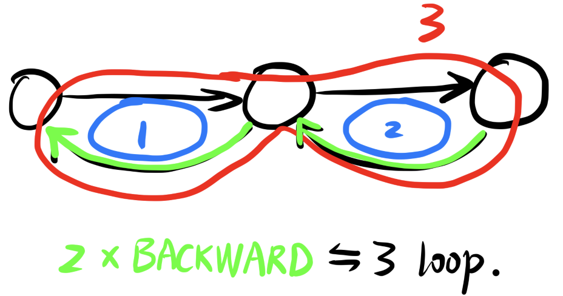

### 左式堆-左右子堆

左式堆中每一对兄弟节点的高度尽管未必“左大右小”，但左兄弟至少不低于右兄弟的一半。

> X。
>
> 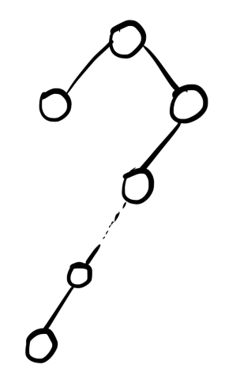

### DFS & 双连通

对于同一无向图，起始于顶点s的DFS尽管可能得到结构不同的DFS树，但s在树中的度数必然固定。

> O。S相当于双连通之中的关节点。s的度数恒等于s作为关节点所分出的双连通分量数。
>
> 

### 左式堆-右侧链

采用Crane算法将左式堆A与B合并为左式堆H，H右侧链上的节点未必都来自A或B的右侧链。

> O。参考教材上的例子。

### 单平方试探

采用单向平方策略的散列表，只要长度M不是素数，则每一组同义词在表中都不会超过$\lfloor M/2 \rfloor$个。

> X。取M=10，n^2%M 有6个取值，大于M/2。
>
> - 0，1，4，9，6(16%10)，5(25%10)。

### LGU的稳定性

经快速划分（LGU版）之后，后缀G中的雷同元素可能调换相对次序，但其余部分的雷同元素绝不会。

> O。每次元素都加在L的末端，因此L保序。
>
> 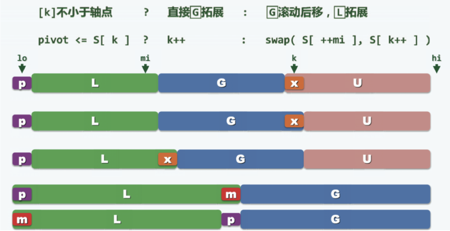

### PFS-`prioUpdater()`

PFS过程中，尽管每一步迭代都可能多次调用`prioUpdater()`，但累计不过`O(e)`次。

> O。

### 希尔排序底层

只要底层的排序算法是正确且稳定的，则`radixSort()`也必然是正确且稳定的。

> O。

### KMP vs. BM

相对于KMP算法而言，BM算法更适合于大字符集的应用场合。

> X。参考习题11-10。

### BST-`remove()`

若调用`BST::remove(e)`将节点r从常规BST中删除，则所需的时间为被删除之前r的深度。

> X。 对于双分支，还可能需要往下修改，最坏情况达到全树的高度（r深度+r的高度）。
>

### 跳转表-期望塔高

在存有n个词条的跳转表中，各塔高度的期望值为$\Theta(logn)$。

> X。塔高期望是O(1)，跳转表的表高期望才是$\Theta(logn)$。
>
> > 表高 = max{塔高}。

### 线性试探

将n个词条逐个插入一个容量为M、采用线性试探策略、初始为空的散列表，n<M，则无论它们的插入次序如何，最终的平均成功查找长度都必然一样。

> O。分类讨论，如果各个同余类不冲突，那么显然不变。如果发生冲突，那么交换冲突的项，查找长度不变。故，ASL总是不变的。
>
> 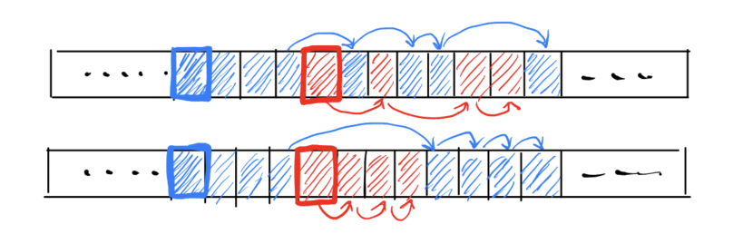

### 红黑树染色

红黑树的插入或删除操作，都可能导致$\Omega(logn)$个节点的颜色反转。

> O。确实**可能**。
>
> 

### 伸展树分摊性能

只有在访问序列具有较强的局部性时，伸展树才能保证分摊$O(logn)$的性能。

> X。习题8-2。伸展树的所有基本接口的分摊复杂度都是$O(logn)$。

### 伸展树单调插入

将{0，1，2，……，2018}插入一棵空的伸展树后若树高为2018，则上述词条必然是按单调次序插入的。

> X。
>
> 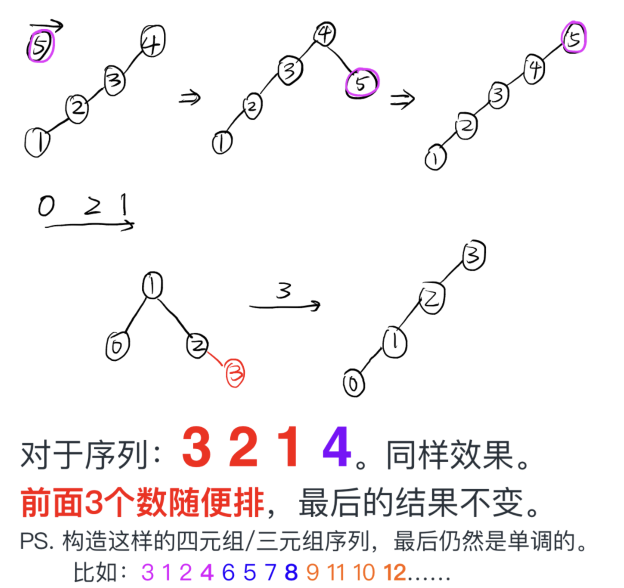

### 多叉堆-`delMax()`

相对于同样规模的完全二叉堆，多叉堆`delMax()`操作的时间成本更低。

> X。只有**三叉堆**效率更高。
>
> 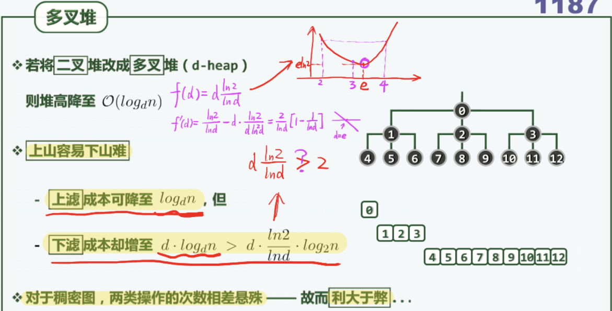

### 双红修正

 在插入操作后若红黑树黑高度增加，则在双红修复过程中仅做过重染色，而无任何结构调整。

> O。 若双红迭代至树根，说明一直是RB-2型，因而不涉及拓扑调整。
>

### 伸展树访问

最底层的叶节点一旦被访问（并做过splay调整）之后，伸展树的高度必然随即下降。

> X。如图，高度不变。
>
> 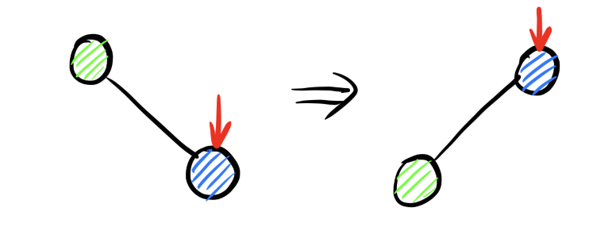

### LUG的交换次数

若输入序列包含$\Omega(n^2)$个逆序对，则快速排序算法（LUG版）至少需要执行$\Omega(nlogn)$元素交换操作。

> X。 如图，总计交换次数是O(n)。
>
> 

### 胜/败者树

胜者树的根节点即是冠军，而败节点的根节点即是亚军。

> X。认为此处的亚军指代**全局亚军**，而不是某轮比赛的亚军。在这种定义下， 可能亚军在与冠军的第1场比赛就被淘汰了。
>
> 

### 希尔排序-`1_sorting`

采用12-C节介绍的任何一种增量序列，`shellSort()`最后的1-sorting都只需要O(n)的时间。

> O。习题12-14-a。

### B树-直接后继

B-树的任一非叶节点内，每个关键码都存在直接后继，且必然来自某个叶节点。

> O。非叶节点，意味着不在底层，则必然存在直接后继，其来自于该关键码处的右分支的最小元。

### BM算法最好情况

无论是单独借助BC[]表或GS[]表，BM算法在最好情况下都只需要$O(|T|/|P|)=O(n/m)$时间。

> O。BC策略改善最好性能，GS策略改善最坏性能。但都可以做到最好$O(n/m)$。
>
> 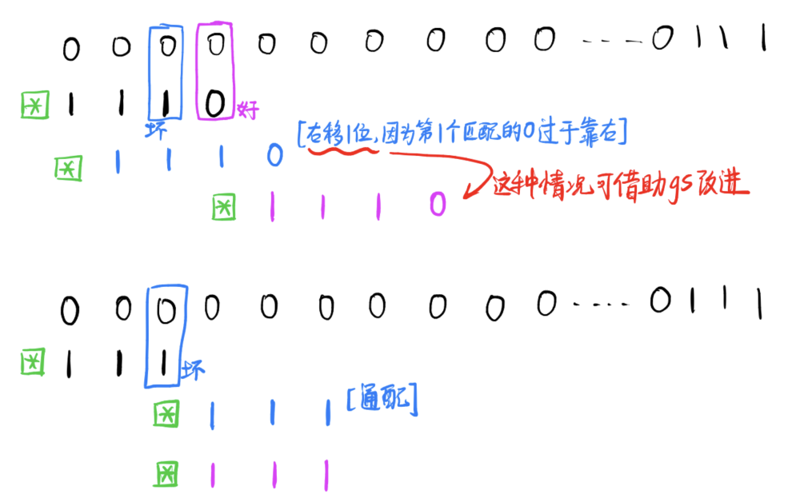

### ***希尔排序-逆序对

`Shellsort()`每按照某个增量做过逐列排序，序列中逆序数的总数都会减少（或持平），但绝不致增加。

> O。未证。

### AVL插入 & 重构

对规模为n的AVL树做一次插入操作，最坏情况下可能引发$\Omega(logn)$次局部重构。

> X。最多一次。
>
> 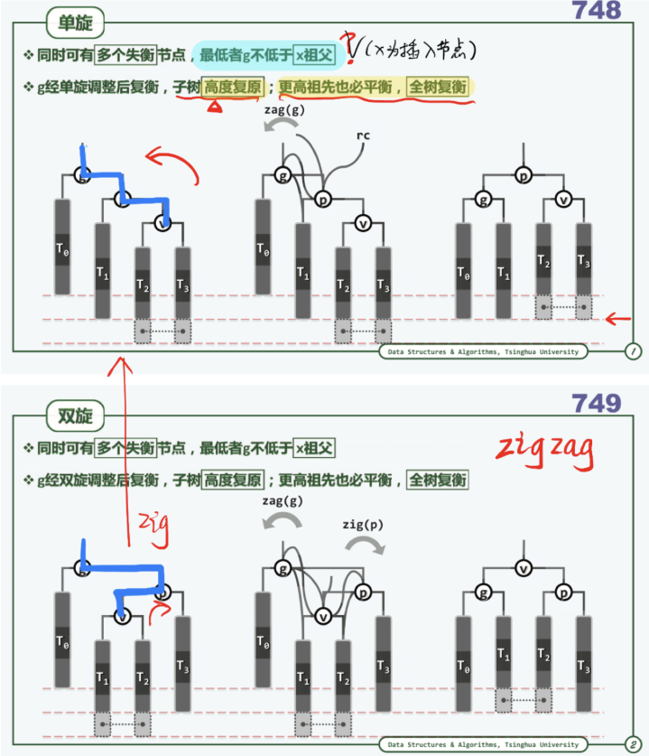

### 完全二叉堆 & PFS

若用完全二叉堆来实现PFS，则各顶点在出堆之前，深度只可能逐步减少（或保持）而不致增加。

> X。注意到删除操作的下滤过程不可避免地涉及到顶点深度的增加。

## ***闭散列证明题

某散列表$H[0,M=2^s)$采用封闭散列策略（初试令c=d=0）；对于任何key，首先试探$H[k%M]$；以下，只要冲突，令$c\leftarrow c+1$再$d\leftarrow d+c$，井继而试探$H[(key+d)%M]$。以$M=2^4=16$为例，关键码key=27的前五个试探位置依次是：11、12、14、1、5；但如同对于平方试探策略，我们首先需要确认，这种试探序列是否总能置盖所有桶单元。若是，请给出证明；否则，试举一（s和key组合的）反例。

> 

## ***多产

计算机科学家往往在多个方面同时有所建树，试以讲义上介绍的算法或数据結构为例，列挙出其中的三位，以及他们各自的两项贡就。请注明在讲义上对应的页码，井作筒要说明（每人每项不超过一行）。

> 

## ***KMP

所谓斐波那契串（Fibonacci Strings），系由字符集$\Sigma = \{'O','X'\}$生成：

$\Phi_0="O",\Phi_1="X",\Phi_2="XO",\Phi_3="XOX",\Phi_4="XOXXO"……$

（对于$k\geq 2$，有$\Phi_k=\Phi_{k-1}\Phi_{k-2}$）

1）以下考察KMP算法的改进版，试列出$\Phi_7$，并计算其对应的查询表：

| j                   | 0    | 1    | 2    | 3    | 4    | 5    | 6    | 7    | 8    | 9    | 10   | 11   | 12   | 13   | 14   | 15   | 16   | 17   | 18   | 19   | 20   |
| ------------------- | ---- | ---- | ---- | ---- | ---- | ---- | ---- | ---- | ---- | ---- | ---- | ---- | ---- | ---- | ---- | ---- | ---- | ---- | ---- | ---- | ---- |
| $\Phi_7[j]$         | X    | O    | X    | X    | O    | X    | X    | O    | X    | O    | X    | X    | O    | X    | O    | X    | X    | O    | X    | X    | O    |
| $improved\_next[j]$ | -1   |      |      |      |      |      |      |      |      |      |      |      |      |      |      |      |      |      |      |      |      |

2）若$|\Phi|\geq 2$，则将$\Phi$末尾的两个字符翻转，得到的串可记作$\Phi'$。比如，$\Phi_5="XOXXOXXO"$。试证明：$\forall k \geq 2, \Phi_{k-2}\Phi_{k-1}=\Phi_{k}'$。

3）试证明：若以$\Phi_k$作为模式串，文本串的某个$T[i]$可能参与$\Omega(k)$次比较。

4）试证明：对于任何模式串P，文本串的每一字符至多会与P中的$O(log\,m)$个字符做比对 ，$m=|P|$。

> 

# 2016期末

## 判断

### AVL旋转

若 AVL 树插入元素的过程中发生了旋转操作，则树高必不变。

> O。AVL树插入失衡后通过调整必恢复原高度（如果没有出现失衡，则树高可能发生改变）。

### 双红修正

若红黑树插入一个元素后，黑高度增加，则双红修正过程中没有拓扑结构变换，只有重染色操作。

> O。当黑高度增加时，只能是一直发生双红修正的RB-2情况，此情况下不会发生“3+4”重构，只会发生重染色（每次染3个，最多染$O(logn)$个）。

### KMP最坏情况

若 KMP 算法不使用改进版的 next 表，最坏情况下时间复杂度可能达到 O(mn)。

> X。KMP最坏情况也能保证线性时间复杂度。

### BST删除

在 BST 中删除两个节点（7B3），则无论先删除哪个节点，最终 BST 的拓扑结构均相同。

> O。7B3是PPT上的章节编号。若两个节点不属于某条直达树底层的直接后继链，则它们的删除互不影响；否则，它们在同一条直接后继链上，

### 完全二叉堆删除

完全二叉堆删除元素在最坏情况下时间复杂度为 O(logn)，但平均情况下仅为 O(1)。

> X。删除时须下滤，而下滤的期望复杂度为$O(logn)$。

### 伸展树分摊

在任何情况下，伸展树总能保持每次操作 O(logn) 的平均复杂度。

> X。习题8-2。伸展树的所有基本接口的分摊复杂度都是$O(logn)$。

### 左式堆-右侧链

对于左式堆 A 和 B，合并后所得二叉堆的右侧链元素一定来自 A 和 B 的右侧链。

> O。参考教材上的例子（P301-图10.18-左式堆合并算法实例）。

### BST理想随机平衡

如果元素理想随机，那么对二叉搜索树做平衡化处理，对改进其渐进时间复杂度并没有什么作用。

> X。BST的理想随机树高有两种计量方式。BBST对于BST的随机组成方式的复杂度改进是有作用的。
>
> 

### 双向平放试探

采用双向平方试探策略时，将散列表长度取作素数 M = 4k + 3，可以极大地降低查找链前 M 个位置冲突的概率，但仍不能杜绝。

> X。能够杜绝。习题9-17。

### 批量建堆

 在使用 Heapify 批量建堆的过程中，改变同层节点的下滤次序对算法的正确性和时间效率都无影响。

> O。习题10-7。

### kd树-search

在 kd-search 中，查找区间 R 与任一节点的 4 个孙节点（假设存在）对应区域最多有 2 个相交。

> O。
>
> 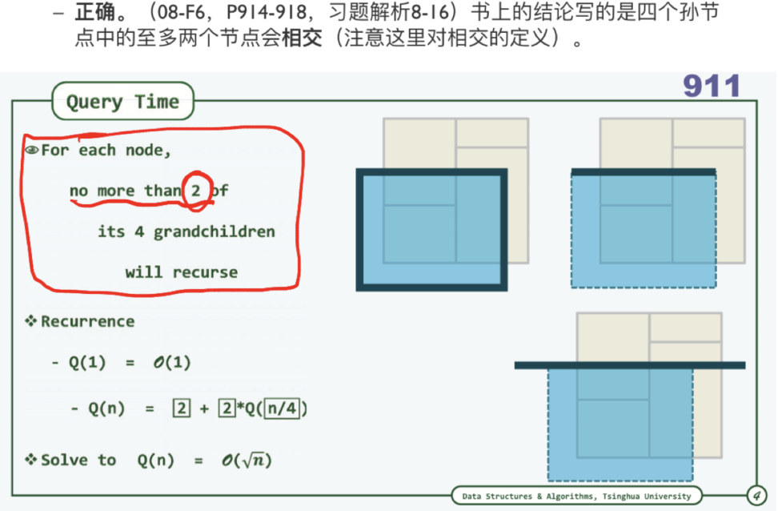

### 跳转表-期望塔高

在 n 个节点的跳转表中，塔高的平均值为 O(logn)。

> X。塔高期望是O(1)，跳转表的表高期望才是$\Theta(logn)$。
>
> > 表高 = max{塔高}。

### 快速排序 & 线性选取

既然可以在 O(n) 时间内找出 n 个数的中位数，快速排序算法 (12-A1) 即可优化至 O(nlogn)。

> O。理论上的确是这样，只不过常系数很大。改善最坏情况的同时，恶化了最好情况。

### B树期望分裂次数

将 N 个关键码按随机次序插入 B 树，则期望的分裂次数为 $O(log^2 N)$。

> X。习题8-6。期望分裂次数为$O(n)$。

### 多叉堆-`delMax()`

与二叉堆相比，多叉堆 delMax() 操作时间复杂度更高。

> 

### 除余法

若元素理想随机，则用除余法作为散列函数时，即使区间长度不是素数，也不会影响数据的均匀性。

> 

### 胜/败者树

与胜者树相比，败者树在重赛过程中，需反复将节点与其兄弟进行比较。

> 

### PFS-`prioUpdater()`

在图的优先级搜索过程中，每次可能调用多次 prioUpdater，但累计调用次数仍为O(e)。

> 

### LUG的交换次数

若序列中逆序对个数为 O(n 2 )，则使用快速排序 (12-A1) 须进行的交换次数为 O(nlogn)。

> 

### 双连通分量

如果把朋友圈视为一无向图，那么即使 A 君看不到你给 B 点的赞，你们仍可能属于同一个双联通分量。

> 

## 选择

### 二叉堆-节点秩

 二叉堆中某个节点秩为 k，则其兄弟节点（假设存在）的秩为（ ）
A. k + 1
B. k − 1
C. k + (−1) k
D. k − (−1) k
E. 以上皆非

> 

### Catalan数

由 5 个互异节点构成的不同的 BST 共有（ ）个
A. 24
B. 30
C. 36
D. 42
E. 120

> 

### 左式堆-左子堆

有 2015 个节点的左式堆，左子堆最小规模为（ ）（不计外部节点）
A. 10
B. 11
C. 1007
D. 1008
E. 以上皆非

> 

### MAD vs. 除余法

与 MAD 相比，除余法在（ ）有缺陷
A. 计算速度
B. 高阶均匀性
C. 不动点
D. 满射性
E. 以上皆非

> 

### BBST-局部结构调整

以下数据结构，在插入元素后可能导致 O(logn) 次局部结构调整的是（ ）
A. AVL
B. B-树
C. 红黑树
D. 伸展树
E. 以上皆非

> 

### KMP vs. 蛮力算法

对小写字母集的串匹配，KMP 算法与蛮力算法在（ ）情况下渐进的时间复杂度相同
A. 最好
B. 最坏
C. 平均
D. 以上皆非

> AC。蛮力最坏$O(mn)$。

### GS表-`gs[0]=1`

 对随机生成的二进制串，gs 表中 gs[0]=1 的概率为（ ）
A.$\cfrac{1}{2^{m} }$
B.$\cfrac{1}{2^{m-1} }$
C.$\cfrac{1}{2^{m+1} }$
D.$\cfrac{1}{m}$

> 

### 高级树-线性空间复杂度

以下数据结构，空间复杂度为线性的是（ ）
A. 2d-tree
B. range tree
C. interval tree
D. segment tree
E. 以上皆非

> 

### B树高度范围

人类拥有的数字化数据数量，在 2010 年已达到 ZB(2 70 = 10 21 ) 量级。若每个字节
自成一个关键码，用一颗 16 阶 B-树存放，则可能的高度为（ ）
A. 10
B. 20
C. 40
D. 80
E. >80

### BST-合法查找序列

在 BST 中查找 365，以下查找序列中不可能出现的是（ ）
A. 912, 204, 911, 265, 344, 380, 365
B. 89, 768, 456, 372, 326, 378, 365
C. 48, 260, 570, 302, 340, 380, 361, 365
D. 726, 521, 201, 328, 384, 319, 365

> 

## DFS证明题

在有向图 G 中，存在一条自顶点 V 通向 u 的路径，且在某次 DFS 中有 dTime[v]<dTime[u]，则在这次 DFS 所生成的 DFS 森林中，v 是否一定是 u 的祖先？若是，请给出证明；若不是，请举出反例。

> 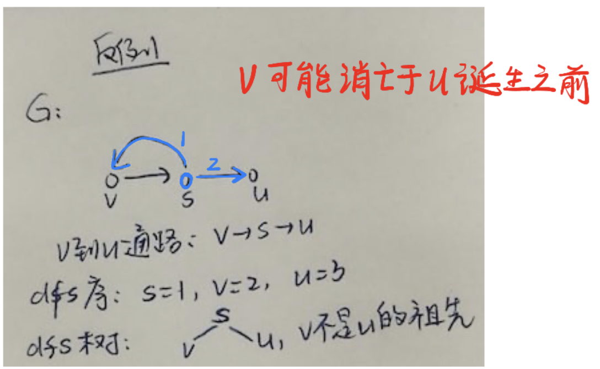

## 闭散列证明题

对闭散列$[0,M)$，$M = 2^S$ ，采用如下冲突排列解决方法：
• 初始时，$c = d = 0$
• 探查 key 冲突时，$c ← c + 1, d ← d + c$，探查 $H[(key+d)\%M]$
则这种算法是否可以保证空间能被 100% 利用？若是，请给出证明；若不是，请举出反例。

> $\cfrac{(j+i+1)(k-1)}{2}\%M=0$，又$j+i+1,\,j-i$必一奇一偶，$\cfrac{j-i}{2}<\cfrac{j+i+1}{2}<M$，矛盾。

## 二叉树查找（剪枝）

 在不改变 `BST` 和 `BinNode` 定义的前提下（`BinNode` 仅存储 `parent`, `data`,` lc`,`rc`），设计算法，使得从节点 `x` 出发，查找值为 `Y` 的节点 `y` 的时间复杂度为 $o(d)$，`d` 为节点 `x` 与 `y` 的距离。要求利用树的局部性，复杂度与总树高无关，否则将不能按满分起评。
函数定义式：参量为 `BinNode x,y,T`，返回值为 `BinNode` 类型，函数名 `fingerSearch`
(a) 说明算法思路
(b) 写出伪代码
(c) 在图中画出由值为 6 的点查找值为 17 的点的查找路径
(d) 说明算法时间复杂度为 O(d)（若无法达到，说明困难在哪）

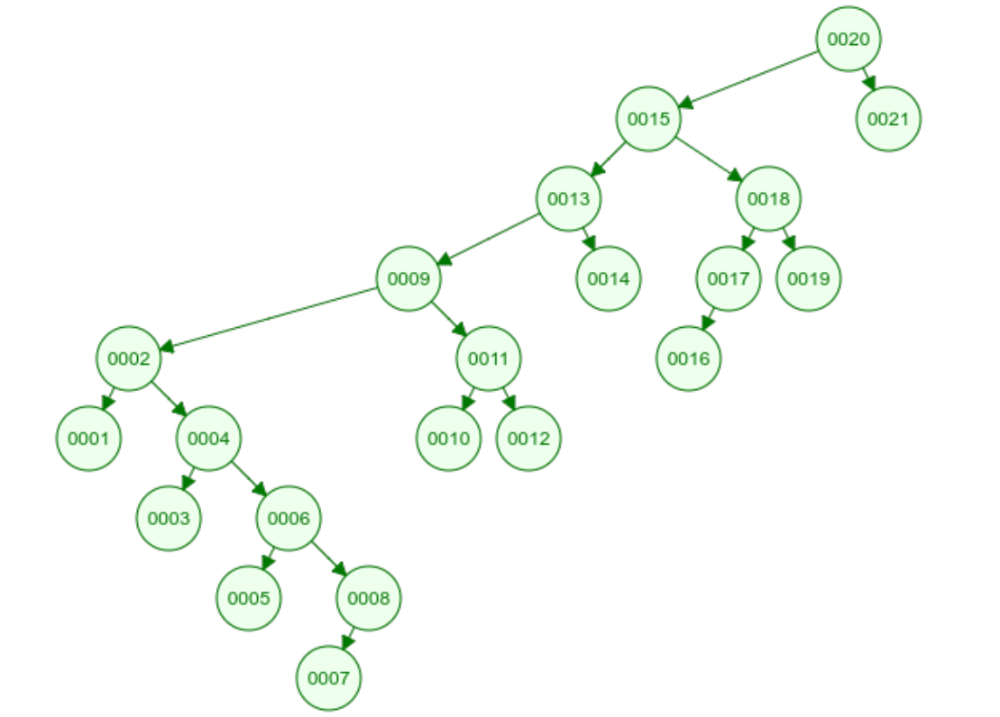

> 注意到父节点的**剪枝**作用。
>
> 

# 2014期末

# 2014期中

# 2014样卷

# 2012期末

# 2012期中

# 2011期中

# 2010期末

# 2010样卷

# 20xx 超古代