# References

[关于清华计算机专业基础综合（912）的复习](https://xuanxuanblingbling.github.io/life/study/2018/12/29/)

[2017年清华大学计算机科学与技术系考研小结](https://blog.csdn.net/chr1991/article/details/64971113)

[T大在线编程题汇总](https://www.nowcoder.com/kaoyan/retest/1001)

> *本文档推荐采用 [Typora](https://typora.io/) 进行编写 / 阅读。*

# 考点整理

> ~~此处容易**<font color=red>过拟合</font>**。~~
>
> 小题1颗★，大题3颗★。

## 数据结构

| 考点                       | 2020                   | 2019   | 2018  | 2017   | 2016 |
| -------------------------- | :----- | :---- | :----- | :--- | -------------------------- |
| BBST（红黑/AVL/Splay/B树） | ★★★ | ★★     | ★★★★  | ★★     | ★★   |
| 散列表                     | ★                    | ★      | ★★    | ★      | ★★★  |
| BST遍历/PFS          | ★★★★x2 | ★★★★★★ |       | ★★★★★★ | ★★★×3 |
| 排序（冒/插/选/基/归/锦/败、CBA） | ★★★★ | ★★★★★  | ★★    | ★★★★   | ★★ |
| 串匹配（KMP/BM）           | ★★         | ★★     | ★★    | ★      |      |
| 复杂度                     | ★                    | ★      | ★★    | ★      |      |
| 编码树（Huffman/PFC）      | ★     | ★      | ★     | ★      |      |
| RPN                        | ★                       | ★      | ★     | ★      |      |
| 减治                       |                        |        | ★★★   |        | ★★★ |
| Catalan                     | ★                    | ★      |       | ★      |      |
| 堆（完全、左式堆）            | ★★★★★      | ★      | ★★    |        |      |
| 栈（调用栈、栈混洗）    |     | ★      |       |        | ★    |
| Dijkstra算法               |                | ★      |       |        | ★    |
| 跳转表 | ★ | | | |  |
| 二分、Fib查找              |               |        | ★★★★★ |        |      |
| 最小生成树（Prim） |  |        |       |        | ★★★  |
| 非法表达式                 |                  |        | ★     |        |      |
| 逻辑地址                   |                    |        |       |        | ★    |

## 操作系统

| 考点                 | 2020 | 2019 | 2018  | 2017 | 2016 |
| -------------------- | ---- | :--: | :---: | :--: | :--: |
| uCore代码            | ★★★  | ★★★★ |  ★★★  | ★★★  |      |
| 虚/实地址(转换/扩展) |      | ★★★  |  ★★★  | ★★★  |      |
| 进程控制/系统调用    | ★★★★ |      |  ★★★  |  ★   |  ★   |
| 管程                 |      |      | ★★★★★ |  ★   |      |
| belady               | ★    |      |  ★★★  |  ★   |      |
| x86硬件              | ★    |  ★★  |       |  ★   |      |
| 信号量               | ★    |  ★   |   ★   |      |      |
| 死锁                 | ★    |  ★   |       |      |  ★   |
| 线程                 |      |  ★   |       |  ★   |  ★   |
| 文件系统             | ★★★  |      |       |      | ★★★  |
| 调度算法             | ★    |      |   ★   |      |      |
| 僵尸/孤儿进程        |      |  ★   |   ★   |      |      |
| 中断                 |      |  ★   |       |  ★   |      |
| Cache                | ★    |      |       |      |  ★   |
| 哲学家就餐           |      |      |  ★★★  |      |      |
| 硬/软链接            |      |  ★   |       |      |      |
| stride算法           |      |  ★   |       |      |      |
| x86特权级            |      |  ★   |       |      |      |
| 优先级反置           |      |      |   ★   |      |      |
| 伙伴系统             |      |      |   ★   |      |      |
| 自旋锁               |      |      |   ★   |      |      |
| 动态分区算法         |      |      |       |  ★   |      |
| RAID                 |      |      |       |  ★   |      |

## 组成原理

| 考点              | 2020 | 2019 | 2018 | 2017 | 2016 |
| ----------------- | ---- | :--: | :--: | :--: | :--: |
| 流水线相关计算    | ★★★★ | ★★★  | ★★★  |      | ★★★  |
| 流水线冲突        | ★    | ★★★  |  ★★  | ★★★  |      |
| 浮点数表示        | ★    |  ★   |  ★   |  ★   |      |
| Cache缺失/映射    | ★★   |  ★   |  ★★  |      |      |
| RAID              | ★    |  ★★  |  ★   |      |      |
| 补码表示          | ★    |  ★   |  ★   |      |      |
| CPU指标(CPI/主频) | ★    |  ★   |  ★   |      |      |
| Cache相关计算     | ★★   |      |      | ★★★  |      |
| 指令的概念        | ★    |      |      |  ★★  |      |
| 异常处理/中断     | ★    |      |  ★   |      |      |
| 虚拟内存          |      |  ★   |  ★   |      |      |
| C语言             |      |  ★   |  ★   |      |      |
| 总线              |      |  ★   |      |  ★   |      |
| 显存带宽计算      | ★    |      |      |      |      |
| RAM               |      |  ★   |      |      |      |
| 冯诺依曼架构      |      |  ★   |      |      |      |
| 时序/组合逻辑     |      |      |  ★   |      |      |
| 海明码检错/纠错   |      |      |      |  ★   |      |

## 计算机网络

| 考点                  | 2020 | 2019 | 2018 | 2017 | 2016 |
| --------------------- | ---- | :--: | :--: | :--: | :--: |
| TCP(拥塞/握手/报文等) | ★★★  |  ★★  |  ★★  |      | ★★★  |
| 路由器计算            |      | ★★★  | ★★★  | ★★★  | ★★★  |
| 信道利用率            |      |  ★   |  ★   |  ★   |      |
| ARQ(停等/后退/选择)   | ★    |  ★   |  ★★  |      |      |
| HTTP                  |      | ★★★  |      |  ★   |      |
| 网桥转发              | ★    |      | ★★★  |      |      |
| ARP                   | ★★★  |      |      |      |      |
| 物理层设备            | ★    |      |      |      |      |
| 调制/解调             | ★    |      |      |      |      |
| 水平分裂              | ★    |      |      |      |      |
| 蜂窝                  |      |  ★   |      |      |      |
| 最小帧长              |      |  ★   |      |      |      |
| 以太网                |      |  ★   |      |      |      |
| 分组转发              |      |  ★   |      |      |      |
| OSI&TCP/IP            |      |      |  ★   |      |      |
| 奈奎斯特定理          |      |      |  ★   |      |      |
| 数据链路层概念        |      |      |  ★   |      |      |
| DNS                   | ★    |      |  ★   |      |      |
| SMTP                  |      |      |      |  ★   |      |
| SNMP                  |      |      |      |  ★   |      |

# 真题

## 2020

### 数据结构

### 操作系统

### 组成原理

### 计算机网络

## 2019

### 数据结构

#### 判断题

##### 复杂度

判断：$n^{logloglogn}=O(\lfloor logn\rfloor!)$

> 令$t=logn$，则
> $$
> \begin{split}
> n^{logloglogn}=\left[{\color{red}{ {(2^t)}^{loglogt} } } \gg2^t\right] \,\,\,&{\color{blue}{ ?} }\,\,\,\,\,
> \,\,\,\,\,\,\,O({\color{red}{ t!} })=O(\lfloor t\rfloor!)=O(\lfloor logn\rfloor!)\\
> 指数置换：{(2^{loglogt})}^{t}={(logt)}^t \,\,\,&{\color{blue}{ ?} }\,\,\,\,\,\,t!\\
> 取对数：\,\,\,\,\,\,\,tloglogt \,\,\,\,\,&{\color{blue}{?} }\,\,\,\,\,\,log(t!)=(0+log2+...+logt)\\
> 放缩：\,\,\,\,\,\,\,tloglogt \,\,\,\,\,&{\color{blue}{\ll} }\,\,\,0.5tlogt（凸函数放小为线性然后求和）\\
> \Longrightarrow\,\,\,\,\,\,\,tloglogt\,\,\,\,\,&{\color{blue}{\ll} }\,\,\,  0.5tlogt<log(t!)\\
> \Longrightarrow\,\,\,\,\,\,\,tloglogt\,\,\,\,\,&{\color{blue}{=} }\,\,\,  O(log(t!))
> \end{split}
> $$
> ~~QAQ~~Q.E.D，命题为**<font color=red>真</font>**。
>
> > 如果没有阶乘号的话，有：$\forall \epsilon>0, logn=O(n^{\epsilon})$。（细枝末节不影响复杂度）参见*习题解答-1-9*。
> >
> > 又有：$log1+log2+...+logn=log(n!)=\Theta(nlogn)\Longleftrightarrow n!=\Theta(n^n)$，参见*课件P52-对数级数*。
> >
> > - 由此可得到更简洁的证明方法：
> >
> > $$
> > \begin{split}
> > n^{logloglogn}=\left[{\color{red}{ {(2^t)}^{loglogt} } } \gg2^t\right] \,\,\,&{\color{blue}{ ?} }\,\,\,\,\,
> > \,\,\,\,\,\,\,O({\color{red}{ t!} })=O(\lfloor t\rfloor!)=O(\lfloor logn\rfloor!)\\
> > 指数置换：{(2^{loglogt})}^{t}={(logt)}^t \,\,\,&{\color{blue}{ ?} }\,\,\,\,\,\,t!\\
> > {(logt)}^t=O(t^t)&=O(t!)
> > \end{split}
> > $$
> >
> > **原题**：参见*具体数学-P410-热身题-9.2-b*（推荐练习一波）
> >
> > - 哪个函数增长得快：$n^{\ln\ln\ln n}还是(\ln n)!$？
> >   - 原题解析：$n^{\ln\ln\ln n}\ll (\ln n)!\ll n^{\ln\ln n}$.（~~就只有这么一点orz~~）
> >
> > 练习：[算法导论 — 思考题3-3 根据渐近增长率排序](https://blog.csdn.net/yangtzhou/article/details/89164355)
> >
> > 
> >
> > >  在下面的表格中，表格上层的函数比下层的函数增长要快，表格同一行中的函数互为ΘΘ关系。 
> > >
> > > 

##### Huffman编码

判断：交换哈夫曼树的不同深度的节点，编码长度必然改变

> 特殊：考虑一个**所有节点的频率相同**的情况，那么任意交换节点编码长度不变。
>
> 因此问题转化为：***不同深度的节点是否频率一定不同？***
>
> 构造反例：（3个频率相同的节点）
>
> 
>
> Q.E.D，命题为**<font color=blue>假</font>**。

##### KMP算法

判断：即使不使⽤改进的 next 表，kmp 依然可以达到线性的时间复杂度

> 此为书上原话，P315页11.3.8节”继续改进“-第一段：*尽管以上KMP算法已可保证线性的运行时间，但在某些情况仍有进一步改进的余地。*11.3.7节则给出了线性复杂度的性能分析。
>
> Q.E.D，命题为**<font color=red>真</font>**。

##### Splay树

判断：对于不符合局部性原理的访问，splay 的分摊复杂度不是 $O(logn)$

> 对于规模为任意n的（**逐层**）伸展树，只要按关键码单调的次序，周期性地反复进行查找，则无论总的访问次数m>>n有多大，就分摊意义而言，每次访问都将需要o(n)时间。
>
> Q.E.D，命题为**<font color=red>真</font>**。（双层为**<font color=blue>假</font>**）
>
> > 参见*教材-8.1.2最坏情况-P204*（注意这个是逐层伸展才这样，**双层**策略（含羞草）则可以保证 $O(logn)$）
> >
> > 这里的局部性原理是指：刚被访问的数据（附近），极有可能很快被**再次**访问。

##### 二叉树重构

判断：对于⼆叉树，通过先序遍历和后序遍历不能确定其层次遍历

> 首先考虑问题：`先序+后序`是否唯一确定二叉树？（并不能）
>
> - 问题的证明可参考：[*MOOC-二叉树-重构-3*](https://www.xuetangx.com/courses/course-v1:TsinghuaX+30240184+sp/courseware/16d8402a24fd4429a8a7cc1c8401cb1f/b3fdcad4c3a84a8a861003eaa8b5965c/)
>   - (先序|后序|层次)+中序
>   - **(先序+后序)&&真二叉树**
>
> 对于真二叉树，先序+后序对应唯一二叉树，显然成立。
>
> 对于非真二叉树：
>
> - 给定确定的先序和后序序列，需要考虑两个序列同时固定时，二叉树能发生怎么样的变化。
> - 只有孩子为1个的节点才可能发生变化。（单个孩子先序和后序遍历的结果一致）
>   - 左孩子$\longrightarrow$**<font color=purple>右孩子</font>**
>   - **<font color=purple>左孩子</font>**$\longleftarrow$右孩子
> - 因为**变化在同一层且不发生位置交换**，所以层次遍历也不变
>
> 
>
> Q.E.D，命题为**<font color=blue>假</font>**。先序+后序**能确定**层次遍历。
>
> **解法2**：（递归生成法）
>
> - 任意给定先序序列和后序序列（`V[root], L[left], R[right]`）
> - 先序：`VL****R****`；后序：`****L****RV`
>   - 有两个孩子？
>     - 局部等价于真二叉树
>     - 确定层次遍历`VLR********`
>     - 递归`L****`和`R****`
>   - 只有一个孩子？
>     - 退化为`VL****`和`****LV`（特判一下两个序列的第2个和倒数2个元素是否相同）
>     - 确定层次遍历`VL****`
>     - 递归`L****`
> - 因为可以递归生成唯一的层次遍历，显然就确定了层次遍历序列
>
> > [先序遍历和后序遍历为什么不能唯一地确定一棵树？](https://blog.csdn.net/GYQJN/article/details/52709912)

##### Catalan数

判断：对于叶节点为 2019 的真⼆叉树，其数量**⼩于** 2018 对括号所组成的合法表⽰式数量

> 叶节点为 2019 的真⼆叉树的个数 = $C_{2018}$。（等效于2018个内部节点）
>
> 2018 对括号所组成的合法表⽰式数量 =  $C_{2018}$。两者相等。
>
> Q.E.D，命题为**<font color=blue>假</font>**。
>
> > [**卡特兰数— 计数的映射方法的伟大胜利**| Math173](https://www.google.com/url?sa=t&rct=j&q=&esrc=s&source=web&cd=9&ved=2ahUKEwjWqJiesubgAhXwwosBHSnACLEQFjAIegQIBhAB&url=http%3A%2F%2Flanqi.org%2Finterests%2F10939%2F&usg=AOvVaw0FIR5VllhrOlM-_DNiqnfz)
> >
> > [【卡特兰数】有N对括号，输出所有合法的组合](https://blog.csdn.net/ffmpeg4976/article/details/42340379)
> >
> > [从《编程之美》买票找零问题说起，娓娓道来卡特兰数——兼爬坑指南](https://www.cnblogs.com/wuyuegb2312/p/3016878.html)

##### 层次遍历

判断：对于叶节点数量为 2018 的⼆叉树，层次遍历队列容量必然⼩于 2018

> 层次遍历队列的容量应该不小于最大的某一层的元素数。
>
> 2018的叶节点的二叉树，一层的元素数最大可以**等于**2018。（不能大于）
>
> 
>
> Q.E.D，命题为**<font color=blue>假</font>**。
>
> > 相似题目：*习题解答-5-18*
> >
> > - 设二叉树共含n个节点，则辅助队列的容量应该不低于n/2。
> >
> > 层次遍历的每一步都对应着一个二叉树（原二叉树的子二叉树）。
> > 给定二叉树，所有的[层次遍历子二叉树]中叶子节点的最大值就是队列最小容量。
> >
> > **任何遍历过程都对应着树的一种生长模式**。
>
> 注：本题在2014年期中试卷3-2上出现，稍微不同。
>
> 
>
> > 1007，2。（见习题5-19）

##### 插入排序

判断：插⼊排序每次插⼊数据，即使不增加循环节，也不⾄减少

> 问的是循环节的个数。
>
> - 对于任意一个有序前缀，插入排序后循环节数目不变。（显然）
> - <font color=red>`总循环节数` = `元素归位数` + `非归位循环节数`</font>。
>
> 构造反例：`6 5 4 3 2 1`（逆序列）
>
> - 初始有3个循环节
>
> 
>
> Q.E.D，命题为**<font color=blue>假</font>**。
>
> > 相似题目：*习题解答-3-14*（**选择排序**循环节）
> >
> > 
>
> 要认识循环节的数学定义，需要了解“[置换](https://vel.life/%E6%8A%BD%E8%B1%A1%E4%BB%A3%E6%95%B0%E5%9F%BA%E7%A1%80/#%E7%BD%AE%E6%8D%A2%E7%BE%A4)”的概念。

##### 逆序对

判断：交换两个逆序对，必然会减少总逆序对数

> 认为题意是`交换构成逆序对的两个元素`。
>
> 首先给出引理：
>
> - 左端点降低，或右端点升高，逆序对总数一定不增。（这是显然的）
>
> 交换逆序对的过程可以等价转化为：（逆序对区间外的逆序是不受影响的，因此可以只分析内部区间）
>
> 
>
> 又注意到，在上述过程（两个`不增变换`）完成后，端点不再构成逆序对。
>
> - 因为不增，所以只要出现了下降，就一定会保持。
>
> 因此，交换逆序对后，总逆序对数至少减少1个。
>
> Q.E.D，命题为**<font color=red>真</font>**。

##### 基数排序

判断：如果基数排序底层采⽤不稳定的算法，那么得到的结果可能是不正确的

> 因为排序是按位**`多步`排序**，必须保证下一次的排序不影响上一次的排序结果。
>
> 如果底层不稳定，那么很可能导致之前排序的结果丢失。（每次只关注某一位）
>
> Q.E.D，命题为**<font color=red>真</font>**。
>
> > 参考：*算法导论-8-3-基数排序*

##### 函数调用栈

判断：函数的调⽤栈中如果有相同的函数，则他们必然紧邻

> 考虑循环调用：（显然不必紧邻）
>

```c++
int a(){ return b();}
int b(){ return a();}
int main(){ a();}
```

> Q.E.D，命题为**<font color=blue>假</font>**。
>
> > 参考：*教材-4.2.1-函数调用栈*

##### 堆

判断：如果插⼊的关键码独⽴均匀分布，堆的插⼊操作平均O(1)

> 认为题目问的是完全二叉堆。
>
> 由于完全二叉堆插入采用上滤操作，并且每一层的节点数是指数型的，因此若完全随机地插入，则只期望上升1层。
>
> Q.E.D，命题为**<font color=red>真</font>**。
>
> > 参考：*习题解答-10-6*

#### 简答题

##### 逆波兰表达式

逆波兰表达式的优点？既然中缀转换为逆波兰就需要可以计算出表达式值，那**逆波兰意义何在**？

> RPN的运算符优先级表述能力强，计算效率高。
>
> 意义如下：（因为转换表达式只需一次，而求值可能多次）
>
> 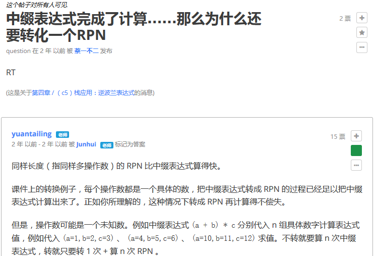
>
> 参考：*教材-4.3.4-逆波兰表达式-P97*

##### DFS

DFS 中何时标记前向边？何时标记后向边？

> 前向边：从祖先指向后代。
>
> 后向边：从后代指向祖先。
>
> > RT所示。
>
> 

##### 败者树

相⽐锦标赛排序，败者树的优势是？

> 重赛过程中不必在左右子树之间来回访问内存，时间效率高。
>
> 
>
> 参考：*PPT-P1181*

##### BBST

试举出红⿊树优于 AVL 树的场景，红⿊树相⽐ AVL 树的优势

> AVL树需要维护平衡因子，而红黑树仅需要对节点重染色。
>
> 在删除操作中，AVL树需要$O(logn)$次旋转，而红黑树的重染色分摊复杂度仅O(1)，并且拓扑结构的重构也只需O(1)。红黑树在持久性、历史版本的维护上具有优势。
>
> > 参考：*教材-8.3-红黑树-P227*，*PPT-P824、P861*

##### 散列表

相⽐开散列，闭散列的优势，试举例说明两点。

> 单独开辟一块**连续**空间，可充分利用系统缓存，提升访存效率。（局部性）
>
> 结构**简单**，算法易于实现，不易出错。
>
> > 参考：*PPT-P1034*，*教材-9.3.6-闭散列策略-P268*

##### 排序

相⽐选择排序，插⼊排序的优势，试举例说明两点。

> RT。就地、在线、输入敏感。
>
> 
>
> > 参考：*PPT-P275*

##### Dijkstra算法

对于稠密图，迪杰斯特拉应该使⽤多叉堆替换⼆叉堆，为什么？多叉堆分叉数 m 怎么确定？

> RT。
>
> 
>
> 
>
> > 参考：*PPT-P1185、P1187*

##### KMP算法

在何种情形下,KMP 优于蛮⼒算法，为什么？

> 单次匹配概率越大（字符集越小）的场合，KMP的优势越明显；否则与蛮力算法的性能相差无几。
>
> 参考：*PPT-P1262*

#### 算法大题（二分法）

返回后序遍历的第 K 个节点，时间复杂度不超过树 x 的深度，$Ο(depth(𝑥))$

```c++
struct BinNode{
    int size; //当前节点和孩⼦总数
    BinNode *lchild,*rchild;
};
BinNode *rank(BinNode* t, int k){
    //有效代码⾏数不超过 12 ⾏
    //不要尝试模拟后序遍历，时间复杂度会超时。
}
```

⼀，给出具体算法实现。

> 快速选取算法（默认k是有效值）

```c++
BinNode *rank(BinNode* t, int k){
    if(t->size == k) return t;
    int num = 0;
    if(t->lchild != NULL) num = t->lchild->size;
    if(num < k)
        return rank(t->rchild, k - num);
    else
        return rank(t->lchild, k);
}
```

> 尾递归改写

```c++
BinNode *rank(BinNode* t, int k){
    while(t->size != k){
        int num = 0;
        if(t->lchild != NULL) num = t->lchild->size;
        if(num < k){
            k -= num;
            t = t->rchild;
        } else{
            t = t->lchild;
        }
    }
    return t;
}
```

⼆，解释你的算法。

> 参考快速选取算法。*教材12.2-选取与中位数*

三，分析时间复杂度和空间复杂度。

> 不变性：算法每步必定下降一层，递归深度不超过$Ο(depth(𝑥))$。
>
> 时间复杂度：$Ο(depth(𝑥))$。
>
> 空间复杂度：$Ο(depth(𝑥))$。（调用栈大小，迭代版则可以达到O(1)就地）
>
> > 迭代改写参考*习题解答-12-6* ~~（滑稽~~

### 操作系统

#### 填空题

##### stride调度算法

stride调度算法中，进程分配时间和其优先级成反⽐，优先级越低进程上CPU运⾏的时间就会更长，⽤⼋位⽆符号数来表⽰进程A的运⾏时间有可能会溢出，但是当步长s [1] 127时，只要做⼩⼩的技巧就仍可以正确判断时间，然后又引⼊进程B，a为A的stride，b为B的stride，当sign(a-b) [2] 时说明A正在运⾏，此时a+s [3] 256；当sign(a+s-b) [4] 0时，轮到B运⾏。

> 对于8位无符号数：MAX=256。
>
> [1]：`<=`。最大步进S<=有符号最大值=127。
>
> - 由于要保证`sign(a+s-b)`的结果正确，其实就是保证`a+s-b`作为有符号数不会溢出，即`a+s-b<=127`。又由于`sign(a+s-b)`只可能出现在A被调度之后，即意味着`a<=b`，故`a+s-b<=s+0=s<=127`。
>
> [2]：`<=0` 。`sign(a-b)<=0` 等价于 `a-b<0` 等价于 `a<b` 等价于 `A优先`。【等号不太确定】
>
> [3]：`<`， A正在运⾏时，A的stride还没有溢出。
>
> [4]：`>`。A经过执行后的理论stride=a+s大于理论b的stride=b，则转为调度B。
>
> - 注意a+s-b的结果整体在计算过程中当作有符号数。比如，`sign(254+2-255)=sign(1)>0`。
>
> > 源自ucore lab6。实验指导书P287-提问2。
> >
> > 【最大步进】https://blog.csdn.net/jasonyuchen/article/details/77099324
> >
> > > 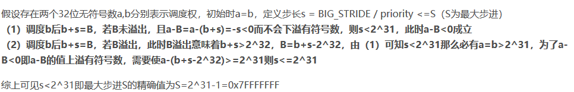
> > >
> > > **https://piazza.com/class/i5j09fnsl7k5x0?cid=357**
> > >
> > > > 无符号整数ab作为两个stride
> > > > **假设开始的时候a=b，之后b先增加。如果b没有溢出的话，此时a-b<0，之后应该轮到a增加**，此时是成功的。 如果b溢出了话
> > > > 首先看到schedule/default_sched.c中有一句 #define BIG_STRIDE **0x7FFFFFFF**
> > > > 因为stride每次的增量都是 BIG_STRIDE / priority，所以stride每次最大的增量不会超过BIG_STRIDE 
> > > > 那么因为b溢出了，所以b在溢出之前，ab相等，且无符号大于0x7FFFFFFF
> > > >                 在b溢出之后，a仍然保持原来大于0x7FFFFFFF，b小于0x7FFFFFFF
> > > >                 且a-b无符号大于0x7FFFFFFF（因为b的步进值小于0x7FFFFFFF），也就是有符号小于0，仍然是成功的   **所以问题的关键就在于#define BIG_STRIDE 0x7FFFFFFF这个值必须是有符号整数的最大值，这个是保证stride不会出错的原因**
> > > > 举个例子，把BIG_STRIDE增大，BIG_STRIDE=0xE0000000
> > > > 那么初始令a=b=0xE0000000，b先前进0xE0000000，b变为0xC0000000，此时就有a-b>0，stride算法就错了
> > > >
> > > > > [Yong XIANG](https://piazza.com/class/i5j09fnsl7k5x0?cid=357#)[4 years ago](https://piazza.com/class/i5j09fnsl7k5x0?cid=357#)这是一个优秀的回答。相关内容可能在期末考试中出现。
> > > >
> > > > 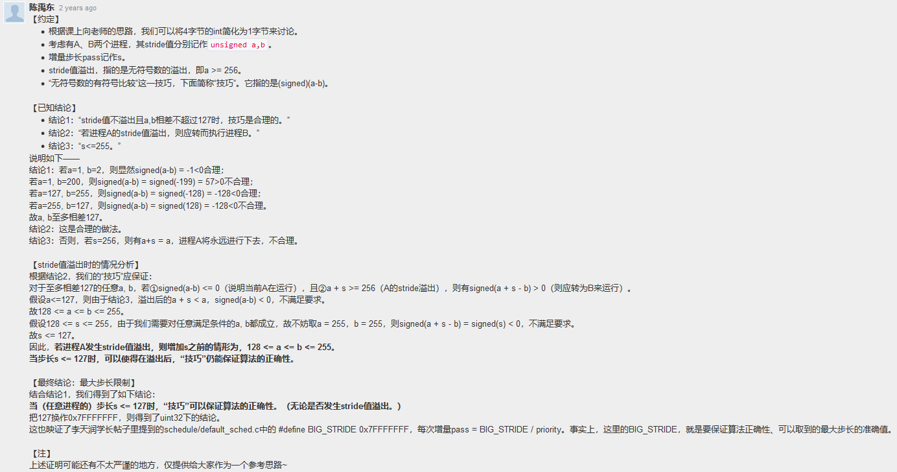

##### x86特权级

CPL<=DPL[门]和CPL>=DPL[段]， [5] 表⽰请求时可以和门特权级相同， [6] 表⽰请求时应低于段的特权级。

> [5]：CPL<=DPL[门]，[6]：CPL>=DPL[段]。PPT上有。~~猜也能猜出来~~。

##### 僵尸/孤儿进程

⽗进程先退出，还未退出的⼦进程被称为 [7] 。⼦进程退出时，其⽗进程还没wait，此时⼦进程被称为 [8] 。

> 孤儿进程，僵尸进程。
>
> 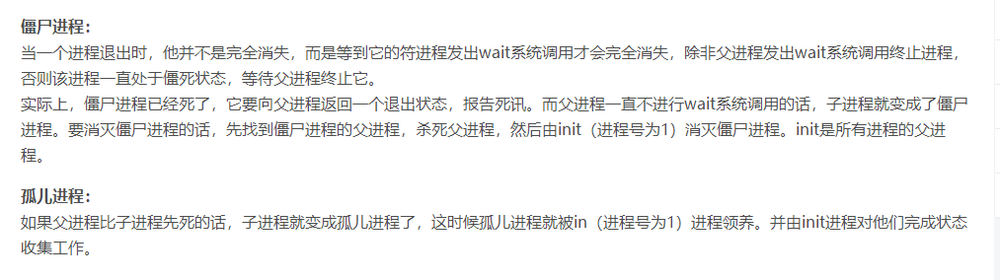
>
> 
>
> >  https://www.cnblogs.com/Anker/p/3271773.html
> >
> >  https://blog.csdn.net/Y1013768371/article/details/88928031 
> >
> >  似乎没有在课上提到。
> >
> >  > 在MOOC-16.2 调度算法支撑框架 中有提到。`proc.c:init_main`负责所有孤儿子进程的回收。
> >
> >  在课后练习中提到https://piazza.com/class/i5j09fnsl7k5x0?cid=1030。
> >
> >  >  1（不用回答）理解 孤儿进程和僵死进程的含义
> >  > http://www.cnblogs.com/xiehongfeng100/p/4619913.html
> >  > http://www.cnblogs.com/Anker/p/3271773.html
> >  > https://piazza.com/class/i5j09fnsl7k5x0?cid=753 
>

##### 信号量

代码填空：

```
class Semaphore {
    int sem;
    WaitQueue q;
}
Semaphore::P() {
    [9] ;
    if ( [10] ) {
        Add this thread t to q;
        block(t);
    }
}
Semaphore::V() {
    [11] ;
    if ( [12] ) {
        Remove a thread t from q;
        wakeup(t);
    }
}
```

> P是请求资源，[9]=`sem--`；若剪完sem有`sem<0`，说明一开始信号量=0（无资源），从而阻塞，因此[10]=`sem<0`。
>
> V是释放资源，[11]=`sem++`；如果有进程在等待，则必有`sem<0`，并且此时归还了1个信号量，因此[12]=`sem<=0`。

##### x86硬件-CR3

(5) x86-32CPU的硬件组成，CR3寄存器⽤于存储页⽬录表起始 [13] 。

> **物理**地址。（来自*piazza-04/07/19讨论*）
>
> > 在保护模式下**CPU可以看到的地址都是虚拟地址**，**经过MMU后才会有物理地址**。定位二级页表的事由MMU做。所以CPU不能直接使用物理地址来访问内存，而必须使用虚拟地址来访问。CPU要修改页表项内容时，也是通过虚拟地址来访问的。
> >
> > 在x86-32 CPU上，物理地址可能不是32位的。如，在使用物理地址扩展（PAE）时，物理地址会是36位，使用4KB页面大小的物理页号也就变成24位，于是一个页表项就占了8字节。
> >
> > **CR3属于MMU**的页表管理部分，由于实现地址转换必须要有物理地址定位页目录。所以CR3是物理地址。CR3寄存器中保存的是页目录的起始物理地址，CPU只在地址转换中使用它的内容。
> >
> > > 注：<font color=red>**近几年的考试题目一些是来源于同学们的提问和piazza上的讨论**</font>。（向勇老师）

##### 硬链接/软链接

A是计数为1的⽂件，创建A的硬链接B，再创建A的软连接C，再创建B的硬链D，B计数 [14] , D计数 [15] 。

> 3，3。
>
> 
>
> > 注意C文件存储A的地址，如果删除A，则C文件的链接失效。

#### 判断题

##### x86 页表细节

x86开启了⼆级页表，则⼀级页表可以不在内存中。

> **<font color=blue>假</font>**。一级页表应该在内存中。（一般来说）

##### ucore 时钟中断

ucore时钟中断为10ms，故不能完成 10ms以下的定时。

> **<font color=red>真</font>**。定时需要依靠时钟中断。【存疑】
>
> 注：时钟中断是不可屏蔽中断。

##### 中断向量表

中断向量表中存放着中断门的优先级。

> **<font color=blue>假</font>**。对于中断向量表，实模式下没有特权级的说法，实模式的中断向量表的每一项只有段基址+偏移地址。【存疑】
>
> > 保护模式下的中断向量表又称为中断描述符表，每一项中保存有DPL（即优先级）。
> >
> > 原题大概是“中断门的**特权**级”？
> >
> > > 经指认，原题为**权限**。

##### 死锁/不安全

不安全状态就是死锁状态。

> **<font color=blue>假</font>**。MOOC上讲过。死锁是不安全的真子集。

##### 线程

只有⼀个main函数的程序不能有多个线程

> **<font color=blue>假</font>**。 进程是指一个具有一定独立功能的程序在一个数据集合上的一次动态执行过程。线程是进程的一部分，描述指令流执行状态。  所有的进程都是有≥1个的线程 。
>
> > https://piazza.com/class/i5j09fnsl7k5x0?cid=1189
> >
> > 
> >
> > ~~还是要看piazza~~，orz。

#### uCore大题（线程切换）

ucore进程切换相关源码 尝试说明页表切换代码的位置、堆栈切换代码的位置、switch_to函数中读取2个函数参数的代码部分并注释。（这部分代码我猜应该全部位于kernel/process文件夹下，至少包括proc.h，proc.c和switch.S）

```c++
.text
.globl switch_to
switch_to: # switch_to(from, to)
    # save from's registers
    movl 4(%esp), %eax	 # eax points to from(考卷上故意把这一个注释删了)
    popl 0(%eax) 		# save eip !popl
    movl %esp, 4(%eax)
    movl %ebx, 8(%eax)
    movl %ecx, 12(%eax)
    movl %edx, 16(%eax)
    movl %esi, 20(%eax)
     movl %edi, 24(%eax)
    movl %ebp, 28(%eax)
    # restore to's registers
    movl 4(%esp), %eax 	# not 8(%esp): popped return addressalready
    					# eax now points to to：(考卷上故意把这一个注释也删了)
    movl 28(%eax), %ebp
    movl 24(%eax), %edi
    movl 20(%eax), %esi
    movl 16(%eax), %edx
    movl 12(%eax), %ecx
    movl 8(%eax), %ebx
    movl 4(%eax), %esp
    pushl 0(%eax)		 # push eip
    ret

void proc_run(struct proc_struct *proc) {
    if (proc != current) {
        bool intr_flag;
        struct proc_struct *prev = current, *next = proc;
        local_intr_save(intr_flag);
        {
            current = proc;
            load_esp0(next->kstack + KSTACKSIZE);
            lcr3(next->cr3);
            switch_to(&(prev->context), &(next->context));
        }
        local_intr_restore(intr_flag);
    }
}
```

> 
>
> **页表切换**：
>
> - `lcr3(next->cr3);`：设置CR3为next内核线程的页目录基址。
>
> **堆栈切换**：
>
> - `load_esp0(next->kstack + KSTACKSIZE);`：将esp0内核栈顶指针指向next内核线程的栈顶。
>
> **switch_to**：（汇编代码在kernel/process/switch.S的switch_to中）
>
> - 函数原型：`void switch_to(struct context *from, struct context *to);`即获得from和to两个指针的代码。
> - 根据piazza上的相关分析可知
>   - 调用函数时候，`switch_to(from, to)`翻译成了`pushl to`, `pushl from`, `call switch_to `
>   - 第1个`movl 4(%esp), %eax`：将栈中from的context指针赋给%eax
>   - 第2个`movl 4(%esp), %eax`：将栈中to的context指针赋给%eax（此时已经popl了一次栈顶）
>
> 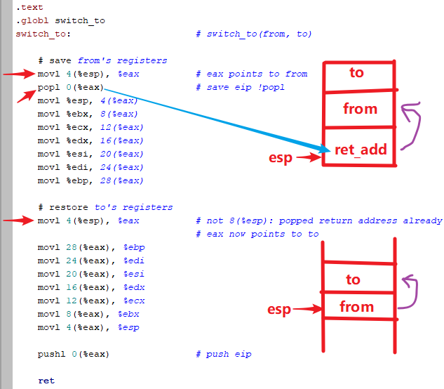
>
> > 该部分的答案在MOOC第13讲-13.4实际操作-1分50秒左右提到。
> >
> > 该部分的详细内容位于实验书的P224（lab4-内核线程-调度并执行内核线程initproc）。
> >
> > 
> >
> >  switch.S: https://github.com/chyyuu/ucorebook_code/blob/18da356a2f3ef90680aca9cc50ef328d1e84585e/code/kern/process/switch.S 
> >
> >  进程上下文及相关定义：  https://github.com/chyyuu/ucorebook_code/blob/18da356a2f3ef90680aca9cc50ef328d1e84585e/code/kern/process/proc.h 
> >
> >  void proc_run(struct proc_struct *proc) 函数：209行 https://github.com/chyyuu/ucorebook_code/blob/18da356a2f3ef90680aca9cc50ef328d1e84585e/code/kern/process/proc.c 

#### 地址转换大题

虚拟页式存储的计算机系统，分别在进程A和B中描述逻辑地址0x64和0x14地址转换过程，要求描述并给出计算过程，给出对应一级页表项，二级页表项和访存单元的物理地址和对应的存储内容

> 这样咋做啊。。
>
> > 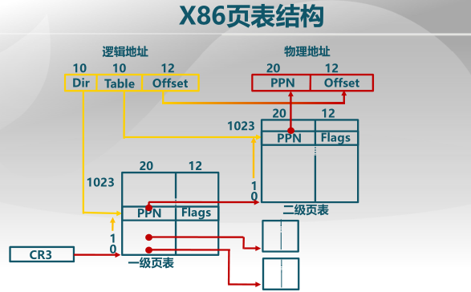

### 组成原理

#### 选择题

##### 磁盘

(1)下列哪⼀项没有容错能⼒
A. RAID0 B. RAID1 C. RAID5 D. RAID6

> A。OS里面讲过。RAID0只是增加了访问带宽，自然没有容错能力。

##### RAM

(2)下列关于静态存储器和动态存储器的描述正确的是
A.静态存储器使⽤触发器，需要定期刷新
B.静态存储器使⽤电容，不需要定期刷新
C.动态存储器使⽤触发器，不需要定期刷新
D.动态存储器使⽤电容，需要定期刷新

> D。常识。

##### 虚存

(3)下列哪个是对的
A．虚拟内存空间⽐实际的地址空间⼤
B．虚拟内存空间⽐实际的地址空间⼩
C．虚拟内存空间连续存放，实际内存⼀定连续存放
D．虚拟内存空间不连续存放，实际内存有可能连续存放

> D。注意是实际的**地址**空间。虚拟内存空间应该等于实际的地址空间。而虚拟存储只是在物理的非连续内存分配（段、页机制）的基础上增加调换功能。

##### 总线

(4)下⾯总线说法哪个正确（）
A.并⾏总线速度⼤于串⾏
B.异步总线速度⼤于同步
C.单总线速度⼤于双总线
D.以上说法均错误

> A。同步总线的特点有高速，单总线的特点是慢。见PPT。
>
> **可能是D**？之前408考试不是说还跟频率有关吗？并行不支持太高频。

##### 流水线

(5)MIPS 五级流⽔中，有哪个数据冲突（）
A.RAR B.RAWC.WARD.WAW

> B。写后读RAW。（可以记成一个单词：raw）

#### 判断题

##### C语言基础

(1) C语⾔中，int x>0 ,则x*x>0

> 错。可能溢出。

##### CPU指标

(2) CPI越少的机器执⾏同⼀个程序的时间越短

> 错。
> $$
> CPU执行时间=\frac{CPI*指令条数}{主频}
> $$

##### 磁盘

(3) 对机械磁盘，读取顺序存储的⽂件⽐随机存储的⽂件快

> 对。涉及到寻道延迟（机械运动），故顺序读取比较高效。

##### 冯诺依曼

(4) 冯诺依曼是数据和指令混合存储的

> 对。显然。

##### 流水线

(5) MIPS五级流⽔线设计中，使⽤充分设置功能单元的⽅法可以改善结构冲突

> 对。结构冲突的起因是资源争用，充分设置资源的方式可以改善结构冲突。
>
> > 功能单元：如，存储器、ALU、寄存器堆等。（软硬件接口-P184）

#### 填空题

##### 补码

(1) +1234的补码为[      ] (⽤⼗六进制，⼩端表⽰)

> 正数的补码=原码。按除基取余法，有`+1234`=`0100 1101 0010`=`0x 04 D2`【大端】=`0x D2 04`【小端】。
>
> > 可以在 *Windows-计算器-程序员* 中验证结果。

##### 浮点数表示

(2) 27.625的IEEE754为[      ] (⼗六进制)

> 除基取余法+乘基取整法，有27.625=27+5/8=`11011.101`=`1.1011101 * 2^4`。
>
> - 符号位：正数，`0`
> - 阶码：移127位（+127），`4`+`127`=`100`+`01111111`=`10000011`
> - 尾数：`1011101……`（23位）
>
> 故IEEE754表示为：`0 10000011 1011101…… `=`0100 0001 1101 1101…… `=`0x41DD0000`。
>
> > 此类型题需要**反复练习**。
> >
> > 浮点数转换验证工具：http://www.styb.cn/cms/ieee_754.php
> >
> > http://www.binaryconvert.com/result_float.html?decimal=27.625

##### 数据冲突

(3) MIPS五级流水线中，解决数据冲突的方法，给出3个.[     ] [     ] [     ]

> 暂停流水线，数据旁路，编译器调度。

##### Cache

(4) 缓存缺失的类型包括，写3个（）

> 必然缺失，容量缺失，冲突缺失，无效缺失。

#### 流水线大题

MIPS 处理器pc输入延迟2ns，寄存器堆输出延迟2ns，内存延迟 10ns，ALU 延迟 6ns，寄存器堆输入延迟1ns，流⽔线寄存器以及多周期锁存器输出延迟为 2ns，要有计算过程。

```
addu rs rt rd
subu rs rt rd
ori rs rt imm
lw rs rt imm
sw rs rt imm
beq rs rt imm
j target
```

1.按照单周期设计，指令内存与数据内存分开，计算指令延迟？
2.按照多周期设计，指令内存和数据内存在同⼀个内存模块，最长和最短的指令延迟分别是指哪条指令，分别计算对应的延迟，以及所需时钟周期数
3.按照五级流⽔线设计，指令内存和数据内存不在同⼀个内存模块，处理器能达到的最大主频是多少？

> （1）
>
> 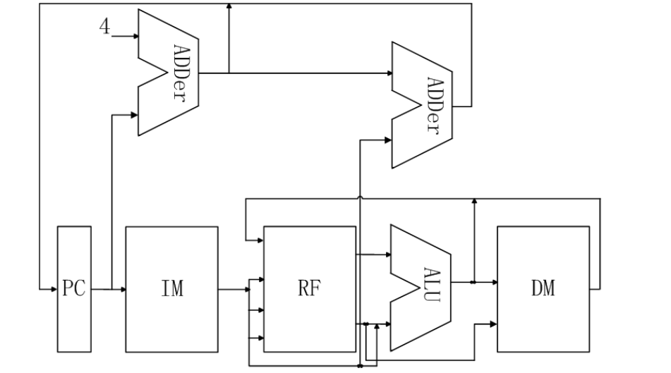
>
> - 本题没有考虑多选器（mux）的延迟。
> - 常规而言，**PC**==pc输入延迟=2ns；**IM**=内存延迟=10ns；**ID**=读寄存器=寄存器堆输出延迟=2ns；**EXE**=ALU延迟=6ns；**MEM**=写数据内存=内存延迟=10ns；**WB**=写寄存器=寄存器堆输入延迟=1ns。指令延迟如下：
>
> | 指令            | IM   | ID   | EXE  | MEM  | WB   | PC   | 延迟 |
> | --------------- | ---- | ---- | ---- | ---- | ---- | ---- | ---- |
> | `addu rs rt rd` | 10   | 2    | 6    |      | 1    | 2    | 21   |
> | `subu rs rt rd` | 10   | 2    | 6    |      | 1    | 2    | 21   |
> | `ori rs rt imm` | 10   | 2    | 6    |      | 1    | 2    | 21   |
> | `lw rs rt imm`  | 10   | 2    | 6    | 10   | 1    | 2    | 31   |
> | `sw rs rt imm`  | 10   | 2    | 6    | 10   |      | 2    | 30   |
> | `beq rs rt imm` | 10   | 2    | 6    |      |      | 2    | 20   |
> | `j target`      | 10   |      |      |      |      | 2    | 12   |
>
> 单周期的指令延迟由最大延迟（LW指令）确定，故延迟为31ns。
>
> > 对于单周期，**<font color=red>`J`型指令</font>**在IF阶段PC需要完成读指令、PC+4（Adder，忽略），它在ID译码阶段只需完成PC高4位和target<<2的拼接工作（**组合逻辑**，时间**可忽略**），然后写回PC。
> >
> > 单周期指令延迟计算如下图所示：（PPT-P429）
> >
> > 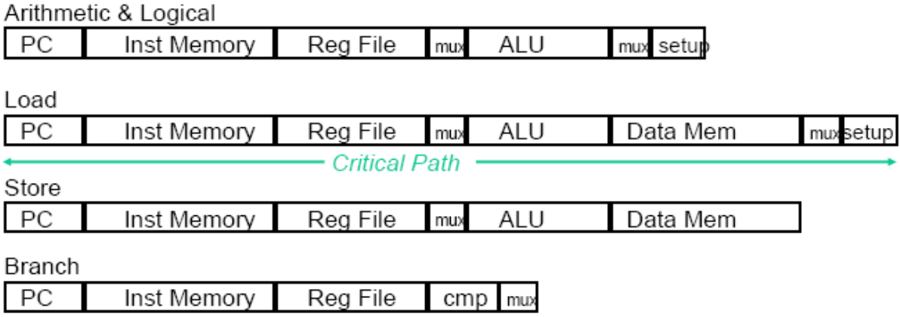
> >
> > 注：在《深入理解计算机系统》上，单周期数据通路（SEQ）的PC在最后更新，多周期数据通路（SEQ+）从时钟周期结束时移到了开始时，因而更适合实现流水线。而在清华《计组PPT》上的多周期数据通路的设计比较容易产生结构冲突（每个周期指令和数据并行，且只有一个存储器），因而采用单周期数据通路的PC计算前移来实现流水线（实际上跟《深》的策略差不多）。
>
> （2）多周期，每段放入锁存器。第2问在考试时其实只需要计算`lw`和`j`的延迟。按照数据通路计算。
>
> 
>
> 
>
> - 取指（IF）：J型指令，Branch指令，ALU指令，LW指令，SW指令
>   - 读指令内存10ns；ALU计算新PC+写回PC=6+2=8ns【并行】
>   - 锁存器=2ns
>   - 总时间=max(10,6)+2=12ns
> - 译码（ID）：J型指令，Branch指令，ALU指令，LW指令，SW指令
>   - 【J型指令在此结束，需要再次写回PC=2ns】
>   - 读寄存器=2ns；【Branch指令还需要ALU计算PC+IMM=6ns，并行】
>   - 锁存器=2ns
>   - 总计=4ns
> - 执行（EXE）：Branch指令，ALU指令，LW指令，SW指令
>   - ALU运算=6ns【Branch指令在此结束，如果满足条件还要写PC=2ns】
>   - 锁存器=2ns
>   - 总计=8ns
> - 访存（MEM）：LW指令，SW指令
>   - 读/写数据内存=10ns【SW指令在此结束】
>   - 锁存器=2ns
>   - 总计=12ns
> - 写回（WB）：ALU指令，LW指令
>   - 写寄存器=1ns【在此结束，无需锁存器】
>   - 总计=1ns
>
> 故，得到
>
> | 指令     | IF   | ID   | EXE   | MEM  | WB   | 指令延迟 | 时钟周期数 |
> | -------- | ---- | ---- | ----- | ---- | ---- | -------- | ---------- |
> | `addu`   | 10+2 | 2+2  | 6+2   |      | 1    | 25       | 4          |
> | `subu`   | 10+2 | 2+2  | 6+2   |      | 1    | 25       | 4          |
> | `ori`    | 10+2 | 2+2  | 6+2   |      | 1    | 25       | 4          |
> | **`lw`** | 10+2 | 2+2  | 6+2   | 10+2 | 1    | 37       | 5          |
> | `sw`     | 10+2 | 2+2  | 6+2   | 10   |      | 34       | 4          |
> | `beq`    | 10+2 | 6+2  | 6(+2) |      |      | 20(+2)   | 3          |
> | **`j`**  | 10+2 | 0+2  |       |      |      | 14       | 2          |
>
> （3）
>
> 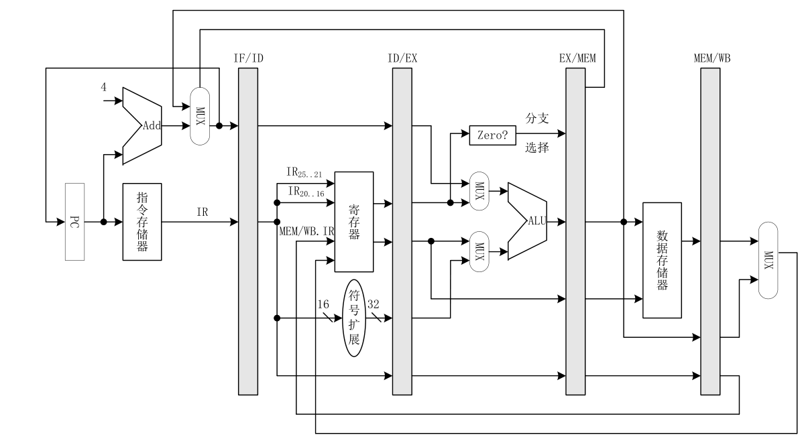
>
> 五级流水线，取每段流水的最长延迟为时钟周期=PC+IM=流水寄存+MEM=12ns。
> $$
> 理论最大主频=\cfrac{1}{12\times 10^{-9}}\approx 83.3MHz
> $$
>
> > 若指令内存和数据内存在同⼀个内存模块，则IF和访存指令（lw/sw）的MEM阶段可能发生结构冲突。只能暂停流水线。故，每遇到一次访存指令，对应暂停一个周期的流水线。（但不改变理论最高主频）
>
> ---
>
> > **<font color=red>PPT对应章节的课（单周期/多周期/流水）必须完全学懂才有可能做对此题</font>**。
> >
> > 【存疑】
> >
> > - 如果考虑pc的输入延迟，pc的输出延迟为何不考虑？
> >   - 很可能是回忆版的不准确。pc的延迟在本质上与锁存器的延迟一致（不必区分输入和输出）。
> >
> >  更新题面：（寄存器堆输出位3ns，pc只考虑输出延迟，五级流水线中指令内存和数据内存在同⼀个内存模块。其它并无本质差异）
> >
> > 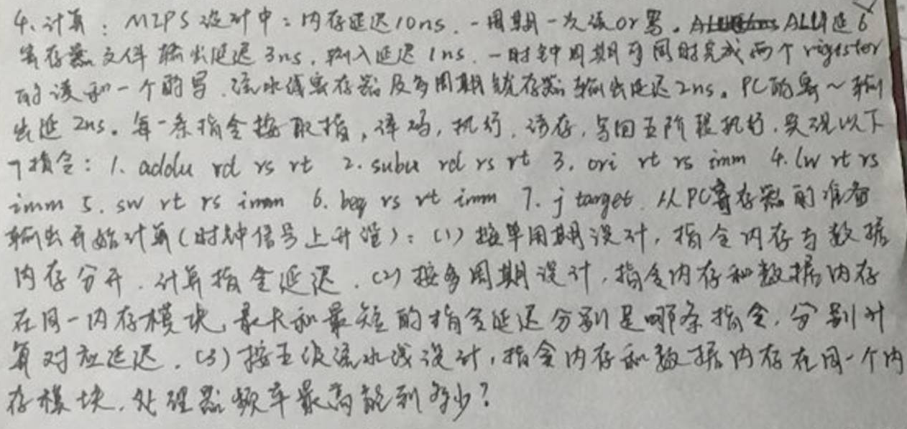

### 计算机网络

#### 选择题

##### 电话网、TCP

电话⽹络和TCP⽹络的性质的⽐较（电话⽹应该是建⽴电路）

> > 电话网，可靠连接，IP电话分别是电路交换，分组交换，报文路径是否固定【选项是以上的组合】 
>
> 电话网采用电路交换，提供有连接可靠服务。
>
> IP电话使用TCP虚电路（分组交换），提供有连接可靠服务；虚电路有临时和永久之分，但在传输过程中路径固定。

##### 蜂窝

蜂窝移动⽹络六边形，频率840HZ，则每个点可⽤最⼤频率

> 本题题意模糊。按照相邻不干扰的原则，可得最大必须分成3组：840/3=280Hz。
>
> > [蜂窝移动网络的课件](http://www.guob.org/course/MC_Chap31.pdf)
> >
> > 
> >
> > 图中可以看出：不同的模型，相同频段的站点距离不同。（最低N可以等于3，此时同频道干扰最大，频率复用率最高）
> >
> > [移动通信的蜂窝小区划分和频率复用](https://www.maixj.net/ict/fengwoxiaoquhuafen-pinlvfuyong-7456)
> >
> > 本题在期末复习题PPT中出现。
> >
> > 

##### 最小帧长

以太网中最短帧长1000bit，两点相距100m,数据在光纤中的传播速率为2*10^8m/s,问最大发送速率
A.1Gb/s B.2Gb/s C.100Mb/s 4.200Mb/s

> A。以太网采用CSMA/CD。对于CSMA/CD，我们有防止碰撞的最小帧长公式
>
> $$
> \cfrac{帧长}{数据率} \geq RTT=\cfrac{2\times100\,m}{2\times10^8m/s}=1\times10^{-6}s
> $$
> 即
> $$
> 数据率 \leq \cfrac{帧长}{RTT} = \cfrac{帧长}{1\times10^{-6}s}
> $$
> 对所有以太网帧成立。因此有
> $$
> 最大数据率 \leq \cfrac{最小帧长}{RTT}=\cfrac{1000\,bit}{1\times10^{-6}s}=1Gb/s
> $$

##### 分组转发

由两端链路构成，给出包大小，数字带宽，传输速率，计算延迟【1.5s 1.6s 2.1s 3.1s】 （两个转发加两个传播）

> 大概如下图？
>
> 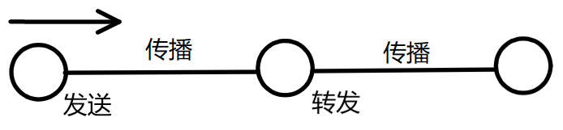
> $$
> 发送时延=\cfrac{包大小}{数据率}，传播时延=\cfrac{距离}{传输速率}
> $$

##### 停等协议

停等协议通信线路利用率最低的是（ ）
A. 源和目的之间距离很近，速度快
B. 源和目的之间距离很近，速度慢
C. 源和目的之间距离很远，速度快
D. 源和目的之间距离很近，速度慢

> C。距离越远总耗时越长，速度越快有效数据传输时间越短，从而$利用率=\cfrac{有效时间}{总时间}$越低。

##### TCP拥塞控制

TCP中，拥塞窗口大小W（窗口为m时发⽣拥塞），最大发送段长MSS，给RTT，发送⽅有⾜够多的数据要发，求算出平均速率近似是多少

> 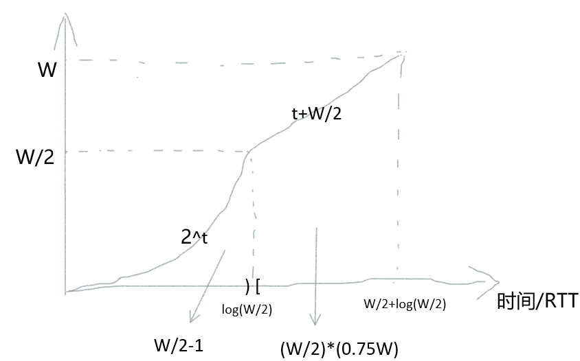
>
> 如上图，则
> $$
> 平均速率=\left[ \cfrac{W/2-1+W/2*0.75*W}{log(W/2)+W/2}\right]\times \cfrac{MSS}{RTT}\approx \cfrac{W/2*0.75*W}{W/2}\times \cfrac{MSS}{RTT}=0.75W\times \cfrac{MSS}{RTT}
> $$
> 可以看出，**当W足够大时，慢启动阶段的传输量在总传输量中的份额可以忽略不计**。因此，有无慢启动和快恢复机制不影响结论。
>
> >  本体是典例中的原题：
> >
> > 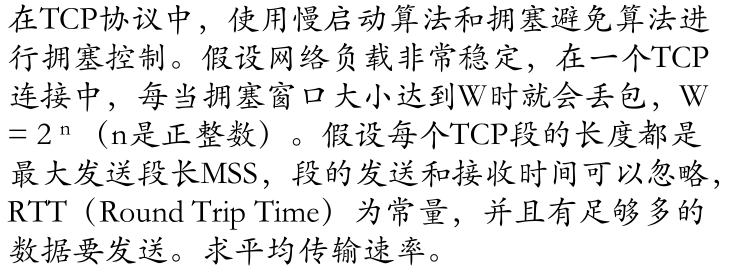
> >
> > 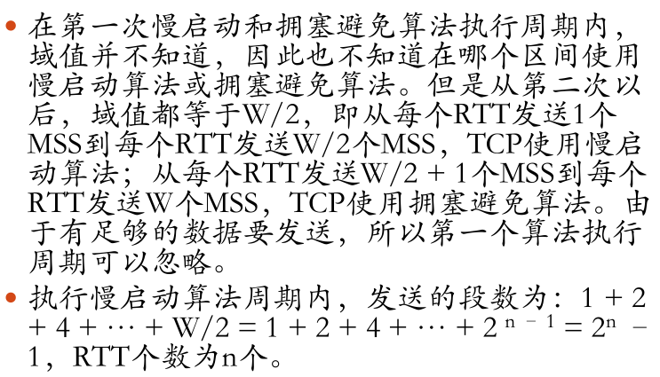
> >
> > 

#### URL大题

(1) 解释以下URL各部分的意义 `http://info.tsinghua.edu.cn:80/index.jsp`

> `http`：协议
>
> `info.tsinghua.edu.cn`：主机的DNS域名
>
> `80`：主机的HTTP端口号
>
> `index.jsp`：路径名
>
> > 本题的原型在《计算机网络》黑书的P502。

(2) 如域名info.tsinghua. edu.cn对应的ip为166.111.4.98，解释为何会发⽣如下现象：

- ①访问`http://info.tsinghua.edu.cn/index.jsp` 正常，⽽访问`http://166.111.4.98/index.jsp` 异常

- ②访问`http://166.111.4.98/index.jsp` 正常，⽽访问`http://info.tsinghua. edu.cn/index.jsp` 异常

> ①：IP地址被多个站点共享；站点禁止IP直接访问
>
> ②：DNS服务器异常
>
> > https://blog.csdn.net/wwwdc1012/article/details/51745912
> >
> > https://blog.csdn.net/weixin_30919919/article/details/96226716
> >
> > https://blog.csdn.net/Luoyeshs/article/details/83212655
> >
> > https://blog.csdn.net/gui951753/article/details/83070180
> >
> > 本题在历年期末考试（如2018）中多次出现。
> >
> > 

#### 路由器大题


(1) 如图，⽹络1有100台主机，⽹络2有50台，⽹络3有20台，请将166.111.4.0/24划分给⽹络并写出路由器接口ip
(2) 简述AB通信时与AC通信时使⽤ARP协议的具体情况（ ARP在同一局域网间的主机通信操作是做什么，在不同局域网间的主机通信操作是做什么？ ）
(3) 当A发送报⽂给C时写出各个段上报⽂的源IP，⽬的IP，源MAC，⽬的MAC（⽤MAC-A,IP-A,MAC-e0等表⽰）

> （1）166.111.4.0/24剩下8位主机号=256台主机。（必须分配2^n台）
>
> - 网络1：166.111.4.`0 0000000`/25=166.111.4.0/25（128台）
>   - e0：166.111.4.1/25
> - 网络2：166.111.4.`10 000000`/26=166.111.4.128/26（64台）
>   - e3：166.111.4.129/26
> - 网络3：166.111.4.`110 00000`/27=166.111.128.192/27（32台）
>   - e6：166.111.128.193/27
> - 网络4：166.111.4.`111000 00`/30=166.111.4.224/30（4台）
>   - e1：166.111.4.225/30
>   - e2：166.111.4.226/30
> - 网络5：166.111.4.`111001 00`/30=166.111.4.228/30（4台）
>   - e4：166.111.4.229/30
>   - e5：166.111.4.230/30
>
> > 注：全0和全1两个主机号一般不参与IP地址分配。
> >
> > **记忆<font color=red>常见的掩码数</font>**：**128=`10000000`，192=`11000000`，224=`11100000`，240=`11110000`**。
>
> （2）ARP协议完成IP地址到MAC地址的映射。
>
> - AB通信：处于同一网段，A首先检查ARP高速缓存，若未命中则广播ARP请求分组，B向A单播响应分组，从而A找到主机B的MAC地址，双方实现数据通信。
> - AC通信：处于不同网段，A首先检查ARP高速缓存，类似地，若未命中则用ARP找到R1的e0端口的MAC地址，R1的e1端口再用ARP找到R2的e2端口的MAC地址，R2的e3端口再用ARP找到C的MAC地址，将消息最终转发给C。C到A同理。
>
> （3）源IP和⽬的IP不变。
>
> | 网段  | 源IP | ⽬的IP | 源MAC  | ⽬的MAC |
> | ----- | ---- | ------ | ------ | ------- |
> | 网络1 | IP-A | IP-C   | MAC-A  | MAC-e0  |
> | 网络4 | IP-A | IP-C   | MAC-e1 | MAC-e2  |
> | 网络2 | IP-A | IP-C   | MAC-e3 | MAC-C   |

## 2018

### 数据结构

#### 判断题（2’*10=20’）

##### 复杂度

判断：T(n)=a>0，无论常数 a 多大，时间复杂度为 T(N)=T(n/2)+O(1)的解总是 $O(logn)$

> 我怀疑原题是T(0)=a。
>
> Q.E.D，命题为**<font color=red>真</font>**。

##### CBA算法

判断：基于 CBA 的算法对所有大小为 n 的数组时间复杂度是$Ω(nlogn)$

> 命题为**<font color=red>真</font>**。
>
> > 参考：*PPT-P119-比较树*

##### 基数排序

判断：基数排序的底层排序算法一定是稳定的

> 19年判断题。如果不稳定，基数排序本身就不正确了。命题为**<font color=red>真</font>**。

##### 堆

判断：输入随机的情况下完全二叉堆的插入平均时间是常数

> 19年判断题。命题为**<font color=red>真</font>**。最坏$O(logn)$。

##### Splay树

判断：伸展树插入操作的分摊时间复杂度 $O(logn)$

> splay的插入操作需要借助search接口。而serach接口的分摊复杂度（双层伸展）是 $O(logn)$。
>
> 命题为**<font color=red>真</font>**。

##### 散列表

判断：对长度为 m=4k+3 素数的散列表双平方探测一定能访问其全部元素

> 命题为**<font color=red>真</font>**。
>
> > 参考：*PPT-P1052-费马双平方定理*，*习题解答-9-17*

##### KMP算法

判断：没改进的 next 算法时间复杂度也是 $O(n)$

> 19年判断题。命题为**<font color=red>真</font>**。

##### Fib查找

判断：Fib 查找时以前后黄金分割点作为轴点的常系数相同

> 显然是不同的。因为左右的查找代价不同。
>
> 命题为**<font color=blue>假</font>**。

##### PFC编码

判断：PFC(最优前缀编码)互换不同深度节点位置一定会破坏其性质

> 题目有问题，PFC（prefix-free code）是**前缀无歧义**编码。此时，交换节点不影响性质（一定**不**会破坏其性质）。
>
> 修改题目翻译后，命题为**<font color=blue>假</font>**。
>
> > 即使Huffman也不一定会破坏。比如，3个等权叶节点。

##### 二分查找

判断：任何情况下折半查找都比顺序查找快

> 假设命中元素位于首位置。
>
> 命题为**<font color=blue>假</font>**。

#### 选择题（3’*8=24’）

##### 就地算法

就地算法的空间复杂度是（）

A.O(1) B.O(n) C.忘了不重要 D.忘了不重要

> O(1)

##### RPN

对于逆波兰式 `0!1+23!4+^*56!7*8!?/-9+`的值等于 2017，则？处的运算符为

A.加号 B.减号 C.乘号 D.除号 E.乘方 F.阶乘

> 后缀表达式即逆波兰表达式。
>
> 计算一遍即可。~~计算量太大辣~~
>
> - `1 1 +  23!4+^*56!7*8!?/-9+`
> - `2 2 3 !  4+^*56!7*8!?/-9+`
> - `2 2 6 4 +  ^*56!7*8!?/-9+`
> - `2 2 10 ^  *56!7*8!?/-9+`
> - `2 2 10 ^  *56!7*8!?/-9+`
> - `2 1024 *  56!7*8!?/-9+`
> - `2048 5 6 !  7*8!?/-9+`
> - `2048 5 6! 7 *  8!?/-9+`
> - `2048 5 7! 8 !  ?/-9+`
> - `2048 5 7! 8! ?  /-9+` = 2017
> - `2048 5 7! 8! ?  /-` = 2008
> - `5 7! 8! ?  /` = 40
> - `7! 8! ? ` = 1/8
> - `?`=`/`

##### BM算法

对于长度为 m 的串进行串匹配时好后缀数组中 gs[0]=1 的概率为

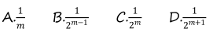

> B。
>
> 设串为
> $$
> A_1A_2A_3...A_m
> $$
> 由gs[0]=1（只需要向左移1位），可推出，
> $$
> A_1=A_2,A_2=A_3,……,A_{m-1}=A_m
> $$
> 即，串中**所有字符全等**
> $$
> A_1A_2A_3...A_m=XXXX……XX
> $$
> 设字符集大小为T，则串中所有字符全等出现的概率为
> $$
> T*\left(\frac{1}{T}\right)^m=\left(\frac{1}{T}\right)^{m-1}=\frac{1}{T^{m-1}}
> $$
> 似乎回忆题中漏掉了字符集大小的条件。可以猜测此处T=2。故选B。

##### 非法表达式

一个非法表达式，问强行求解的值是多少

> 我猜是非法表达式指的是用evaluate求解时非法的中缀表达式。
>
> 2014期中有一道类似题：（选B，见*习题 4-12*）
>
> 

##### B树

7 阶 B-树**根节点常驻内存**，则对规模为 2017 的 B-树最多需要几次访问？

> 4次。7阶B树 = (4,7)-B树。（B树叶节点深度相同）
>
> B树高度范围公式：
> $$
> log_m(N+1)\leq h \leq log_{\lceil m/2\rceil}\lfloor(N+1)/2\rfloor+1
> $$
> 代入m=7，N=2017，有
> $$
> 3<log_7(2018)\leq h \leq log_41009+1<log_41024+1=6
> $$
> 故B树高度最大为5（即6层）。故最多需要4次访问。
>
> > 根节点无需访存，外部节点不计入访问。

##### 散列表

散列长为 2017，采用单平方探测，已经存入 1000 个元素，问此时最多有（？）个**懒惰删除**的桶单元。

- A.8 B.9 C.？ D.？

>  B。2017是素数。可访问元素数=1009。因此最多有**9个**懒惰删除的桶单元。

##### 左式堆

左式堆最右侧链长度为 k，则左式堆__含有__个元素。

- A.最少 2^k B.最少 2^k-1 C.最多 ** D.最多 **

> B。最少$2^k-1$个内部节点。
>
> > 参考：*PPT-P1196*

##### AVL

对于同一个长度为 n 的序列分别按照递增和递减的顺序构造 AVL 树，那么“存在正整数k，使 $n=2^k-1$ ”是“两次构造的堆相同”的（ ）
A.充分不必要条件 B. 必要不充分条件 C. 充分必要条件 D. 既不充分也不必要条件

> C。充分必要条件。
>
> 首先，有结论：最终形成的两颗 AVL 树在结构上必然互为镜像。（注意到序列中没有相同元素）
>
> - 记递增、递减插入形成的两颗树分别为A，B
> - A树在每一个节点都满足BST的性质，左小右大
> - 此时我们可以定义一个新的关系：
>   - 若a<b，则在新的关系下a>b（恰好相反）
>   - 此时A序列在新关系的意义下，等价于按照递减的顺序构造的 AVL 树 的镜像
> - 由于插入顺序一定时，序列形成唯一对应的AVL树，因此A树的镜像必然等价于B树。
>
> 若A与B相同，则A与A的镜像相同，即A对称。
>
> 又因为AVL在顺序插入的过程中，只在满树时对称，则A必然是$n=2^k-1$的满树。
>
> > 见：*习题集 P155-7-20*。

#### 算法题

##### 单峰向量（好像是 16’）

已知 A[0,n ), A[0~k)严格单调递增，A[k~n)严格单调递减，设计一个 O(logn)算法找出 k

1)伪代码描述算法
2)说明算法正确性
3)证明最坏情况下时间复杂度也是 O(logn)

> 二分即可，每次比较左右两侧。
>
> > [UESTCACM 每周算法讲堂 花式找极值](https://www.bilibili.com/video/av4984559)
> >
> > > - 三等分法：区间内三等分，2个轴点比较大小，收缩一边的端点到较小的轴点处。递归。
> >
> > 差分法：O(n)差分完以后，O(logn)二分。当然性能就差了，不满足题意要求。

##### 最大和区间（好像是 10’）

给定一个整数序列，求出连续子序列和的最大值
1)说明算法思路
2)伪代码描述算法
3)说明时间复杂度和空间复杂度
题注(大致意思)：蛮力算法就不要用啦，是 O(n^3),只有设计出 O(n)算法才有可能满分，O(n^2)酌情给分。

> RT。
>
> 

### 操作系统

#### 填空（0.5‘*10=5’）

##### 孤儿进程

父进程退出后，没结束的子进程变成 （   ）。

> 子进程执行 exit()，若未检测到父进程执行 wait()，则子进程进入__状态。当某子进程调用 exit()时唤醒父进程，将 exit()返回值作为父进程中 wait()的返回值
>
> 孤儿进程。与2019类似。

##### 高响应比调度算法

高响应比调度算法的分母是程序的（   ），分子是（   ）。

> 等待时间，执行时间。

##### 优先级反置

优先级反置指的是（   ）抢占了（   ）的资源，（   ）时低优先级进程能动态改变优先级

> 低优先级进程，高优先级进程，使用优先级继承/优先级天花板协议。

##### 管程

（   ）支持暂时放弃互斥资源访问权，等待信号

> 管程。正在管程中的线程可以临时放弃管程的互斥访问，等待事件出现时恢复。

##### 管程/临界区

（   ）提供了一个执行环境，其中线程只能同时执行一个 balabala

> 管程？锁机制？**临界区**？

#### 判断（0.5‘*10=5’）

##### 进程终止（wait()系统调用）

当某子进程调用 exit()时唤醒父进程，将 exit()返回值作为父进程中 wait()的返回值

> 命题为**<font color=red>真</font>**。PPT-P516。

##### 管程

管程就是一个黑箱子，程序员往里面扔函数，同一时间只有一个函数在执行

> 命题为**<font color=red>真</font>**。基本没毛病。

##### 伙伴系统

Buddy算法中，释放一个空间后可以根据起始长度和大小与相邻空闲空间合并

> 命题为**<font color=blue>假</font>**。不一定，只能与空闲的buddy合并。

##### 进程状态切换

如果用户强制使用任务管理器kill一个进程，那么即使它处于就绪状态/阻塞状态，操作系统也要把它变成运行状态

> 命题为**<font color=red>真</font>**。按照进程状态图，所有的进程都必须从运行态进入退出态。kill只是向进程发送一个信号，终止工作由被终止进程自己完成。

##### copy on write机制

操作系统采用copy on write机制时，fork()函数会复制进程的页目录表

> 命题为**<font color=blue>假</font>**。不会。copy on write机制下，它们共享页表，只有当对某页发生写操作时，才引发Page Fault单独复制并分配该页给操作进程。

##### 自旋锁

使用自旋锁不能保证进程按先来后到的顺序使用 cpu 资源

> 命题为**<font color=red>真</font>**。**自旋锁具有随机性**。自旋锁需要占用CPU随时随地去查，有可能临界区的使用者退出时它刚改完，下一个进入者是谁去查那它就能进去，如果说运气不好（正好是这个资源变成有效）老是被人抢先查过，就没法按照等待的顺序进行。

##### 管程/信号量

管程和信号量在功能上等价

> 命题为**<font color=red>真</font>**。

##### 管程

管程将资源抽象成条件变量，通过变量值的增减来控制进程的访问

> 命题为**<font color=red>真</font>**。

#### belady大题（6’）

LRU、BEST（OPT）、CLOCK、FIFO页面置换算法是否能产生belady异常，若可以举出例子，不可以给出证明

> ~~wdm，还要举例子，还要证明？？？~~。
>
> ***产生belady的算法***：FIFO，CLOCK，改进CLOCK，不恢复计数的LFU。
>
> - **FIFO**反例：（https://piazza.com/class/i5j09fnsl7k5x0?cid=1014）
>
>   -  序列：`123412512345`，物理页面数为4时缺页次数（10）比物理页面数为3时缺页次数多（9）
>
> - **CLOCK**反例：（https://piazza.com/class/i5j09fnsl7k5x0?cid=214）
>
>   - 因<u>如果所有页的访问位都为1时，clock算法将退化为FIFO</u>，可以同样构造序列：`123412512345`。当物理页帧为3时，缺页次数为9次，当物理页帧为4时，缺页次数为10次。
>
>     
>
> - 不恢复计数的LFU反例：（https://piazza.com/class/i5j09fnsl7k5x0?cid=1031）
>
>   - 考虑访存顺序：0 0 1 1 1 2 2 0 0 2 2 3 1 3 1 3 1 3 1 3 1 3 1 ... 最后的序列是3号页和1号页的循环。
>     当物理页帧数为2时，之后的3和1循环段不会出现任何缺页
>     当物理页帧数为3时，之后的3和1循环段总是缺页
>
> > ……在国防科大的操作系统教材上有栈式置换算法不会出现belady现象的证明。
> > 只要不是栈式置换算法，就一定会有belady现象。<font color=red>**构造实例的方法**</font>是，
> >
> > - **对于指定的置换算法，在把所有已分配的页面用上后，访问一个新页，就会出现缺页；然后就可以构造一个序列，每次都访问刚被置换的页面**。这个序列就应该是belady现象的实例。（[From Here](https://piazza.com/class/i5j09fnsl7k5x0?cid=762)）
>
> ***不产生belady算法***：OPT，LRU，恢复计数的LFU。
>
> - **OPT**证明：https://piazza.com/class/i5j09fnsl7k5x0?cid=1296
>   - 不存在，n个物理页面，包含1个最近访问的页面，未来一段时间t1将访问的不同页面的集合S1构成了剩下n-1个页，t1为访问第n个不同页面的时间 若有n+1个物理页面，访问第n+1个不同页面的时间t2显然大于t1，剩下的n个页的集合S2也应包含S1
> - **LRU**证明：https://piazza.com/class/i5j09fnsl7k5x0?cid=205
>   -  不存在，对于LRU算法，如果内存页的集合为最近引用的页，那么对于帧的增加，这n页仍然是最近引用的页，所以也仍然在内存中，所以对于帧数为n的内存页集合是对于帧数为n+1的内存页集合的子集 
> - 恢复计数的LFU证明：https://piazza.com/class/i5j09fnsl7k5x0?cid=1297
>
> > 对不产生belady的**<font color=red>统一的证明思路</font>**：
> >
> > - **假设n个物理页，记内存中的页面集合为S，若物理页增加1，则内存中的页面集合为S‘，只需证明$S \subset S'$。**（[From Here](https://piazza.com/class/i5j09fnsl7k5x0?cid=1014)）
> >   - 对于OPT，S是最近的n个**之后要访问的页面**，S’是最近的n+1个之后要访问的页面，显然$S \subset S'$
> >   - 对于LRU，S是最近的n个**之前已访问的页面**，S’是最近的n+1个之前已访问的页面，显然$S \subset S'$
> > - 因为$S \subset S'$，所以S中命中的页，在S‘中也一定命中。因而缺页率必不增。
> >
> > 本题的原题出自：**https://piazza.com/class/i5j09fnsl7k5x0?cid=1014**
> >
> > > 

#### uCore大题（6’）


le2page(*page,page_link)语句都需要展开那些宏定义？说明这个语句的含义。(还有一段ucore代码是buddy（伙伴）算法的页面分配函数，好像跟这道题关系不大，就不贴了~~主要是没找到~~。)

一道 Ucore 代码的题。然后列了整整三张 ucore 代码，其中一张是列表 list 的定义和add 操作，另两页是题目要用的。问最后一页的一句代码调用了几个宏命令，是什么意思

> `le2page(*page,page_link)`需要展开3个宏定义：`le2page`，`to_struct`，`offsetof`。该语句根据链表节点的指针和宿主数据结构的类型寻找其宿主数据结构的头指针。
>
> - `le2page`：list entry to page，是一个寻找Page类型数据结构的头指针的宏。调用`to_struct`宏。
>   - `#define le2page(le, member) to_struct((le), struct Page, member)`
> - `to_struct`：根据链表节点地址和成员在类型中的偏移量确定宿主数据结构头指针。调用`offsetof`宏。
>   - `#define to_struct(ptr, type, member) ((type *)((char *)(ptr) - offsetof(type, member)))`
> - `offsetof`：计算成员在类型中的偏移量。
>   - `#define offsetof(type, member) ((size_t)(&((type *)0)->member))`
>
> > 主要考察的是lab0的双向循环链表。
> >
> > 参考：*PPT-P108*

#### 哲学家就餐（4’）


```c
mutex = 1 //信号量，初值为 1
while(1) {
    think();
    P(mutex);
    P(左边的叉子);
    P(右边的叉子);
    eat();
    V(左边的叉子);
    V(右边的叉子);
    V(mutex);
}
```

1. 该算法是否会导致死锁，为什么？
2. 该算法是否允许两名哲学家同时用餐，为什么？若可以请举例

> ~~两版回忆，一个贴的方案1，一个贴的方案2~~。。。晕。
>
> 方案1（自由进餐）：
>
> - 会导致死锁。
>
> 
>
> 方案2（互斥信号量）：
>
> - 不会导致死锁，但每次只允许1人进餐
>
> 
>
> 还有个这里没提到的方案3（分奇偶）:
>
> - 没有死锁，可有多人同时进餐
>
> 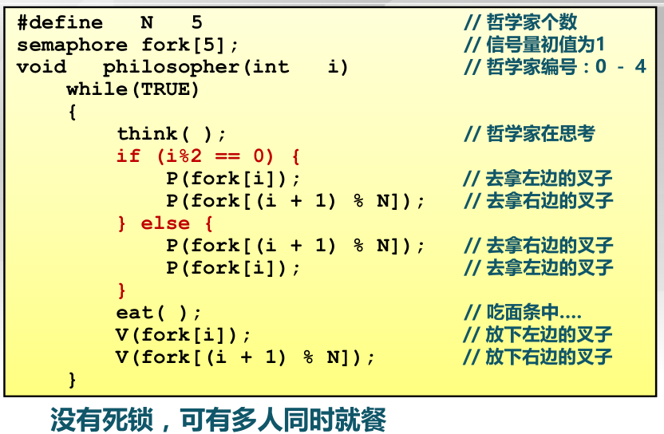
>
> > 参考：*PPT-P829~P841*

#### 内存管理（4’）

Intel X86-32 CPU 使用分页管理，每页 4KB，逻辑地址格式如图所示，这种 CPU最多支持 4GB 内存。为了使系统能够使用 64GB 内存，使用物理内存扩展技术，使物理地址长度变为 64 位，页面大小仍为 4KB。试设计逻辑地址格式，使其可以在支持物理内存扩展技术的 X86-32 CPU 上运行。


> 原物理内存4GB，每页4KB，可分为1M个物理页=20位。加上12个控制位，得到页表项大小32位。
>
> 新物理内存64GB，每页4KB，可分为16M个物理页=24位。加上12个控制位，得到页表项大小**36位**。为满足对齐要求，向上扩展取为64位=8B。则每个页可含512个页表项。
>
> 可知页面offset=12位（不变），二级页表offset=9位，一级页表offset=9位。
>
> 此时需要额外设计offset=2位的页目录指针表。故逻辑地址新格式为32位=`2 + 9 + 9 + 12`。
>
> > https://zh.wikipedia.org/wiki/%E7%89%A9%E7%90%86%E5%9C%B0%E5%9D%80%E6%89%A9%E5%B1%95
> >
> > > x86的处理器增加了额外的地址线以选择那些增加了的内存，所以实体内存的大小从32位增加到了36位。最大的实体内存由4GB增加到了64GB。 
> > >
> > > 32位的[虚拟地址](https://zh.wikipedia.org/wiki/虚拟地址)（[线性地址](https://zh.wikipedia.org/w/index.php?title=线性地址&action=edit&redlink=1)）则没有变，所以一般的应用软件可以继续使用地址为32位的指令；如果用[平面内存模式](https://zh.wikipedia.org/wiki/平面内存模式)的话，这些软件的地址空间也被限制为4GB。操作系统用[页表](https://zh.wikipedia.org/wiki/页表)将这4GB的地址空间映射到大小为64GB的实体内存，而这个映射对各个[进程](https://zh.wikipedia.org/wiki/进程)一般是不一样的。这样一来，即使不能为单单一个程序所用，那些增加了的物理内存仍然可以发挥作用。 
> >
> > https://blog.csdn.net/crazyingbird/article/details/7175559
> >
> > >  Intel通过在处理器上把管脚数从32增加到36，以提高处理器的寻址能力，使其达到2^36=64GB，为此，需引入一种新的分页机制。 
> > >
> > > 64GB的RAM被分为2^24个页框，页表项的物理地址字段从20位扩展到24位，每个页表项必须包含12个标志位（固定）和24个物理地址位（36-12），共36位，因此，每个页表项须从32位扩展到64位（36位>32位，考虑到对齐，因此应将页表项扩大一倍到64位）。
> >
> > [物理地址扩展PAE和地址空间相关的几个问题](https://piazza.com/class/i5j09fnsl7k5x0?cid=1198)
> >
> > > 通常我们在讨论CPU时所说的8位、16位、32位和64位CPU是指数据总线的宽度；而地址总线宽度并不一定与数据总线宽度一致。如8位CPU的地址总线一定是大于8位的，否则的说，就只有256字节的内存地址空间了；目前所有的64位CPU的地址总线也一定是小于64位的，如48位地址总线就可以支持64TB的内存地址空间，这在目前技术条件下，还是不必要的。
> > >
> > > 在32位CPU上，数据总线和地址总线在一段时间内都是一样的，所有大家会觉得所有CPU都是一样的。实际情况与直觉是不一样的。PAE就是intel在32位CPU使用的一种扩展内存地址空间的技术，它使用36位地址总线，最多可支持64GB内存。这种扩展会导致物理页号的长度和页表格式的一系列变化。详细描述见下面链接。
> > >
> > > https://en.wikipedia.org/wiki/Physical_Address_Extension
> > >
> > > 由于使用PAE后物理页号的长度增加了，CPU可以寻址的物理页面数变增加了，从而物理地址空间变大了。
> > >
> > > - 注：32位支持2^32个物理页，64位支持2^64个物理页，因而物理页号的长度增加。
> > >
> > >  在Intel的32位CPU上，**物理地址空间可以大于4GB，但进程的虚拟地址空间还只能是4GB**。原因是，**即使使用了PAE，虚拟地址还是32位的**。 
> > >
> > > - 注：因此需要采用36根CPU地址线，才能够使用64GB虚拟空间。
> >
> > 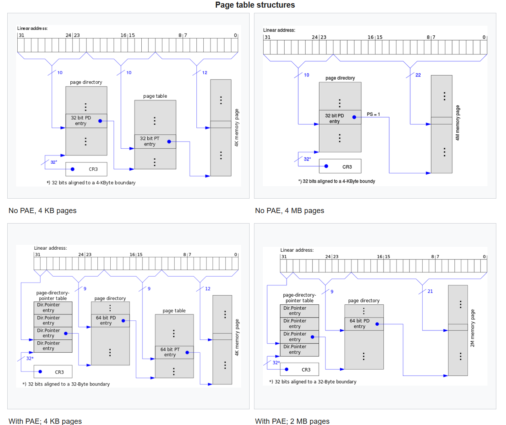

### 组成原理

#### 判断

##### 主频

CPU 的主频越高，指令执行的越快。

> 错。执行时间=（指令条数***CPI**）/主频。

##### RAID

raid6坏两个磁盘也可以工作

> 对。RIAD6是二维校验，有两个冗余磁盘。

##### C语言

c语言若int x,y 若x>y，则-x<-y

> 错。反例：int的范围是[-M, M-1]。令y=-M，则-y=M=-M(溢出)，故y总是最小值。

##### 虚拟内存

内存逻辑地址连续的，物理地址不一定连续。

> 对。

#### 填空

##### 补码

1)-2017的32位补码表示（ ）(16进制或2进制)。

> -2017的补码 = 2017的反码 + 1。
>
> 由除基取余法，
>
> - 2017=`0..0 11111100001`
> - 2017[反]=`1..1 00000011110`
> - -2017=`1..1 00000011111`=`0xFFFFF81F`

##### 浮点数

2)-2017.0 使用 IEEE 标准表示为单精度浮点数为（ ）（使用 16 进制获二进制表示）

> 由上一题，有2017=`11111100001`=`1.1111100001 *2^10`
>
> - 符号位：`1`
> - 阶码：`1010`+`01111111`=`10001001`
> - 尾数：`1111100001 0..0`
>
> IEEE754表示为：`1 10001001 1111100001 0..0 `=`1100 0100 1111 1100 0010 0..0 `=`0xC4FC2000`
>
> > **<font color=red>牢记6个模式串</font>**：**<font color=blue>A</font>(10=1010) <font color=blue>B</font>(11=1011) <font color=blue>C</font>(12=1100) <font color=blue>D</font>(13=1101) <font color=blue>E</font>(14=1110) <font color=blue>F</font>(15=1111)**。
> >
> > 浮点数转换验证工具：http://www.styb.cn/cms/ieee_754.php

##### Cache映射方式

3)Cache 和主存的映射方式：（ ），（ ），（ ）。

> 全相联映射，直接映射，组相联映射。

##### 时序/组合逻辑

4)处理机（ ）逻辑电路进行算术运算，（ ）逻辑电路用于数据暂存，（ ）逻辑电路用于分支选择。

> 组合，时序，组合。只有时序逻辑具有功能。

#### 选择

##### 流水线

1)以下关于五段流水线的处理机说法错误的是 

A.多个处理器不会发生结构冲突 

B.每个周期执行一个功能

C.可以采用微程序或者硬连线设计

D.不同的指令执行时间相同

> A。A显然。B、D是PPT原话。C说的是CPU控制器的组成，也算对吧。

##### 缓存

2)以下说法正确的是

A.缓存越大程序执行速度越快

B.TLB也是一种缓存数据和指令的缓存器

C.

D.

> A。TLB缓存的是虚实地址的映射关系。

##### 异常

3)以下哪个不是响应异常的处理

A.保存pc  B.保存通用寄存器 C.保存异常原因  D.恢复pc

> B。不需要保存通用寄存器。

##### 数据冲突

4)以下哪种不可以解决数据冲突

A.暂停流水线 B.分支预测 C.调整指令顺序 D.数据旁路

> B。B是控制冲突的解决方法。

#### 流水线大题

五段流水线，每段10ns，每个寄存器5ns，以下一段程序(4句)，问执行时间是多少

lw ***

sub ***

and ***

or ***

>
>| 指令           | IF   | ID   | EXE    | MEM  | WB   | 指令延迟 |
>| -------------- | ---- | ---- | ------ | ---- | ---- | -------- |
>| `lw`           | 10+5 | 10+5 | 10+5   | 10+5 | 10   | 70       |
>| `sub`         | 10+5 | 10+5 | 10+5   |      | 10   | 55       |
>| `and`         | 10+5 | 10+5 | 10+5   |      | 10   | 55       |
>| `or`          | 10+5 | 10+5 | 10+5   |      | 10   | 55       |
>| **总执行时间** |      |      |        |      |      | **<font color=red>235 ns</font>** |
>

### 计算机网络

#### 选择

##### OSI和TCP/IP

1)TCP/IP与OSI 

A.

B.OSI从上到下依次是应用层，会话层，表示层，网际层，网络层，数据链路层，物理层

C.TCP/IP从上到下依次是应用层，网络层，数据链路层，物理层

D.TCP/IP适用场合比OSI更广

> D。B没有网际层，C缺失传输层。

##### 奈奎斯特定理

2)奈奎斯特定理适用于以下哪些场合 

Ⅰ光纤 Ⅱ.同轴电缆 Ⅲ.红外线

A.Ⅰ和Ⅱ     B.Ⅱ和Ⅲ     C.Ⅰ和Ⅲ     D.Ⅰ、Ⅱ、Ⅲ

> D。此题为迷惑题，奈奎斯特定理适用于任何信道（即使是理想信道）。我觉得此题的含义准确来说应该是哪些场合受到奈奎斯特定理的约束。毕竟Ⅰ、Ⅱ、Ⅲ都不是理想信道。但准确来说，此题更像是香农定理。
>
> 网上可以查到另一道题：
>
> > 奈奎斯特定理适用于光纤吗?还是只适用于铜线?
> >
> > 答:都**适用**,因为**奈奎斯特定理适用于**所有介质

##### GBN协议

3)两地相距3000公里(传播速度6us/公里) 最大帧64字节，采用GBN协议，带宽为1.536Mbps，则若要最大限度发挥网络带宽，至少需要多少比特的序号

A.4  B.5  C.6  D.7

> D。
>
> - 传输时间=64·8/(1.536·10^6)=0.33ms
> - RTT=2·3000·6/1000=36ms
> - 总时间=传输时间+RTT=36.33ms
>
> 要完全发挥，则~~药不能停~~，有：N>=总时间/传输时间=36.33/0.33=110；S=logN>=log110=6.78，故取7位。
>
> > 典例原题：
> >
> > 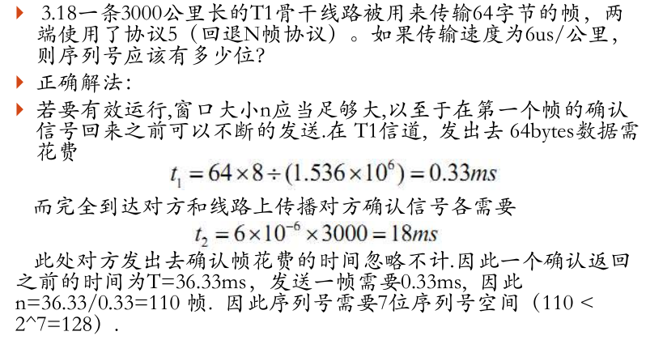

##### 数据链路层

数据链路层使用的单位是
A.比特 B.报文 C.帧 D.分组

> C。显然。

##### 选择重传协议

选择重传协议，序号为0-13，发送窗口为7，当数据发送不产生冲突（为了使传输不出错），接收窗口最大值为多少

A.4  B.5  C.7  D.8

> C。接+收<=序号数。

##### DNS

dns相关问题

A.天猫双12购物，不同地方两个人访问淘宝得到的ip一定相同

B. 

C.存储ip是五元组

D.数据库集中存储

> C。A不一定。D可能是分布式数据库。
>
> > https://blog.csdn.net/sunansheng/article/details/49853137
> >
> > 

#### 透明网桥（4’）

一道透明网桥的大题，两个网桥三段子网，建立转发表，要求填表。

> 网桥题，填转发表，和**王道**上的一道原题几乎一样。
>
> > 大概是：*计算机网络-3.8.4* 的综合题。
> >
> > 

#### 路由器+TCP大题（10’）

一道路由器大题，两个路由器，三段网络的最大（<u>数据部分</u>）帧长度分别为1024,512,912，报头长度分别为14,12,12。两个路由器 R1、R2，R1 的 e0 端口链接着局域网 LAN1，R2 的 e0 端口连接着局域网 LAN2，R1 的 e1 端口连接着 R2 的 e1 端口。主机 A 在 LAN1 内，主机 B在 LAN2 内。如图：

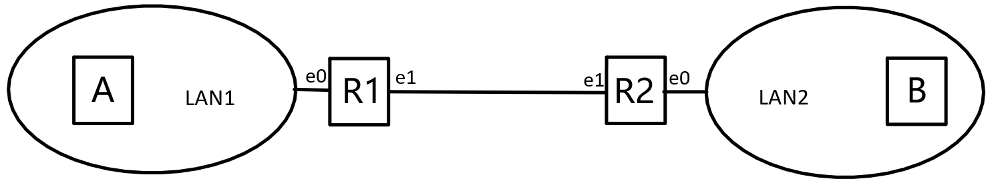

1）现在有 IP 地址 161.111.1.0/24 分给这些网，包括 R1 和 R2 的两个端口，问该如何分配，才能使 LAN1 和 LAN2 所获得的 IP 地址数量之和最多，写出 LAN1、LAN2 的 IP 地址范围，R1、R2 的端口地址以及它们的子网掩码。（4’）

2）若 A 要发送一个数据段 900B，TCP 头部 20B 的报文，在网络层加了一个 20B长的 IP 分组头部，Identification 的值为 X，问这个 IP 分组在 A~R1，R1~R2，R2~B 上传输时，求分组的 Total length、Identification、DF、MF、Fragment Offset 的值各是多少？（4’）

3）若从 A 到 B 所需往返传输时间为 RTT，现在 A 要向 B 传输 7 个 TCP 报文，那么从开始建立连接到 A 收到最后一个确认帧结束共经历了多少 RTT？

> （1）LAN1和LAN2最多利用约3/4的IP地址。
>
> - LAN1：161.111.1.`0 0000000`/25 = 161.111.1.0/25
>   - 地址范围：161.111.1.0/25~161.111.1.127/25
>   - R1-e0端口地址：161.111.1.1/25；子网掩码：255.255.255.128
> - LAN2：161.111.1.`10 000000`/26 = 161.111.1.128/26
>   - 地址范围：161.111.1.128/26~161.111.1.191/26
>   - R2-e0端口地址：161.111.1.129/26；子网掩码：255.255.255.192
> - R1-R2：161.111.1.`11 000000`/26 = 161.111.1.192/26
>   - R1-e1端口地址：161.111.1.193/26；子网掩码：255.255.255.192
>   - R2-e1端口地址：161.111.1.194/26；子网掩码：255.255.255.192
>
> （2）**Total length**：总长度，首部+数据，单位是1B。**Identification**：标识，同一数据报的分片使用同一标识。**DF**（Don't Fragment）：DF=1禁止分片，DF=0允许分片。**MF**（More Fragment）：MF=1后面还有分片，MF=0代表最后一片/没有分片。**Fragment Offset**：片偏移，分片后某片在原分组中的相对位置，单位是8B。
>
> A~R1：（不分片）
>
> |            | Total length | Identification | DF   | MF   | Fragment Offset |
> | ---------- | ------------ | -------------- | ---- | ---- | --------------- |
> | 原始数据报 | 920+20       | X              | 0    | 0    | 0               |
> | 数据报片1  | 920+14       | X              | 0    | 0    | 0               |
>
> R1~R2：
>
> |            | Total length | Identification | DF   | MF   | Fragment Offset |
> | ---------- | ------------ | -------------- | ---- | ---- | --------------- |
> | 原始数据报 | 920+14       | X              | 0    | 0    | 0               |
> | 数据报片1  | 512+12       | X              | 0    | 1    | 0               |
> | 数据报片2  | 408+12       | X              | 0    | 0    | 64              |
>
> R2~B：（不分片）
>
> |            | Total length | Identification | DF   | MF   | Fragment Offset |
> | ---------- | ------------ | -------------- | ---- | ---- | --------------- |
> | 数据报片1 | 512+12       | X              | 0    | 1    | 0               |
> | 数据报片2 | 408+12       | X              | 0    | 0    | 64              |
>
> （3）
>
> - 建立TCP连接：3次握手，1RTT（第3次可携带数据）
> - 传输7个TCP报文：3RTT（按慢开始算法计算，分3个RTT分别发送1、2、4个报文）
> - 释放TCP连接：4次握手，2RTT
>
> 共计1+3+2=6RTT。

## 2017

### 数据结构

#### 判断题

##### 复杂度

判断：若 f(n)=时间复杂度 O(g(n)),也不一定有 f(n)=O(g(n-1)).

> 命题为**<font color=blue>假</font>**。

##### 散列表

判断：若散列表使用不超过其长度的素数，则存储关键不能保证其分布均匀。

> 命题为**<font color=red>真</font>**。假设这里的策略是除余算法。
>
> 设散列表长度为N，素数为Q<N，则所有的关键码都必然落在散列表的$[0,Q)$区域内。存在一个永远散列不到的区域，显然分布不均。
>
> > 参考：*教材-9.3.3-散列函数-除余法-P262*

##### KMP算法

判断：在字符集各字符出现概率相同时，kmp 算法时间渐进程度接近蛮力算法。

> 字符集越大KMP越接近蛮力算法（或者匹配概率越小）。跟各字符的概率没有关系吧？
>
> 命题为**<font color=blue>假</font>**。

##### Huffman编码

判断：哈夫曼树距离深度更小的节点的权值可能小于深度更大的节点的权值。

> 不可能。但可能相等。
>
> 命题为**<font color=blue>假</font>**。

#### 选择题

##### Catalan数

五个互异节点构造的二叉树有多少种？

> $Catalan(5)=\cfrac{(2\times5)!}{5!\times (5+1)!}=42$。
>
> > 参考：*教材-7.3-平衡二叉树*，*习题解答-7-2*

##### 逆序数（插入排序）

对序列（64，63，...，2，1）进行直接插入排序比较次数最接近于（）
A.2800 B.2600 C.2400 D.2200 E.2000

> E。**全逆序数**=64*63/2=2016。

##### AVL

将关键字 1，2，3...，2016 插入初始为空的平衡二叉树中，假设只有一个根节点的二叉树高度为 0，那么最终二叉树的高度是多少？

> 10。我猜是跟2018年一样的AVL树。那么，根据之前的结论，显然在插入1023个节点以后，形成高度为9的满树。此时再插入剩下的节点=993，高度再+1。
>
> > 参考：习题7-20。
> >
> > 在各次考试中，AVL、B树、红黑树等的**单调插入**均有所涉及。加以重视。

##### B树

搜索 7 阶 B 树的第 2016 个关键字，假设 B 树根节点在内存中，则共需启动几次 I/O.

> 3至4次。我觉得原题应该跟18年的B树差不多。
>
> B树高度范围公式：
> $$
> log_m(N+1)\leq h \leq log_{\lceil m/2\rceil}\lfloor(N+1)/2\rfloor+1
> $$
> 代入m=7，N=2016，有
> $$
> 3<log_7(2017)\leq h \leq log_41008+1<log_41024+1=6
> $$
> 故B树高度范围为[4,5]。故需要3到4次I/O。

##### RPN

有如下逆波兰式结果为 2016，问?中的运算符号是多少（）

```
2 0 ！ * 2 2 * 6 + ^ 18 8 ? 9 / *
```

- `A.+ B.* C.^ D. ! E./`

> - `2 0 ！ * 2 2 * 6 + ^ 18 8 ? 9 / *`
> - `2 0 ！`    `* 2 2 * 6 + ^ 18 8 ? 9 / *`
> - `2 1 *`    `2 2 * 6 + ^ 18 8 ? 9 / *`
> - `2 2 2 *`    `6 + ^ 18 8 ? 9 / *`
> - `2 2 2 *`    `6 + ^ 18 8 ? 9 / *`
> - `2 4 6 +`    `^ 18 8 ? 9 / *`
> - `2 10 ^`    `18 8 ? 9 / *`
> - `1024 18 8 ?`    `9 / *` = `2016`
> - `1024 (18 ? 8) 9 /`    `*` = `2016`
> - `1024 * ((18 ? 8) / 9)` = `2016`
>
> 此题有问题。暂时作废。或尝试修复。

#### 算法题

##### BFS寻找最小环路

请利用图的广度优先遍历找出图中的**最小环**，若不存在环则输出+oo,要求时间复杂度为 O(n*e)，空间复杂度为 O(n)，最小环即环中边数最少的环。
（1）请描述你的算法思想。
（2）请用伪代码写出算法。
（3）说明你的算法的时间复杂度和空间复杂度。

> ~~关注**backward**边。环的长度等于BFS节点的深度相减。~~
>
> 打脸了，想简单了。
>
> 看到O(n*e)，立马就会做了。直接跑n遍bfs。（若需要记录环，则额外空间复杂度$O(n)$）
>
> 每一次CROSS都`if(CROSS) Ring = min(Ring, a.depth + b.depth + 1)`。每轮就能计算出经过根节点的所有环的最小环。把每一个节点依次当作根节点BFS即可。
>
> ```c++
> int ans = INF;
> int least_ring(){//只考虑记录最小环的大小
>  for 所有的节点:
>      bfs(节点)；
> }
> void bfs(节点){
>  利用队列执行算法
>  若遇到CROSS边(a,b):
>      ans = min(ans, a.depth + b.depth + 1)
> }
> ```
>
> > 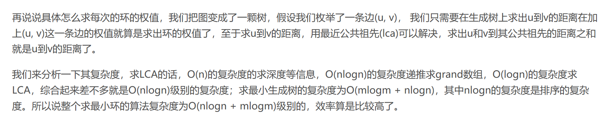
> >
> >  https://blog.csdn.net/watermuch/article/details/9402995

##### 归并排序（改进）

如图所示。假设已有两个有序的子序列。


改进的归并策略为：

- 将两个子序列分别进行分割为四个子序列，使得两个序列在割点处的值相等。（似乎也可能是确定割点为1/2或1/3处）
- 直接拼接中间的两个序列（即交换它们的位置），从而得到3个有序子序列。
- 对这3个子序列，先归并1、2，用得到的结果再归并3，从而完成整个策略。

1）填空 merge
2）对 ABCDE 处的注释补充
3）rotate（）
4）说明这种算法的优缺点

> 回顾张奥live的题面。
>
> 4）表面来看新算法每轮需要归并3次，效率似乎下降。
>
> - 对于原始的归并排序，比较次数总是在$O(n/2)\to O(n)$之间。
>
> - 对于新的归并策略。
>
>   - 寻找值相等的割点处
>   - 记分成的4个子序列长度分别为：A|B|C|D，拼接为A|CB|D。则新的算法在排序上的比较次数为$O(min(A,C)+min(B,D))\to O(n)$之间。
>   - 其中，我们有（不妨假设$A<C$，反之同理）
>
>   $$
>   \begin{align}
>   min(A,C)+min(B,D)&=min(A,C)+min(\cfrac{n}{2}-A,\cfrac{n}{2}-C) \\
>   &=A+\cfrac{n}{2}-C \\
>   &=\cfrac{n}{2}-(C-A) \\
>   \end{align}
>   $$
>
>   - $|C-A|$在`[0, n/2]`中取值，其值越大，新的归并策略的比较次数越少
>   - 综上，可知新的归并策略的比较次数在$O(1)\to O(n)$之间。其最好情况优于原始算法。但子序列的分割需要一定量的预处理（怀疑为$O(logn)$），因此在最坏情况下的比较次数会有所上升。
>
> > 参考：[张奥-Live](https://www.zhihu.com/lives/895615716198330368)
> >
> > 注：此题的预处理可能是，先根据左边序列直接确定割点为1/2或1/3处，获得一个该点高度；然后在右序列中二分查找。但是如此考虑时，最好情况的比较次数将是$O(Cn)（C\leq 1/4）$，只获得常数倍优化。并且，该算法还引入了额外的交换次数（拼接B、C互换位置），可采用$O(2(B+C))=O(n+2(C-A))$的双指针算法完成。

##### 后序遍历（迭代版）

若二叉树的数据结构如下

```c++
struct binarytree｛
    struct binarytree *parent；
    struct binarytree *lc；
    struct binarytree *tc；
    struct binarytree* first();
｝
struct realbinarytree｛
    struct binarytree p；
    struct binarytree* next();
｝
```

（1）若 first()函数是取二叉树后序遍历节点的第一个节点，请写出 first（）函数代码。
（2）若 next（）函数是取该节点的后序遍历的后继，请写出 next（）函数代码。
（3）在调用 first（）函数和 next（）函数对二叉树进行后序遍历时，证明遍历时间复杂度为$O(n)$。

> （1）
>
> ```c++
> binarytree *first(){
>     while(this->lc || this->rc)
>         this = this->lc ? this->lc : this->rc;
>     return this;
> }
> ```
>
> （2）如果是左兄弟，就找到右兄弟的first()；否则就返回父亲。
>
> ```c++
> binarytree *next(){
> 	if(!this->parent) return this; // just in case
>     if(this == this->parent->lc && !this->parent->rc){ // is left sibling
>         this = this->parent->rc;
>         return this->first();
>     }
>     else
>         return this = this->parent;
> }
> ```
>
> （3）对于任意一个节点，遍历过程中最多被涉及3次，第1次进入左子树，第2次从左子树进入右子树，第3次从右子树退出。因而整个遍历的消耗$=O(3n)=O(n)$。
>
> > 栈方法：[Leetcode 145. 二叉树的后序遍历  迭代解法，时间复杂度 O(n)，空间复杂度 O(n)](https://leetcode-cn.com/problems/binary-tree-postorder-traversal/solution/die-dai-jie-fa-shi-jian-fu-za-du-onkong-jian-fu-za/)

### 操作系统

#### <font color=red>多选题</font>

##### 系统调用 exec()

（1）exec（）系统调用会改变以下哪些参数（）
A.进程 ID B.父进程 ID C.文件打开指针 D.？

> C。exec()系统调用允许进程加载一个完全不同的程序。exec()调用后进程ID（以及PID）不变，但代码、堆栈、堆、数据都完全被重写。（**相同的进程，不同的程序**）

##### 中断（硬件工作）

（2）以下由（x86）硬件完成的是( )
A.获取中断源 B.形成中断入口地址 C。Eax 寄存器保存 D.？

> A、B。EFLAGES、CS、EIP、ErrorCode由硬件负责保存，通用寄存器由OS负责保存（`switch_to`）。 
>
> > 参考： *实验书-P125*
> >
> > 注：获取中断源是指CPU根据中断向量查询到对应的中断描述符，从而确认造成中断的原因。但是MIPS只有一个中断处理程序 （ 这个地址是0x80000180 ），在里面用代码去访问CAUSE寄存器，看看造成中断的原因是啥再执行相应的逻辑（这一步就是获取中断源 ） ，因而是软件完成的。 x86是根据IDTR加上相应的偏移去取中断描述符表里面的项，然后找到对应中断描述符项里面的地址，然后跳过去，之后才是中断处理程序。
> >
> > 参考： https://www.bilibili.com/video/av71302902?p=49 
> >
> > 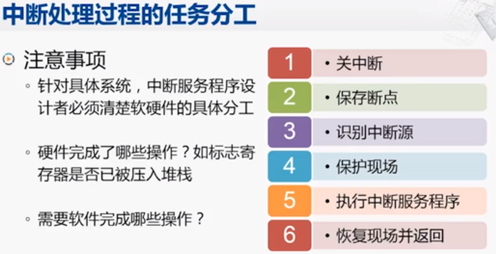

##### 动态分区

4）以下算法（）会产生很多不必要的小碎片的分区
a）最佳匹配
b）首次适应
c）最坏匹配
能够有效避免产生小碎片的算法是（）
a）最佳匹配
b）首次适应
c）最坏匹配

> A，C。最佳匹配产生小碎片。最坏匹配避免产生小碎片。

##### 管程/线程

5）关于线程和管程错误的是（）

> 王道上有类似辨析题。

##### belady

7）以下会发生 belady 异常的是（）
a）FIFO 算法
b）LRU 算法
c）CLOCK 算法
d）LFU 算法
e)改进 CLOCK 算法

> acde。
>
> 产生belady的算法：FIFO，CLOCK，改进CLOCK，不恢复计数的LFU。
>
> 不产生belady算法：OPT，LRU，恢复计数的LFU。
>
> > LFU是最近最不常用页面置换算法(Least Frequently Used),也就是淘汰一定时期内被访问次数最少的页。这里需要注意，对于**恢复计数**，当某页被换出后，其访问次数会被记录下来为n，当此页被再次访问，并被换入时，此页的访问次数为n+1。在这种定义下的LFU是没有Belady异常的。
> >
> > 若LFU没有特指，则认为LFU不恢复计数，因为PPT/讲课中使用的不恢复计数的LFU。

##### RAID

8）以下哪种磁盘阵列存取速度快（）
A.RAID0
B.RAID1
C.RAID4
D.RAID5

> A。RAI0是条带化（并行访问）。RAID1读速仅为2倍，写时不变。RAID4和RAID5的读速度与RAID0接近，但由于带有校验，写速度都比RAID0慢。

#### uCore大题

1）很多代码 balabala，求 intr
2）flag，turn balabala 填一行代码

> 搁置。
>
> 此题可能是考察信号量/管程。`intr_flag`是当前的标记寄存器。
>
> - CLI：在`local_intr_save(intr_flag);`中调用
> - STI：在`local_intr_restore(intr_flag);`中调用

#### 虚拟存储

一台计算机虚拟空间 8KB，物理空间 4KB，二级页表，页表项 2B,页目录项 1B，页表大小32B，求进程页面大小有多少 b

> 虚拟地址长度=log_2(8K*8)=**16** bit=A+B+C=页目录偏移+页表偏移+offset。
>
> - 页目录偏移位数=log_2(32B/2B)= 4 bit
> - 页表偏移位数=log_2(32B/1B)=5 bit
> - offset位=16-4-5=7 bit
>
> $\Longrightarrow$进程页面大小=2^7  bit

### 组成原理

#### 填空题

##### 指令概念

1）指令由指令操作码和（  ）组成

> 操作数。

##### 海明码检错/纠错

2）若海明码 **P1P2** D1 **P3** D2 D3 **P4** 为**01** 0 **1** 1 0 **0**，则该海明码有（）位错误（0 位，
一位，二位），正确的 D1D2D3 为（）。

> 译码，有
>
> - S1=(P1 D1 D2)=(0 0 1)=1
> - S2=(P2 D1 D3)=(1 0 0)=1
> - S3=(P3 D2 D3)=(1 1 0)=0
> - S4=(P1 P2 D1 P3 D2 D3 P4)=(0 1 0 1 1 0 0)=1
>
> 由S4=1得，有1位错，出错位为S1、S2的交集=(D1)。故正确的D1D2D3为**1**10。
>
> >  S4=0，必有两位错。（海明码**检2位错，纠1位错**）
>
> 
>
> 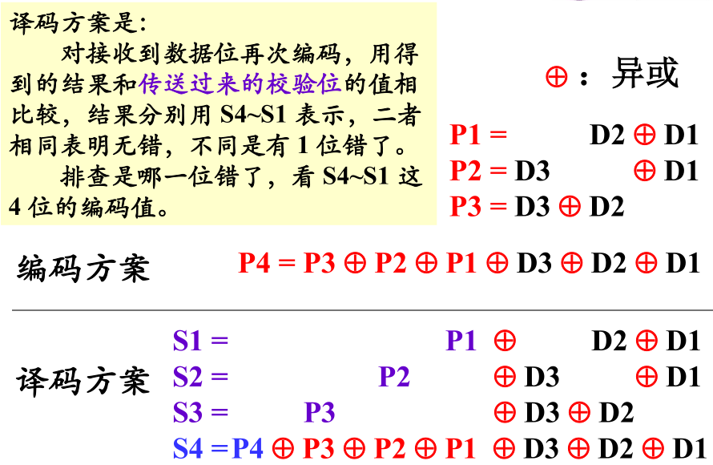
>
> 

##### 总线

3）DMA 使用总线的方式为（）和（）。

> 独占总线，周期窃取。

#### 选择题

##### 浮点数

IEEE 规格化单精度浮点数能表示的最小正数是（）

> - 最小规格化正数：`0 00000001 0...00`=$2^{-126}$。
> - 最小非规格正数：`0 00000000 0...01`=$2^{-23}$。
>
> 综上，最小正数为$2^{-126} \approx 2\times10^{-38}$。

##### 指令的概念

（）是计算机运行的最小单位
a）？     b）微指令    c）指令    d）？

> C。PPT293页原话，`指令是计算机运行的最小功能单元`。

#### 流水线冲突概念题

指令流水线可能发生的冲突分类，以及原因

> 结构冲突。因为资源冲突而无法使用某种指令集合。
>
> 数据冲突。流水线中的指令序列的操作数读写顺序发生改变。
>
> 控制冲突。程序执行转移类指令而引起的冲突。

#### Cache计算大题

30 位虚拟地址，28 位物理地址，一级页表，页大小 16KB，访问 5ns；Cache 采用直接映射，大小64KB，块大小 4B，访问 5ns；主存访问 40ns。
1）虚拟页表脏(dirt)位 1 位，有效位 1 位，问页表大小
2）cache 标记位，索引位，块内地址各多少位
3）一次 cache 命中访问时间，cache 失效访问时间，命中率为 90%平均访问时间
4）系统进程切换时以下操作是否需要，原因
  a）清除 cache 有效位
  b）将已经调入页表清空
5）注意到页表访问和 cache 访问时间相同，可否通过修改 cache 映射方式，使 cache 和页表一同访问，可以的话做出相应设计，并计算 cache90%命中率的时候的平均访问时间。

> 1）脏(dirt)位=修改位。
>
> - 每页大小16KB，所以**虚拟页数**为 $虚存/页=2^{30}B/16KB=2^{30-14}=2^{16}$页。
> - 物理页面和虚拟页面大小相等，所以**物理页号位数**为$28-14=14$位。
> - 页表项位数：脏位+有效位+物理页号位数=1+1+14=16位。故每个**页表项大小**取为16位。
> - 因而每个进程的**页表大小**为$2^{16}\times 16b=128KB$。
>
> > 参考下题：（*计算机组成课后答案-袁春风-第4章-存储系统-23*）
> >
> > 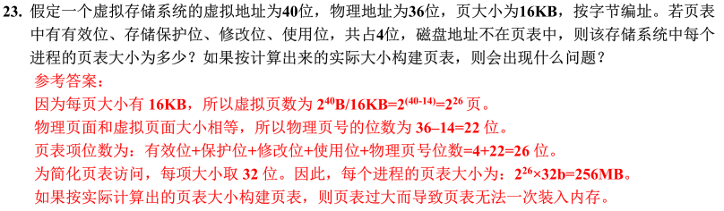
>
> 2）主存：256MB（28位物理地址）；Cache：64KB；块大小：4B。
> $$
> \begin{align}
> 标记位+索引位&=log_2\cfrac{主存}{块大小}=log_2\cfrac{256MB}{4B}=log_22^{26}=26位\\
> 索引位&=log_2\cfrac{Cache}{块大小}=log_2\cfrac{64KB}{4B}==log_22^{14}=14位 \\
> 标记位&=(标记位+索引位)-索引位=26-14=12位\\
> 块内地址&=log_2\cfrac{块大小}{字节}=log_2\cfrac{4B}{1B}=2位
> \end{align}
> $$
>
> > 参考下题：（*计算机组成课后答案-袁春风-第4章-存储系统-10*）
> >
> > 
>
> 3）存储结构：页表(5ns) $\longrightarrow$  Cache(5ns) $\longrightarrow$ 主存(40ns)
>
> 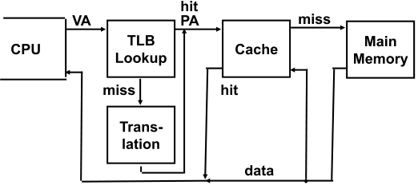
>
> - 一次cache命中访问时间：= 页表(5ns) + Cache(5ns) =10ns
> - cache失效访问时间：= 页表(5ns) + Cache(5ns) + 主存(40ns) =50ns
> - 命中率为90%平均访问时间：= 90%命中 + 10%失效= 14ns
>
> 4）系统进程切换时以下操作是否需要：
>
> a）清除 cache 有效位：不需要，cache在物理上对应
>
> b）将已经调入页表清空：需要，每一个进程都有自己的页表（地址映射关系）
>
> 5）Cache改为与虚拟地址进行映射来缓存数据，使之可以直接使用虚拟地址访问。Cache设计如下：
> $$
> \begin{align}
> 标记位+索引位&=log_2\cfrac{\color{red}{虚存} }{块大小}=log_2\cfrac{\color{red}{1GB} }{4B}=log_22^{\color{red}{28} }={\color{red}{28} }位\\
> 索引位&=log_2\cfrac{Cache}{块大小}=log_2\cfrac{64KB}{4B}==log_22^{14}=14位 \\
> 标记位&=(标记位+索引位)-索引位={\color{red}{28} }-14={\color{red}{14} }位
> \end{align}
> $$
>
> - 改进后一次cache命中访问时间：= Cache|页表(5ns) =5ns
> - 改进后cache失效访问时间：= Cache|页表(5ns) + 主存(40ns) =45ns
> - cache90%命中率的时候的平均访问时间：= 90%命中 + 10%失效= 9ns
>
> > 参考：https://zhuanlan.zhihu.com/p/31875174
> >
> > http://www.ecs.csun.edu/~cputnam/Comp546/Putnam/Cache%20Memory.pdf
> >
> > 
> >
> > 注：这种情况下，系统进程切换就需要清除cache有效位了。

### 计算机网络

#### 选择题

##### SNMP

（1）以下关于 SNMP 协议说法错误的是（）
A.SNMP 协议具有性能管理，故障管理，配置管理，记账管理和安全管理
B.SNMP 采用 TCP 协议进行管理
C.?
D..?

> B。 SNMP作为TCP/IP协议一部分，SNMP消息被封装为**UDP**(user datagram protocol)并在IP协议中封装和传输， 
>
> > 参考：https://www.jianshu.com/p/6a9e83aa41c0

#### 信道利用率

4.太空站的 128kbps，发送 512 字节，端到端的传输延迟 300ms，确认帧长度忽略不计，接收窗口足够大，问发送窗口分别为 1，15，27 时，吞吐量为多少？若要使信道利用率达到最大，则帧序号至少为多少位？

> RTT=2*300ms=0.6s。
>
> | 发送窗口 | 1                  | 15                    | 27(溢出) |
> | -------- | ------------------ | --------------------- | -------- |
> | 吞吐量   | 512B*1/RTT=6.8kb/s | 512B*15/RTT=102.4kb/s | 128kb/s  |
>
> 同时，要使信道利用率达到最大（100%），有
> $$
> 发送时间=\cfrac{发送字节\times 帧序号数}{发送速率}=\cfrac{512B\times x}{128\,kb/s}=\cfrac{x}{32}s\geq 0.6s=RTT
> $$
> 故帧序号位数$\geq log_219.2>4$，至少为5位。

#### *路由器大题（路由算法）

5.已知有如下网络，边的权值表示花费。

> 给一个网络的表填写距离向量表和路径表，ip 地址为 200.1.5.0/24 四个局域网分别有 78，38，14，9 个主机，划分子网，每个路由器的端口，网络地址范围。


（1）若采用距离向量算法和水平分裂算法，写出 D 节点收到的信息，表格如下。

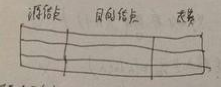

（2）使用 RIP 算法写出 D 收敛后的转发表，表格格式如下。

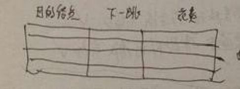

（3）若采用链路状态协议，写出 D 收到的链路状态，若表格中源和和目的等价，即 AB 和 BA 等价，表格格式如下。

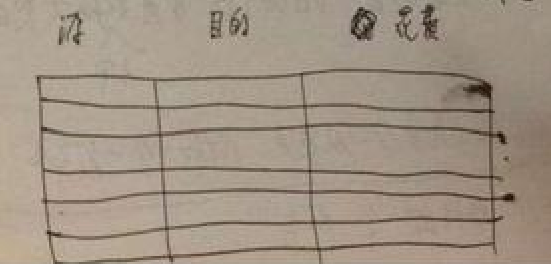

（4）若局域网 1 到 4 分别有 78，38，14，4 台主机，请将网路 202.1.5.0/24 分配给图中局域网和路由器间网段，写出划分后的网络，以及路由器端口 IP 地址及掩码。

> （1）D 节点收到的信息：【为避免歧义，此处不妨认为各路由已经收敛，下面是常规的转发】
>
> - B不发。
>
> - C发送的距离表：
>
> | 源节点 | 目的节点 | 花费 |
> | ------ | -------- | ---- |
> | C      | A        | 4    |
>
> > 关于水平分裂技术：http://www.023wg.com/lypz/96.html。 
> >
> > > 水平分割（Split Horizon）的原理是，RIP从某个接口**<font color=red>学到</font>**的路由（学到的意思是，最优值是从这个端口发来的信息来更新获得的），**不会从该接口再发回**给邻居路由器。这样不但减少了带宽消耗，还可以防止路由环路。 
> >
> > *PPT-P533*关于水平分裂算法的描述： **<font color=red>到X的距离不向真正通向X的邻居节点报告</font>**，使得坏消息也传得慢。
> >
> > 水平分裂技术在这里的主要作用应该是处理图中的路由器环路。发送的两个距离表中，不包含BC之间的距离信息。（B的网络是通过D到C的网络的，D是C的邻居，B不把这个信息发给D【**到X的距离，不向X的邻居发**】）
> >
> > https://www.cnblogs.com/hnrainll/archive/2011/10/18/2216575.html
> >
> > > "普通的水平分割"是:如果一条路由信息是从X端口学习到的,那么从该端口发出的路由更新报文中将不再包含该条路由信息.
> > >
> > > "带毒化逆转的水平分割"是:如果一条路由信息是从X端口学习到的,那么从该端口发出的路由更新报文中将继续包含该条路由信息,而且将这条信息的metric置为16.
> > >
> > > > 水平分裂其实已经隐含了毒性分割（不发=距离无穷大），设为16只不过是显式的表达出来而已，从而加快收敛。
>
> （2）D 收敛后的路由表：
>
> | 目的节点 | 下一跳 | 花费 |
> | -------- | ------ | ---- |
> | A        | C      | 5    |
> | B        | B      | 2    |
> | C        | C      | 1    |
>
> （3）D 收到的链路状态：
>
> | 源节点 | 目的节点 | 花费 |
> | ------ | -------- | ---- |
> | A      | B        | 8    |
> | A      | C        | 4    |
> | B      | D        | 2    |
> | C      | D        | 1    |
> > 链路状态协议记录的全局的拓扑结构，或许**只是记录图中所有的边（直连）**？
> >
> > 
>
> （4）网络规划如下：（200.1.5.0/24总共网络地址个数为256）
>
> - LAN1：200.1.5.`0 0000000`/25 = 200.1.5.0/25（128-2>78台）
>   - 路由器A-e0端口：200.1.5.1/25
> - LAN2：200.1.5.`10 000000`/26 = 200.1.5.128/26（64-2>38台）
>   - 路由器B-e0端口：200.1.5.129/26
> - LAN3：200.1.5.`1100 0000`/28 = 200.1.5.192/28（16-2=14台）
>   - 路由器C-e0端口：200.1.5.193/28
> - LAN4：200.1.5.`1101 0000`/28 = 200.1.5.208/28（16-2>9台）
>   - 路由器D-e0端口：200.1.5.209/28
> - A-B网段：200.1.5.`11100 000`/29 = 200.1.5.224/29（8-2>2台）
>   - 路由器A-e1端口：200.1.5.225/29
>   - 路由器B-e1端口：200.1.5.226/29
> - A-C网段：200.1.5.`11101 000`/29 = 200.1.5.232/29（8-2>2台）
>   - 路由器B-e2端口：200.1.5.233/29
>   - 路由器C-e2端口：200.1.5.234/29
> - B-D网段：200.1.5.`11110 000`/29 = 200.1.5.240/29（8-2>2台）
>   - 路由器C-e2端口：200.1.5.241/29
>   - 路由器D-e2端口：200.1.5.242/29
> - C-D网段：200.1.5.`11111 000`/29 = 200.1.5.248/29（8-2>2台）
>   - 路由器D-e1端口：200.1.5.249/29
>   - 路由器A-e1端口：200.1.5.250/29

## 2016

### 数据结构

#### 判断题

##### 地址运算

判断：指针 p 指向某一个逻辑地址，那么 p++就是访问下一个逻辑地址。

> 命题为**<font color=blue>假</font>**。p++访问下一个**物理**地址。

##### 插入排序

折半插入算法在寻找插入的位置时，采用的是二分查找，因此整个折半插入算法的时间复杂度为O(n*logn).

> 命题为**<font color=blue>假</font>**。比较操作使用二分查找，不改善整体复杂度（比较+移动）。移动操作的复杂度仍然O(n)。

##### 起泡排序

在进行起泡排序时，有可能出现某些元素在排序过程中一直远离它的最终位置。

> 命题为**<font color=red>真</font>**。
>
> 
>
> > 参考：*习题集1-3-b*。

##### Dijkstra算法

权值都为正整数的图能否用Dijkstra（迪佳斯特拉）算法构造出最短路径？

> 命题为**<font color=red>真</font>**。单源最短路。

#### 选择题

##### BST

二叉搜索树中最大的节点
A 仅有左孩子，没有右孩子
B 仅有右孩子，没有左孩子
C 既有左孩子，又有右孩子
D 没有左孩子，也没有右孩子

> 此题有问题。只能确定没有右孩子。

##### 条件栈混洗

一组输入MAMAMIA入栈，要求出栈顺序也为MAMAMIA。共有几种方案?

```
A.4     B.5    C.6    D.7
```

> 

##### AVL树

在 AVL 树中，（）可能会发生两次旋转调整？
A 添加、删除节点操作
B 仅删除节点操作
C 仅添加节点操作
D 添加、删除节点都不

> A。教材上AVL树一节，双旋。

#### 算法题

##### 二叉树遍历

给出中序序列{D B A E C F}和层次序列{A B C D E F}能否唯一确定一颗二叉树？能给出步骤，不能的话请构造其中一棵

> 能。
>
> 对于任意一个
>
> - 中序：####…**M**####…
> - 层次：**M**########……
>
> 根据层次遍历可确定根节点在中序中的位置，则中序遍历分为左右两个子序列，从而可以递归地确定。
>
> - 中序：##…**L**##…  M  ##…**R**##…
> - 层次：M  **LR**######……
>
> 就本题而言，
>
> - D B   **<font color=red>A</font>**   E C F；**<font color=red>A</font>**   B C D E F
> - D **<font color=blue>B</font>**   **<font color=red>A</font>**   E **<font color=blue>C</font>** F；**<font color=red>A</font>**   **<font color=blue>B</font>** **<font color=blue>C</font>** D E F

##### Prim 算法

程序应该是 prim 算法，问是否能够构成最小生成树，如果能就证明，不能举出例子驳斥V 表示图的点集，U 表示已经确定路径的点集，初始时 U 为空，F 为已经确定的路径，初始也为空。先任意取一点 u 放入 U，然后在 V-U 中遍历 u 的邻接点，选权值最小的边 e 和点 v 放入 F和 U 中，具体算法就请翻书吧

> 翻书复习。Prim算法可以依托PFS实现，只需将顶点的优先级更新器，更换成Prim对应的策略（当前新加入点所有连接的UNDISCOVERD点的优先级，依照对应的边权取min进行更新）即可。

##### 散列表

散列表长为 13，采用双散列函数解决冲突：`H(key) = key % 13`，`H’(key) = ( 7 * key % 10 ) + 1`。
输入顺序为：12，23，45，57，20，03，78，31，15，36。
【回忆版题面已按习题解析对应题面修正，实际考试中可能有所简化】
1) 构造散列表
2) 求等概率下搜索成功的平均查找长度

> 1）构造方法如下：
>
> 
>
> |            构造             | 0                         | 1    | 2                         | 3                         | 4      | 5      | 6      | 7    | 8    | 9    | 10                        | 11   | 12     | <font color=blue>SSL</font> |
> | :-------------------------: | ------------------------- | ---- | ------------------------- | ------------------------- | ------ | ------ | ------ | ---- | ---- | ---- | ------------------------- | ---- | ------ | --------------------------- |
> |            `12`             |                           |      |                           |                           |        |        |        |      |      |      |                           |      | **12** | 1 |
> |            `23`            |                           |      |                     |                           |        |        |        |      |      |      | **23** |      | 12   | 1 |
> |            `45`            |                           |      |                         |                           |        |        | **45** |      |      |      | 23                  |      | 12 | 1 |
> |            `57`            |                           |      |                         |                     |        | **57** | 45 |      |      |      | 23                      |      | 12   | 1 |
> | `20` |                           |      |  |  |  | 57 | 45 | **20** |      |      | 23                      |      | 12   | 1 |
> |            `03`            |                     |      |                         | **03**                    |      | 57 | 45 | 20 |      |      | 23                      |      | 12 | 1 |
> | `78` | **78**              |      |                         | 03                      |  | 57 | 45 | 20 |  |      | 23                      |      | 12   | 1 |
> | <font color=red>`31`</font> | <font color=red>78</font> |      |                         | 03                      |      | <font color=red>**57**</font> | 45 | 20 | **31** |      | 23 |      | 12   | 3 |
> | `15` | 78 |      | **15**                  | 03 |      | 57   | 45 | 20 | 31 |      | 23 |      | 12 | 1 |
> | <font color=red>`36`</font> | <font color=red>78</font> | | 15 | <font color=red>03</font> |  | 57 | <font color=red>45</font> | 20 | 31 | **36** | <font color=red>**23**</font> | | 12 | 5 |
>
> 2）记成功查找长度为SSL(Succeeded Search Length)，失败查找长度为FSL(Failed Search Length)。计算如上表最后两列所示。
>
> - 查找成功的平均查找长度ASL = `(1+1+1+1+1+1+1+3+1+5) / 10` = 16/10
>
> > 参考：https://blog.csdn.net/longlovefilm/article/details/78009782
>
> 本题应该是《数据结构习题解析(第2版)-殷人坤》上的原题。原题中还考察了**线性探查法**。其解法如下：
>
> |              构造               | 0      | 1    | 2      | 3      | 4    | 5                             | 6                         | 7                         | 8      | 9    | 10                            | 11     | 12     | <font color=blue>SSL</font> |
> | :-----------------------------: | ------ | ---- | ------ | ------ | ---- | ----------------------------- | ------------------------- | ------------------------- | ------ | ---- | ----------------------------- | ------ | ------ | --------------------------- |
> |              `12`               |        |      |        |        |      |                               |                           |                           |        |      |                               |        | **12** | 1                           |
> |              `23`               |        |      |        |        |      |                               |                           |                           |        |      | **23**                        |        | 12     | 1                           |
> |              `45`               |        |      |        |        |      |                               | **45**                    |                           |        |      | 23                            |        | 12     | 1                           |
> |              `57`               |        |      |        |        |      | **57**                        | 45                        |                           |        |      | 23                            |        | 12     | 1                           |
> |              `20`               |        |      |        |        |      | 57                            | 45                        | **20**                    |        |      | 23                            |        | 12     | 1                           |
> |              `03`               |        |      |        | **03** |      | 57                            | 45                        | 20                        |        |      | 23                            |        | 12     | 1                           |
> |              `78`               | **78** |      |        | 03     |      | 57                            | 45                        | 20                        |        |      | 23                            |        | 12     | 1                           |
> |   <font color=red>`31`</font>   | 78     |      |        | 03     |      | <font color=red>**57**</font> | <font color=red>45</font> | <font color=red>20</font> | **31** |      | 23                            |        | 12     | 4                           |
> |              `15`               | 78     |      | **15** | 03     |      | 57                            | 45                        | 20                        | 31     |      | 23                            |        | 12     | 1                           |
> |   <font color=red>`36`</font>   | 78     |      | 15     | 03     |      | 57                            | 45                        | 20                        | 31     |      | <font color=red>**23**</font> | **36** | 12     | 2                           |
> | <font color=blue>**FSL**</font> | 2      | 1    | 3      | 2      | 1    | 5                             | 4                         | 3                         | 2      | 1    | 5                             | 4      | 3      |                             |
>
> - 查找成功的平均查找长度ASL = `(1+1+1+1+1+1+1+4+1+2) / 10` = 14/10
> - 查找失败的平均查找长度ASL = `(2+1+3+2+1+5+4+3+2+1+5+4+3) / 13` = 36/13
>
> > 参考：*《数据结构习题解析(第2版)-殷人坤》-P127-习题6-9*

##### RPN重建表达式树

设计一个算法，把一个中序遍历 ABCD-*+EF??(后面三个符号忘记了不过不重要)构造成如下图所示的二叉树


a) 描述算法思想
b) 伪代码实现

> 给的也不是中序遍历啊。。明明是RPN。。
>
> 就按照RPN求值的方法类似地搞一搞，遇到运算时就合并二叉树，从而建树。
>
> ```c++
> stack<tree> Num; // 森林栈
> tree rebuild(string input){
>     for(int i = 0; i < input.size(); ++i){
>         char tmp = input[i];
>         if(tmp is 代数){
>             tree NewTree(tmp);  // 用tmp初始化一棵新树
>             Num.push(NewTree); // 加入栈
>         } else{
>             tree a = Num.pop(), b = Num.pop(); // 弹出操作数
>             Num.push(caculate(a, b, tmp)); // 计算结果并加入栈
>         }
>     }
>     return Num.top();  // 最后剩下1颗树即为所求
> }
> ```

##### 子数组

求一个数组A中**连续相同**数字的和**等于s**的最长子数组长度，例如A={1,1,2,1,1,1,2,1}，s=3，
则所求子数组长度为 3，要求算法时间复杂度不超过 O(n)，空间复杂度不超过 O(1)
a) 描述算法思想
b) 伪代码实现
c) 计算程序的算法复杂度。

> 比较简单。遇到新数字`count`重置，否则累加，若等于`s`了，则更新答案为`s/count`。
>
> ```c++
> int seek_s(int s, vector<int> A){
>     int k = 0, num = A[0], count = A[0], ans = 0;
>     while(++k<A.size()){
>         if(A[k] != num){
>             count = num = A[k];
>         }
>         else{
>             count += A[k];
>             if(count == s) ans = max(ans, s/count);
>         }
>     }
>     return ans;
> }
> ```
>
> 算法复杂度：$O(n)$。

##### *二叉树遍历

给了一个算法，问访问节点的顺序，树的样子是一颗深度为 4 的二叉树。

```c++
Typedef struct binNode{
    char data;
    struct binNode *rc,*lc;//左子树右子树
} binNode;

twist(node x){
    if(!x) return;
    if(x->rc){
        twist(x->lc->rc);
        putchar(x->data);
        twist(忘了);
        putchar(忘了);
    }
    Else{
        Twist(忘了);
        Putchar(忘了);
    }
}
```

> ？？？
>
> >  类似：https://stackoverflow.com/questions/6976938/balanced-binary-tree-visit-with-a-twist

### 操作系统

#### 判断题

##### 线程切换

1)8 位 cpu 不能进行线程切换

> 命题为**<font color=blue>假</font>**。跟位数没关系。

##### 死锁

3)死锁必要条件：互斥访问，占有并等待，非剥夺，循环等待

> 命题为**<font color=red>真</font>**。

#### 多选题

##### 程序/进程

1) 程序和进程的区别
A 程序啥啥啥
B 进程啥啥啥
C 进程是动态啥啥啥
D 程序是动态啥啥啥

> 大概率选C。

##### *Cache

2) 忘了就记得选项 C 有些数据 cache 并不能存放 D 多核处理器共享一个高速缓存

> D选项错，高速缓存分级，有共享部分也有互斥部分。
>
> 

#### 文件系统

3 一个文件系统采用索引结点方式存储文件，一个索引结点包括两个直接文件指针，一个一级间接文件指针表（糟糕，忘记是索引表还是指针表了）一个存储块为 8KB，一个指针 4B，问理论上这个文件系统能存放的最大文件是多大？用 TB+GB+MB+KB+B 表示

> 能存放的最大文件大小 = 能寻址到的最大的存储空间 = 数据块数量 * 数据块大小。
>
> 索引节点含：2个直接块，1个一级指针。
>
> - 2个直接块：`2 * 8KB` = 16KB
> - 1个一级指针：`8KB / 4B` = 2K个直接块
>   - 2K个直接块：`2K * 8KB` = 16MB
> - 总计：16MB+16KB
>
> 文件系统参考408相关真题，比如：*408-2018年真题-46*。

### 组成原理

#### 流水线大题

3 任何指令的执行部件可以抽象为一个逻辑组件和寄存器的结构，逻辑组件的延迟为 150ps，
寄存器为 10ps，示意图如下


逻辑部件又可以抽象为下图几个部件的组成：


- 1） 要形成一个 4 级流水，应该将三个寄存器安插在那些位置？问该四级流水的延迟和最大吞吐率
- 2） 为达到最大的吞吐率应该设计成几级流水？寄存器应该安插在哪些位置？问该流水的延迟和最大吞吐率

> 因为40+B+35+D+15+25=150，所以B+D=35ps，不妨设B=20ps，C=15ps。
>
> 1）应该使得流水线尽量均衡。
>
> 三个寄存器分别插在A、B，D之后，获得：`40 20 50 40`（A|B|CD|EF）。因而时钟周期为`60`ps，最大吞吐量为16.7GIPS，延迟为`4*60`=240ps。
>
> 2）若增加流水级，时钟周期下降，则表明存在更优解；否则，只会增加指令延迟，成为无效改进。因而最优流水级取决于最大的部件延迟。可以看到，A的延迟最高，成为性能瓶颈。以A为准，可划分为五级流水（A|B|C|DE**|**F或A|B|C|D**|**EF）。时钟周期为`50`ps，最大吞吐量为20GIPS，延迟为`5*50`=250ps。
>
> > 参考：*《深入理解计算机》-练习题-4.28*，与此题类似。

如果将上面的部件形成五级流水，分为取指（F），分析（D），执行（E），访存（M），写回（W）五个阶段，每个阶段占一个时钟周期，%edx, %edy %edz %edv 为寄存器


- 3） 以下三个指令按指令流水进行，为了获得最大吞吐率应进行哪些操作？三条指令一共用了多少个时钟周期？（每条指令所需要的上一条结果的数据都要等到上一条运算的结果才能进行）

```
MOV  100, %edx
MOV  200, %edy
ADD %edx, %edy(具体最后一条实在想不起来)
```

- 4） 以下四个指令按指令流水进行，为了获得最大吞吐率应进行哪些操作？四条指令一共用了多少个时钟周期？（每条指令所需要的上一条结果的数据都要等到上一条运算的结果才能进行）
  （程序都想不起来了囧，就记得前两条是把数字移入寄存器，第三条的执行需要前两条数据，最后一条需要第三条的数据）

> 3）目测数据冲突，为获取最大吞吐量（流水尽量不停）采用旁路技术，时钟周期数=3+5-1=7。
>
> 4）根据题目描述，存在3次数据冲突。采用旁路技术解决之（第二条和第三条指令存在load-use冲突，必须暂停流水线1个周期）。故四条指令共用(4+5-1)+1=9个时钟周期。

### 计算机网络

#### 选择题

##### SMTP协议

1) SMTP 协议正确的是
A 服务器不能给客户发送邮件（记不清了）
B 客户不能接收服务器数据
C 一个 TCP 通道不能发送多封邮件
D 服务器之间不能互相传送邮件

> A。SMTP只能发给服务器。B错，客户可以采用POP3接收服务器数据。C错，显然是可以的。D显然错。

##### HTTP协议

用户用http请求访问一个网页，网页一共有一个短文本和5个jpg图，问用户从请求连接到能看到整个网页为止共经过（）个RTT？

A8 B7 C6 D5

> B。忽略发送时延。HTML基本文件包含短文本，即总共6个报文。
>
> 对于非持续连接：
>
> - 2次握手。1个RTT
> - 第3次握手，捎带HTML请求；返回文件。1个RTT
> - 总计：(1+1)*6=12 RTT 不符合题目要求，舍去
>
> 对于持续连接：
>
> - 2次握手。1个RTT
> - 第3次握手，捎带HTML请求；返回文件。1个RTT
> - 持续请求发送。5个RTT
> - 总计：1+1+5=7 RTT
>
> 对于持续连接（流水线）：
>
> - 2次握手。1个RTT
> - 第3次握手，捎带HTML请求；流水线发送所有请求。0.5个RTT
> - 收到所有文件。0.5个RTT
> - 总计：1+0.5+0.5=2 RTT 不符合题目要求，舍去

#### TCP拥塞控制大题

关于拥塞避免的，A向B发送数据，阈值为16KB，MSS=1KB

- 1 A一直向B发送数据，未遇到超时情况，当A收到了ACK为8KB的报文后，拥塞窗口的大小为多少？
- 2 A一直向B发送数据，未遇到超时情况，当A收到了ACK为31KB的报文后，拥塞窗口的大小为多少？
- 3 当遇到超时后，（好像是又经过了多少RTT记不太清了）新阈值和此时窗口大小为多少

> 不妨认为这里使用慢开始和拥塞避免策略。（MSS=最大报文段长度）
>
> “ACK为8KB”指的是发送的第8个MSS的ACK帧。（但序号一般是从0开始计算的，即对应序号为7）
>
> 1）不超时，ACK=8KB<15KB，处于慢开始阶段，拥塞窗口的大小=9KB。
>
> > 慢开始阶段，窗口初始值=1KB。窗口的大小=初始值+发送帧数=1+8=9KB（**动态增加**）。
>
> 2）不超时，ACK=31KB，31-15=16KB，处于首次拥塞避免阶段，拥塞窗口的大小=17KB。
>
> >  当传输进行到**拥塞避免**的时候，应该是**当前拥塞窗口的所有发送数据都收到确认后，拥塞窗口才加一**，题里说阈值是16KB，则当收到ACK为15KB的（第15个）报文后，拥塞窗口到达15KB，达到阈值，进入拥塞避免阶段，之后拥塞窗口的数据全部发送，**要等到ACK为31KB的时候，拥塞窗口才能加一，成为17KB**，而此时的ACK达到了31KB，所以拥塞窗口是16+1=17KB。 （From：[Here](https://github.com/stellarkey/912_project/issues/4)，已改动）
>
> 3）超时，不妨设设此时拥塞窗口为40KB
>
> - 由拥塞避免，1RTT后，阈值为20KB（腰斩）
> - 由慢开始，窗口恢复为1MSS=1KB。
>
> > 原题见：*典例-传输层*。
> >
> > 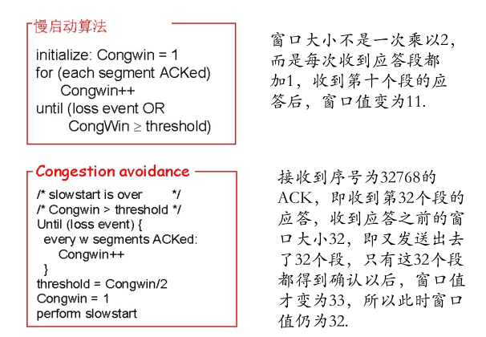
> >
> > 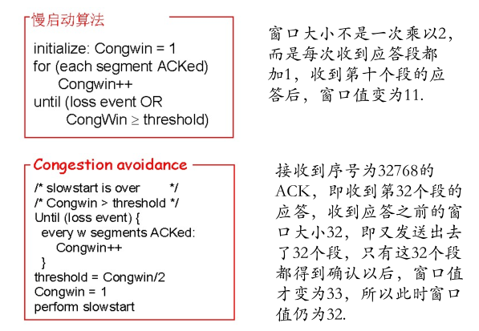

#### *路由器大题

一个网络路由 A 可以兼容 IPv4 和 IPv6，题目也给出了 A 的路由表，网络示意图如下：


1）路由 B 发 RIP 协议给 A，问 A 会把那个消息发送给 B，在发送的那条后面打√（A 有三个接口，每个接口都给出了 ip 地址，但我想不起来了）

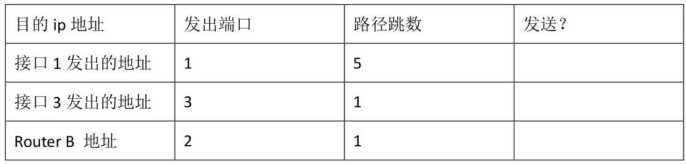

2）路由 B 和 A 交换了路由表，问 B 路由表新增的条项是啥，填入下表


路由 B 具有 NAT 功能，宿舍管理员因此给宿舍电脑分配了一批 ip 地址，（都是 10.9 打头的，具体想不起来），如果客户机要访问 dns 服务器，B 就会从 ip 转换池里挑出一个 ip 地址与该客户机的 IP 地址进行映射，比如将 ip 池中的 224.1.1.7（想不起来我自己编的）分配给客户机，那么其他网络就通过 224.1.1.7 访问该客户机，而不是客户机自己的 ip 地址。A 的转换方式也是如此。

3）填写下表中 ip 数据报的源地址和目的地址，C 代表客户机，F 代表 DNS 服务器，B 代表路由 B


4） 路由 B 要经过 A 来访问 IPv6 网络，问 A 中 B 的映射表项内容，只需给出一个可能项即可


> 1）此题应该是考察水平分裂算法。
>
> | 目的IP地址      | 发出端口 | 路径跳数 | 发送？             |
> | --------------- | -------- | -------- | ------------------ |
> | 接口1发出的地址 | 1        | 5        | 发送               |
> | 接口3发出的地址 | 3        | 1        | 发送               |
> | Router B的地址  | 2        | 1        | 不发送（水平分裂） |
>
> > 注：接口1的路径跳数应该是1吧。
> >
> > 注：如果是IPv6地址应该也不合法？
>
> 2）跳数+1，发出端口改为B接收信息的端口。
>
> | 目的IP地址          | 发出端口 | 路径跳数 |
> | ------------------- | -------- | -------- |
> | 1问中的A表的某1个？ | 1（B的） | 2        |
>
> > 注：可能需要填写经过A路由器的IPv6到IPv4的地址转换后的IPv4地址。
>
> 3）C 代表客户机，F 代表 DNS 服务器，B 代表路由 B。注意到路由B具有 地址转换 功能。B存储IPv4的地址池。但是B是NAT，任何局域网外的通信都不采用宿舍网的内网地址。
>
> | 传送线路             | 源IP地址                    | 目的IP地址                  |
> | -------------------- | --------------------------- | --------------------------- |
> | $C\longrightarrow B$ | 192.168.X.X（客户机内网IP） | 192.168.Y.Y（B接口2）       |
> | $B\longrightarrow F$ | 214.1.Z.Z（B接口1）         | DNS服务器地址               |
> | $F\longrightarrow B$ | DNS服务器地址               | 214.1.Z.Z（B接口1）         |
> | $B\longrightarrow C$ | 192.168.Y.Y（B接口2）       | 192.168.X.X（客户机内网IP） |
>
> > 注：注意到此题或许是客户机**DNS解析**的过程。那么表应该填写为如下：
>
> | 传送线路             | 源IP地址                    | 目的IP地址                  |
> | -------------------- | --------------------------- | --------------------------- |
> | $C\longrightarrow B$ | 192.168.X.X（客户机内网IP） | DNS服务器地址               |
> | $B\longrightarrow F$ | 10.9.Z.Z（B分配IP）         | DNS服务器地址               |
> | $F\longrightarrow B$ | DNS服务器地址               | 10.9.Z.Z（B分配IP）         |
> | $B\longrightarrow C$ | DNS服务器地址               | 192.168.X.X（客户机内网IP） |
>
> 4）
>
> | IPv4地址                        | IPv6地址        |
> | ------------------------------- | --------------- |
> | 214.1.?.?（B的端口1的IPv4地址） | 从A地址池中分配 |