<center><font face=kaiti size=3>“考试期间严禁使用任何个人电子设备，可携带并查阅任何纸质材料”</font></center>

---


<center><font face=kaiti size=20>912 SCL </font></center>

<div STYLE="page-break-after: always;"></div>

---

<div STYLE="page-break-after: always;"></div>

# 目录

[TOC]

<div STYLE="page-break-after: always;"></div>

# 通用

## I/O模板

### Fast_I/O

当大量IO时，一般用`scanf`/`printf`进行输入输出即可解决。

#### 输入封装

避免重复书写`scanf()`。

```c++
int readint(){   // 整数输入，禁止嵌套并行使用
    int x; scanf("%d", &x); return x;
}
vector<int> vc;
vc.pushback(readint());
```

#### 手写I/O优化

手写`readint()`的高速输入法。

```c++
inline int freadint(){   // 快速读入
    int x=0,f=1;char ch=getchar();
    while (!isdigit(ch)){if (ch=='-') f=-1;ch=getchar();}
    while (isdigit(ch)){x=x*10+ch-48;ch=getchar();}
    return x*f;
}
```

或模板型：

```c++
template<class T>
T read(T &x){
    x=0;char ch=0;
    while(ch < '0' || ch > '9')ch=getchar();
    while(ch >= '0' && ch <= '9'){x=x*10+ch-'0';ch=getchar();}
    return x;
}

int n=read(n),p=read(p),k=read(k);
```

I/O同时优化：

```c++
int read() {
    int x = 0, w = 1;
    char ch = 0;
    while (ch < '0' || ch > '9') {  // ch 不是数字时
        if (ch == '-') w = -1;        // 判断是否为负
        ch = getchar();               // 继续读入
    }
    while (ch >= '0' && ch <= '9') {  // ch 是数字时
        x = x * 10 + (ch - '0');  // 将新读入的数字’加’在 x 的后面
        // x 是 int 类型，char 类型的 ch 和 ’0’ 会被自动转为其对应的
        // ASCII 码，相当于将 ch 转化为对应数字
        // 此处也可以使用 (x<<3)+(x<<1) 的写法来代替 x*10
        ch = getchar();  // 继续读入
    }
    return x * w;  // 数字 * 正负号 = 实际数值
}

inline void write(int x) {
    static int sta[35];
    int top = 0;
    do {
        sta[top++] = x % 10, x /= 10;
    } while (x);
    while (top) putchar(sta[--top] + 48);  // 48 是 '0'
}


int num = read(); write(num);
```

##### 光速I/O

```c++
namespace IO {
const int MAXSIZE = 1 << 20;
char buf[MAXSIZE], *p1, *p2;
#define gc()                                                               \
  (p1 == p2 && (p2 = (p1 = buf) + fread(buf, 1, MAXSIZE, stdin), p1 == p2) \
       ? EOF                                                               \
       : *p1++)
inline int rd() {
  int x = 0, f = 1;
  char c = gc();
  while (!isdigit(c)) {
    if (c == '-') f = -1;
    c = gc();
  }
  while (isdigit(c)) x = x * 10 + (c ^ 48), c = gc();
  return x * f;
}
char pbuf[1 << 20], *pp = pbuf;
inline void push(const char &c) {
  if (pp - pbuf == 1 << 20) fwrite(pbuf, 1, 1 << 20, stdout), pp = pbuf;
  *pp++ = c;
}
inline void write(int x) {
  static int sta[35];
  int top = 0;
  do {
    sta[top++] = x % 10, x /= 10;
  } while (x);
  while (top) push(sta[--top] + '0');
}
}  // namespace IO
```

### I/O重定向

```c++
#define _OJ_ 
// ...
#ifndef _OJ_
    freopen("OJ.in", "r", stdin);
    freopen("OJ.out", "w", stdout);
#endif
```

### 多组测试数据

```c++
int n;  // 组数
while(scanf("%d", &n) != EOF){ // EOF = -1，表示End of File（输入结束）
    // ...
}
while(cin >> n != NULL){   // NULL = 0，若cin无捕获时返回NULL
    // ...
}
// 对字符串则
while(gets(STRING)){ // gets()读至并丢弃换行符；scanf读至空格或换行，并保留相应字符在缓冲中，需用getchar()善后
    // ...
}
```

#### 循环宏

```c++
#define _for(i,a,b) for(int i =(a); i < (b); ++i)
#define _rep(i,a,b) for(int i =(a); i <= (b); ++i)
```

### C++ I/O模板

```c++
#include<bits/stdc++.h>
using namespace std;
#define _OJ_ // 调试开关
#define MAXN 2000005
#define INF  1000000007  // or 0x7fffffff  or INT_MAX
#define _for(i,a,b) for(int i =(a); i < (b); ++i) // 循环宏
#define _rep(i,a,b) for(int i =(a); i <= (b); ++i)
typedef long long ll;
typedef pair<string, string> pss;
typedef pair<int, int> pii;
typedef pair<string, int> psi;
const double PI = acos(-1.0);
const double eps = 1e-6;
const int MOD = 1e7 + 7;


//---------------------------代码实现---------------------------


//---------------------------结束实现---------------------------

int main(){
    ios_base::sync_with_stdio(false); cin.tie(NULL);  // cin/cout加速
#ifndef _OJ_
    freopen("OJ.in", "r", stdin);
    freopen("OJ.out", "w", stdout);
#endif
    
    int n, m; cin >> n >> m;
    vector<int> A; int tmp;
    _for(i, 0, n) {cin >> tmp; A.push_back(tmp); }
    int a[MAXN];
    _for(i, 0, n) {cin>>a[i];}

#ifndef _OJ_
    cout <<"A: "<< A <<endl;
    _for(i, 0, n) cout << a[i] << " \n"[i == n - 1];
    _rep(i, 1, n) cout << a[i] << " \n"[i == n];
#endif
    
    return 0;
}
```

### Java I/O模板

```java
import java.io.*;
import java.util.*;
import java.math.BigInteger; // 高精度整数
import java.math.BigDecimal; // 高精度实数，使用方法类似
public class Main {
    public static void main(String args[]) throws Exception {
        Scanner cin=new Scanner(System.in);
        int a = cin.nextInt(), b = cin.nextInt();  // A + B problem
        System.out.println(a+b);
    }
}
```

### Python I/O模板

```python
#!/usr/bin/env python3
a, b = map(int, input().split(' ')) # A + B problem
print(a + b)

import sys
sys.stdin = open("OJ.in", mode='r')    # 输入重定向
sys.stdout = open("OJ.out", mode='w')  # 输出重定向

A = list(map(int, input().split()))
print(A)
```

```python
import sys
if __name__ == '__main__':
    a, b = sys.stdin.readline().split(' ')
    print(int(a) + int(b))
```

多组测试数据：

```Python
while True:  
    try:  
        a, b = map(int, raw_input().strip().split())  
        print(a + b)
    except EOFError:
        break
```

## 复杂度适定表

### 时间限制（千万）

> 参考时间一般为**`1000ms`**。
>
> 一般而言，可行的算法复杂度在数字意义上不能超过**一<font color=red>千万</font>**，即$10^7$。

|         数据范围          | 允许算法复杂度 |     常用思路     |
| :-----------------------: | :------------: | :--------------: |
|         $\infty$          |   $O(logn)$    | 二分、数论、打表 |
| $10^7\longrightarrow10^8$ |     $O(n)$     |    在线、减治    |
| $10^5\longrightarrow10^6$ |   $O(nlogn)$   |    排序、分治    |
| $10^3\longrightarrow10^4$ |    $O(n^2)$    |     动态规划     |
|  $200\longrightarrow500$  |    $O(n^3)$    |       模拟       |
|   $20\longrightarrow50$   |    $O(2^n)$    |     BFS/DFS      |
|           $12$            |    $O(n!)$     |       组合       |

### 空间限制（千万）

参考内存一般为`256MB`。大约相当于64M个`int`（可开**<font color=red>千万</font>级数组**），其余类型可换算。

> 机试中通常不对空间做特别要求，因此常常适用“空间换时间”。

#### 栈溢出

递归过深/局部数组达百万级常引发爆栈，此时需改写方法，或手动加栈：

```c++
#pragma comment(linker, "/STACK:1024000000,1024000000")
// 放在头文件之前
```

## C++头文件

### 万能头 `bits/stdc++.h`

```c++
#include<bits/stdc++.h>
```

### 常规头

| 头文件        | 说明                                      |
| ------------- | ----------------------------------------- |
| **iostream**  | 数据流输入/输出，如cin，cout等            |
| **string**    | 字符串类                                  |
| **vector**    | STL 动态数组容器                          |
| **queue**     | STL 队列容器                              |
| **set**       | STL 集合容器                              |
| **stack**     | STL 堆栈容器                              |
| **algorithm** | STL 通用算法，如find等                    |
| deque         | STL 双端队列容器                          |
| list          | STL 线性列表容器                          |
| map           | STL 映射容器                              |
| iterator      | STL 迭代器                                |
| utility       | STL 通用模板类，如pair，make_pair等       |
| bitset        | STL 位集容器                              |
| stdexcept     | 标准异常类                                |
| new           | 动态内存分配                              |
| memory        | STL通过分配器进行的内存分配，如auto_ptr等 |
| numeric       | STL常用的数字操作，如accumulate等         |
| random        | 随机数                                    |
| regex         | 正则表达式                                |

```c++
#include<cstdio>
#include<cstring>
#include<algorithm>
#include<iostream>
#include<string>
#include<vector>
#include<stack>
#include<bitset>
#include<cstdlib>
#include<cmath>
#include<set>
#include<list>
#include<deque>
#include<map>
#include<queue>
#include<functional>  // less/greater等
```

<div STYLE="page-break-after: always;"></div>

# 模拟

> 模拟题一般不考察效率，因此在策略上应倾向于采用Python解决。

## 枚举

### 子集枚举

```c++
void print_subset(int n, bool* B, int cur){
    if(cur == n) { // 递归完毕
        for(int i = 0; i < cur; ++i) // 打印当前集合
            if(B[i]) printf("%d ", i);
        printf("\n");
        return ;
    }
    B[cur] = 1; // 选第cur个元素
    print_subset(n ,B, cur+1);
    B[cur] = 0; // 不选第cur个元素
    print_subset(n ,B, cur+1);
}
```

> 亦可采用STL中的 `bitset` 位图。

二进制法：

```c++
void print_subset(int n, int s){
    for(int i = 0; i < n; ++i) // 打印当前集合
        if(s & (1<<i)) printf("%d ", i);
    printf("\n");
}
// 枚举
for(int i = 0; i < (1 << n); ++i)
    print_subset(n, i);
```

### 回溯法

即剪枝版的深度优先搜索。

```c++
void DFS(int cur){
    if(/*边界条件*/){
        // do something...
	}
    else{
        for(...){ // 依次采取所有可能的下一步
            EXECUTE(i); // 采取i策略
            vis[i] = true; // 设置使用标记
            dfs(cur+1);
            vis[i] = false; // 清除标记
        }
    }
}
```

### 扫描法

扫描法往往在枚举时维护一些重要的量，从而简化计算。例如，从左到右考虑数组的各个元素，也可以说从左到右“扫描”。


#### 尺取法/滑动窗口 $O(n)$

端点单调的双指针。

例：输入一个序列，找到最长连续子序列，保证其内部没有相同元素。

> 利用滑动窗口+`set`。`set`的单次插/查/删都是$O(logn)$。总复杂度为$O(nlogn)$。
>
> 也可以利用`map`预处理，利用序列A处理序列B，B中元素是“A中当前元素的上一个相同元素的下标”。总复杂度为$O(nlogn+n)=O(nlogn)$。

#### 众数 $O(n)$

```c++
int majEleCandidate(vector<int> A){
    int maj; // 候选
    for(int c = 0, i = 0; i < A.size(); ++i)
        if( 0 == c){
            maj = A[i]; c = 1;
        } else
            maj == A[i] ? c++ : c--;
    return maj;    // 众数若存在，必为maj。但需要O(n)验证
}
```

### 二分法 $O(logn)$

见到“**最大最小**”同时出现时，考虑二分法。二分法的基本思路：“**<font color=red>猜</font>**”，如果能够事先确定答案的范围，那么就可以二分来不断猜测正确答案，利用轴点是否能满足某个条件来缩减区间。

例：把一个长度为N的序列A划分成k个连续子序列，使得每个子序列的和`S[i]`中的最大值尽量小。

> 二分范围：$[0, \;\sum A[i]\;]$。总复杂度为$O(Nlog\{\sum A[i]\})$。
>
> 每轮，判断对于轴点`x`，是否存在划分，使得`max{s[i]} <= x`？这不难判断。只需扫描一遍，每次尽量往右划分即可。

#### 二分剪枝

有时，可以提前确定并缩小二分法的范围。（如19年真题-第2题-高精度开根）

通过对二分的上下界的准确定界预处理，使得效率增加。（当**M越大，效果越好**）

二分剪枝$O(\cfrac{1}{M}logN)$ $\times$ 高精度乘法$O((logN)^2)$ $\times$ 快速幂$O(logM)$。（Python自带快速幂）

> `a**(1/b)`表示a的b次根，等价于`pow(a, 1/b)`，存在精度误差。

```python
#!/usr/bin/env python3
m = int(input())
n = int(input())
le, ri = 0, 1
while pow(ri, m) < n:  # 剪枝
    le, ri= ri, 2*ri
print(le, ri)
while le < ri - 1:  # O(log(ri - le))
    mid = (le + ri) >> 1
    t = pow(mid, m) # O(logn)
    if t <= n:
        le = mid
    else:
        ri = mid
print(le)
```

### 折半枚举（中途相遇法） $O(\sqrt M)$

对`n`个自由变量的组合问题，可以化为两个`n/2`的子问题分步求解。

如，给定4个集合，从中依次抽取4个元素`a,b,c,d`，使得`a+b+c+d=0`，问：有多少种选法？

> 先计算`a+b`耗费$O(n^2)$并保存到新集M中；同理计算`-(c+d)`的组合耗费$O(n^2)$保存到新集N。此时只需再按照N中元素查找M集即可，耗费$O(n^2logn)$。

### 模拟退火

如果能够给出状态的能量函数（能量越低状态越优秀），则可以采用模拟退火。

> 有n个重物，每个重物系在一条足够长的绳子上。每条绳子自上而下穿过桌面上的洞，然后系在一起。图中X处就是公共的绳结。假设绳子是完全弹性的（不会造成能量损失），桌子足够高（因而重物不会垂到地上），且忽略所有的摩擦。问绳结X最终平衡于何处。
>
> 文件的第一行为一个正整数n（1≤n≤1000），表示重物和洞的数目。接下来的n行，每行是3个整数：Xi.Yi.Wi，分别表示第i个洞的坐标以及第 i个重物的重量。(-10000≤x,y≤10000, 0<w≤1000 )

```c++
#include <bits/stdc++.h>
#define down 0.996//徐徐降温 

using namespace std;

int n;
struct node{
int x;
int y;
int w;
}object[2005];//存下物体的坐标 
double ansx,ansy,answ;//最终答案 
double energy(double x,double y)//根据物理学知识,能量总和越小越稳定 
{
   double r=0,dx,dy;
   for (int a=1;a<=n;a++)
   {
      dx=x-object[a].x;
      dy=y-object[a].y;
      r+=sqrt(dx*dx+dy*dy)*object[a].w;   // 计算重力势能
   }
      return r;
}
void sa()//模拟退火 
{
   double t=3000;//温度要足够高 
   while (t>1e-15)//略大于0 
   {
      double ex=ansx+(rand()*2-RAND_MAX)*t;//随机产生新的答案 
      double ey=ansy+(rand()*2-RAND_MAX)*t;
      double ew=energy(ex,ey);
      double de=ew-answ;
      if (de<0)//如果此答案更优，就接受 
      {
         ansx=ex;
         ansy=ey;
         answ=ew;
      }
      else if(exp(-de/t)*RAND_MAX>rand())//否则根据多项式概率接受 
      {
         ansx=ex;
         ansy=ey;
      }
      t*=down;
   }
}
void solve()//多跑几遍退火,增加得到最优解的概率 
{
   sa();
   sa();
   sa();
   sa();
}
int main() {
    cin>>n;
    for (int a=1;a<=n;a++)
    {
       scanf("%d%d%d",&object[a].x,&object[a].y,&object[a].w);
       ansx+=object[a].x;
       ansy+=object[a].y;
    }
    ansx/=n;//以平均数作为初始答案 
    ansy/=n;
    answ=energy(ansx,ansy);
    solve();
    printf("%.3lf %.3lf\n",ansx,ansy);//华丽的输出 
    return 0;
}
```

## 语法解析

### 表达式求值

> Python支持自动表达式求值：`print(eval(input()) % 10000)`。

```c++
#include<bits/stdc++.h>
#define For(i,l,r) for(int i=(l);i<=(r);i++)
using namespace std;   //+  -  *  /  ( )  ^
const int prior[7][7]={{ 1, 1,-1,-1,-1,1,-1},		  
/*栈顶运算vs当前运算*/ { 1, 1,-1,-1,-1,1,-1},		
/*栈顶运算优先算，置1*/{ 1, 1, 1, 1,-1,1,-1},
/*当前运算先算，置-1*/ { 1, 1, 1, 1,-1,1,-1},
/*对括号特殊处理，置0*/{-1,-1,-1,-1,-1,0,-1},		//左边为左括号，则右边什么运算都要先算，除了右括号 
					   { 0, 0, 0, 0, 0,0, 0},			//这一行其实没有意义可以随便赋初值，因为左括号不会出现在栈顶	
					   { 1, 1, 1, 1,-1,1, 1}};		
char strh[2000]={0},strz[2000]={0};			//后缀表达式字符串，中缀表达式字符串 
char opst[10000],top=0;						//运算符栈 
int numst[10000],t=0;
int f(char op){		//将运算符对应到0-6的标号 
	switch(op){
		case '+': return 0;
		case '-': return 1;
		case '*': return 2;
		case '/': return 3;
		case '(': return 4;
		case ')': return 5;
		case '^': return 6;	
	}
}

void convert(char strz[],char strh[]){
	int len=strlen(strz);
	int j=0;
	opst[++top]='('; //在最外层添加左括号 
	
	//以下部分，opst[top]是栈顶的上一个运算符，strz[i]是当前扫描到的运算符 
	
	For(i,0,len-1){				
		if (isdigit(strz[i])) strh[j++]=strz[i];		//如果是操作数，直接输出到strh中 
		else {
			while (prior[f(opst[top])][f(strz[i])]>0)	//将所有优先于strz[i]的opst[top]都弹出 
				strh[j++]=opst[top--];
			if (prior[f(opst[top])][f(strz[i])]==0)		//如果str[i]是右括号，将栈顶的左括号弹出 
				top--;
			else
				opst[++top]=strz[i];					//如果str[i]不是右括号，将strz[i]压入栈
		}
	}
}

void print(char s[]){//给后缀表达式的剩余部分加上空格输出 
	int len=strlen(s);
	For(i,0,len-1){
		printf("%c ",s[i]);	
	}
	printf("\n");				
}

void cal(char strh[]){		//后缀表达式的计算 
	int len=strlen(strh);
	print(strh);			//输出后缀表达式本身 
	For(i,0,len-1) 			//扫描后缀表达式 
		if (isdigit(strh[i])) numst[++t]=strh[i]-'0';		//数字字符就入操作数栈 
		else {
			t--;											//否则根据strh[i]运算符对栈顶的两个元素进行计算 
			switch(strh[i]){
				case '+':numst[t]=numst[t]+numst[t+1];break;
				case '-':numst[t]=numst[t]-numst[t+1];break;
				case '*':numst[t]=numst[t]*numst[t+1];break;
				case '/':numst[t]=numst[t]/numst[t+1];break;
				case '^':numst[t]=pow(numst[t],numst[t+1]);break;
			}
			For(j,1,t) printf("%d ",numst[j]);				//输出计算完这一步的后缀表达式中间过程 
			print(strh+i+1);								//分两段输出，前面一段对应操作数栈，后面一段对应未扫描的strh 
		}
}

int main(){
	gets(strz);
	int len=strlen(strz);
	strz[len]=')';
	strz[len+1]='\0';
	//在最外层添加右括号 
	convert(strz,strh);
	cal(strh);
	return 0;
}
```

## 字符串

### KMP算法 $O(n)$

模式串匹配。多个模式串时采用AC自动机。

```c++
int next[MAXN];
int KMP(string text, string pattern){   // 输入参数保证为序列即可
    int i = next[0] = -1, j = 0;
    int n = text.size(), m = pattern.size();
    while(j < m){   // 自匹配，获得next[]表
        if(i == -1 || pattern[j] == pattern[i]){
            i++; j++; next[j] = i;
        } else{
            i = next[i];
        }
    }

    i = j = 0;   // KMP
    while(i < n && j < m) {
        if(j == -1 || text[i] == pattern[j]){
            i++; j++;
        } else{
            j = next[j];   // 失配
        }
        // if(j == m){  // 依次输出所有匹配位置
        //     cout << i - j + 1 << endl;
        //     j = next[j];   // 完美匹配，当作失配处理
        // }
    }
    if(j == m) return i - j + 1;
    else return -1;
}
```

#### Z函数/扩展KMP $O(n)$

对于一般的 KMP 只需要求所有 `extend[i] == m` 的位置，那么 ExKMP 就是需要求出这个 `extend[i]` 数组。

> 求解`T`与`S`对的每一个后缀的**最长公共前缀**LCP。
>
> 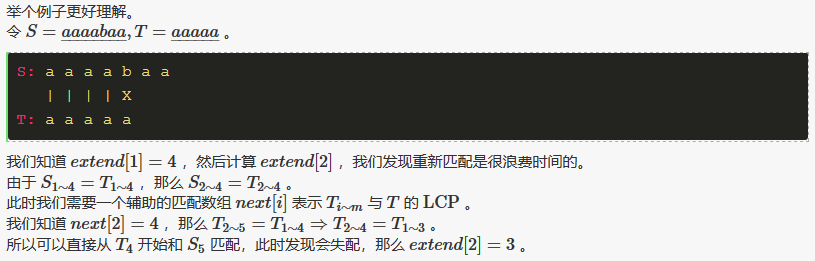

```c++
#include <bits/stdc++.h>

#define For(i, l, r) for (register int i = (l), i##end = (int)(r); i <= i##end; ++i)
#define Fordown(i, r, l) for (register int i = (r), i##end = (int)(l); i >= i##end; --i)
#define Rep(i, r) for (register int i = (0), i##end = (int)(r); i < i##end; ++i)
#define Set(a, v) memset(a, v, sizeof(a))
#define Cpy(a, b) memcpy(a, b, sizeof(a))
#define debug(x) cout << #x << ": " << (x) << endl
#define next Next

using namespace std;

template<typename T> inline bool chkmin(T &a, T b) { return b < a ? a = b, 1 : 0; }
template<typename T> inline bool chkmax(T &a, T b) { return b > a ? a = b, 1 : 0; }

inline int read() {
    int x(0), sgn(1); char ch(getchar());
    for (; !isdigit(ch); ch = getchar()) if (ch == '-') sgn = -1;
    for (; isdigit(ch); ch = getchar()) x = (x * 10) + (ch ^ 48);
    return x * sgn;
}

void File() {
#ifdef zjp_shadow
	freopen ("1461.in", "r", stdin);
	freopen ("1461.out", "w", stdout);
#endif
}

const int N = 1e6 + 1e3;

void Get_Next(char *S, int *next) {
    int lenS = strlen(S + 1), p = 1, pos;
    next[1] = lenS; // 对于 next[1] 要特殊考虑
    while (p + 1 <= lenS && S[p] == S[p + 1]) ++ p;
    next[pos = 2] = p - 1; // next[2] 是为了初始化
 
    For (i, 3, lenS) { // 注意此时 k + 1 = i
        int len = next[i - pos + 1];
        if (len + i < p + 1) next[i] = len; // 对应上面第一种情况
        else {
            int j = max(p - i + 1, 0); // 找到前面对于 子串 最靠后已经匹配的位置
            while (i + j <= lenS && S[j + 1] == S[i + j]) ++ j; // 第二种需要暴力匹配
            p = i + (next[pos = i] = j) - 1; // 记得更新 p, pos
        }
    }
}
 
void ExKMP(char *S, char *T, int *next, int *extend) {
    int lenS = strlen(S + 1), lenT = strlen(T + 1), p = 1, pos;
 
    while (p <= lenT && S[p] == T[p]) ++ p;
    p = extend[pos = 1] = p - 1; // 初始化 extend[1]
 
    For (i, 2, lenS) {
        int len = next[i - pos + 1];
        if (len + i < p + 1) extend[i] = len;
        else {
            int j = max(p - i + 1, 0);
            while (i + j <= lenS && j <= lenT && T[j + 1] == S[i + j]) ++ j;
            p = i + (extend[pos = i] = j) - 1;
        }
    } // 和上面基本一模一样啦
}

char S[N], T[N]; int next[N], extend[N]; // next:S与S的LCP数组；extend:S与T的LCP数组

int main () {

	File();

	scanf ("%s", S + 1);
	scanf ("%s", T + 1);

	Get_Next(T, next);
	ExKMP(S, T, next, extend);

	For (i, 1, strlen(S + 1))
		printf ("%d%c", extend[i], i == iend ? '\n' : ' ');

    return 0;

}
```

### Manacher算法 $O(n)$

> 求最长回文子串。

```c++
char Ma[MAXN*2];
int Mp[MAXN*2];
void Manacher(char s[],int len){
    int l=0;
    Ma[l++]='$';
    Ma[l++]='#';
    for(int i=0;i<len;i++){
        Ma[l++]=s[i];
        Ma[l++]='#';
    }
    Ma[l]=0;
    int mx=0,id=0;
    for(int i=0;i<l;i++){
        Mp[i]=mx>i?min(Mp[2*id − i],mx − i):1;
        while(Ma[i+Mp[i]]==Ma[i − Mp[i]])Mp[i]++;
        if(i+Mp[i]>mx){
            mx=i+Mp[i];
            id=i;
        }
    }
}
/*
* abaaba
* i: 0 1 2 3 4 5 6 7 8 9 10 11 12 13
* Ma[i]: $ # a # b # a # a # b # a #
* Mp[i]: 1 1 2 1 4 1 2 7 2 1 4 1 2 1
*/
char s[MAXN];
int main(){
    while(scanf("%s",s)==1){
        int len=strlen(s);
        Manacher(s,len);
        int ans=0;
        for(int i=0;i<2*len+2;i++)
        	ans=max(ans,Mp[i] − 1);
        printf("%d\n",ans);
    }
    return 0;
}
```

### 最小表示法 $O(n)$

求解与字符串`S`循环同构的最小字典序的字符串。

> 如对于`S = deabc`，最小表示位置为`2`(`a`)，最小字符串为`abcde`。

```c++
int min_cyclic_string(string sec){
    int k = 0, i = 0, j = 1, n = sec.size();
    while (k < n && i < n && j < n) {
      if (sec[(i + k) % n] == sec[(j + k) % n]) {
        k++;
      } else {
        sec[(i + k) % n] > sec[(j + k) % n] ? i = i + k + 1 : j = j + k + 1;
        if (i == j) i++;
        k = 0;
      }
    }
    return min(i, j);    // 返回最小表示串的起始位置
}
```

#### Lyhdon分解法 $O(n)$

Lyndon 串：对于字符串 S，如果 S 的字典序严格小于 S 的所有后缀的字典序，我们称  S  是简单串，或者 **Lyndon 串** 。举一些例子，`a`  , `b` ,  `ab`  ,  `aab` ,  `abb` , `ababb`  ,  `abcd` 都是 Lyndon 串。如果 S 是 Lyndon 串，当且仅当 S 的字典序严格小于它的所有非平凡的循环同构串。

```c++
string min_cyclic_string(string s) {
  s += s;
  int n = s.size();
  int i = 0, ans = 0;
  while (i < n / 2) {
    ans = i;
    int j = i + 1, k = i;
    while (j < n && s[k] <= s[j]) {
      if (s[k] < s[j])
        k = i;
      else
        k++;
      j++;
    }
    while (i <= k) i += j - k;
  }
  return s.substr(ans, n / 2);    // 返回最小表示串
}
```

##### Lyhdon分解

Lyndon 分解：串 S 的 Lyndon 分解（划分）记为`W1 W2 ... Wk`，其中所有 `Wi` 为简单串，并且他们的字典序按照非严格单减排序，即 `W1 >= W2 >= ... >= Wk` 。可以发现，这样的分解存在且唯一。

```c++
vector<string> duval(string const& s) {
  int n = s.size(), i = 0;
  vector<string> factorization;
  while (i < n) {
    int j = i + 1, k = i;
    while (j < n && s[k] <= s[j]) {
      if (s[k] < s[j])
        k = i;
      else
        k++;
      j++;
    }
    while (i <= k) {
      factorization.push_back(s.substr(i, j - k));
      i += j - k;
    }
  }
  return factorization;    // 返回分解结果
}

int main(){
    string s = "fghacdabcde";
    vector<string> factorization = duval(s);
    for(int i = 0; i < factorization.size(); ++i) cout << factorization[i] <<" \n"[i == factorization.size() - 1];
    return 0;
}
```

## 日期

给定日期，

- `week()`：计算星期几
- `kthDay()`：计算是该年的第几天

```c++
struct Date{
    int year, month, day;
    Date(int y, int m, int d): year(y), month(m), day(d) {}
    int week(){   // 今天是星期几？ 基姆拉尔森公式
        int y = year, m = month, d = day;
        if(m==1||m==2) m+=12,y--;
        int w = (d+2*m+3*(m+1)/5 + y + y/4 - y/100 + y/400) % 7;
        return ++w; // w：0:星期一...依此类推
    }
    int MONTH[13] = {0, 31, 28, 31, 30, 31, 30, 31, 31, 30, 31, 30, 31};
    int kthDay(){  // 给定一个日期，输出这个日期是该年的第几天
        if(year % 4 == 0 && (year % 100 || year % 400 == 0))
            MONTH[2] = 29;
        int days = 0;
        _for(i, 1, month) days += MONTH[i];
        return days += day;
    }
};
```

<div STYLE="page-break-after: always;"></div>

# 排序

> 尽量借助`STL`实现排序。

## 快速排序 $\Theta(nlogn)+O(1)$

### LUG分类快排

```c++
void quicksort(vector<int> &a, int le, int ri){
    if(le >= ri - 1) return;
    int i = le - 1, j = le - 1, pivot = ri - 1, r = (rand()%(ri-le))+le;
    swap(a[pivot], a[r]); // 随机化处理
    while(++j < pivot){
        if(a[j] < a[pivot])
            swap(a[++i], a[j]);
    }
    swap(a[i + 1], a[pivot]);
    quicksort(a, le, i+1);
    quicksort(a, i+2, ri);
}
```

### LUG双向快排

```c++
void quicksort(vector<int> &a, int le, int ri){
    int i = le, j = ri - 1, Pivot = a[(rand()%(ri-le))+le];
    while(i <= j){ // 双指针分类
    	while(a[i]<Pivot) i++;
        while(a[j]>Pivot) j--;
        if(i<=j) swap(a[i++],a[j--]);
    }
    if(le < j  ) quicksort(a, le, j+1);
    if(i < ri-1) quicksort(a,  i,  ri);
}
```

## 二分查找 $O(logn)$

> 亦可采用STL算法，如：`binary_search(beg, end, e, cmp)` / `lower_bound(a, a+a.size(), x, cmp)`等。

```c++
int binarySearch(vector<int> &a, int e){ // 保证输入有序; lower_bound形式
    int le = 0, ri = a.size();
    while(ri - le > 1){ // [le, ri)夹逼
        int mid = (le + ri) >> 1;
        if(a[mid] <= e)
            le = mid; // le处元素总是<=
        else
            ri = mid; // ri处元素总是>
    }
    return le; // 返回下标
}
```

## 归并排序 $O(nlogn)+O(n)$

```c++
void mergesort(vector<int>& a, int le, int ri){   // [le, ri)
    if(le >= ri - 1) return ;
    int mid = (le + ri) >> 1;
    mergesort(a, le, mid); mergesort(a, mid, ri);
    vector<int> b;  //辅助数组
    int p = le, q = mid;
    while(p < mid && q < ri)
        if(a[p] <= a[q])  b.push_back(a[p++]);
        else  b.push_back(a[q++]);
    while(p < mid) b.push_back(a[p++]);
    while(q < ri)  b.push_back(a[q++]);
    for(int i = le; i < ri; ++i) a[i] = b[i-le];
}
```

STL写法：（或者直接调用`stable_sort()`）

```c++
void mergesort(vector<int>& a, int le, int ri){   // [le, ri)
    if(le >= ri - 1) return ;
    int mid = (le + ri) >> 1;
    mergesort(a, le, mid); mergesort(a, mid, ri);
    inplace_merge(a.begin() + le, a.begin() + mid, a.begin()+ ri); // STL就地归并
}
```

### 求逆序对

```c++
long long mergesort(vector<int>& a, long long le, long long ri){
    long long ans = 0;
    if(le >= ri - 1) return 0;
    long long mid = (le + ri) >> 1;
    ans += mergesort(a, le, mid);
    ans += mergesort(a, mid, ri);
    
    vector<long long> b;  //辅助数组
    long long p = le, q = mid;
    long long count = 0;
    while(p < mid && q < ri){
        if(a[p] <= a[q]) b.push_back(a[p++]);
        else{
            b.push_back(a[q++]);
            count += (mid - p); // 求逆序
        }
    }
    while(p < mid) b.push_back(a[p++]);
    while(q < ri)  b.push_back(a[q++]);
    for(long long i = le; i < ri; ++i)
        a[i] = b[i-le];
    
    ans += count;
    //ans += min(count, (mid - le)*(ri - mid) - count); //求二叉树最小逆序
    return ans;
}
```

<div STYLE="page-break-after: always;"></div>

# 动态规划

> DP问题的复杂度由两部分组成：状态数$\times$状态转移复杂度。
>
> 动态规划的**难点在于选取<font color=red>合适的状态</font>**。
>
> 做题时明确三个核心：**状态方程设计**、**边界条件**、**递推顺序和约束**。
>
> 动态规划的特点：最优子结构 + 子问题重复。
>
> DP有两种状态转移策略：
>
> - 【刷表法】：更新`dp[i]`影响的所有后继（必须保证每个状态依赖的所有影响相互独立）
> - 【填表法】：利用`dp[i]`的所有前驱，一次性状态转移计算出`dp[i]`

## 贪心

### 区间问题

#### 不相交区间


#### 区间选点


#### 区间覆盖


#### 线性基

给定n个整数（数字可能重复），求在这些数中选取任意个【不一定连续】，使得他们的异或和最大。

```c++
#include <cstdio>
#define maxn 105
typedef long long Lovelive;
Lovelive base[maxn];
int main() {
    Lovelive n, tmp;
    scanf("%lld", &n);   // 【n个整数】
    for (int i = 0; i < n; ++i) {
        scanf("%lld", &tmp);  // 【输入每个整数】
        for (int j = 50; j >= 0; --j) {
            if(tmp & (1LL << j)) {   // 贪心
                if(!base[j]) base[j] = tmp;
                tmp ^= base[j];
            }
        }
    }
    Lovelive ans = 0;
    for(int i = 50; i >= 0; --i) {
        if(ans < (ans ^ base[i])) ans ^= base[i];
    }
    printf("%lld\n", ans);   // 【最大异或和】
}
```

## DAG模型

> 很多问题可以转化为DAG上的最长路、最短路或路径计数问题。

对于具有**二元关系**的特征，可以用图来建模，即用一条有向边来对应表示一个关系。（这样我们便可以先预处理出一个DAG，将问题转化为DAG模型的求解问题）

### DAG最短路/最长路

> 先将图建立好，假设用邻接矩阵保存在矩阵G中。

#### 记忆化搜索求解DAG $O(e)$

```c++
int d[MAXN];
bool vis[MAXN]; memset(vis, 0, sizeof(vis)); // vis[i]须初始化
int DP(int i){
    int& ans = d[i]; // 引用昵称，简化读写操作
    if(vis[i]) return ans; // 记忆化
    ans = 1; vis[i] = true;
    for(int j = 1; j <= n; ++j)
        if(G[i][j]) // 存在有向边
            ans = max(ans, DP(j) + 1); // min则求解最短路
    return ans;
}
```

### 多段图

多段图是特殊的DAG，其结点可以划分成若干个**阶段**，每个阶段只由上一个阶段所决定。

多阶段决策问题，阶段定义了天然的计算顺序，因此更适宜采用递推法。如，背包问题。

## 背包问题（链式结构DP）

### 01背包 $O(nV) + O(V)$

`dp[i][j]`表示总体积不超过`j`时前`i`个物品所能达到的最大价值。第`i`件物品体积为`w[i]`，价值为`v[i]`。
$$
\begin{equation}
dp[i, j]=\left\{
\begin{array}{ll}
0 & {\text { if } i=0 ,\;j为任意值} \\
{\max (dp[i-1, j-w[i]]+v[i], dp[i-1, j])}
\end{array}\right.
\end{equation}
$$

> 转移时注意保证`j-w[i]`非负，若为负值不能进行转移。

```c++
int dp[2][MAXN]; // 滚动数组，全局变量自动初始化
int DP(vector<int> w, vector<int> v, int n, int V){ // n为物品数，V为背包容量，w是重量
    for(int i = 0; i < n; ++i)
        for(int j = V; j >= 0; --j) // 为了防止干扰，倒序更新
            dp[(i+1)&1][j] = (j < w[i]) ? (dp[i&1][j]) : max(dp[i&1][j], dp[i&1][j-w[i]] + v[i]);
    return dp[n&1][V];
}
```

降维版本：（*DAG模型*）

```c++
int dp[MAXN]; // 一维复用；全局变量自动初始化
int DP(vector<int> w, vector<int> v, int n, int V){ // n为物品数，V为背包容量，w是重量
    for(int i = 0; i < n; ++i)
        for(int j = V; j >= w[i]; --j) // 为了防止干扰，倒序更新
            dp[j] = max(dp[j], dp[j-w[i]] + v[i]);
    return dp[V];
}
```

**恰好装满**背包版本：

- `dp[i][j]`表示总体积恰好为`j`时前`i`个物品所能达到的最大价值。
- 初始值改变：`dp[0][0] = 0`，`dp[0][j] = -INF/不存在`。（其他步骤不变）

### 完全背包 $O(nV) + O(V)$

每个物品均有无限个。

```c++
int dp[MAXN]; // 滚动数组，全局变量自动初始化
int DP(vector<int> w, vector<int> v, int n, int V){ // n为物品数，V为背包容量，w是重量
    for(int i = 0; i < n; ++i)
        for(int j = w[i]; j <= V; ++j) // 正序更新！！！
            dp[j] = max(dp[j], dp[j-w[i]] + v[i]);
    return dp[V];
}
```

> 01背包每件物品最多选择一次，因此倒序保证更新时前缀总是没有放入过`i`物品；完全背包每件物品可选无数次，因此正序更新反而恰好满足题意。

### 多重背包 $O(V\times \sum \text{log}_2k_i)$

每个物品有有限个。第`i`种物品体积为`w[i]`，价值为`v[i]`，个数为`k[i]`。

（1）直接当作01背包处理：$O(V*\sum k_i)$

（2）二进制拆分+01背包：$O(V\times \sum \text{log}_2k_i)$

- 每种物品拆分为多组，每组包含物品个数为：1，2，4，…，k-2^c+1；其中c为使得k-2^c+1>0的最大整数。对这些若干组物品的不同组合，可以得到0-k之间任意件物品的价值重量和。对分组后的物品进行01背包，即可得到多重背包的解。

```c++
int __v[MAXN], __w[MAXN], cnt = 0; // 拆分后物品总数
for(int i = 0; i < n; ++i){ // 分组
    int v, w, k;
    scanf("%d%d%d", &w, &v, &k);
    int c = 1;
    while(k - c > 0){
        k -= c;
        __w[cnt]   = c*w;
        __v[cnt++] = c*v;
        c >>= 1;
    }
	__w[cnt]   = k*w;
    __v[cnt++] = k*v;
}
// 接着做01背包即可
```

## 线性结构DP

### 最大子段和 $O(n)$

`d[i]`表示以`A[i]`结尾的连续序列的最大和。
$$
\begin{equation}
dp[i]=\left\{
\begin{array}{ll}
A[0] & {\text { if } i=0 }\\
max\{A[i], \;dp[i-1] + A[i]\}
\end{array}\right.
\end{equation}
$$

```c++
int dp[MAXN];
int MCS(vector<int>& A){
    int ret = dp[0] = A[0];
    for(int i = 1; i < A.size(); ++i){
        dp[i] = max(A[i], dp[i - 1] + A[i]);
        ret = max(ret, dp[i]);
    }
    return ret;
}
```

#### 计算最大子段和所在区间 $O(n)$

```c++
int dp[MAXN];
pair<int, int> seq[MAXN];  // 记录区间
pair<int, int> MCS(vector<int>& A){
    dp[0] = A[0];
    seq[0] = make_pair(0, 0);
    for(int i = 1; i < A.size(); ++i){
        dp[i] = max(A[i], dp[i - 1] + A[i]);
        if(A[i] < dp[i - 1] + A[i]) // 扩展
            seq[i].first = seq[i - 1].first,  seq[i].second = i;
        else // 单个元素作为新区间
            seq[i].first = seq[i].second = i;
    }
    int ret = 0;
    for(int i = 0; i < A.size(); ++i) 
        if(dp[ret] < dp[i]) ret = i;
    return seq[ret];
}
```

#### 最大双子段和 打擂法 $O(n)$

给定一个长度为n的整数序列，要求从中选出两个连续子序列，使得这两个连续子序列的序列和之和最大，最终只需输出最大和。一个连续子序列的和为该子序列中所有数之和。每个连续子序列的最小长度为1，并且**两个连续子序列之间至少间隔一个数**。

> 预处理前`i - 1`个数的最大和，后`i + 1`个数的最大和。那么只需枚举`i`即可求出最大双序列和。

```c++
ll pre[MAXN], succ[MAXN];
ll MDCS(vector<ll>& A){
    int n = A.size();
    pre[0] = A[0]; succ[n - 1] = A[n - 1];
    _for(i, 1, n) pre[i] = max(A[i], pre[i - 1] + A[i]);
    _for(i, 1, n) pre[i] = max(pre[i-1], pre[i]);
    for(int i = n - 2; i >= 0; --i) succ[i] = max(A[i], succ[i+1] + A[i]);
    for(int i = n - 2; i >= 0; --i) succ[i] = max(succ[i+1], succ[i]);
    ll ret = pre[0] + succ[2];
    _rep(i, 2, n - 2) ret = max(ret, pre[i-1] + succ[i+1]);
    return ret;
}
```

#### 最大m子段和 $O(mn)$

给定由n个整数（可能为负整数）组成的序列，以及一个正整数m，要求确定序列m个不相交子段，使得这m个子段的总和达到最大，求出最大和。

```c++
ll f[MAXN][5][2];  // 表示前i个元素，j段，第i个元素是否选的最大子段和
ll MCMS(vector<ll>& A, ll m){
    ll n = A.size();
    memset(f,-0x7f,sizeof(f));
    f[1][0][0] = 0; f[1][1][1] = A[0];
    _rep(i, 2, n)
        _rep(j, 0, m){
            f[i][j][0] = max(f[i-1][j][1], f[i-1][j][0]);
            if(j > 0) f[i][j][1] = max(f[i-1][j][1], f[i-1][j-1][0]) + A[i - 1];
        }
    return max(f[n][m][0], f[n][m][1]);
}
```

#### 受限最大子段和 $O(n)$

计算：子段长度**不大于m**的最大子段和；子段长度**不小于m**的最大子段和。

> 利用前缀和+单调队列+滑动窗口。动态维护窗口内的`sum[i]`的最值。

```c++
int sum[MAXN];
int RMCS(vector<int>& A, int m){
    int ret= A[0], n = A.size(); sum[0] = 0; sum[1] = A[0];  // 为了适应窗口
    _rep(i, 2, n) sum[i] = sum[i - 1] + A[i - 1];  // 前缀和
    // cout << "sum: "; _rep(i, 0, n) cout << sum[i] << " \n"[i == n];
    deque<int> MQ; MQ.push_back(0);  // 单调栈，保存秩
    _rep(i, 1, n){
        if(i - MQ.front() >= m + 1) // 受限约束，注意sum前缀的窗口大小是 m + 1
            MQ.pop_front();
        while(!MQ.empty() && sum[MQ.back()] > sum[i]) // 维护单调栈
            MQ.pop_back();
        MQ.push_back(i);
        // cout <<"i: "<<i<<"; MQ: "<<MQ.front()<<"; ret: " << ret << "; new:" << sum[i] <<" - "<< sum[MQ.front()]<<" = "<< sum[i] - sum[MQ.front()]<<endl;
        ret = max(ret, sum[i] - sum[MQ.front()]);  // 受限最大子段和
    }
    return ret;
}
```

##### 受限最小子段长度 $O(n)$

给出了N个正整数（10 <N <100 000）的序列，
每个正整数均小于或等于10000，并给出了一个正整数S（S <100 000 000）。
编写程序以查找序列中连续元素的子序列的最小长度，其总和大于或等于S。

> 尺取法。

```c++
int RMCL(vector<int>& A, int S){
    int ret = 1, sum = A[0], i = 0, j = 1;  // 尺取[i, j)
    while(j < A.size()){
        while(sum < S && j < A.size()){  // 区间右扩张
            sum += A[j++];
        }
        while(sum >= S){                 // 区间左缩减
            ret = max(ret, j - i);
            sum -= A[i++];
        }
    }
    return ret;
}
```

#### 环状最大子段和 $O(2n)$

> 第一种方法：将序列倍长，就可以做一遍长度不大于n的受限最大子段和。
>
> 第二种方法：最大子段和 + 打擂法计算最大跨区子段和（预处理前缀、后缀和）。
>
> 第三种方法：最大子段和 + 最小子段和。【此处实现】

```c++
int dp[MAXN];
int MCS(vector<int>& A){
    int ret = dp[0] = A[0];
    for(int i = 1; i < A.size(); ++i){
        dp[i] = max(A[i], dp[i - 1] + A[i]);
        ret = max(ret, dp[i]);
    }
    return ret;
}
int CMCS(vector<int>& A){        // 环状最大子段和
    int sum = accumulate(A.begin(), A.end(), 0);
    int ret = MCS(A);
    _for(i, 0, A.size()) A[i] = - A[i];  // 取反，可求A的最小子段 = - A'的最大子段
    return max(ret, sum + MCS(A));
}
```

##### 环状最大双子段和

> 最大双子段和 + 最小双子段和。（注意子段之间不相邻）
>
> > 缺点：无法适用于单一段（`++++----++++`、`------`），此时会退化成环状最大子段和。需要特判。

```c++
int pre[MAXN], succ[MAXN];
int MDCS(vector<int>& A){
    int n = A.size();
    pre[0] = A[0]; succ[n - 1] = A[n - 1];
    _for(i, 1, n) pre[i] = max(A[i], pre[i - 1] + A[i]);
    _for(i, 1, n) pre[i] = max(pre[i-1], pre[i]);
    for(int i = n - 2; i >= 0; --i) succ[i] = max(A[i], succ[i+1] + A[i]);
    for(int i = n - 2; i >= 0; --i) succ[i] = max(succ[i+1], succ[i]);
    int ret = pre[0] + succ[2];
    _rep(i, 2, n - 2) ret = max(ret, pre[i-1] + succ[i+1]);
    return ret;
}
int CMDCS(vector<int>& A){
    int sum = accumulate(A.begin(), A.end(), 0);
    int ret = MDCS(A);
    _for(i, 0, A.size()) A[i] = - A[i];
    return max(ret, sum + MDCS(A));
}
```

环状最大双子段和：【全能版】适用于单一段（`++++----++++`、`------`）

> 给出一段长度为 n 的环状序列 a，即认为 $a_1$ 和 $a_n$ 是相邻的，选出其中**连续不重叠且非空**的两段使得这两段和最大。（如果形如`+++++++`，取全局SUM值）

```cpp
#include<cstdio>
#include<algorithm>
#include<cstring>
using namespace std;
const int INF=0x3f3f3f3f;
const int N=2e5+5;
int n,f[N],g[N],a[N],sum=0,tot=0;
int query(){
    int res=-INF;
    for (int i=1;i<=n;i++)f[i]=max(f[i-1],0)+a[i];
    for (int i=n;i>0;i--)g[i]=max(g[i+1],0)+a[i];
    for (int i=1;i<=n;i++)f[i]=max(f[i-1],f[i]);
    for (int i=n;i>0;i--)g[i]=max(g[i+1],g[i]);
    for (int i=1;i<n;i++)res=max(res,f[i]+g[i+1]);
    return res;
}
int main(){
    scanf("%d",&n);
    memset(f,~0x3f,sizeof(f));memset(g,~0x3f,sizeof(g));
    for (int i=1;i<=n;i++)scanf("%d",&a[i]),sum+=a[i],tot+=a[i]>0;
    int t1=query();
    if (tot==1){
        printf("%d",t1);
    }else{
        for (int i=1;i<=n;i++)a[i]=-a[i];
        int t2=sum+query();
        if (!t2)t2=-INF;
        printf("%d",max(t1,t2));
    }
    return 0;
}
```

##### 环状最大合并 $O(n^3)$

题目大意：在一个环上有 $n$ 个数 $a_1,a_2,...,a_n$，进行 $n-1$ 次合并操作，每次操作将相邻的两堆合并成一堆，能获得新的一堆中的石子数量的和的得分。你需要最大化你的得分。

记 `f[i][j]` 为区间 `[i, j]` 合并为一堆时的最大可能得分。

环的处理：倍增原序列。

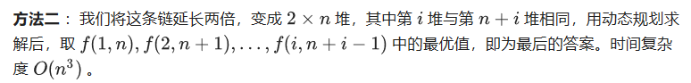

```c++
for (len = 1; len <= n; len++)
  for (i = 1; i <= 2 * n - 1; i++) {
    int j = len + i - 1;
    for (k = i; k < j && k <= 2 * n - 1; k++)
      f[i][j] = max(f[i][j], f[i][k] + f[k + 1][j] + sum[j] - sum[i - 1]);
  }
```

#### 最大子矩阵和 $O(n^3)$

枚举行`i`和`j`，

- `i == j`：等价于求第`i`行元素的最大子段和。
- `i != j`：将`i`到`j`行压缩为1行元素，从而转化为求最大子段和。（可用前缀和预处理优化压缩效率）

### 最长上升子序列LIS $O(n^2) + O(n)$

> `F[i]`表示`[0,i]`子序列的LIS长度或其他标量。

$$
\begin{equation}
F[i]=\left\{
\begin{array}{ll}
1 & {\text { if } i=0 }\\
max\{1,\,\,F[j]+1 \;\;|\;\;{\text a_j<a_i \text { and } j<i} \}
\end{array}\right.
\end{equation}
$$

```c++
int F[MAXN];
int LIS(vector<int> a){
    for(int i = 0; i < a.size(); ++i){
        F[i] = 1;
        for(int j = 0; j < i; ++j)
            if(a[j] < a[i]) F[i] = max(F[i], F[j] + 1);
    }
}
```

#### LIS 二分DP $O(nlogn) + O(n)$

> `dp`数组表示长度为`i+1`的LIS结尾元素的最小值。

```c++
int dp[MAXN];
void LIS(vector<int> a) {
    fill(dp, dp+n, INF);
    for (int i = 0; i < n; i++) {
        *lower_bound(dp, dp + n, a[i]) = a[i];
    }
    printf("%d\n", lower_bound(dp, dp + n, INF) - dp);
}
```

### 最长公共子序列LCS $O(n^2) + O(n)$

$$
\begin{equation}
dp[i, j]=\left\{
\begin{array}{ll}
0 & {\text { if } i=0 \text { or } j=0} \\
{dp[i-1, j-1]+1} & {\text { if } i, j>0 \text { and } x_{i}=y_{j}} \\
{\max (dp[i, j-1], dp[i-1, j])} & {\text { if } i, j>0 \text { and } x_{i} \neq y_{j}}
\end{array}\right.
\end{equation}
$$

```c++
int dp[2][MAXN]; // 滚动数组
int LCS(string A, string B){
    for(int i = 0; i < A.size(); ++i)
        for(int j = 0; j < B.size(); ++j)
            dp[(i+1)&1][j+1] = (A[i]==B[j]) ? (dp[i&1][j]+1) : max(dp[(i+1)&1][j], dp[i&1][j+1]);
    return dp[A.size()&1][B.size()];
}
```

#### LCS方案计数

> 如果需要打印路径，则在计算时要记录局部最优时的前驱。

LCS最优路径只须（用指针）记录贡献者，进行回溯即可。

LCS计数取三种状态中被继承的若干状态，若左、上共同贡献则进行**容斥**。
$$
\begin{equation}
C[i, j]\left\{
\begin{array}{ll}
=1 & {\text { if } i=0 \text { or } j=0} \\
c[i,j]（每步初始0）
\end{array}\right.\\

c[i, j]\left\{
\begin{array}{ll}
+=C[i-1, j-1] & {\text { if } dp[i,j]=dp[i-1,j-1] + 1 \text { and } x_{i}=y_{j} } \\
+=C[i, j-1]\text{ or }C[i-1, j] & {\text { if } dp[i,j]=dp[i,j-1]\text{ or }dp[i-1,j] } \\

-=C[i-1, j-1] & {\text { if } dp[i,j]=dp[i-1,j-1] } （容斥）
\end{array}\right.
\end{equation}
$$

```c++
int dp[2][MAXN], sum[2][MAXN];
int LCS(string A, string B){
	fill(sum[0], sum[0] + MAXN + 1, 1);  // 快速初始化
    for(int i = 0; i < A.size(); ++i){
        for(int j = 0; j < B.size(); ++j){
            dp[(i+1)&1][j+1] = (A[i] == B[j]) ? (dp[i&1][j] + 1) : max(dp[(i+1)&1][j], dp[i&1][j+1]);
			int a = dp[i&1][j], b = dp[(i+1)&1][j], c = dp[i&1][j+1] , Max = dp[(i+1)&1][j+1], & Now = sum[(i+1)&1][j+1] = 0;
            if(A[i] == B[j] && a + 1 == Max) Now += sum[i&1][j];
            if(b == Max) Now += sum[(i+1)&1][j];
            if(c == Max) Now += sum[i&1][j+1];
            if(a == Max) Now -= sum[i&1][j];  // 容斥
        }
    }
    return sum[(A.size()) &1][B.size()];  // LCS的个数
}
```

### 最优三角剖分 $O(n^3)$

`d(i,j)`表示子多边形`i，I+1, ..., j-1, j`的最优解。
$$
d(i,j)=max\{ d(i,k) +d(k,j) + w(i, j, k) |i<k<j \}
$$
边界$d(i, i+1) = 0$，原问题的解为$d(0,n-1)$。


## 树形DP

树形DP的主要实现方式是DFS，在DFS中DP。

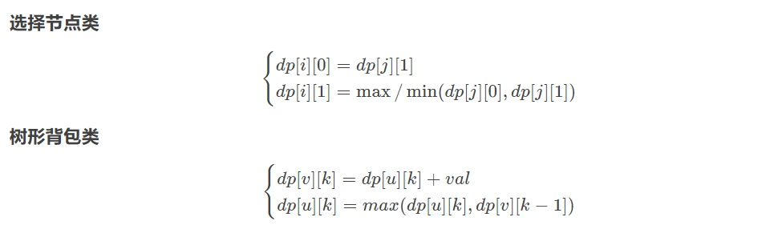

### 最大独立集

树上节点的一个最大子集，其中任何两个节点均不相邻，称为最大独立集。

状态转移方程：（`gs(i)`是`i`的孙节点集合，`s(i)`是`i`的儿子节点集合）
$$
d(i) = \text{max}\{1+\sum_{j\in gs(i)} d(j), \;\;\sum_{j\in s(i)} d(j)\}
$$
节点`i`的决策：选和不选。如果选，求出 1 + 孙节点的`d(j)`即可；若不选，只需求出儿子节点的`d(j)`。

#### 动态最大权独立集

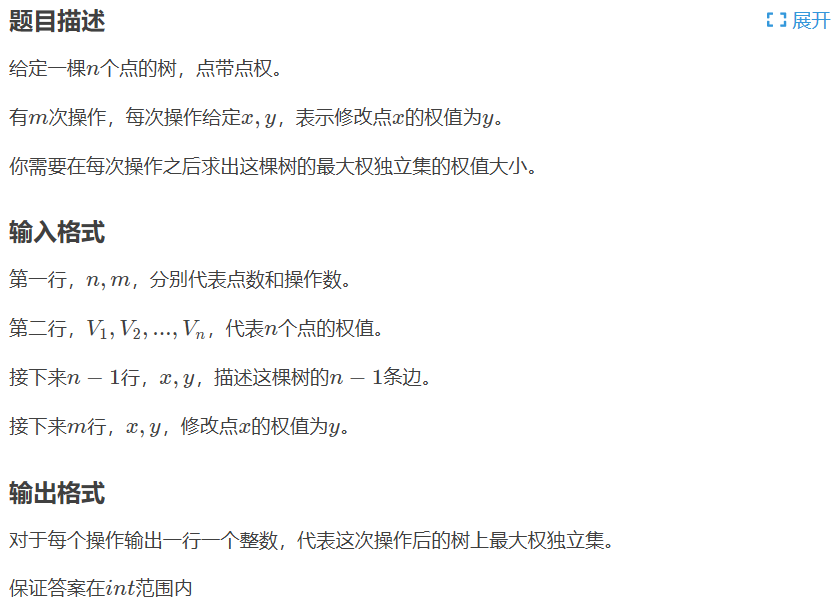

```c++
#include<cstdio>
#include<algorithm>
using namespace std;const int N=1e5+10;
int n;int m;int v[2*N];int x[2*N];int ct;int al[N];int siz[N];int h[N];int we[N];
inline void add(int u,int V){v[++ct]=V;x[ct]=al[u];al[u]=ct;}
inline int dfs1(int u)//这里的树剖只需要一趟dfs求重儿子 
{
    siz[u]=1;int mx=0;
    for(int i=al[u];i;i=x[i])
        if(siz[v[i]]==0){siz[u]+=dfs1(v[i]);if(mx<siz[v[i]])mx=siz[v[i]],h[u]=v[i];}
    return siz[u];
}
struct mar//矩阵类 
{
    int mp[2][2];
    mar(){mp[0][0]=mp[0][1]=mp[1][0]=mp[1][1]=-0x3f3f3f3f;}
    mar(int x){mp[0][0]=mp[1][1]=0;mp[1][0]=mp[0][1]=-0x3f3f3f3f;}
    friend mar operator *(mar a,mar b)
    {
        mar c;for(int i=0;i<2;++i)
            for(int k=0;k<2;++k)
                for(int j=0;j<2;++j)c.mp[i][j]=max(c.mp[i][j],a.mp[i][k]+b.mp[k][j]);
        return c;
    }
    inline int gmx(){return max(max(mp[0][0],mp[0][1]),max(mp[1][0],mp[1][1]));}
    inline int* operator [](const int& x){return mp[x];}
};
struct bst
{
    int s[N][2];int fa[N];int st[N];int tp;int lsiz[N];bool book[N];int root;
    mar mul[N];mar w[N];bst(){w[0]=mul[0]=mar(1);}
    inline void ud(const int& x){mul[x]=mul[s[x][0]]*w[x]*mul[s[x][1]];}
    inline void gtw(const int& x,const int& v)
    {w[x][1][0]+=mul[v].gmx();w[x][0][0]=w[x][1][0];w[x][0][1]+=max(mul[v][0][0],mul[v][1][0]);fa[v]=x;}
    inline void ih(){for(int i=1;i<=n;i++)w[i][0][1]=we[i],w[i][0][0]=w[i][1][0]=0;}
    inline bool isr(const int& p){return (s[fa[p]][1]!=p)&&(s[fa[p]][0]!=p);}
    inline int sbuild(const int& l,const int& r)//对序列建bst 
    {
        if(l>r)return 0;int tot=0;for(int i=l;i<=r;i++)tot+=lsiz[st[i]];
        for(int i=l,ns=lsiz[st[i]];i<=r;i++,ns+=lsiz[st[i]])
            if(2*ns>=tot)
            {
                int rs=sbuild(l,i-1);int ls=sbuild(i+1,r);s[st[i]][0]=ls;s[st[i]][1]=rs;
                fa[ls]=st[i];fa[rs]=st[i];ud(st[i]);return st[i];//找重心递归建树 
            }
    }
    inline int build(int p)//链分治，每次处理一条链 
    {
        for(int t=p;t;t=h[t])book[t]=true;
        for(int t=p;t;t=h[t])
            for(int i=al[t];i;i=x[i])if(!book[v[i]])gtw(t,build(v[i]));
        tp=0;for(int t=p;t;t=h[t])st[++tp]=t;
        for(int t=p;t;t=h[t])lsiz[t]=siz[t]-siz[h[t]];return sbuild(1,tp);
    }
    inline void modify(int p,int W)//修改，直接无脑修改上去就行了 
    {
    	w[p][0][1]+=W-we[p];we[p]=W;
        for(int t=p;t;t=fa[t])
        	if(isr(t)&&fa[t])//如果是轻边 
			{
				w[fa[t]][0][0]-=mul[t].gmx();w[fa[t]][1][0]=w[fa[t]][0][0];
				w[fa[t]][0][1]-=max(mul[t][0][0],mul[t][1][0]);ud(t);
				w[fa[t]][0][0]+=mul[t].gmx();w[fa[t]][1][0]=w[fa[t]][0][0];
				w[fa[t]][0][1]+=max(mul[t][0][0],mul[t][1][0]);
			}else ud(t);
    }
}bst;
int main()
{
	scanf("%d%d",&n,&m);
	for(int i=1;i<=n;i++)scanf("%d",&we[i]);
	for(int i=1,u,v;i<n;i++){scanf("%d%d",&u,&v);add(u,v);add(v,u);}
	dfs1(1);bst.ih();bst.root=bst.build(1);
	for(int i=1,p,w;i<=m;i++)
	{scanf("%d%d",&p,&w);bst.modify(p,w);printf("%d\n",bst.mul[bst.root].gmx());}
	return 0;//拜拜程序~ 
}
```

### 缩点 Tarjan算法

给定一个 n 个点 m 条边有向图，每个点有一个权值，求一条路径，使**路径经过的点权值之和最大**。你只需要求出这个权值和。允许多次经过一条边或者一个点，但是，重复经过的点，权值只计算一次。

> 若将环缩成点，则原图变为DAG。就可以拓扑排序然后DP辣。

```c++
#include <iostream>
#include <cstdio>
#include <cstring>
#include <queue>
#include <algorithm>
using namespace std;
#define N 100010
struct edge{
    int u, v, nxt;
}e[N];
queue <int> q;
int head[N], cnt, n, m, x, y, vis[N], f[N], c[N], s[N], r[N], ans = 1, W[N];
inline void add(int u, int v){
    e[++cnt].u = u;//注意要把 u 也给加上，后面需要调用
    e[cnt].v = v;
    e[cnt].nxt = head[u];
    head[u] = cnt;
}
int anc(int x){
    if(x == f[x]) return x;
    return f[x] = anc(f[x]);
}//并查集模板
void dfs(int u){
    for(int i = head[u]; i; i = e[i].nxt){
        int v = e[i].v;
        if(!vis[v]){//如果没搜索
            vis[v] = vis[u] + 1;//记录“深度”
            dfs(v);//继续搜
        }
        int fu = anc(u), fv = anc(v);//anc 是并查集函数
        if(vis[fv] > 0){//一定要是搜索中的
            if(vis[fu] < vis[fv]) f[fv] = fu;
            else f[fu] = fv;//注意这里，深度小的为父亲
        }
    }
    vis[u] = -1;//标记搜索完
    return;
}
int main(){
    scanf("%d%d", &n, &m);   // n个点，m条边
    for(int i = 1; i <= n; ++i) f[i] = i, scanf("%d", W + i);  // 每个点的权值
    for(int i = 1; i <= m; ++i){
        scanf("%d%d", &x, &y);    // 连边
        add(x, y);
    }
    
    for(int i = 1; i <= n; ++i){  // 缩点
        if(!vis[i]){//如果这个点还没搜索就要继续搜
            vis[i] = 1;
            dfs(i);
        }
    }
    
    for(int i = 1; i <= n; ++i) c[anc(i)] += W[i];//缩点权值处理
    memset(head, 0, sizeof(head));
    cnt = 0;//这里要清零哦-v-
    for(int i = 1; i <= m; ++i){
        x = f[e[i].u], y = f[e[i].v];//由于在上面已经全部遍历过 anc 函数了，这里直接调用即可
        if(x != y) add(x, y), r[y]++;//不在一个强连通分量就连边 （重建图）
    }
    
    for(int i = 1; i <= n; ++i){
        if(i == f[i] && !r[i]) q.push(i), s[i] = c[i];
    }//s[i] 是 dp 数组
    while(!q.empty()){
        int u = q.front(); q.pop();
        for(int i = head[u]; i; i = e[i].nxt){
            int v = e[i].v;
            s[v] = max(s[v], s[u] + c[v]);
            if(--r[v] == 0) q.push(v);
        }
        ans = max(ans, s[u]);
    }//toposort 模板
    
    printf("%d", ans);
    return 0;
}
```

#### 最小树形图

给定包含 n 个结点， m 条有向边的一个图。试求一棵以结点 r 为根的最小树形图，并输出最小树形图每条边的权值之和，如果没有以 r 为根的最小树形图，输出 −1。

```c++
#include <iostream>
#include <cstdio>
#include <cstring>
#include <cstdlib>
#define il inline
#define ri register
#define Size 100050
using namespace std;
int fa[Size],cnt,is[Size];
il int find(int);
il void read(int&),Union(int,int);
struct leftist{
    struct point{
        int l,r,d,v,t,to;
    }a[Size]={{0,0,-1,0,0,0}};
    int r[Size];
    il void merge(int&x,int&y){
        if(!x||!y){x^=y;return;}
        if(a[x].v>a[y].v)x^=y^=x^=y;
        a[y].t-=a[x].t,a[y].v-=a[x].t;
        merge(a[x].r,y);
        if(a[a[x].l].d<a[a[x].r].d)
            a[x].l^=a[x].r^=a[x].l^=a[x].r;
        a[x].d=a[a[x].r].d+1;
    }
    il void spread(int&p){
        a[a[p].l].t+=a[p].t,a[a[p].r].t+=a[p].t;
        a[a[p].l].v+=a[p].t,a[a[p].r].v+=a[p].t;
        a[p].t=0;
    }
    il void pop(int&x){
        spread(x),merge(a[x].l,a[x].r),x=a[x].l;
    }
    il point*top(int&x){
        while(r[x]&&!(find(a[r[x]].to)^x))pop(r[x]);
        if(!r[x])puts("-1"),exit(0);
        a[r[x]].to=find(a[r[x]].to);
        return &a[r[x]];
    }
}L;
int pre[Size];
int main(){
    int n,m,r,ans(0);leftist::point*temp;
    read(n),read(m),read(r),cnt=n,is[r]=r;
    for(int i(1),u,v,w;i<=m;++i)
        read(u),read(v),read(w),
            L.a[i]={0,0,0,w,0,u},
            L.merge(L.r[v],u=i);
    for(int i(1);i<=n<<1;++i)fa[i]=i;
    for(int i(1),j(i);i<=n;j=++i)
        while(!is[j]){
            while(!is[j])
                is[j]=i,j=(temp=L.top(j))->to,
                    ans+=temp->v;if(is[j]^i)break;
            while(~is[j])
                is[j]=-1,j=pre[j]=(temp=L.top(j))->to,
                    temp->t-=temp->v,temp->v=0;++cnt;
            while(is[j]^i)is[j]=i,Union(j,cnt),j=pre[j];
            j=cnt;
        }return printf("%d",ans),0;
}
il void Union(int u,int v){
    if((u=find(u))^(v=find(v)))
        L.merge(L.r[v],L.r[u]),fa[u]=v;
}
il int find(int x){
    return x^fa[x]?fa[x]=find(fa[x]):x;
}
il void read(int&x){
    x^=x;ri char c;while(c=getchar(),c<'0'||c>'9');
    while(c>='0'&&c<='9')x=(x<<1)+(x<<3)+(c^48),c=getchar();
}
```

### 树形DP例题

#### 上司舞会

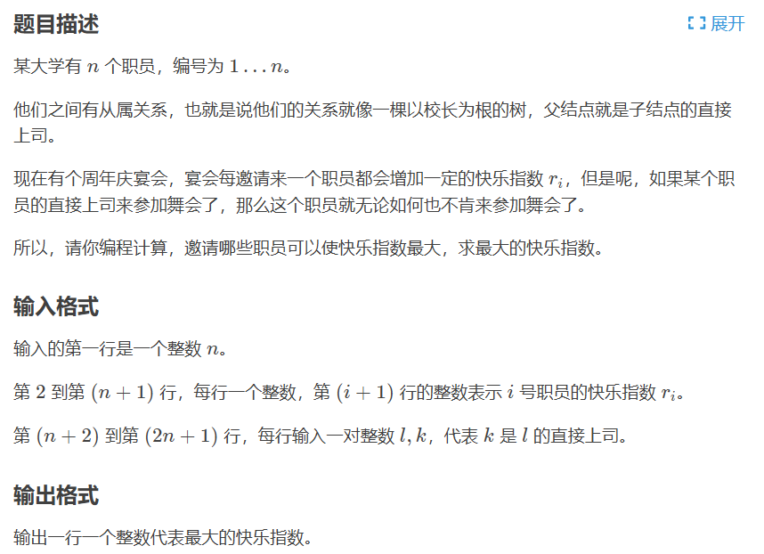

```c++
#include<iostream>
#include<cstdio>
using namespace std;

int const maxn=10011;
int f[maxn][5],fa[maxn],num[maxn],son[maxn][maxn];
bool kid[maxn];
int n,v,x,y;

void dfs(int u){
    if(!son[u][0]){
        f[u][1]=num[u];
        f[u][0]=0;
        return;
    }
    else{
        for(int i=1;i<=son[u][0];i++){
            dfs(son[u][i]);
            f[u][0]+=max(f[son[u][i]][0],f[son[u][i]][1]);
            f[u][1]+=f[son[u][i]][0];
        }
        f[u][1]+=num[u];
    }
}

int main(){
    // freopen("OJ.in", "r", stdin);
    cin>>n;
     for(int i=1;i<=n;i++){
        cin>>v;
        num[i]=v;
    }
    for(int i=1;i<n;i++){
        cin>>x>>y;
        son[y][0]++;
        fa[x]++;
        son[y][son[y][0]]=x;
    }
    cin>>x>>y;
    int root;
    for(int i=1;i<=n;i++)
        if(!fa[i]){
            root=i;
            break;
        }
    dfs(root);
    cout<<max(f[root][0],f[root][1]);
    return 0;
}
```

#### 最大子树和

```cpp
#include<bits/stdc++.h>
using namespace std;
struct node
{
    int next,to;
}tree[100000];  //存图，蒟蒻不会stl
int n,a[100000],head[100000],cnt,f[100000],ans; //f[u] 表示以u为根且包含u的最大权联通块
void add(int x,int y) 
{
    tree[++cnt].next=head[x];
    tree[cnt].to=y;
    head[x]=cnt;
}
void dfs(int u,int fa)//u为当前节点,fa为u的爸爸
{
    f[u]=a[u];  //先给f[u]赋初值，就是u本身的美观指数
    for(int i=head[u];i;i=tree[i].next) //找儿子
    {
        int v=tree[i].to;  
        if(v!=fa)  //之前加的双向边，可能跑回去
        {
            dfs(v,u);  //继续向下找
            f[u]+=max(0,f[v]);  //状态转移
        }
    }
    ans=max(ans,f[u]); //更新ans
}
int main()
{
    scanf("%d",&n);
    for(int i=1;i<=n;i++)
        scanf("%d",&a[i]);
    for(int i=1,x,y;i<n;i++)
    {
        scanf("%d%d",&x,&y);
        add(x,y);add(y,x);  //注意加双向边
    }
    dfs(1,0);  
    printf("%d",ans);
}
```

## 状压DP

常见于将一个集合的状态压缩为一个数。

## 数位DP

求出在给定区间 $[A,B]$ 内，符合条件 $f(i)$ 的数 $i$ 的个数。条件 $f(i)$ 一般与数的大小无关，而与数的组成有关。

> 数位DP = DFS + 记忆化。由于数是按位dp，数的大小对复杂度的影响很小。

数位DP的简单状态方程：
$$
f(i,lim)=\sum_{k=1}^{\max x} f(i+1,\;\;lim=1 \text { and } k=\max x)
$$

> 定义$f(i,lim)$表示当前将要考虑的是从高到低的第 $i$ 位。$\text{max}\;x$ 表示就是当前能取到的最高位。因为如果 $lim=1$，那么你在这一位上取的值一定不能大于求解的数字上该位的值，否则则没有限制。

例：（给定两个正整数 $a$ 和 $b$，求在 $[a,b]$ 中的所有整数中，每个数码(digit)各出现了多少次。）

```c++
#include<bits/stdc++.h>
using namespace std;
long long a,b;
long long ten[20],f[20];
long long cnta[20],cntb[20];
void solve(long long x,long long *cnt){
    long long num[20]={0};
    int len=0;
    while(x){   // 对x进行数位分解
        num[++len]=x%10;
        x=x/10;
    } 
    for(int i=len; i>=1; i--){
        for(int j=0; j<=9; j++)
        	cnt[j] += f[i-1] * num[i];
        for(int j=0; j<num[i]; j++)
        	cnt[j] += ten[i-1];
        long long num2=0;
        for(int j= i-1; j>=1; j--){
            num2 = num2 * 10 + num[j];
        }
        cnt[num[i]]+=num2+1;
        cnt[0]-= ten[i-1];
    } 
}
int main()
{
    scanf("%lld %lld",&a,&b);    // 区间范围
    ten[0]=1;
    for(int i=1;i<=15;i++)
    {
        f[i]=f[i-1]*10+ten[i-1];
        ten[i]=10*ten[i-1];
    }
    solve(a-1,cnta);   // [1, a-1]总计数
    solve(b,cntb);     // [a,   b]总计数
    for(int i=0;i<=9;i++)
    printf("%lld ",cntb[i]-cnta[i]);    // 两者相减
}
```

<div STYLE="page-break-after: always;"></div>

# 数学

## 快速幂 $O(logn)$

> 减治法。对于**<font color=red>矩阵幂只需重载乘法</font>**即可。见矩阵部分。
>
> Python自带快速幂`pow(a, n)`。

```c++
int qPower(int a, int n){
    if(n == 0) return 1;
    if(n == 1) return a;
    int base = qPower(a, n/2); base *= base;
    return (n % 2) ? a*base : base;
}
```

### 迭代快速幂 $O(logn)+O(1)$

```c++
int qPower(int a, int n){ // 按位展开
    int ans = 1, base = a;
    while(n){
        if(n & 1) ans *= base; // 若位为1，说明有权重，需要乘上
        base *= base;
        n >>= 1; // 右移1位
    }
    return ans;
}
```

### 取模快速幂

```c++
int qPower(int a, int n, int mod){ // 按位展开
    int ans = 1, base = a;
    while(n){
        if(n & 1) ans *= base; // 若位为1，说明有权重，需要乘上
        base *= base;
        ans %= mod; base %= mod;
        n >>= 1; // 右移1位
    }
    return ans;
}
```

#### 费马小定理求模幂 $O(logP)$

计算模意义下的大规模的指数。**p必须为质数**。

因为 $a^{p-1}\equiv 1(\text{mod}\,\,p)$，所以 $a^{b}\equiv a^{b\;\text{mod}\;(p-1)}\;(\text{mod}\,\,p)$。

```c++
int qPower(int a, int n, int mod){ // 按位展开
    int ans = 1, base = a;
    while(n){
        if(n & 1) ans *= base; // 若位为1，说明有权重，需要乘上
        base *= base;
        ans %= mod; base %= mod;
        n >>= 1; // 右移1位
    }
    return ans;
}

int qBigPower(int a, int n, int p){  // n为大规模指数，注意这里可能需要改为高精度取模形式
    return qPower(a, n % (p - 1), p);
}
```

#### 扩展欧拉定理求模幂 $O(log\;\varphi(P))$

计算模意义下的超大规模的指数（$b\leq 10^{10000000}$）。p可不为质数。
$$
a^{b} \equiv\left\{\begin{array}{ll}a^{b \bmod \varphi(p)}, & \operatorname{gcd}(a, p)=1 \\a^{b}, & \operatorname{gcd}(a, p) \neq 1, b<\varphi(p) \quad(\bmod p) \\a^{(b \bmod \varphi(p))+\varphi(p)}, & \operatorname{gcd}(a, p) \neq 1, b \geq \varphi(p)\end{array}\right.
$$

```c++
#include <bits/stdc++.h>
#define ll long long
using namespace std;

ll a,m,b;

inline ll read(ll m){  // 边读边取模
	register ll x=0,f=0;char ch=getchar();
	while(!isdigit(ch)) ch=getchar();
	while(isdigit(ch)){
		x=x*10+ch-'0';
		if(x>=m) f=1;
		x%=m;ch=getchar();
	}
	return x+(f==1?m:0);
}

ll phi(ll n){
	ll ans=n,m=sqrt(n);
	for(ll i=2;i<=m;i++){
		if(n%i==0){
			ans=ans/i*(i-1);
			while(n%i==0) n/=i;	
		}
	}
	if(n>1) ans=ans/n*(n-1);
	return ans;
}

ll qBigPower(ll a,ll b,ll p){
	ll ret=1;
	for(;b;b>>=1,a=a*a%p)
		if(b&1) ret=ret*a%p;
	return ret;
}

int main()
{
    scanf("%lld%lld",&a,&m);   // 求解：a^b % m
    b=read(phi(m));
    printf("%lld\n",qBigPower(a,b,m));
    return 0;
}
```

### 矩阵快速幂/矩阵加速 $O(logn)$

> 需要使用矩阵类。
>
> **当n的规模很大时，矩阵快速幂可以用来<font color=red>加快计算固定递推公式的数列</font>**。
>
> > 所有的有限常递推公式，都可以使用矩阵快速幂。写成矩阵形式即可。

$$
\left(\begin{array}{l}
F_{n+2} \\
F_{n+1}
\end{array}\right)=\left(\begin{array}{ll}
1 & 1 \\
1 & 0
\end{array}\right)\left(\begin{array}{c}
F_{n+1} \\
F_{n}
\end{array}\right)
$$

```c++
int fib(int n){ // 以Fib数列为例，O(logN)
    Matrix F(2, 1); F.a[0][0] = 1;
    Matrix A(2, 2); A.a[0][0] = A.a[1][0] = A.a[0][1] = 1;
    F = qPower(A, n) * F; // 快速幂迭代
    return F.a[1][0];
}
```

### 光速幂 $O(T)$

对$a$不变的$T$次不同$t$的查询，快速幂需要$O(Tlogn)$。而光速幂只需$O(T)$。取$n=max\{t_i\}$，
$$
a^{\color{red}{t} }=({\color{blue}{a^{\sqrt{n}} } })^{({\color{red}{t/\sqrt{n}} })}\times {\color{blue}{a} }^{({\color{red}{t\%\sqrt{n} } })}
$$
首先分别对$a^\sqrt{n}$和$a$的$0$到$\sqrt{n}$次幂进行预处理。这样之后每次计算$a^t$都可以在$O(1)$时间内得到。

### 快速乘

有时`long long`取模乘法中途会溢出，因此需要快速乘处理，

```c++
ll qMul(ll n, ll k, ll mod){
    ll ans = 0;
    while(k){
      if(k & 1) ans = (ans + n) % mod;
      k >>= 1;
      n = (n + n) % mod;
    }
    return ans;
}
```

## 公约数/公倍数 $O(logn)$

### 最大公约数 `gcd`（欧几里德算法）

```c++
inline int gcd(int a, int b){ // 辗转相除法：a > b
    return b == 0 ? a : gcd(b, a%b);
}
```

> STL：`__gcd(a,b)`。（部分OJ不支持）

```c++
int kgcd(int a, int b){   // 快速gcd，利用2因子和位运算加速
    if(a == 0) return b;
    if(b == 0) return a;
    if(!(a & 1) && !(b & 1)) return kgcd(a>>1, b>>1) << 1;
    else if(!(b & 1)) return kgcd(a, b>>1);
    else if(!(a & 1)) return kgcd(a>>1, b);
    else return kgcd(abs(a - b), min(a, b));
}
```

### 最小公倍数 `lcm`

```c++
int lcm(int a, int b){
    return a*b / gcd(a, b);
}
```

## 扩展欧几里得算法 exgcd $ax+by=gcd(a,b)$

扩展欧几里得算法用于求解形如$ax+by=gcd(a,b)$的不定方程特解。

裴蜀定理/贝祖定理：

- 设$a,b$是不全为零的整数，则存在整数$x,y$，使得$ax+by=\text{gcd}(a,b)$。

```c++
void exgcd(int a, int b, int& x, int& y) { // 引用保证了最后的x,y即为所求
    if (b == 0) { x = 1, y = 0;  return;}
    exgcd(b, a % b, y, x); // 获得特解x'和y'
    y -= a / b * x;
}
```

> $b=0$时，$\left\{\begin{array}{l}
> x=1 \\
> y=0
> \end{array}\right.$是方程的一组特解。否则递归求解$x'$和$y'$，并且有$\left\{\begin{array}{l}
> x=y^{\prime} \\
> y=x^{\prime}-a / b * y^{\prime}
> \end{array}\right.$。

### 求解 $ax+by=c$


### 线性同余方程 $ax\equiv b(\text{mod}\,\,n)$

上述方程等价于：$ax-b = n\times c$。即等价于：$ax+nc = b$。即等价于$ax+by=c$。可用`exgcd`方法求解。

```c++
int ex_gcd(int a, int b, int& x, int& y) {
    if (b == 0) {
        x = 1;
        y = 0;
        return a;
    }
    int d = ex_gcd(b, a % b, x, y);
    int temp = x;
    x = y;
    y = temp - a / b * y;
    return d;
}
bool liEu(int a, int b, int n, int& x, int& y) {
    int d = ex_gcd(a, b, x, y);
    if (n % d != 0) return 0;
    int k = n / d;
    x *= k;
    y *= k;
    return 1;
}
```

### 扩展裴蜀定理

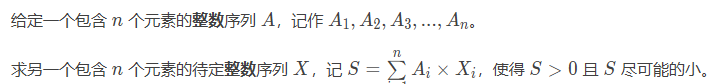

> 任何可行解必然是 $gcd(X_1,X_2,...,X_n)$ 的倍数，故 $S = gcd(X_1,X_2,...,X_n)$ 。

```c++
int exPeiShu(int a[], int n){
    int ret = 0;
    _for(i, 0, n) ret = gcd(ret, abs(a[i]));
    return ret;
}
```

### 二次剩余/模意义下开根 求解 $x^{2} \equiv N(\bmod p)$

> **保证p是奇素数**。
>
> > **输入格式**
> >
> > 第一行一个整数T表示数据组数。
> >
> > 接下来T行，每行一个N一个p。
> >
> > **输出格式**
> >
> > 输出共T行。
> >
> > 对于每一行输出：
> >
> > 若有解，则按 $\bmod ~p$ 后递增的顺序输出在 $\bmod~ p$ 意义下的全部解.
> >
> > 若两解相同，只输出其中一个；
> >
> > 若无解，则输出`Hola!`；

```c++
#include<bits/stdc++.h>
using namespace std;
typedef long long ll;
ll w;
struct num{
    ll x,y;
};

num mul(num a,num b,ll p)
{
    num ans={0,0};
    ans.x=((a.x*b.x%p+a.y*b.y%p*w%p)%p+p)%p;
    ans.y=((a.x*b.y%p+a.y*b.x%p)%p+p)%p;
    return ans;
}

ll powwR(ll a,ll b,ll p){
    ll ans=1;
    while(b){
        if(b&1)ans=1ll*ans%p*a%p;
        a=a%p*a%p;
        b>>=1;
    }
    return ans%p;
}
ll powwi(num a,ll b,ll p){
    num ans={1,0};
    while(b){
        if(b&1)ans=mul(ans,a,p);
        a=mul(a,a,p);
        b>>=1;
    }
    return ans.x%p;
}

ll solve(ll n,ll p)
{
    n%=p;
    if(p==2)return n;
    if(powwR(n,(p-1)/2,p)==p-1)return -1;//不存在
    ll a;
    while(1)
    {
        a=rand()%p;
        w=((a*a%p-n)%p+p)%p;
        if(powwR(w,(p-1)/2,p)==p-1)break;
    }
    num x={a,1};
    return powwi(x,(p+1)/2,p);
}

int main()
{
	srand(time(0));
    int t;
    scanf("%d",&t);
    while(t--)
    {
        ll n,p;
        scanf("%lld%lld",&n,&p);
        if(!n){
        	printf("0\n");continue;
		}
        ll ans1=solve(n,p),ans2;
        if(ans1==-1)printf("Hola!\n");
        else
        {
            ans2=p-ans1;
            if(ans1>ans2)swap(ans1,ans2);
            if(ans1==ans2)printf("%lld\n",ans1);
            else printf("%lld %lld\n",ans1,ans2);
        }
    }
}
```

### BSGS离散对数 $a^x \equiv b \pmod p$ $O(\sqrt n)$

~~北上广深~~大步小步算法（Bady Step Giant Step）。

给定一个**质数** $p$，以及一个整数 $b$，一个整数 $n$，现在要求你计算一个最小的 $l$，满足$b^l \equiv n \pmod p$。

```c++
#include<bits/stdc++.h>
#define ll long long
using namespace std;
ll p,b,n,m;
map<ll,int>vis; 
ll quick_pow(ll a,ll b,ll p){
	ll res=1;
	for(;b;b>>=1){
		if(b&1)res=res*a%p;
		a=a*a%p;
	}
	return res;
}
int main(){
	scanf("%lld%lld%lld",&p,&b,&n);
	m=ceil(sqrt(p));
	for(ll i=0,t=n;i<=m;i++,t=t*b%p)vis[t]=i;
	for(ll i=1,tt=quick_pow(b,m,p),t=tt;i<=m;i++,t=t*tt%p)
	if(vis.count(t))printf("%lld\n",i*m-vis[t]),exit(0);
	puts("no solution");  // 无解
	return 0;
}
```

#### 扩展BSGS算法 $a^x \equiv b \pmod p$

> $p$ 可以不为素数。计算 $x$ 的最小自然数解。
>
> 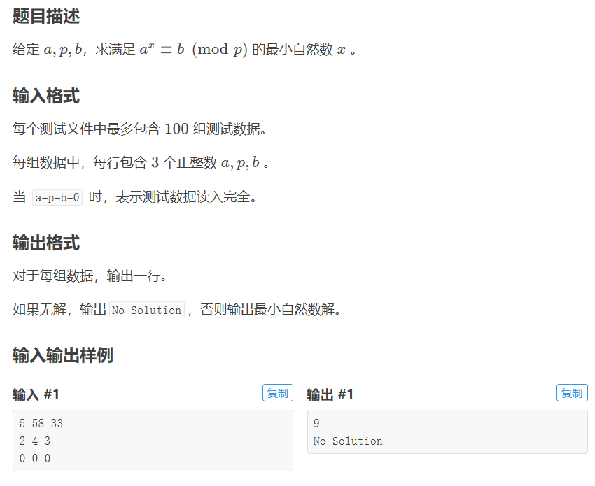

```c++
#include<bits/stdc++.h>
#define ll long long
using namespace std ; 

unordered_map<ll, int> H ;
int N, M, P, ans ; // N ^x = M (mod P)

inline ll gcd(ll a, ll b){
    if (!b) return a ;
    return gcd(b, a % b) ;
}
inline ll expow(ll a, ll b, ll mod){
    ll res = 1 ;
    while (b) res = ((b & 1)?res * a % mod : res), a = a * a % mod, b >>= 1 ;
    return res ;
}
inline ll exgcd(ll &x, ll &y, ll a, ll b){
    if (!b){ x = 1, y = 0 ; return a ; }
 	ll t = exgcd(y, x, b, a % b) ; y -= x * (a / b) ; return t ;
}
inline ll BSGS(ll a, ll b, ll mod, ll qaq){
    H.clear() ; ll Q, p = ceil(sqrt(mod)), x, y ; 
    exgcd(x, y, qaq, mod), b = (b * x % mod + mod) % mod, 
    Q = expow(a, p, mod), exgcd(x, y, Q, mod), Q = (x % mod + mod) % mod ;
    for (ll i = 1, j = 0 ; j <= p ; ++ j, i = i * a % mod)  if (!H.count(i)) H[i] = j ;
    for (ll i = b, j = 0 ; j <= p ; ++ j, i = i * Q % mod)  if (H[i]) return j * p + H[i] ; return -1 ;
}
inline ll exBSGS(){
    ll qaq = 1 ;
    ll k = 0, qwq = 1 ; 
    if (M == 1) return 0 ; 
    while ((qwq = gcd(N, P)) > 1){
        if (M % qwq) return -1 ;
        ++ k, M /= qwq, P /= qwq, qaq = qaq * (N / qwq) % P ;
        if (qaq == M) return k ;
    }
    return (qwq = BSGS(N, M, P, qaq)) == -1 ? -1 : qwq + k ;
}                    
int main(){
    while(cin >> N){
        scanf("%d%d", &P, &M); if (!N && !M && !P) return 0 ;
        N %= P, M %= P, ans = exBSGS() ; if (ans < 0) puts("No Solution") ; else cout << ans << '\n' ;
    }
}
```

### 类欧几里得算法 $O(logn)$

这个算法用于求一条直线下整点个数，我们定义：
$$
f(a, b, c, n)=\sum_{i=0}^{n}\left\lfloor\frac{a i+b}{c}\right\rfloor
$$

```c++
ll f(ll a, ll b, ll c, ll n) {
	if (!a) return b / c * (n + 1);
	if (a >= c || b >= c)
		return f(a % c, b % c, c, n) + (a / c) * n * (n + 1) / 2 + (b / c) * (n + 1);
	ll m = (a * n + b) / c;
	return n * m - f(c, c - b - 1, a, m - 1);
}
```

## 中国剩余定理 CRT

中国剩余定理 (Chinese Remainder Theorem, CRT) 可求解如下形式的一元线性同余方程组：
$$
\left\{\begin{aligned}x & \equiv a_{1}\left(\bmod m_{1}\right) \\x & \equiv a_{2}\left(\bmod m_{2}\right) \\& \vdots \\x & \equiv a_{n}\left(\bmod m_{k}\right)\end{aligned}\right.
$$

> 其中 $m_1,m_2,...,m_k$ 两两互质。

```c++
void exgcd(ll a, ll b, ll& x, ll& y) { // 引用保证了最后的x,y即为所求
    if (b == 0) { x = 1, y = 0;  return;}
    exgcd(b, a % b, y, x); // 获得特解x'和y'
    y -= a / b * x;
}
int CRT(int a[], int m[], int n) {  // n为方程数；a[i],m[i]为相应系数
    int M = 1;
    int ans = 0;
    for(int i = 1; i <= n; i++) {
        M *= m[i];
    }
    for(int i = 1; i <= n; i++) {
        int x, y;
        int Mi = M / m[i];
        exgcd(Mi, m[i], x, y);
        ans = (ans + Mi * x * a[i]) % M;
    }
    if(ans < 0) ans += M;
    return ans;
}
```

> 某些计数问题或数论问题出于加长代码、增加难度、或者是一些其他不可告人的原因，给出的模数： **不是质数** ！
>
> 但是对其质因数分解会发现它没有平方因子，也就是该模数是由一些不重复的质数相乘得到。
>
> 那么我们可以分别对这些模数进行计算，最后用 CRT 合并答案。

### 扩展中国剩余定理

当 $m_1,m_2,...,m_k$ **不满足**两两互质时使用。

```c++
typedef long long ll;
const int maxn=1e5+5;
int n;  // n为方程数
ll exgcd(ll a,ll b,ll &x,ll &y){
    if(!b){x=1,y=0;return a;}
    ll re=exgcd(b,a%b,x,y),tmp=x;
    x=y,y=tmp-(a/b)*y;
    return re;
}
ll m[maxn],a[maxn];      //m为模数集，a为余数集
ll exCRT(){
    ll M=m[1],A=a[1],t,d,x,y;int i;
    for(i=2;i<=n;i++){
        d=exgcd(M,m[i],x,y);//解方程
        if((a[i]-A)%d)return -1;//无解
        x*=(a[i]-A)/d,t=m[i]/d,x=(x%t+t)%t;//求x
        A=M*x+A,M=M/d*m[i],A%=M;
    }
    A=(A%M+M)%M;
    return A;
}

int main()
{
    int i,j;
    while(scanf("%d",&n)!=EOF){
        for(i=1;i<=n;i++)scanf("%lld%lld",&m[i],&a[i]);
        printf("%lld\n",exCRT());
    }
    return 0;
}
```

快速乘-防`long long`溢出版：

```c++
typedef long long ll;
const int maxn=1e5+5;

ll qMul(ll n, ll k, ll mod){
    ll ans = 0;
    while(k){
      if(k & 1) ans = (ans + n) % mod;
      k >>= 1;
      n = (n + n) % mod;
    }
    return ans;
}

int n;  // n为方程数
ll exgcd(ll a,ll b,ll &x,ll &y){
    if(!b){x=1,y=0;return a;}
    ll re=exgcd(b,a%b,x,y),tmp=x;
    x=y,y=tmp-(a/b)*y;
    return re;
}
ll m[maxn],a[maxn];      //m为模数集，a为余数集
ll exCRT(){
    ll M=m[1], ans=a[1], x, y;
    for(ll i=2;i<=n;++i){
        ll c=((a[i]-ans)%m[i]+m[i])%m[i];
        ll g=exgcd(M,m[i],x,y);
        ll p=m[i]/g;
        x=qMul(x,c/g,p);
        ans+=x*M;
        M*=p;
        ans=(ans%M+M)%M;
    }
    return ans;
}

int main()
{
    int i,j;
    while(scanf("%d",&n)!=EOF){
        for(i=1;i<=n;i++)scanf("%lld%lld",&m[i],&a[i]);
        printf("%lld\n",exCRT());
    }
    return 0;
}
```

## 乘法逆元

### 扩展欧几里得求逆元 $ax\equiv 1(\text{mod}\,\,b)$

如果一个线性同余方程$ax\equiv 1(\text{mod}\,\,b)$，则$x$称为$a\;\text{mod}\;b$的逆元，记为$a^{-1}$。

> 当$gcd(a, b) = 1$时，该方程有唯一解；否则无解。

```c++
void exgcd(ll a, ll b, ll& x, ll& y) { // 引用保证了最后的x,y即为所求
    if (b == 0) { x = 1, y = 0;  return;}
    exgcd(b, a % b, y, x); // 获得特解x'和y'
    y -= a / b * x;
}
ll inverse(ll a, ll b){
    ll x, y;
    exgcd(a, b, x, y);  // 求解 ax+by=1
    return (x % b + b) % b;  // a MOD b的逆元为 (x%b+b)%b
}
```

### 费马小定理 $a^{m-1}\equiv 1(\text{mod}\,\,m)$ $O(logP)$

设$m$是**<font color=red>素数</font>**，$a$是任意整数且$a\not\equiv 0(\text{mod}\,\,m)$，则$a^{m-1}=a\times a^{m-2}\equiv 1(\text{mod}\,\,m)$。

故，$a^{m-2}\;\%\;m$ 就是 $a$ 模 $m$ 的逆元。

```c++
ll fpm(ll x, ll power, ll mod) { // 快速幂取模
    x %= mod;
    ll ans = 1;
    for (; power; power >>= 1, (x *= x) %= mod)
        if(power & 1) (ans *= x) %= mod;
    return ans;
}
ll inverse(ll a, ll p){
    return fpm(a, p - 2, p);  // a在mod p意义下的逆元
}
```

### 线性求逆元 $O(n)$

用于求一连串数字对于一个mod p的逆元。

> 比如：给定 n,p， 求 1∼n 中所有整数在模 p 意义下的乘法逆元。

```c++
int inv[MAXN];
void getinv(int p){  // 线性求逆元: [1, p) mod p的所有逆元
    inv[1] = 1;    // 整数i的逆元
    for(int i = 2; i < p; ++ i)
        inv[i] = (p - p / i) * inv[p % i] % p;
}
```

### 阶乘逆元 $O(n)$

根据：$\cfrac{1}{(n+1)!}\times (n+1)=\cfrac{1}{n!}$。可以倒推求出 $1!,2!,...,n!$ 阶乘逆元。

```c++
ll fpm(ll x, ll power, ll mod) {
    x %= mod;
    ll ans = 1;
    for (; power; power >>= 1, (x *= x) %= mod)
        if(power & 1) (ans *= x) %= mod;
    return ans;
}
ll inv[MAXN];
void getFracInv(ll n, ll p){
    ll frac = 1;
    for(ll i = 1; i <= n; ++i) frac = frac * i % p;
    inv[n] = fpm(frac, p - 2, p);
    for(ll i = n - 1; i >= 1; --i)
        inv[i] = ( inv[i+1] * (i+1) ) % p;
}
```

## 素数筛法

### 素数验证 $O(\sqrt N)$

```c++
bool is_prime(int number){
    for(int i = 2; i*i <= number; i+=1)  //i*i是优化
        if(!(number % i)) return 0;
    return 1;
}
```

#### 快速素数验证 $O(\cfrac{1}{3}\sqrt N)$

```cpp
bool quick_is_prime(int x)//O(三分之根号下n) 
{
	if(x==2||x==3) return true;
	if(x%6!=1&&x%6!=5) return false;
	for(int i=5;i<=sqrt(x);i+=6)
		if(x%i==0||x%(i+2)==0) return false;
	return true;
}
```

#### Miller-Rabbin素性测试 $O(klog^3n)$

```c++
bool millerRabbin(int n, int test_time = 10) {
    if (n < 3) return n == 2;
    int a = n - 1, b = 0;
    while (a % 2 == 0) a /= 2, ++b;
    // test_time 为测试次数,建议设为不小于 8 的整数以保证正确率,但也不宜过大,否则会影响效率
    for (int i = 1, j; i <= test_time; ++i) {
        int x = rand() % (n - 2) + 2, v = quickPow(x, a, n);
        if (v == 1 || v == n - 1) continue;
        for (j = 0; j < b; ++j) {
            v = (long long)v * v % n;
            if (v == n - 1) break;
        }
        if (j >= b) return 0;
    }
    return 1;
}
```

#### Pollard Rho素性测试 $O(n^{1/4})$

对于每个数字检验是否是质数，是质数就输出`Prime`；如果不是质数，输出它最大的质因子是哪个。

```c++
#include<bits/stdc++.h>
#define Tp template<typename Ty>
#define Ts template<typename Ty,typename... Ar>
#define Reg register
#define RI Reg int
#define RL Reg LL
#define Con const
#define CI Con int&
#define CL Con LL&
#define I inline
#define W while
#define LL long long
#define Gmax(x,y) (x<(y)&&(x=(y)))
#define abs(x) ((x)<0?-(x):(x))
#define hl_AK_NOI true
using namespace std;
I LL Qmul(CL x,CL y,CL X)//快速乘
{
    RL k=(LL)((1.0L*x*y)/(1.0L*X)),t=x*y-k*X;
    t-=X;W(t<0) t+=X;return t;
}
class MillerRabin//MillerRabin判素数板子
{
    private:
        #define Pcnt 12
        Con int P[Pcnt]={2,3,5,7,11,13,17,19,61,2333,4567,24251};
        I LL Qpow(RL x,RL y,CL X)
        {
            RL t=1;W(y) y&1&&(t=Qmul(t,x,X)),x=Qmul(x,x,X),y>>=1;
            return t;
        }
        I bool Check(CL x,CI p)
        {
            if(!(x%p)||Qpow(p%x,x-1,x)^1) return false;
            RL k=x-1,t;W(!(k&1))
            {
                if((t=Qpow(p%x,k>>=1,x))^1&&t^(x-1)) return false;
                if(!(t^(x-1))) return true;
            }return true;
        }
    public:
        bool IsPrime(CL x)
        {
            if(x<2) return false;
            for(RI i=0;i^Pcnt;++i) {if(!(x^P[i])) return true;if(!Check(x,P[i])) return false;}
            return true;
        }
};
class PollardRho//PollardRho分解质因数
{
    private:
        #define Rand(x) (1LL*rand()*rand()*rand()*rand()%(x)+1)
        LL ans;MillerRabin MR;
        I LL gcd(CL x,CL y) {return y?gcd(y,x%y):x;}//求gcd
        I LL Work(CL x,CI y)//分解
        {
            RI t=0,k=1;RL v0=Rand(x-1),v=v0,d,s=1;W(hl_AK_NOI)//初始化随机一个v0
            {
                if(v=(Qmul(v,v,x)+y)%x,s=Qmul(s,abs(v-v0),x),!(v^v0)||!s) return x;//计算当前v，统计乘积，判断是否分解失败
                if(++t==k) {if((d=gcd(s,x))^1) return d;v0=v,k<<=1;}//倍增
            }
        }
        I void Resolve(RL x,RI t)//分解
        {
            if(!(x^1)||x<=ans) return;if(MR.IsPrime(x)) return (void)Gmax(ans,x);//先进行特判
            RL y=x;W((y=Work(x,t--))==x);W(!(x%y)) x/=y;Resolve(x,t),Resolve(y,t);//找到一个因数y，然后分解（注意除尽）
        }
    public:
        I PollardRho() {srand(20050521);}//初始化随机种子
        I LL GetMax(CL x) {return ans=0,Resolve(x,302627441),ans;}//求答案
}P;
int main()
{
    RI Ttot;RL n,res;scanf("%d",&Ttot);  // 【数据组数】
    W(Ttot--) scanf("%lld",&n),(res=P.GetMax(n))^n?printf("%lld\n",res):puts("Prime");//输出
    return 0;
}
```

### 素数统计

#### 洲阁筛 $O(n^{2/3} / logn)$

> 用低于线性的复杂度统计 $[1,n]$ 内的素数个数。

```c++
#include<bits/stdc++.h>
#define rep(i,x,y) for (int i=(x); i<=(y); i++)
#define per(i,x,y) for (int i=(x); i>=(y); i--)
#define ll long long
#define ld long double
#define inf 1000000000
using namespace std;
#define N 350005
int p[N/10],tot,res[N]; bitset<N> vis; ll n;
void pre(int n){
    rep (i,2,n){
        res[i]=res[i-1]; if (!vis[i]) p[++tot]=i,res[i]++;
        for (int j=1; j<=tot && (ll)i*p[j]<=n; j++){
            vis[i*p[j]]=1;
            if (i%p[j]==0) break;
        }
    }
}
#define M 350005
int sn,pos,cnt,last[M<<1]; ll g[M<<1],value[M<<1];
ll cal(ll n){//洲阁筛
    cnt=0; sn=(ll)sqrt((ld)n);//考虑<=n的数由<=sqrtn的质数筛出的情况
    pos=upper_bound(p+1,p+1+tot,sn)-p-1;//pos第一个小于等于sn的质数位置
    for (ll i=n; i>=1; i=n/(n/i+1)) value[++cnt]=n/i;//记录所有[n/i]的值，只有这样的数才会出现在转移中 //离散
    //g[i][j]表示1~j中与前i个质数互质的数的个数 //筛不掉的
    //g[i][j]=g[i-1][j]-g[i-1][j/p[i]]
    //当p[i+1]>j时，g[i][j]=1 //只有1
    //p[i]>j/p[i]时，g[i][j]=g[i-1][j]-1，可以O(1)计算
    ll k;
    rep (i,1,cnt) g[i]=value[i],last[i]=0;//注意初始化last[i]=0
    rep (i,1,pos) per (j,cnt,1){
        k=value[j]/p[i]; if (k<p[i]) break;//忽略那些-1的转移
        k=k<sn?k:cnt-n/k+1;//找到在value中的对应下标
        g[j]-=g[k]-(i-last[k]-1);//将g[k]的-1的转移补回去
        last[j]=i;
    }
    return res[sn]+g[cnt]-1;//-1是减去1的贡献
}
//#define local
int main(){
#ifdef local
    freopen("test.in","r",stdin); freopen("test.out","w",stdout);
#endif
    pre(350000); cin>>n; cout<<cal(n)<<endl;
    return 0;
}
```

#### Meissel Lehmer筛法 $O(n^(3/4) / log n)$

> 用低于线性的复杂度统计 $[L,R]$ 内的素数个数。

```c++
#include<bits/stdc++.h>
#define INF 2000000005//2 * 10^9
#define lowbit(a) ((a)&-(a))
#define FAIL -INF

const long long MAXN = 6893911;//10000000;

long long p[MAXN], cnt;
bool mark[MAXN];
int pi[MAXN];

void init(){
    long long i, j;
    for (i = 2; i < MAXN; i++){
        if (!mark[i])
            p[cnt++] = i;
        pi[i] = pi[i - 1] + !mark[i];
        for (j = 0; p[j] * i < MAXN&&j < cnt; j++){
            mark[p[j] * i] = true;
            if (i%p[j] == 0)
                break;
        }
    }
}

int f(long long n, int m){
    if (n == 0) return 0;
    if (m == 0) return n - n / 2;
    return f(n, m - 1) - f(n / p[m], m - 1);
}

int Pi(long long N);

int p2(long long n, int m){
    int ans = 0;
    for (int i = m + 1; (long long)p[i] * p[i] <= n; i++)
        ans += Pi(n / p[i]) - Pi(p[i]) + 1;
    return ans;
}

int p3(long long n, int m){
    int ans = 0;
    for (int i = m + 1; (long long)p[i] * p[i] * p[i] <= n; i++)
        ans += p2(n / p[i], i - 1);
    return ans;
}

int Pi(long long N){
    if (N < MAXN)
        return pi[N];
    int lim = pow(N, 0.25) + 1;
    int i;
    for (i = 0; p[i] <= lim; i++);
    int ans = i + f(N, i - 1) - 1 - p2(N, i - 1) - p3(N, i - 1);
    return ans;
}

int main(){
    long long L, R;
    scanf("%lld %lld", &L, &R);
    init();
    printf("%d", Pi(R) - Pi(L-1));   // 两者相减即可
    return 0;
}
//1 2000000000
//2147483647以内素数个数：105097565
```

### 埃式筛法 $O(nloglogn)$

- 初始化：默认所有数为素数（也可以附加设定`0`，`1`不是素数）
- 从`i=2`开始，遍历最近的素数（到`根号n`为止）
  - 从`j=i*i`开始，步长为`i`，遍历并标记合数

```c++
bool prime[MAXN];

void Eratosthenes(int b){  //O(nloglogn)
	prime[0] = prime[1] = 0;
	for(int i = 2; i <= b; ++i)
		prime[i] = 1;
	for(int i = 2; i*i <= b; ++i)
		if(prime[i])
			for(int j = i*i; j <= b; j+=i){
				prime[j] = 0; 
			}
}

bool is_prime(int number){  //O(1)
    return prime[number];
}
```

### 欧拉线筛 $O(n)$

注意到埃式筛法质因子较多的合数会被反复标`0`（累计$O(loglogn)$？），这显然是重复的工作。

> 而每一个合数的最小/最大质因子都是唯一的。

- **枚举每一个数**`i`
  - 若`i`是素数，**<font color=red>先存入</font>**素数表`p_numbers`（显然素数表单增）
  - 用`J`遍历素数表（生成关于`i*J`的乘法元集，并筛掉）
    - **<font color=red>先筛掉</font>**`i*J`（<font color=red>默认筛</font>）
    - 若`i%J==0`（即`i*J=A*J*J`）
      - 记`J’>J`是素数表中任意一个比`J`更大的素数
      - 接下来要筛的任何一个对象`i*J'=(A*J)*J'=(A*J')*J`，都会在之后被一个比`i`更大的`i'=(A*J')`**<font color=red>默认筛掉</font>**
        - 而且只要被筛对象合法，`i'=(A*J')<i*J'`肯定会被遍历到
        - 而且能保证不会重复筛
          - 假设`i'*J'`之前被`i`筛过，那么必然有`i'*J'=(i*J)*J'=i*(J*J')`，而`(J*J')`是合数，矛盾
      - 显然无须继续遍历，**提前退出**即可

欧拉筛<font color=red>能保证合数总是被它`最大的因子`/`最小的质因子`筛掉</font>。

```c++
bool prime[MAXN];
int p_numbers[MAXN], size = 0; //reserve primes

void Euler(int Length){  //about O(n)
	prime[0] = prime[1] = 0;
	for(int i = 2; i <= Length; ++i) prime[i] = 1; //initialize all as true
	for(int i = 2; i <= Length; ++i){
		if(prime[i]){
            p_numbers[size++] = i;
        }
        for(int j = 0; j <size && i*p_numbers[j] < Length; j++){
            prime[ i*p_numbers[j] ] = 0;  //sieve i*p_numbers[j]
            if(i % p_numbers[j] == 0)  //special
               break;
        }
	}
}
```

### 因数分解（唯一分解定理）

$$
x=p_1^{e_1}\times p_2^{e_2}\times p_3^{e_3}\times ...\times p_n^{e_n}
$$

利用素数筛法筛出素数表，再遍历表寻找素因数。复杂度取决于采用的筛法。

整数的因数分解形式表示如下：

```c++
bool prime[MAXN]; // 筛表
int p_numbers[MAXN], size = 0; // p_numbers为素数表
int e[MAXN]; // 因数表示数组

e = {1,0,2,0,0,0,...} // 表示e = 2^1 * 5^2 = 50。
```

因数分解：（须先进行欧拉线筛）

```c++
int e[MAXN];
int factor(int n){ // 因数分解，返回约数的个数
    memset(e, 0, sizeof(e));
    for(int i = 0; i < size && n != 1; ++i) // n==1时提前退出
        while(n % p_numbers[i] == 0){
            n /= p_numbers[i];
            e[i] += 1;
        }
    int ret = 1;
    if(n > 1) ret *= 2;  // 特殊情况，n自身为质数，而筛法只筛到sqrt(n)时
    _for(i, 0, size) ret *= e[i] + 1;
    return ret;
}
```

## 积性函数

如果已知一个函数为数论函数，且 $f(1)=1$，并且满足以下条件，若对于任意的两个**互质**的正整数*p*,*q*都满足$f(p\cdot q)=f(p)\cdot f(q)$，那么则称这个函数为**积性函数**。

常见积性函数：

- $\mu(n)$：莫比乌斯函数。
- $\varphi(n)$：欧拉函数。表示不大于且 $n$ 与 $n$ 互质的正整数个数。
- $d(n)$：约数个数。表示 $n$ 的约数的个数。
- $\sigma(n)$：约数和函数。表示 $n$ 的各个约数之和。
- $f(x)=x^k$：幂函数。

任意积性函数都可以线性筛。

### 约数个数 $d(n)$ $O(n)$

已知唯一分解式：$n=p_1^{e_1}\times p_2^{e_2}\times p_3^{e_3}\times ...\times p_n^{e_n}$。求$n$的正约数的个数。

根据乘法原理，求$n$的正约数的个数为：（利用唯一分解定理预处理）
$$
\prod _{i=1}^{k}(e_i+1)=(e_1+1)(e_2+1)···(e_k+1)
$$

```c++
int d[N],a[N],pri[N],tot,zhi[N];
void sieve(){      // 线筛约数个数
    zhi[1]=d[1]=1;
    for (int i=2;i<=n;i++){
        if (!zhi[i]) pri[++tot]=i,d[i]=2,a[i]=1;
        for (int j=1;j<=tot&&i*pri[j]<=n;j++){
            zhi[i*pri[j]]=1;
            if (i%pri[j]) d[i*pri[j]]=d[i]*d[pri[j]],a[i*pri[j]]=1;
            else {d[i*pri[j]]=d[i]/(a[i]+1)*(a[i]+2);a[i*pri[j]]=a[i]+1;break;}
        }
    }
}
```

### 约数和 $\sigma(n)$ $O(n)$

> 注意可能溢出。

```c++
int low[N],sum[N],sigma[N],pri[N],tot,zhi[N];
void sieve(){      // 线筛约数和
    zhi[1]=low[1]=sum[1]=sigma[1]=1;
    for (int i=2;i<=n;i++){
        if (!zhi[i]) low[i]=pri[++tot]=i,sum[i]=sigma[i]=i+1;
        for (int j=1;j<=tot&&i*pri[j]<=n;j++){
            zhi[i*pri[j]]=1;
            if (i%pri[j]==0) {
                low[i*pri[j]]=low[i]*pri[j];
                sum[i*pri[j]]=sum[i]+low[i*pri[j]];
                sigma[i*pri[j]]=sigma[i]/sum[i]*sum[i*pri[j]];
                break;
            }
            low[i*pri[j]]=pri[j];
            sum[i*pri[j]]=pri[j]+1;
            sigma[i*pri[j]]=sigma[i]*sigma[pri[j]];
        }
    }
}
```

### 欧拉函数 $\varphi(n)$ $O(nlogn)$

定义：欧拉函数$\varphi(n)$，表示$\leq n$的数中与$n$互质的数的数目。

欧拉函数的求解方法：

1. $\varphi(1) = 1$
2. 若n是素数p的k次幂，$\varphi(n)=p^k-p^{k-1}=(p-1)p^{k-1}$
3. 若m、n互质，$\varphi(mn)=\varphi(m)\varphi(n)$

欧拉函数的递推式：

- 令p为N的最小质因数，若$p^2|N$，则$\varphi(N)=\varphi(\cfrac{N}{p})\times p$；否则$\varphi(N)=\varphi(\cfrac{N}{p})\times (p-1)$。

记$n=p_1^{e_1}\times p_2^{e_2}\times p_3^{e_3}\times ...\times p_n^{e_n}$，还有计算公式：（$O(k)$）
$$
\varphi(n)=n(1-\cfrac{1}{p_1})(1-\cfrac{1}{p_2})···(1-\cfrac{1}{p_k})
$$

```c++
int euler_phi(int n) { // 求单个函数值
  int m = int(sqrt(n + 0.5));
  int ans = n;
  for (int i = 2; i <= m; i++)
    if (n % i == 0) {  // i是素因子
      ans = ans / i * (i - 1);
      while (n % i == 0) n /= i;  // 每找到一个素因子，就把它”除干净“
    }
  if (n > 1) ans = ans / n * (n - 1);
  return ans;
}
```

#### 线筛欧拉函数 $O(nloglogn)$

```c++
int phi[MAXN];
void phi_table(int n, int* phi) { // 线筛欧拉函数
  for (int i = 2; i <= n; i++) phi[i] = 0;
  phi[1] = 1;
  for (int i = 2; i <= n; i++)
    if (!phi[i])
      for (int j = i; j <= n; j += i) {
        if (!phi[j]) phi[j] = j; // 更新
        phi[j] = phi[j] / i * (i - 1);
      }
}
```

#### 欧拉定理 $a^{\varphi(m)}\equiv1(\text{mod m})$

若$gcd(a,m)=1$，则$a^{\varphi(m)}\equiv1(\text{mod m})$ 。

> 扩展欧拉定理见快速幂部分。

### 莫比乌斯函数 $\mu(n)$ $O(n)$

设 $n = p_1^{k_1}p_2^{k_2}\cdot \cdot \cdot p_m^{k_m}$，其中 $p$ 为素数，则莫比乌斯函数为：
$$
\begin{equation}\mu(n)=\left\{\begin{array}{ll}
1 & n=1 \\
(-1)^{m} & \prod_{i=1}^{m} k_{i}=1 \\
0 & \text { otherwise }\left(k_{i}>1\right)
\end{array}\right.\end{equation}
$$
可知有平方因子的数的莫比乌斯函数值为 0。

```c++
bool v[MAXN];
int mu[MAXN], p[MAXN];
void Mobius() {    // O(n)线筛
    mu[1] = 1;
    for (int i = 2; i <= 1e7; ++i) {
        if (!v[i]) mu[i] = -1, p[++tot] = i;
        for (int j = 1; j <= tot && i <= 1e7 / p[j]; ++j) {
            v[i * p[j]] = 1;
            if (i % p[j] == 0) {
                mu[i * p[j]] = 0;
                break;
            }
            mu[i * p[j]] = -mu[i];
        }
    }
```

#### 莫比乌斯反演

给定函数 $F(n)$ 和 $f(n)$ 满足：（ $d|n$ 表示b遍历 $n$ 的所有因子 $d$）
$$
\begin{equation}F(n)=\sum_{d | n} f(d)\end{equation}
$$
则莫比乌斯反演为：
$$
\begin{equation}f(n)=\sum_{d | n} \mu(d) F\left(\frac{n}{d}\right)\end{equation}\;\;\;或\;\;\; f(n)=\sum_{n | d} \mu\left(\frac{d}{n}\right) F(d)
$$

> 莫比乌斯反演一般来说套路比较固定，看到两个求和符号，基本上就逃不开莫比乌斯了。
>
> 求和的东西可能不同，但是一般都与 $\gcd$ 有关，枚举 $\gcd$，再使用 $\gcd = k$ 的个数 + 分块一般能 $O(n)$，
>
> 将后面的部分提前 + 积性函数预处理 + 分块一般能单组 $O(\sqrt n)$。

#### **<font color=red>莫比乌斯公式</font>**

$$
\sum_{d | n} \mu(d)=[n=1]
$$

若$d=gcd(i,j)$，则 
$$
[gcd(i,j)=1] = \sum_{d | g c d(i, j)} \mu(d)
$$

```c++
bool v[MAXN];
int mu[MAXN], p[MAXN];
void Mobius() {    // O(n)线筛
    mu[1] = 1;
    for (int i = 2; i <= 1e7; ++i) {
        if (!v[i]) mu[i] = -1, p[++tot] = i;
        for (int j = 1; j <= tot && i <= 1e7 / p[j]; ++j) {
            v[i * p[j]] = 1;
            if (i % p[j] == 0) {
                mu[i * p[j]] = 0;
                break;
            }
            mu[i * p[j]] = -mu[i];
        }
    }
```

##### 求`gcd == 1`的个数

$$
\sum_{i=1}^{n} \sum_{j=1}^{m}[g c d(i, j)=1] \quad(n<m)
$$

代入莫比乌斯公式，
$$
=\sum_{i=1}^{n} \sum_{j=1}^{m} \sum_{d | g c d(i, j)} \mu(d)
$$
换序（前面两重求和 $i,j$ 可以化简快速计数），
$$
\sum_{d=1}^{n} \mu(x)\left\lfloor\frac{n}{d}\right\rfloor\left\lfloor\frac{m}{d}\right\rfloor
$$
然后就可以分块了。

##### 求`gcd == k`的个数

> https://www.luogu.com.cn/blog/An-Amazing-Blog/mu-bi-wu-si-fan-yan-ji-ge-ji-miao-di-dong-xi
>
> https://blog.sengxian.com/algorithms/mobius-inversion-formula

$$
f(k)=\sum_{i=1}^{n} \sum_{j=1}^{m}[\operatorname{gcd}(i, j)=k]
$$

莫比乌斯反演得：
$$
\begin{aligned}
f(k) &=\sum_{x=1}^{\left\lfloor\frac{n}{k}\right\rfloor} \mu(x) g(k \cdot x) \\
&=\sum_{x=1}^{\left\lfloor_{k}^{n}\right\rfloor} \mu(x)\left\lfloor\frac{n}{k x}\right\rfloor\left\lfloor\frac{m}{k x}\right\rfloor
\end{aligned}
$$

```c++
ll F(int n, int m, int d) {
    if (n > m) swap(n, m);
    ll ans = 0;
    n /= d, m /= d;
    for (int i = 1, last = 1; i <= n; i = last + 1) {
        last = min(n / (n / i), m / (m / i));
        ans += (ll)(sum[last] - sum[i - 1]) * (n / i) * (m / i);
    } 
    return ans;
}
```

##### 求`gcd == Prime`的个数

给定 $n,m$，统计在$1\leq x\leq n,1\leq y\leq m$ 范围内且 $gcd(x,y)$ 为质数的 $(x,y)$ 有多少对。$T$ 组数据。

> 设 $f(d)$ 为 $gcd(i,j)=d$ 的个数；$F(n)$ 为 $gcd(i,j)=kd\;\;(k\geq 1)$ 的个数。

若按照`gcd == k`的做法，则复杂度将会是$O(P\sqrt n)$。
$$
\sum_{p \in \text { prime }} \sum_{d=1}^{\left\lfloor\frac{n}{p}\right\rfloor} \mu(d)\left\lfloor\frac{n}{p d}\right\rfloor\left\lfloor\frac{m}{p d}\right\rfloor
$$
考虑优化：（令 $k=pd$）
$$
\begin{align}
&=\sum_{p \in \text { prime }} \sum_{d=1}^{\left\lfloor\frac{n}{p}\right\rfloor} \mu\left(\frac{k}{p}\right)\left\lfloor\frac{n}{k}\right\rfloor\left\lfloor\frac{m}{k}\right\rfloor \\
&=\sum_{k=1}^{n} \sum_{p \in \mathrm{prime}, p | k} \mu\left(\frac{k}{p}\right)\left\lfloor\frac{n}{k}\right\rfloor\left\lfloor\frac{m}{k}\right\rfloor\\
&=\sum_{k=1}^{n} f(k)\left\lfloor\frac{n}{k}\right\rfloor\left\lfloor\frac{m}{k}\right\rfloor
\end{align}
$$
其中，$f(x)=\sum_{p \in \text { prime }, p | x} \mu\left(\frac{x}{p}\right)$，其线筛方程为
$$
f(x)=\left\{\begin{array}{ll}
\mu(1) & x \in \text { prime } \\
\mu(i) & i \bmod y=0 \\
-f(i)+\mu(i) & i \bmod y \neq 0
\end{array}\right.
$$
总时间复杂度： $O(n+T\sqrt n)$。

```c++
#include <cstdio>
#include <algorithm>

const int N=1e7+5,lnN=15;
int n,m,tot,p[N/lnN],mu[N],f[N];
bool flg[N];

void init() {
    mu[1]=flg[1]=1;
    for(int i=2;i<N;++i) {
        if(!flg[i]) p[++tot]=i,mu[i]=-1,f[i]=1;
        for(int j=1;j<=tot&&i*p[j]<N;++j) {
            int x=i*p[j];
            flg[x]=1;
            if(i%p[j]==0) {
                f[x]=mu[i];
                mu[x]=0;
                break;
            } else {
                f[x]=-f[i]+mu[i];
                mu[x]=-mu[i];
            }
        }
        f[i]+=f[i-1];
    }
}
int main() {
    init();
    int T;
    for(scanf("%d",&T);T--;) {
        scanf("%d%d",&n,&m);
        long long ans=0;
        if(n>m) n^=m^=n^=m;
        for(int i=1,j;i<=n;i=j+1) {
            j=std::min(n/(n/i),m/(m/i));
            ans+=1LL*(f[j]-f[i-1])*(n/i)*(m/i);
        }
        printf("%lld\n",ans);
    }
    return 0;
```

##### 求`gcd(i, j)` 的幂

$$
\sum_{i=1}^{n} \sum_{j=1}^{m} \operatorname{gcd}(i, j)^{k} \bmod \left(10^{9}+7\right)
$$

分块化如下：
$$
\begin{aligned}
\sum_{i=1}^{n} \sum_{j=1}^{m} \operatorname{gcd}(i, j)^{k} &=\sum_{d=1}^{n} d^{k} \sum_{i=1}^{n} \sum_{j=1}^{m}[\operatorname{gcd}(i, j)=d] \\
&=\sum_{d=1}^{n} d^{k} \sum_{x=1}^{\left\lfloor\frac{n}{d}\right\rfloor} \mu(x)\left\lfloor\frac{n}{d x}\right\rfloor\left\lfloor\frac{m}{d x}\right\rfloor
\end{aligned}
$$

### 整除分块法 $O(\sqrt n)$

计算形如 $\sum_{i=1}^{n}\left\lfloor\cfrac{n}{i}\right\rfloor$ 的式子，复杂度为 $O(\sqrt n)$。

> 有时候，可能推出来的式子不一定就是一个很裸的整除分块，可能会与某些积性函数相乘，如：*μ*,*φ*...... 这时候，我们就需要对这些函数统计一个前缀和。因为，每当我们使用整除分块跳过一个区间的时候，其所对应的函数值也跳过了一个区间。所以此时，就需要乘上那一个区间的函数值。

#### 约数个数和

注意到：
$$
S=\sum_{i=1}^{n} d(i)
=\sum_{i=1}^{n} \sum_{d | i} 1
=\sum_{i=1}^{n}\left\lfloor\cfrac{n}{i}\right\rfloor
$$

> 对于 $[1,r]$ 的整数 $k$ 作为因数在 $[1,r]$ 中出现了 $\left\lfloor\cfrac{r}{k}\right\rfloor$ 次，显然对答案的贡献为 $\left\lfloor\cfrac{r}{k}\right\rfloor$。

```c++
int DC(int n){         // 整除分块
    int ret = 0;
    for(int L=1, R; L<=n; L=R+1){  // [L, R]为具体块
        R = n/(n/L);             // 计算分块点
        ret += (R-L+1) * (n/L);  // 计算块内和
    }
    return ret;
}
```

变式，计算：（$d(i j)=\sum_{x | i} \sum_{y | j}[g c d(x, y)=1]$）
$$
\sum_{i=1}^{n} \sum_{j=1}^{m} d(i j)\;\;\;(1 \leqslant n, m, T(组数) \leqslant 5 \times 10^{4})
$$
注意到：（记 $g(n)=\sum_{i=1}^{n}\left\lfloor\frac{n}{i}\right\rfloor$）
$$
\begin{align}
原式&=\sum_{i=1}^{n} \sum_{j=1}^{m} \left(\sum_{i | x}^{n} \sum_{j | y}^{m}[\operatorname{gcd}(i, j)=1] \right)\\
&=\sum_{d=1}^{n} \mu(d) g\left(\left\lfloor\frac{n}{d}\right\rfloor\right) g\left(\left\lfloor\frac{m}{d}\right\rfloor\right)
\end{align}
$$

```c++
#include <cstdio>
#include <algorithm>
const int N=5e4+5;
int tot,mu[N],p[N];
long long s[N];
bool flg[N];

void init() {
    mu[1]=1;
    for(int i=2;i<=5e4;++i) {
        if(!flg[i]) p[++tot]=i,mu[i]=-1;
        for(int j=1;j<=tot&&i*p[j]<=5e4;++j) {
            flg[i*p[j]]=1;
            if(i%p[j]==0) {
                mu[i*p[j]]=0;
                break;
            } else {
                mu[i*p[j]]=-mu[i];
            }
        }
    }
    for(int i=1;i<=5e4;++i) mu[i]+=mu[i-1];
    for(int x=1;x<=5e4;++x) {
        long long res=0;
        for(int i=1,j;i<=x;i=j+1) j=x/(x/i),res+=1LL*(j-i+1)*(x/i);
        s[x]=res;
    }
}
int main() {
    init();
    int T;
    for(scanf("%d",&T);T--;) {
        int n,m;
        scanf("%d%d",&n,&m);
        if(n>m) n^=m^=n^=m;
        long long ans=0;
        for(int i=1,j;i<=n;i=j+1) {
            j=std::min(n/(n/i),m/(m/i));
            ans+=1LL*(mu[j]-mu[i-1])*s[n/i]*s[m/i];
        }
        printf("%lld\n",ans);
    }
    return 0;
}
```

### 杜教筛 $n^{2/3}$

#### 莫比乌斯函数前缀和

$$
计算：\sum_{i=a}^{b} \mu(i) .\left(2 \leq a \leq b \leq 10^{10}\right)
$$

```c++
#include <bits/stdc++.h>
#define For(i, l, r) for(register ll i = (l), _end_ = (ll)(r); i <= _end_; ++i)
#define Fordown(i, r, l) for(register ll i = (r), _end_ = (ll)(l); i >= _end_; --i)
#define Set(a, v) memset(a, v, sizeof(a))
using namespace std;

typedef long long ll;

bool chkmin(int &a, int b) {return b < a ? a = b, 1 : 0;}
bool chkmax(int &a, int b) {return b > a ? a = b, 1 : 0;}

inline ll read() {
	ll x = 0, fh = 1; char ch = getchar();
	for (; !isdigit(ch); ch = getchar() ) if (ch == '-') fh = -1;
	for (; isdigit(ch); ch = getchar() ) x = (x<<1) + (x<<3) + (ch ^ '0');
	return x * fh;
}

void File() {
#ifdef zjp_shadow
	freopen ("1244.in", "r", stdin);
	freopen ("1244.out", "w", stdout);
#endif
}

const int N = 2e6 + 1e3;
ll mu[N], Limit, prime[N], cnt;
ll summu[N];
bitset<N> is_prime;

void Mu_Init(int maxn) {
	mu[1] = 1; int res; is_prime.set();
	is_prime[0] = is_prime[1] = false;
	For (i, 2, maxn) {
		if (is_prime[i]) { prime[++cnt] = i; mu[i] = -1; }
		For (j, 1, maxn) {
			res = prime[j] * i;
			if (res >= maxn) break ;
			is_prime[res] = false;
			if (i % prime[j]) mu[res] = -mu[i];
			else { mu[res] = 0; break ; }
		}
	}
	For (i, 1, maxn) summu[i] = summu[i - 1] + mu[i];
}

ll Size;
ll p1[N], p2[N], n;
inline ll &App(ll x) { if (x < Size) return p1[x]; return p2[n / x]; }

inline ll Mu_Sum_(ll x) {
	if (x <= Limit) return summu[x]; 
	ll &htr = App(x); if (htr != p2[0]) return htr;
	ll res = 1, Nextx;
	For (i, 2, x) {
		Nextx = x / (x / i);
		res -= 1ll * (Nextx - i + 1) * Mu_Sum_(x / i);
		i = Nextx;
	}
	return htr = res;
}

inline ll Mu_Sum(ll x) {
	Size = (int)(sqrt(x) + 0.5);
	Set(p1, -2333); Set(p2, -2333); n = x;
	return Mu_Sum_(x);
}

int main () {
	File();
	ll a, b;
	cin >> a >> b;
	Limit = N - (int)1e3; Mu_Init(Limit);

	cout << Mu_Sum(b) - Mu_Sum(a - 1) << endl;
	//cerr << "Time used: " << (double)clock() / CLOCKS_PER_SEC << "s" << endl;
	return 0;
}
```

#### 欧拉函数前缀和

$$
计算：\sum_{i=1}^{n} \varphi(i)
$$

```c++
//#include<bits/stdc++.h>
#include<iostream>
#include<string>
#include<cstdio>
#include<vector>
#include<string.h>
#include<cstring>
#include<set>
#include<queue>
#include<algorithm>
#include<math.h>
#include<stdio.h>
#include<map>
#include<stack>
#include<list>
#define INF 0x3f3f3f3f
#define pii pair<int, int>
#define pll pair<LL, LL>
#define mp make_pair
#define pb push_back
#define IOS ios::sync_with_stdio(false);cin.tie(0);cout.tie(0);
using namespace std;
typedef long long LL;
typedef unsigned long long ULL;
const int MOD = 1e9+7;
const int HMOD = 999959;
const int VMOD = 5000000;
const int MAXN = 1010;
const int INV = 500000004;
const double eps = 1e-8;
int Next[4][2] = {-1, 0, 0, 1, 1, 0, 0, -1};

vector<pll> h[HMOD+5];
LL phi[VMOD+5];
bool isp[VMOD+5];
int pri[VMOD+5], cnt = 0;
LL n;

void init()
{
    //欧拉函数打表
    memset(isp, 0, sizeof(isp));
    phi[1] = 1;
    for (int i = 2;i <= VMOD;i++)
    {
        if (!isp[i])
        {
            pri[++cnt] = i;
            phi[i] = i-1;
        }
        for (int j = 1;j <= cnt && i*pri[j] <= VMOD;j++)
        {
            isp[pri[j]*i] = 1;
            if (i%pri[j] == 0)
            {
                phi[i*pri[j]] = phi[i]*pri[j]%MOD;
                break;
            }
            phi[i*pri[j]] = phi[i]*(pri[j]-1)%MOD;
        }
    }
    for (int i = 2;i <= VMOD;i++)
        phi[i] = (phi[i-1]+phi[i])%MOD;
}

void upd(LL n, LL res)
{
    h[n%HMOD].pb(mp(n, res));
}

LL cal(LL n)
{
    if (n <= VMOD) return phi[n];
    for (pll pa: h[n%HMOD]) if (pa.first == n)
        return pa.second;
    //记忆化搜索，hash记录
    LL ans = 0;
    for (LL l = 2;l <= n;)
    {
        LL x = n/l;
        LL r = n/x;
        ans = (ans + (r-l+1)%MOD*cal(x)%MOD)%MOD;
        l = r+1;
    }
    ans = (((n%MOD*((n+1)%MOD)%MOD)*INV%MOD-ans)%MOD+MOD)%MOD;
    upd(n, ans);
    return ans;
}

int main()
{
    IOS;
    init();
    scanf("%lld", &n);
    printf("%lld", cal(n));

    return 0;
}
```

#### 双筛代码

```c++
//It is made by M_sea
#include <algorithm>
#include <iostream>
#include <cstdlib>
#include <cstring>
#include <cstdio>
#include <cmath>
#include <tr1/unordered_map>
#define re register
using namespace std;
using namespace std::tr1;

inline int read() {
    int X=0,w=1; char c=getchar();
    while (c<'0'||c>'9') { if (c=='-') w=-1; c=getchar(); }
    while (c>='0'&&c<='9') X=X*10+c-'0',c=getchar();
    return X*w;
}

typedef long long LL;
typedef unsigned long long ULL;
const int MAXN=5000000;

int v[MAXN+10];
int p[MAXN+10];
LL mu[MAXN+10],phi[MAXN+10];

inline void init() {
    v[1]=mu[1]=phi[1]=1;
    re int cnt=0;
    for (re int i=2;i<=MAXN;++i) {
        if (!v[i]) p[++cnt]=i,mu[i]=-1,phi[i]=i-1;
        for (re int j=1;j<=cnt&&i*p[j]<=MAXN;++j) {
            v[i*p[j]]=1;
            if (i%p[j]) mu[i*p[j]]=-mu[i],phi[i*p[j]]=phi[i]*phi[p[j]];
            else { mu[i*p[j]]=0,phi[i*p[j]]=phi[i]*p[j]; break; }
        }
    }
    for (re int i=1;i<=MAXN;++i) mu[i]+=mu[i-1],phi[i]+=phi[i-1];
}

unordered_map<int,LL> ansmu,ansphi;

inline LL S_phi(int n) {
    if (n<=MAXN) return phi[n];
    if (ansphi[n]) return ansphi[n];
    LL ans=0;
    for (re int l=2,r;r<2147483647&&l<=n;l=r+1) //特判
        r=n/(n/l),ans+=(r-l+1)*S_phi(n/l);
    return ansphi[n]=(ULL)n*(n+1ll)/2ll-ans; //转ULL避免溢出
}
inline LL S_mu(int n) {
    if (n<=MAXN) return mu[n];
    if (ansmu[n]) return ansmu[n];
    LL ans=0;
    for (re int l=2,r;r<2147483647&&l<=n;l=r+1) //同上
        r=n/(n/l),ans+=(r-l+1)*S_mu(n/l);
    return ansmu[n]=1ll-ans;
}

int main() {
    init();
    int T=read();
    while (T--) {
        int n=read();
        printf("%lld %lld\n",S_phi(n),S_mu(n));
    }
    return 0;
}
```

## 数位分解

将一个数按位分解。如：`1234`分解成`1 2 3 4`。

### 除余法 

```c++
vecotr<int> split(int n){ // 传入整数
    vector<int> ret;
    while(n){
        int t = n % 10; ret.push_back(t);
        n /= 10;
    }
    reverse(ret.begin(), ret.end()); // 反转，按需
    return ret;
}
```

### 字符法

```c++
vecotr<int> split(string n){ // 传入字符串
    vector<int> ret;
    ret.resize(n.size());
    for(int i = 0; i < n.size(); ++i)
        ret[i] = n[i] - '0'; // 利用ASCII减法获得真实数字
    return ret;
}
```

### 格雷码

给定一个二进制的位数`n`，求出一个$0$到$2^n-1$的排列，使得相邻两项（包括头尾相邻）的二进制表达式中只有恰好一位不同。

> Gray序列的第`i`位为`i xor (i >> 1)`。

```c++
vector<int> Gray_Create(int n){
    vector<int> res; res.clear();
    for(int i = 0; i < (1 << n); ++i)
        res.push_back(i ^ (i >> 1));
    return res;
}
```

## 高精度整数

Java内置高精度整数。见STL4Java小节。

**<font color=red>Python自动支持高精度</font>**。如下：（**建议优先使用Python**）

```python
a, b = map(int, input().split(' '))
print(a + b)
```

### 进制转换

进制转换还是Python香。

```python
def convert(A : str, M : int, N : int):  # M进制转N进制
    a = int(A, M)  # M进制自动转10进制
    base = "0123456789ABCDEFGHIJKLMNOPQRSTUVWXYZ"
    
    ret = []
    while a:
        ret.append(base[a % N])
        a = a // N   #  "//"表示取整除法
    return ''.join(ret[::-1])
```

### C++高精度类

> 支持加~~减~~乘除、进制转换。
>
> > 进制转换也可以先转成十进制再转成任意进制。（适用于小规模数字）

```c++
struct BigInt{ // 仅限正整数，当MAXN较大时容易栈溢出，尽量定义为全局变量
    int digit[MAXN]; // [低位 -> 高位)，与I/O顺序相反
    int SIZE, BASE; // 数位和进制

    BigInt(){BASE = 10; SIZE = 0;} // 默认十进制
    BigInt(int base){BASE = base; SIZE = 0;}
    BigInt(const string& S, int base = 10){
        SIZE = S.size();
        BASE = base;
        string baseChar = "0123456789ABCDEF"; // 数位
        _for(i, 0, SIZE) digit[i] = baseChar.find(S[i]);
    }
    void overflow(){ // 溢出进位
        for(int i = 0; i < SIZE; ++i) {
            if(digit[i] >= BASE){
                if(i < SIZE - 1){
                    digit[i + 1] += digit[i] / BASE;
                    digit[i] %= BASE;
                } else{
                    digit[SIZE++] = digit[i] / BASE;
                    digit[i] %= BASE;
                }
            }
        }
    }

    BigInt operator +(const BigInt &A){  // 高精度加法
        BigInt ret(BASE);  // 采取前者的BASE，使用时注意保证两个数进制相同
        int max_size = max(SIZE, A.SIZE);
        ret.SIZE = max_size;
        for(int i =0; i < max_size; ++i){
            if(i <   SIZE) ret.digit[i] +=   digit[i];
            if(i < A.SIZE) ret.digit[i] += A.digit[i];
        }
        ret.overflow();
        return ret;
    }
    BigInt operator +(const int x){      // 普通加法
        BigInt ret = *this;
        ret.digit[0] += x;
        ret.overflow();
        return ret;
    }
    BigInt operator *(const BigInt &A){  // 高精度朴素乘法 O(n^2)
        BigInt ret(BASE);
        int max_size = SIZE + A.SIZE - 1;
        ret.SIZE = max_size;
        for(int i = 0; i < SIZE; ++i)
            for(int j = 0; j < A.SIZE; ++j)
                ret.digit[i + j] += digit[i] * A.digit[j];
        ret.overflow();
        return ret;
    }
    BigInt operator *(const int x){      // 普通乘法
        BigInt ret = *this;
        for(int i = 0; i < SIZE; ++i)
            ret.digit[i] *= x;
        ret.overflow();
        return ret;
    }
    BigInt operator /(const int x){      // 普通除法
        BigInt ret(BASE); ret.SIZE = SIZE;
        int remainder = 0; // 余数
        for(int i = SIZE - 1; i >= 0; --i){ // 高位 -> 低位
            int t = (remainder * BASE + digit[i]) / x;
            int r = (remainder * BASE + digit[i]) % x;
            ret.digit[ret.SIZE++] = t; remainder = r;
        }
        reverse(ret.digit, ret.digit + SIZE); // 反置为[低位 -> 高位)
        while(ret.digit[ret.SIZE - 1] == 0 && ret.SIZE > 1) ret.SIZE--; // 去掉前缀0
        return ret;
    }
    int operator %(const int x){         // 普通模运算
        int remainder = 0; // 余数
        for(int i = SIZE - 1; i >= 0; --i) // 高位 -> 低位
            remainder = (remainder * BASE + digit[i]) % x;
        return remainder;
    }
    bool operator ==(const BigInt &A){
        if(SIZE == A.SIZE){
            for(int i = SIZE -1; i >= 0; --i){
                if(digit[i] != A.digit[i]) return false;
            }
            return true;
        } else return false;
    }
    bool operator <(const BigInt &A){
        if(SIZE == A.SIZE){
            for(int i = SIZE -1; i >= 0; --i){
                if(digit[i] < A.digit[i])
                    return true;
                else if(digit[i] > A.digit[i])
                    return false;
            }
            return false; // 相等时返回false
        } else return SIZE < A.SIZE;
    }
    bool operator <=(const BigInt &A){
        if(SIZE == A.SIZE){
            for(int i = SIZE -1; i >= 0; --i){
                if(digit[i] < A.digit[i])
                    return true;
                else if(digit[i] > A.digit[i])
                    return false;
            }
            return true; // 相等时返回true
        } else return SIZE < A.SIZE;
    }
};

BigInt convert_to(BigInt A, int base){ // 进制转换，该方法存在BUG，慎用
    BigInt ret(base);
    while(A.SIZE > 1 || A.digit[0] > 0){ // 保证A>0
        ret.digit[ret.SIZE++] = A % base;
        A = A / base;
    }
    return ret;
}

string baseChar = "0123456789ABCDEF"; // 数位
char S[MAXN];
istream& operator >>(istream &in , BigInt &A){
    scanf("%s", S);
    A.SIZE = 0; A.BASE = 10; // 可调整输入进制
    for(int i = strlen(S) - 1; i >= 0; --i){
        A.digit[A.SIZE++] = baseChar.find(S[i]);
    }
    return in;
}
ostream& operator <<(ostream &out, const BigInt& A){
    for(int i = A.SIZE - 1; i >= 0; --i)
        printf("%c", baseChar[A.digit[i]]);
    return out;
}
```

#### 压位技巧

关于**压位**：为了**提高运算效率**，可以用1个数位来表示多个数位，此时`BASE`要设为$10^k$的形式。一般最多压缩4位。（如果`digit`数组采用`long long`，则可以压缩9位）

> 只能用来卡常数。

```c++
BigInt compress4(BigInt &A){  // 压4位
    int tmp = 0, base = 1; BigInt ret(10000);
    for(int i = 0; i < A.digit.size(); ++i){
        tmp += A.digit[i]*base; base *= 10;
        if((i+1) % 4 == 0){
            ret.digit.push_back(tmp); tmp = 0; base = 1;
        }
        else if(i == A.digit.size() - 1){
            ret.digit.push_back(tmp);
        }
    }
    return ret;
}
```

### 高精度模板2号（FFT）

> 支持FFT乘法。必须在C++11或更新版下使用。

```c++
//作者：小黑AWM+MashPlant
//注：可以直接把BigInt和一样用cin cout都行，就是高精乘为了速度才用了FFT降低了精度，有需要可以自行更改。
#include <cstdio>
#include <iostream>
#include <cmath>
#include <string>
#include <cstring>
#include <vector>
#include <algorithm>
using namespace std;
const double PI = acos(-1.0);
struct Complex{
    double x,y;
    Complex(double _x = 0.0,double _y = 0.0){
        x = _x;
        y = _y;
    }
    Complex operator-(const Complex &b)const{
        return Complex(x - b.x,y - b.y);
    }
    Complex operator+(const Complex &b)const{
        return Complex(x + b.x,y + b.y);
    }
    Complex operator*(const Complex &b)const{
        return Complex(x*b.x - y*b.y,x*b.y + y*b.x);
    }
};
void change(Complex y[],int len){
    int i,j,k;
    for(int i = 1,j = len/2;i<len-1;i++){
        if(i < j)    swap(y[i],y[j]);
        k = len/2;
        while(j >= k){
            j = j - k;
            k = k/2;
        }
        if(j < k)    j+=k;
    }
}
void fft(Complex y[],int len,int on){
    change(y,len);
    for(int h = 2;h <= len;h<<=1){
        Complex wn(cos(on*2*PI/h),sin(on*2*PI/h));
        for(int j = 0;j < len;j += h){
            Complex w(1,0);
            for(int k = j;k < j + h/2;k++){
                Complex u = y[k];
                Complex t = w*y[k + h/2];
                y[k] = u + t;
                y[k + h/2] = u - t;
                w = w*wn;
            }
        }
    }
    if(on == -1){
        for(int i = 0;i < len;i++){
            y[i].x /= len;
        }
    }
}
class BigInt
{
#define Value(x, nega) ((nega) ? -(x) : (x))
#define At(vec, index) ((index) < vec.size() ? vec[(index)] : 0)
    static int absComp(const BigInt &lhs, const BigInt &rhs)
    {
        if (lhs.size() != rhs.size())
            return lhs.size() < rhs.size() ? -1 : 1;
        for (int i = lhs.size() - 1; i >= 0; --i)
            if (lhs[i] != rhs[i])
                return lhs[i] < rhs[i] ? -1 : 1;
        return 0;
    }
    using Long = long long;
    const static int Exp = 9;
    const static Long Mod = 1000000000;
    mutable std::vector<Long> val;
    mutable bool nega = false;
    void trim() const
    {
        while (val.size() && val.back() == 0)
            val.pop_back();
        if (val.empty())
            nega = false;
    }
    int size() const { return val.size(); }
    Long &operator[](int index) const { return val[index]; }
    Long &back() const { return val.back(); }
    BigInt(int size, bool nega) : val(size), nega(nega) {}
    BigInt(const std::vector<Long> &val, bool nega) : val(val), nega(nega) {}

public:
    friend std::ostream &operator<<(std::ostream &os, const BigInt &n)
    {
        if (n.size())
        {
            if (n.nega)
                putchar('-');
            for (int i = n.size() - 1; i >= 0; --i)
            {
                if (i == n.size() - 1)
                    printf("%lld", n[i]);
                else
                    printf("%0*lld", n.Exp, n[i]);
            }
        }
        else
            putchar('0');
        return os;
    }
    friend BigInt operator+(const BigInt &lhs, const BigInt &rhs)
    {
        BigInt ret(lhs);
        return ret += rhs;
    }
    friend BigInt operator-(const BigInt &lhs, const BigInt &rhs)
    {
        BigInt ret(lhs);
        return ret -= rhs;
    }
    BigInt(Long x = 0)
    {
        if (x < 0)
            x = -x, nega = true;
        while (x >= Mod)
            val.push_back(x % Mod), x /= Mod;
        if (x)
            val.push_back(x);
    }
    BigInt(const char *s)
    {
        int bound = 0, pos;
        if (s[0] == '-')
            nega = true, bound = 1;
        Long cur = 0, pow = 1;
        for (pos = strlen(s) - 1; pos >= Exp + bound - 1; pos -= Exp, val.push_back(cur), cur = 0, pow = 1)
            for (int i = pos; i > pos - Exp; --i)
                cur += (s[i] - '0') * pow, pow *= 10;
        for (cur = 0, pow = 1; pos >= bound; --pos)
            cur += (s[pos] - '0') * pow, pow *= 10;
        if (cur)
            val.push_back(cur);
    }
    BigInt &operator=(const char *s){
        BigInt n(s);
        *this = n;
        return n;
    }
    BigInt &operator=(const Long x){
        BigInt n(x);
        *this = n;
        return n;
    }
    friend std::istream &operator>>(std::istream &is, BigInt &n){
        string s;
        is >> s;
        n=(char*)s.data();
        return is;
    }
    BigInt &operator+=(const BigInt &rhs)
    {
        const int cap = std::max(size(), rhs.size()) + 1;
        val.resize(cap);
        int carry = 0;
        for (int i = 0; i < cap - 1; ++i)
        {
            val[i] = Value(val[i], nega) + Value(At(rhs, i), rhs.nega) + carry, carry = 0;
            if (val[i] >= Mod)
                val[i] -= Mod, carry = 1;
            else if (val[i] < 0)
                val[i] += Mod, carry = -1;
        }
        if ((val.back() = carry) == -1) //assert(val.back() == 1 or 0 or -1)
        {
            nega = true, val.pop_back();
            bool tailZero = true;
            for (int i = 0; i < cap - 1; ++i)
            {
                if (tailZero && val[i])
                    val[i] = Mod - val[i], tailZero = false;
                else
                    val[i] = Mod - 1 - val[i];
            }
        }
        trim();
        return *this;
    }
    friend BigInt operator-(const BigInt &rhs)
    {
        BigInt ret(rhs);
        ret.nega ^= 1;
        return ret;
    }
    BigInt &operator-=(const BigInt &rhs)
    {
        rhs.nega ^= 1;
        *this += rhs;
        rhs.nega ^= 1;
        return *this;
    }
    friend BigInt operator*(const BigInt &lhs, const BigInt &rhs)
    {
        int len=1;
        BigInt ll=lhs,rr=rhs;
        ll.nega = lhs.nega ^ rhs.nega;
        while(len<2*lhs.size()||len<2*rhs.size())len<<=1;
        ll.val.resize(len),rr.val.resize(len);
        Complex x1[len],x2[len];
        for(int i=0;i<len;i++){
            Complex nx(ll[i],0.0),ny(rr[i],0.0);
            x1[i]=nx;
            x2[i]=ny;
        }
        fft(x1,len,1);
        fft(x2,len,1);
        for(int i = 0 ; i < len; i++)
            x1[i] = x1[i] * x2[i];
        fft( x1 , len , -1 );
        for(int i = 0 ; i < len; i++)
            ll[i] = int( x1[i].x + 0.5 );
        for(int i = 0 ; i < len; i++){
            ll[i+1]+=ll[i]/Mod;
            ll[i]%=Mod;
        }
        ll.trim();
        return ll;
    }
    friend BigInt operator*(const BigInt &lhs, const Long &x){
        BigInt ret=lhs;
        bool negat = ( x < 0 );
        Long xx = (negat) ? -x : x;
        ret.nega ^= negat;
        ret.val.push_back(0);
        ret.val.push_back(0);
        for(int i = 0; i < ret.size(); i++)
            ret[i]*=xx;
        for(int i = 0; i < ret.size(); i++){
            ret[i+1]+=ret[i]/Mod;
            ret[i] %= Mod;
        }
        ret.trim();
        return ret;
    }
    BigInt &operator*=(const BigInt &rhs) { return *this = *this * rhs; }
    BigInt &operator*=(const Long &x) { return *this = *this * x; }
    friend BigInt operator/(const BigInt &lhs, const BigInt &rhs)
    {
        static std::vector<BigInt> powTwo{BigInt(1)};
        static std::vector<BigInt> estimate;
        estimate.clear();
        if (absComp(lhs, rhs) < 0)
            return BigInt();
        BigInt cur = rhs;
        int cmp;
        while ((cmp = absComp(cur, lhs)) <= 0)
        {
            estimate.push_back(cur), cur += cur;
            if (estimate.size() >= powTwo.size())
                powTwo.push_back(powTwo.back() + powTwo.back());
        }
        if (cmp == 0)
            return BigInt(powTwo.back().val, lhs.nega ^ rhs.nega);
        BigInt ret = powTwo[estimate.size() - 1];
        cur = estimate[estimate.size() - 1];
        for (int i = estimate.size() - 1; i >= 0 && cmp != 0; --i)
            if ((cmp = absComp(cur + estimate[i], lhs)) <= 0)
                cur += estimate[i], ret += powTwo[i];
        ret.nega = lhs.nega ^ rhs.nega;
        return ret;
    }
    friend BigInt operator/(const BigInt &num,const Long &x){
        bool negat = ( x < 0 );
        Long xx = (negat) ? -x : x;
        BigInt ret;
        Long k = 0;
        ret.val.resize( num.size() );
        ret.nega = (num.nega ^ negat);
        for(int i = num.size() - 1 ;i >= 0; i--){
            ret[i] = ( k * Mod + num[i]) / xx;
            k = ( k * Mod + num[i]) % xx;
        }
        ret.trim();
        return ret;
    }
    bool operator==(const BigInt &rhs) const
    {
        return nega == rhs.nega && val == rhs.val;
    }
    bool operator!=(const BigInt &rhs) const { return nega != rhs.nega || val != rhs.val; }
    bool operator>=(const BigInt &rhs) const { return !(*this < rhs); }
    bool operator>(const BigInt &rhs) const { return !(*this <= rhs); }
    bool operator<=(const BigInt &rhs) const
    {
        if (nega && !rhs.nega)
            return true;
        if (!nega && rhs.nega)
            return false;
        int cmp = absComp(*this, rhs);
        return nega ? cmp >= 0 : cmp <= 0;
    }
    bool operator<(const BigInt &rhs) const
    {
        if (nega && !rhs.nega)
            return true;
        if (!nega && rhs.nega)
            return false;
        return (absComp(*this, rhs) < 0) ^ nega;
    }
    void swap(const BigInt &rhs) const
    {
        std::swap(val, rhs.val);
        std::swap(nega, rhs.nega);
    }
};
BigInt ba,bb;
int main(){
    cin>>ba>>bb;
    cout << ba + bb << '\n';//和
    cout << ba - bb << '\n';//差
    cout << ba * bb << '\n';//积
    BigInt d;
    cout << (d = ba / bb) << '\n';//商
    cout << ba - d * bb << '\n';//余
    return 0;
}
```

### 高精度模板3号

> 


### Karatsuba 乘法 $O(n^{log_23})\approx O(n^{1.585})$

```c++
int *karatsuba_polymul(int n, int *a, int *b) {
  if (n <= 32) {
    // 规模较小时直接计算，避免继续递归带来的效率损失
    int *r = new int[n * 2 + 1]();
    for (int i = 0; i <= n; ++i)
      for (int j = 0; j <= n; ++j) r[i + j] += a[i] * b[j];
    return r;
  }

  int m = n / 2 + 1;
  int *r = new int[m * 4 + 1]();
  int *z0, *z1, *z2;

  z0 = karatsuba_polymul(m - 1, a, b);
  z2 = karatsuba_polymul(n - m, a + m, b + m);

  // 计算 z1
  // 临时更改，计算完毕后恢复
  for (int i = 0; i + m <= n; ++i) a[i] += a[i + m];
  for (int i = 0; i + m <= n; ++i) b[i] += b[i + m];
  z1 = karatsuba_polymul(m - 1, a, b);
  for (int i = 0; i + m <= n; ++i) a[i] -= a[i + m];
  for (int i = 0; i + m <= n; ++i) b[i] -= b[i + m];
  for (int i = 0; i <= (m - 1) * 2; ++i) z1[i] -= z0[i];
  for (int i = 0; i <= (n - m) * 2; ++i) z1[i] -= z2[i];

  // 由 z0、z1、z2 组合获得结果
  for (int i = 0; i <= (m - 1) * 2; ++i) r[i] += z0[i];
  for (int i = 0; i <= (m - 1) * 2; ++i) r[i + m] += z1[i];
  for (int i = 0; i <= (n - m) * 2; ++i) r[i + m * 2] += z2[i];

  delete[] z0;
  delete[] z1;
  delete[] z2;
  return r;
}

void karatsuba_mul(int a[], int b[], int c[]) {
  int *r = karatsuba_polymul(LEN - 1, a, b);
  memcpy(c, r, sizeof(int) * LEN);
  for (int i = 0; i < LEN - 1; ++i)
    if (c[i] >= 10) {
      c[i + 1] += c[i] / 10;
      c[i] %= 10;
    }
  delete[] r;
}
```

## 复数

```c++
struct Complex{
    double r ,i;
    Complex() {r = 0, i = 0;};
    Complex(double real, double imag): r(real), i(imag) {}
    Complex operator + (Complex A){ return Complex(r + A.r, i + A.i);}
    Complex operator - (Complex A){ return Complex(r - A.r, i - A.i);}
    Complex operator * (Complex A){ return Complex(r * A.r - i * A.i, r * A.i + i * A.r);}
};
```

### 快速傅里叶 FFT $O(nlogn)$

```c++
const double PI = acos(-1);

void FFT(Complex *a, int lim){ // 快速傅里叶
    if(lim == 1) return;
    Complex a0[lim >> 1], a1[lim >> 1];
    for(int i = 0; i < lim; i+=2) // 奇/偶数位分开
        a0[i >> 1] = a[i], a1[i >> 1] = a[i + 1];
    FFT(a0, lim >> 1);
    FFT(a1, lim >> 1);
    Complex wn = Complex(cos(2.0 * PI / lim), sin(2.0 * PI / lim)); // 主n次单位根
    Complex w  = Complex(1, 0); // 旋转因子
    for(int k = 0; k < (lim >> 1); ++k){
        Complex t = w * a1[k]; // 蝴蝶操作
        a[k] = a0[k] + t;
        a[k + (lim >> 1)] = a0[k] - t;
        w *= wn;
    }
}
```

#### 迭代版FFT模板

```c++
const double PI = acos(-1);
int rev[MAXN], len, lim = 1;

void FFT(Complex *a, int opt = 1){
    for(int i = 0; i < lim; ++i) // O(n)置换预处理
        if(i < rev[i]) swap(a[i], a[rev[i]]);
    for(int dep = 1; dep <= log2(lim); ++dep){
        int m = 1 << dep;
        Complex wn = Complex(cos(2.0 * PI / m), opt * sin(2.0 * PI / m)); //主n次单位根
        for(int k = 0; k < lim; k += m){
            Complex w = Complex(1, 0); // 旋转因子
            for(int j = 0; j < m / 2; ++j){
                Complex t = w * a[k + j + m/2]; // 蝴蝶操作
                Complex u = a[k + j]; // 蝴蝶操作
                a[k + j] = u + t;
                a[k + j + m/2] = u - t;
                w = w * wn;
            }
        }
    }
    if(opt == -1) for(int i = 0; i < lim; ++i) a[i].r /= lim; // 逆FFT
}

int main() {
    int n; scanf("%d", &n);
    while(lim <= n) lim <<=1, len++;
    for(int i =0; i < lim; ++i)
        rev[i] = (rev[i>>1] >> 1) | ((i&1) << (len-1)); //位逆序置换
}
```

## 多项式

### 多项式乘法FFT

```c++
#include <bits/stdc++.h>
using namespace std;
#define MAXN 5000005
struct Complex{
    double r ,i;
    Complex() {r = 0, i = 0;};
    Complex(double real, double imag): r(real), i(imag) {}
    Complex operator + (Complex A){ return Complex(r + A.r, i + A.i);}
    Complex operator - (Complex A){ return Complex(r - A.r, i - A.i);}
    Complex operator * (Complex A){ return Complex(r * A.r - i * A.i, r * A.i + i * A.r);}
} F[MAXN], G[MAXN];
const double PI = acos(-1);
int rev[MAXN], len, lim = 1;

void FFT(Complex *a, int opt = 1){
    for(int i = 0; i < lim; ++i) // O(n)置换预处理
        if(i < rev[i]) swap(a[i], a[rev[i]]);
    for(int dep = 1; dep <= log2(lim); ++dep){
        int m = 1 << dep;
        Complex wn = Complex(cos(2.0 * PI / m), opt * sin(2.0 * PI / m)); //主n次单位根
        for(int k = 0; k < lim; k += m){
            Complex w = Complex(1, 0); // 旋转因子
            for(int j = 0; j < m / 2; ++j){
                Complex t = w * a[k + j + m/2]; // 蝴蝶操作
                Complex u = a[k + j]; // 蝴蝶操作
                a[k + j] = u + t;
                a[k + j + m/2] = u - t;
                w = w * wn;
            }
        }
    }
    if(opt == -1) for(int i = 0; i < lim; ++i) a[i].r /= lim; // 逆FFT
}
int main() {
    int n, m, t; scanf("%d %d", &n, &m);
    for(int i = 0; i <= n; ++i) scanf("%d", &t), F[i].r = t;
    for(int i = 0; i <= m; ++i) scanf("%d", &t), G[i].r = t;
    while(lim <= n + m) lim <<=1, len++;
    for(int i =0; i < lim; ++i)
        rev[i] = (rev[i>>1] >> 1) | ((i&1) << (len-1)); //位逆序置换
    
    FFT(F, 1); FFT(G, 1); // 傅里叶变换
    for(int i = 0; i <= lim; ++i) F[i] = F[i] * G[i]; // 逐项相乘
    FFT(F, -1); // 傅里叶逆变换
    
    for(int i = 0; i <= n + m; ++i)
        printf("%d ", (int)(F[i].r + 0.5));
    return 0;
}
```

#### 多项式模乘 MTT

> 与FFT不同的是，结果需要取模。使用FFT会炸精度，而NTT会因为模数的性质而失去作用。

MTT有2种方法，一种是三模数NTT，然后是拆系数FFT。

其中NTT精度优秀，但常数较大，而FFT则相反。

##### 三模数NTT

```c++
// 三模数NTT，精度优秀，但常数较大
#include <algorithm>
#include <cstdio>
#include <cstring>
int mod;
namespace Math {
	inline int pw(int base, int p, const int mod) {
		static int res;
		for (res = 1; p; p >>= 1, base = static_cast<long long> (base) * base % mod) if (p & 1) res = static_cast<long long> (res) * base % mod;
		return res;
	}
	inline int inv(int x, const int mod) { return pw(x, mod - 2, mod); }
}

const int mod1 = 998244353, mod2 = 1004535809, mod3 = 469762049, G = 3;
const long long mod_1_2 = static_cast<long long> (mod1) * mod2;
const int inv_1 = Math::inv(mod1, mod2), inv_2 = Math::inv(mod_1_2 % mod3, mod3);
struct Int {
	int A, B, C;
	explicit inline Int() { }
	explicit inline Int(int __num) : A(__num), B(__num), C(__num) { }
	explicit inline Int(int __A, int __B, int __C) : A(__A), B(__B), C(__C) { }
	static inline Int reduce(const Int &x) {
		return Int(x.A + (x.A >> 31 & mod1), x.B + (x.B >> 31 & mod2), x.C + (x.C >> 31 & mod3));
	}
	inline friend Int operator + (const Int &lhs, const Int &rhs) {
		return reduce(Int(lhs.A + rhs.A - mod1, lhs.B + rhs.B - mod2, lhs.C + rhs.C - mod3));
	}
	inline friend Int operator - (const Int &lhs, const Int &rhs) {
		return reduce(Int(lhs.A - rhs.A, lhs.B - rhs.B, lhs.C - rhs.C));
	}
	inline friend Int operator * (const Int &lhs, const Int &rhs) {
		return Int(static_cast<long long> (lhs.A) * rhs.A % mod1, static_cast<long long> (lhs.B) * rhs.B % mod2, static_cast<long long> (lhs.C) * rhs.C % mod3);
	}
	inline int get() {
		long long x = static_cast<long long> (B - A + mod2) % mod2 * inv_1 % mod2 * mod1 + A;
		return (static_cast<long long> (C - x % mod3 + mod3) % mod3 * inv_2 % mod3 * (mod_1_2 % mod) % mod + x) % mod;
	}
} ;

#define maxn 100072

namespace Poly {
#define N (maxn << 1)
	int lim, s, rev[N];
	Int Wn[N | 1];
	inline void init(int n) {
		s = -1, lim = 1; while (lim < n) lim <<= 1, ++s;
		for (register int i = 1; i < lim; ++i) rev[i] = rev[i >> 1] >> 1 | (i & 1) << s;
		const Int t(Math::pw(G, (mod1 - 1) / lim, mod1), Math::pw(G, (mod2 - 1) / lim, mod2), Math::pw(G, (mod3 - 1) / lim, mod3));
		*Wn = Int(1); for (register Int *i = Wn; i != Wn + lim; ++i) *(i + 1) = *i * t;
	}
	inline void NTT(Int *A, const int op = 1) {
		for (register int i = 1; i < lim; ++i) if (i < rev[i]) std::swap(A[i], A[rev[i]]);
		for (register int mid = 1; mid < lim; mid <<= 1) {
			const int t = lim / mid >> 1;
			for (register int i = 0; i < lim; i += mid << 1) {
				for (register int j = 0; j < mid; ++j) {
					const Int W = op ? Wn[t * j] : Wn[lim - t * j];
					const Int X = A[i + j], Y = A[i + j + mid] * W;
					A[i + j] = X + Y, A[i + j + mid] = X - Y;
				}
			}
		}
		if (!op) {
			const Int ilim(Math::inv(lim, mod1), Math::inv(lim, mod2), Math::inv(lim, mod3));
			for (register Int *i = A; i != A + lim; ++i) *i = (*i) * ilim;
		}
	}
#undef N
}

int n, m;
Int A[maxn << 1], B[maxn << 1];
int main() {
	scanf("%d%d%d", &n, &m, &mod); ++n, ++m;
	for (int i = 0, x; i < n; ++i) scanf("%d", &x), A[i] = Int(x % mod);
	for (int i = 0, x; i < m; ++i) scanf("%d", &x), B[i] = Int(x % mod);
	Poly::init(n + m);
	Poly::NTT(A), Poly::NTT(B);
	for (int i = 0; i < Poly::lim; ++i) A[i] = A[i] * B[i];
	Poly::NTT(A, 0);
	for (int i = 0; i < n + m - 1; ++i) {
		printf("%d", A[i].get());
		putchar(i == n + m - 2 ? '\n' : ' ');
	}
	return 0;
}
```

##### 拆系数FFT

```c++
#include <bits/stdc++.h>

typedef long long int64;
typedef long double D;

int MOD;
const int MAXN = 524288;
const D PI = acos(-1);

struct complex {
	D real, imag;
	complex() { real = imag = 0; }
	complex(D x): real(x), imag(0) {} 
	complex(D x, D y): real(x), imag(y) {}
	inline complex conj() { return complex(real, -imag); }
	inline complex operator+(complex rhs) const { return complex(real + rhs.real, imag + rhs.imag); }
	inline complex operator-(complex rhs) const { return complex(real - rhs.real, imag - rhs.imag); }
	inline complex operator*(complex rhs) const { return complex(real * rhs.real - imag * rhs.imag,
																 imag * rhs.real + real * rhs.imag); }
	inline complex operator*=(complex rhs) { return (*this) = (*this) * rhs; }
	//(a+bi)(c+di) = (ac-bd) + (bc+ad)i
	friend inline complex operator*(D x, complex cp) { return complex(x * cp.real, x * cp.imag); }
	inline complex operator/(D x) const { return complex(real / x, imag / x); }
	inline complex operator/=(D x) { return (*this) = (*this) / x; }
	friend inline complex operator/(D x, complex cp) { return x * cp.conj() / (cp.real * cp.real - cp.imag * cp.imag); }
	inline complex operator/(complex rhs) const { 
		return (*this) * rhs.conj() / (rhs.real * rhs.real - rhs.imag * rhs.imag); 
	}
	inline complex operator/=(complex rhs) { return (*this) = (*this) / rhs; }
	inline D length() { return sqrt(real * real + imag * imag); }
};

inline complex get_omega(int len, bool inv) {
	return inv ? complex(std::cos(2*PI / len), -std::sin(2*PI / len))
				:complex(std::cos(2*PI / len),  std::sin(2*PI / len));
}

inline void fft(int len, complex* A, bool inv = false) {
	static int R[MAXN+10];
	for(int i = 0; i < len; i++)
		R[i] = ((R[i>>1]>>1) | (len >> (i&1))) & (len-1);
	for(int i = 0; i < len; i++)
		if(R[i] > i) std::swap(A[i], A[R[i]]);
	for(int step = 1; step < len; step <<= 1) 
		for(int i = 0; i < len; i += (step<<1)) {
			complex omega = 1, t = 0, rt = get_omega(step<<1, inv);
			for(int j = 0; j < step; j++, omega *= rt) {
				t = A[i+j+step] * omega;
				A[i+j+step] = A[i+j] - t;
				A[i+j] = A[i+j] + t;
			}
		}
	if(inv)
		for(int i = 0; i < len; i++)
			A[i] /= len;
}

void mtt(int deg, int *lhs, int *rhs, int *ret) {
	static complex A[MAXN+10], B[MAXN+10], C[MAXN+10], D[MAXN+10],
				   E[MAXN+10], F[MAXN+10], G[MAXN+10], H[MAXN+10];
	int len; for(len = 1; len <= 2*deg; len<<=1);
	for(int i = 0; i < len; i++) {
		lhs[i] %= MOD; rhs[i] %= MOD;
		A[i] = lhs[i] >> 15; B[i] = lhs[i] & 0x7fff;
		C[i] = rhs[i] >> 15; D[i] = rhs[i] & 0x7fff;
	}
	fft(len, A); fft(len, B); fft(len, C); fft(len, D);
	for(int i = 0; i < len; i++) {
		E[i] = A[i] * C[i]; F[i] = B[i] * C[i];
		G[i] = A[i] * D[i]; H[i] = B[i] * D[i];
	}
	fft(len, E, true); fft(len, F, true); 
	fft(len, G, true); fft(len, H, true);
	for(int i = 0; i < len; i++)
		ret[i] = (((int64(round(E[i].real)) % MOD)<<30) % MOD + ((int64(round(F[i].real)) % MOD)<<15) % MOD
			+ ((int64(round(G[i].real)) % MOD)<<15) % MOD + int64(round(H[i].real)) % MOD) % MOD;
}

int deg, n, m, F[MAXN+10], G[MAXN+10], H[MAXN+10];

inline int readint() {
	int f=1, r=0; char c=getchar();
	while(!isdigit(c)) { if(c=='-')f=-1; c=getchar(); }
	while(isdigit(c)) { r=r*10+c-'0'; c=getchar(); }
	return f*r;
}

int main() {
	n = readint(); m = readint(); MOD = readint();
	for(int i = 0; i <= n; i++) 
		F[i] = readint();
	for(int i = 0; i <= m; i++)
		G[i] = readint();
	mtt(std::max(n, m), F, G, H);
	for(int i = 0; i <= n + m; i++)
		printf("%d ", H[i]);
}
```

#### 高精度整数FFT乘法

> 溢出须进位，与多项式不同。
>
> FFT的局限性：当任意一个数的位数很少时，朴素乘法的效率高。
>
> Python自带$O(n^{1.585})$的Karatsuba高精度乘法。

```c++
const double PI = acos(-1);
#define MAXN 1000005
#define _for(i,a,b) for(int i =(a); i < (b); ++i) // 循环宏
int rev[MAXN], len, lim = 1;

struct Complex{ /*...*/ }; // 复数模板
struct BigInt{ /*...*/ }; // 高精度模板
void FFT(Complex *a, int opt = 1){ /*...*/ }  // FFT模板

BigInt operator * (const BigInt &A, const BigInt &B){
    int n = A.SIZE - 1, m = B.SIZE - 1;
    while(lim <= n + m) lim <<=1, len++; 
    _for(i, 0, lim)
        rev[i] = (rev[i>>1] >> 1) | ((i&1) << (len-1)); //位逆序置换
    
    _rep(i, 0, lim) F[i].r = F[i].i = G[i].r = G[i].i = 0;
    _rep(i, 0, n) F[i].r = A.digit[i];
    _rep(i, 0, m) G[i].r = B.digit[i];
    FFT(F, 1); FFT(G, 1); // 傅里叶变换
    _rep(i, 0, lim) F[i] = F[i] * G[i]; // 逐项相乘
    FFT(F, -1); // 傅里叶逆变换
    
    BigInt ret(A.BASE); ret.SIZE = n + m + 1;
    _rep(i, 0, n + m)
        ret.digit[i] = (int)(F[i].r + 0.5);
    
    ret.overflow(); // 溢出须进位，与多项式不同！！！
    return ret;
}
```

### 多项式开根

> 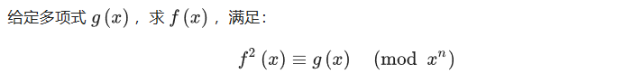

```c++
#include <bits/stdc++.h>
using namespace std;

const int maxn = 1 << 20, mod = 998244353;

int a[maxn], b[maxn], g[maxn], gg[maxn];

int qpow(int x, int y) {
  int ans = 1;

  while (y) {
    if (y & 1) {
      ans = 1LL * ans * x % mod;
    }
    x = 1LL * x * x % mod;
    y >>= 1;
  }
  return ans;
}

int inv2 = qpow(2, mod - 2);

inline void change(int *f, int len) {
  for (int i = 1, j = len >> 1; i < len - 1; i++) {
    if (i < j) {
      swap(f[i], f[j]);
    }

    int k = len >> 1;
    while (j >= k) {
      j -= k;
      k >>= 1;
    }
    if (j < k) {
      j += k;
    }
  }
}

inline void NTT(int *f, int len, int type) {
  change(f, len);

  for (int q = 2; q <= len; q <<= 1) {
    int nxt = qpow(3, (mod - 1) / q);
    for (int i = 0; i < len; i += q) {
      int w = 1;

      for (int k = i; k < i + (q >> 1); k++) {
        int x = f[k];
        int y = 1LL * w * f[k + (q >> 1)] % mod;

        f[k] = (x + y) % mod;
        f[k + (q >> 1)] = (x - y + mod) % mod;
        w = 1LL * w * nxt % mod;
      }
    }
  }

  if (type == -1) {
    reverse(f + 1, f + len);
    int iv = qpow(len, mod - 2);

    for (int i = 0; i < len; i++) {
      f[i] = 1LL * f[i] * iv % mod;
    }
  }
}

inline void inv(int deg, int *f, int *h) {
  if (deg == 1) {
    h[0] = qpow(f[0], mod - 2);
    return;
  }

  inv(deg + 1 >> 1, f, h);

  int len = 1;
  while (len < deg << 1) {
    len <<= 1;
  }

  copy(f, f + deg, gg);
  fill(gg + deg, gg + len, 0);

  NTT(gg, len, 1);
  NTT(h, len, 1);
  for (int i = 0; i < len; i++) {
    h[i] = 1LL * (2 - 1LL * gg[i] * h[i] % mod + mod) % mod * h[i] % mod;
  }

  NTT(h, len, -1);
  fill(h + deg, h + len, 0);
}

int n, t[maxn];

inline void sqrt(int deg, int *f, int *h) {
  if (deg == 1) {
    h[0] = 1;
    return;
  }

  sqrt(deg + 1 >> 1, f, h);

  int len = 1;
  while (len < deg << 1) {
    len <<= 1;
  }
  fill(g, g + len, 0);
  inv(deg, h, g);
  copy(f, f + deg, t);
  fill(t + deg, t + len, 0);
  NTT(t, len, 1);
  NTT(g, len, 1);
  NTT(h, len, 1);

  for (int i = 0; i < len; i++) {
    h[i] = 1LL * inv2 * (1LL * h[i] % mod + 1LL * g[i] * t[i] % mod) % mod;
  }
  NTT(h, len, -1);
  fill(h + deg, h + len, 0);
}

int main() {
  cin >> n;

  for (int i = 0; i < n; i++) {
    scanf("%d", &a[i]);
  }
  sqrt(n, a, b);

  for (int i = 0; i < n; i++) {
    printf("%d ", b[i]);
  }

  return 0;
}
```

### 多项式方程求根

#### 牛顿迭代法

开根通常需要结合二分的思想。既可以使用经典二分法，也可以使用二阶收敛的牛顿法。
$$
x_{n+1}=x_n-\cfrac{f(x_n)}{f'(x_n)}
$$

```c++
struct Polynomial{
    #define Item double     // 内部数据类型
    #define MAXORDER 105    // 最大支持阶数
    int n;
    Item digit[MAXORDER];    // 存储多项式系数，从低到高（最高阶为 【 n-1 】 阶）
    Item& operator [] (const int x){
        return digit[x];
    }
    Item operator ()(Item x){
        return calculate(x);
    }
    Polynomial() {memset(digit, 0, sizeof(digit));}
    Polynomial(int N){                        // 获得多项式: x^N
        memset(digit, 0, sizeof(digit));
        n = N + 1; digit[N] = 1;
    }
    Polynomial derivative() {                 // 求导
        Polynomial ret(n - 2);
        _rep(i, 1, n - 1)
            ret[i - 1] = (Item)(i) * digit[i];
        // ret.digit[n - 1] = 0;
        return ret;
    }
    Item calculate(Item x){                   // 计算 F(x)
        Item ret = 0, base = 1;
        _rep(i, 0, n - 1){
            ret += base * digit[i];
            base *= x;
        }
        return ret;
    }
    Item Newton(Item N){                      // 牛顿迭代法 F(x) = N 求根
        Item x = N, pre = INF;
        Polynomial f   = *this; f[0] = -N;
        Polynomial f_1 = f.derivative();
        if(f_1(x) < eps) x += eps;
        while(abs(x - pre) > eps){
            pre = x;
            x = x - f(x) / f_1(x);
        }
        return x;
    }
};

//---------------------------结束实现---------------------------

Polynomial p(2);

int main(){
    // freopen("OJ.in", "r", stdin);
    _rep(i, 0, 2) cout << p.derivative().digit[i] << " "; cout << endl;
    cout << p.calculate(1) <<endl;
    cout << p(2) <<endl;
    cout << p.derivative().calculate(3) <<endl;
    cout << p.Newton(0) <<endl;

    return 0;
}
```

#### 高精度开方-牛顿法 Java

```java
public static BigInteger isqrtNewton(BigInteger n) {
    BigInteger a = BigInteger.ONE.shiftLeft(n.bitLength() / 2);
    boolean p_dec = false;
    for (;;) {
        BigInteger b = n.divide(a).add(a).shiftRight(1);
        if (a.compareTo(b) == 0 || a.compareTo(b) < 0 && p_dec)
            break;
        p_dec = a.compareTo(b) > 0;
        a = b;
    }
    return a;
}
```

#### 指数法开根

$$
x^{\frac{1}{n} }=e^{\frac{1}{n}ln(x)}
$$

```c++
#define Item long double
#define TEST 10  // 精度验证
Item solve(Item x, int n){   // 求解 x^(1/n)的整数解
    long long ret = exp(log(x) / n);
    while(pow(ret + 1, n) <= x) ret ++;
    return ret;   // 误差太大，计算失败
}
```

### 多项式重建

#### 拉格朗日插值

给定n个点，求过这n个点的多项式。

> 输入n, k，n个点，求 `f(k) % 998244353`。

```c++
#include <cstdio>
#define N 2005

using namespace std;

const int mod = 998244353;

int n, k;
int x[N], y[N];

inline int fpm(int bs, int mi) {
    int res = 1;
    while(mi) {
        if(mi & 1) res = 1LL * res * bs % mod;
        bs = 1LL * bs * bs % mod, mi >>= 1;
    }
    return res;
}
inline int Sub(int x, int y) { return (x -= y) < 0 ? x + mod : x; }
inline int inv(int x) { return fpm(x, mod - 2); }

int lagrange() {
    int res = 0, l;
    for(int i = 0; i < n; ++i) {
        l = 1;
        for(int j = 0; j < n; ++j) {
            if(i == j) continue;
            l = 1LL * l * Sub(k, x[j]) % mod *
                inv(Sub(x[i], x[j])) % mod;
        }
        res = (res + 1LL * l * y[i]) % mod;
    }
    return res;
}

int main() {
    scanf("%d%d", &n, &k);
    for(int i = 0; i < n; ++i)
        scanf("%d%d", &x[i], &y[i]);
    printf("%d\n", lagrange());
    return 0;
}
```

## 分数/有理数

> 只保存最简分数，实现了加减乘除。

```c++
struct Fraction{
    int num, den; // 分子，分母
    Fraction(int num = 0, int den = 1){
        if(den < 0){ num = -num; den = -den;}
        assert(den != 0);
        int g = __gcd(abs(num), den); // 如有必要，化简
        this->num = num / g;
        this->den = den / g;
    }
    Fraction operator +(const Fraction &A) const{
        return Fraction(num * A.den + den * A.num, den * A.den); // 通分
    }
    Fraction operator -(const Fraction &A) const{
        return Fraction(num * A.den - den * A.num, den * A.den);
    }
    Fraction operator *(const Fraction &A) const{
        return Fraction(num * A.num, den * A.den);
    }
    Fraction operator /(const Fraction &A) const{
        return Fraction(num * A.den, den * A.num);
    }
    bool operator <(const Fraction &A) const{
        return num * A.den < den * A.num;
    }
    bool operator ==(const Fraction &A) const{
        return num * A.den == den * A.num;
    }
};

istream& operator >>(istream &in , Fraction &A){
    int a, b; cin >> a >> b;
    A = Fraction(a, b);
    return in;
}
ostream& operator <<(ostream &out, Fraction A){
    cout << A.num << "/" << A.den;
    return out;
}
```

### Python分数类

```python
from fractions import Fraction

a = Fraction(16, -10)  # Fraction(-8, 5)
b = Fraction("-8/6")   # Fraction(-4, 3)
c = Fraction('1.414213 \t\n') # Fraction(1414213, 1000000)
d = a.as_integer_ratio() # 返回(分子, 分母)元组
from math import *
e = floor(Fraction(355, 113))  # 下取整，上取整同理ceil()
```

### 有理数取余

给出一个有理数 $c=\frac{a}{b}$，求 $c \bmod 19260817$ 的值。

> 费马小定理求逆元 $b^{-1}$，则 $c=a\times b^{-1}$。【核心在于**除法变乘法**】

```python
MOD = 19260817
def p(a,b):   # 快速幂
    t=a;
    res=1
    while(b!=0):
        if(b%2==1): res=res*t%MOD
        t=t*t%MOD
        b=b//2
    return res

a=int(input())
b=int(input())
if(b==0): print("Angry!")  # 特判无解
else: print((a*p(b,MOD))%MOD)
```

### 分数规划

有n个物品，每个物品有两个权值 $a$ 和 $b$，求一组 $w_i\in \{0,1\}$，使得$\cfrac{\sum a_i\times w_i}{\sum b_i\times w_i}$ 最大。

> 分数规划问题的通用方法是二分。
>
> 
>
> 于是问题转化为如何求 $\sum w_i\times (a_i-mid\times b_i)$ 的最大值。（最小值同理）
>
> 我们只需将 $a_i-mid\times b_i$ 作为第 $i$ 个物品的权值，问题便可贪心解决。

```c++
#include <algorithm>
#include <cmath>
#include <cstdio>
#include <cstdlib>
#include <cstring>
#include <iostream>
using namespace std;

inline int read() {
  int X = 0, w = 1;
  char c = getchar();
  while (c < '0' || c > '9') {
    if (c == '-') w = -1;
    c = getchar();
  }
  while (c >= '0' && c <= '9') X = X * 10 + c - '0', c = getchar();
  return X * w;
}

const int N = 100000 + 10;
const double eps = 1e-6;

int n;
double a[N], b[N];

inline bool check(double mid) {
  double s = 0;
  for (int i = 1; i <= n; ++i)
    if (a[i] - mid * b[i] > 0)  // 如果权值大于 0
      s += a[i] - mid * b[i];   // 选这个物品
  return s > 0;
}

int main() {
  // 输入
  n = read();
  for (int i = 1; i <= n; ++i) a[i] = read();
  for (int i = 1; i <= n; ++i) b[i] = read();
  // 二分
  double L = 0, R = 1e9;
  while (R - L > eps) {
    double mid = (L + R) / 2;
    if (check(mid))  // mid 可行，答案比 mid 大
      L = mid;
    else  // mid 不可行，答案比 mid 小
      R = mid;
  }
  // 输出
  printf("%.6lf\n", L);
  return 0;
}
```

#### 有约束的分数规划

额外要求：分母 $\sum w_i\times b_i \geq W$。

> 我们只需将 $b_i$ 视为第 $i$ 个物品的重量，将 $a_i-mid\times b_i$ 作为第 $i$ 个物品的权值，便转化为背包问题。

```c++
double f[1010];
inline bool check(double mid) {
  for (int i = 1; i <= W; i++) f[i] = -1e9;
  for (int i = 1; i <= n; i++)
    for (int j = W; j >= 0; j--) {
      int k = min(W, j + b[i]);
      f[k] = max(f[k], f[j] + a[i] - mid * b[i]);
    }
  return f[W] > 0;
}
```

## 矩阵

```c++
typedef double Item;   // 矩阵元素的类型，如int、long long、double...
struct Matrix{
    int n, m;  // n行m列 【 n x m 型矩阵】
    Item a[MAXN][MAXN];
    Matrix (int N = 0, int M = 0){
        clear();
        n = N; m = M;
    }
    void set(int N = 0, int M = 0){
        clear();
        n = N; m = M;
    }
    void clear(){
        n = m = 0;
        memset(a, 0, sizeof(a));
    }
    Item* operator [] (int x){                  // 下标重载
        return a[x];
    }
    void set_to_identity(int N = 0){            // 获取单位矩阵
        set(N, N);
        _for(i, 0, n)
            _for(j, 0, m)
                a[i][j] = (i == j);
    }
    void transpose(){                           // 转置
        _for(i, 0, n)
            _for(j, i+1, m)
                swap(a[i][j], a[j][i]);
        swap(n, m);
        // return *this;
    }
    Matrix operator + (const Matrix &b) const{  // 矩阵加法
        Matrix tmp(n, m);
        _for(i, 0, n)
            _for(j, 0, m)
                tmp.a[i][j] = a[i][j] + b.a[i][j];
        return tmp;
    }
    Matrix operator - (const Matrix &b) const{  // 矩阵减法
        Matrix tmp(n, m);
        _for(i, 0, n)
            _for(j, 0, m)
                tmp.a[i][j] = a[i][j] - b.a[i][j];
        return tmp;
    }
    Matrix operator * (const int &b) const{     // 数乘
        Matrix tmp(n, m);
        _for(i, 0, n)
            _for(j, 0, m)
                tmp.a[i][j] = a[i][j] * b;
        return tmp;
    }
    Matrix operator * (const Matrix &b) const{  // 矩阵乘法
        Matrix tmp(n, b.m);
        _for(i, 0, n)
            _for(j, 0, b.m)
                _for(k, 0, m)
                    tmp.a[i][j] += a[i][k] * b.a[k][j];
        return tmp;
    }
    Item gauss() {                            // 高斯消元(适合于浮点数)
        Item ans = 1;
        for (int i = 0; i < n; i++) {
            int sid = -1;
            for (int j = i; j < n; j++)
                if (abs(a[j][i]) > eps) {
                    sid = j;
                    break;
                }
            if (sid == -1) continue;
            if (sid != i) {
                for (int j = 0; j < n; j++) {
                    swap(a[sid][j], a[i][j]);
                    ans = -ans;
                }
            }
            for (int j = i + 1; j < n; j++) {
                Item ratio = a[j][i] / a[i][i];  // 这里涉及除法，若Item为整型则需要计算乘法逆元
                for (int k = 0; k < n; k++) {
                    a[j][k] -= a[i][k] * ratio;
                }
            }
        }
        for (int i = 0; i < n; i++) ans *= a[i][i];
        return ans;    // 返回矩阵行列式
    }
};

Matrix qPower(Matrix a, int n){ // 矩阵快速幂
    Matrix ans(n, n), base = a;
    _for(i, 0, n) ans.a[i][i] = 1; // 单位矩阵
    while(n){
        if(n & 1) ans = ans * base; // 若位为1，说明有权重，需要乘上
        base = base * base;
        n >>= 1; // 右移1位
    }
    return ans;
}

int readint(){  // 整数输入
    int x; scanf("%d", &x); return x;
}
istream& operator >>(istream &in , Matrix &A){ // n和m应提前输入
    _for(i, 0, A.n)
        _for(j, 0, A.m){
            cin >> A[i][j];          // 支持多类型
            // A[i][j] = readint();  // 输入整数型矩阵
        }
    return in;
}
ostream& operator <<(ostream &out, Matrix& A){
    _for(i, 0, A.n)
        _for(j, 0, A.m)
            cout << A[i][j] << " \n"[j == A.m - 1 && i != A.n - 1];
    return out;
}
```

### 高斯消元/求行列式

> 高斯消元矩阵需要`double`浮点数。

```c++
#include <algorithm>
#include <cassert>
#include <cmath>
#include <cstdio>
#include <cstring>
#include <iostream>
using namespace std;
#define MOD 100000007
#define eps 1e-7
struct matrix {
    static const int maxn = 20;
    int n, m;
    double mat[maxn][maxn];
    matrix() { memset(mat, 0, sizeof(mat)); }
    void print() {
        cout << "MATRIX " << n << " " << m << endl;
        for (int i = 0; i < n; i++) {
            for (int j = 0; j < m; j++) {
                cout << mat[i][j] << "\t";
            }
            cout << endl;
        }
    }
    void random(int n) {
        this->n = n;
        this->m = n;
        for (int i = 0; i < n; i++)
            for (int j = 0; j < n; j++) mat[i][j] = rand() % 100;
    }
    void initSquare() {
        this->n = 4;
        this->m = 4;
        memset(mat, 0, sizeof(mat));
        mat[0][1] = mat[0][3] = 1;
        mat[1][0] = mat[1][2] = 1;
        mat[2][1] = mat[2][3] = 1;
        mat[3][0] = mat[3][2] = 1;
        mat[0][0] = mat[1][1] = mat[2][2] = mat[3][3] = -2;
        this->n--;  //去一行
        this->m--;  //去一列
    }
    double gauss() {
        double ans = 1;
        for (int i = 0; i < n; i++) {
            int sid = -1;
            for (int j = i; j < n; j++)
                if (abs(mat[j][i]) > eps) {
                    sid = j;
                    break;
                }
            if (sid == -1) continue;
            if (sid != i) {
                for (int j = 0; j < n; j++) {
                    swap(mat[sid][j], mat[i][j]);
                    ans = -ans;
                }
            }
            for (int j = i + 1; j < n; j++) {
                double ratio = mat[j][i] / mat[i][i];
                for (int k = 0; k < n; k++) {
                    mat[j][k] -= mat[i][k] * ratio;
                }
            }
        }
        for (int i = 0; i < n; i++) ans *= mat[i][i];
        return abs(ans);
    }
};
int main() {
    srand(1);
    matrix T;
    // T.random(2);
    T.initSquare();
    T.print();
    double ans = T.gauss();
    T.print();
    cout << ans << endl;
}
```

### 矩阵求逆

`double`型求逆：

```c++
#include <bits/stdc++.h>
#define eps 1e-8
using namespace std;
double a[101][102];
int n;
bool GUASS()
{
   for(int i=1;i<=n;i++){
   	for(int j=i;j<=n;j++){
   		if(fabs(a[j][i])>eps){
   			for(int k=1;k<=n;k++){
   				swap(a[i][k],a[j][k]);
   			}
   			swap(a[i][n+1],a[j][n+1]);
   			break;
   		}			
   	}
   	for(int j=1;j<=n;j++){
   		if(i==j) continue;
   		double tmp=a[j][i]/a[i][i];
   		for(int k=i;k<=n;k++){
   			a[j][k]-=a[i][k]*tmp;
   		}
   		a[j][n+1]-=a[i][n+1]*tmp;
   	}
   }
   for(int i=1;i<=n;i++){
   	bool lala=0;
   	for(int j=1;j<=n;j++){
   		if(a[i][j]!=0){
   			lala=1;
   		}
   	}
   	if(lala==0){
   		cout<<"No Solution";  // 不可逆
   		return 0;
   	}
   }
   return 1;
}
int main()
{
   cin>>n;
   for(int i=1;i<=n;i++){
   	for(int j=1;j<=n+1;j++){
   		scanf("%lf",&a[i][j]);
   	}
   }
   if(GUASS()){
   	for(int i=1;i<=n;i++){
   		printf("%.2lf\n",a[i][n+1]/a[i][i]);
   	}
   }
}
```

`int`型求逆：（模意义下）

```c++
#include <bits/stdc++.h>
#define p 1000000007
#define inc(i,a,b) for(register int i=a;i<=b;i++)
using namespace std;
int n;
int a[1000][1000];
long long KSM(long long a,long long b)
{
  long long res=1;
  while(b){
  	if(b&1) res=res*a%p;
  	a=a*a%p;
  	b/=2;
  }
  return res%p;
}
int Gauss()
{
  inc(i,1,n){
  	inc(j,i,n) if(a[j][i]) {swap(a[j],a[i]);break;}
  	if(a[i][i]==0){cout<<"No Solution"; return 0;}  // 不可逆
  	long long tmp=KSM(a[i][i],p-2);
  	inc(j,i,2*n) a[i][j]=a[i][j]*tmp%p;
  	inc(j,1,n){
  		if(i==j) continue;
  		long long tmp2=a[j][i]%p;
  		inc(k,i,2*n) a[j][k]=(a[j][k]-tmp2*a[i][k]%p+p)%p;
  	}
  }
  return 1;
}
int main()
{
  cin>>n;
  inc(i,1,n){
  	inc(j,1,n) scanf("%d",&a[i][j]);
  	a[i][i+n]=1;
  }
  if(Gauss()){
  	inc(i,1,n){
  		inc(j,n+1,2*n){
  			printf("%d ",a[i][j]);
  		}
  		printf("\n");
  	}
  }
} 
```

### 矩阵面积并 扫描线算法

求 $n$ 个矩形的面积并（覆盖）。

> 分析一下题目，可以用一条直线从左向右扫描所有竖直线段，每次计算这些线段的并集的长度，然后把各个子矩形的面积相加。问题便转化为：
>
> - **维护一些区间，支持增加和删除区间，每次操作后求这些区间并集的长度。**

```c++
#include <stdio.h>
#include <iostream>
#include <algorithm>
#define lson (x << 1)
#define rson (x << 1 | 1)
using namespace std;
const int MAXN = 1e6 + 10;
typedef long long ll;

int n, cnt = 0;
ll x1, y1, x2, y2, X[MAXN << 1];

struct ScanLine {
	ll l, r, h;
	int mark;
//  mark用于保存权值 (1 / -1)
	bool operator < (const ScanLine &rhs) const {
		return h < rhs.h;
	}
} line[MAXN << 1];

struct SegTree {
	int l, r, sum;
	ll len;
//  sum: 被完全覆盖的次数；
//  len: 区间内被截的长度。
} tree[MAXN << 2];

void build_tree(int x, int l, int r) {
//  我觉得最不容易写错的一种建树方法
	tree[x].l = l, tree[x].r = r;
	tree[x].len = 0;
	tree[x].sum = 0;
	if(l == r)
		return;
	int mid = (l + r) >> 1;
	build_tree(lson, l, mid);
	build_tree(rson, mid + 1, r);
	return;
}

void pushup(int x) {
	int l = tree[x].l, r = tree[x].r;
	if(tree[x].sum /* 也就是说被覆盖过 */ )
		tree[x].len = X[r + 1] - X[l];
//      更新长度        
	else
		tree[x].len = tree[lson].len + tree[rson].len;
//      合并儿子信息
}

void edit_tree(int x, ll L, ll R, int c) {
	int l = tree[x].l, r = tree[x].r;
//  注意，l、r和L、R的意义完全不同
//  l、r表示这个节点管辖的下标范围
//  而L、R则表示需要修改的真实区间
	if(X[r + 1] <= L || R <= X[l])
		return;
//  这里加等号的原因：
//  假设现在考虑 [2,5], [5,8] 两条线段，要修改 [1,5] 区间的sum
//  很明显，虽然5在这个区间内，[5,8] 却并不是我们希望修改的线段
//  所以总结一下，就加上了等号
	if(L <= X[l] && X[r + 1] <= R) {
		tree[x].sum += c;
		pushup(x);
		return;
	}
	edit_tree(lson, L, R, c);
	edit_tree(rson, L, R, c);
	pushup(x);
}

int main() {
	scanf("%d", &n);
	for(int i = 1; i <= n; i++) {
		scanf("%lli %lli %lli %lli", &x1, &y1, &x2, &y2);
		X[2 * i - 1] = x1, X[2 * i] = x2;
		line[2 * i - 1] = (ScanLine) {x1, x2, y1, 1};
		line[2 * i] = (ScanLine) {x1, x2, y2, -1};
//      一条线段含两个端点，一个矩形的上下边都需要扫描线扫过
	}
	n <<= 1;
//  直接把 n <<= 1 方便操作
	sort(line + 1, line + n + 1);
	sort(X + 1, X + n + 1);
	int tot = unique(X + 1, X + n + 1) - X - 1;
//  去重最简单的方法：使用unique！（在<algorithm>库中）
	build_tree(1, 1, tot - 1);
//  为什么是 tot - 1 ：
//  因为右端点的对应关系已经被篡改了嘛…
//  [1, tot - 1]描述的就是[X[1], X[tot]]
	ll ans = 0;
	for(int i = 1; i < n /* 最后一条边是不用管的 */ ; i++) {
		edit_tree(1, line[i].l, line[i].r, line[i].mark);
//      先把扫描线信息导入线段树
		ans += tree[1].len * (line[i + 1].h - line[i].h);
//      然后统计面积
	}
	printf("%lli", ans);
	return 0;
}
```

### 矩阵周长并

```c++
#include <iostream>
#include <stdio.h>
#include <algorithm>
#define lson (x << 1)
#define rson (x << 1 | 1)
using namespace std;
const int MAXN = 2e4;
int n, X[MAXN << 1];
int x1, y1, x2, y2, pre = 0; /* 先初始化为 0 */

struct ScanLine {
	int l, r, h, mark;
	if(h == rhs.h)
		return mark > rhs.mark;
    return h < rhs.h;
//		注意！这里是后来被 hack 掉以后加上去的
//		在此感谢 @leprechaun_kdl 指出问题
//		如果出现了两条高度相同的扫描线，也就是两矩形相邻
//		那么需要先扫底边再扫顶边，否则就会多算这条边
//		这个对面积并无影响但对周长并有影响
//		hack 数据：2 0 0 4 4 0 4 4 8 输出应为：24
} line[MAXN];

struct SegTree {
	int l, r, sum, len, c;
//  c表示区间线段条数
    bool lc, rc;
//  lc, rc分别表示左、右端点是否被覆盖
//  统计线段条数(tree[x].c)会用到
} tree[MAXN << 2];

void build_tree(int x, int l, int r) {
	tree[x].l = l, tree[x].r = r;
	tree[x].lc = tree[x].rc = false;
	tree[x].sum = tree[x].len = 0;
	tree[x].c = 0;
	if(l == r)
		return;
	int mid = (l + r) >> 1;
	build_tree(lson, l, mid);
	build_tree(rson, mid + 1, r);
}

void pushup(int x) {
	int l = tree[x].l, r = tree[x].r;
	if(tree[x].sum) {
		tree[x].len = X[r + 1] - X[l];
		tree[x].lc = tree[x].rc = true;
		tree[x].c = 1;
//      做好相应的标记
	}
	else {
		tree[x].len = tree[lson].len + tree[rson].len;
		tree[x].lc = tree[lson].lc, tree[x].rc = tree[rson].rc;
		tree[x].c = tree[lson].c + tree[rson].c;
//      如果左儿子左端点被覆盖，那么自己的左端点也肯定被覆盖；右儿子同理
		if(tree[lson].rc && tree[rson].lc)
			tree[x].c -= 1;
//      如果做儿子右端点和右儿子左端点都被覆盖，
//      那么中间就是连续的一段，所以要 -= 1
	}
}

void edit_tree(int x, int L, int R, int c) {
	int l = tree[x].l, r = tree[x].r;
	if(X[l] >= R || X[r + 1] <= L)
		return;
	if(L <= X[l] && X[r + 1] <= R) {
		tree[x].sum += c;
		pushup(x);
		return;
	}
	edit_tree(lson, L, R, c);
	edit_tree(rson, L, R, c);
	pushup(x);
}

ScanLine make_line(int l, int r, int h, int mark) {
	ScanLine res;
	res.l = l, res.r = r,
	res.h = h, res.mark = mark;
	return res;
}
//  POJ 不这样做就会CE，很难受

int main() {
	scanf("%d", &n);
	for(int i = 1; i <= n; i++) {
		scanf("%d %d %d %d", &x1, &y1, &x2, &y2);
		line[i * 2 - 1] = make_line(x1, x2, y1, 1);
		line[i * 2] = make_line(x1, x2, y2, -1);
		X[i * 2 - 1] = x1, X[i * 2] = x2;
	}
	n <<= 1;
	sort(line + 1, line + n + 1);
	sort(X + 1, X + n + 1);
	int tot = unique(X + 1, X + n + 1) - X - 1;
	build_tree(1, 1, tot - 1);
	int res = 0;
	for(int i = 1; i < n; i++) {
		edit_tree(1, line[i].l, line[i].r, line[i].mark);
		res += abs(pre - tree[1].len);
		pre = tree[1].len;
//      统计横边
		res += 2 * tree[1].c * (line[i + 1].h - line[i].h);
//      统计纵边
	}
	res += line[n].r - line[n].l;
//  特判一下枚举不到的最后一条扫描线
	printf("%d", res);
	return 0;
}
```

## 组合数学

### 组合数 `C(n,m)`

#### DP法求组合数  $O(mn)$

状态转移方程：（$C(n,m) = C_n^m$）
$$
C(n,m)=C(n-1,m-1)+C(n-1,m)
$$
初始条件：$C(i,0)=C(i,i)=1$。

```c++
int C[MAXN][MAXN];
int cal_c(int n, int m){
    for(int i = 0; i <= n; ++i) C[i][0] = C[i][i] = 1; // 初始化
    for(int i = 1; i <= n; ++i)
        for(int j = 1; j < i; ++j)
            C[i][j] = C[i-1][j-1] + C[i-1][j];
    return C[n][m];
}
```

记忆化：

```c++
#define _c(n,m) (c[n][m] ? c[n][m] : c[n][m] = C(n,m)) // 记忆宏
int c[MAXN][MAXN];
int C(int n, int m){
    if(m == 0 || m == n) return 1;
    return _c(n-1, m) + _c(n-1, m-1);
}
```

#### 线性求组合数/计算二项式系数 $O(n)$

根据：$C(n,k) = \cfrac{n-k+1}{k}C(n,k-1)$。初始条件：$C(n,0)=1$。

```c++
int C[MAXN];
int cal_c(int n, int m){
    C[0] = 1;
    for(int i = 1; i <= m; ++i)
        C[i] = C[i-1] * (n-i+1) / i;
    return C[m];
}
```

#### 卢卡斯定理 `C(n,m) % p` $O(logn+p)$

> 适用范围：mod是不大的素数（$p<10^5$）的大组合数计算

Lucas 定理用于求解**大规模组合数**取模的问题，其中 p **必须为素数**。

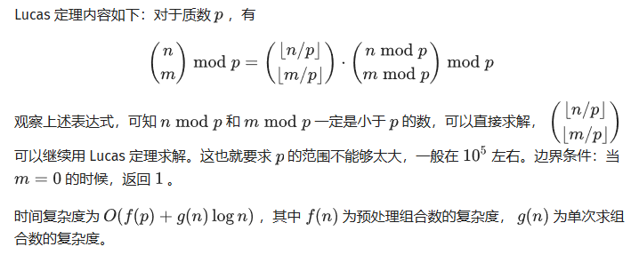

```c++
#include<bits/stdc++.h>
#define N 100010
using namespace std;
typedef long long ll;
ll a[N];
int p;
ll pow(ll y,int z,int p){
    y%=p;ll ans=1;
    for(int i=z;i;i>>=1,y=y*y%p)if(i&1)ans=ans*y%p;
    return ans;
}
ll C(ll n,ll m){
    if(m>n)return 0;
    return ((a[n]*pow(a[m],p-2,p))%p*pow(a[n-m],p-2,p)%p);
}
ll Lucas(ll n,ll m){
    if(!m)return 1;
    return C(n%p,m%p)*Lucas(n/p,m/p)%p;
}
inline int read(){
    int f=1,x=0;char ch;
    do{ch=getchar();if(ch=='-')f=-1;}while(ch<'0'||ch>'9');
    do{x=x*10+ch-'0';ch=getchar();}while(ch>='0'&&ch<='9');
    return f*x;
}
int main(){
    int T=read();
    while(T--){
        int n=read(),m=read();p=read();
        a[0]=1;
        for(int i=1;i<=p;i++)a[i]=(a[i-1]*i)%p;
        cout<<Lucas(n+m,n)<<endl;
    }
}
```

#### 扩展卢卡斯定理 `C(n,m) % p` $O(log^2n\times p)$

Lucas 定理中对于模数p要求必须为素数，那么对于**p不是素数**的情况，就需要用到 exLucas 定理。

> 适用范围：$p<10^9$。
>
> p可以为任何正整数。
>
> 原理：把mod数分解质因数，计算p1^t1 , p2^t2 …. pm^tm,然后用中国剩余定理合并。

```c++
#include<bits/stdc++.h>
#define ll long long
using namespace std;

inline ll fmi(ll a,ll b,ll p)
{
    ll ans=1;
    a%=p;
    while(b>0)
    {
        if(b&1) ans=(ans*a)%p;
        a=(a*a)%p;
        b>>=1;
    }
    ans%=p;
    return ans;
}

inline ll exgcd(ll a,ll b,ll &x,ll &y)
{
    if(!b) {x=1,y=0;return a;}
    ll k=exgcd(b,a%b,x,y);
    ll z=x;x=y,y=z-a/b*y;
    return k;
}

inline ll inv(ll a,ll b)
{
    ll x,y;
    ll g=exgcd(a,b,x,y);
    return g==1?(x%b+b)%b:-1;
}

inline ll mul(ll n,ll pi,ll pk)
{
    if(!n) return 1;
    ll ans=1;
    if(n/pk)
    {
        for(ll i=2;i<=pk;i++)
            if(i%pi) ans=ans*i%pk;
        ans=fmi(ans,n/pk,pk);
    }
    for(ll i=2;i<=n%pk;i++)
        if(i%pi) ans=ans*i%pk;
    return ans*mul(n/pi,pi,pk)%pk;
}

inline ll C(ll n,ll m,ll p,ll pi,ll pk)
{
    if(n<m) return 0;
    ll a=mul(n,pi,pk);
    ll b=mul(m,pi,pk);
    ll c=mul(n-m,pi,pk),k=0,ans;
    for(ll i=n;i;i/=pi) k+=i/pi;
    for(ll i=m;i;i/=pi) k-=i/pi;
    for(ll i=n-m;i;i/=pi) k-=i/pi;
    ans=a*inv(b,pk)%pk*inv(c,pk)%pk*fmi(pi,k,pk)%pk;
    ans=ans*(p/pk)%p*inv(p/pk,pk)%p;
    return ans;
}

inline ll exLucas(ll n,ll m,ll p)
{
    ll ans=0,x=p,t=sqrt(p);
    for(ll i=2;i<=t;i++)
        if(x%i==0)
        {
            ll pk=1;
            while(x%i==0) x/=i,pk*=i;
            ans=(ans+C(n,m,p,i,pk))%p;
        }
    if(x>1) ans=(ans+C(n,m,p,x,x))%p;
    return ans;
}

int main(){
    ll n, m, p;
    scanf("%lld%lld%lld",&n,&m,&p);
    printf("%lld\n",exLucas(n,m,p));
    return 0;
}
```

### 错排公式 $O(n)$

所有元素均不在其应在的位置的组合数。$F[n]$表示n个数错排方案的总数。
$$
\begin{equation}F[n]=\left\{\begin{array}{ll}0 & {\text { if } n=1 }\\1 & {\text { if } n=2 }\\(n-1)\times F[n-1]+(n-1)\times F[n-2] & {\text { if } n> 2 }\end{array}\right.\end{equation}
$$

```c++
int F[MAXN];
int f(int n) {
    F[1] = 0; F[2] = 1;
    for(int i = 3; i <= n; ++i)
        F[i] = (n-1) * F[i-1] + (n-1) * F[n-2];
    return F[n];
}
```

### 康托展开 $O(nlogn)$

求 $1\sim N$ 的一个给定全排列在所有 $1\sim N$ 全排列中的排名。（取模）
$$
ans=1+\sum_{i=1}^{n}A[i]\times(n-1)!
$$

```c++
#include<bits/stdc++.h>
using namespace std;
#define MAXN 1000005
#define rgt register
#define mod 998244353   // 取模

int N, a[MAXN], fac, c[MAXN], ans;
char *p;

inline void read( rgt int &x ){
	x = 0; while( !isdigit(*p) ) ++p;
	while( isdigit(*p) ) x = x * 10 + ( *p & 15 ), ++p;
}

int main(){
	scanf( "%d", &N ), fac = 1;
	p = new char[N * 8 + 100],
	fread( p, 1, N * 8 + 100, stdin );
	for ( rgt int i = N; i; --i ) read(a[i]);
	for ( rgt int i = 1, s, j; i <= N; ++i ){
		for ( s = 0, j = a[i]; j; j -= j & -j ) s += c[j];
		ans = ( ans + 1ll * fac * s ) % mod, fac = 1ll * fac * i % mod;
		for ( j = a[i]; j <= N; j += j & -j ) ++c[j];
	} printf( "%d\n", ans + 1 );
	return 0;
}
```

#### 逆康托展开 $O(nlogn)$

> 已知排名求排列。

```c++
static const int FAC[] = {1, 1, 2, 6, 24, 120, 720, 5040, 40320, 362880};	// 阶乘
//康托展开逆运算
void decantor(int x, int n){
    vector<int> v;  // 存放当前可选数
    vector<int> a;  // 所求排列组合
    for(int i=1;i<=n;i++)
        v.push_back(i);
    for(int i=m;i>=1;i--){
        int r = x % FAC[i-1];
        int t = x / FAC[i-1];
        x = r;
        sort(v.begin(),v.end());// 从小到大排序 
        a.push_back(v[t]);      // 剩余数里第t+1个数为当前位
        v.erase(v.begin()+t);   // 移除选做当前位的数
    }
}
```

### 卡特兰数 Cat(n) $O(n)$

```c++
int n;
long long f[101];
int Cat(int n) { // [1, 1, 2, 5, 14, 42, 132, 429, 1430, 4862, ...]
    f[0] = 1;
    for (int i = 1; i <= n; i++)
        f[i] = f[i - 1] * (4 * i - 2) / (i + 1); // 卡特兰递推公式
    return f[n];
}
```

### 斐波那契数 $O(n)$

> [数列找规律网](http://oeis.org/)（输入前几项，即可找出递推公式）。

```C++
pair<int, int> fib(int n) { // 返回值是一个二元组(Fn, Fn+1)
  if (n == 0) return {0, 1};
  auto p = fib(n >> 1);
  int c = p.first * (2 * p.second - p.first);
  int d = p.first * p.first + p.second * p.second;
  if (n & 1)
    return {d, c + d};
  else
    return {c, d};
}
```

### 2-SAT问题

2-SAT 问题的目标是给每个变量赋值使得所有条件得到满足。

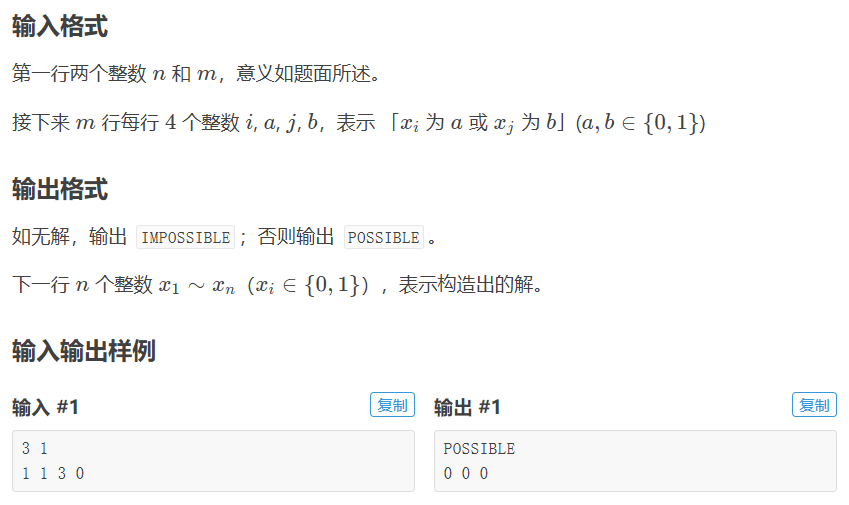

```c++
#include <cstdio>
#define min(a,b) (a<b?a:b)

const int maxn=1e6+10;
struct EDGE
{
	int t,next;
}edge[maxn<<2];
int head[maxn<<1],low[maxn<<1],dfn[maxn<<1],stack[maxn<<1],scc[maxn<<1];
bool in[maxn<<1];
int cur,n,tim,top,cnt,m;

void add(int u,int v)
{
	edge[++cur].t=v;
	edge[cur].next=head[u];
	head[u]=cur;
}

void tarjan(int u)
{
	low[u]=dfn[u]=++tim;
	stack[top++]=u;in[u]=true;
	for(int i=head[u]; i; i=edge[i].next)
	{
		int v=edge[i].t;
		if(!dfn[v])
		{
			tarjan(v);
			low[u]=min(low[u],low[v]);
		}else	if(in[v])
			low[u]=min(low[u],dfn[v]);
	}
	if(low[u]==dfn[u])
	{
		int v;
		cnt++;
		do
		{
			v=stack[--top];
			in[v]=false;
			scc[v]=cnt;
		}while(u!=v);
	}
}

bool two_SAT()
{
	for(int i=1; i<=2*n; i++)
		if(!dfn[i])
			tarjan(i);//tarjan找强连通分量 
	for(int i=1; i<=n; i++)
		if(scc[i]==scc[i+n])//a条件和非a条件在同一个强连通分量，原问题无解 
			return false;
	return true;
}

int main()
{
	scanf("%d%d",&n,&m);
	for(int i=1; i<=m; i++)
	{
		int a,b,aval,bval;
		scanf("%d%d%d%d",&a,&aval,&b,&bval);
		int nota=aval^1,notb=bval^1;//这里我用a表示条件a选0的情况，a+n表示条件a选1的情况。 
		add(a+nota*n,b+bval*n);//连边(非a，b) 
		add(b+notb*n,a+aval*n);//连边(非b，a) 
	}
	if(two_SAT())
	{
		printf("POSSIBLE\n");
		for(int i=1; i<=n; i++)
			printf("%d ",scc[i]>scc[i+n]);
	}else
		printf("IMPOSSIBLE");
	return 0;
}
```

## 博弈论

### 巴什博奕

只有一堆n个物品，两个人轮流从中取物，规定每次最少取一个，最多取m个，最后取光者为胜。

```c++
#include <iostream>
using namespace std;
int main()
{
    int n,m;
    while(cin>>n>>m)
      if(n%(m+1)==0)  cout<<"后手必胜"<<endl;
      else cout<<"先手必胜"<<endl;
    return 0;
}
```

### 威佐夫博弈

有两堆各若干的物品，两人轮流从其中一堆取至少一件物品，至多不限，或从两堆中同时取相同件物品，规定最后取完者胜利。

> 若两堆物品的初始值为（x，y），且x<y，则另z=y-x；
>
> 记w=（int）[（（sqrt（5）+1）/2）*z  ]；
>
> 若w=x，则先手必败，否则先手必胜。

```c++
ll n,m,w;
int jud; 
int main(){
    scanf("%lld%lld",&n,&m);   // 两堆石子
    if(m>n) swap(n,m);
    w=n-m;
    jud=(int)(((sqrt(5.0)+1.0)/2.0)*w);// 向下取整 
    if(jud==m) printf("0");
    else printf("1");
    return 0;
} 
```

### Nimm博弈

地上有 $n$ 堆石子（每堆石子数量小于 $10^4$），每人每次可从任意一堆石子里取出任意多枚石子扔掉，可以取完，不能不取。每次只能从一堆里取。最后没石子可取的人就输了。假如甲是先手，且告诉你这 $n$ 堆石子的数量，他想知道是否存在先手必胜的策略。

> 把每堆物品数全部异或起来，如果得到的值为0，那么先手必败，否则先手必胜。

```c++
#include <cstdio>
#include <cmath>
#include <iostream>
using namespace std;
int main()
{
    int n,ans,temp;
    while(cin>>n)
    {
        temp=0;
        for(int i=0;i<n;i++)
        {
            cin>>ans;
            temp^=ans;
        }
        if(temp==0)  cout<<"后手必胜"<<endl;
        else cout<<"先手必胜"<<endl;
    }
    return 0;
}
```

### 斐波那契博弈

有一堆物品，两人轮流取物品，先手最少取一个，至多无上限，但不能把物品取完，之后每次取的物品数不能超过上一次取的物品数的二倍且至少为一件，取走最后一件物品的人获胜。

> 先手胜当且仅当n不是斐波那契数（n为物品总数）

```c++
#include <iostream>  
#include <string.h>  
#include <stdio.h>  
using namespace std;  
const int N = 55;    
int f[N];   
void Init()  
{  
    f[0] = f[1] = 1;  
    for(int i=2;i<N;i++)  
        f[i] = f[i-1] + f[i-2];  
}    
int main()  
{  
    Init();  
    int n;  
    while(cin>>n)  
    {  
        if(n == 0) break;  
        bool flag = 0;  
        for(int i=0;i<N;i++)  
        {  
            if(f[i] == n)  
            {  
                flag = 1;  
                break;  
            }  
        }  
        if(flag) puts("Second win");  
        else     puts("First win");  
    }  
    return 0;  
} 
```

### 约瑟夫问题

**n** 个人标号0，1，...，n。逆时针站一圈，从0号开始，每一次从当前的人逆时针数 **k** 个，然后让这个人出局。问最后剩下的人是谁。

#### 线性算法 $O(n)$

```c++
int josephus(int n, int k) {
  int res = 0;
  for (int i = 1; i <= n; ++i) res = (res + k) % i;
  return res;
}
```

#### 对数算法 $O(klogn)$

```c++
int josephus(int n, int k) {
  if (n == 1) return 0;
  if (k == 1) return n - 1;
  if (k > n) return (josephus(n - 1, k) + k) % n;  // 线性算法
  int res = josephus(n - n / k, k);
  res -= n % k;
  if (res < 0)
    res += n;  // mod n
  else
    res += res / (k - 1);  // 还原位置
  return res;
}
```

<div STYLE="page-break-after: always;"></div>

# 图论

## 图模板

``` c++
struct edge{
    int a, b, w; // 两个节点，权重
};
vector<int> edge[MAXN]; // 邻接表；利用下标和数值来索引边; 二维数组; 方便处理出/入度
```

### 带权边模板

```c++
struct Edge{   // 带权边
    int from, to, dist;
    Edge(int u, int v, int d): from(u), to(v), dist(d) {}
};
```

### (树)节点模板

动态指针型：

```c++
struct node{
    int data;
    node* lc, rc;
}
```

静态数组型：

```c++
int size = 0;
struct node{
    int data;
    int lc, rc;  // 用-1表示NULL
} Node[MAXN];
```

## 二叉树遍历

```c++
void vis(node* root){         // 操作函数
    cout << root->data;
}
void preorder(node* root){    // 先序遍历
    if(root == NULL) return ;
    vis(root); // 访问
    preorder(root->lc); // 左子树
    preorder(root->rc); // 右子树
}
void inorder(node* root){     // 中序遍历
    if(root == NULL) return ;
    inorder(root->lc); // 左子树
    vis(root); // 访问
    inorder(root->rc); // 右子树
}
void postorder(node* root){   // 后序遍历
    if(root == NULL) return ;
    postorder(root->lc); // 左子树
    postorder(root->rc); // 右子树
    vis(root); // 访问
}
void layerorder(node* root){  // 层序遍历
    queue<node*> Q; Q.push(root);
    while(!Q.empty()){
        node* now = Q.front(); Q.pop();
        vis(now);
        if(now->lc) Q.push(now->lc);
        if(now->rc) Q.push(now->rc);
    }
}
```

## 二叉排序树 BST

```c++
struct node{
    int data;
    node *lc, *rc;
    node(int x): data(x), lc(NULL), rc(NULL) {}
};
struct BST{
    node* root = NULL;
    void insert(int x){     // 插入
        root = Insert(x, root);
    }
    node* Insert(int x, node* cur){
        if(cur == NULL) return cur = new node(x);
        if(x < cur->data) cur->lc = Insert(x, cur->lc); 
        else cur->rc = Insert(x, cur->rc);
        return cur;
    }
    node* find(int x){     // 查找
        node* ret = root;
        while(ret != NULL && x != ret->data){
            if(x < ret->data) ret = ret->lc;
            else ret = ret->rc;
        }
        return ret;
    }
    bool erase(int x){     // 删除，需要父节点指针
        return false;
    }
};

int main(){
    BST b;
    b.insert(7); b.insert(5); b.insert(6);
    preorder(b.root); cout <<endl;
    inorder(b.root); cout <<endl;
    postorder(b.root);
    return 0;
}
```

## 树同构哈希

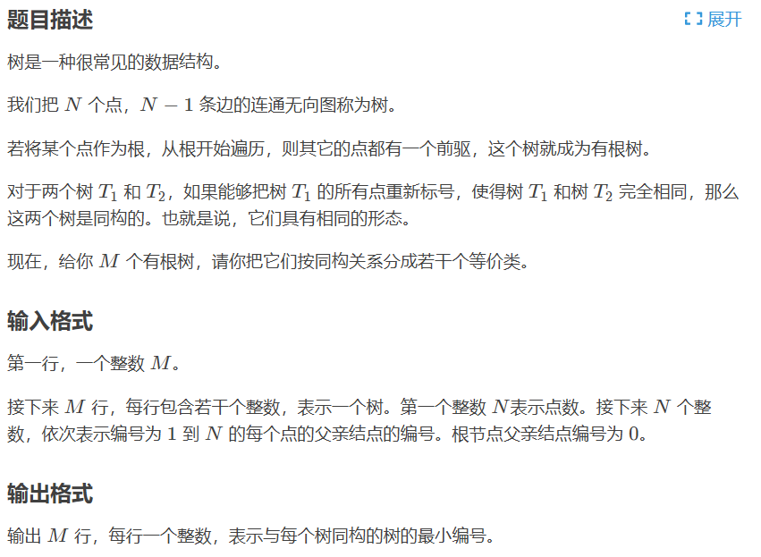

```c++
#include<bits/stdc++.h>
using namespace std;
const long long maxn=1001;
long long ans[maxn][maxn],n,m,head[maxn],last[maxn],Next[maxn],tot,x;
void add(int x,int y){				//建边 
    last[++tot]=y;Next[tot]=head[x];head[x]=tot;
}
long long Hash(int x,int f)			//树哈希 
{
    long long q[maxn],ans=maxn,top=0;
    for(int i=head[x];i;i=Next[i])	//遍历所以子节点 
    if(last[i]!=f)					//不能再次遍历以遍历的点，即x的父亲 
	q[++top]=Hash(last[i],x);
    sort(q+1,q+top+1);				//把哈希打得更乱 
    for(int i=1;i<=top;i++)			//对x点计算哈希值 
    ans=ans*2333+q[i];
    return ans*2333+maxn+1;
}
int main(){
    cin>>m;
    for(int i=1;i<=m;i++)
    {
        tot=0;memset(head,0,sizeof(head));		//建边清0 
        cin>>n;
        for(int j=1;j<=n;j++)
        {
            cin>>x;
            if(x!=0)add(x,j),add(j,x);
        }
        for(int j=1;j<=n;j++)
        	ans[i][j]=Hash(j,0);			//树哈希 
        sort(ans[i]+1,ans[i]+n+1);
        for(int j=1,k=0;j<=i;j++)
        {
            while(k<=n) if(ans[i][++k]!=ans[j][k]) break;	//找同构 
            if(k>n){printf("%d\n",j);break;}	//找到同构就输出 
        }
    }
    return 0;
}
```

## 优先级搜索 PFS

### 广度优先搜索 BFS

邻接矩阵版：

```c++
int n, G{MAXN}[MAXN];
bool inq[MAXN] = {false}; // 进队标记
void BFS(int u){
    queue<int> Q;
    Q.push(u); inq[u] = true;
    while(!Q.empty()){
        int u = Q.front(); Q.pop();
        EXECUTE(u); // 如有必要，对u进行需要的操作
        for(int v = 0; v < n; ++v)
            if(!inq[v] && G[u][v]){
                Q.push(v); inq[v] = true;
            }
    }
}
```

邻接表版：

```c++
int n; // n为顶点数
vector<int> Adj[MAXN];  // Adj为邻接表
bool inq[MAXN] = {false}; // 进队标记
void BFS(int u){
    queue<int> Q;
    Q.push(u); inq[u] = true;
    while(!Q.empty()){
        int u = Q.front(); Q.pop();
        EXECUTE(u); // 如有必要，对u进行需要的操作
        for(int i = 0; i < Adj[u].size(); ++v)
            int v = Adj[u][i];
        	if(!vis[v]){ // v未访问
                Q.push(v); inq[v] = true;
            }
    }
}
```

BFS森林：

```c++
void BFSTrave(){ // BFS森林
    for(int u = 0; u < n; ++u)
        if(!inq[u])
            BFS(u);
}
```

### 深度优先搜索 DFS

原理伪代码：

```c++
void DFS(int p) {
    visited[p] = true;
    for (int to : edge[p])
        if (!visited[to]) DFS(to);
}
```

邻接矩阵版：

```c++
int n, G[MAXN][MAXN]; // n为顶点数，G为邻接矩阵
bool vis[MAXV] = {false}; // 访问标记
void DFS(int u, int depth){ // u为访问节点，depth为访问深度
    vis[u] = true;
    EXECUTE(u); // 如有必要，对u进行需要的操作
    for(int v = 0; v < n; ++v)
        if(!vis[v] && G[u][v]) // v未访问 && 边u-v存在
            DFS(v, depth + 1);
}
```

邻接表版：

```c++
int n; // n为顶点数
vector<int> Adj[MAXN];  // Adj为邻接表
bool vis[MAXV] = {false}; // 访问标记
void DFS(int u, int depth){ // u为访问节点，depth为访问深度
    vis[u] = true;
    EXECUTE(u); // 如有必要，对u进行需要的操作
    for(int i = 0; i < Adj[u].size(); ++v){
        int v = Adj[u][i];
        if(!vis[v]) // v未访问
            DFS(v, depth + 1);
    }
}
```

DFS森林：

```c++
void DFSTrave(){ // DFS森林
    for(int u = 0; u < n; ++u)
        if(!vis[u])
            DFS(u, 1);
}
```

#### 欧拉路径/欧拉回路*

如果图G中的一个路径包括每个边恰好一次，则该路径称为欧拉路径(Euler path)。

如果一个回路是欧拉路径，则称为欧拉回路(Euler circuit)。

> 例：构造一个$2^n$位的**循环数组**，满足：
>
> ​	每次从中截取n位，能够遍历所有的n位2进制数。
>
> 如：构造`0110`数组，将遍历：`01`，`11`，`10`，`00`。

```c++
//allOne:全1的二进制数，用于二进制“与运算”，allOne = 2^(n-1)-1
//vis:vis[i][u]表示从u出发值为i的边
//ans:答案
int allOne;
vector<bool> vis[2];
string ans;
int twoPow(int x) {
    return 1 << x;
}

//求欧拉回路，欧拉回路一定存在【入度=出度】 
//u：当前所在节点，2^(n-1)个 
void dfs(int u, int dex = 0) {
    for(int r = 0; r < dex; ++r) cout<<"  "; 
    cout<<"节点"<<bitset<3>(u)<<":"<<endl; 
    for(int i = 0; i <= 1; ++i) //兵分两路 
        if(!vis[i][u]) {
            int v = ((u << 1) | i) & allOne;    //将u左移一位，然后将最低位置为i，再将最高位去掉 
            vis[i][u] = 1;
            
            dfs(v, dex + 1);    //递归v，加入数字到ans中
            
            ans.push_back('0' + i);
            cout<<char('0' + i)<<endl;
            }
}

// 本函数求解大转盘上的数，你需要把大转盘上的数按顺时针顺序返回
// n：对应转盘大小，意义与题目描述一致，具体见题目描述。
// 返回值：将大转盘上的数按顺时针顺序放到一个string中并返回
string getAnswer(int n) {
    //初始化
    allOne = twoPow(n - 1) - 1;   //100..-1 = 0111.. (n-1个1)
    ans = "";
    for (int i = 0; i < 2; ++i)
        vis[i].resize(twoPow(n - 1), 0);
    
    dfs(0);
    return ans;
}

int main() {
    int n;
    scanf("%d", &n);
    cout << getAnswer(n) << endl;
    return 0;
}
```

## 最小生成树 MST

### Kruskal算法 $O(e\text{log}e)$

见数据结构部分-并查集`uf_set`。Kruskal算法可用于求最小支撑树MST。

> 提前退出可求解最小生成森林（n-k次连边对应k棵树的k-森林）。

```c++
struct Edge{   // 带权边
    int from, to, dist;
    Edge(int u, int v, int d): from(u), to(v), dist(d) {}
    bool operator < (Edge x) const{  // const才能用PQ调用
        return dist > x.dist; //【最小】/最大支撑树
    }
};
int n, m;
priority_queue<Edge> PQ; // 按边权排序（默认大根堆）
uf_set U(MAXNODE); // 【并查集模板】
int Kruskal(){
    int ret = 0, cnt = 0;
    while(!PQ.empty()){
        Edge t = PQ.top(); PQ.pop(); // 取出最小边
//        cout << "dist:" <<t.dist <<endl; 
        if(U.find(t.from) != U.find(t.to)){ // 不属于同一集合
            U.Union(t.from, t.to);
            // EXECUTE(t); // 对当前边做特定操作
            ret += t.dist;
            cnt ++;
        }
    }
    if(cnt != n - 1) return INF;   // 原图不连通
    return ret;                    // 返回最小生成树权值
}

int main(){
    // freopen("OJ.in", "r", stdin);
    cin >> n >> m;
    _for(i, 0, m){
        int x, y, z; cin >> x >> y >> z;
        PQ.push(Edge(x, y, z));
    }
    int ret = Kruskal();
    
	if(ret == INF) cout << "orz" <<endl;
	else cout << ret <<endl;

    return 0;
}
```

### Prim算法 $O(nlogn)$

```c++
#include<cstdio>
#include<queue>
#include<cstring>
#include<algorithm>
#define R register int
using namespace std;

int k,n,m,cnt,sum,ai,bi,ci,head[5005],dis[5005],vis[5005];

struct Edge
{
    int v,w,next;
}e[400005];

void add(int u,int v,int w)
{
    e[++k].v=v;
    e[k].w=w;
    e[k].next=head[u];
    head[u]=k;
}

typedef pair <int,int> pii;
priority_queue <pii,vector<pii>,greater<pii> > q;

void prim()
{
    dis[1]=0;
    q.push(make_pair(0,1));
    while(!q.empty()&&cnt<n)
    {
        int d=q.top().first,u=q.top().second;
        q.pop();
        if(vis[u]) continue;
        cnt++;
        sum+=d;
        vis[u]=1;
        for(R i=head[u];i!=-1;i=e[i].next)
            if(e[i].w<dis[e[i].v])
                dis[e[i].v]=e[i].w,q.push(make_pair(dis[e[i].v],e[i].v));
    }
}

int main()
{
    memset(dis,127,sizeof(dis));
    memset(head,-1,sizeof(head));
    scanf("%d%d",&n,&m);
    for(R i=1;i<=m;i++)
    {
        scanf("%d%d%d",&ai,&bi,&ci);
        add(ai,bi,ci);
        add(bi,ai,ci);
    }
    prim();
    if (cnt==n)printf("%d",sum);
    else printf("orz");
}
```

### 最小斯坦纳树

最小斯坦纳树，就是要**花费最小的代价，连通给定的 k 个关键点**，这是一个组合优化问题。

给定图中一个点集，求出包含该点集的最小边权和的连通图。

> 输入格式
>
> 第一行：三个整数 n,m,k，表示 G 的结点数、边数和 S 的大小。
>
> 接下来 mmm 行：每行三个整数 u,v,w，表示编号为 u,v 的点之间有一条权值为 w 的无向边。
>
> 接下来一行：k 个互不相同的正整数，表示 S 的元素。
>
> 输出格式
>
> 第一行：一个整数，表示 E′ 中边权和的最小值。

```c++
#include <bits/stdc++.h>
using namespace std;
const int MAXN=510;
int n,m,k,x,y,z,eg,p[MAXN],hd[MAXN],ver[2*MAXN],vis[MAXN],nx[2*MAXN],edge[2*MAXN],dp[MAXN][4200];
priority_queue < pair<int,int> > q;
void add_edge (int x,int y,int z) {
    ver[++eg]=y;
    nx[eg]=hd[x],edge[eg]=z;
    hd[x]=eg;
    return;
}
void dijkstra (int s) {
    memset(vis,0,sizeof(vis));
    while (!q.empty()) {
        pair <int,int> a=q.top();
        q.pop();
        if (vis[a.second]) {continue;}
        vis[a.second]=1;
        for (int i=hd[a.second];i;i=nx[i]) {
            if (dp[ver[i]][s]>dp[a.second][s]+edge[i]) {
                dp[ver[i]][s]=dp[a.second][s]+edge[i];
                q.push(make_pair(-dp[ver[i]][s],ver[i]));
            }
        }
    }
    return;
}
int main () {
    // freopen("st010.in","r",stdin);
    // freopen("st010.out","w",stdout);
    memset(dp,0x3f,sizeof(dp));
    scanf("%d%d%d",&n,&m,&k);
    for (int i=1;i<=m;i++) {
        scanf("%d%d%d",&x,&y,&z);
        add_edge(x,y,z),add_edge(y,x,z);
    }
    for (int i=1;i<=k;i++) {
        scanf("%d",&p[i]);
        dp[p[i]][1<<(i-1)]=0;
    }
    for (int s=1;s<(1<<k);s++) {
        for (int i=1;i<=n;i++) {
            for (int subs=s&(s-1);subs;subs=s&(subs-1)) {
                dp[i][s]=min(dp[i][s],dp[i][subs]+dp[i][s^subs]);
            }
            if (dp[i][s]!=0x3f3f3f3f) {q.push(make_pair(-dp[i][s],i));}
        }
        dijkstra(s);
    }
    printf("%d\n",dp[p[1]][(1<<k)-1]);
    return 0;
}
```

## 最低公共祖先 LCA

LCA（Least Common Ancestors），即最近公共祖先，是指在有根树中，找出某两个结点u和v最近的公共祖先。

```c++
struct Edge {
    int t, nex;
} e[500010 << 1];
int head[500010], total;
void add(int x, int y) {
    e[++total].t = y;
    e[total].nex = head[x];
    head[x] = total;
}
int depth[500001], fa[500001][22], lg[500001];
void dfs(int now, int fath) { //now表示当前节点，fath表示它的父亲节点
    fa[now][0] = fath; depth[now] = depth[fath] + 1;
    for(int i = 1; i <= lg[depth[now]]; ++i)  // 倍增DP预处理
        fa[now][i] = fa[fa[now][i-1]][i-1];
        // now的2^i祖先等于now的2^(i-1)祖先的2^(i-1)祖先，2^i = 2^(i-1) + 2^(i-1)
    for(int i = head[now]; i; i = e[i].nex)
        if(e[i].t != fath) dfs(e[i].t, now);
}
int LCA(int x, int y) {
    if(depth[x] < depth[y]) // 不妨设x的深度 >= y的深度
        swap(x, y);
    while(depth[x] > depth[y])  // 先跳到同一深度
        x = fa[x][lg[depth[x]-depth[y]] - 1];
    if(x == y) return x; //如果x是y的祖先，那他们的LCA肯定就是x了
    for(int k = lg[depth[x]] - 1; k >= 0; --k) //不断向上跳（lg为常数优化）
        if(fa[x][k] != fa[y][k]) //因为我们要跳到它们LCA的下面一层，所以它们肯定不相等，如果不相等就跳过去。
            x = fa[x][k], y = fa[y][k];
    return fa[x][0];  //返回父节点
}
int main() {
    int n, m, s; scanf("%d%d%d", &n, &m, &s);  // 【树的结点个数、询问的个数和树根结点的序号】
    for(int i = 1; i <= n-1; ++i) {
        int x, y; scanf("%d%d", &x, &y);   // 【表示x结点和y结点之间有一条直接连接的边】
        add(x, y); add(y, x);  // 保证无向图
    }
    for(int i = 1; i <= n; ++i) //预先算出log_2(i)+1的值，用的时候直接调用就可以了
        lg[i] = lg[i-1] + (1 << lg[i-1] == i);  // 常数优化
    dfs(s, 0);
    for(int i = 1; i <= m; ++i) {
        int x, y; scanf("%d%d",&x, &y);   // 【查询】
        printf("%d\n", LCA(x, y));
    }
    return 0;
}
```

### 欧拉序列+RMQ法

```c++
#include <bits/stdc++.h>
using namespace std;
inline int read();
const int M = 1000016;
int n,m,s;
vector<int> edge[M];

/*欧拉序-开始*/
int st[M], ed[M],deep[M];
int euler[M*2],cnt;
void dfs(int now,int fa=0)
{
	euler[++cnt] = now;
	st[now] = cnt;
	deep[now] = deep[fa]+1;
	for(auto nxt:edge[now]) if(nxt!=fa)
	{
		dfs(nxt,now);
		euler[++cnt] = now;
	}
	ed[now] = cnt;
}
/*欧拉序-结束*/

/*ST表-开始*/
class SpraseTable
{
    static int lg[M];
    int n;
    function<int(int,int)> cmp;
    vector<vector<int>> table; //table[i][j]表示长度为2^i的以j开头的数组最值
public:
    SpraseTable(int *arr, int _n, 
        function<int(int,int)> _cmp = [](int a,int b){return a<b?a:b;}
    ) : n(_n), cmp(_cmp)
    {
        if(!lg[0]) {lg[0]=-1;for(int i=1;i<M;i++)lg[i]=lg[i/2]+1;}
        table = vector<vector<int>>(lg[n] + 1, vector<int>(n + 1));
        for(int i = 1; i <= n; i++)
            table[0][i] = arr[i];
        for(int i = 1; i <= lg[n]; i++)
            for(int j = 1; j <= n; j++)
                if(j + (1 << i) - 1 <= n)
                    table[i][j] = cmp(table[i-1][j], table[i-1][j+(1<<(i-1))]);
    }
    inline int query(int x, int y)
    {
        int t = lg[y - x + 1];
        return cmp(table[t][x], table[t][y - (1 << t) + 1]);
    }
};int SpraseTable::lg[M];

/*ST表-结束*/

int main(void)
{
	//freopen("in.txt","r",stdin);
	n=read(),m=read(),s=read();
	for(int i=1,a,b;i<n;i++)
	{
		a=read(),b=read();
		edge[a].push_back(b);
		edge[b].push_back(a);
	}
	dfs(s);
	SpraseTable stable(euler,cnt,[](int a,int b){return st[a]<st[b]?a:b;});

	while(m--)
	{
		int a = st[read()], b=st[read()];
		if(a>b) swap(a,b);
		printf("%d\n",stable.query(a,b));
	}

	return 0;
}
inline int read()
{
    int x=0,f=1;char ch=getchar();
    while(ch<'0'||ch>'9') {if(ch=='-')f=-1;ch=getchar();}
    while(ch>='0'&&ch<='9'){x=x*10+ch-'0';ch=getchar();}
    return x*f;
}
```

## 最短路

### Dijkstra算法 $O(elogn)$

单源最短路。

> d数组保存计算结果（源点s到各个点的最短距离），p数组保存最短路。

```c++
struct Dijkstra{
    struct Edge{   // 带权边
        int from, to, dist;
        Edge(int u, int v, int d): from(u), to(v), dist(d) {}
    };
    int n;  // n个节点，注意该模板从节点0开始计算(所有输入数据编号要进行预处理)
    vector<Edge> edges;    // edges具体保存边的信息
    vector<int> G[MAXN];   // 邻接表G中只保存edge的编号，在edges中查询
    bool done[MAXN];       // 是否已永久编号
    int d[MAXN], p[MAXN];  // d表示s到各个点的距离，p表示最短路中的上一条弧
    Dijkstra(int n) {      // 初始化
        this->n = n;
        _for(i, 0, n) G[i].clear();
        edges.clear();
    }
    void AddEdge(int from, int to, int dist){
        edges.push_back(Edge(from, to, dist));  // 压入边
        G[from].push_back(edges.size() - 1);  // 压入边号
    }

    struct HeapNode {
        int d, u;
        bool operator < (const HeapNode& rhs) const{ return d > rhs.d;}
    };
    void dijkstra(int s){
        priority_queue<HeapNode> PQ;
        _for(i, 0, n) d[i] = INF;
        d[s] = 0;
        memset(done, 0, sizeof(done));
        PQ.push((HeapNode){0, s});
        while(!PQ.empty()){
            HeapNode x = PQ.top(); PQ.pop();
            int u = x.u;
            if(done[u]) continue;  // 防止重复扩展
            done[u] = true;
            _for(i, 0, G[u].size()){
                Edge & e = edges[G[u][i]];
                if(d[e.to] > d[u] + e.dist) {
                    d[e.to] = d[u] + e.dist;
                    p[e.to] = G[u][i];
                    PQ.push((HeapNode){d[e.to], e.to});
                }
            }
        }
    }
};

int main(){  // 单源最短路调用代码
    freopen("OJ.in", "r", stdin);
    int n, m, s; cin >> n >> m >> s;
    Dijkstra d(n);
    _for(i, 0, m){
        int from = readint() - 1, to = readint() - 1, w = readint();
        d.AddEdge(from, to, w);
    } 
    d.dijkstra(s - 1);
    _for(i, 0, n)
        cout << d.d[i] << " \n"[i == n-1];
    
    return 0;
}
```

### Bellman-Ford算法 $O(en)$

单源最短路。允许负边权（无负环）。可**检测负环**。

> 这里采用Bellman-Ford的队列改进版本，即SPFA算法。

```c++
struct Bellman_ford{
    struct Edge{   // 带权边
        int from, to, dist;
        Edge(int u, int v, int d): from(u), to(v), dist(d) {}
    };
    int n;  // n个节点，注意该模板从节点0开始计算(所有输入数据编号要进行预处理)
    vector<Edge> edges;    // edges具体保存边的信息
    vector<int> G[MAXN];   // 邻接表G中只保存edge的编号，在edges中查询
    bool inq[MAXN];        // 是否进入过队列
    int  cnt[MAXN];        // 负环检测计数
    int d[MAXN], p[MAXN];  // d表示s到各个点的距离，p表示最短路中的上一条弧
    Bellman_ford(int n) {  // 初始化
        this->n = n;
        _for(i, 0, n) G[i].clear();
        edges.clear();
    }
    void AddEdge(int from, int to, int dist){
        edges.push_back(Edge(from, to, dist));  // 压入边
        G[from].push_back(edges.size() - 1);  // 压入边号
    }
    
    bool bellman_ford(int s){    // 返回值表示从s出发是否能到达一个负环
        queue<int> Q;   // SPFA改进
        memset(inq, 0, sizeof(inq));
        memset(cnt, 0, sizeof(cnt));
        _for(i, 0, n) d[i] = INF;
        d[s] = 0;
        inq[s] = true; Q.push(s);
        while(!Q.empty()){
            int u = Q.front(); Q.pop();
            inq[u] = false;
            _for(i, 0, G[u].size()){
                Edge & e = edges[G[u][i]];
                if(d[u] < INF && d[e.to] > d[u] + e.dist) {
                    d[e.to] = d[u] + e.dist;
                    p[e.to] = G[u][i];
                    if(!inq[e.to]){
                        Q.push(e.to);
                        inq[e.to] = true;
                        if(++cnt[e.to] > n) return false;
                    }
                }
            }
        }
        return true;
    }
};
```

#### 差分约束系统*

**差分约束系统** 是一种特殊的 $n$ 元一次不等式组，它包含 $n$ 个变量 $x_1,x_2,...,x^n$ 以及 $m$ 个约束条件，每个约束条件是由两个其中的变量做差构成的，形如 $x_i-x_j\leq c_k$，其中 $c_k$ 是任意常数（可以是非负数，也可以是负数）。我们要解决的问题是：求一组解 $x_1=a_1,x_2=a_2,...,x_n=a^n$，使得所有的约束条件得到满足，否则判断出无解。

求解方法：

- 将每个变元 $x_i$ 视作一个节点 $i$，每个约束条件$x_i-x_j\leq c_k$ 对应一条从节点 $j$ 到 节点 $i$ 的权为 $c_k$的有向边。

  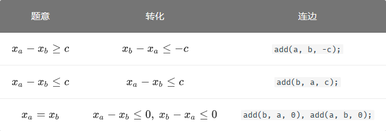

- 设 $d[i] = 0$ 并向每个节点连一条边，运行Bellman-Ford算法求**最短路/最长路**。

- 若检测负环，系统无解；否则，$x_i=d[i]$ 为该差分约束系统的一组解。 

```c++
struct Bellman_ford{
    struct Edge{   // 带权边
        int from, to, dist;
        Edge(int u, int v, int d): from(u), to(v), dist(d) {}
    };
    int n;  // n个节点，注意该模板从节点0开始计算(所有输入数据编号要进行预处理)
    vector<Edge> edges;    // edges具体保存边的信息
    vector<int> G[MAXN];   // 邻接表G中只保存edge的编号，在edges中查询
    bool inq[MAXN];        // 是否进入过队列
    int  cnt[MAXN];        // 负环检测计数
    int d[MAXN], p[MAXN];  // d表示s到各个点的距离，p表示最短路中的上一条弧
    Bellman_ford(int n) {  // 初始化
        this->n = n;
        _for(i, 0, n) G[i].clear();
        edges.clear();
    }
    void AddEdge(int from, int to, int dist){
        edges.push_back(Edge(from, to, dist));  // 压入边
        G[from].push_back(edges.size() - 1);  // 压入边号
    }
    
    bool bellman_ford(int s){    // 返回值表示从s出发是否能到达一个负环
        queue<int> Q;   // SPFA改进
        memset(inq, 0, sizeof(inq));
        memset(cnt, 0, sizeof(cnt));
        _for(i, 0, n) d[i] = -INF;                                // 最长路
        d[s] = 0;
        inq[s] = true; Q.push(s);
        while(!Q.empty()){
            int u = Q.front(); Q.pop();
            inq[u] = false;
            _for(i, 0, G[u].size()){
                Edge & e = edges[G[u][i]];
                if(d[u] < INF && d[e.to] < d[u] + e.dist) {       // 最长路
                    d[e.to] = d[u] + e.dist;
                    p[e.to] = G[u][i];
                    if(!inq[e.to]){
                        Q.push(e.to);
                        inq[e.to] = true;
                        if(++cnt[e.to] > n) return false;
                    }
                }
            }
        }
        return true;
    }
};

int main () {
    // freopen("OJ.in", "r", stdin);
    int n, m; cin >> n >> m;
    Bellman_ford B(n);
    _rep(i, 1, n) B.AddEdge(0, i, 0);   // 超级源点
    _for(i, 0, m){
        int a, b, c; cin >> a >> b>> c;
        B.AddEdge(a, b, -c);
    }

    if(! B.bellman_ford(0)) cout << "NO" <<endl;
    else{
        _rep(i, 1, n) cout << B.d[i] << " \n"[i == n];
    }
    return 0;

}
```

### Floyd算法 $O(n^3)$

全源最短路。允许负边权（**无负环**）。

```c++
#define INF  1000000007
#define _for(i,a,b) for(int i =(a); i < (b); ++i) // 循环宏
struct Edge{   // 带权边
    int from, to, dist;
    Edge(int u, int v, int d): from(u), to(v), dist(d) {}
};
int d[i][j];   // 保存结果
void Floyd_init(int n, int m){          // 初始化
    _for(i, 0, n)
         _for(j, 0, n)
         	d[i][j] = (i == j) ? 0 : INF;
    int from, to, dist;
    _for(i, 0, m){
        cin >> from >> to >> dist;
        d[from][to] = min(d[from][to], dist);
    }
}
void Floyd(int n){                      // O(n^3)
    _for(k, 0, n)
        _for(i, 0, n)
            _for(j, 0, n)
                if(d[i][j] < INF && d[k][j] < INF)
                    d[i][j] = min(d[i][j], d[i][k] + d[k][j]);
}
```

#### 最小环 $O(n^3)$

给出一个图，由 $n$ 个节点构成，问其中的边权和最小的环 $(n\geq 3)$ 是多大。

```c++
int val[maxn + 1][maxn + 1];  // 原图的邻接矩阵
inline int floyd(const int &n) {
    static int dis[maxn + 1][maxn + 1];  // 最短路矩阵
    for (int i = 1; i <= n; ++i)
        for (int j = 1; j <= n; ++j) dis[i][j] = val[i][j];  // 初始化最短路矩阵
    int ans = inf;
    for (int k = 1; k <= n; ++k) {
        for (int i = 1; i < k; ++i)
            for (int j = 1; j < i; ++j)
                ans = std::min(ans, dis[i][j] + val[i][k] + val[k][j]);  // 更新答案
        for (int i = 1; i <= n; ++i)
            for (int j = 1; j <= n; ++j)
                dis[i][j] = std::min(
                dis[i][j], dis[i][k] + dis[k][j]);  // 正常的 floyd 更新最短路矩阵
    }
    return ans;
}
```

### Johnson算法 $O(nelogn)$

全源最短路。将**负权图**转化为正权图。

> 我们新建一个**虚拟节点**（在这里我们就设它的编号为 0）。从这个点向其他所有点连一条边权为 0 的边。
>
> 接下来用 **Bellman-Ford** 算法求出从 0 号点到其他所有点的最短路，记为 $h_i$ 。
>
> 假如存在一条从 $u$ 点到 $v$ 点，边权为 $w$ 的边，则我们将该边的边权重新设置为 $w+h_u-h_v$ 。
>
> 接下来以每个点为起点，跑 n 轮 **Dijkstra** 算法即可求出任意两点间的最短路了。

```c++
struct Dijkstra{ /*...*/ };
struct Bellman_ford{ /*...*/ };

int d[MAXN][MAXN];   // 保存结果
void Johnson(){
    int n, m, s; cin >> n >> m >> s;
    
    Bellman_ford B(n);
    _for(i, 0, m){
        int from = readint() - 1, to = readint() - 1, w = readint();
        B.AddEdge(from, to, w);
    }
    B.bellman_ford(s);

    Dijkstra D(n);
    _for(i, 0, m){
        int& u = B.edges[i].from, v = B.edges[i].to, dist = B.edges[i].dist;
        D.AddEdge(u, v, dist + B.d[u] - B.d[v]);
    }
    
    _for(i, 0, n){
        D.dijkstra(i);
        _for(j, 0, n) d[i][j] = D.d[j];
    }
}
```

参考实现：

```c++
#include <cstring>
#include <iostream>
#include <queue>
#define INF 1e9
using namespace std;
struct edge
{
 int v,w,next;
}e[10005];
struct node
{
 int dis,id;
 bool operator<(const node&a)const
 {
  return dis>a.dis;
 }
 node(int d,int x)
 {
  dis=d,id=x;
 }
};
int head[5005],vis[5005],t[5005];
int cnt,n,m;
long long h[5005],dis[5005];
void addedge(int u,int v,int w)
{
 e[++cnt].v=v;
 e[cnt].w=w;
 e[cnt].next=head[u];
 head[u]=cnt;
}
bool spfa(int s)
{
 queue<int> q;
 memset(h,63,sizeof(h));
 h[s]=0,vis[s]=1;
 q.push(s);
 while(!q.empty())
 {
  int u=q.front();
  q.pop();
  vis[u]=0;
  for(int i=head[u];i;i=e[i].next)
  {
   int v=e[i].v;
   if(h[v]>h[u]+e[i].w)
   {
    h[v]=h[u]+e[i].w;
    if(!vis[v])
    {
     vis[v]=1;
     q.push(v);
     t[v]++;
     if(t[v]==n)return false;
    }
   }
  }
 }
 return true;
}
void dijkstra(int s)
{
 priority_queue<node> q;
 for(int i=1;i<=n;i++)
  dis[i]=INF;
 memset(vis,0,sizeof(vis));
 dis[s]=0;
 q.push(node(0,s));
 while(!q.empty())
 {
  int u=q.top().id;
  q.pop();
  if(vis[u])continue;
  vis[u]=1;
  for(int i=head[u];i;i=e[i].next)
  {
   int v=e[i].v;
   if(dis[v]>dis[u]+e[i].w)
   {
    dis[v]=dis[u]+e[i].w;
    if(!vis[v])q.push(node(dis[v],v));
   }
  }
 }
 return;
}
int main()
{
 ios::sync_with_stdio(false);
 cin>>n>>m;
 for(int i=1;i<=m;i++)
 {
  int u,v,w;
  cin>>u>>v>>w;
  addedge(u,v,w);
 }
 for(int i=1;i<=n;i++)
  addedge(0,i,0);
 if(!spfa(0))
 {
  cout<<-1<<endl;
  return 0;
 }
 /*
 for(int i=1;i<=n;i++)
  cout<<h[i]<<' ';
 cout<<endl;
 */
 for(int u=1;u<=n;u++)
  for(int i=head[u];i;i=e[i].next)
   e[i].w+=h[u]-h[e[i].v];
 for(int i=1;i<=n;i++)
 {
  dijkstra(i);
  long long ans=0;
  for(int j=1;j<=n;j++)
  {
   if(dis[j]==INF)ans+=j*INF;
   else ans+=j*(dis[j]+h[j]-h[i]);
  }
  cout<<ans<<endl;
 }
 return 0;
}
```

### 仙人掌最短路 $O(qlogn)$

任意一条边至多只出现在一条简单回路的无向连通图称为仙人掌。给你一个有 n 个点和 m 条边的仙人掌图，和 q 组询问，每次询问两个点 u,v，求两点之间的最短路。

```c++
#pragma GCC target("avx,sse2,sse3,sse4,popcnt")
#pragma GCC optimize("O2,Ofast,inline,unroll-all-loops,-ffast-math")
#include<bits/stdc++.h>
#define N 10005
#define M 80005
using namespace std;

inline void rd(int &X){
    X=0;char ch=0;
    while(!isdigit(ch))ch=getchar();
    while( isdigit(ch))X=(X<<3)+(X<<1)+(ch^48),ch=getchar();
}

int n,m,q,cnt=1,tot,num;
int head[N],dis[N],v[N];
struct nd{int nxt,to,v;}e[M];
int d[N],Dis[N],vis[M],pre[N],sum[M],c[N],f[N][15];
#define For(x) for(int y,i=head[x];(y=e[i].to);i=e[i].nxt)

inline void add(int x,int y,int v){
    e[++cnt]={head[x],y,v};head[x]=cnt;
    e[++cnt]={head[y],x,v};head[y]=cnt;
}

void SPFA(){
    queue<int> q;q.push(1);
    memset(dis,0x3f,sizeof dis);dis[1]=dis[0]=0;
    while(q.size()){
        int x=q.front();q.pop();v[x]=0;
        For(x) if(dis[y]>dis[x]+e[i].v){
            dis[y]=dis[x]+e[i].v;
            if(!v[y]) v[y]=1,q.push(y);
        }
    }
}
void work(int x,int rt){
    if(x==rt) return ;
    add(rt,x,0);vis[pre[x]]=vis[pre[x]^1]=1;
    sum[num]+=e[pre[x]].v;c[x]=num;work(e[pre[x]^1].to,rt);
}
void dfs(int x){
    v[x]=++tot;
    For(x) if(i^pre[x]^1)
        if(!v[y]) pre[y]=i,Dis[y]=Dis[x]+e[i].v,dfs(y);
        else if(v[y]<v[x]) {
            sum[++num]=e[i].v;
            vis[i]=vis[i^1]=1; work(x,y);
        }
}
void dfs2(int x){
    for(int i=1;i<=14;i++)
        f[x][i]=f[f[x][i-1]][i-1];
    For(x) if(!vis[i] and y!=f[x][0])
        d[y]=d[x]+1,f[y][0]=x,dfs2(y);
}
int ask(int x=0,int y=0){
    rd(x);rd(y);
    if(d[x]<d[y]) swap(x,y);
    int X=x,Y=y;
    for(int i=14;~i;i--)
        if(d[f[x][i]]>=d[y])
            x=f[x][i];
    if(x==y) return dis[X]-dis[Y];
    for(int i=14;~i;i--)
        if(f[x][i]!=f[y][i])
            x=f[x][i],y=f[y][i];
    if(c[x] and c[x]==c[y]){
        int now=sum[c[x]],L=abs(Dis[x]-Dis[y]);
        return min(L,now-L)+dis[X]-dis[x]+dis[Y]-dis[y];
    }return dis[X]+dis[Y]-2*dis[f[x][0]];
}
signed main(){
    rd(n);rd(m);rd(q);
    for(int x,y,v,i=1;i<=m;i++)
        rd(x),rd(y),rd(v),add(x,y,v);
    SPFA();dfs(1);dfs2(1);
    while(q--) printf("%d\n",ask());
}
```

### k短路

给定一个有 $n$ 个结点，$m$ 条边的有向图，求从 $s$ 到 $t$ 的所有不同路径中的第 $k$ 短路径的长度。

#### A*算法求k短路 $O(nklogn)$

```c++
#include <algorithm>
#include <cstdio>
#include <cstring>
#include <queue>
using namespace std;
const int maxn = 5010;
const int maxm = 400010;
const int inf = 2e9;
int n, m, s, t, k, u, v, ww, H[maxn], cnt[maxn];
int cur, h[maxn], nxt[maxm], p[maxm], w[maxm];
int cur1, h1[maxn], nxt1[maxm], p1[maxm], w1[maxm];
bool tf[maxn];
void add_edge(int x, int y, double z) {
  cur++;
  nxt[cur] = h[x];
  h[x] = cur;
  p[cur] = y;
  w[cur] = z;
}
void add_edge1(int x, int y, double z) {
  cur1++;
  nxt1[cur1] = h1[x];
  h1[x] = cur1;
  p1[cur1] = y;
  w1[cur1] = z;
}
struct node {
  int x, v;
  bool operator<(node a) const { return v + H[x] > a.v + H[a.x]; }
};
priority_queue<node> q;
struct node2 {
  int x, v;
  bool operator<(node2 a) const { return v > a.v; }
} x;
priority_queue<node2> Q;
int main() {
  scanf("%d%d%d%d%d", &n, &m, &s, &t, &k);
  while (m--) {
    scanf("%d%d%d", &u, &v, &ww);
    add_edge(u, v, ww);
    add_edge1(v, u, ww);
  }
  for (int i = 1; i <= n; i++) H[i] = inf;
  Q.push({t, 0});
  while (!Q.empty()) {
    x = Q.top();
    Q.pop();
    if (tf[x.x]) continue;
    tf[x.x] = true;
    H[x.x] = x.v;
    for (int j = h1[x.x]; j; j = nxt1[j]) Q.push({p1[j], x.v + w1[j]});
  }
  q.push({s, 0});
  while (!q.empty()) {
    node x = q.top();
    q.pop();
    cnt[x.x]++;
    if (x.x == t && cnt[x.x] == k) {
      printf("%d\n", x.v);
      return 0;
    }
    if (cnt[x.x] > k) continue;
    for (int j = h[x.x]; j; j = nxt[j]) q.push({p[j], x.v + w[j]});
  }
  printf("-1\n");
  return 0;
}
```

#### 可持久化可并堆优化 k 短路算法 $O(nlogm)$

```c++
#include <algorithm>
#include <cstdio>
#include <cstring>
#include <queue>
using namespace std;
const int maxn = 200010;
int n, m, s, t, k, x, y, ww, cnt, fa[maxn];
struct Edge {
  int cur, h[maxn], nxt[maxn], p[maxn], w[maxn];
  void add_edge(int x, int y, int z) {
    cur++;
    nxt[cur] = h[x];
    h[x] = cur;
    p[cur] = y;
    w[cur] = z;
  }
} e1, e2;
int dist[maxn];
bool tf[maxn], vis[maxn], ontree[maxn];
struct node {
  int x, v;
  node* operator=(node a) {
    x = a.x;
    v = a.v;
    return this;
  }
  bool operator<(node a) const { return v > a.v; }
} a;
priority_queue<node> Q;
void dfs(int x) {
  vis[x] = true;
  for (int j = e2.h[x]; j; j = e2.nxt[j])
    if (!vis[e2.p[j]])
      if (dist[e2.p[j]] == dist[x] + e2.w[j])
        fa[e2.p[j]] = x, ontree[j] = true, dfs(e2.p[j]);
}
struct LeftistTree {
  int cnt, rt[maxn], lc[maxn * 20], rc[maxn * 20], dist[maxn * 20];
  node v[maxn * 20];
  LeftistTree() { dist[0] = -1; }
  int newnode(node w) {
    cnt++;
    v[cnt] = w;
    return cnt;
  }
  int merge(int x, int y) {
    if (!x || !y) return x + y;
    if (v[x] < v[y]) swap(x, y);
    int p = ++cnt;
    lc[p] = lc[x];
    v[p] = v[x];
    rc[p] = merge(rc[x], y);
    if (dist[lc[p]] < dist[rc[p]]) swap(lc[p], rc[p]);
    dist[p] = dist[rc[p]] + 1;
    return p;
  }
} st;
void dfs2(int x) {
  vis[x] = true;
  if (fa[x]) st.rt[x] = st.merge(st.rt[x], st.rt[fa[x]]);
  for (int j = e2.h[x]; j; j = e2.nxt[j])
    if (fa[e2.p[j]] == x && !vis[e2.p[j]]) dfs2(e2.p[j]);
}
int main() {
  scanf("%d%d%d%d%d", &n, &m, &s, &t, &k);
  for (int i = 1; i <= m; i++)
    scanf("%d%d%d", &x, &y, &ww), e1.add_edge(x, y, ww), e2.add_edge(y, x, ww);
  Q.push({t, 0});
  while (!Q.empty()) {
    a = Q.top();
    Q.pop();
    if (tf[a.x]) continue;
    tf[a.x] = true;
    dist[a.x] = a.v;
    for (int j = e2.h[a.x]; j; j = e2.nxt[j]) Q.push({e2.p[j], a.v + e2.w[j]});
  }
  if (k == 1) {
    if (tf[s])
      printf("%d\n", dist[s]);
    else
      printf("-1\n");
    return 0;
  }
  dfs(t);
  for (int i = 1; i <= n; i++)
    if (tf[i])
      for (int j = e1.h[i]; j; j = e1.nxt[j])
        if (!ontree[j])
          if (tf[e1.p[j]])
            st.rt[i] = st.merge(
                st.rt[i],
                st.newnode({e1.p[j], dist[e1.p[j]] + e1.w[j] - dist[i]}));
  for (int i = 1; i <= n; i++) vis[i] = false;
  dfs2(t);
  if (st.rt[s]) Q.push({st.rt[s], dist[s] + st.v[st.rt[s]].v});
  while (!Q.empty()) {
    a = Q.top();
    Q.pop();
    cnt++;
    if (cnt == k - 1) {
      printf("%d\n", a.v);
      return 0;
    }
    if (st.lc[a.x])
      Q.push({st.lc[a.x], a.v - st.v[a.x].v + st.v[st.lc[a.x]].v});
    if (st.rc[a.x])
      Q.push({st.rc[a.x], a.v - st.v[a.x].v + st.v[st.rc[a.x]].v});
    x = st.rt[st.v[a.x].x];
    if (x) Q.push({x, a.v + st.v[x].v});
  }
  printf("-1\n");
  return 0;
}
```

## 连通分量

### 强连通分量

有向图 G 强连通是指，G 中任意两个结点连通。

#### Tarjan 算法 $O(n+m)$

```c++
int dfn[N], low[N], dfncnt, s[N], in_stack[N], tp;
int scc[N], sc;  // 结点 i 所在 scc 的编号
int sz[N];       // 强连通 i 的大小
void tarjan(int u) {
  low[u] = dfn[u] = ++dfncnt, s[++tp] = u, in_stack[u] = 1;
  for (int i = h[u]; i; i = e[i].nex) {
    const int &v = e[i].t;
    if (!dfn[v]) {
      tarjan(v);
      low[u] = min(low[u], low[v]);
    } else if (in_stack[v]) {
      low[u] = min(low[u], dfn[v]);
    }
  }
  if (dfn[u] == low[u]) {
    ++sc;
    while (s[tp] != u) {
      scc[s[tp]] = sc;
      sz[sc]++;
      in_stack[s[tp]] = 0;
      --tp;
    }
    scc[s[tp]] = sc;
    sz[sc]++;
    in_stack[s[tp]] = 0;
    --tp;
  }
}
```

#### Kosaraju 算法 $O(n+m)$

Kosaraju 算法依靠两次简单的 DFS 实现。

第一次 DFS，选取任意顶点作为起点，遍历所有未访问过的顶点，并在回溯之前给顶点编号，也就是后序遍历。

第二次 DFS，对于反向后的图，以标号最大的顶点作为起点开始 DFS。这样遍历到的顶点集合就是一个强连通分量。对于所有未访问过的结点，选取标号最大的，重复上述过程。

两次 DFS 结束后，强连通分量就找出来了，Kosaraju 算法的时间复杂度为  $O(n+m)$。

```c++
// g 是原图，g2 是反图

void dfs1(int u) {
  vis[u] = true;
  for (int v : g[u])
    if (!vis[v]) dfs1(v);
  s.push_back(u);
}

void dfs2(int u) {
  color[u] = sccCnt;
  for (int v : g2[u])
    if (!color[v]) dfs2(v);
}

void kosaraju() {
  sccCnt = 0;
  for (int i = 1; i <= n; ++i)
    if (!vis[i]) dfs1(i);
  for (int i = n; i >= 1; --i)
    if (!color[s[i]]) {
      ++sccCnt;
      dfs2(s[i]);
    }
}
```

### 双连通分量

在无向连通图中，如果将其中一个点以及所有连接该点的边去掉，图就不再连通，那么这个点就叫做割点（cut vertex / articulation point）。若不存在割点，称图双连通。

#### 割点

> **输入格式**
>
> - 第一行输入两个正整数 n,m。
> - 下面 m 行每行输入两个正整数 x,y 表示 x 到 y 有一条边。
>
> **输出格式**
>
> - 第一行输出割点个数。
> - 第二行按照节点编号从小到大输出割点，用空格隔开。

```c++
/*
洛谷 P3388 【模板】割点（割顶）
*/
#include <bits/stdc++.h>
using namespace std;
int n, m;  // n：点数 m：边数
int num[100001], low[100001], inde, res;
// num：记录每个点的时间戳
// low：能不经过父亲到达最小的编号，inde：时间戳，res：答案数量
bool vis[100001], flag[100001];  // flag: 答案 vis：标记是否重复
vector<int> edge[100001];        // 存图用的
void Tarjan(int u, int father)  // u 当前点的编号，father 自己爸爸的编号
{
  vis[u] = true;             // 标记
  low[u] = num[u] = ++inde;  // 打上时间戳
  int child = 0;             // 每一个点儿子数量
  for (auto v : edge[u])     // 访问这个点的所有邻居 （C++11）
  {
    if (!vis[v]) {
      child++;                       // 多了一个儿子
      Tarjan(v, u);                  // 继续
      low[u] = min(low[u], low[v]);  // 更新能到的最小节点编号
      if (father != u && low[v] >= num[u] &&
          !flag
              [u])  // 主要代码
                    // 如果不是自己，且不通过父亲返回的最小点符合割点的要求，并且没有被标记过
                    // 要求即为：删了父亲连不上去了，即为最多连到父亲
      {
        flag[u] = true;
        res++;  // 记录答案
      }
    } else if (v != father)
      low[u] =
          min(low[u], num[v]);  // 如果这个点不是自己，更新能到的最小节点编号
  }
  if (father == u && child >= 2 &&
      !flag[u])  // 主要代码，自己的话需要 2 个儿子才可以
  {
    flag[u] = true;
    res++;  // 记录答案
  }
}
int main() {
  cin >> n >> m;                // 读入数据
  for (int i = 1; i <= m; i++)  // 注意点是从 1 开始的
  {
    int x, y;
    cin >> x >> y;
    edge[x].push_back(y);
    edge[y].push_back(x);
  }                             // 使用 vector 存图
  for (int i = 1; i <= n; i++)  // 因为 Tarjan 图不一定连通
    if (!vis[i]) {
      inde = 0;      // 时间戳初始为 0
      Tarjan(i, i);  // 从第 i 个点开始，父亲为自己
    }
  cout << res << endl;
  for (int i = 1; i <= n; i++)
    if (flag[i]) cout << i << " ";  // 输出结果
  return 0;
}

```

#### 桥/割边

下面代码实现了求割边，其中，当 `isbridge[x]` 为真时， `(father[x],x)` 为一条割边。

```c++
int low[MAXN], dfn[MAXN], iscut[MAXN], dfs_clock;
bool isbridge[MAXN];
vector<int> G[MAXN];
int cnt_bridge;
int father[MAXN];

void tarjan(int u, int fa) {
  father[u] = fa;
  low[u] = dfn[u] = ++dfs_clock;
  for (int i = 0; i < G[u].size(); i++) {
    int v = G[u][i];
    if (!dfn[v]) {
      tarjan(v, u);
      low[u] = min(low[u], low[v]);
      if (low[v] > dfn[u]) {
        isbridge[v] = true;
        ++cnt_bridge;
      }
    } else if (dfn[v] < dfn[u] && v != fa) {
      low[u] = min(low[u], dfn[v]);
    }
  }
}
```

## 拓扑排序 $O(e)$

> 图必须满足是DAG。

核心思想：不断获取零入度的点。

```c++
struct TopologySort{
    vector<int> G[MAXN];
    int inDegree[MAXN];    // 入度
    bool sortable;  // 是否可拓扑排序
    vector<int> topology;   // 保存拓扑排序序列
    TopologySort(): sortable(false) {}
    void input_graph(int n, int m){  // 如果输入有重，要先去重
        int from, to;
        while(m--){   // 注意是否从1序号开始编号
            cin >> from >> to;
            G[from - 1].push_back(to - 1);
            inDegree[to - 1]++;
        }
    }
    bool topologicalSort(int n){
        queue<int> Q;    // 换成优先队列则可以保证最小序的拓扑排序序列
        // priority_queue<int, vector<int>, greater<int> > Q;
        topology.clear();
        _for(i, 0, n)
            if(inDegree[i] == 0)
                Q.push(i);
        int num = 0;    // 拓扑排序顶点个数
        while(!Q.empty()){
            int u = Q.front(); Q.pop(); num++;
            // int u = Q.top(); Q.pop(); num++;
            topology.push_back(u);
            _for(i, 0, G[u].size()){
                int v = G[u][i];
                inDegree[v]--;
                if(inDegree[v] == 0) Q.push(v);
            }
        }
        return sortable = (num == n);   // 是否可拓扑排序
    }
};

TopologySort t;
int main(){
    int n, m; cin >> n >> m;
    
    t.input_graph(n, m);
    t.topologicalSort(n);
    _for(i, 0, n)
        cout << t.topology[i]+1 <<" \n"[i == n - 1];
    
    return 0;
}
```

> 若入度为0的点**唯一**，还可以确定“**冠军**”（每条边看作一场比赛）。

## 关键路径

计算每个活动的最早开始时间和最晚开始时间。两者相等的活动称为关键活动。

> > 注意：权值都放在了边上。
>
> 保证单源点/单汇点，如不满足则增加超级源点/超级汇点，分别连接所有源点/汇点。

```c++
struct Edge{   // 带权边
    int from, to, dist;
    Edge(int u, int v, int d): from(u), to(v), dist(d) {}
};
vector<Edge> edges;    // edges具体保存边的信息
vector<int> G[MAXN];   // 邻接表G中只保存edge的编号，在edges中查询
int inDegree[MAXN];   // 入度
void AddEdge(int from, int to, int dist){  // 注意序号从0还是1开始！
    edges.push_back(Edge(from, to, dist));  // 压入边
    G[from].push_back(edges.size() - 1);  // 压入边号
    inDegree[to] ++;
}

ll earliest[MAXN], latest[MAXN];  // 保存结果，节点i的最早/最晚开始时间
void criticalPath(int n, int m){
    vector<int> topology;
    queue<int> Q;
    _for(i, 0, n)
        if(inDegree[i] == 0){
            Q.push(i);
            earliest[i] = 0;  // 如无特殊源点，初始化为0
        }
    while(!Q.empty()){   // 拓扑排序
        int u = Q.front(); Q.pop();
        topology.push_back(u);
        _for(i, 0, G[u].size()){
            int v = edges[G[u][i]].to, d = edges[G[u][i]].dist;
            earliest[v] = max(earliest[v], earliest[u] + d);  // 更新
            inDegree[v] --;
            if(inDegree[v] == 0) Q.push(v);
        }
    }
    for(int i = topology.size() - 1; i >= 0; --i){  // 反向遍历
        int u = topology[i];
        if(G[u].size() == 0){
            latest[u] = earliest[u];   // 汇点的最晚开始时间初始化
        } else{
            latest[u] = INF;           // 非汇点的最晚开始时间初始化
        }
        _for(j, 0, G[u].size()){
            int v = edges[G[u][j]].to, d = edges[G[u][j]].dist;
            latest[u] = min(latest[u], latest[v] - d);  // 更新
        }
    }
}

int main(){
    int n, m; cin >> n >> m;
    vector<int> a; _for(i, 0, n) a.push_back(readint());
    _for(i, 0, m){
        int from = readint() - 1, to = readint() - 1;
        AddEdge(from, to, a[to]);
    }
    _for(i, 0, n){  // 如果增加超级源点，则本来的各源点的earliest值会被高估！！！此时可以通过备份inDegree数组，在运行完criticalPath对所有本来的源点的earliest/latest值修改
        AddEdge(n, i, a[i]);  // 超级源点
        AddEdge(i, n + 1, 0);  // 超级汇点
    }
    
    bool inDegree_0[MAXN];
    _for(i, 0, n) inDegree_0[i] = (inDegree[i]  == 1);  // 备份inDegree数组
    
    criticalPath(n + 2, m);
    
    _for(i, 0, G[n].size())
        if(inDegree_0[i]){   // i是原来的源点
            earliest[edges[G[n][i]].to] -= a[i];
            latest[edges[G[n][i]].to]   -= a[i];
        }
    
    ll ret = 1;
    _for(i, 0, n)
        cout << earliest[i] << " " << latest[i] << endl;
    _for(i, 0, n){
        ret *= (latest[i] - earliest[i] + 1); ret %= MOD;
    }
    ll max_latest = 0;
    _for(i, 0, n) max_latest = max(max_latest, latest[i]);
    cout << max_latest << endl;
    cout << ret << endl;
    
    return 0;
}
```

## 欧拉回路/欧拉通路

计算一个无向图的欧拉回路或欧拉通路。

> 给定一张有 500 个顶点的无向图，求这张图的一条欧拉路或欧拉回路。如果有多组解，输出最小的那一组。
>
> 在本题中，欧拉路或欧拉回路不需要经过所有顶点。

```c++
#include <algorithm>
#include <cstdio>
#include <stack>
#include <vector>
using namespace std;

struct edge {
    int to;
    bool exists;
    int revref;

    bool operator<(const edge& b) const { return to < b.to; }
};

vector<edge> beg[505];
int cnt[505];

const int dn = 500;
stack<int> ans;

void Hierholzer(int x)  // 关键函数
{
    for (int& i = cnt[x]; i < (int)beg[x].size();) {
        if (beg[x][i].exists) {
            edge e = beg[x][i];
            beg[x][i].exists = 0;
            beg[e.to][e.revref].exists = 0;
            ++i;
            Hierholzer(e.to);
        } else {
            ++i;
        }
    }
    ans.push(x);
}

int deg[505];
int reftop[505];

int main() {
    for (int i = 1; i <= dn; ++i) {
        beg[i].reserve(1050);  // vector 用 reserve 避免动态分配空间，加快速度
    }

    int m;
    scanf("%d", &m);              // 【点数】
    for (int i = 1; i <= m; ++i) {
        int a, b;
        scanf("%d%d", &a, &b);    // 【连边】（无向图）
        beg[a].push_back((edge){b, 1, 0});
        beg[b].push_back((edge){a, 1, 0});
        ++deg[a];
        ++deg[b];
    }

    for (int i = 1; i <= dn; ++i) {
        if (!beg[i].empty()) {
            sort(beg[i].begin(), beg[i].end());  // 为了要按字典序贪心，必须排序
        }
    }

    for (int i = 1; i <= dn; ++i) {
        for (int j = 0; j < (int)beg[i].size(); ++j) {
            beg[i][j].revref = reftop[beg[i][j].to]++;
        }
    }

    int bv = 0;
    for (int i = 1; i <= dn; ++i) {
        if (!deg[bv] && deg[i]) {
            bv = i;
        } else if (!(deg[bv] & 1) && (deg[i] & 1)) {
            bv = i;
        }
    }

    Hierholzer(bv);

    while (!ans.empty()) {
        printf("%d\n", ans.top());
        ans.pop();
    }
}
```

## 网络流

### 最大流

> 若节点也有流量限制，可拆点（`A`拆为`A1 --> A2`，流量限制转移到边上），从而转化为纯最大流。

#### Edmond-Karp算法 $O(nm^2)$

```c++
struct Edge{
    int from, to, cap, flow;   // cap: 容量; flow: 流量
    Edge(int u, int v, int c, int f = 0): from(u), to(v), cap(c), flow(f) {}
};
vector<Edge> edges;
vector<int> G[MAXN];

int a[MAXN];   // 当起点到i的可改进量
int p[MAXN];   // 最短路树上p的入弧编号
struct EdmondKarp{
    int n, m;
    EdmondKarp(int N){
        n = N; edges.clear();
        _for(i, 0, n) G[i].clear();
    }
    void AddEdge(int from, int to, int cap){  // 注意序号从0还是1开始！
        edges.push_back(Edge(from, to, cap));
        edges.push_back(Edge(to, from,   0));  // 反向弧
        m = edges.size();
        G[from].push_back(m - 2);
        G[  to].push_back(m - 1);
    }
    int maxFlow(int s, int t){   // 增广路算法
        int flow = 0;
        while(1){
            memset(a, 0, sizeof(a));
            queue<int> Q; Q.push(s);
            a[s] = INF;
            while(!Q.empty()){
                int x = Q.front(); Q.pop();
                _for(i, 0, G[x].size()){
                    Edge& e = edges[G[x][i]];
                    if(!a[e.to] && e.cap > e.flow){
                        p[e.to] = G[x][i];
                        a[e.to] = min(a[x], e.cap - e.flow);
                        Q.push(e.to);
                    }
                }
                if(a[t]) break;
            }
            if(!a[t]) break;
            for(int u = t; u != s; u = edges[p[u]].from){
                edges[p[u]].flow += a[t];
                edges[p[u]^1].flow -= a[t];
            }
            flow += a[t];
        }
        return flow;
    }
};

int main() {
    int n, m; cin >> n >> m;  // 点的个数、有向边的个数
    int s, t; cin >> s >> t;  // 源点序号、汇点序号
    EdmondKarp e(n);
    _for(i, 0, m){
        int from, to, cap; cin >> from >> to >> cap;
        e.AddEdge(from, to, cap);
    }
    cout << e.maxFlow(s, t)<<endl;

    return 0;
}
```

#### Dinic算法 $O(n^2m)$

所有容量为1时Dinic算法复杂度为$O(\text{min}(n^{2/3}, \sqrt m)\times m)$，对于二分图，则为$O(\sqrt n m)$。

> 最大流 = 最小割，若每条边容量均为1，则等价于返回割边数量。

```c++
inline int read(){   // 快速读入
    int x=0,f=1;char ch=getchar();
    while (!isdigit(ch)){if (ch=='-') f=-1;ch=getchar();}
    while (isdigit(ch)){x=x*10+ch-48;ch=getchar();}
    return x*f;
}

struct Edge{
    int from, to, cap, flow;   // cap: 容量; flow: 流量
    Edge(int u, int v, int c, int f = 0): from(u), to(v), cap(c), flow(f) {}
};
vector<Edge> edges;
vector<int> G[MAXN];
bool vis[MAXN];         // BFS使用
int d[MAXN];            // 从起点到i的距离
int a[MAXN];            // 可改进量
int cur[MAXN];          // 当前弧下标
struct Dinic{
    int n, m, s, t;
    Dinic(int N){
        n = N; edges.clear();
        _for(i, 0, n) G[i].clear();
    }
    int Maxflow(int S, int T){
        int flow = 0; s = S; t = T;
        while(BFS()){
            memset(cur, 0, sizeof(cur));
            flow += DFS(s, INF);
        }
        return flow;
    }
    void AddEdge(int from, int to, int cap){  // 注意序号从0还是1开始！
        edges.push_back(Edge(from, to, cap));
        edges.push_back(Edge(to, from,   0));  // 反向弧
        m = edges.size();
        G[from].push_back(m - 2);
        G[  to].push_back(m - 1);
    }
    bool BFS(){
        memset(vis, 0, sizeof(vis));
        queue<int> Q; Q.push(s);
        d[s] = 0; vis[s] = 1;
        while(!Q.empty()){
            int x = Q.front(); Q.pop();
            _for(i, 0, G[x].size()){
                Edge& e = edges[G[x][i]];
                if(!vis[e.to] && e.cap > e.flow){
                    vis[e.to] = 1;
                    d[e.to] = d[x] + 1;
                    Q.push(e.to);
                }
            }
        }
        return vis[t];
    }
    int DFS(int x, int a){
        if(x == t || a == 0) return a;
        int flow = 0, f;
        for(int& i = cur[x]; i < G[x].size(); ++i){
            Edge& e = edges[G[x][i]];
            if(d[x] + 1 == d[e.to] && (f = DFS(e.to, min(a, e.cap-e.flow))) > 0){
                e.flow += f;
                edges[G[x][i] ^ 1].flow -= f;
                flow += f;
                a    -= f;
                if(a == 0) break;
            }
        }
        return flow;
    }
};

int main() {
    int n = read(), m = read();  // 点的个数、有向边的个数
    int s = read(), t = read();  // 源点序号、汇点序号
    Dinic dinic(n);
    _for(i, 0, m){
        int from = read(), to = read(), cap = read();
        dinic.AddEdge(from, to, cap);
    }
    cout << dinic.Maxflow(s, t);
    return 0;
}
```

#### 预流推进算法 HLPP $O(n\sqrt m)$

```c++
#include<bits/stdc++.h>
#define up(l,r,i) for(register int i=l;i<=r;++i)
#define ergv(u) for(std::vector<edge>::iterator p=head[u].begin();p!=head[u].end();++p)
#define ergl(u) for(std::list<int>::iterator p=lst[u].begin();p!=lst[u].end();++p)
const int INF =2147483647;
const int MAXN = 1200+3,MAXM =120000+3;
int n,m,s,t,mxflow,hst,nwh;
std::vector<int> lft,gap,ht,q,mlst[MAXN];
struct edge{    //边
    int ver,nxt,flw;
    edge(int _ver,int _flw,int _nxt):
    ver(_ver),flw(_flw),nxt(_nxt){}
};
std::vector <edge> head[MAXN];
std::list   <int > lst[MAXN];
std::vector <std::list<int>::iterator> it;
const int SIZ =100000 +3;
char buf1[SIZ];
char *p1=buf1,*p2=buf1;
inline char readchar(){ //快速读入字符
    if(p1==p2)p1=buf1,p2=buf1+fread(buf1,1,SIZ,stdin);
    return p1==p2?EOF:*p1++;
}
inline int qread(){     //快读
    int ret,c;
    while((c=readchar())> '9'||c< '0');ret=c-'0';
    while((c=readchar())>='0'&&c<='9')ret=ret*10+c-'0';
    return ret;
}
inline void add(){      //连边
    int u=qread(),v=qread(),k=qread();
    head[u].push_back(edge(v,k,head[v].size()  ));
    head[v].push_back(edge(u,0,head[u].size()-1));
}
inline void rlb(){      //全局冲贴标签
    ht.assign(n+3,n),gap.assign(n+3,0),ht[t]=0;
    q.clear(),q.resize(n+3);
    int front=0,rear=0,u;
    for(q[rear++]=t;front<rear;){
        u=q[front++];
        ergv(u) if(ht[p->ver]==n&&head[p->ver][p->nxt].flw)
        ++gap[ht[p->ver]=ht[u]+1],q[rear++]=p->ver;
    }
    up(1,n,i) mlst[i].clear(),lst[i].clear();
    up(1,n,i) if(ht[i]<n){
        it[i]=lst[ht[i]].insert(lst[ht[i]].begin(),i);
        if(lft[i]>0) mlst[ht[i]].push_back(i);
    }
    hst=(nwh=ht[q[rear-1]]);
}
inline void psh(int u,edge &e){ //推流子函数
    int v=e.ver,df=std::min(lft[u],e.flw);
    e.flw-=df,head[v][e.nxt].flw+=df,lft[u]-=df,lft[v]+=df;
    if(lft[v]>0&&lft[v]<=df) mlst[ht[v]].push_back(v);
}
inline void psh(int u){         //真正的推流
    int nh=n,htu=ht[u];
    ergv(u)if(p->flw) if(ht[u]==ht[p->ver]+1){
            psh(u,*p); if(lft[u]<=0) return;
        } else nh=std::min(nh,ht[p->ver]+1);
    if(gap[htu]==1){          //断层
        up(htu,hst,i){
            ergl(i) --gap[ht[*p]],ht[*p]=n;
            lst[i].clear();
        }
        hst=htu-1;
    }else{
        --gap[htu],it[u]=lst[htu].erase(it[u]),ht[u]=nh;
        if(nh==n) return;
        gap[nh]++,it[u]=lst[nh].insert(lst[nh].begin(),u);
        hst=std::max(hst,nwh=nh),mlst[nh].push_back(u);
    }
}
inline int HLPP(){
    nwh=hst=0,ht.assign(n+3,0),ht[s]=n,it.resize(n+3);
    up(1,n,i) if(i!=s)it[i]=lst[ht[i]].insert(lst[ht[i]].begin(),i);
    gap.assign(n+3,0),gap[0]=n-1,lft.assign(n+3,0),lft[s]=INF,lft[t]=-INF;
    ergv(s) psh(s,*p);rlb();
    for(int u;nwh;){ 
        if(mlst[nwh].empty()) nwh--; else
        u=mlst[nwh].back(),mlst[nwh].pop_back(),psh(u);
    }
    return lft[t]+INF;
}
int main(){
    n=qread(),m=qread(),s=qread(),t=qread();
    up(1,m,i) add();
    std::printf("%d\n",HLPP());
    return 0;
}
```

### 全局最小割

#### Stoer-Wagner 算法

定义无向图 G 的最小割为：一个去掉后可以使 G 变成两个连通分量，且边权和最小的边集的边权和。

给出一张无向图 G，求其最小割。

> 两个顶点s、t，要么在全局最小割的同一个集合中，要么在不同的集合中。因此分情况讨论即可：
>
>  step1：在图*G*中找出任意*s*−*t*最小割*cut-of-the-phase*
>  step2：合并*s*、*t*，重复执行step1直到图G只剩下一个顶点
>  step3：输出最小的*cut-of-the-phase*为最终结果

```c++
#include <bits/stdc++.h>
using namespace std;
const int MAXN=610,INF=1e9;
int n,m,x,y,z,s,t,dis[MAXN][MAXN],w[MAXN],dap[MAXN],vis[MAXN],ord[MAXN];
int proc (int x) {
	memset(vis,0,sizeof(vis));
	memset(w,0,sizeof(w));
	w[0]=-1;
	for (int i=1;i<=n-x+1;i++) {
		int mx=0;
		for (int j=1;j<=n;j++) {
			if (!dap[j]&&!vis[j]&&w[j]>w[mx]) {mx=j;}
		}
		vis[mx]=1,ord[i]=mx;
		for (int j=1;j<=n;j++) {
			if (!dap[j]&&!vis[j]) {w[j]+=dis[mx][j];}
		}
	}
	s=ord[n-x],t=ord[n-x+1];
	return w[t];
}
int sw () {
	int res=INF;
	for (int i=1;i<n;i++) {
		res=min(res,proc(i));
		dap[t]=1;
		for (int j=1;j<=n;j++) {
			dis[s][j]+=dis[t][j];
			dis[j][s]+=dis[j][t];
		}
	}
	return res;
}
int main () {
	scanf("%d%d",&n,&m);
	for (int i=1;i<=m;i++) {
		scanf("%d%d%d",&x,&y,&z);
		dis[x][y]+=z,dis[y][x]+=z;
	}
	printf("%d\n",sw());
	return 0;
}
```

### 最小费用最大流

#### SPFA法*

```c++
inline int read(){   // 快速读入
    int x=0,f=1;char ch=getchar();
    while (!isdigit(ch)){if (ch=='-') f=-1;ch=getchar();}
    while (isdigit(ch)){x=x*10+ch-48;ch=getchar();}
    return x*f;
}

struct Edge{
    int from, to, cap, flow, cost;   // cap: 容量; flow: 流量; cost: 费用
    Edge(int u, int v, int c, int f, int w): from(u), to(v), cap(c), flow(f), cost(w) {}
};
vector<Edge> edges;
vector<int> G[MAXN];
bool inq[MAXN];         // 是否进入过队列
int d[MAXN];            // bellman-ford
int a[MAXN];            // 可改进量
int p[MAXN];            // 上一条弧
struct MCMF{
    int n, m;
    MCMF(int N){
        n = N; edges.clear();
        _for(i, 0, n) G[i].clear();
    }
    int MincostMaxflow(int s, int t, long long& cost){
        int flow = 0; cost = 0;
        while(spfa(s, t, flow, cost));
        return flow;
    }
    void AddEdge(int from, int to, int cap, int cost){  // 注意序号从0还是1开始！
        edges.push_back(Edge(from, to, cap, 0, cost));
        edges.push_back(Edge(to, from,   0, 0,-cost));  // 反向弧
        m = edges.size();
        G[from].push_back(m - 2);
        G[  to].push_back(m - 1);
    }
    bool spfa(int s, int t, int& flow, long long& cost){
        queue<int> Q;   // SPFA改进
        memset(inq, 0, sizeof(inq));
        _for(i, 0, n) d[i] = INF;
        d[s] = 0;
        inq[s] = true; Q.push(s);
        p[s] = 0; a[s] = INF;
        while(!Q.empty()){
            int u = Q.front(); Q.pop();
            inq[u] = false;
            _for(i, 0, G[u].size()){
                Edge & e = edges[G[u][i]];
                if(e.cap > e.flow && d[e.to] > d[u] + e.cost) {
                    d[e.to] = d[u] + e.cost;
                    p[e.to] = G[u][i];
                    a[e.to] = min(a[u], e.cap - e.flow);
                    if(!inq[e.to]){
                        Q.push(e.to);
                        inq[e.to] = true;
                    }
                }
            }
        }
        if(d[t] == INF) return false;
        flow += a[t];
        cost += (long long)d[t] * (long long)a[t];
        for(int u = t; u != s; u = edges[p[u]].from){
            edges[p[u]].flow += a[t];
            edges[p[u]^1].flow -= a[t]; // 需要进行^得到反向边，所以你的第一条边的编号不能为奇数
        }
        return true;
    }
};
// 网络流会用到反向边
int main() {
    int n = read(), m = read();  // 点的个数、有向边的个数
    int s = read() - 1, t = read() - 1;  // 源点序号、汇点序号
    MCMF mcmf(n);
    _for(i, 0, m){
        int from = read(), to = read(), cap = read(), cost = read();
        mcmf.AddEdge(from - 1, to - 1, cap, cost);
    }
    long long cost = 0;
    cout << mcmf.MincostMaxflow(s, t, cost);
    cout << " " << cost <<endl;
    return 0;
}
```

### 二分图匹配

#### 匈牙利算法 $O(nm)$

> 计算二分图最大匹配数。同时可获得匹配结果。具体时空复杂度取决于边的存储方式。

```c++
#include <bits/stdc++.h>
#define MAXN 1001
using namespace std;

int n, m, e, match[MAXN];
bool a[MAXN][MAXN], vis[MAXN];

bool dfs(int x){
    for (int i = 1; i <= m; i++)
        if (!vis[i] && a[x][i]){
            vis[i] = 1;
            if (!match[i] || dfs(match[i])){
                match[i] = x;
                return 1;  // 找到增广路
            }
        }
    return 0;
}

int getMatch(){
    int ans = 0;
    for (int i = 1; i <= n; i++){
        ans += dfs(i);
        memset(vis, 0, sizeof(vis));
    }
    return ans;
}

int main(){
    cin >> n >> m >> e;   // 结点个数分别为n,m，边数为e
    for (int i = 1; i <= e; i++){
        int u, v;
        scanf("%d%d", &u, &v);
        if (v <= m) a[u][v] = 1;
    }
    cout << getMatch();   // 匈牙利算法，见上 
    return 0;
}
```

#### Dinic算法 $O(\sqrt n m)$

在原图的基础上建一个左源点，再建一个右汇点，跑最大流即可。每条边权为1。

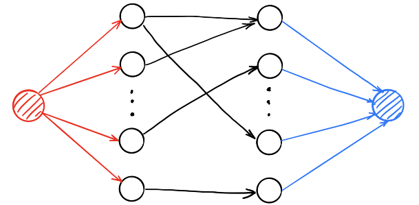

```c++
// 加入Dinic模板即可
int main(){
    int n, m, e; cin >> n >> m >> e;   // 结点个数分别为n,m，边数为e
    Dinic dinic(n + m);
    _for(i, 0, e){
        int from = read() - 1, to = read() - 1;
        dinic.AddEdge(from, to + n, 1);
    }
    _for(i, 0, n)     dinic.AddEdge(n + m, i, 1);       // 左源点
    _for(i, n, n + m) dinic.AddEdge(i, n + m + 1, 1);   // 右汇点

    cout << dinic.Maxflow(n + m, n + m + 1);
    return 0;
}
```

### 一般图匹配

给出一张 n 个点 m 条边的无向图，求该图的最大匹配。

> 输出：
>
> 第一行一个整数，表示最大匹配数。
>
> 第二行 n 个整数，第 i 个数表示与结点 i 匹配的结点编号，若该结点无匹配则输出 0。
>
> 如有多解输出任意解即可。

```c++
#include<bits/stdc++.h>
#pragma GCC optimize(3)
using namespace std;
const int N=1009,M=100009;
int n,m,ans,ord,q[M],pre[N];
int ql,qr,hd[N],dfn[N],match[N];
int pn,cl[N],nt[M],to[M],g[N];
void rd(int&x){//貌似加了快读瞬间加速近30ms，因此还是加了。
    char c=getchar();x=0;
    while(c>57||c<48)c=getchar();
    while(c>47&&c<58)
        x+=(x<<3)+x+c-48,c=getchar();
}
int find(int x){
    return g[x]==x?x:g[x]=find(g[x]);
}
void ade(int u,int v){//为方便起见，直接加双向边。
    ++pn,to[pn]=v,nt[pn]=hd[u],
    hd[u]=pn,++pn,nt[pn]=hd[v],
    hd[v]=pn,to[pn]=u;
}
int lca(int x,int y){
    for(++ord;x=find(x);swap(x,y))
        if(dfn[x]==ord)return x;//奇环编号相同，说明找到了。
        else dfn[x]=ord,x=pre[match[x]];
}
void flw(int x,int y,int p){//开花。
    while(find(x)!=p){
        pre[x]=y,y=match[x];
        if(cl[y]==2)cl[y]=1,q[++qr]=y;
        g[x]=p,g[y]=p,x=pre[y];
    }
}
bool dfs(int x){
    for(int i=1;i<=n;++i)g[i]=i;
    memset(cl,0,sizeof(cl));
    memset(pre,0,sizeof(pre));
    cl[q[ql=qr=1]=x]=1;//颜色为黑。
    for(int x=q[ql];ql<=qr;x=q[++ql])
        for(int i=hd[x],v,z;i;i=nt[i]){
            if(cl[v=to[i]]==2)continue;
            if(find(v)==find(x))continue;
            if(cl[v]==1)
                z=lca(x,v),flw(x,v,z),flw(v,x,z);
            else if(!cl[v]){
                cl[v]=2,pre[v]=x;
                if(!match[v]){
                    for(int u=v,lst,y;u;u=lst)
                        lst=match[y=pre[u]],match[u]=y,match[y]=u;//找到增广路了，一路取反。
                    return true;//答案+1。
                }
                cl[match[v]]=1,q[++qr]=match[v];//匹配它的点一定是黑点。
            }
        }
    return false;
}
int main(){
    scanf("%d%d",&n,&m);
    for(int u,v;m;--m)
        rd(u),rd(v),ade(u,v);
    for(int i=1;i<=n;++i)
        ans+=(!match[i]&&dfs(i));
    printf("%d\n",ans);
    for(int i=1;i<=n;++i)
        printf("%d ",match[i]);
    return 0*puts("");
}
```

## 计算几何*

### 二维几何模板（点/向量）

```c++
struct Point{
    double x, y;
    Point(double x = 0, double y = 0): x(x), y(y) {}
};
typedef Point Vector; // 向量表示与点一致
Vector operator + (Vector A, Vector B){ return Vector(A.x+B.x, A.y+B.y);}
Vector operator - (Vector A, Vector B){ return Vector(A.x-B.x, A.y-B.y);}
Vector operator * (Vector A, double p){ return Vector(A.x*p, A.y*p);}
Vector operator / (Vector A, double p){ return Vector(A.x/p, A.y/p);}
bool operator < (const Point& a, const Point& b){
    return a.x < b.x || (a.x == b.x && a.y < b.y);
}
const double eps = 1e-10;
int dcmp(double x){  // 三态函数判断相等，减少精度问题
    if(fabs(x) < eps) return 0; else return x < 0 ? -1 : 1;
}
bool operator == (const Point& a, const Point& b){
    return dcmp(a-x - b.x) == 0 && dcmp(a-y - b.y) == 0;
}

```

> 向量`(x,y)`的极角就是`atan2(y, x)`（单位：弧度）。

### 凸包

```c++
#include<iostream>
#include<algorithm>
#include<cstdio>
#include<cmath>
using namespace std;
int n;
struct ben
{
    double x,y;
}p[10005],s[10005];
double check(ben a1,ben a2,ben b1,ben b2)//检查叉积是否大于0，如果是a就逆时针转到b 
{
    return (a2.x-a1.x)*(b2.y-b1.y)-(b2.x-b1.x)*(a2.y-a1.y);
}
double d(ben p1,ben p2)//两点间距离。。。 
{
    return sqrt((p2.y-p1.y)*(p2.y-p1.y)+(p2.x-p1.x)*(p2.x-p1.x));
}
bool cmp(ben p1,ben p2)//排序函数，这个函数别写错了，要不然功亏一篑 
{
    double tmp=check(p[1],p1,p[1],p2);
    if(tmp>0) 
		return 1;
    if(tmp==0&&d(p[0],p1)<d(p[0],p2)) 
		return 1;
    return 0;
}
int main()
{
    scanf("%d",&n);   // 【n个点】
    double mid;
    for(int i=1;i<=n;i++)
    {
        scanf("%lf%lf",&p[i].x,&p[i].y);    // 【每个点的坐标】
        if(i!=1&&p[i].y<p[1].y)//这是是去重 
        {
            mid=p[1].y;p[1].y=p[i].y;p[i].y=mid;
            mid=p[1].x;p[1].x=p[i].x;p[i].x=mid;
        }
    } 
    sort(p+2,p+1+n,cmp);//系统快排 
    s[1]=p[1];//最低点一定在凸包里 
    int cnt=1;
    for(int i=2;i<=n;i++)
    {
        while(cnt>1&&check(s[cnt-1],s[cnt],s[cnt],p[i])<=0) //判断前面的会不会被踢走，如果被踢走那么出栈
			cnt--;
        cnt++;
        s[cnt]=p[i];
    }
    s[cnt+1]=p[1];//最后一个点回到凸包起点
    double ans=0; 
    for(int i=1;i<=cnt;i++) 
		ans+=d(s[i],s[i+1]);//然后【s里存好了凸包序列】，只需要把两两距离累加就行
    printf("%.2lf\n",ans);
    return 0;
}
```

### 凸包直径

```c++
#include<iostream>
#include<cstdio>
#include<cstdlib>
#include<cstring>
#include<cmath>
#include<queue>
#include<algorithm>
using namespace std;
#define MAX 50010
#define INF 1000000000
#define rg register
inline int read()
{
       int x=0,t=1;char ch=getchar();
       while((ch<'0'||ch>'9')&&ch!='-')ch=getchar();
       if(ch=='-'){t=-1;ch=getchar();}
       while(ch>='0'&&ch<='9'){x=x*10+ch-48;ch=getchar();}
       return x*t;
}
struct Node
{
       int x,y;
}p[MAX],p0,S[MAX];
int n,top,T;
inline bool cmp(Node a,Node b)
{
       rg double A=atan2(a.y-p0.y,a.x-p0.x);
       rg double B=atan2(b.y-p0.y,b.x-p0.x);
       if(A!=B)return A<B;
       else    return a.x<b.x;
}
inline long long chaji(int x1,int y1,int x2,int y2)//计算叉积 
{
       return (1LL*x1*y2-1LL*x2*y1);
}
inline long long Compare(Node a,Node b,Node c)//计算向量 
{
       return chaji((b.x-a.x),(b.y-a.y),(c.x-a.x),(c.y-a.y));
}
inline void Find()//寻找凸包 
{
       p0=(Node){INF,INF};
       rg int k=0;
       for(rg int i=0;i<n;++i)//找到最下方的点 
               if(p0.y>p[i].y||(p0.y==p[i].y&&p0.x>p[i].x))
                      p0=p[i],k=i;
       swap(p[k],p[0]);
       sort(&p[1],&p[n],cmp);//关于最下方的点排序 
       S[0]=p[0];S[1]=p[1];
       top=1;//栈顶 
       for(rg int i=2;i<n;)//求出凸包 
       {
                if(top&&Compare(S[top-1],p[i],S[top])>=0) top--;
             else   S[++top]=p[i++];  
       }
       //for(int i=0;i<=top;++i)printf("(%d,%d)\n",S[i].x,S[i].y);
}
inline long long Dis(Node a,Node b)//计算两点的距离的平方和 
{
       return 1LL*(a.x-b.x)*(a.x-b.x)+1LL*(a.y-b.y)*(a.y-b.y);
}
long long GetMax()//求出直径 
{
       rg long long re=0;
       if(top==1)//仅有两个点
          return Dis(S[0],S[1]); 
       S[++top]=S[0];//把第一个点放到最后
       int j=2;
       for(int i=0;i<top;++i)//枚举边 
       {
                 while(Compare(S[i],S[i+1],S[j])<Compare(S[i],S[i+1],S[j+1]))
                  j=(j+1)%top;
              re=max(re,max(Dis(S[i],S[j]),Dis(S[i+1],S[j])));
       }
       return re;
       
}
int main()
{    
       n=read();
       for(int i=0;i<n;++i)
       {
               p[i].x=read();p[i].y=read();
       }
       long long ans=INF,ss;
       Find();
       ans=GetMax();
       cout<<ans<<endl;   // 【注意这里输出的是直径的平方】
       return 0;
}
```

<div STYLE="page-break-after: always;"></div>

# 高等数据结构

## 单调栈

```c++
stack<int> S;
S.insert(init_value);

while(cin >> x){
    while(!S.empty() && S.top() > x) // 弹出所有不符合单调性的元素，此处可进行其他按需的操作
        S.pop();
    S.push(x); // 加入
}
```

### 单调队列

例：序列A，**固定滑动窗口**长度为k，依次求每个窗口中的最小值/最大值。

> 利用单调队列：$O(n)$
>
> 
>
> 每次滑动时，
>
> - 右端，插入元素前，弹出所有违背单调性的元素。
> - 左端，若当前元素==队首元素，弹出；否则不做处理。

```c++
#include<cstdio>
#include<cstring>
using namespace std; 

struct Monotone_queue
{
    static const int maxn=1000001;
    int n,k,a[maxn];
    int q[maxn],head,tail,p[maxn];//同题目叙述一样，q是单调队列，p是对应编号。
    
    void read()
    {
        scanf("%d %d",&n,&k);   // n为长度，k为窗口大小
        for(int i=1;i<=n;++i)
            scanf("%d",&a[i]);  // 输入序列
    }
    
    void monotone_max()//单调最大值
    {
        head=1;
        tail=0;
        for(int i=1;i<=n;++i)
        {
            while(head<=tail&&q[tail]<=a[i])
                tail--;
            q[++tail]=a[i];
            p[tail]=i;
            while(p[head]<=i-k)
                head++;
            if(i>=k)printf("%d ",q[head]);
        }
        printf("\n");
    }
    
    void monotone_min()
    {
        head=1;
        tail=0;//为啥要这样呢?因为head要严格对应首元素，tail要严格对应尾元素，所以当tail>=head时，说明有元素。而一开始队列为空，说一要这样赋值。其实这跟普通队列一样。
        for(int i=1;i<=n;++i)
        {//a[i]表示当前要处理的值
            while(head<=tail&&q[tail]>=a[i])
                tail--;//只要队列里有元素，并且尾元素比待处理值大，即表示尾元素已经不可能出场，所以出队。直到尾元素小于待处理值，满足"单调"。
            q[++tail]=a[i];//待处理值入队。
            p[tail]=i;//同时存下其编号
            while(p[head]<=i-k)
                head++;//如果队首元素已经"过时"，出队。
            if(i>=k)printf("%d ",q[head]);//输出最值，即队首元素。i>=k表示该输出，至于why就自己看题目。
        }
        printf("\n");
        
    }
}worker;

int main()
{
    worker.read();
    worker.monotone_min();
    worker.monotone_max();
    return 0;
}
```

## 区间维护

### 稀疏表 Spare Table $O(nlogn)$

解决范围最小值问题（Range Minimum Query，**<font color=red>RMQ</font>**）。给出数组A，设计数据结构，支持：

- 查询操作`Query(L, R)`：计算$\text{min}\{A_L,A_{L+1} , ...,A_R\}$（**区间最小值**）。$O(1)$。

`d[i][j]`表示从位置`i`开始长度为$2^j$的一段元素中的最小值。则有：
$$
d(i,j) = min\{d(i,\;j-1), \;\;d(i+2^{j-1},\;j-1)\}
$$

```c++
int d[MAXN][25]; // 两个维度不等长，可分析得MAXN不超过百万时不爆空间
void RMQ_init(const vector<int>& A){  // 初始化，O(nlogn)
    int n = A.size();
    for(int i = 0; i < n; ++i) d[i][0] = A[i];
    for(int j = 1; (1<<j) <= n; ++j)
        for(int i = 0; i + (1<<j) - 1 < n; ++i)
            d[i][j] = min(d[i][j-1], d[i + (1<<(j-1))][j-1]);
}
int RMQ(int L, int R){  // 查询，O(1)
    int k = 0;
    while((1<<(k+1)) <= R-L+1) k++; // 使得 2^k 大于区间 [L,R} 长度的一半
    return min(d[L][k], d[R-(1<<k)+1][k]);
}
```

> 查询操作示意图：


### 树状数组/二叉索引树 BIT

二叉索引树（Binary Indexed Tree，BIT）。给定数组A，设计数据结构，支持：

- `add(x, d)`：**更新单个元素**，让$A_x$增加$d$。$O(logn)$。
  - 更新一个区间：将区间第一个元素`+ d`，最后一个元素的下一位`- d`
- `query(L, R)`：计算$\sum_L^R A_i$（**区间求和**）。$O(logn)$。


```c++
int C[MAXN];
int lowbit(int x) {return x&(-x);}  // 计算x二进制下只保留最低位1后的值
vector<int> A(1,0);
struct BIT{ // 树状数组
    int n;
    //所有数组统一从下标1开始使用！！！
    BIT(vector<int>& A){  // 初始化，O(nlogn)
        n = A.size() - 1;
        for(int i = 1; i < A.size(); ++i)
            add(i, A[i]); // 从C[1]开始插入
    }
    int sum(int x){  // 前缀和[1, x]
        int ret = 0;
        while(x > 0){ ret += C[x]; x-= lowbit(x);}
        return ret;
    }
    int query(int L, int R){  // 查询操作，O(logn)
        return sum(R) - sum(L-1);
    }
    void add(int x, int d){ // 修改操作，O(logn)
        while(x <= n){
            C[x] += d; x += lowbit(x);
        }
    }
};
```

#### 支持区间级修改的树状数组

支持以下操作：（在树状数组中可以用前 i 项的和来表示第 i 个数）

- `add(L, R, d)`：**更新区间**`[L, R]`，让区间内每个元素增加$d$。$O(logn)$。
- `query(x)`：查询某个数的值。

```c++
int C[MAXN];
int lowbit(int x) {return x&(-x);}  // 计算x二进制下只保留最低位1后的值
vector<int> A(1,0);
struct BIT{ // 树状数组，区间修改，平凡差分法
    int n;
    //所有数组统一从下标1开始使用！！！包括A向量，需要一个哨兵。
    BIT(vector<int>& A){  // 初始化，相当于平凡差分数组
        n = A.size() - 1;
    }
    int query(int x){  // 查询操作，O(logn), 前缀和[1, x]
        int ret = A[x];  // 注意这里需要A[x]的值
        while(x > 0){ ret += C[x]; x-= lowbit(x);}
        return ret;
    }
    void add(int L, int R, int d){ // 修改操作，O(logn)
        ADD(L, d); ADD(R+1, -d);
    }
    void ADD(int x, int d){
        while(x <= n){
            C[x] += d; x += lowbit(x);
        }
    }
};
```

差分数组法：（会丢失A数组的起始信息）

```c++
int C[MAXN];
int lowbit(int x) {return x&(-x);}
vector<int> A(1,0);
struct BIT{ // 树状数组
    int n;
    BIT(vector<int>& A){
        n = A.size() - 1;
        for(int i = n; i >= 2; --i) A[i] -= A[i - 1];  // 差分
        _rep(i, 1, n) ADD(i, A[i]);
    }
    int query(int x){
        int ret = 0;
        while(x > 0){ ret += C[x]; x-= lowbit(x);}
        return ret;
    }
    void add(int L, int R, int d){
        ADD(L, d); ADD(R+1, -d);
    }
    void ADD(int x, int d){
        while(x <= n){
            C[x] += d; x += lowbit(x);
        }
    }
};
```

#### 二维树状数组

```c++
struct BIT {
	int n; /// n * n 的二维树状数组
	int C[maxn][maxn];
	BIT(int N = 0) {n = N; memset(C, 0x00, sizeof(C));} /// 初始化
	inline int lowbit(int x) {return x&(-x);}
	inline void add(int x, int y, int v) { /// 单点修改 
		for(register int i = x; i <= n; i += lowbit(i))
			for(register int j = y; j <= n; j += lowbit(j))
				C[i][j] += v;
	}
	inline int pre(int x, int y) { /// 前缀求和 
		int ans = 0;
		for(register int i = x; i > 0; i -= lowbit(i))
			for(register int j = y; j > 0; j -= lowbit(j))
				ans += C[i][j];
		return ans;
	}
	inline int submat(int x1, int y1, int x2, int y2) { /// 子矩阵和 
		int ans = pre(x2, y2);
		ans -= pre(x1 - 1, y2) + pre(x2, y1 - 1);
		ans += pre(x1 - 1, y1 - 1);
		return ans;
	}
} bit; /// 记得初始化 n
```

### 线段树 Segment Tree

> 线段树可以完全涵盖树状数组的功能。但是树状数组的常数明显优于线段树。

#### 简易线段树

给定数组A，设计数据结构，支持：

- `update(x, v)`：**修改单个元素**，把$A_x$修改为$v$。$O(logn)$。
  - 对一个区间整体操作：修改一个区间。
- `query(L, R)`：计算$\sum\{A_L, A_{L+1},...,A_R\}$（**区间求结合和**）。$O(logn)$。
  - 维护子区间信息：`min/max`, `sum`, `xor`。必须**符合<font color=red>结合律</font>**。

> 线段树维护的信息，需要满足可加性，即能以可以接受的速度合并信息和修改信息。

```c++
typedef int Item;
Item op(const Item &a, const Item &b){  // 自定义结合律运算
    return a + b;
}
struct Fuction{                         // 自定义操作函数
    Item v;
    Fuction(Item V) : v(V) {}
    Item operator () (Item a){
        return a += v;
    }
};

struct SegmentTree{   // 线段树
    int n;                                            // 元素个数
    Item *a, d[2 * MAXN - 1];                         // 保存节点信息
    SegmentTree(int N, Item *A){
        // 传入数组 a 必须从下标1开始
        n = N; a = A;                                 // 传入初始数组
        build(1, n, 1);
    }
    void build(int s, int t, int p) {                 // build(1, n, 1)
        // 对 [s,t] 区间建立线段树,当前根的编号为 p
        if (s == t) { d[p] = a[s]; return;}
        int m = (s + t) / 2;
        build(s, m, p * 2), build(m + 1, t, p * 2 + 1);
        d[p] = op(d[p * 2], d[(p * 2) + 1]);  // 【求结合和】
    }
    void update(int x, Item v, int s, int t, int p){  // 修改A[x]为v; update(x, v, 1, n, 1);
        if(x == s && x == t) return;
        d[p] = op(d[p], v - a[x]); a[x] = v;  // 【维护结合和】
        // d[p] = op(d[p], v); a[x] += v;        // 将A[x]增加v
        int m = (s + t) >> 1;
        if (s <= x && x <= m) update(x, v, s, m, p * 2);
        else update(x, v, m + 1, t, p * 2 + 1);
    }
    void update(int x, int y, Item v, int s, int t, int p){

    }
    Item query(int le, int ri, int s, int t, int p) {  // 计算区间和; query(le, ri, 1, n, 1);
        // [le,ri] 为查询区间,[s,t] 为当前节点包含的区间,p 为当前节点的编号
        if (le <= s && t <= ri)
            return d[p];
        int m = (s + t) >> 1; Item sum = 0;
        if (le <= m) sum = op(sum, query(le, ri, s, m, p * 2));
        if (ri > m)  sum = op(sum, query(le, ri, m + 1, t, p * 2 + 1));
        return sum;
    }
};
```

#### 区间线段树

使用懒标记。支持区间整体加减，区间求和，区间每个数乘上1个数。

```c++
#include<cstdio>
#include<iostream>
#include<cstring>
#include<ctime>
#include<cstdlib>
#include<cmath>
#include<algorithm>
#include<string>
#include<stack>
#include<queue>
#include<vector>
#include<map>
using namespace std;
long long c[500010];
long long p;
struct sgt{
    long long sum[2000010];
    long long addv[2000010];
    long long mulv[2000010];
    void build(int o,int l,int r){
        addv[o]=0;
        mulv[o]=1;
        if(l==r)sum[o]=c[l];
        else{
            int mid=(l+r)>>1;
            int lson=o<<1;
            int rson=lson|1;
            build(lson,l,mid);
            build(rson,mid+1,r);
            sum[o]=(sum[lson]+sum[rson])%p;
        }
    }    
    void push_down(int o,int l,int r,int mid,int lson,int rson){
        mulv[lson]=(mulv[lson]*mulv[o])%p;
        mulv[rson]=(mulv[rson]*mulv[o])%p;
        addv[lson]=(addv[lson]*mulv[o])%p;
        addv[rson]=(addv[rson]*mulv[o])%p;
        sum[lson]=(sum[lson]*mulv[o])%p;
        sum[rson]=(sum[rson]*mulv[o])%p;
        mulv[o]=1;
        addv[lson]=(addv[lson]+addv[o])%p;
        addv[rson]=(addv[rson]+addv[o])%p;
        sum[lson]=(sum[lson]+(mid-l+1)*addv[o])%p;
        sum[rson]=(sum[rson]+(r-mid)*addv[o])%p;
        addv[o]=0;
    }
    void addall(int o,int l,int r,int a,int b,int x){
        if(l>=a && r<=b){
            addv[o]=(addv[o]+x)%p;
            sum[o]=(sum[o]+(r-l+1)*x)%p;
            return;
        }
        else{
            int mid=(l+r)>>1;
            int lson=o<<1;
            int rson=lson|1;
            if(mulv[o]!=1 || addv[o])push_down(o,l,r,mid,lson,rson);
            if(a<=mid)addall(lson,l,mid,a,b,x);
            if(b>mid)addall(rson,mid+1,r,a,b,x);
            sum[o]=(sum[lson]+sum[rson])%p;
        }
    }
    void mulall(int o,int l,int r,int a,int b,int x){
        if(l>=a && r<=b){
            mulv[o]=(mulv[o]*x)%p;
            addv[o]=(addv[o]*x)%p;
            sum[o]=(sum[o]*x)%p;
            return;
        }
        else{
            int mid=(l+r)>>1;
            int lson=o<<1;
            int rson=lson|1;
            if(mulv[o]!=1 || addv[o])push_down(o,l,r,mid,lson,rson);
            if(a<=mid)mulall(lson,l,mid,a,b,x);
            if(b>mid)mulall(rson,mid+1,r,a,b,x);
            sum[o]=(sum[lson]+sum[rson])%p;
        }
    }
    long long query(int o,int l,int r,int a,int b){
        if(l>=a && r<=b)return sum[o]%p;
        else{
            int mid=(l+r)>>1;
            int lson=o<<1;
            int rson=lson|1;
            long long ans=0;
            if(mulv[o]!=1 || addv[o])push_down(o,l,r,mid,lson,rson);
            if(a<=mid)ans+=query(lson,l,mid,a,b);
            if(b>mid)ans+=query(rson,mid+1,r,a,b);
            return ans%p;
        }
    }
};
sgt tree;
int n,m,i,f;
int x,y;
long long k;
int main(){
    scanf("%d%d%d",&n,&m,&p);      // 【注意这里取模p】
    for(i=1;i<=n;i++)scanf("%d",&c[i]);
    tree.build(1,1,n);
    for(i=1;i<=m;i++){
        scanf("%d",&f);
        switch(f){
            case 1:{
                scanf("%d%d%d",&x,&y,&k);
                tree.mulall(1,1,n,x,y,k);    // 【区间乘上k】
                break;
            }
            case 2:{
                scanf("%d%d%d",&x,&y,&k);
                tree.addall(1,1,n,x,y,k);    // 【区间加上k】
                break;
            }
            case 3:{
                scanf("%d%d",&x,&y);
                printf("%lld\n",tree.query(1,1,n,x,y));  // 【区间查询求和】
                break;
            }    
        }
    }
    return 0;
}
```

#### 主席树-静态区间第 k 小

可持久化线段树。

给定 n 个整数构成的序列，将对于指定的闭区间查询其区间内的第 k 小值。

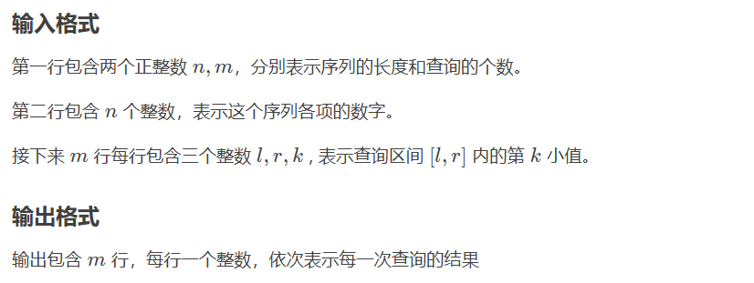

```c++
#include<cstdio>
#include<cstring>
#include<algorithm>
#define mid (l+r)/2
using namespace std;

const int N = 200010;
int n, q, m, cnt = 0;
int a[N], b[N], T[N];
int sum[N<<5], L[N<<5], R[N<<5];

inline int build(int l, int r)
{
    int rt = ++ cnt;
    sum[rt] = 0;
    if (l < r){
        L[rt] = build(l, mid);
        R[rt] = build(mid+1, r);
    }
    return rt;
}

inline int update(int pre, int l, int r, int x)
{
    int rt = ++ cnt;
    L[rt] = L[pre]; R[rt] = R[pre]; sum[rt] = sum[pre]+1;
    if (l < r){
        if (x <= mid) L[rt] = update(L[pre], l, mid, x);
        else R[rt] = update(R[pre], mid+1, r, x);
    }
    return rt;
}

inline int query(int u, int v, int l, int r, int k)
{
    if (l >= r) return l;
    int x = sum[L[v]] - sum[L[u]];
    if (x >= k) return query(L[u], L[v], l, mid, k);
    else return query(R[u], R[v], mid+1, r, k-x);
}

int main()
{
    scanf("%d%d", &n, &q);
    for (int i = 1; i <= n; i ++){
        scanf("%d", &a[i]);
        b[i] = a[i];
    }
    sort(b+1, b+1+n);
    m = unique(b+1, b+1+n)-b-1;
    T[0] = build(1, m);
    for (int i = 1; i <= n; i ++){
        int t = lower_bound(b+1, b+1+m, a[i])-b;
        T[i] = update(T[i-1], 1, m, t);
    }
    while (q --){
        int x, y, z;
        scanf("%d%d%d", &x, &y, &z);
        int t = query(T[x-1], T[y], 1, m, z);
        printf("%d\n", b[t]);
    }
    return 0;
}
```

### 块状数组 $O(\sqrt n)$

平方分割（Sqrt decomposition）是把排成一排的$n$个元素每$\sqrt n$个分在一个桶内进行维护的方法的统称。这样的分割方法可以使对区间的复杂度降至$O(\sqrt n)$。

> 当$n$较小时（如$n=10^5$），其性能与其他区间维护性能不相上下。

分块法求区间和：

```c++
struct SqrtDecomposition{
    int T, n, *a;
    int s[MAXN];    // 分块
    SqrtCom(int N, int* A){
        n = N; a = A; T = ceil(sqrt(n));
        memset(s, 0, sizeof(s));
        _for(i, 0, T)
            _for(j, 0, T)
                if(i*T + j < n) s[i] += a[i*T + j];
    }
    void update(int x, int d){  // 让a[x] += d
        a[x] += d; s[x / T] += d;
    }
    int query(int L, int R){    // [L, R]区间求和
        int ret = 0;
        _for(i, L/T, R/T) ret += s[i];
        _for(i, L - L%T, L) ret -= a[i];
        _rep(i, R - R%T, R) ret += a[i];
        return ret; 
    }
};
```

#### 根树 Sqrt Tree $O(nloglogn+T)$

Sqrt Tree可以在 $O(nloglogn)$ 的时间内预处理，并在 $O(1)$ 的时间内回答询问，在 $O(\sqrt n)$ 内更新。

> 首先建立块内数组 $P_i$ 和 $S_i$，分别维护第 $i$ 块内前缀和、块内后缀和；再建立二维询问数组 $B_{i,j}$ 保存 $[i,j]$ 块的和。容易想到我们在每个块内递归地构造上述结构以支持块内的查询，从而形成树结构。空间消耗 $O(n)$。

根数支持运算：（更适合**少修改、多查询**的场合）

- `SqrtTree(vector)`：初始化 + 预处理。$O(nloglogn)$。
- `query(l, r)`：查询区间结合和。$O(1)$。
- `update(x, item)`：更新指定位置的元素。 $O(\sqrt n)$ 。

```c++
struct SqrtTreeItem{   // 树中元素
    int x;
    SqrtTreeItem() {}
    SqrtTreeItem(int a): x(a) {}
};
SqrtTreeItem op(const SqrtTreeItem &a, const SqrtTreeItem &b){   // 自定义根数支持的运算
    return SqrtTreeItem(a.x + b.x);
}
// -------------------------------以下为模板-------------------------------
inline int log2Up(int n) {
  int res = 0;
  while ((1 << res) < n) {
    res++;
  }
  return res;
}

class SqrtTree {
 private:
  int n, lg, indexSz;
  vector<SqrtTreeItem> v;
  vector<int> clz, layers, onLayer;
  vector<vector<SqrtTreeItem> > pref, suf, between;

  inline void buildBlock(int layer, int l, int r) {
    pref[layer][l] = v[l];
    for (int i = l + 1; i < r; i++) {
      pref[layer][i] = op(pref[layer][i - 1], v[i]);
    }
    suf[layer][r - 1] = v[r - 1];
    for (int i = r - 2; i >= l; i--) {
      suf[layer][i] = op(v[i], suf[layer][i + 1]);
    }
  }

  inline void buildBetween(int layer, int lBound, int rBound, int betweenOffs) {
    int bSzLog = (layers[layer] + 1) >> 1;
    int bCntLog = layers[layer] >> 1;
    int bSz = 1 << bSzLog;
    int bCnt = (rBound - lBound + bSz - 1) >> bSzLog;
    for (int i = 0; i < bCnt; i++) {
      SqrtTreeItem ans;
      for (int j = i; j < bCnt; j++) {
        SqrtTreeItem add = suf[layer][lBound + (j << bSzLog)];
        ans = (i == j) ? add : op(ans, add);
        between[layer - 1][betweenOffs + lBound + (i << bCntLog) + j] = ans;
      }
    }
  }

  inline void buildBetweenZero() {
    int bSzLog = (lg + 1) >> 1;
    for (int i = 0; i < indexSz; i++) {
      v[n + i] = suf[0][i << bSzLog];
    }
    build(1, n, n + indexSz, (1 << lg) - n);
  }

  inline void updateBetweenZero(int bid) {
    int bSzLog = (lg + 1) >> 1;
    v[n + bid] = suf[0][bid << bSzLog];
    update(1, n, n + indexSz, (1 << lg) - n, n + bid);
  }

  void build(int layer, int lBound, int rBound, int betweenOffs) {
    if (layer >= (int)layers.size()) {
      return;
    }
    int bSz = 1 << ((layers[layer] + 1) >> 1);
    for (int l = lBound; l < rBound; l += bSz) {
      int r = min(l + bSz, rBound);
      buildBlock(layer, l, r);
      build(layer + 1, l, r, betweenOffs);
    }
    if (layer == 0) {
      buildBetweenZero();
    } else {
      buildBetween(layer, lBound, rBound, betweenOffs);
    }
  }

  void update(int layer, int lBound, int rBound, int betweenOffs, int x) {
    if (layer >= (int)layers.size()) {
      return;
    }
    int bSzLog = (layers[layer] + 1) >> 1;
    int bSz = 1 << bSzLog;
    int blockIdx = (x - lBound) >> bSzLog;
    int l = lBound + (blockIdx << bSzLog);
    int r = min(l + bSz, rBound);
    buildBlock(layer, l, r);
    if (layer == 0) {
      updateBetweenZero(blockIdx);
    } else {
      buildBetween(layer, lBound, rBound, betweenOffs);
    }
    update(layer + 1, l, r, betweenOffs, x);
  }

  inline SqrtTreeItem query(int l, int r, int betweenOffs, int base) {
    if (l == r) {
      return v[l];
    }
    if (l + 1 == r) {
      return op(v[l], v[r]);
    }
    int layer = onLayer[clz[(l - base) ^ (r - base)]];
    int bSzLog = (layers[layer] + 1) >> 1;
    int bCntLog = layers[layer] >> 1;
    int lBound = (((l - base) >> layers[layer]) << layers[layer]) + base;
    int lBlock = ((l - lBound) >> bSzLog) + 1;
    int rBlock = ((r - lBound) >> bSzLog) - 1;
    SqrtTreeItem ans = suf[layer][l];
    if (lBlock <= rBlock) {
      SqrtTreeItem add =
          (layer == 0) ? (query(n + lBlock, n + rBlock, (1 << lg) - n, n))
                       : (between[layer - 1][betweenOffs + lBound +
                                             (lBlock << bCntLog) + rBlock]);
      ans = op(ans, add);
    }
    ans = op(ans, pref[layer][r]);
    return ans;
  }

 public:
  inline SqrtTreeItem query(int l, int r) { return query(l, r, 0, 0); }

  inline void update(int x, const SqrtTreeItem &item) {
    v[x] = item;
    update(0, 0, n, 0, x);
  }

  SqrtTree(const vector<SqrtTreeItem> &a)
      : n((int)a.size()), lg(log2Up(n)), v(a), clz(1 << lg), onLayer(lg + 1) {
    clz[0] = 0;
    for (int i = 1; i < (int)clz.size(); i++) {
      clz[i] = clz[i >> 1] + 1;
    }
    int tlg = lg;
    while (tlg > 1) {
      onLayer[tlg] = (int)layers.size();
      layers.push_back(tlg);
      tlg = (tlg + 1) >> 1;
    }
    for (int i = lg - 1; i >= 0; i--) {
      onLayer[i] = max(onLayer[i], onLayer[i + 1]);
    }
    int betweenLayers = max(0, (int)layers.size() - 1);
    int bSzLog = (lg + 1) >> 1;
    int bSz = 1 << bSzLog;
    indexSz = (n + bSz - 1) >> bSzLog;
    v.resize(n + indexSz);
    pref.assign(layers.size(), vector<SqrtTreeItem>(n + indexSz));
    suf.assign(layers.size(), vector<SqrtTreeItem>(n + indexSz));
    between.assign(betweenLayers, vector<SqrtTreeItem>((1 << lg) + bSz));
    build(0, 0, n, 0);
  }
};
```

#### CDQ分治


> 一维：时间（按输入顺序就行了）
>
> 二维：*x* 坐标（cdq分治）
>
> 三维：*y* 坐标（树状数组）

```c++
#include <bits/stdc++.h>
#define For(i, l, r) for(register int i = (l), _end_ = (int)(r); i <= _end_; ++i)
#define Fordown(i, r, l) for(register int i = (r), _end_ = (int)(l); i >= _end_; --i)
#define Set(a, v) memset(a, v, sizeof(a))
using namespace std;

inline bool chkmin(int &a, int b) {return b < a ? a = b, 1 : 0;}
inline bool chkmax(int &a, int b) {return b > a ? a = b, 1 : 0;}

inline int read() {
    int x = 0, fh = 1; char ch = getchar();
    for (; !isdigit(ch); ch = getchar() ) if (ch == '-') fh = -1;
    for (; isdigit(ch); ch = getchar() ) x = (x<<1) + (x<<3) + (ch ^ '0');
    return x * fh;
}

void File() {
#ifdef zjp_shadow
	freopen ("P2683.in", "r", stdin);
	freopen ("P2683.out", "w", stdout);
#endif
}

int n;

const int N = 800100;
struct Opt {
	int x, y, type, id, val;
	inline bool operator < (const Opt &rhs) const {
		return (x ^ rhs.x) ? x < rhs.x : type < rhs.type;
	}
};
Opt lt[N], tmp[N];

#define lowbit(x) (x & -(x))
struct Fenwick_Tree {
	int c[500100];
	inline void Add(int pos, int val) { for (; pos <= n; pos += lowbit(pos) ) c[pos] += val; }
	inline int Sum(int pos) { int res = 0; for (; pos; pos -= lowbit(pos) ) res += c[pos]; return res; }
	inline void Clear(int pos) { for (; pos <= n; pos += lowbit(pos) ) if (c[pos]) c[pos] = 0; else break; }
};
Fenwick_Tree T;

int ans[N];

void Cdq(int l, int r) {
	if (l == r) return ;
	int mid = (l + r) >> 1;
	Cdq(l, mid); Cdq(mid + 1, r);
	int lp = l, rp = mid + 1, o = l;
	while (lp <= mid && rp <= r) {
		if (lt[lp] < lt[rp]) {
			if (lt[lp].type == 1) T.Add(lt[lp].y, lt[lp].val);
			tmp[o ++] = lt[lp ++];
		} else {
			if (lt[rp].type == 2) ans[lt[rp].id] += lt[rp].val * T.Sum(lt[rp].y);
			tmp[o ++] = lt[rp ++];
		}
	}

	while (lp <= mid) tmp[o ++] = lt[lp ++];
	while (rp <= r) {
		if (lt[rp].type == 2) ans[lt[rp].id] += lt[rp].val * T.Sum(lt[rp].y);
		tmp[o ++] = lt[rp ++];
	}

	For (i, l, mid) if (lt[i].type == 1) T.Clear(lt[i].y);
	For (i, l, r) lt[i] = tmp[i];
}

int qcnt, acnt;
inline void Addq(int x, int y, int type, int id, int val) {
	lt[++qcnt] = (Opt){x, y, type, id, val};
}

int main () {
	File() ;
	n = read();
	for (;;) {
		int opt = read();
		if (opt == 3) break ;
		int xa, ya, xb, yb, val;
		if (opt == 1) {
			xa = read(); ya = read(); val = read();
			Addq(xa, ya, 1, 0, val);
		} else {
			xa = read(); ya = read();
			xb = read(); yb = read();
			Addq(xa - 1, ya - 1, 2, (++ acnt), 1);
			Addq(xa - 1, yb, 2, acnt, -1);
			Addq(xb, ya - 1, 2, acnt, -1);
			Addq(xb, yb, 2, acnt, 1);
		}
	}
	Cdq(1, qcnt);
	For (i, 1, acnt) printf ("%d\n", ans[i]);
    return 0;
}
```

##### 三维偏序


```c++
#include<bits/stdc++.h>
using namespace std;
const int N=200001;
struct node{
	int x,y,z,id;
}a[N];
int c[N<<2],k,n,b[N],bj[N],f[N];
int lowbit(int x){
	return x&(-x);
}
int read(){
    int x=0,f=1;
	char c=getchar();
    while(c<'0'||c>'9') f=(c=='-')?-1:1,c=getchar();
    while(c>='0'&&c<='9') x=x*10+c-48,c=getchar();
    return f*x;
}
void add(int x,int v){
	while(x<=k)
		c[x]+=v,x+=lowbit(x);
}
int sum(int x){
	int ans=0;
	while(x)
		ans+=c[x],x-=lowbit(x);
	return ans;
}
bool cmp1(const node & a , const node & b ){
	if(a.x!=b.x)
		return a.x<b.x;
	if(a.y!=b.y)
		return a.y<b.y;
	return a.z<b.z;
}
bool cmp2(const node & a , const node & b ){
	if(a.y!=b.y)
		return a.y<b.y;
	if(a.z!=b.z)
		return a.z<b.z;
	return a.x<b.x;
}
void cdq(int l,int r){
	if(l==r)
		return ;
	int mid=(l+r)>>1,flag;
	cdq(l,mid),cdq(mid+1,r);
	sort(a+l,a+r+1,cmp2);
	for(int i=l;i<=r;i++)
		(a[i].x<=mid)?add(a[i].z,1),flag=i:b[a[i].id]+=sum(a[i].z);
	for(int i=l;i<=r;i++)
		if(a[i].x<=mid)
			add(a[i].z,-1);
}
int main(){
	n=read(),k=read();
	for(int i=1;i<=n;i++)
		a[i].x=read(),a[i].y=read(),a[i].z=read(),a[i].id=i;
	sort(a+1,a+1+n,cmp1);
	for(int i=1;i<=n;){
		int j=i+1;
		while(j<=n&&a[j].x==a[i].x&&a[j].y==a[i].y&&a[j].z==a[i].z)
			j++;
		while(i<j)
			bj[a[i].id]=a[j-1].id,i++;
	}
	for(int i=1;i<=n;i++)
		a[i].x=i;
	cdq(1,n);
	for(int i=1;i<=n;i++)
		f[b[bj[a[i].id]]]++;
	for(int i=0;i<n;i++)
		printf("%d\n",f[i]);
}
```

## 平衡搜索树 BBST

### 树堆 Treap

支持以下操作：（与STL-`set`类似，不允许重复元素）

- `insert(x)`：向Treap中插入`x`。$O(logn)$。
- `remove(x)`：从Treap中删除`x`。$O(logn)$。
- `exist(x)`：判断`x`是否存在于当前Treap。$O(logn)$。

```c++
struct Node{
    Node *ch[2];  // 左右子树
    int r;        // 优先级，数值越大，优先级越高(堆的由来，保证按优先级成一个堆)
    int v;        // 值
    int cmp(int x) const{
        return (x == v) ? -1 : (x < v ? 0 : 1);
    }
};
struct Treap{ 
    Node* root;
    Treap(Node* r = NULL): root(r) {}
    void insert(int x){
        if(!exist(x)) Insert(root, x);
    }
    void remove(int x){
        if(exist(x))  Remove(root, x);
    }
    void rotate(Node* &o, int d){   // d=0左旋，d=1右旋
        Node* k = o->ch[d^1];    // d^1等价于1-d
        o->ch[d^1] = k->ch[d];
        k->ch[d] = o;
        o = k;
    }
    bool exist(int x){  // 在插入/删除前确保键值不存在/存在
        Node* o = root;
        while(o != NULL){
            int d = o->cmp(x);
            if(d == -1) return true;  // 存在
            else o = o->ch[d];
        }
        return false;
    }
    void Insert(Node* &o, int x){  // 在以o为根的子树中插入键值x，修改o
        if(o == NULL) {o = new Node(); o->ch[0] = o->ch[1] = NULL; o->v = x; o->r =rand();} // 随即赋予优先级
        else{
            int d = o->cmp(x);
            Insert(o->ch[d], x);
            if(o->ch[d]->r > o->r) rotate(o, d^1);
        }
    }
    void Remove(Node* &o, int x){  // 在以o为根的子树中删除键值x，修改o
        int d = o->cmp(x);
        if(d == -1){   // 找到目标元素
            if(o->ch[0] == NULL) o = o->ch[1];   // 可能内存泄漏
            else if(o->ch[1] == NULL) o = o->ch[0];
            else{
                int d2 = (o->ch[0]->r > o->ch[1]->r ? 1: 0);
                rotate(o, d2); Remove(o->ch[d2], x);
            }
        } else Remove(o->ch[d], x);
    }
};
```

#### 名次树 Rank Tree

名次树在Treap的基础上支持两个新操作：

- `Kth(k)`：找出**第k小的元素**。
- `Rank(k)`：**元素x的名次**，即比x小的结点个数+1。

STL的`set`可以代替Treap的功能。但Treap可以进一步实现名次树。

```c++
struct Node{
    Node *ch[2]; int r; int v;
    int size;  // s表示以该节点为根的子树的总结点数
    Node(int x){
        ch[0] = ch[1] = NULL;
        v = x; r =rand();
        size = 1;
    }
    int cmp(int x) const{  // 如果要支持相等元素，则要修改很多地方。。
        return (x == v) ? -1 : (x < v ? 0 : 1);
    }
    void maintain() {   // 维护size
        size = 1;
        if(ch[0] != NULL) size += ch[0]->size;
        if(ch[1] != NULL) size += ch[1]->size;
    }
};

struct RankTree{
    Node* root;
    RankTree(Node* r = NULL): root(r) {}
    void insert(int x){
        if(!exist(x)) Insert(root, x);
    }
    void remove(int x){
        if(exist(x))  Remove(root, x);
    }
    void rotate(Node* &o, int d){
        Node* k = o->ch[d^1];
        o->ch[d^1] = k->ch[d];
        k->ch[d] = o;
        o->maintain(); k->maintain();  // 必须先维护o，再维护k
        o = k;
    }
    int Kth(int k){    // 返回第k小的元素，k > 0
        Node* t = root;
        if(t == NULL || t->size < k) return -1;  // 不存在
        while(1){
            if(t->ch[0] == NULL || t->ch[0]->size < k - 1){
                if(k == 1) return t->v;
                k -= (t->ch[0] == NULL) ? 1 : t->ch[0]->size + 1;
                t = t->ch[1];
            }
            else if(t->ch[0]->size > k - 1){
                t = t->ch[0];
            }
            else return t->v;
        }
    }
    int Rank(int x){   // 值x的名次，即比x小的结点个数+1
        if(exist(x)){
            int rank = 0;
            Node* o = root;
            while(o->v != x){
                if(o->v < x){
                    rank += ((o->ch[0] == NULL) ? 0 : o->ch[0]->size) + 1;
                    o = o->ch[1];
                } else o = o->ch[0];
            }
            return rank += ((o->ch[0] == NULL) ? 0 : o->ch[0]->size) + 1;;
        } else return -1;
    }
    bool exist(int x){
        Node* o = root;
        while(o != NULL){
            int d = o->cmp(x);
            if(d == -1) return true;
            else o = o->ch[d];
        }
        return false;
    }
    void Insert(Node* &o, int x){
        if(o == NULL) {o = new Node(x);}
        else{
            int d = o->cmp(x);
            o->size++;    // 插入时动态维护节点的size
            Insert(o->ch[d], x);
            if(o->ch[d]->r > o->r) rotate(o, d^1);
        }
    }
    void Remove(Node* &o, int x){
        int d = o->cmp(x);
        o->size--;        // 删除时动态维护节点的size
        if(d == -1){
            if(o->ch[0] == NULL) o = o->ch[1];
            else if(o->ch[1] == NULL) o = o->ch[0];
            else{
                int d2 = (o->ch[0]->r > o->ch[1]->r ? 1: 0);
                rotate(o, d2); Remove(o->ch[d2], x);
            }
        } else Remove(o->ch[d], x);
    }
};
```

#### Treap第二模板

```c++
#include<iostream>
#include<cstdio>
#include<queue>
#include<cstring>
#include<algorithm>
#include<climits>
typedef long long LL;
using namespace std;
int RD(){
    int out = 0,flag = 1;char c = getchar();
    while(c < '0' || c >'9'){if(c == '-')flag = -1;c = getchar();}
    while(c >= '0' && c <= '9'){out = out * 10 + c - '0';c = getchar();}
    return flag * out;
    }
//第一次打treap，不压行写注释XD
const int maxn = 1000019,INF = 1e9;
//平衡树，利用BST性质查询和修改，利用随机和堆优先级来保持平衡，把树的深度控制在log N，保证了操作效率
//基本平衡树有以下几个比较重要的函数：新建，插入，删除，旋转
//节点的基本属性有val(值)，dat(随机出来的优先级)
//通过增加属性，结合BST的性质可以达到一些效果，如size(子树大小，查询排名)，cnt(每个节点包含的副本数)等
int na;
int ch[maxn][2];//[i][0]代表i左儿子，[i][1]代表i右儿子
int val[maxn],dat[maxn];
int size[maxn],cnt[maxn];
int tot,root;
int New(int v){//新增节点，
	val[++tot] = v;//节点赋值
	dat[tot] = rand();//随机优先级
	size[tot] = 1;//目前是新建叶子节点，所以子树大小为1
	cnt[tot] = 1;//新建节点同理副本数为1
	return tot;
	}
void pushup(int id){//和线段树的pushup更新一样
	size[id] = size[ch[id][0]] + size[ch[id][1]] + cnt[id];//本节点子树大小 = 左儿子子树大小 + 右儿子子树大小 + 本节点副本数
	}
void build(){
	root = New(-INF),ch[root][1] = New(INF);//先加入正无穷和负无穷，便于之后操作(貌似不加也行)
	pushup(root);//因为INF > -INF,所以是右子树，
	}
void Rotate(int &id,int d){//id是引用传递，d(irection)为旋转方向，0为左旋，1为右旋
	int temp = ch[id][d ^ 1];//旋转理解：找个动图看一看就好(或参见其他OIer的blog)
	ch[id][d ^ 1] = ch[temp][d];//这里讲一个记忆技巧，这些数据都是被记录后马上修改
	ch[temp][d] = id;//所以像“Z”一样
	id = temp;//比如这个id，在上一行才被记录过，ch[temp][d]、ch[id][d ^ 1]也是一样的
	pushup(ch[id][d]),pushup(id);//旋转以后size会改变，看图就会发现只更新自己和转上来的点，pushup一下,注意先子节点再父节点
	}//旋转实质是({在满足BST的性质的基础上比较优先级}通过交换本节点和其某个叶子节点)把链叉开成二叉形状(从而控制深度)，可以看图理解一下
void insert(int &id,int v){//id依然是引用，在新建节点时可以体现
	if(!id){
		id = New(v);//若节点为空，则新建一个节点
		return ;
		}
	if(v == val[id])cnt[id]++;//若节点已存在，则副本数++;
	else{//要满足BST性质，小于插到左边，大于插到右边
		int d = v < val[id] ? 0 : 1;//这个d是方向的意思，按照BST的性质，小于本节点则向左，大于向右
		insert(ch[id][d],v);//递归实现
		if(dat[id] < dat[ch[id][d]])Rotate(id,d ^ 1);//(参考一下图)与左节点交换右旋，与右节点交换左旋
		}
	pushup(id);//现在更新一下本节点的信息
	}
void Remove(int &id,int v){//最难de部分了
	if(!id)return ;//到这了发现查不到这个节点，该点不存在，直接返回
	if(v == val[id]){//检索到了这个值
		if(cnt[id] > 1){cnt[id]--,pushup(id);return ;}//若副本不止一个，减去一个就好
		if(ch[id][0] || ch[id][1]){//发现只有一个值，且有儿子节点,我们只能把值旋转到底部删除
			if(!ch[id][1] || dat[ch[id][0]] > dat[ch[id][1]]){//当前点被移走之后，会有一个新的点补上来(左儿子或右儿子)，按照优先级，优先级大的补上来
				Rotate(id,1),Remove(ch[id][1],v);//我们会发现，右旋是与左儿子交换，当前点变成右节点；左旋则是与右儿子交换，当前点变为左节点
				}
			else Rotate(id,0),Remove(ch[id][0],v);
			pushup(id);
			}
		else id = 0;//发现本节点是叶子节点，直接删除
		return ;//这个return对应的是检索到值de所有情况
		}
	v < val[id] ? Remove(ch[id][0],v) : Remove(ch[id][1],v);//继续BST性质
	pushup(id);
	}
int get_rank(int id,int v){
	if(!id)return 0;//若查询值不存在，返回
	if(v == val[id])return size[ch[id][0]] + 1;//查询到该值，由BST性质可知：该点左边值都比该点的值(查询值)小，故rank为左儿子大小 + 1
	else if(v < val[id])return get_rank(ch[id][0],v);//发现需查询的点在该点左边，往左边递归查询
	else return size[ch[id][0]] + cnt[id] + get_rank(ch[id][1],v);//若查询值大于该点值。说明询问点在当前点的右侧，且此点的值都小于查询值，所以要加上cnt[id]
	}
int get_val(int id,int rank){
	if(!id)return INF;//一直向右找找不到，说明是正无穷
	if(rank <= size[ch[id][0]])return get_val(ch[id][0],rank);//左边排名已经大于rank了，说明rank对应的值在左儿子那里
		else if(rank <= size[ch[id][0]] + cnt[id])return val[id];//上一步排除了在左区间的情况，若是rank在左与中(目前节点)中，则直接返回目前节点(中区间)的值
	else return get_val(ch[id][1],rank - size[ch[id][0]] - cnt[id]);//剩下只能在右区间找了，rank减去左区间大小和中区间，继续递归
	}
int get_pre(int v){
	int id = root,pre;//递归不好返回，以循环求解
	while(id){//查到节点不存在为止
		if(val[id] < v)pre = val[id],id = ch[id][1];//满足当前节点比目标小，往当前节点的右侧寻找最优值
		else id = ch[id][0];//无论是比目标节点大还是等于目标节点，都不满足前驱条件，应往更小处靠近
		}
	return pre;
	}
int get_next(int v){
	int id = root,next;
	while(id){
		if(val[id] > v)next = val[id],id = ch[id][0];//同理，满足条件向左寻找更小解(也就是最优解)
		else id = ch[id][1];//与上方同理
		}
	return next;
	}
int main(){
	build();//不要忘记初始化[运行build()会连同root一并初始化，所以很重要]
	na = RD();
	for(int i = 1;i <= na;i++){
		int cmd = RD(),x = RD();
		if(cmd == 1)insert(root,x);//函数都写好了，注意：需要递归的函数都从根开始，不需要递归的函数直接查询
		else if(cmd == 2)Remove(root,x);
		else if(cmd == 3)printf("%d\n",get_rank(root,x) - 1);//注意：因为初始化时插入了INF和-INF,所以查询排名时要减1(-INF不是第一小，是“第零小”)
			else if(cmd == 4)printf("%d\n",get_val(root,x + 1));//同理，用排名查询值得时候要查x + 1名，因为第一名(其实不是)是-INF
		else if(cmd == 5)printf("%d\n",get_pre(x));
		else if(cmd == 6)printf("%d\n",get_next(x));
		}
	return 0;
}
```

### 伸展树 Splay Tree

支持以下操作：

- `push(x)`：向Treap中插入`x`。
- `pop(x)`：从Treap中删除`x`。
- `find(x)`：查找`x`的位置并旋转到根节点 。
- `rank(x)`：查找`x`的排名。
- `atrank(k)`：查找第`k`大元素。
- `lower(x) / upper(x)`：查找`x`的前驱/后继。

```c++
#include<bits/stdc++.h>
using namespace std;
#define _OJ_ // 调试开关
#define MAXN 2000005
#define _for(i,a,b) for(int i =(a); i < (b); ++i) // 循环宏
#define _rep(i,a,b) for(int i =(a); i <= (b); ++i)

const int MAXL=100005;
const int INF=2147480000;

class Splay//存储规则：小左大右，重复节点记录 
{
    #define root e[0].ch[1]   //该树的根节点
    private:
        class node
        {
            public:
                int v,father;//节点值，父级节点 
                int ch[2];//左孩子=0，右孩子=1
                int sum;//自己+自己下级有多少节点。在根节点为1。
                int recy;//记录自己被重复了几次
        };
        node e[MAXL];//Splay树主体
        int n,points;//使用存储数,元素数
        void update(int x)
        {
            e[x].sum=e[e[x].ch[0]].sum+e[e[x].ch[1]].sum+e[x].recy;
        }
        int identify(int x)
        {
            return e[e[x].father].ch[0]==x?0:1;
        }
        void connect(int x,int f,int son)//连接函数。用法：connect(son,father,1/0)
        {
            e[x].father=f;
            e[f].ch[son]=x;
        }//作用：使得x的father=f，f的son=x.
        void rotate(int x)
        {
            int y=e[x].father;
            int mroot=e[y].father;
            int mrootson=identify(y);
            int yson=identify(x);
            int B=e[x].ch[yson^1];
            connect(B,y,yson);connect(y,x,(yson^1));connect(x,mroot,mrootson);
            update(y);update(x);
        }
        void splay(int at,int to)//将at位置的节点移动到to位置
        {
            to=e[to].father;
            while(e[at].father!=to)
            {
                int up=e[at].father;
                if(e[up].father==to) rotate(at);
                else if(identify(up)==identify(at))
                {
                    rotate(up);
                    rotate(at);
                }
                else
                {
                    rotate(at);
                    rotate(at);
                }
            }
        }
        int crepoint(int v,int father)
        {
            n++;
            e[n].v=v;
            e[n].father=father;
            e[n].sum=e[n].recy=1;
            return n;
        }
        void destroy(int x)//pop后摧毁节点 
        {
            e[x].v=e[x].ch[0]=e[x].ch[1]=e[x].sum=e[x].father=e[x].recy=0;
            if(x==n) n--;//最大限度优化
        }
    public:
        int getroot(){return root;}
        int find(int v)//用于外部的find调用
        {
            int now=root;
            while(true)
            {
                if(e[now].v==v)
                {
                    splay(now,root);
                    return now;
                }
                int next=v<e[now].v?0:1;
                if(!e[now].ch[next]) return 0;
                now=e[now].ch[next];
            }
        }
        int build(int v)//内部调用的插入函数，没有splay 
        {
            points++;
            if(n==0)//特判无点状态 
            {
                root=1;
                crepoint(v,0);
            }
            else
            {
                int now=root;
                while(true)//向下找到一个空节点 
                {
                    e[now].sum++;//自己的下级肯定增加了一个节点 
                    if(v==e[now].v)
                    {
                        e[now].recy++;
                        return now;
                    }
                    int next=v<e[now].v?0:1;
                    if(!e[now].ch[next])
                    {
                        crepoint(v,now);
                        e[now].ch[next]=n;
                        return n;
                    }
                    now=e[now].ch[next];
                }
            }
            return 0;
        }
        void push(int v)//插入元素时，先添加节点，再进行伸展 
        {
            int add=build(v);
            splay(add,root);
        }
        void pop(int v)//删除节点 
        {
            int deal=find(v);
            if(!deal) return;
            points--;
            if(e[deal].recy>1)
            {
                e[deal].recy--;
                e[deal].sum--;
                return;
            }
            if(!e[deal].ch[0])
            {
                root=e[deal].ch[1];
                e[root].father=0;
            }
            else
            {
                int lef=e[deal].ch[0];
                while(e[lef].ch[1]) lef=e[lef].ch[1];
                splay(lef,e[deal].ch[0]);
                int rig=e[deal].ch[1];
                connect(rig,lef,1);connect(lef,0,1);
                update(lef);
            }
            destroy(deal);
        }
        int rank(int v)//获取值为v的元素在这棵树里是第几小 
        {
            int ans=0,now=root;
            while(true)
            {
                if(e[now].v==v) return ans+e[e[now].ch[0]].sum+1;
                if(now==0) return 0;
                if(v<e[now].v) now=e[now].ch[0];
                else
                {
                    ans=ans+e[e[now].ch[0]].sum+e[now].recy;
                    now=e[now].ch[1];
                }
            }
            if(now) splay(now,root);
            return 0;
        }
        int atrank(int x)//获取第x小的元素的值 
        {
            if(x>points) return -INF;
            int now=root;
            while(true)
            {
                int minused=e[now].sum-e[e[now].ch[1]].sum;
                if(x>e[e[now].ch[0]].sum&&x<=minused) break;
                if(x<minused) now=e[now].ch[0];
                else
                {
                    x=x-minused;
                    now=e[now].ch[1];
                }
            }
            splay(now,root);
            return e[now].v;
        }
        int upper(int v)//寻找该值对应的一个最近的上界值 
        {
            int now=root;
            int result=INF;
            while(now)
            {
                if(e[now].v>v&&e[now].v<result) result=e[now].v;
                if(v<e[now].v) now=e[now].ch[0];
                else now=e[now].ch[1];
            }
            return result;
        }
        int lower(int v)//寻找该值对应的一个最近的下界值 
        {
            int now=root;
            int result=-INF;
            while(now)
            {
                if(e[now].v<v&&e[now].v>result) result=e[now].v;
                if(v>e[now].v) now=e[now].ch[1];
                else now=e[now].ch[0];
            }
            return result;
        }
    #undef root
};
Splay st;

int main(){
    // freopen("OJ.in", "r", stdin);
    
    int n; cin >> n;
    int opt, x;
    _for(i, 0, n){
        cin >> opt >> x;
        if(opt == 1){
            st.push(x);
        }
        else if(opt == 2){
            st.pop(x);
        }
        else if(opt == 3){
            cout << st.rank(x) <<endl;
        }
        else if(opt == 4){
            cout <<st.atrank(x)<<endl;
        }
        else if(opt == 5){
            cout <<st.lower(x)<<endl;
        }
        else if(opt == 6){
            cout <<st.upper(x)<<endl;
        }
    }
    return 0;
}
```

#### 文艺平衡树

您需要写一种数据结构（可参考题目标题），来维护一个有序数列。

其中需要提供以下操作：翻转一个区间，例如原有序序列是` 5 4 3 2 1`，翻转区间是 `[2,4]` 的话，结果是 `5 2 3 4 1`。

```c++
#include<iostream>
using namespace std;
#define MAXN 1000007
#define INF 100000089
struct Splay_tree{
	int f,sub_size,cnt,value,tag;
	int son[2];
}s[MAXN];
int original[MAXN],root,wz;
inline bool which(int x){
	return x==s[s[x].f].son[1];
}
inline void update(int x){
	if(x){
	s[x].sub_size=s[x].cnt;
	if(s[x].son[0])s[x].sub_size+=s[s[x].son[0]].sub_size;
    if(s[x].son[1])s[x].sub_size+=s[s[x].son[1]].sub_size;
	}
}
inline void pushdown(int x){
    if(x&&s[x].tag){
    	s[s[x].son[1]].tag^=1;
    	s[s[x].son[0]].tag^=1;
    	swap(s[x].son[1],s[x].son[0]);
    	s[x].tag=0;
    }	
}
inline void rotate(int x){
	int fnow=s[x].f,ffnow=s[fnow].f;
	pushdown(x),pushdown(fnow);
	bool w=which(x);
	s[fnow].son[w]=s[x].son[w^1];
	s[s[fnow].son[w]].f=fnow;
	s[fnow].f=x;
	s[x].f=ffnow;
	s[x].son[w^1]=fnow;
	if(ffnow){
		s[ffnow].son[s[ffnow].son[1]==fnow]=x;
	}
	update(fnow);
}
inline void splay(int x,int goal){
	for(int qwq;(qwq=s[x].f)!=goal;rotate(x)){
		if(s[qwq].f!=goal){//这个地方特别重要，原因是需要判断的是当前的父亲有没有到目标节点，而如果把“qwq”改成“x”……就会炸 
			rotate(which(x)==which(qwq)?qwq:x);
		}
	}
	if(goal==0){
		root=x;
	}
}

int build_tree(int l, int r, int fa) {
        if(l > r) { return 0; }
        int mid = (l + r) >> 1;
        int now = ++ wz;
        s[now].f=fa;
	    s[now].son[0]=s[now].son[1]=0;
		s[now].cnt++;
    	s[now].value=original[mid];
		s[now].sub_size++;
        s[now].son[0] = build_tree(l, mid - 1, now);
        s[now].son[1] = build_tree(mid + 1, r, now);
        update(now);
        return now;
}
inline int find(int x){
	int now=root;
	while(1)
	{
	    pushdown(now);
		if(x<=s[s[now].son[0]].sub_size){
			now=s[now].son[0];
		}	
		else  {
		x-=s[s[now].son[0] ].sub_size + 1;
	    if(!x)return now;
	    now=s[now].son[1];
		}
	}
}
inline void reverse(int x,int y){
	int l=x-1,r=y+1;
	l=find(l),r=find(r);
	splay(l,0);
	splay(r,l);
	int pos=s[root].son[1];
	pos=s[pos].son[0];
	s[pos].tag^=1;
}
inline void dfs(int now){
	pushdown(now);
	if(s[now].son[0])dfs(s[now].son[0]);
	if(s[now].value!=-INF&&s[now].value!=INF){
		cout<<s[now].value<<" ";
	}
	if(s[now].son[1])dfs(s[now].son[1]);
}
int main(){
	int n,m,x,y;
	cin>>n>>m;
	original[1]=-INF,original[n+2]=INF;
	for(int i=1;i<=n;i++){
		original[i+1]=i;
	}
	root=build_tree(1,n+2,0);//有一个良好的定义变量习惯很重要……重复定义同一个变量（比如全局的和局部的同名）那么就会发生覆盖。 
	for(int i=1;i<=m;i++){
		cin>>x>>y;
		reverse(x+1,y+1);
	}
	dfs(root);
}
```

### 替罪羊树

```c++
#include <bits/stdc++.h>
using std::vector;
const double alpha=0.7;
struct node{
    node *l,*r;
    int val,size,cnt;
    bool deleted;
    bool isbad(){return l->cnt>alpha*cnt+5||r->cnt>alpha*cnt+5;}
    void maintain(){size=!deleted+l->size+r->size;cnt=1+l->cnt+r->cnt;}
};
node *null;
void dfs(node *o,vector<node*> &v)
{
    if(o==null)return;
    dfs(o->l,v);
    if(!o->deleted)v.push_back(o);
    dfs(o->r,v);
    if(o->deleted)delete o;
}
node *build(vector<node*> &v,int l,int r)
{
    if(l>=r)return null;
    int mid=(l+r)>>1;
    node *o=v[mid];
    o->l=build(v,l,mid);
    o->r=build(v,mid+1,r);
    o->maintain();
    return o;
}
void rebuild(node* &o)
{
    vector<node*> v;
    dfs(o,v);
    o=build(v,0,v.size());
}
void insert(int x,node* &o)
{
    if(o==null)
    {
        o=new node;
        o->l=o->r=null;
        o->deleted=false;
        o->size=o->cnt=1;
        o->val=x;
        return;
    }
    else
    {
        ++o->size;
        ++o->cnt;
        if(x>=o->val)
            insert(x,o->r);
        else
            insert(x,o->l);
        if(o->isbad())rebuild(o);
    }
}
int rank(node *now,int x)
{
    int ans=1;
    while(now!=null)
    {
        if(now->val>=x)now=now->l;
        else
        {
            ans+=now->l->size+!now->deleted;
            now=now->r;
        }
    }
    return ans;
}
int kth(node *now,int x)
{
    while(now!=null)
    {
        if(!now->deleted && now->l->size+1==x)
            return now->val;
        if(now->l->size>=x)now=now->l;
        else
        {
            x-=now->l->size+!now->deleted;
            now=now->r;
        }
    }
}
void erase(node *o,int rk)
{
    if(!o->deleted && rk==o->l->size+1)
    {
        o->deleted=1;
        --o->size;
        return;
    }
    --o->size;
    if(rk<=o->l->size+!o->deleted)
        erase(o->l,rk);
    else
        erase(o->r,rk-o->l->size-!o->deleted);
}
node *root;
int main()
{
    null=new node;
    root=null;
    int n;
    scanf("%d",&n);
    while(n--)
    {
        int op,x;
        scanf("%d%d",&op,&x);
        if(op==1)insert(x,root);
        if(op==2)erase(root,rank(root,x));
        if(op==3)printf("%d\n",rank(root,x));
        if(op==4)printf("%d\n",kth(root,x));
        if(op==5)printf("%d\n",kth(root,rank(root,x)-1));
        if(op==6)printf("%d\n",kth(root,rank(root,x+1)));
    }
}
```

## 可持久化BBST

### 可持久化Treap

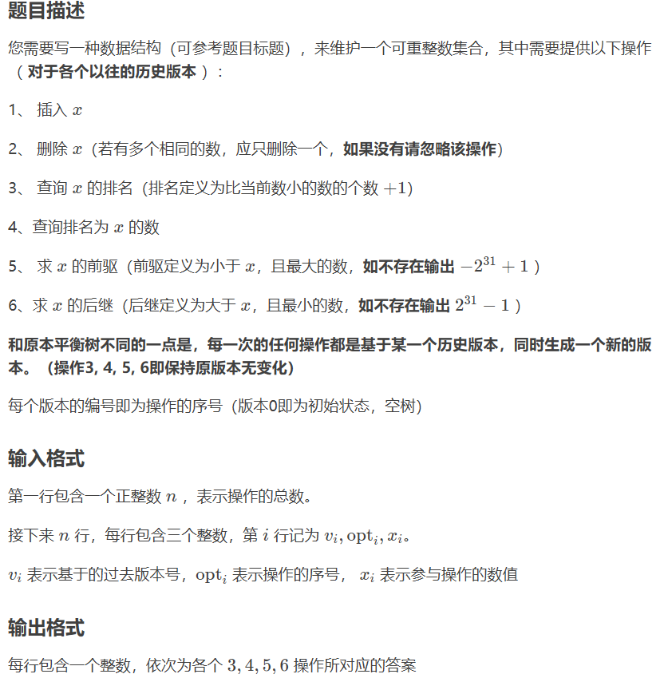

```c++
#include<bits/stdc++.h>
using namespace std;
struct node
{
    int l,r;int size,rnd,v;
}t[500005*50];
int cnt,rt[500005];
void update(int k)
{
    t[k].size=t[t[k].l].size+t[t[k].r].size+1;
}
void newnode(int &k,int x)
{
    t[k=++cnt].v=x;t[k].size=1;t[k].rnd=rand();
}
int merge(int a,int b)
{
    if(!a||!b)return a+b;
    if(t[a].rnd>t[b].rnd)
    {
        int p=++cnt;t[p]=t[a];
        t[p].r=merge(t[p].r,b);
        update(p);return p;
    }
    else
    {
        int p=++cnt;t[p]=t[b];
        t[p].l=merge(a,t[p].l);
        update(p);return p;
    }
}
void split(int now,int k,int &x,int &y)
{
    if(!now)x=y=0;
    else
    {
        if(t[now].v<=k)
        {
            x=++cnt;t[x]=t[now];
            split(t[x].r,k,t[x].r,y);
            update(x);
        }
        else 
        {
            y=++cnt;t[y]=t[now];
            split(t[y].l,k,x,t[y].l);
            update(y);
        }
    }
}
void Delete(int &root,int w)
{
    int x=0,y=0,z=0;
    split(root,w,x,z);
    split(x,w-1,x,y);
    y=merge(t[y].l,t[y].r);
    root=merge(merge(x,y),z);
}
void Insert(int &root,int w)
{
    int x=0,y=0,z=0;
    split(root,w,x,y);
    newnode(z,w);
    root=merge(merge(x,z),y);
}
int getval(int k,int w)
{
    if(w==t[t[k].l].size+1)return t[k].v;
    else if(w<=t[t[k].l].size)return getval(t[k].l,w);
    else return getval(t[k].r,w-t[t[k].l].size-1);
}
int getkth(int &root,int w)
{
    int x,y;
    split(root,w-1,x,y);
    int ans=t[x].size+1;
    root=merge(x,y);
    return ans;
}
int getpre(int &root,int w)
{
    int x,y,k,ans;
    split(root,w-1,x,y);
    if(!x)return -2147483647;
    k=t[x].size;
    ans=getval(x,k);
    root=merge(x,y);
    return ans;
}
int getnex(int &root,int w)
{
    int x,y,ans;
    split(root,w,x,y);
    if(!y)return 2147483647;
    else ans=getval(y,1);
    root=merge(x,y);
    return ans;
}
int main()
{
    int n,f,w,tim;
    scanf("%d",&n);
    for(int i=1;i<=n;++i)
    {
        scanf("%d%d%d",&tim,&f,&w);
        rt[i]=rt[tim];
        if(f==1)Insert(rt[i],w);
        else if(f==2)Delete(rt[i],w);
        else if(f==3)printf("%d\n",getkth(rt[i],w));
        else if(f==4)printf("%d\n",getval(rt[i],w));
        else if(f==5)printf("%d\n",getpre(rt[i],w));
        else printf("%d\n",getnex(rt[i],w));
    }
    return 0;
}
```

## 前缀树 Trie

支持以下操作：

- `insert(s, v)`：**插入**一个单词`s`，对应权重为`v`。
- `find(s)`：**查找**一个单词`s`，返回对应权重`v`。


```c++
#define MAXNODE 1005    // 最大节点数
#define SIGMA_SIZE 26   // SIGMA_SIZE是字符集大小。
struct Trie{
    int ch[MAXNODE][SIGMA_SIZE];     // ch[i][A]表示节点i的子节点a，ch[i][A]=0表示不存在。
    int val[MAXNODE];    // val[i]表示节点i(对应单词)的附加信息; 假定val[i]>0当且仅当i是单词节点
    int sz;     // 节点总数
    Trie () { sz = 1; memset(ch[0], 0, sizeof(ch[0]));}  // 初始只有一个根节点
    int idx(char c) { return c - 'a';}   // 字符c的编号
    // 插入字符串s，附加信息为v。注意v必须非0，因为0代表”本节点不是单词节点“
    void insert(char* s, int v){
        int u = 0, n = strlen(s);
        _for(i, 0, n){
            int c = idx(s[i]);
            if(!ch[u][c]){    // 节点不存在
                memset(ch[sz], 0, sizeof(ch[sz]));
                val[sz] = 0;   // 中间节点的附加信息为0
                ch[u][c] = sz++;  // 新建节点
            }
            u = ch[u][c];
        }
        val[u] = v; // 字符串最后一个字符的附加信息为v
    }
    int find(char* s){
        int u = 0, n = strlen(s);
        _for(i, 0, n){
            int c = idx(s[i]);
            if(!ch[u][c]) return 0;   // 不存在返回0
            u = ch[u][c];
        }
        return val[u];
    }
};
```

### AC自动机

Aho-Corasick自动机。适用于多个模式串的模式匹配问题。【离线算法】

- `insert(pattern)`：插入模式串（可多次插入）。
- `getFail()`：计算失配函数。
- `find(T)`：在文本`T`查找模式串。

```c++
#define MAXNODE 1005    // 最大节点数
#define SIGMA_SIZE 26   // SIGMA_SIZE是字符集大小
struct AC_Machine{
    int ch[MAXNODE][SIGMA_SIZE];     // ch[i][A]表示节点i的子节点a，ch[i][A]=0表示不存在
    int val[MAXNODE];    // val[i]表示节点i(对应单词)的附加信息; 假定val[i]>0当且仅当i是单词节点
    int sz;     // 节点总数
    AC_Machine () { sz = 1; memset(ch[0], 0, sizeof(ch[0]));}  // 初始只有一个根节点
    int idx(char c) { return c - 'a';}   // 字符c的编号
    // 插入字符串s，附加信息为v。注意v必须非0，因为0代表”本届点不是单词节点“
    void insert(char* s, int v){   // 借助Trie树
        int u = 0, n = strlen(s);
        _for(i, 0, n){
            int c = idx(s[i]);
            if(!ch[u][c]){    // 节点不存在
                memset(ch[sz], 0, sizeof(ch[sz]));
                val[sz] = 0;   // 中间节点的附加信息为0
                ch[u][c] = sz++;  // 新建节点
            }
            u = ch[u][c];
        }
        val[u] = v; // 字符串最后一个字符的附加信息为v
    }
    int f[MAXNODE], last[MAXNODE];
    void getFail(){       // 计算失配函数
        queue<int> Q;
        f[0] = 0;
        _for(c, 0, SIGMA_SIZE){  // 初始化队列
            int u = ch[0][c];
            if(u) {f[u] = 0; Q.push(u); last[u] = 0;}
        }
        while(!Q.empty()) {      // 按BFS顺序计算失配函数
            int r = Q.front(); Q.pop();
            _for(c, 0, SIGMA_SIZE){
                int u = ch[r][c];
                if(!u) { ch[r][c] = ch[f[r]][c]; continue;}
                Q.push(u);
                int v = f[r];
                while(v && !ch[v][c]) v = f[v];
                f[u] = ch[v][c];
                last[u] = val[f[u]] ? f[u] : last[f[u]];
            }
        }
    }
    void find(char* T){   // AC自动机，在文本串T中查找模板
        int n = strlen(T), j = 0;
        _for(i, 0, n){
            int c = idx(T[i]);
            j = ch[j][c];
            if(val[j]) print(j);
            else if(last[j]) print(last[j]);
        }
    }
    void print(int j){   // 递归打印以节点j结尾的所有字符串
        if(j){
            printf("%d: %d\n", j, val[j]);
            print(last[j]);
        }
    }
};
```

另外的AC自动机模板：

```c++
#include<cstdio>
#include<algorithm>
#include<cstring>
#include<queue>
#define reset(a) memset((a),0,sizeof((a)))
#define REP(i,a,b) for (int i=(a);i<=(b);i++)
using namespace std;
const int N=1e6+10;
const int M=151*71;
char s[151][71];
char T[N];
int m;
struct Aho_Corasick_Automaton{
    int NodeCnt,f[M],ch[M][26],cnt[M],val[M],last[M];
    void clear(){
        reset(f);reset(ch);reset(cnt);reset(val);reset(last);
        NodeCnt=0;
    }
    void insert(char *s,int index){
        int u=0,n=strlen(s);
        REP(i,0,n-1){
            int c=s[i]-'a';
            if (!ch[u][c])ch[u][c]=++NodeCnt;
            u=ch[u][c];
        }
        val[u]=index;
    }
    void getFail(){
        queue<int> Q;
        Q.push(0);
        while (!Q.empty()){
            int u=Q.front(),k=f[u];Q.pop();
            REP(c,0,25){
                int v=ch[u][c];
                if (!v){ch[u][c]=ch[k][c];continue;}
                f[v]=u?ch[k][c]:0;
                last[v]=val[f[v]]?f[v]:last[f[v]];
                Q.push(v);
            }
        }
    }
    void query(char *T){
        int u=0,n=strlen(T),res=0;
        REP(i,0,n-1){
            int c=T[i]-'a';
            u=ch[u][c];
            if (val[u])cnt[val[u]]++;
            int v=last[u];
            while (v){
                if (val[v])cnt[val[v]]++;
                v=last[v];
            }
        }
        REP(i,1,m)res=max(res,cnt[i]);
        printf("%d\n",res);      // 第一行输出模式串最多出现的次数
        REP(i,1,m)if (cnt[i]==res)printf("%s\n",s[i]);  // 每行输出一个出现次数最多的模式串，按输入顺序排列
        return;
    }
}AC;
int main(){
    while (scanf("%d",&m)==1 && m){
        AC.clear();
        REP(i,1,m){
            scanf("%s",s[i]);
            AC.insert(s[i],i);
        }
        AC.getFail();
        scanf("%s",T);
        AC.query(T);
    }
    return 0;
}
```

### 后缀自动机 SAM

给定一个只包含小写字母的字符串S，

请你求出 S 的所有出现次数不为 1 的子串的出现次数乘上该子串长度的最大值。

```c++
#include<bits/stdc++.h>
#define N 2000005
typedef long long ll;
using namespace std;
char s[N];
int a[N],c[N],size[N],n;
ll ans=0;
struct SuffixAutoMaton{
    int last,cnt;int ch[N<<1][26],fa[N<<1],l[N<<1];
    void ins(int c){
        int p=last,np=++cnt;last=np;l[np]=l[p]+1;
        for(;p&&!ch[p][c];p=fa[p])ch[p][c]=np;
        if(!p)fa[np]=1;
        else{
            int q=ch[p][c];
            if(l[p]+1==l[q])fa[np]=q;
            else{
                int nq=++cnt;l[nq]=l[p]+1;
                memcpy(ch[nq],ch[q],sizeof(ch[q]));
                fa[nq]=fa[q];fa[q]=fa[np]=nq;
                for(;ch[p][c]==q;p=fa[p])ch[p][c]=nq;
            }
        }
        size[np]=1;
    }
    void build(){
        scanf("%s",s+1);int len=strlen(s+1);
        last=cnt=1;for(int i=1;i<=len;i++)ins(s[i]-'a');
    }
    void calc(){
        for(int i=1;i<=cnt;i++)c[l[i]]++;
        for(int i=1;i<=cnt;i++)c[i]+=c[i-1];
        for(int i=1;i<=cnt;i++)a[c[l[i]]--]=i;
        for(int i=cnt;i;i--){
            int p=a[i];
            size[fa[p]]+=size[p];
            if(size[p]>1)ans=max(ans,1LL*size[p]*l[p]);
        }
        printf("%lld\n",ans);
    }
}sam;
int main(){
    sam.build();
    sam.calc();
}
```

#### 广义后缀自动机

求 $n$ 个串中，所有本质不同的子串个数。

```c++
#include<algorithm>
#include<cstdio>
#include<queue>
#define Re register int
#define LL long long
using namespace std;
const int N=2e6+5;
int n;char ch[N];
inline void in(Re &x){
    int fu=0;x=0;char c=getchar();
    while(c<'0'||c>'9')fu|=c=='-',c=getchar();
    while(c>='0'&&c<='9')x=(x<<1)+(x<<3)+(c^48),c=getchar();
    x=fu?-x:x;
}
struct Suffix_Automaton{
    int O,link[N],maxlen[N],trans[N][26];
    //link[i]: 后缀链接
    //trans[i]: 状态转移数组
    Suffix_Automaton(){O=1;}//根初始化为1
    inline int insert(Re ch,Re last){
        if(trans[last][ch]&&maxlen[last]+1==maxlen[trans[last][ch]])return trans[last][ch];//类Trie树形态建树，如果已有这个节点就不再构造了 
        Re x,y,z=++O,p=last,flag=0;maxlen[z]=maxlen[last]+1;
        while(p&&!trans[p][ch])trans[p][ch]=z,p=link[p];
        if(!p)link[z]=1;
        else{
            x=trans[p][ch];
            if(maxlen[p]+1==maxlen[x])link[z]=x;
            else{
                if(maxlen[p]+1==maxlen[z]/*或者写：p==last*/)flag=1;
                //p仍然为last，即存在trans[last][ch]，那么z肯定是一个没有任何用处的空节点
                //所以可直接将z作为x的复制点，也可以忽略z返回复制点y，这里采用的是后者 
                //普通SAM不存在这种情况
                y=++O;maxlen[y]=maxlen[p]+1;
                for(Re i=0;i<26;++i)trans[y][i]=trans[x][i];
                while(p&&trans[p][ch]==x)trans[p][ch]=y,p=link[p];
                link[y]=link[x],link[z]=link[x]=y;
            }
        }
        return flag?y:z;//注意返回值
    }
    inline void sakura(){
        LL ans=0;
        for(Re i=2;i<=O;++i)ans+=maxlen[i]-maxlen[link[i]];
        printf("%lld\n",ans);
    }
}SAM;
int main(){
//    freopen("123.txt","r",stdin);
    in(n);
    for(Re i=1;i<=n;++i){
        scanf("%s",ch+1);Re last=1;
        for(Re j=1;ch[j];++j)last=SAM.insert(ch[j]-'a',last);
    }
    SAM.sakura();
}
```

### 回文自动机 PAM

给定一个字符串 s。保证每个字符为小写字母。对于 s 的每个位置，请求出以该位置结尾的回文子串个数。

> 注意由于要求以 i 结尾，所以串长两两不等，这里的回文子串个数即为本质不同回文子串个数。

```c++
#include<iostream>
#include<cstdio>
#include<cstring>
using namespace std; 

const int N = 2e6 + 5; 
struct PAM_Trie
{
    int ch[26]; 
    int fail, len, num; 
}; 
struct PAM
{
    PAM_Trie b[N]; 
    int n, length, last, cnt, s[N]; 
    char c[N]; 
    
    PAM()
    {
        b[0].len = 0; b[1].len = -1; 
        b[0].fail = 1; b[1].fail = 0; 
        last = 0; 
        cnt = 1; 
    }
    void read()
    {
        scanf("%s", c + 1); 
        length = strlen(c + 1); 
    }
    int get_fail(int x)
    {
        while(s[n - b[x].len - 1] != s[n])
        {
            //printf("%d %d %d\n", x, n - b[x].len - 1, b[x].fail); 
            x = b[x].fail; 
        }
        return x; 
    }
    void insert()
    {
        int p = get_fail(last); 
        if(!b[p].ch[s[n]])
        {
            b[++cnt].len = b[p].len + 2; 
            int tmp = get_fail(b[p].fail); 
            b[cnt].fail = b[tmp].ch[s[n]]; 
            b[cnt].num = b[b[cnt].fail].num + 1; 
            b[p].ch[s[n]] = cnt; 
        }
        last = b[p].ch[s[n]]; 
    }
    void solve()
    {
        int k = 0; 
        s[0] = 26; 
        for(n = 1; n <= length; n++)
        {
            // c[n] = (c[n] - 97 + k) % 26 + 97;   // 【在线算法，解密操作】
            s[n] = c[n] - 'a'; 
            insert(); 
            printf("%d ", b[last].num); 
            k = b[last].num; 
        }
    }
}P; 
int main()
{
    P.read(); 
    P.solve(); 
    return 0; 
}
```

## 左氏堆

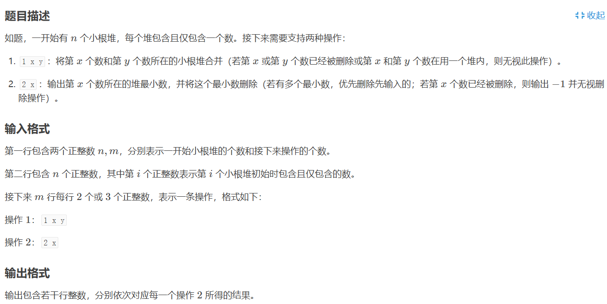

```c++
#include <cstdio>
#include <iostream>

#define MAXN 150010
#define swap my_swap
#define ls S[x].Son[0]
#define rs S[x].Son[1]

using namespace std ;
struct Tree{
    int dis, val, Son[2], rt ;
}S[MAXN] ; int N, T, A, B, C, i ;

inline int merge(int x, int y) ; 
int my_swap(int &x, int &y){ x ^= y ^= x ^= y ;}
inline int top(int x){ return S[x].rt == x ? x : S[x].rt = top(S[x].rt) ; }
inline void pop(int x){ S[x].val = -1, S[ls].rt = ls, S[rs].rt = rs, S[x].rt = merge(ls, rs) ; }
inline int merge(int x, int y){
    if (!x || !y) return x + y ; if (S[x].val > S[y].val || (S[x].val == S[y].val && x > y)) swap(x, y) ;
    rs = merge(rs, y) ; if (S[ls].dis < S[rs].dis) swap(ls, rs) ; S[ls].rt = S[rs].rt = S[x].rt = x, S[x].dis = S[rs].dis + 1 ; return x ;
}

int main(){
    cin >> N >> T ; S[0].dis = -1 ;
    for (i = 1 ; i <= N ; ++ i) 
        S[i].rt = i, scanf("%d", &S[i].val) ; 
    for (i = 1 ; i <= T ; ++ i){
        scanf("%d%d", &A, &B) ;
        if (A == 1){
            scanf("%d", &C) ;
            if (S[B].val == -1 || S[C].val == -1) continue ;
            int f1 = top(B), f2 = top(C) ; if (f1 != f2) S[f1].rt = S[f2].rt = merge(f1, f2) ;  // 合并操作
        }
        else {
            if(S[B].val == -1) printf("-1\n") ;
            else printf("%d\n", S[top(B)].val), pop(top(B)) ;   // 小根堆顶
        }
    }
    return 0 ;
}
```

## 散列表 Hash-Table

> 亦可直接使用STL的哈希容器。

```c++
struct hash_map {  // 哈希表模板
    struct data {
        long long u;
        int v, nex;
    };                // 前向星结构
    data e[SZ << 1];  // SZ 是 const int 表示大小
    int h[SZ], cnt;
    int hash(long long u) { return u % SZ; }
    int& operator[](long long u) {
        int hu = hash(u);  // 获取头指针
        for (int i = h[hu]; i; i = e[i].nex)
            if (e[i].u == u) return e[i].v;
        return e[++cnt] = (data){u, -1, h[hu]}, h[hu] = cnt, e[cnt].v;
    }
    hash_map() {
        cnt = 0;
        memset(h, 0, sizeof(h));
    }
};
```

## 并查集 Union-find Set

并查集是一种树形的数据结构，顾名思义，它用于处理一些不交集的 **合并** 及 **查询** 问题。 

```c++
#define MAXNODE 5005
struct uf_set{
    int f[MAXNODE], SIZE;
    int size[MAXNODE]; // 子树大小，初始为1
    uf_set(int s): SIZE(s) {
        _for(i, 0, SIZE) f[i] = i;  // i就在它本身的集合里
        _for(i, 0, SIZE) size[i] = 1;
    }
    int find(int x){ // ≈ O(!)
        return (f[x] == x) ? x: f[x] = find(f[x]); // 路径压缩
    }
    void Union(int x, int y){
        int xx = find(x), yy = find(y);
        if (xx == yy) return;
        if (size[xx] > size[yy])  //启发式合并，保证小的合到大的里
            swap(xx, yy);
        f[xx] = yy;
        size[yy] += size[xx];
    }
};
```

## 舞蹈链-精确覆盖问题

给定一个N行M列的矩阵，矩阵中每个元素要么是1，要么是0

你需要在矩阵中挑选出若干行，使得对于矩阵的每一列j，在你挑选的这些行中，有且仅有一行的第j个元素为1

```c++
int n,m,a[511][511],o[511],ans[511],con,t;//同上
struct dlx//写在结构体里方便以后直接使用
{
	int u[511][511],d[511][511],l[511][511],r[511][511];//上下左右指针
	void buiro(int x)//建行
	{
		for(register int y=1; y<=m; ++y)//枚举该行每个数
		{
			if(!a[x][y])//如果这个数是1
			{
				r[x][y]=0;//为了循环将该数右指针指向该行虚拟节点
				l[x][y]=l[x][0];//将该数左指针指向该行虚拟节点左指针节点即末尾
				r[x][l[x][y]]=y;//是双向链表所以指回来
				l[x][r[x][y]]=y;//同上
			}
		}
	}
	void addro(int x)//加入行，与建行差不多
	{
		for(register int y=r[x][0]; y; y=r[x][y])//枚举该行所有节点
		{
			d[x][y]=0;
			u[x][y]=u[0][y];
			d[u[x][y]][y]=x;
			u[d[x][y]][y]=x;
			o[y]++;//所在列 1 的数量加 1
		}
	}
	void delro(int x)//删除行
	{
		for(register int y=l[x][0]; y; y=l[x][y])//倒序枚举该行所有节点
		{
			d[u[x][y]][y]=d[x][y];//该节点的上相邻节点的上指针直接跳过该节点指向该节点下指针节点
			u[d[x][y]][y]=u[x][y];//同上
			o[y]--;//所在列 1 的数量减 1
		}
	}
} c;//对象（OP术语即结构体变量）
void dfs()//枚举
{
	if(!c.r[0][0])//如果列虚拟节点的那一行的行虚拟节点右节点指向自己即列都被删完了
	{
		for(register int i=0; i<con; ++i)//遍历 ans 数组
			printf("%d ",ans[i]);//输出解
		t=1;//t 赋 1 以快速退出
		return;//退出当前函数
	}
	register int g=INT_MAX,p=0;//g 是现存节点中最小的 o[i]，p 是拥有最小的 o[i] 的列的编号
	for(register int i=c.r[0][0]; i; i=c.r[0][i])//遍历所有现存的列
	{
		if(g>o[i])//如果小于当前最小 o[i]
			g=o[p=i];//把 g 赋成 o[i]，p 赋成 i
	}
	int v[511],k=0;//倒序插入会打乱该列顺序，需要我们记录所有需要枚举的行
	for(register int i=c.d[0][p]; i; i=c.d[i][p])//遍历第 p 列
	{
		v[k++]=i;//把列上的所有行加入 v 数组
	}
	for(int i=0;i<k;++i)//枚举所有需要枚举的行
	{
		int s[511],w=0;//记录被删掉的列以便回溯
		for(register int j=c.l[v[i]][0]; j; j=c.l[v[i]][j])//枚举当前行中出现的列
		{
			c.r[0][c.l[0][j]]=c.r[0][j];//删除此列虚拟节点
			c.l[0][c.r[0][j]]=c.l[0][j];
			while(c.d[0][j])//枚举出现在此列的行
				c.delro(s[w++]=c.d[0][j]);//并删掉它
		}
		ans[con++]=v[i];//将枚举行的加入 ans 数组
		dfs();//继续枚举
		if(t)//如果找到答案
			return;//就快速退出
		con--;//否则将当前枚举的行弹出
		for(register int j=c.r[v[i]][0]; j&&f[j]; j=c.r[v[i]][j])//遍历因当前行而删掉的列
		{
			c.r[0][j]=0;//将它的列虚拟节点恢复
			c.l[0][j]=c.l[0][0];
			c.r[0][c.l[0][j]]=j;
			c.l[0][c.r[0][j]]=j;
		}
		for(register int j=w-1; j>=0; --j)//倒序遍历因当前行而删掉的行
			c.addro(s[j]);//并恢复它
	}
}
int main()//主函数
{
	register char h;//快读使用
	scanf("%d%d",&n,&m);//读入n、m
	c.buiro(0);//建列虚拟节点的那一行
	for(register int i=1; i<=n; ++i)//当前行
	{
		for(register int j=1; j<=m; ++j)//当前列
		{
			do
			{
				h=getchar();
			}
			while(h!='0'&&h!='1');//快读
			a[i][j]='1'-h;//存进 a 矩阵
		}
		c.buiro(i);//先建行
		c.addro(i);//再加入当前行
	}
	dfs();//枚举
	if(!t)//如果无解
		printf("No Solution!");//则输出
}
```

## 动态树 Link Cut Tree

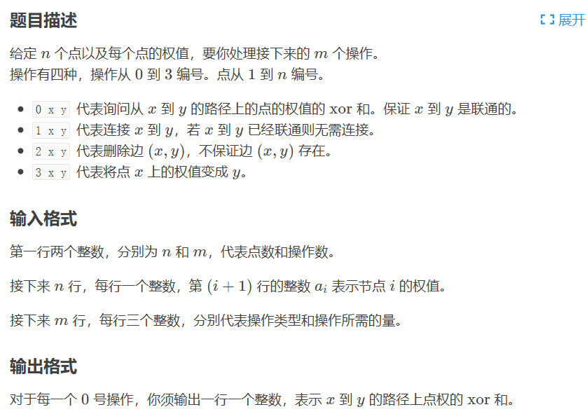

```c++
// luogu-judger-enable-o2
#include<cstdio>
#include<cstring>
#include<algorithm>
#define swap(x,y) x ^= y, y ^= x, x ^= y
const int MAXN=3 * 1e5 + 10;
inline int read()
{
    char c = getchar();int x = 0,f = 1;
    while(c < '0' || c > '9'){if(c == '-')f = -1;c = getchar();}
    while(c >= '0' && c <= '9'){x = x * 10 + c - '0',c = getchar();}
    return x * f;
}
#define fa(x) T[x].f
#define ls(x) T[x].ch[0]
#define rs(x) T[x].ch[1]
int v[MAXN];
struct node {
    int f, ch[2], s;
    bool r;
}T[MAXN];
int ident(int x) {
    return T[fa(x)].ch[0] == x ? 0 : 1;//判断该节点是父亲的哪个儿子 
}
int connect(int x,int fa,int how) {
    T[x].f=fa;
    T[fa].ch[how]=x;//连接 
}
inline bool IsRoot(int x) {//若为splay中的根则返回1 否则返回0 
    return ls( fa(x) ) != x && rs( fa(x) ) != x;
    //用到了两个性质
    //1.若x与fa(x)之间的边是虚边，那么它的父亲的孩子中不会有他（不在同一个splay内）
    //2. splay的根节点与其父亲之间的边是虚边 
}
void update(int x) {
    T[x].s = T[ls(x)].s ^ T[rs(x)].s ^ v[x];// 【维护路径上的异或和】
}
void pushdown(int x) {
    if(T[x].r) {
        swap(ls(x),rs(x));
        T[ls(x)].r ^= 1;
        T[rs(x)].r ^= 1;
        T[x].r = 0;//标记下传 
    }
}
void rotate(int x) {
    int Y = T[x].f, R = T[Y].f, Yson = ident(x), Rson = ident(Y);
    int B = T[x].ch[Yson ^ 1];
    T[x].f = R;
    if(!IsRoot(Y))
        connect(x, R, Rson);
    //这里如果不判断y是否根节点，那么当y是根节点的时候，0节点的儿子就会被更新为x
    //这样x就永远不能被判断为根节点，也就会无限循环下去了
    //但是这里不更新x的父亲的话就会出现无限递归的情况 
    connect(B, Y, Yson);
    connect(Y, x, Yson ^ 1);
    update(Y); update(x);
}
int st[MAXN];
void splay(int x) {
    int y = x, top = 0;
    st[++top] = y;
    while(!IsRoot(y)) st[++top] = y = fa(y);
    //用一个栈维护所有的标记
    while(top) pushdown(st[top--]);
    //因为在旋转的时候不会处理标记，所以splay之前应该下传所有标记 
    for(int y = fa(x); !IsRoot(x); rotate(x), y = fa(x))//只要不是根就转 
        if(!IsRoot(y)) 
            rotate( ident(x) == ident(y) ? x : y );
}
void access(int x) {//访问x节点 
    for(int y = 0; x; x = fa(y = x))
        splay(x), rs(x) = y, update(x);
}
void makeroot(int x) {//把x改为原树的根节点 
    access(x);
    splay(x);
    T[x].r ^= 1;
    pushdown(x);
}
int findroot(int x) {//找到x在原树中的根节点 
    access(x);splay(x);
    pushdown(x);
    while(ls(x)) pushdown(x = ls(x));//找到深度最小的点即为根节点 
    return x;
}
void split(int x, int y) {
    makeroot(x);//首先把x置为根节点 
    access(y); splay(y);
}
void link(int x, int y) {
    makeroot(x);//把x置为根节点 
    if(findroot(y) != x ) fa(x) = y;
}
void cut(int x, int y) {
    makeroot(x);
    if(findroot(y) == x && fa(x) == y && ls(y) == x && !rs(x)) { 
        fa(x) = T[y].ch[0] = 0;
        update(y);
    }
}
int main()
{
    #ifdef WIN32
    freopen("a.in","r",stdin);
    //freopen("a.out","w",stdout);
    #else
    #endif
    int N = read(), M = read();
    for(int i = 1; i <= N; i++) v[i] = read();
    for(int i = 1; i <= M; i++) {
        int opt = read(), x = read(), y = read();
        if(opt == 0) split(x, y), printf("%d\n",T[y].s);
        else if(opt == 1) link(x, y);
        else if(opt == 2) cut(x, y);
        else if(opt == 3) splay(x), v[x] = y;
    }
    return 0;
}
```

<div STYLE="page-break-after: always;"></div>

# STL4C++

## 顺序容器

### `vector` 向量

```c++
vector<int> V;
	vector<int> V(7); // 默认值初始化；int默认值为0
	vector<int> V(7, 1); // 自定义初始化，7个1
	vector<int> V{1,2,3}; // C++11全自定义初始化，[1, 2, 3]
vector<int>::iterator it; // 新建迭代器

V.push_back(t); // 在尾部插入元素
V[i]; // 索引元素，类似数组
V.pop_back(); // 弹出尾部元素
V.erase(pos); // 删去指定位置元素
	V.erase(pos1, pos2); // 删去指定范围[pos1, pos2)元素
V.clear(); // 清空
V.insert(it, x) // 插入

// 以下为顺序容器通用操作
V.empty(); // 判断是否为空
V.size(); // 返回数组大小
V.resize(); // 设置容器大小
V.begin(); V.end(); // 迭代器，分别指向首尾，类似指针
	V.cbegin(); V.cend(); // 常量迭代器，const.属性
	V.rbegin(); V.rend(); // reversed，反向迭代器，指向尾首
		V.crbegin(); V.crend(); // 常量反向迭代器
V.assign(A.cbegin(), A.cend()); // 赋值操作，类似延后构造
	V.assign(n, t);
swap(A, B); // 交换
reverse(A.begin(), A.end()); // 反转
```

自定义比较函数`cmp`：（以优先队列为例）

```c++
struct cmp {
    bool operator ()(int x, int y){
        return x > y; // x 小的优先级高
        //也可以写成其他方式，如：return p[x] > p[y]; 表示 p[i] 小的优先级高
    }
};
priority_queue<int, vector<int>, cmp>q;//定义方法
//其中，第二个参数为容器类型。第三个参数为比较函数。
```

### `string` 字符串

```c++
string S;

S[i]; // 索引元素，类似数组
	S[i] = tolower(S[i]); // 转为小写；需要循环
	S[i] = toupper(S[i]); // 转为大写
S.append("123"); // 追加字符串
S.erase(pos, len);// 删除子串，位置[pos, pos+len)
S.size(); S.length(); // 长度，O(1)
S.replace(11, 3, "5th"); // 从位置11开始删除3个字符并插入"5th"
	S.replace(it1, it2, str2); // 把S的迭代器[it1, it2)范围的子串替换为str2
s1 = S.substr(0, 3), // [0,3)子串
S.find("b",5); // 下标5开始,查找字符串b,返回b在s中的下标
S.rfind("b"); // 反向查找
S.find_first_of(ele); // 返回ele字符串中任意字符在s中第一次出现的下标位置，该函数的返回值是被搜索字符串的第 1 个字符第 1 次出现的下标（位置）
S.find_last_of(ele); // 返回值是被搜索字符串的最后 1 个字符的下标（位置）
S.find_first_not_of(ele); //查找S中与ele第一个不匹配的位置
S.find_last_not_of(ele);
to_string(A); // 将任何基本型转换为string
stoi(s, p, b); // 将string 转换为 int, p默认为0(保存指针), b默认为10(进制)
	stod(s); // 将string 转换为 double
	stoll(s); // 将string 转换为 long long
```

### `deque` 双端队列

```c++
deque<int> DQ;

DQ.push_front(ele); // 头部插入
DQ.push_back(ele);  // 尾部插入
DQ.insert(it, ele); // 在it迭代器位置之前插入元素
	DQ.insert(it, num, ele); // 插入num个ele
	DQ.insert(it, first, last); // 插入迭代器[first, last)所指内元素
DQ.erase(it); // 删除某个元素
	DQ.erase(first, last); // 删除迭代器[first, last)所指内元素
DQ.pop_front(); // 头部删除
DQ.pop_back();  // 尾部删除
DQ.at(pos); // 索引
DQ.front(); // 首元素的引用
DQ.back();  // 尾元素的引用
```

### `list` 双向链表

```c++
list<int> L;

// 支持deque的以上同名操作 
L.clear(); // 清空
L1.merge(L2, greater<int>());//合并后升序排列，实际上默认就是升序
```

#### `forward_list` 单向链表

> 只支持单向顺序访问。

```c++
forward_list<int> FL;

// forward_list不支持pop_back()， vector和string不支持pop_front()
FL.max_size(); // 返回最大支持容量，forward_list不支持size操作
FL.empty();
```

### `array` 固定数组

```c++
array<int， 100> A;
	array<double，100> A {}; // 初始化为100个0.0
	array<double，5> A {0.5, 1.0}; // 部分初始化: {0.5, 1.0, 0.0, 0.0, 0.0}
A.fill(3.1415926); // 设定所有元素为某值
```

### `stack` 栈

> stack/queue/priority_queue 均是顺序容器适配器。

```c++
stack<int> S; // 以deque为底层容器

S.push(i); // 压入元素，O(1)
S.emplace(inits); //构造并压入元素，inits必须是可供构造元素的数据
S.top(); // 读取栈顶，O(1)
S.pop();  // 弹出元素，无返回值，O(1)
S.empty(); S.size();  // O(1)
```

### `queue` 队列

```c++
queue<int> Q; // 以deque为底层容器

Q.push(i); // 压入元素，O(1)
Q.emplace(inits); //构造并压入元素，inits必须是可供构造元素的数据
Q.front(); Q.back(); // 读取队首/尾，O(1)
Q.pop();  // 弹出元素，无返回值，O(1)
Q.empty(); Q.size();  //O(1)
```

### `priority_queue` 优先队列

> 即完全二叉堆。

```c++
priority_queue<int> PQ;  // 以vector为底层容器，默认大根堆less<int>
priority_queue<int, vector<int>, greater<int>> PQ;  // 小根堆

PQ.push(i); // 压入元素，O(logN)
PQ.emplace(inits); //构造并压入元素，inits必须是可供构造元素的数据
PQ.top(); // 读取最高优先级元素，O(1)
PQ.pop();  // 弹出元素，无返回值，O(logN)
PQ.empty(); PQ.size();  // O(1)
```

## 关联容器

### `map` 映射

```c++
map<string, int> M;

M["top"] = 1; // 赋值添加元素
	M.at(key); // 另一种访问方式
M.find(key);  // O(logN)，返回迭代器
	if(M.find(key) != M.end());  // 判断是否存在
M.insert( make_pair(key, value) ); // 新建对并插入
	M.insert( pair<Tk, Tv>(key, value) );
	M.insert( {key, value} );
map<string, int>::iterator it = M.find(key); // 查找失败返回end()
	if(M.find(a) == M.end()) // 若没找到
M.erase(key); // 删去键所指定的对，O(logN)
M.erase(it);  // 删去迭代器指定的对，O(1)
M.size();   // O(1)
M.clear();  // O(N)
```

#### `multimap` 映射（可重复）

```c++
multimap<string, int> M;
```

#### `pair` 对

```c++
#include <utility>

pair<T1, T2> p;
pair<T1, T2> p(v1, v2);
make_pair(v1, v2);

it->first; it->second; // 通过first和secnod来引用值，it迭代器指向一个pair
p1 < p2; //如果p1.first<p2.first或者!(p2.first < p1.first)&& p1.second<p2.second，则返回true
p1 == p2 //p1.first == p2.first && p1.second == p2.second
```

pair可以看作如下结构体：

```c++
struct pair{
    typeName1 first;
    typeName2 second;
};
```

## 无序容器

### `set` 集合

> 尽管是“无序容器”，仍然可以$O(logn)$查找。（`set`中的元素自动递增排序）

```c++
set<int> S: // map 和 set 底层都基于红黑树
set <T, greater <T> > st; // 降序排列

S.insert(ele);  // O(logN)
S.find(ele);    // O(logN)，返回迭代器
S.erase(ele);   // O(logN)
	S.erase(it);   // O(1)，迭代器删除
S.size();   // O(1)
S.clear();  // O(N)
S.begin(); S.end(); // 迭代器
	for(set<int>::iterator it = S.begin(); it != S.end(); ++it){ } // 遍历
pair<itr, itr> s.equal_range(T e); //返回键值等于e的元素区间;
int s.count(T e); //返回键值为e的元素的个数;
itr s.upper_bound(T e); //返回大于e的第一个元素位置;
itr s.lower_bound(T e); //返回大于等于e的第一个元素位置;
```

#### `multiset` 集合（可重复）

```c++
set<int> S: // map 和 set 底层都基于红黑树

S.insert(ele);
S.erase(ele);
S.size();
S.begin(); S.end(); // 迭代器
```

### `bitset` 位图

```c++
bitset <int n> b; //n为二进制位数（位图的大小）
bitset <int n> b(unsigned num);
bitset <int n> b(string s); //s为字符串形式的二进制位

b[3] = 1; b[0] = true; // 赋值 / 读取
int b.size(); //返回位数
int b.count(); //返回为1的位数个数
bool b.any(); //返回是否有为1的位
bool b.none(); //范围是否没有为1的位
bitset b.set(); //全部位赋值为1
bitset b.set(int p); //将p位赋值为1
bitset b.set(int p, bool num); //将p位设置为num
bitset b.reset(); //全部位赋值为0
bitset b.reset(int p);
bitset b.flip(); //全部取反
bitset b.flip(int p);
unsigned long b.to_ulong(); //返回为ulong，超出报错
unsigned long long b.to_ullong(); //返回为ull，超出报错
string b.to_string(); //返回为string
```

> 不定长的`bitset`，请使用（奇葩的）`vector<bool>`。

## 哈希容器

当不需要元素排序时，尽量使用基于Hash算法的哈希容器获得更好的查找性能。C++11引入了哈希容器。

### `unordered_map` / `unordered_set`

仅仅是底层实现不同，通用外部方法封装与`map` / `set`一致。例子如下：

```c++
unordered_map<string, int> um {
	{"Dijkstra", 1972}, {"Scott", 1976},
	{"Wilkes", 1967}  , {"Hamming", 1968}
};
um["Ritchie"] = 1983;
for(auto x : um) cout << "i" << x.first << "," << x.second << "}";
```

> 哈希容器还包括：`unordered_multimap` / `unordered_multiset`。

#### 自定义哈希函数

```c++
#include<functional>
int x;
int HASH = hash<int>() x; // 内置hash类只能对内置类型如int/string/vector等进行哈希值计算

hash<int> H; // hash数据结构重载了()运算符
int HASH = H(x);
```

对于自定义类型，需要提供自定义的Hash函数。例如：

```c++
struct Type{
    int x; string y;
    bool operator == (const Type& a) const{ // 重载==，提供判断碰撞的方法
        return x == a.x && y = a.y;
    }
}
struct HashFunc{ // 函数类，通过"()"重载来当函数使用
    std::size_t operator(){const Type &o} const{ // size_t约等于unsigned
        return ((hash<int>() (o.x) ^ (hash<string>() (o.y) << 1)) >> 1);
        // 通过移位+异或(XOR)获得哈希值
    }
}
int main(){
    unordered_map<Tpye, string, HashFunc> testHash ={
        { {1, "1"}, "one"},
        { {2, "2"}, "two"},
        { {3, "3"}, "three"}
    };
    for(const auto& kv : testHash)
        cout << kv.first.x << "," << kv.first.y << " - " << kv.second <<endl;
}
```

### STL容器-输出封装（`vector`/`set`）

```c++
template<typename T>
ostream& operator<<(ostream& os, const vector<T>& v){ // vector输出流
    for(int i = 0; i < v.size(); i++)
        os<<v[i]<<" ";
    return os;
}

template<typename T>
ostream& operator<<(ostream& os, const set<T>& v){ // set输出流
    for(typename set<T>::iterator it = v.begin(); it != v.end(); i++)
        os<<*it<<" ";
    return os;
}
```

使用方法：

```c++
vector<int> a; a.push_back(1); a.push_back(2); a.push_back(3);
cout << a; // 输出：1 2 3
set<string> b; b.insert("1"); b.inset("2"); b.insert("3");
cout << b; // 输出：1 2 3
```

## C++算法库


### 操作

| 算法 | 作用 |
| ---- | ---- |
| **`swap(a, b)`**                    | 交换                                                 |
| **`for_each(beg, end, func)`** | 对 `[beg, end)`中的每个元素均调用`func`函数 |
| **`next_permutation(beg, end, cmp)`** | 下一个排列；就地；参数为迭代器`[beg, end)` |
| `prev_permutation(beg, end, cmp)` | 上一个排列                                   |
| `fill(a, a + n, x)` / `fill_n(a, n, x)` | 更新；将a数组中前n项设为数字x                        |
| `memset(a，b，n)`                   | 设置；b可为`0` / `-1` / `0x3f`(Inf.)；<br />前n项设为数字b（char型初始化函数） |
| `unique(beg, end, cmp)`                 | 唯一化 |
| **`reverse(beg, end)`**           | 反转；参数为迭代器`[beg, end)`                     |
| `rotate(beg, mid, end)`                 | 旋转；操作后变为`[mid, end)+[beg, mid)`；<br />返回旋转前beg元素的新位置 |
| `equal(beg1, end1, beg2)` | 判断两个序列是否全等 |
| `copy(beg, end, dest)` / `copy_n(beg, n, dest)` | 复制 |
| `copy_if(beg, end, dest, func)` | 选择性复制；满足`func`返回`true` |
| **`merge(beg1, end1, beg2, end2, dest, cmp)`** | 有序归并 |
| `inplace_merge(beg, mid, end, cmp)` | 就地有序归并 |
| `replace(beg, end, old_e, new_e)` | 选择性替换 |
| `replace_if(beg, end, func, new_e)` | 根据`func`选择性替换 |
| `set_union(beg, end, beg2, end2, dest, cmp)` | 求并 |
| `set_intersection(beg, end, beg2, end2, dest, cmp)` | 求交 |
| `set_difference(beg, end, beg2, end2, dest, cmp)` | 求差；减去第二个序列中的元素 |
| `set_symmetric_difference(beg, end, beg2, end2, dest, cmp)` | 求对称差；所有只出现在一个序列中的元素 |
| `substr(beg, end)` | 返回`[beg, end)`子串 |

### 搜索

| 算法                                     | 作用                                                         |
| ---------------------------------------- | ------------------------------------------------------------ |
| **`find(beg, end, e)`**                  | 查找元素`e`                                                  |
| `find_if(beg, end, func)`                | 按条件查找；使得`func`返回`true`                             |
| `find_if_not(beg, end, func)`            | 按条件查找不满足的项；使得`func`返回`false`                  |
| `count(beg, end, e)`                     | 统计；在`[beg, end)` 内等于`e`的元素个数                     |
| `count_if(beg, end, func)`               | 统计；在`[beg, end)` 内使`func`返回`true`的元素              |
| `__builtin_popcount(x)`                  | `1`计数；计算`x`的二进制中`1`的个数                          |
| `all_of(beg, end, func)`                 | 是否`[beg, end)`全部命中；返回`bool`型                       |
| `any_of(beg, end, func)`                 | 任意命中                                                     |
| `none_of(beg, end, func)`                | 无一命中                                                     |
| `binary_search(beg, end, e, cmp)`        | 二分查找；返回`bool`                                         |
| **`lower_bound(a, a+a.size(), x, cmp)`** | 下界；查找 $\leq x$ 的第一个位置；`cmp`可选；返回一个迭代器  |
| `upper_bound(a, a+a.size(), x, cmp)`     | 上界；查找 $>x$ 的第一个位置                                 |
| `equal_range(beg, end, e, cmp)`          | 返回`pair`对`(A, B)`;<br />分别是`lower_bound`和`upper_bound`的返回值 |
| `min_element(beg, end, func)`            | 最小值；区间`[beg, end)`；`func`比较器是可选参数             |
| `max_element(beg, end, func)`            | 最大值                                                       |

### 排序

| 算法                                           | 作用                                                         |
| ---------------------------------------------- | ------------------------------------------------------------ |
| **`sort(beg, end, cmp)`**                      | 排序；默认升序`less`($<$)；<br />内置`greater` / `less_equal` / `greater_equal` |
| `stable_sort(beg, end, cmp)`                   | 稳定排序                                                     |
| `is_sorted(beg, end, cmp)`                     | 判断有序性                                                   |
| **`partial_sort(beg, beg+k, end, cmp)`**       | 部分排序；比如求**前 k 大元素**<br />将序列中前k小元素按顺序置于前k个位置<br />其他元素不保证顺序。O(nlogk) |
| **`nth_element(beg, nth, end, cmp)`**          | `nth`必须为迭代器，初始指向首位，最后返回所求位置；<br />比如求**第`n`大元素**；并且会按照该元素划分 |
| **`partition(beg, end, func)`**                | 快速划分；返回分割点                                         |
| `stable_partition(beg, end, func)`             | 稳定划分                                                     |
| `is_partitioned(beg, end, func)`               | 如果序列已被划分为`[满足 / 不满足]`；则返回`true`            |
| `partition_copy(beg, end, dest1, dest2, func)` | 将满足`func`的元素拷贝到`dest1`；其他拷贝到`dest2`           |
| `partition_point(beg, end, func)`              | 求分割点；返回前段的`end()处`                                |

### 数学

| 算法                                                        | 作用                                                         |
| ----------------------------------------------------------- | ------------------------------------------------------------ |
| `min(a, b, cmp)` / `min(seq, cmp)`                          | 最小值；`seq`是一个序列                                      |
| `max(a, b, cmp)` / `max(seq, cmp)`                          | 最大值                                                       |
| `min_element(beg, end, cmp)` / `max_element(beg, end, cmp)` | 序列最大/最大元素（返回迭代器）                              |
| `__gcd(a,b)`                                                | 最大公约数                                                   |
| `lexicographical_compare(beg1, end1, beg2, end2, cmp)`      | 字典序比较                                                   |
| `accumulate(beg, end, init, op)`                            | 序列求和；`init`为初值<br />`op`可自定义二元运算<br />返回`init`的类型 |
| `inner_product(beg1, end1, beg2, init, op1, op2)`           | 内积；`init`为初始值；<br />`op1`和`op2`为可选的广义加法/乘法 |
| `partial_sum(beg, end, dest, op)`                           | 计算后缀数组；<br />每一个新元素等于其前缀的累计和           |
| `iota(beg, end, e)`                                         | 将每一项分别设为`[e, e+1, ...]`                              |
| `sqrt(x)` / `cbrt(x)`                                       | 开方 / 立方根                                                |
| `exp(x)`                                                    | e指数                                                        |
| `pow(x, y)`                                                 | x^y幂                                                        |
| `log(x)`                                                    | ln对数                                                       |
| `log10(x)`                                                  | lg对数                                                       |
| `abs(x)` / `fabs(d)`                                        | 绝对值 / 浮点绝对值                                          |
| `sin(x)` / `cos(x)` / `tan(x)` / `atan(x)`                  | 三角函数                                                     |
| `ceil(x)` / `floor(x)`                                      | 向上/下取整                                                  |

## C++特殊语法

### 模板 `template`

```c++
template <typename T>
T func(T a){
    T b;
    // ...
    return b;
}
template <typename T1, typename T2>
struct Map{
    T1 key; T2 value;
    // ...
}
```

### 类型推导 `auto`

```c++
for (auto i: S) // 简约遍历法
  cout<<i<<endl;

for (auto& i: S) // 需要修改时，引用
  vis(i);
```

这种写法中，`for`循环会从头到尾遍历一遍`S`容器，将其中的值取出。需要注意的是，如果要修改元素的值的话，应该声明成引用`auto& i`。

需要注意的是，`auto`关键字是类型推断而不是动态类型，用`auto`声明的变量**必须初始化**，并且确定类型后就不能更改。

### 匿名函数 `lambda`

函数式编程在需要的地方定义函数，而不是提前定义好才能用。

```c++
// 指明返回类型
auto add = [](int a, int b) -> int { return a + b; };
// 自动推断返回类型
auto multiply = [](int a, int b) { return a * b; };

int sum = add(2, 5);   // 输出：7
int product = multiply(2, 5);  // 输出：10

// 函数变量
std::function<void(int)> add = [&total](int x) {total += x;};
for_each(begin(list), end(list), add);
// auto自动推导
auto add2 = [&total](int x) {total += x;};
for_each(begin(list), end(list), add2);

// 作为参数的匿名函数
struct TS{int a, b;} tss[105];
sort(tss, tss+100, [](const TS& t1, const TS& t2){
    return t1.a != t2.a ? t1.a < t2.a : t1.b < t2.b;
});

int total;
vector<int> list{1,2,3};
for_each(list.begin(), list.end(), [&total](int x) { // 匿名函数，捕捉total
    total += x;  // 计算累积和
});
```

### 空指针 `nullptr`

`NULL`宏 = 常整数`0`。`nullptr`关键字代表值类型`std::nullptr_t`，语义上可理解为空指针。

```c++
char *p = nullptr;
if(p)  // 可以转换为bool的false
```

<div STYLE="page-break-after: always;"></div>

# STL4Python3

计算量小的模拟题，可以尝试利用Python。

## 数据转换

| 函数                           | 功能                                            |
| ------------------------------ | ----------------------------------------------- |
| `int(a, base)`                 | 从base进制(可选)转为整型/10进制（可以处理**2~36进制**的字符串） |
| `bin(a)` / `oct(a)` / `hex(a)` | 转为2/8/16进制的字符串（去前缀`print(a[2:])`）  |
| `float(a)`                     | 转为浮点型；失败抛出`ValueError`                |
| `str(a)`                       | 转为字符串                                      |
| `set(L)`                       | 转为集合                                        |
|`type(a)`|  查看元素类型|
|`'ABC'.join(s_list)`| 列表转为字符串，分隔符为`ABC` |
|`list(STR)`| 将字符串转为列表；分字 |
|`STR.split("ABC")`| 将字符串转为列表；分隔符为`ABC` |
|`ord(c)` / `chr(i)`| 字符转ASCII 数值  /  ASCII 数值转字符 |

> 常用类型：`int`，`float`，`str`；`list`，`set`。

### 数据格式化输出

**整数格式化**：

> %o —— oct 八进制
> %d —— dec 十进制
> %x —— hex 十六进制

```python
>>> print('%o' % 20)
24
>>> print('%d' % 20)
20
>>> print('%x' % 20)
14
```

**浮点格式化**：

> %f ——保留小数点后面六位有效数字
> 　　%.3f，保留3位小数位
> %e ——保留小数点后面六位有效数字，指数形式输出
> 　　%.3e，保留3位小数位，使用科学计数法
> %g ——在保证六位有效数字的前提下，使用小数方式，否则使用科学计数法
> 　　%.3g，保留3位有效数字，使用小数或科学计数法

```python
>>> print('%f' % 1.11)  # 默认保留6位小数
1.110000
>>> print('%.1f' % 1.11)  # 取1位小数
1.1
>>> print('%e' % 1.11)  # 默认6位小数，用科学计数法
1.110000e+00
>>> print('%.3e' % 1.11)  # 取3位小数，用科学计数法
1.110e+00
>>> print('%g' % 1111.1111)  # 默认6位有效数字
1111.11
>>> print('%.7g' % 1111.1111)  # 取7位有效数字
1111.111
>>> print('%.2g' % 1111.1111)  # 取2位有效数字，自动转换为科学计数法
1.1e+03
```

## 序列

以下为通用的序列操作：（`list`，`str`，`tuple`，`range`）

| 运算                   | 结果                                                         |
| ---------------------- | ------------------------------------------------------------ |
| **`x in s`**           | 如果 *s* 中的某项等于 *x* 则结果为 `True`，否则为 `False`    |
| `x not in s`           | 如果 *s* 中的某项等于 *x* 则结果为 `False`，否则为 `True`    |
| `s + t`                | *s* 与 *t* 相拼接                                            |
| `s * n` 或 `n * s`     | 相当于 *s* 与自身进行 *n* 次拼接                             |
| **`s[i]`**             | *s* 的第 *i* 项，起始为 0                                    |
| `s[i:j]`               | *s* 从 *i* 到 *j* 的切片                                     |
| `s[i:j:k]`             | *s* 从 *i* 到 *j* 步长为 *k* 的切片                          |
| **`len(s)`**           | *s* 的长度                                                   |
| **`min(s)`**           | *s* 的最小项                                                 |
| **`max(s)`**           | *s* 的最大项                                                 |
| `s.index(x[, i[, j]])` | *x* 在 *s* 中首次出现项的索引号（索引号在 *i* 或其后且在 *j* 之前） |
| **`s.count(x)`**       | *x* 在 *s* 中出现的总次数                                    |

### 列表 `list`

```python
L = []

# 矩阵(深拷贝)
Matrix = [[0 for i in range(n)] for i in range(m)]  # m*n阶矩阵: M[m][n]
```

除了通用的序列操作，对于可变序列`list`还支持：

| 运算                      | 结果                                                         |
| ------------------------- | ------------------------------------------------------------ |
| `s[i] = x`                | 将 *s* 的第 *i* 项替换为 *x*                                 |
| `s[i:j] = t`              | 将 *s* 从 *i* 到 *j* 的切片替换为可迭代对象 *t* 的内容       |
| `del s[i:j]`              | 等同于 `s[i:j] = []`                                         |
| `s[i:j:k] = t`            | 将 `s[i:j:k]` 的元素替换为 *t* 的元素                        |
| `del s[i:j:k]`            | 从列表中移除 `s[i:j:k]` 的元素                               |
| **`s.append(x)`**         | 将 *x* 添加到序列的末尾 (等同于 `s[len(s):len(s)] = [x]`)    |
| **`s.clear()`**           | 从 *s* 中移除所有项 (等同于 `del s[:]`)                      |
| `s.copy()`                | 创建 *s* 的浅拷贝 (等同于 `s[:]`)                            |
| `s.extend(t)` 或 `s += t` | 用 *t* 的内容扩展 *s* (基本上等同于 `s[len(s):len(s)] = t`)  |
| `s *= n`                  | 使用 *s* 的内容重复 *n* 次来对其进行更新                     |
| **`s.insert(i, x)`**      | 在由 *i* 给出的索引位置将 *x* 插入 *s* (等同于 `s[i:i] = [x]`) |
| `s.pop([i])`              | 提取在 *i* 位置上的项，并将其从 *s* 中移除                   |
| **`s.remove(x)`**         | 删除 *s* 中第一个 `s[i]` 等于 *x* 的项目。                   |
| **`s.reverse()`**         | 就地将列表中的元素逆序。`a[: :-1]`可以达到同样的输出效果。   |

### 字符串 `str`

```python
S = "123"
```

除了通用的序列操作，对于字符串`str`还支持：

| 运算                | 结果                                                         |
| ------------------- | ------------------------------------------------------------ |
| `'Py' in 'Python'`  | 如果 字符串 中的某子串等于 前者 则结果为 `True`，否则为 `False` |
| `S.lower()`         | 转换为小写串                                                 |
| `S.upper()`         | 转换为大写串                                                 |
| `S.split(seq)`      | 以`seq`为分隔符，转为分割后的列表                            |
| `S.replace(s1, s2)` | 将`S`中的`s1`串替换为`s2`（`s2 == ''`时相当于删除）          |

## 字典 `dict`（哈希表）

```python
d = {}
```

字典`dict`支持以下操作：

| 运算                        | 结果                                                         |
| --------------------------- | ------------------------------------------------------------ |
| `list(d)`                   | 返回字典 *d* 中使用的所有键的列表。                          |
| `len(d)`                    | 返回字典 *d* 中的项数。                                      |
| `d[key] = value`            | 将 `d[key]` 设为 *value*。                                   |
| `key in d` / `key not in d` | 如果 *d* 中（不）存在键 *key* 则返回 `True`，否则返回 `False`。 |
| `d.clear()`                 | 清空                                                         |

## 集合 `set`

```python
x = set(['Alice', `Bob`])
```

集合 `set`支持以下操作：

| 运算                                                   | 结果                                           |
| ------------------------------------------------------ | ---------------------------------------------- |
| `s.add(ele)`                                           | 添加元素                                       |
| `s.remove(ele)`                                        | 删除；删除失败引发`KeyError`                   |
| `s.discard(ele)`                                       | 安全删除（如果有则删除）                       |
| `d.clear()`                                            | 清空 |
| `update(others)` / `set |= other`                      | 求并，更新集合，添加来自 others 中的所有元素。 |                                        |
| `intersection_update(others)` / `set &= other`         | 求交。                                         |
| `difference_update(others)` / `set -= other`           | 求差。                                         |
| `symmetric_difference_update(others)` / `set ^= other` | 对称差。                                       |

## 数学

```c++
from math import *
```

| 运算                                                         | 结果                  |
| ------------------------------------------------------------ | --------------------- |
| `floor(x)` / `ceil(x)`                                       | 下/上取整             |
| `comb(n, m)`                                                 | 求组合数C(n,m)        |
| `factorial(x)`                                               | 求阶乘`x!`            |
| `gcd(a, b)`                                                  | 最大公约数            |
| `exp(x)` / `log(x, base)` / `log2(x)` / `log10(x)` / `pow(x,y)` | 幂指函数              |
| `sqrt(x)`                                                    | 平方根                |
| `sin(x)` / `cos(x)` / `tan(x)` / `asin(x)` / `acos(x)` / `atan(x)` | 三角函数              |
| `dist(a, b)`                                                 | 计算两点欧氏距离      |
| `pi` / `e` / `tau = 2*pi` / `inf` / `nan`                    | 常量。`inf`浮点正无穷 |

<div STYLE="page-break-after: always;"></div>

# STL4Java

当需要高精度整数时，可以考虑Java。

## 高精度类 `BigInteger` & `BigDecimal`

> Java没有重载运算符。

```java
import java.io.*;
import java.util.*;
import java.math.BigInteger; // 高精度整数
import java.math.BigDecimal; // 高精度实数，使用方法类似
public class Main{
    public static void main(String args[]){
        Scanner sc = new Scanner(System.in);
        BigInteger A = sc.nextBigInteger();
        BigInteger B = sc.nextBigInteger();
        
        BigInteger C = new BigInteger("12354"); // 初始化
        BigInteger C = A.add(B); //加法
        C = A.subtract(B); //减法
        C = A.multiply(B); //乘法
        C = A.divide(B); //除法
        BigInteger[] C_ = A.divideAndRemainder(B); //带余减法，返回数组：[商, 余数]
        A.equals(B); //判等
        A.comareTo(B); //A小于B返回-1，等于返回0，大于返回1
        A.mod(B); //取模
        A.gcd(B); //求最大公约数 
		A.max(B); //求最大值 
		A.min(B); //求最小值
        A.abs(); //绝对值
        A.pow(B); //A的B次幂
        A.modPow(B, mod);  // 求幂并取模
        System.out.print(C);
    }
}
```

> Java的乘法复杂度与Python类似。但是写法比较繁琐。


---

---

---

本文内容很多并非原创，是摘取于互联网的模板。因时间仓促而无法一一注明，在此一并感谢。望周知。