# 机试（100）

一般在当天下午1:00-5:30。（2020改为3小时，允许查看离线板子）

机试难度大约在 【**<font color=blue>提高组</font>**，**<font color=purple>省选</font>**】 之间。

一般分为：模拟题，数学题，算法题。

可用语言：c++、java、python3。

> 2019年，编译选项有g++、javac、python3。（ubuntu和windows双系统）
>
> - windows：vs2008、codeblocks、dev c++
> - ubuntu：codeblocks、vscode
>
> PS，学堂在线开了新课：[算法设计与分析](https://www.xuetangx.com/courses/course-v1:TsinghuaX+2018122106X+2018_T2/about)。

## 基本信息

### 总时间

- `30`分钟熟悉环境
- `4`小时正式上机

### 题量

`3`道题。（含签到题）

### 黑盒测试

黑盒测试，现场给出结果。

### 提交限制

2018：每题最多32次有效提交，得分取最高的一次。

2017：每道题目可以多次提交，但只有最后一次编译通过的提交算作有效提交，其他提交均不计入成绩。

## <font color=red>特别注意事项</font>

- **<font color=red>允许携带纸质资料</font>**。 （这意味着必须**提前准备模板**）
- **<font color=red>允许使用`STL`</font>**。（**S**tandard **T**emplate **L**ibrary）
- 计入`I/O`操作时间。（这意味着大量IO时必须优化）

## 测试环境

### 语言和编译器

- `C++`：GCC 5.4.0，编译选项包括-O2 和-DONLINE_JUDGE，考生可自选-
  std=c++11
- `C`：GCC 5.4.0，编译选项包括-O2 和-DONLINE_JUDGE，考生可自选-std=c11
- `Java`：OpenJDK 1.8.0

### 评测机环境

- 操作系统：Ubuntu 16.04 64-bit
- 编译器：GCC 5.4.0、OpenJDK 1.8.0

### 工作环境

- 操作系统：Windows 7 64 位
- 集成开发环境：Microsoft Visual Studio 2008, Code::Blocks 16.01, Eclipse 2.0.1

## 2020

### 网络练习赛

#### 网络练习赛须知

1. 除提交答案题或题目本身有说明的情况，评测采取黑盒测试。每道题目会准备若干组测试数据，对于每组数据分别运行你的程序并检查是否在限制的时间、空间中正确运行得到答案，机器会根据你正确的数据组数给出这道题目的得分。这意味着任何导致机器不能顺利得到正确答案的操作都会让你丢分，甚至零分，包括但不限于：输出多余信息、访问越界、空间开得过大等，因此你需要非常关注程序的正确性。 
2. 同一个选手的同一道题目的两次提交之间的时间长度不应小于 10 秒，前一次提交后 10 秒之内的提交可能会被系统忽略。 
3. 测试的时间以评测网站为准。测试结束后无法再进行提交，但之前的有效提交将会继续评测。不接受任何以时间差异为由的补交。 
4. 评测按照提交的时间顺序进行，提交结果的返回时间长度没有严格保证，与现场的提交情况和评测机和运行情况有关。按照经验，一般会在数秒至数分钟后获得结果，临近结束时可能会较慢，甚至无法在测试结束前获得结果。 
5. 你的答案通过在线评测系统提交，有效提交指可以通过编译的提交。每道题目可以进行 **32  次有效提交**，剩余提交次数结算机制为：在提交时扣减 1，在获得编译失败的评测结果后增加 1，剩余次数为 0  时不能提交。选手可在每次提交之后获得本次提交的评测结果，选手每道题目的最终得分取决于**选手这道题目所有提交中的最高分**。 
6. 选手编写的程序应该使用标准输入输出，不应该使用任何文件操作。 
7. 评测时使用的时间为 Linux 系统的 **real time**。与 user time 相比，程序的 IO  操作等将被算入运行时间。 
8. 除非题目允许，你的程序无法使用任何非常见系统调用，包括但不限于访问网络、建立新线程等，错误使用将可能被评测系统判为零分。 

#### 评测环境和评测语言

- 操作系统：Ubuntu 18.04 64-bit 
- 编译器
  - C++：GCC 7.3.0，编译选项包括-O2 和-DONLINE_JUDGE 和 -std=c++11 
  - C：GCC 7.3.0，编译选项包括-O2 和-DONLINE_JUDGE 和-std=c11 
  - Java：OpenJDK 11.0.1 
  - Python：Python2.7 以及 Pyhton3.6 只允许使用语言自带标准库 

# OJ列表

建议有机会可以参加学堂在线`Code+`比赛。

>  [**洛谷**](https://www.luogu.org/) 训练，优先解决提高组到省选的**模版题**
>
>  [2020机试OJ](http://oj.thusaac.com/#!/) 2020年机试环境
>
>  [**TsOJ**（慕课）](https://dsa.cs.tsinghua.edu.cn/oj/foyer.shtml) 校内教学
>
>  [AcWing](https://www.acwing.com/problem/search/1/?csrfmiddlewaretoken=yJvfsrzPiXIkzRaHzGoIc6ydZpSRgI0AuFGm9OxWxA8ULa8Gq8lPp1a1aC1ZAqed&search_content=%E6%B8%85%E5%8D%8E) 清华推研机试题
>
>  [N诺](http://noobdream.com/Major/school_show/) 清华往年机试题
>
>  [牛客网](https://www.nowcoder.com/kaoyan/retest/1001) 考研专题
>
>  [牛客竞赛](https://ac.nowcoder.com/)
>
>  [Code+](https://cp.thusaac.com/) 校内比赛（失效？）
>
>  **[清橙](http://www.tsinsen.com/resources.page)** 机试环境（已失效，可下载竞赛资料）
>
>  [**Virtual Judge**（中转）](https://vjudge.net/) 
>
>  [PTA -浙大](https://pintia.cn/problem-sets)  甲级比较接近机试（稍简单）
>
>  [Codeforces](http://codeforces.com/) ACM向
>
>  [Project Euler（数论专用）](https://projecteuler.net/recent) 数学题训练
>
>  [LibreOJ](https://loj.ac/) 
>
>  [HDOJ](http://acm.hdu.edu.cn/) 
>
>  [PKU_OJ](http://poj.org/) 
>
>  [LeetCode](https://leetcode.com/) 
>
>  [LintCode 领扣](https://www.lintcode.com/)
>
>  [hihoCoder](https://hihocoder.com/hiho) 
>
>  [HackerRank](https://www.hackerrank.com/) 
>
>  [AtCoder](https://atcoder.jp/) 
>
>  [UOJ](http://uoj.ac/) 
>
>  [TUOJ.首页](https://oj.thusaac.com/#!/) 
>
>  [ZOJ](http://acm.zju.edu.cn/onlinejudge/) 
>
>  [Kick Start](https://codingcompetitions.withgoogle.com/kickstart) 
>
>  [51Nod](http://www.51nod.com/focus.html) 
>
>  [OpenJudge](http://openjudge.cn/) 
>
>  [BZOJ](https://www.lydsy.com/JudgeOnline/problemset.php) 
>
>  [Topcoder](https://www.topcoder.com/) 
>
>  [BestCoder](http://bestcoder.hdu.edu.cn/) 
>
>  [algorithm](https://stackoverflow.com/questions/5799559/how-to-make-the-sequence-a-non-decreasing-sequence-with-the-minimum-number-of-st/33865020#33865020) 
>
>  [SZKOpuł（波兰OJ，质量高）](https://szkopul.edu.pl/problemset/) 
>
>  [Timus Online Judge](http://acm.timus.ru/problemset.aspx) 
>
>  [SGU](http://acm.sgu.ru/problemset.php?show_volumes) 
>
>  [CTF夺旗](https://ctf-wiki.github.io/ctf-wiki/) 
>
>  [Coderbyte（Eg初）](https://coderbyte.com/) 
>
>  [Coding Games（Eg游戏）](https://www.codingame.com/) 
>
>  [GeeksforGeeks](https://www.geeksforgeeks.org/) 

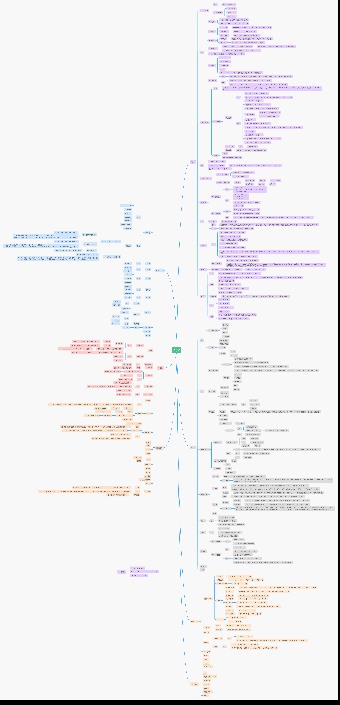

# 真题

> [Code+程序设计大赛习题讲解](http://www.xuetangx.com/courses/course-v1:xuetangx+codeplus+2019_T1/courseware/5cf3b2b837eb4e3f90641d2a208ab922/c67c968eb5914aabb36257ea30068158/) 含2017年机试
>
> [清华机试2017-2019真题](https://xuanxuanblingbling.github.io/life/study/2019/03/11/TUOJ/) 作者已被录取，[C++机试STL、树、图](https://xuanxuanblingbling.github.io/life/study/2019/03/20/STL/)，[C++机试技巧](https://xuanxuanblingbling.github.io/life/study/2019/03/20/oj/)
>
> [清华大学历年机试真题精讲](http://www.noobdream.com/Major/article/40/)
>
> [AcWing清华近年机试题库](https://www.acwing.com/problem/search/1/?csrfmiddlewaretoken=UZ0RkRdayFYeSpH3WVUTz1gKiUVY2QydpJWP1u2OHs7zXr9TELRuA3j1ObGSscKt&search_content=%E6%B8%85%E5%8D%8E)

每年真题的风格不尽相同。但是**每道题一般会存在多个考点**。

一定要对数据范围充分分析。

## 2019

***语言及编译选项信息***

| #    | 名称           | 编译器  | 额外参数                      | 代码长度限制（B） |
| ---- | -------------- | ------- | ----------------------------- | ----------------- |
| 0    | g++            | g++     | -O2 -DONLINE_JUDGE            | 65536             |
| 1    | g++ with std11 | g++     | -O2 -std=c++11 -DONLINE_JUDGE | 65536             |
| 2    | gcc            | gcc     | -O2 -DONLINE_JUDGE            | 65536             |
| 3    | java           | javac   |                               | 65536             |
| 4    | python3        | python3 |                               | 65536             |

### 众数（普及）

> http://www.noobdream.com/DreamJudge/Issue/page/1534/

#### 题目描述

某个序列有`n`个正整数，每个正整数都是`m`位数，某科研人员想统计该序列各个位的“众数”。第`i`（`1<=i<=m`）位的众数是指，`n`个正整数的第`i`位出现次数最多的**最小**数字。最低位（个位）是第1位，最高位是第m位。

#### 输入格式

从标准输入读入数据。

输入的第一行包含两个正整数`m`，`n`。保证$n \leq 10^5, m \leq 6$。

输入的第二行包含`n`个正整数。

同行相邻两个整数用一个空格隔开。

#### 输出格式

输出到标准输出。

输出共m行，每行一个整数，第`i`行表示第`i`位的众数。

#### 样例1输入

```
3 1
1 2 0
```

#### 样例1输出

```
0
```

第1位中，0、1、2各出现了一次，所以众数是0。

#### 样例2输入

```
3 2
11 12 20
```

#### 样例2输出

```
0
1
```

第1位中，0、1、2各出现了一次，所以众数是0。

第2位中，1出现了两次，2出现了一次，所以众数是1。

#### 子任务

子任务0（20分）：$n\leq 10, m\leq 2$。

子任务1（20分）：$n\leq 10^2, m\leq 4$。

子任务2（20分）：$n\leq 10^3, m\leq 6$。

子任务3（20分）：$n\leq 10^4, m\leq 6$。

子任务4（20分）：$n\leq 10^5, m\leq 6$。

#### Code $O(mn)$

分析题意，不难得出考点为：**数位分解**，**众数**。

分析复杂度，可知题目最大允许复杂度为：$O(m\times nlogn)$。

众数存在$O(n)$解法，数位分解存在$O(m)$解法。因此最优复杂度为$O(mn)$。

此题仅统计字符，因此可以当成字符串处理。

> 本题由于数字有限，可以直接统计而不必使用众数的减治算法。

```c++
#include<bits/stdc++.h>
using namespace std;

int cnt[6][10]; // 数字统计

int main(){
    int n, m; cin >> n >> m;

    for (int i = 0; i < n; ++i){ // 对每一个数
        string t; cin >> t;
        for(int j = 0; j < m; ++j){ // 每一位
            cnt[j][t[j] - '0'] ++; // 统计
        }
    }

    for(int i = m - 1; i >= 0; --i){ // 从低位向高位
        int count = 0, num = -1;
        for(int j = 9; j >= 0; --j){
            if(cnt[i][j] >= count){
                count = cnt[i][j];
                num = j;
            }
        }
        cout << num <<endl;
    }
	return 0;
}
```

### 升次方/高精度开根（省选）

> http://www.noobdream.com/DreamJudge/Issue/page/1535/
>
> https://www.luogu.com.cn/problem/P2293

#### 题目描述

“众所周知，世界的本质是电。”

你在上课的时候听到了这句话，看到了讲台上的wnn正在施展她的“升次方”。

wnn的升次方是这样进行的：选取两个正整数a、m，计算出$n=a^m$。由于你之前没有听课，现在你只知道n和m的值，你需要计算出a的值。

#### 输入格式

从标准输入读入数据。

输入的包括一行两个正整数n、m，以空格隔开，含义如题目描述。

对于所有的输入数据，保证$0\leq \text{lg}\,n \lt 7\times 10^4, 2\le m\le5$，且存在正整数a使$a^m=n$。

其中，$\text{lg}$表示以10为底的对数。

#### 输出格式

输出到标准输出。

输出一行一个正整数，表示wnn选取的a的值。

#### 样例1输入

```
4 2
```

#### 样例1输出

```
2
```

#### 样例1解释

由于$\sqrt 4 = 2$，故输出2。

#### 样例2

见题目目录下的2.in与2.ans。

#### 子任务

| 子任务编号 | $\text{lg}\,n \lt$ | 分数 |
| ---------- | ------------------ | ---- |
| 1          | 18                 | 10   |
| 2          | 200                | 30   |
| 3          | $10^3$             | 30   |
| 4          | $10^4$             | 20   |
| 5          | $7\times 10^4$     | 10   |

#### Code

> 注意到这里：**https://www.luogu.com.cn/problem/P2293**。可以发现与此题基本一致。
>
> > 但上题中的$m$范围较大（$m\leq 50$）。

考点：**高精度**，**二分法**，**快速傅里叶**，牛顿迭代法*。

注意到$n$需要高精度，而$m$的范围非常小。故每次二分答案时的复杂度取决于高精度乘法复杂度。

FFT可以实现$O(TlogT)$计算高精度乘法，$T$是整数位数。

故总复杂度为：二分$\times$FFT=$O(T^2logT)$，其中$T=\text{lg}\;n$。

##### 二分+FFT C++版本 $O(T^2logT)$ 0% 效率过低

板子很长，考验手速，花里胡哨，**效率不高**。写炸了也过不了点。

> FFT算法只有在数十万位的超大规模乘法中才显现出优势。以题中规模，采用FFT的效率并不理想。

```c++
#include<bits/stdc++.h>
using namespace std;
#define _OJ_ // 本地调试开关
#define MAXN 2000005
#define _for(i,a,b) for(int i =(a); i < (b); ++i) // 循环宏
#define _rep(i,a,b) for(int i =(a); i <= (b); ++i)

int readint(){  // 整数输入
    int x; scanf("%d", &x); return x;
}


struct Complex{
    double r ,i;
    Complex() {r = 0, i = 0;};
    Complex(double real, double imag): r(real), i(imag) {}
    Complex operator + (Complex A){ return Complex(r + A.r, i + A.i);}
    Complex operator - (Complex A){ return Complex(r - A.r, i - A.i);}
    Complex operator * (Complex A){ return Complex(r * A.r - i * A.i, r * A.i + i * A.r);}
};

struct BigInt{ // 仅限正整数
    vector<int> digit; // [低位 -> 高位)，与I/O顺序相反
    int BASE; // 进制

    BigInt(){BASE = 10;} // 默认十进制
    BigInt(int base){BASE = base;}
    BigInt(vector<int> &init, int base = 10){ // 传入已转换好的高精度数位数组和当前进制
        digit = init;
        BASE = base;
    }
    void clear(){ digit.clear();}
    void overflow(){ // 溢出进位
        for(int i = 0; i < digit.size(); ++i) {
            if(digit[i] >= BASE){
                if(i < digit.size() - 1){
                    digit[i + 1] += digit[i] / BASE;
                    digit[i] %= BASE;
                } else{
                    digit.push_back(digit[i] / BASE);
                    digit[i] %= BASE;
                }
            }
        }
    }

    BigInt operator +(const BigInt &A){  // 高精度加法
        BigInt ret(BASE);  // 采取前者的BASE，使用时注意保证两个数进制相同
        int max_size = max(digit.size(), A.digit.size());
        ret.digit.resize(max_size);
        for(int i =0; i < max_size; ++i){
            if(i <   digit.size()) ret.digit[i] +=   digit[i];
            if(i < A.digit.size()) ret.digit[i] += A.digit[i];
        }
        ret.overflow();
        return ret;
    }
    BigInt operator +(const int x){      // 普通加法
        BigInt ret = *this;
        ret.digit[0] += x;
        ret.overflow();
        return ret;
    }
    BigInt operator *(const int x){      // 普通乘法
        BigInt ret = *this;
        for(int i = 0; i < digit.size(); ++i)
            ret.digit[i] *= x;
        ret.overflow();
        return ret;
    }
    BigInt operator /(const int x){      // 普通除法
        BigInt ret(BASE); ret.digit.resize(digit.size());
        int remainder = 0; // 余数
        for(int i = digit.size() - 1; i >= 0; --i){ // 高位 -> 低位
            int t = (remainder * BASE + digit[i]) / x;
            int r = (remainder * BASE + digit[i]) % x;
            ret.digit.push_back(t); remainder = r;
        }
        reverse(ret.digit.begin(), ret.digit.end()); // 反置为[低位 -> 高位)
        while(ret.digit[ret.digit.size() - 1] == 0 && ret.digit.size() > 1) ret.digit.pop_back(); // 去掉前缀0
        return ret;
    }
    int operator %(const int x){         // 普通模运算
        int remainder = 0; // 余数
        for(int i = digit.size() - 1; i >= 0; --i) // 高位 -> 低位
            remainder = (remainder * BASE + digit[i]) % x;
        return remainder;
    }
    bool operator ==(const BigInt &A){
        if(digit.size() == A.digit.size()){
            for(int i = digit.size() -1; i >= 0; --i){
                if(digit[i] != A.digit[i]) return false;
            }
            return true;
        } else return false;
    }
    bool operator <(const BigInt &A){
        if(digit.size() == A.digit.size()){
            for(int i = digit.size() -1; i >= 0; --i){
                if(digit[i] < A.digit[i])
                    return true;
                else if(digit[i] > A.digit[i])
                    return false;
            }
            return false; // 相等时返回false
        } else return digit.size() < A.digit.size();
    }
    bool operator <=(const BigInt &A){
        if(digit.size() == A.digit.size()){
            for(int i = digit.size() -1; i >= 0; --i){
                if(digit[i] < A.digit[i])
                    return true;
                else if(digit[i] > A.digit[i])
                    return false;
            }
            return true; // 相等时返回true
        } else return digit.size() < A.digit.size();
    }
};

BigInt convert_to(BigInt A, int base){ // 进制转换
    BigInt ret(base);
    while(A.digit.size() > 1 || A.digit[0] > 0){ // 保证A>0
        ret.digit.push_back(A % base);
        A = A / base;
    }
    return ret;
}

string baseChar = "0123456789ABCDEF"; // 数位
istream& operator >>(istream &in , BigInt &A){
    A.clear(); string S; cin >> S;
    for(int i = S.size() - 1; i >= 0; --i){
        A.digit.push_back(baseChar.find(S[i]));
    }
    return in;
}

ostream& operator <<(ostream &out, BigInt A){
    for(int i = A.digit.size() - 1; i >= 0; --i)
        out << baseChar[A.digit[i]];
    return out;
}

const double PI = acos(-1);
int rev[MAXN], len, lim = 1;
Complex F[MAXN], G[MAXN]; // 转为复向量
void FFT(Complex *a, int opt = 1){
    for(int i = 0; i < lim; ++i) // O(n)置换预处理
        if(i < rev[i]) swap(a[i], a[rev[i]]);
    for(int dep = 1; dep <= log2(lim); ++dep){
        int m = 1 << dep;
        Complex wn = Complex(cos(2.0 * PI / m), opt * sin(2.0 * PI / m)); //主n次单位根
        for(int k = 0; k < lim; k += m){
            Complex w = Complex(1, 0); // 旋转因子
            for(int j = 0; j < m / 2; ++j){
                Complex t = w * a[k + j + m/2]; // 蝴蝶操作
                Complex u = a[k + j]; // 蝴蝶操作
                a[k + j] = u + t;
                a[k + j + m/2] = u - t;
                w = w * wn;
            }
        }
    }
    if(opt == -1) for(int i = 0; i < lim; ++i) a[i].r /= lim; // 逆FFT
}

BigInt operator * (const BigInt &A, const BigInt &B){
    lim = 1, len = 0;
    memset(rev, 0, sizeof(rev)); // 变量初始化
    memset(F, 0, sizeof(F));
    memset(G, 0, sizeof(G));
    int n = A.digit.size() - 1, m = B.digit.size() - 1;
    
    _rep(i, 0, n) F[i].r = A.digit[i];
    _rep(i, 0, m) G[i].r = B.digit[i];
    
    while(lim <= n + m) lim <<=1, len++; 
    _for(i, 0, lim)
        rev[i] = (rev[i>>1] >> 1) | ((i&1) << (len-1)); //位逆序置换
    FFT(F, 1); FFT(G, 1); // 傅里叶变换
    _rep(i, 0, lim) F[i] = F[i] * G[i]; // 逐项相乘
    FFT(F, -1); // 傅里叶逆变换
    
    BigInt ret(A.BASE); ret.digit.resize(n + m + 1);
    _rep(i, 0, n + m)
        ret.digit[i] = (int)(F[i].r + 0.5);
    
    ret.overflow();
    return ret;
}

BigInt qPower(const BigInt &A, int n){ // 按位展开
    vector<int> init(1, 1);

    BigInt ans(init, A.BASE), base = A;
    // cout << "... " <<A.BASE <<ans.BASE << base.BASE <<endl;
    while(n){
        if(n & 1) ans = ans * base; // 若位为1，说明有权重，需要乘上
        base = base * base;
        n >>= 1; // 右移1位
    }
    return ans;
}

BigInt compress4(BigInt &A){  // 压4位
    
    int tmp = 0, base = 1; BigInt ret(10000);
    for(int i = 0; i < A.digit.size(); ++i){
        tmp += A.digit[i]*base; base *= 10;
        if((i+1) % 4 == 0){
            ret.digit.push_back(tmp); tmp = 0; base = 1;
        }
        else if(i == A.digit.size() - 1){
            ret.digit.push_back(tmp);
        }
    }
    return ret;
}

int main(){
    // freopen("OJ.in", "r", stdin);

    // BigInt A,B;
    // while (cin >> A >> B ){
    //     cout << (A+B) /2 << endl;
        
    // }
    
    BigInt n; int m;
    cin >> n >> m;
    vector<int> init_0(1,0), init_1(1,1);
    BigInt le(init_0), ri(init_1);

    while (qPower(ri, m) < n){
        le = ri;
        ri = ri * 2;
    }
    cout << le << " " << ri <<endl;

    while((le + 1)< ri){
        BigInt mid = (le + ri) / 2;
        // cout << le << " " << mid <<" " << ri <<endl;
        BigInt t = qPower(mid, m);
        // cout << "current val: " << t <<endl;
        if(t <= n)
            le = mid;
        else
            ri = mid;
    }
    cout << le <<endl;
    
    return 0;
}
```

##### 二分剪枝 Python版本（无FFT） $O(\cfrac{1}{M}\times log^{2.585}N\times logM )$ 57%

通过对二分的上下界的准确定界预处理，使得效率增加。（当**M越大，效果越好**）

二分剪枝$O(\cfrac{1}{M}logN)$ $\times$ 高精度乘法$O((logN)^{1.585})$ $\times$ 快速幂$O(logM)$。

> `a**(1/b)`表示a的b次根，等价于`pow(a, 1/b)`，存在精度误差。

```python
#!/usr/bin/env python3
n, m = map(int, input().split(" "))
le, ri = 0, 1
while pow(ri, m) <= n:  # 剪枝
    le, ri= ri, 2*ri
# print(le, ri)
while le < ri - 1:  # O(log(ri - le))
    mid = (le + ri) >> 1
    t = pow(mid, m) # O(logn)
    if t <= n:
        le = mid
    else:
        ri = mid
print(le)
```

##### 二分剪枝 Java版本（同Python） 57%

```java
import java.io.*;
import java.util.*;
import java.math.BigInteger; // 高精度整数
import java.math.BigDecimal; // 高精度实数，使用方法类似
public class Main{
    public static void main(String args[]){
        Scanner sc = new Scanner(System.in);
        BigInteger n = sc.nextBigInteger();
        int m = sc.nextInt();
        
        BigInteger le = new BigInteger("0"), ri = new BigInteger("1");
        while( ri.pow(m).compareTo(n) != 1){
            le = ri;
            ri =  ri.multiply(new BigInteger("2"));
        }
        
        while (le.compareTo(ri.subtract(new BigInteger("1"))) == -1){
            BigInteger mid = le.add(ri).divide(new BigInteger("2"));
            BigInteger t = mid.pow(m);
            if (t.compareTo(n) != 1){
                le = mid;
            }
            else{
                ri = mid;
            }
        }
        
        System.out.print(le);
    }
}
```

### 论文/关键路径（提高）

> http://www.noobdream.com/DreamJudge/Issue/page/1536/

#### 题目描述

小H为了完成一篇论文，一共要完成n个实验。其中第i个实验需要$a_i$的时间去完成。

小H可以同时进行若干个实验，但存在一些实验，只有当它的若干前置实验完成时，才能开始进行该实验。

同时我们认为小H在一个实验的前置实验都完成时，就能马上开始实验。

为了让小H尽快完成论文，需要知道在最优的情况下，最后一个完成的实验什么时候完成？

小H还想知道，在保证最后一个实验尽快完成的情况下（即保证上一问的答案不变），他想知道每一个实验最晚可以什么时候开始。

设第i个实验最早可能的开始时间为$f_i$，不影响最后一个实验完成时间的最晚开始时间为$g_i$，请你回答$\prod_{i=1}^n (g_i-f_i+1)$除以$10^9+7$所得的余数。

题目保证有解。

#### 输入格式

从标准输入读入数据。

第一行输入一个整数n，m。

第二行输入n个正整数，$a_1,a_2,...,a_n$描述每个实验完成所需要的时间。

接下来读入m行，每行读入两个整数u、v，表示编号为u的实验时编号为v的实验的前置实验。

#### 输出格式

输出到标准输出。

第一行输出一个整数表示最晚完成的实验的时间。

第二行输出一个整数表示$\prod_{i=1}^n (g_i-f_i+1)$除以$10^9+7$所得的余数。

#### 样例1输入

```
7 5
11 20 17 10 11 17 17
5 4
6 1
7 3
2 4
2 1
```

#### 样例1输出

```
34
7840
```

#### 样例1解释

第一个点最早开始时间为20，最晚开始时间为23。

第二个点最早开始时间为0，最晚开始时间为3。

第三个点最早开始时间为17，最晚开始时间为17。

第四个点最早开始时间为20，最晚开始时间为24。

第五个点最早开始时间为0，最晚开始时间为13。

第六个点最早开始时间为0，最晚开始时间为6。

第七个点最早开始时间为0，最晚开始时间为0。
$$
ans=(23-20+1)\times(3-0+1)\times(17-17+1)\times(24-20+1)\times(13-0+1)
\\\times (6-0+1)\times (0-0+1) mod(10^9+7)=7840
$$

#### Code

##### 拓扑排序+超级节点

```c++
#include<bits/stdc++.h>
using namespace std;
#define _OJ_ // 本地调试开关
#define MAXN 20005
#define INF  INT_MAX  // or 1000000007  or 0x7fffffff
#define _for(i,a,b) for(int i =(a); i < (b); ++i) // 循环宏
#define _rep(i,a,b) for(int i =(a); i <= (b); ++i)
typedef long long ll;
typedef pair<string, string> pss;
typedef pair<int, int> pii;
typedef pair<string, int> psi;
const double PI = acos(-1.0);
const double eps = 1e-6;
const int MOD = 1e9 + 7;

int readint(){  // 整数输入
    int x; scanf("%d", &x); return x;
}


struct Edge{   // 带权边
    int from, to, dist;
    Edge(int u, int v, int d): from(u), to(v), dist(d) {}
};
vector<Edge> edges;    // edges具体保存边的信息
vector<int> G[MAXN];   // 邻接表G中只保存edge的编号，在edges中查询
int inDegree[MAXN];   // 入度
void AddEdge(int from, int to, int dist){  // 注意序号从0还是1开始！
    edges.push_back(Edge(from, to, dist));  // 压入边
    G[from].push_back(edges.size() - 1);  // 压入边号
    inDegree[to] ++;
}

ll earliest[MAXN], latest[MAXN];  // 保存结果，节点i的最早/最晚开始时间
void criticalPath(int n, int m){
    vector<int> topology;
    queue<int> Q;
    _for(i, 0, n)
        if(inDegree[i] == 0){
            Q.push(i);
            earliest[i] = 0;  // 如无特殊源点，初始化为0
        }
    while(!Q.empty()){
        int u = Q.front(); Q.pop();
        topology.push_back(u);
        _for(i, 0, G[u].size()){
            int v = edges[G[u][i]].to, d = edges[G[u][i]].dist;
            earliest[v] = max(earliest[v], earliest[u] + d);  // 更新
            inDegree[v] --;
            if(inDegree[v] == 0) Q.push(v);
        }
    }
    for(int i = topology.size() - 1; i >= 0; --i){
        int u = topology[i];
        if(G[u].size() == 0){
            latest[u] = earliest[u];   // 汇点的最晚开始时间初始化
        } else{
            latest[u] = INF;           // 非汇点的最晚开始时间初始化
        }
        _for(j, 0, G[u].size()){
            int v = edges[G[u][j]].to, d = edges[G[u][j]].dist;
            latest[u] = min(latest[u], latest[v] - d);  // 更新
        }
    }
}

int main(){
    // freopen("OJ.in", "r", stdin);
    int n, m;
    cin >> n >> m;
    vector<int> a;
    _for(i, 0, n) a.push_back(readint());
    _for(i, 0, m){
        int from = readint() - 1, to = readint() - 1;
        AddEdge(from, to, a[to]);
    }
    _for(i, 0, n){
        AddEdge(n, i, a[i]);  // 超级源点
        AddEdge(i, n + 1, a[n + 1]);  // 超级汇点
    }
    criticalPath(n + 2, m);
    ll ret = 1;
    // _for(i, 0, n)
    //     cout << earliest[i] << " " << latest[i] << endl;
    _for(i, 0, n){
        ret *= (latest[i] - earliest[i] + 1); ret %= MOD;
    }
    ll max_latest = 0;
    _for(i, 0, n) max_latest = max(max_latest, latest[i]);
    cout << max_latest << endl;
    cout << ret << endl;
    
    return 0;
}
```

## 2019（推研）

### 判形状

输入第一行n和m，给n个节点m条边的有向图。判断是单链/树/有环/无环？输出最细致的定义。注意合法数据要求后面有m行，每一行是一个空格隔开的正整数。

## 2018

**测试环境**
*语言和编译器*
• C++：GCC 5.4.0，编译选项包括-O2 和-DONLINE_JUDGE，考生可自选-
std=c++11
• C：GCC 5.4.0，编译选项包括-O2 和-DONLINE_JUDGE，考生可自选-std=c11
• Java：OpenJDK 1.8.0
*评测机环境*
• 操作系统：Ubuntu 16.04 64-bit
• 编译器：GCC 5.4.0、OpenJDK 1.8.0
*工作环境*
• 操作系统：Windows 7 64 位
• 集成开发环境：Microsoft Visual Studio 2008, Code::Blocks 16.01, Eclipse 2.0.1

### 思考熊的马拉松（提高）

> 本题貌似源自[NOIP-2018提高组复赛的模拟试题](https://blog.csdn.net/weixin_33885676/article/details/94297390)。

#### 题目描述

今年，**n**只思考熊参加了清华大学校园马拉松比赛。马拉松的赛道是环形的，每圈 的长度是**A**，完成比赛需要跑**L**圈。

 比赛中，甲领先乙很长距离，绕过一圈或多圈后从后面追上了乙的现象叫做“套 圈”。套圈现象非常常见，例如：跑得比谁都快的**saffah**熊可以套某些熊**L-1**圈； **ufozgg**熊经常进行日常耐力训练，套圈次数和被套圈次数基本持平；而**Mulab**作为一 只老年熊，则是被套**L-1**圈的那种。

 与人不同的是，思考熊在跑步时都是匀速运动。**wyx**熊是这次比赛的计时员，他 统计了参赛的**n**只熊的速度**v1**， **v2**，......，**vn**（其中最大的一个是**saffah**熊的速度）。现在 **wyx**熊希望你告诉他，当速度最快的**saffah**熊到达终点时，场上所有熊中总共发生了 多少次套圈现象。

 注意：在**saffah**熊刚刚到达终点那一刻，如果甲恰好追上了乙，此时也算作甲将乙 套圈。

#### 输入格式

从标准输入中读入数据。

 输入的第一行包含**2**个整数**T**;**C**，分别表示这个测试点内数据的组数和这个测试 点的编号。对于所有测试点，保证**T = 10**。

 每组数据的第一行包含**3**个正整数**n**;**A**;**L**，分别表示思考熊的只数，跑道每圈的长 度和完成比赛所需要的圈数。保证**A**;**L<10^8**。

 第二行包含**n**个正整数**v1**， **v2**，......，**vn**，表示每只思考熊的速度。保证这些数互不 相同。

#### 输出格式

输出到标准输出中。

 输出**T**行，分别表示每组数据中，所有熊发生的套圈总次数。

#### 样例输入

```
4 0
2 1000 15
2 5
2 1000 13
9 4
5 1000 10
8 10 2 5 6
5 1000 17
8 10 2 5 7
```

#### 样例输出

```
9
7
38
61
```

#### 样例解释

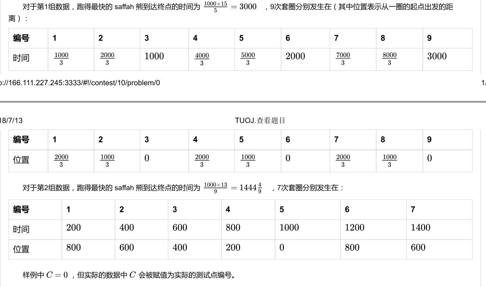

> 一共5个样例，其他4个放在题目目录下。

#### 子任务

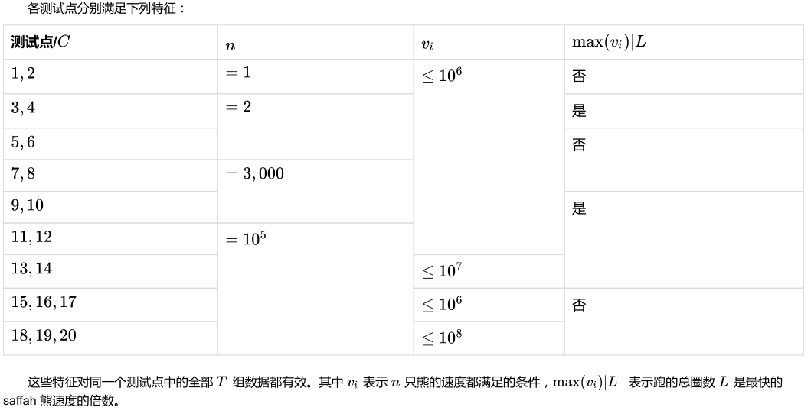

#### Code $O(nlogn)$

考点：$O(n)$求整数列的两两之差的和，$O(nlogn)$求逆序对。

```c++

```

### 棋盘（普及）

> 小葱的题倒是很多。。

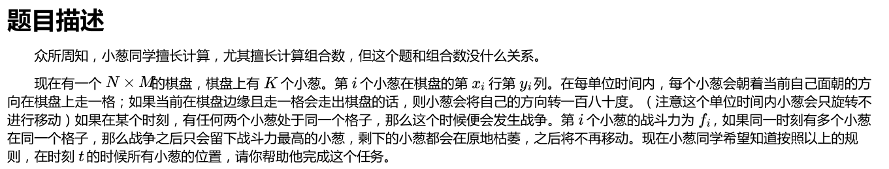

一个n乘m的棋盘，上面有k根葱，每根葱面朝方向为d（0123分别表示上下左右），没跟葱一个战斗力f。每隔时间葱会向面朝方向走一格，如果遇到棋盘边界，那么他将把面朝方向转180度（此回合葱不会走动），如果某个时刻有两个或以上的葱在同一位置，那么他们将发生战争，只有战斗力最高的葱存活，其他的葱全部原地枯萎，不在走动，求经过t时间后所有葱的位置

输入：第一行n m k，然后接下来k行每根葱的信息x y d f（坐标，方向，战斗力），最后一行输入时间t 输出：k行，分别表示每个葱的位置。 数据范围：n和m在100内，k在1000内，t在1000内，f在1000内，保证初始每颗葱位置不同，战斗力不同。

#### Code

```c++

```


### 路径（提高）

有n个点，每个点有一个权值，每两点间的不同边的个数为他们权值相与得到的值的二进制数字中的1的个数（边为有向边，有第i指向第j，i小于j）求第1个点到第n个点的路径个数（当且仅当不止一条边不同才被称为两条不同的路径），由于数据很大，对991247取模。

输入：第1行n，第二行分别试每个点权值 输出：路径个数 数据范围:n在2e5内，权值大小在1e9内

#### Code $O(n)$

> 摘自凡尘不尽。

本题看似是一个DAG上的DP问题，夹杂一个二进制`1`计数的trick。然而数据范围让人瞠目，$n\leq 2\times 10^5$。只能利用二进制的特性，简化复杂度。

`road[i][j]`表示第`0`到`i`个点的第`j`位的路径数（连到第`i+1`个点的第`j`位的`1`的路径数，或者前`i`个点以第`j`位为`1`的点结尾的路径数），`sum[i]`表示所求的到第`i`个点的路径总数。

```c++
sum[1] = 0
for i : [1, n - 1]
	for j : [0, 32]
        road[i][j] += (A[i][j] == 1) ? sum[i] : 0;
        sum[i + 1] += (A[i][j] == 1) ? road[i][j] : 0;
```

> 借助滚动数组，即可优化为`road[j]`和`sum`。

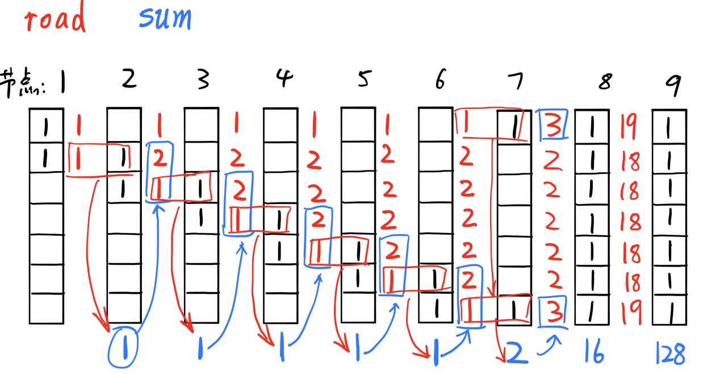

```c++
#include<cstdio>
#include<cstring>
#include<iostream>
using namespace std; 
const int N = 200000 + 10;
int road[32 + 10];
int nodes[N];

int main() {
	int i, j, n, sum, t;
	scanf("%d",&n);
	for(i = 0; i < n; ++i) {
		scanf("%d",&nodes[i]);
	}
	j = 0;
	t = nodes[0];
	while(t) {
		if(t&1) {
			road[j] = 1;
		}
		j++;
		t>>=1;
	}
	for(i = 1; i < n; ++i) {
		sum = j = 0; 
		t = nodes[i];
		while(t) {              //记录从1号点出发，路过2-i-1 号节点总共有多少种办法到i号点 
			if(t&1) {
				sum += road[j];
			}
			t >>=1;
			j++;
		}
		j = 0; 
		t = nodes[i];
		while(t) {              //在原先的路线基础上，加上通过第i点后的方案数 
			if(t&1) {
				road[j] += sum;
			}
			t >>=1;
			j++;
		}
	}

	printf("%d",sum);
	return 0;
}
```


## 2017

[2017年清华大学研究生招生计算机类上机考试](http://www.xuetangx.com/asset-v1:xuetangx+codeplus+2019_T1+type@asset+block/2017_%E5%B9%B4%E6%B8%85%E5%8D%8E%E5%A4%A7%E5%AD%A6%E7%A0%94%E7%A9%B6%E7%94%9F%E6%8B%9B%E7%94%9F%E8%AE%A1%E7%AE%97%E6%9C%BA%E7%B1%BB%E4%B8%8A%E6%9C%BA%E8%80%83%E8%AF%95.pdf)

[CODE+5.5 清华大学研究生招生计算机类上机考试复现练习赛题目讲解](https://zhanghuimeng.github.io/files/code+-5-5.pdf)， [张慕辉](https://zhanghuimeng.github.io/)


### 面试（interview）（普及）

#### 【题目描述】

生活在在外星球 X 上的小 Z 想要找一些小朋友组成一个舞蹈团，于是他在网上发布了信息，一共有 n 个人报名面试。面试必须按照报名的顺序依次进行。小 Z 可以选择在面试完若干小朋友以后，在所有已经面试过的小朋友中进行任意顺序的挑选，以组合成一个舞蹈团。

虽然说是小朋友，但是外星球 X 上的生态环境和地球上的不太一样，这些小朋友的身高可能相差很大。小 Z 希望组建的这个舞蹈团要求至少有 m 个小朋友，并且这些小朋友的最高身高和最低身高之差不能超过 k 个长度单位。

现在知道了这些小朋友的身高信息，问小 Z 至少要面试多少小朋友才能在已经面试过的小朋友中选出不少于 m 个组成舞蹈团。

#### 【输入格式】

从标准输入读入数据。

第一行 3 个整数 n,m,k，意义见题面描述；$1 ≤ m ≤ n ≤ 10^5$ ;$0 ≤ k ≤ 10^5 $；

第二行 n 个整数，第 i 个数 $h_i$ 表示第 i 个报名面试的小朋友的身高，$1 ≤ h_i ≤ 10^5$ 。

#### 【输出格式】

输出到标准输出。

如果可以选出舞蹈团，输出至少要面试多少人；否则输出 `impossible`。

#### 【样例 1 输入】

```
6 3 5
170 169 175 171 180 175
```

#### 【样例 1 输出】

```
4
```

#### 【样例 1 解释】

当面试了前 4 个小朋友之后，这些小朋友的身高分别为 170,169,175,171，可选出身高为 170,175,171 的小朋友组成舞蹈团，故只用面试 4 个小朋友即可。

#### 【样例 2 输入】

```
6 4 5
170 169 175 171 180 175
```

#### 【样例 2 输出】

```
6
```

#### 【样例 2 解释】

在这个样例中，小 Z 需要面试所有小朋友，才能选出身高为 170,175,171,175 的小朋友组成舞蹈团。

#### 【样例 3 输入】

```
6 5 5
170 169 175 171 180 175
```

#### 【样例 3 输出】

```
impossible
```

#### 【样例 4】

见题目目录下的 4.in 与 4.ans。

#### 子任务

本题目一共20个测试点，所有测试点均不开启O2优化。

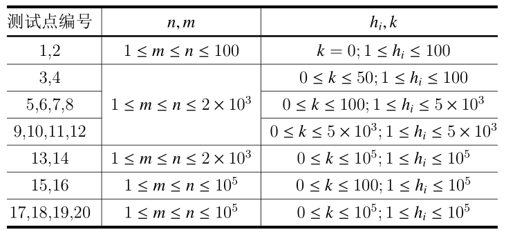

#### Code 二分+桶排序 $O((n+L)logn)$

注意是在前 $x$ 人中任意挑选。二分法，显然 $x$ 满足单调性：多加几个人后仍然能够找到符合要求的人，因此可以对答案进行二分。

注意身高的范围很小，可以直接开数组优化排序过程。从而验证过程可以在线性$O(n)$时间内解决。（通过桶排序转换为滑动窗口问题，进而可以按部更新窗口）

> $L$ 是 $h_i$ 的范围。


```c++

```

#### Code 线段树

该方法需要线段树模板。

根据$h_i$来建立线段树。a[i]表示身高为i到i+k的人数，那么每次插入一个身高y，则a[y-k]到a[y]都会++，线段树内部节点记录max。

由于要更新区间，必须采用懒标记。

```c++

```

### 扫雷（mine）（提高）

> https://www.luogu.com.cn/problem/P2670
>


**时间限制：** 1 秒 


**空间限制：** 512 MB

**相关文件：** 题目目录


#### 题目描述

扫雷（minesweeper）是一个有趣的单人益智类游戏，游戏目标是在最短的时间内根据棋盘上的提示信息，找出所有非雷方块，同时避免踩到地雷。随着桌面操作系统Windows的流行，其自带的扫雷游戏也因为有趣的玩法、精致的画面受到大家的欢迎。

小L的电脑上曾经也有一个扫雷游戏，它和主流的扫雷游戏基本相似，但是有一些不同的地方，具体介绍如下：

> 游戏开始时，玩家可以看到 $N\times M$ 个整齐排列的空白方块，玩家须根据棋盘已有的信息，运用逻辑推理来推断哪些方块含或不含地雷。
>
> 1. 玩家可以用鼠标左键点击空白方块，表示推断这个方块没有地雷，尝试探明它。
>
> * 如果玩家点开没有地雷的方块，会有一个数字显现其上，这个数字代表着八连通的相邻方块有多少颗地雷（至多为 $8$）
>
> * 如果这个方块八连通的方块中没有地雷（也即，方块显示的数字为 $0$），则系统会自动帮玩家点开它相邻的方块，这个过程**可能**会引起连锁反应。
>
> * 如果玩家点开有地雷的方块，则游戏结束，玩家失败。
>
> 2. 玩家可在推测有地雷的方块上点鼠标右键，表示放置旗帜来标明地雷的位置；在有旗帜的方块上再次点击右键，会使旗帜消失，成为空白的方块。在已标明旗帜的方块点击左键，方块不会有任何的变动。若在游戏进行中错置旗帜，可以用右键来改变方块状态。
>
> 3. 玩家可以在一个已探明的方块上同时点击左键及右键。此时，如果方块相邻的 $8$ 个方块放置旗帜的数目与方块上的数字相同，那么周围未探明的方块就会自动打开。然而，玩家若错置旗帜位置，此动作可能会打开真正藏有地雷的方块，导致游戏失败。不过这样的点击动作可加快游戏速度以便得到高分。

然而，年代久远，小 L 已经找不到当年陪他度过十年求学时光的扫雷游戏了，于是他找到了精通编程的你，希望你能帮他写一个简单的扫雷游戏，帮助他回忆那些快乐时光。

具体来说，你的程序应该读入一个地雷布置图。然后读入用户的每一次游戏操作，并在每次操作后给用户以反馈，帮助用户进行游戏。

#### 输入格式

从标准输入读入数据。

**约定：我们用坐标 $(x, y)$ 表示棋盘第 $x$ 行、第 $y$ 列的方块。**

第一行用空格隔开的两个整数 $n,m$，表示棋盘的规模。

接下来 $n$ 行，每行一个长为 $m$ 的字符串，描述棋盘，其中第 $i$ 行的第 $j$ 个字符表示棋盘的方块 $(i, j)$。为 `*` 表示方块里有一个地雷，为 `.` 表示方块是安全的。

接下来每一行按时间顺序描述每一次用户操作，直到文件结束。每一行的格式如下：

1. 首先读入一个字符串，表示这次操作的内容：

* Flag：表示右键点击某个方块，插上／撤销一面旗帜。
* Sweep：表示左键点击某个方块，判断这个方块没有地雷，要探明之。
* DSweep：表示左右键同时点击某个方块，尝试探明与它相邻的方块。
* Quit：表示放弃本局游戏并退出。

2. 若操作不为 Quit，则之后有空格隔开的两个整数 $x,y$，表示这次操作的坐标为 $(x, y)$，保证 $1\leq x\leq n$, $1\leq y\leq m$。

输入数据保证存在有且仅有一次 Quit 操作。

#### 输出格式

输出到标准输出。

对每一次操作，向标准输出打印一行或多行，表示此次操作的反馈。具体格式如下：

1. 若读入了 Quit，忽略之后的所有输入，结束本局游戏，输出结束信息（见第 $8$ 条）。
2. 对 Flag 操作：

* 如果对应方块已经被探明，输出一行 `swept`。
* 如果对应方块未被探明，插上旗帜，输出一行 `success`。
* 如果对应方块上有旗帜，清除之，输出一行 `cancelled`。

3. 对 Sweep 操作：

* 如果对应方块已经被探明，输出一行 `swept`。
* 如果对应方块上有旗帜，输出一行 `flagged`。
* 如果对应方块未被探明，进行扫雷过程，根据扫雷的结果，输出反馈信息（见第 $5、6$ 条）。

4. 对 DSweep 操作：

* 如果对应方块未被探明，输出一行 `not swept`。
* 如果对应方块数字为 $0$、或者它八连通的方块的旗帜数不等于方块显示的数，输出一行 `failed`。
* 否则，对方块八连通的每个**空白方块**进行扫雷过程，**所有扫雷过程结束之后**，根据扫雷的结果，输出反馈信息（见第 $6、7$ 条）。

5. 扫雷过程，假设要对 $(x, y)$ 进行扫雷：

* 如果 $(x,y)$ 为地雷，**扫雷失败**。输出一行 `boom`。接着，忽略之后的所有输入，结束本局游戏，输出结束信息（见第 $8$ 条）。

* 否则，标记这个方块为“已探明”，令这个方块显示它相邻的方块的地雷总数。如果它相邻的方块不存在地雷，则**自动**对它相邻的没有探明的方块进行扫雷（此时，清除它的相邻方块上的旗帜信息），这个过程**可能会**引起连锁反应。

6. 对 Sweep 操作，在扫雷过程**成功**结束之后输出扫雷反馈；对 DSweep 操作，在所有的扫雷过程（可能是 $0$ 次）**成功**结束之后输出扫雷反馈，格式如下：

* 如果没有任何新方块被探明（可能在 DSweep 时发生），输出一行：`no cell detected`。
* 否则，设有 $num\_of\_cells$ 个新方块被探明，首先输出一行：`NUM_OF_CELLS cell(s) detected`，其中 `NUM_OF_CELLS` 应该输出本次操作探明的方块数，**请注意括号的输出**。
* 接下来 $num\_of\_cells$ 行，将所有新探明的方块按照**所在行**为第一关键字，**所在列**为第二关键字，**从小到大**排序输出，每一行输出空格隔开的三个整数 $x,y,c$，其中 $x, y$ 表示方块的坐标，$c$ 表示方块上显示的数字。

7. 若某次 Sweep / DSweep 操作结束之后，所有没有地雷的方块均被探明，忽略之后的所有输入，结束本局游戏，输出结束信息（见第 $8$ 条）。

8. 结束信息的输出格式：

* 首先，输出游戏胜负情况：

  * 若所有没有地雷的方块均被探明，输出一行：`finish`；

  * 若踩到雷而结束游戏，输出一行：`game over`；

  * 若因为 Quit 而结束游戏，输出一行：`give up`。
* 之后，计算玩家使用的行动次数 $total\_step$，每次成功／不成功的 Flag, Sweep, DSweep 均视为一次行动，Quit 不算一次行动，输出一行：`total step TOTAL_STEP`，其中 `TOTAL_STEP` 应该输出行动次数。

**注意：请特别注意各项输出的拼写和空格，否则将可能导致程序错误直至零分。**


#### 样例1输入

```plain
3 3
...
..*
...
Sweep 1 1
DSweep 1 2
Flag 1 3
Flag 2 3
DSweep 1 2
Sweep 1 3
Flag 1 1
DSweep 1 3
Flag 1 3
DSweep 1 2
DSweep 1 2
Sweep 3 3
Quit

```


#### 样例1输出

```plain
6 cell(s) detected
1 1 0
1 2 1
2 1 0
2 2 1
3 1 0
3 2 1
failed
success
success
failed
flagged
swept
not swept
cancelled
1 cell(s) detected
1 3 1
no cell detected
1 cell(s) detected
3 3 1
finish
total step 12

```


#### 样例1解释

第一组数据展示了一个在简单的 $3\times 3$ 棋盘上进行的游戏过程，样例输出中展示了上文提到的绝大部分输出信息。

#### 样例2

见题目目录下的 *2.in* 与 *2.ans*。

#### 样例2解释

第二组数据展示了一种因为错误的 Flag 操作和 DSweep 操作而导致游戏失败的情况。


#### 样例3

见题目目录下的 *3.in* 与 *3.ans*。

#### 样例3解释

第三组数据展示了一种因为 Quit 操作而结束游戏的情况，注意，当游戏结束之后，你的程序应该输出结束信息，并忽略之后的所有操作。

#### 子任务

共有 $20$ 个测试点，每个测试点满分为 $5$ 分。

我们令 $n,m$ 表示棋盘的规模，$q$ 表示输入的操作次数，有以下约定：

| 测试点      | $n$         | $m$         | $q$          | 性质 |
| ----------- | ----------- | ----------- | ------------ | ---- |
| $1$ ~ $2$   | $\leq 10$   | $\leq 10$   | $\leq 60$    | A    |
| $3$ ~ $4$   | $\leq 10$   | $\leq 10$   | $\leq 60$    | B    |
| $5$ ~ $6$   | $\leq 10$   | $\leq 10$   | $\leq 60$    | 无   |
| $7$ ~ $8$   | $=1$        | $\leq 1000$ | $\leq 1000$  | A    |
| $9$ ~ $10$  | $=1$        | $\leq 1000$ | $\leq 1000$  | B    |
| $11$ ~ $12$ | $=1$        | $\leq 1000$ | $\leq 1000$  | 无   |
| $13$ ~ $14$ | $\leq 300$  | $\leq 300$  | $\leq 8000$  | A    |
| $15$ ~ $16$ | $\leq 300$  | $\leq 300$  | $\leq 8000$  | B    |
| $17$ ~ $19$ | $\leq 300$  | $\leq 300$  | $\leq 8000$  | 无   |
| $20$        | $\leq 1000$ | $\leq 1000$ | $\leq 60000$ | 无   |

性质A：保证只有 Sweep 操作和 Quit 操作。

性质B：保证没有 DSweep 操作。

注意：**对于规模较大的数据，请不要使用过于缓慢的输出方式。**

#### Code

> 写成DFS会爆栈。

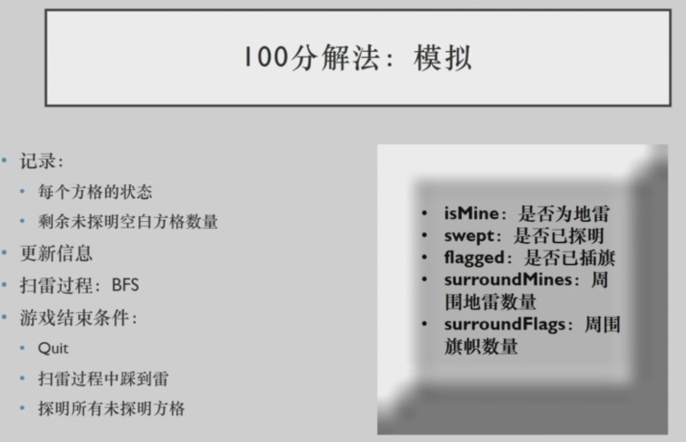

```c++

```

### 多项式求和（polynomial）（省选）

> https://www.cnblogs.com/obob/p/12400162.html

#### 【问题描述】

小 K 最近刚刚习得了一种非常酷炫的多项式求和技巧，可以对某几类特殊的多项式进行运算。

非常不幸的是，小 K 发现老师在布置作业时抄错了数据，导致一道题并不能用刚学的方法来解，于是希望你能帮忙写一个程序跑一跑。

给出一个 m 阶多项式
$$
f(x)=\sum_{i=0}^{m} b_{i} x^{i}
$$
对给定的正整数a，求
$$
S(n)=\sum_{k=0}^{n} a^{k} f(k)
$$
由于这个数可能比较大，所以你只需计算S(n)对$10^9+7$取模后的值。

#### 【输入格式】

从标准输入读入数据。

第一行包含三个整数 n,m,a。

第二行包含 m + 1 个整数，$b_0 ,b_1 ,...,b_m$ 描述给定多项式的系数。

对于所有数据，$1 ≤ a,b_i ≤ 10^9 $。

#### 【输出格式】

输出到标准输出。

输出一行一个数，表示 S(n) 对 $10^9 + 7 $取模后的结果。

#### 【样例 1 输入】

```
5 2 3
1 1 1
```

#### 【样例 1 输出】

```
9658
```

#### 【样例 1 解释】

$f(x)=1+x+x^{2}$，故$$f(0)=1, f(1)=3, f(2)=7, f(3)=13, f(4)=21, f(5)=31$$。

$f(0)+3 f(1)+9 f(2)+27 f(3)+81 f(4)+243 f(5)=1+3 * 3+9 * 7+27 * 13+81 *21+243 * 31=9658$。

#### 【样例 2 输入】

```
100 3 233
1 2 3 4
```

#### 【样例 2 输出】

```
994811687
```

#### 【样例 3 输入】

```
20170314 10 11037
1 2 3 4 5 6 7 8 9 10 11
```

#### 【样例 3 输出】

```
133604769
```

#### 【子任务】

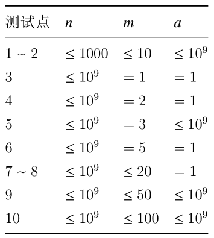

#### Code

考点：矩阵快速幂，二项式展开，组合数。

注意到数据范围，显然含有$O(n)$的算法是不可接受的。
$$
S(n)=\sum_{k=0}^{n} a^{k} \times \sum_{i=0}^{m} b_{i} k^{i}
$$
注意到 $S(n)$ 表达式中，指数 $k$ 的范围可达 $n$，因此正解必然存在某种形式的快速幂。

而对 $n$ 进行求和，同样是含有$O(n)$的算法，也是不可接受的。所以，快速幂必须同时求和。

如何实现快速幂的同时，完成求和呢？想到矩阵快速幂。

对于上式的左半部分：
$$
\sum_{k=0}^{n+1} a^{k} =\sum_{k=0}^{n} a^{k} +a^{n+1} \\
a^{n+2} = a\times a^{n+1}
$$
上面的递推公式写为矩阵形式：（记$F(n) = \sum_{k=0}^{n} a^{k}$）
$$
\left[\begin{array}{l}
F(n+1) \\
a^{n+2}
\end{array}\right]=\left[\begin{array}{ll}
1 & 1 \\
a & 0
\end{array}\right]\left[\begin{array}{c}
F(n) \\
a^{n+1}
\end{array}\right]
$$
**但我们注意到上式的右半部分也耦合了 $k$** ，所以为了实现解耦，我们要先对 $S(n)$进行恒等变形：
$$
S(n)= \sum_{i=0}^{m} b_{i} \times T(i,k) = \sum_{i=0}^{m} b_{i}\times \sum_{k=0}^{n} a^{k}  k^{i}
$$
现在要进行矩阵化更加困难了，新的计算对象是$T(i) = \sum_{k=0}^{n} a^{k} t(i,k)= \sum_{k=0}^{n} a^{k}  k^{i}$，
$$
\begin{align}
t(i+1,k) &=  a^{k}  {(k)}^{i+1} =  k\times t(i.k)\\
t(i,k+1) &=  a^{\color{red}{ {k+1} } }  {(k+1)}^{i}\\
&={\color{blue}{a} }\times a^{k}  {\color{red}{(k+1)}^{i} }\\
&=a\times a^{k}  \times \left[{\color{blue}{C_i^0k^0+C_i^1k^1+...+C_i^{i-1}k^{i-1}+C_i^ik^i } }\right]\\
&=a\times \left[ {\color{blue}{C_i^0 a^{k}k^0+C_i^1\sum_{k=0}^{n} a^{k}k^1+...+C_i^{i-1} a^{k}k^{i-1}+C_i^i a^{k}k^i } }\right]\\
&=a\times \left[ {\color{blue}{C_i^0t(0,k)+C_i^1t(1,k)+...+C_i^{i-1}t(i-1,k)+C_i^it(i,k) } }\right]\\
\end{align}
$$
注意到 $m$ 的范围始终很小，因此尽管上述公式展开后较复杂，仍然是一个常递推公式，可以矩阵化。
$$
\left[\begin{array}{l}
t(0,k+1) \\
t(1,k+1) \\
......\\
t(i,k+1) \\
\sum_{k'=0}^{k}t(i,k')\\
\end{array}\right]=
a\times
\left[\begin{array}{ll}
C(0,0) & 0 & 0& ...& ...&0 \\
C(1,0) & C(1,1) & 0& ...& ...&0 \\
...& ... & ...& ...& ...&... \\
C(i,0) & C(i,1) & C(i,2)& ...&...&C(i,i) \\
0 & 0 & ...& 0 & 1 & 1
\end{array}\right]\left[\begin{array}{c}
t(0,k) \\
t(1,k) \\
......\\
t(i,k) \\
\sum_{k'=0}^{k-1}t(i,k')
\end{array}\right]
$$
初始条件：
$$
\left[\begin{array}{c}
t(0,0) \\
t(1,0) \\
......\\
t(i,0) \\
\sum_{k'=0}^{0}t(i,k')
\end{array}\right]=
\left[\begin{array}{c}
1 \\
0 \\
...\\
0 \\
0
\end{array}\right]
$$
再次改造：
$$
\left[\begin{array}{l}
t(0,k+1) \\
t(1,k+1) \\
......\\
t(i,k+1) \\
\sum_{k'=0}^{k}\sum_{i=0}^{m} b_{i} t(i,k')\\
\end{array}\right]=
\left[\begin{array}{ll}
C(0,0)a & 0 & 0&...&0 \\
C(1,0)a & C(1,1)a & 0& ...&0 \\
...& ... & ...& ...&... \\
C(i,0)a & C(i,1)a & C(i,2)a&...&C(i,i)a \\
b_0 & b_1 & ...& b_m & 1
\end{array}\right]\left[\begin{array}{c}
t(0,k) \\
t(1,k) \\
......\\
t(i,k) \\
\sum_{k'=0}^{k-1}\sum_{i=0}^{m} b_{i} t(i,k')
\end{array}\right]
$$
就可以通过一次矩阵快速幂求出 $S(n)$了，时间复杂度为 $O(m^3logn)$。

```c++

```

#### Code 数学递推 $O(m^2logn)$

> 摘自龟神。

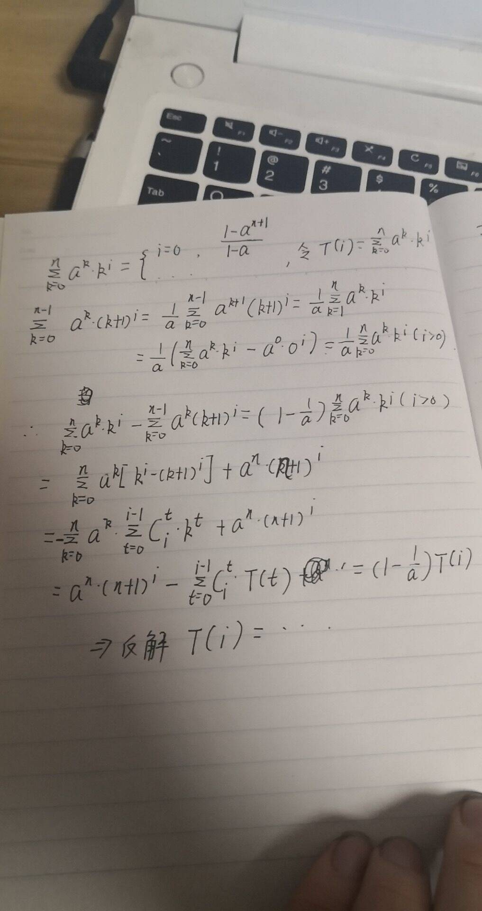

```c++
/*author:meetyouagain
  date:2020/4/8
  菜鸡标签，不喜勿喷！
*/
#include <bits/stdc++.h>
using namespace std;
#define ll long long
const ll mod = 1e9 + 7;
void test();
ll n,m,a,C[105][105],p,T[105],Pow[105],b[105];   //p为a-1的逆元,C为组合数，T[i]表示Σ(k=0~n)a^k*k^i,pow[i]表示(n+1)^i
ll qmi(ll d, ll k) //求d^k%mod
{
    ll res = 1 % mod, t = d;
    while (k)
    {
        if (k&1) res = res * t % mod;
        t = t * t % mod;
        k >>= 1;
    }
    return res;
}

void set_combination()  //设置组合数C(n,m)存储在C[n][m]中
{
    for(int i = 0;i < 105;i++)
        for(int j = 0;j <= i;j++)
         if(j == 0 || i == j) C[i][j]=1;
         else if(i == 0) C[i][j] = 0;
         else
             C[i][j] = (C[i-1][j-1] + C[i-1][j]) % mod;
}
void set_inverse(ll u)    //把p设为a-1的逆元
{
   p = qmi(u,mod - 2);
}
void input()
{
    cin>>n>>m>>a;
    for(int i = 0;i <=m;i++)
        scanf("%lld",&b[i]);
}
void solve()
{
    Pow[0] = 1;
    ll S = qmi(a,n+1);
    for(int i = 1;i <= m + 1;i++)
        Pow[i] = (Pow[i-1] * (n+1)) % mod;
    set_combination();
    if(a>1)
    {
    set_inverse(a-1);
    T[0] = ((qmi(a,n+1) - 1) * p) % mod;
    for(int i = 1;i <= m;i++)
    {
       ll sum = (S * Pow[i]) % mod;
       for(int j = 0;j < i;j++)
          sum = (sum - (((a * C[i][j]) % mod) * T[j]) % mod ) % mod;
       sum = (sum * p) % mod;
       if(sum < 0) sum += mod;
       T[i] = sum;
    }
    }
    else   //a==1
    {
       for(int i = 0;i <=m ;i++)
        {
            set_inverse(i+1);
            T[i] = Pow[i+1];
            for(int j = 0;j < i;j++)
                T[i] = (T[i] - (C[i+1][j] * T[j]) % mod) % mod;
            T[i] = (T[i] * p) % mod;
            if(T[i] < 0) T[i] += mod;
        }
    }
    ll ans = 0;
    for(int i=0 ;i <= m;i++)
        ans = (ans + (b[i] * T[i]) % mod) % mod;
    cout<<ans<<endl;


}

int main()
{
   input();
   solve();
   return 0;
}
```


## 2017夏令营

### 矩阵（matrix）

**时间限制：** 1.0 秒 


**空间限制：** 512 MB

**相关文件：** 题目目录


#### 题目背景

矩阵是高等代数学中的常见工具，也常见于统计分析等应用数学学科中。在物理学中，矩阵于电路学、力学、光学和量子物理中都有应用；计算机科学中，三维动画制作也需要用到矩阵。 矩阵的运算是数值分析领域的重要问题。

#### 题目描述

你需要维护一个元素均为正整数的$n$阶矩阵，并支持以下几种操作：


1. 将该矩阵转置，即沿主对角线翻转。
2. 将该矩阵行循环移动$k$次，即第$1$行移动至第$k+1$行，第$2$行移动至第$k+2$行……，第$n-k+1$行移动至第$1$行……,第$n$行移动至第$k$行。
3. 将该矩阵列循环移动$k$次，即第$1$列移动至第$k+1$列，第$2$列移动至第$k+2$列……，第$n-k+1$列移动至第$1$列……,第$n$列移动至第$k$列。


#### 输入格式

从标准输入读入数据。

第一行一个正整数$n$表示矩阵大小。

随后$n$行每行$n$个空格隔开的整数，表示矩阵中的元素。

随后一行一个正整数$q$表示操作次数。

随后$q$行每行表示一个操作，形如$1$或$2$ $k$或$3$ $k$。

#### 输出格式

输出到标准输出。

对于每组数据，输出$n$行每行$n$个空格隔开的整数，表示依次进行所有操作后矩阵中的元素。


#### 样例1输入

```plain
2
1 2
3 4
2
1
2 1

```


#### 样例1输出

```plain
2 4
1 3

```


#### 样例2

见题目目录下的 *2.in* 与 *2.ans*。

#### 子任务

对于$30\%$的数据，保证$n,q\leq 10$。

对于另外$20\%$的数据，保证只有操作$1$。

对于$100\%$的数据，保证$1\leq n,q\leq 100$,$0 \leq k < n$,矩阵中元素的值不超过$10^9$。

#### Code

因为不需要输出中间结果，而且所有操作具有可加性，这意味着可以最后统一处理。


### 工资（wage）


**时间限制：** 1.0 秒 


**空间限制：** 512 MB

**相关文件：** 题目目录


#### 题目背景

wangyurzee7和Yazid是好朋友。

#### 题目描述

wangyurzee7是一个繁忙的工作者，他每天都要写很多有趣的代码。

Yazid开了一家有趣的公司，wangyurzee7当上了有趣的公司的项目经理。这家公司给码农们结算工资的方式也十分有趣，每个人的薪水正比于所写代码的长度。不过很快，有趣的码农们学会了使用长长的变量名、大括号换行、增加长长的注释、tab换成空格等等方法，这让Yazid头疼不已。

有一天，wangyurzee7收到了Yazid的一个任务：在这个月结算工资之前，写一个脚本把程序中所有的注释全部去掉，再将所有的函数名、变量名替换成单个字母，然后再进行统计代码长度。

这个任务非常简单，但wangyurzee7实在是太弱了，他只在github上找到了批量替换函数名的轮子，而没有找到去掉注释和替换变量名的轮子，而且这个代码看起来不是那么有趣，wangyurzee7写不动。

Yazid勃然大怒，他根本没想到这么简单的任务wangyurzee7都不能胜任。他把wangyurzee7狠狠地批判了一番。

当然啦，责任还是要由wangyurzee7来承担。无奈之下，他只好退而求其次，只需要针对**C/C++**代码，去掉里面的注释就向Yazid交差：

1. 单行注释`//`：一旦出现，并且被C/C++编译器认为是注释，那么从`//`符号开始到行末都被算作注释，比如下面程序的`//233`就会被算作注释：

```c++
#include <cstdio>
int main()
{
	printf("//");//233
	return 0;
}
```

**并且如果单行注释最末尾的可见字符为`\`字符，则下一行从行初到行末均被认为是注释。**

2. 多行注释`/* */`：一旦出现，并且被C/C++编译器认为是注释，那么从`/*`符号开始到`*/`符号结束都被算作注释，比如下面程序的1~4行就会被算作注释：

```c++
/* Welcome to THUSCU2017!
 * This is the easiest problem!
 * \\\\\\\puts("\\\\\\\/**\///////");///////
 *///
int main(/**//**/){return!printf("%d",'//');}
```

3. 注释的处理方法：对于每个注释，将从注释的开始一直到注释的结束的字符串，**替换成一个空格**，其他地方的代码**不允许**做任何改动。将处理完的代码输出即可。比如上面的两段代码会变成下面这样（第一份代码第四行最末尾有一个空格，第二份代码第一行有两个空格）：

```c++
-------------------------------------
#include <cstdio>
int main()
{
	printf("//"); 
	return 0;
}
-------------------------------------
  
int main(  ){return!printf("%d",'//');}
-------------------------------------
```

既然要做的东西变少了，问题也就变得更简单了。请你帮帮可怜的wangyurzee7解决这个问题。

#### 输入格式

从标准输入读入数据。

输入有若干行，每一个测试样例都是一个能够在C/C++编译器下编译运行的代码，里面包含了若干注释。

#### 输出格式

输出到标准输出。

输出经过删除注释，并在原位置替换空格过后的C/C++代码。

#### 样例1

见题目目录下的 *1.in* 与 *1.ans*。


#### 样例2

见题目目录下的 *2.in* 与 *2.ans*。


#### 样例3

见题目目录下的 *3.in* 与 *3.ans*。


#### 子任务

对于$30\%$的数据，保证只有单行注释`//`，但是并不保证不跨行。

对于另外$40\%$的数据，保证只有多行注释`/* */`，但是并不保证不跨行。

存在$30\%$的数据，保证注释没有跨行情况。

对于$100\%$的数据，保证代码总长度不超过20KB，所有字符都是常用可见字符或者空格、tab、换行符，并且不含ASCII标准之外的字符（如中文、拓展ASCII表等等），所有测试数据中的程序均可用C/C++编译器编译运行。保证以字符`#`作用的行（包含include、宏定义相关语句）中，引号成对出现，并且不包含以`\`结尾的单行注释；单行注释若出现跨行情况，必定是`\`字符之后紧跟换行符。

请注意考虑各种字符串情况，诸如：

1. 字符串转义：`"/*\"//*/"`

2. 字符常量：`'//"'`

#### Code

字符串模拟。

### 偏差（deviation）


**时间限制：** 1.0 秒 


**空间限制：** 512 MB

**相关文件：** 题目目录


#### 题目背景

wangyurzee7和Yazid是好朋友。

#### 题目描述

wangyurzee7是一个繁忙的工作者，他每天都要处理许多有趣、复杂的问题。但由于能力有限，他总会出各种各样的偏差，这让Yazid头疼不已。

有一天，wangyurzee7收到了一个任务：他获得了一个长度为$n$的序列$A$（下标从$1$开始），他需要选择这个序列中的一个长度为$m$的连续子区间，然后把这段区间内的数按顺序写下来，得到序列$B$。

这个任务非常简单，但wangyurzee7实在是太弱了，所以他在做的时候还是出了偏差。他有一个偏差值$k$，当他在抄写得到序列$B$的时候，他把$B$中的每个元素都加上了$k$（其中$k$是一个整数）！

也就是说，假设原序列为$A[1]\dots A[n]$，wangyurzee7取的子区间是$[l,l+m-1]$，那么对于$1\leq i\leq m$，都有$B[i]=A[l+i-1]+k$。

Yazid勃然大怒，他根本没想到这么简单的任务wangyurzee7都不能胜任。他把wangyurzee7狠狠地批判了一番。

当然啦，责任还是要由出偏差的人来承担。可是wangyurzee7并不记得他的偏差值$k$。无奈之下，他只好退而求其次，提出了一些更模糊的问题：

1. 偏差值$k$的取值有几种可能。
2. 偏差值绝对值$|k|$的最小值是多少。
3. 他选择的子区间的左端点$l$有几种取值可能。
4. 他选择的子区间的左端点$l$最左可能是多少。
5. 他选择的子区间的左端点$l$最右可能是多少。

既然要求的东西变少了，问题也就变得更简单了。请你帮帮可怜的wangyurzee7解决这些问题。

#### 输入格式

从标准输入读入数据。

本题包含多组数据。第一行一个正整数$T$表示数据组数。接下来依次描述每组数据。对于每组数据：

第一行一个正整数$n$，表示序列$A$的长度。

第二行$n$个用空格隔开的非负整数$A[1]\dots A[n]$，描述了序列$A$。

第三行一个正整数$m$，表示序列$B$的长度。

第四行$m$个用空格隔开的非负整数$B[1]\dots B[m]$，描述了序列$B$。

#### 输出格式

输出到标准输出。

对于每组数据，输出$5$个用空格隔开的整数，依次表示$5$个问题的答案。特别地，对于问题$2,4,5$，如果无解，请输出$0$作为答案。


#### 样例1输入

```plain
4
5
2 3 3 3 3
2
6 7
10
1 1 3 2 1 3 2 1 2 2
3
1 3 2
5
100 200 300 900 1000
2
800 900
4
2 3 3 3
2
1 233
```

#### 样例1输出

```plain
1 4 1 1 1
1 0 2 2 5
3 100 3 1 4
0 0 0 0 0
```

#### 子任务

对于$30\%$的数据，保证$n\leq 100$，序列中元素的值不超过$1,000$。

对于$50\%$的数据，保证$n\leq 1,000$。

对于另外$20\%$的数据，保证序列中元素的值不超过$100$。

对于$100\%$的数据，保证$T\le 6,1\leq m\leq n\leq 10^5$，序列中元素的值不超过$10^9$。

#### Code $O(n)$

容易想到差分数据，差分后去掉首元素。然后就是KMP了。

例如：

```
2 3 3 3 3
6 7
```

差分后去掉首元素：

```
2| 1 0 0 0
6| 1
```

如果只有一个元素，特判一下即可。

## 2015

> 2015年一共有5道题。

### 自强不息数（签到水题）

#### 问题描述

若一个数的绝对值大于k，我们称之为”自强不息数“，给定n个数，其中自强不息数的个数。

### 整数对（普及）

### CSV数据处理（普及+）


# [清华大学](https://www.nowcoder.com/kaoyan/detail/1001)早年真题

> 【17年左右再次改版】从2014年的机试开始，清华已经不再沿用原来的机试方案了，改为了CCF软件能力测试（详见：[http://cspro.ccf.org.cn](http://cspro.ccf.org.cn/)）。4小时5道题，不像其他OJ会反馈程序的结果，没有任何得分信息。

## 模拟

### [对称平方数1](https://www.nowcoder.com/practice/a84d46d5321f4e20931cb725e6c74fad?tpId=60&tqId=31036&tPage=2&ru=/kaoyan/retest/1001&qru=/ta/tsing-kaoyan/question-ranking)（简单枚举）

#### 题目描述

打印所有不超过256，其平方具有对称性质的数。如2，11就是这样的数，因为2*2=4，11*11=121。

#### 输入描述:

```
无任何输入数据
```

#### 输出描述:

```
输出具有题目要求的性质的数。如果输出数据不止一组，各组数据之间以回车隔开。
```

#### Code

```python
#!/usr/bin/env python3
for i in range(0, 257):
    s = str(int(i) ** 2)
    OK = True
    for j in range(0, len(s)):
        if s[j] != s[len(s) - j - 1]:
            OK = False
    if OK:
        print(i)
```

### [反序数](https://www.nowcoder.com/practice/e0d06e79efa44785be5b2ec6e66ba898?tpId=60&tqId=31035&tPage=2&ru=/kaoyan/retest/1001&qru=/ta/tsing-kaoyan/question-ranking)（简单枚举）

#### 题目描述

设N是一个四位数，它的9倍恰好是其反序数（例如：1234的反序数是4321）
 求N的值

#### 输入描述:

```
程序无任何输入数据。
```

#### 输出描述:

```
输出题目要求的四位数，如果结果有多组，则每组结果之间以回车隔开。
```

#### Code

```python
#!/usr/bin/env python3
for i in range(1000, 10000):
    s = str(i * 9)
    if str(i) == s[::-1]:
        print(i)
```

### [abc](https://www.nowcoder.com/practice/912b15e237ef44148e44018d7b8750b6?tpId=60&tqId=29487&tPage=1&ru=%2Fkaoyan%2Fretest%2F1001&qru=%2Fta%2Ftsing-kaoyan%2Fquestion-ranking)（简单枚举）

#### 题目描述

设a、b、c均是0到9之间的数字，abc、bcc是两个三位数，且有：abc+bcc=532。求满足条件的所有a、b、c的值。

#### 输入描述:

题目没有任何输入。

#### 输出描述:

请输出所有满足题目条件的a、b、c的值。
a、b、c之间用空格隔开。
每个输出占一行。

#### Code

```python
for a in range(0, 10):
    for b in range(0, 10):
        for c in range(0, 10):
            a,b,c = str(a), str(b), str(c)
            s1 = ''.join([a, b, c])
            s2 = ''.join([b, c, c])
            if(int(s1) + int(s2) == 532):
                print(s1[0],s1[1],s1[2])
```

### [今年的第几天？](http://www.noobdream.com/DreamJudge/Contest/28/1169/?Problem=D) （日期）

#### 题目描述

输入年、月、日，计算该天是本年的第几天。

#### 输入描述:

```
包括三个整数年(1<=Y<=3000)、月(1<=M<=12)、日(1<=D<=31)。
```

#### 输出描述:

```
输入可能有多组测试数据，对于每一组测试数据，
输出一个整数，代表Input中的年、月、日对应本年的第几天。
```

示例1

#### 输入

```
1990 9 20
2000 5 1
```

#### 输出

```
263
122
```

#### Code

```c++
#include<bits/stdc++.h>
using namespace std;
#define _OJ_ // 本地调试开关
#define MAXN 20005
#define INF  INT_MAX  // or 1000000007  or 0x7fffffff
#define _for(i,a,b) for(int i =(a); i < (b); ++i) // 循环宏
#define _rep(i,a,b) for(int i =(a); i <= (b); ++i)
typedef long long ll;
typedef pair<string, string> pss;
typedef pair<int, int> pii;
typedef pair<string, int> psi;
const double PI = acos(-1.0);
const double eps = 1e-6;
const int MOD = 1e9 + 7;

int readint(){  // 整数输入
    int x; scanf("%d", &x); return x;
}


struct Date{
    int year, month, day;
    Date(int y, int m, int d): year(y), month(m), day(d) {}
    int week(){   // 今天是星期几？ 基姆拉尔森公式
        int y = year, m = month, d = day;
        if(m==1||m==2) m+=12,y--;
        int w = (d+2*m+3*(m+1)/5 + y + y/4 - y/100 + y/400) % 7;
        return ++w; // w：0:星期一...依此类推
    }
    int MONTH[13] = {0, 31, 28, 31, 30, 31, 30, 31, 31, 30, 31, 30, 31};
    int kthDay(){  // 给定一个日期，输出这个日期是该年的第几天
        if(year % 4 == 0 && (year % 100 || year % 400 == 0))
            MONTH[2] = 29;
        int days = 0;
        _for(i, 1, month) days += MONTH[i];
        return days += day;
    }
};


int main(){
    // freopen("OJ.in", "r", stdin);
    
    int y, m, d;
    while(cin >> y >> m >> d){
        Date date(y, m, d);
        cout << date.kthDay() <<endl;
    }
    


    return 0;
}
```

### [代器服务器](https://www.nowcoder.com/practice/1284469ee94a4762848816a42281a9e0?tpId=60&tqId=29476&tPage=1&ru=/kaoyan/retest/1001&qru=/ta/tsing-kaoyan/question-ranking)（扫描法/贪心）

#### 题目描述

   使用代理服务器能够在一定程度上隐藏客户端信息，从而保护用户在互联网上的隐私。我们知道n个代理服务器的IP地址，现在要用它们去访问m个服务器。这 m 个服务器的 IP 地址和**访问顺序**也已经给出。系统在同一时刻只能使用一个代理服务器，并要求不能用代理服务器去访问和它  IP地址相同的服务器（不然客户端信息很有可能就会被泄露）。在这样的条件下，找到一种使用代理服务器的方案，使得代理服务器切换的次数尽可能得少。

#### 输入描述:

​    每个测试数据包括 n + m + 2 行。
​    第 1 行只包含一个整数 n，表示代理服务器的个数。
​    第 2行至第n + 1行每行是一个字符串，表示代理服务器的 IP地址。这n个 IP地址**两两不相同**。
​    第 n + 2 行只包含一个整数 m，表示要访问的服务器的个数。
​    第 n + 3 行至第 n + m + 2 行每行是一个字符串，表示要访问的服务器的 IP 地址，按照访问的顺序给出。
​    每个字符串都是合法的IP地址，形式为“xxx.yyy.zzz.www”，其中任何一部分均是0–255之间的整数。输入数据的任何一行都不包含空格字符。
​     其中，1<=n<=1000，1<=m<=5000。

#### 输出描述:

可能有多组测试数据，对于每组输入数据， 输出数据只有一行，包含一个整数s，表示按照要求访问服务器的过程中切换代理服务器的最少次数。第一次使用的代理服务器不计入切换次数中。若没有符合要求的安排方式，则输出-1。

示例1

#### 输入

```
3
166.111.4.100
162.105.131.113
202.112.128.69
6
72.14.235.104
166.111.4.100
207.46.19.190
202.112.128.69
162.105.131.113
118.214.226.52
```

#### 输出

```
1
```

#### Code

集合的运用。先想好再写代码。

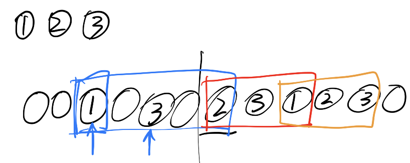

```c++
#include<bits/stdc++.h>
using namespace std;
#define _OJ_ // 本地调试开关
#define MAXN 100005
#define INF  1000000007  // or INT_MAX  or 0x7fffffff
#define _for(i,a,b) for(int i =(a); i < (b); ++i) // 循环宏
#define _rep(i,a,b) for(int i =(a); i <= (b); ++i)

int cal(){
    int n; cin >> n;
    set<string> A;
    _for(i, 0, n){
        string t; cin >> t; A.insert(t);
    }
    set<string> B;
    int m; cin >> m;
    int ret = 0;
    _for(i, 0, m){
        string t; cin >> t;
        if(A.find(t) != A.end()){
            if(A.size() == 1) return -1;
            B.insert(t);       // 压入
            if(A.size() == B.size()){   // 代理IP池用光
                B.clear(); ret++;
                B.insert(t);   // 重新压入
            }
        }
    }
    return ret;
}

int main() {
    // freopen("OJ.in", "r", stdin);
    cout << cal() <<endl;
    return 0;
}
```

### [反序输出](https://www.nowcoder.com/practice/171278d170c64d998ab342b3b40171bb?tpId=60&tqId=29477&tPage=1&ru=/kaoyan/retest/1001&qru=/ta/tsing-kaoyan/question-ranking)（简单模拟）

#### 题目描述

输入任意4个字符(如：abcd)， 并按反序输出(如：dcba)

#### 输入描述:

题目可能包含多组用例，每组用例占一行，包含4个任意的字符。

#### 输出描述:

对于每组输入,请输出一行反序后的字符串。
具体可见样例。

示例1

#### 输入

```
Upin
cvYj
WJpw
cXOA
```

#### 输出

```
nipU
jYvc
wpJW
AOXc
```

#### Code

```python
while True:  
    try:  
        a = input()  
        print(a[::-1])
    except EOFError:
        break
```

### [手机键盘](https://www.nowcoder.com/practice/20082c12f1ec43b29cd27c805cd476cd?tpId=60&tqId=29478&tPage=1&ru=/kaoyan/retest/1001&qru=/ta/tsing-kaoyan/question-ranking)（简单模拟）

#### 题目描述

按照手机键盘输入字母的方式，计算所花费的时间 如：a,b,c都在“1”键上，输入a只需要按一次，输入c需要连续按三次。 如果连续两个字符不在同一个按键上，则可直接按，如：ad需要按两下，kz需要按6下 如果连续两字符在同一个按键上，则两个按键之间需要等一段时间，如ac，在按了a之后，需要等一会儿才能按c。 现在假设每按一次需要花费一个时间段，等待时间需要花费两个时间段。 现在给出一串字符，需要计算出它所需要花费的时间。

#### 输入描述:

```
一个长度不大于100的字符串，其中只有手机按键上有的小写字母
```

#### 输出描述:

```
输入可能包括多组数据，对于每组数据，输出按出Input所给字符串所需要的时间
```

示例1

#### 输入

```
bob
www
```

#### 输出

```
7
7
```

#### Code

```c++
L = [['a','b','c'],
     ['d','e','f'],
     ['g','h','i'],
     ['j','k','l'],
     ['m','n','o'],
     ['p','q','r','s'],
     ['t','u','v'],
     ['w','x','y','z']
    ]
def find_union(char: str):
    for i in range(0, len(L)):
        if char in L[i]:
            # print(char, L[i])
            return int(i)

while True:
    try:  
        a = list(input())
        ret, cur = 0, -1
        for i in a:
            Next = find_union(i)
            # print(ret, cur, Next, ord(i) - ord(L[Next][0]) + 1)
            ret += ord(i) - ord(L[Next][0]) + 1
            if cur != -1:
                if cur == Next:
                    ret += 2
            cur = Next
        print(ret)
    except EOFError:
        break
```

### [n的阶乘](https://www.nowcoder.com/practice/97be22ee50b14cccad2787998ca628c8?tpId=60&tqId=29489&tPage=1&ru=%2Fkaoyan%2Fretest%2F1001&qru=%2Fta%2Ftsing-kaoyan%2Fquestion-ranking)（简单模拟）

#### 题目描述

输入一个整数n，输出n的阶乘（每组测试用例可能包含多组数据，请注意处理）

#### 输入描述:

一个整数n(1<=n<=20)

#### 输出描述:

n的阶乘

示例1

#### 输入

```
3
```

#### 输出

```
6
```

#### Code

```c++
while True:  
    try:  
        n = int(input())
        ret = n
        for i in range(1, n):
            ret *= i
        print(ret)
    except EOFError:
        break
```

### [特殊乘法](https://www.nowcoder.com/practice/a5edebf0622045468436c74c3a34240f?tpId=60&tqId=29490&tPage=1&ru=%2Fkaoyan%2Fretest%2F1001&qru=%2Fta%2Ftsing-kaoyan%2Fquestion-ranking)（简单模拟）

#### 题目描述

写个算法，对2个小于1000000000的输入，求结果。 特殊乘法举例：123 * 45 = 1*4 +1*5 +2*4 +2*5 +3*4+3*5

#### 输入描述:

两个小于1000000000的数

#### 输出描述:

输入可能有多组数据，对于每一组数据，输出Input中的两个数按照题目要求的方法进行运算后得到的结果。

示例1

#### 输入

```
123 45
```

#### 输出

```
54
```

#### Code

```python
a, b = input().split()
ret = 0
for i in list(a):
    for j in list(b):
        ret += int(i)*int(j)
print(ret)
```

### [完数VS盈数](https://www.nowcoder.com/practice/ccc3d1e78014486fb7eed3c50e05c99d?tpId=60&tqId=29492&tPage=1&ru=%2Fkaoyan%2Fretest%2F1001&qru=%2Fta%2Ftsing-kaoyan%2Fquestion-ranking)（简单模拟）

#### 题目描述

一个数如果恰好等于它的各因子(该数本身除外)子和，如：6=3+2+1。则称其为“完数”；若因子之和大于该数，则称其为“盈数”。 求出2到60之间所有“完数”和“盈数”。

#### 输入描述:

题目没有任何输入。

#### 输出描述:

输出2到60之间所有“完数”和“盈数”，并以如下形式输出：
E: e1 e2 e3 ......(ei为完数)
G: g1 g2 g3 ......(gi为盈数)
其中两个数之间要有空格，行尾不加空格。

#### Code

```c++
#include<bits/stdc++.h>
using namespace std;
#define _OJ_ // 本地调试开关
#define MAXN 100005
#define INF  1000000007  // or INT_MAX  or 0x7fffffff
#define _for(i,a,b) for(int i =(a); i < (b); ++i) // 循环宏
#define _rep(i,a,b) for(int i =(a); i <= (b); ++i)

int main() {
    // freopen("OJ.in", "r", stdin);
    vector<int> Wan, Ying;
    _rep(i, 2, 60){
        int t = 0;
        _rep(j, 1, i - 1){
            if(i % j == 0) t += j;
        }
        if(t > i) Ying.push_back(i);
        else if(t == i) Wan.push_back(i);
    }
    cout << "E: ";
    _for(i, 0, Wan.size()) cout << Wan[i] << " \n"[i == Wan.size() - 1];
    cout << "G: ";
    _for(i, 0, Ying.size()) cout << Ying[i] << " \n"[i == Ying.size() - 1];

    return 0;
}
```

### [求最大最小数](https://www.nowcoder.com/practice/82e5ff335eeb486aab359767895cc7b4?tpId=60&tqId=29485&tPage=1&ru=%2Fkaoyan%2Fretest%2F1001&qru=%2Fta%2Ftsing-kaoyan%2Fquestion-ranking)（简单模拟）

#### 题目描述

输入N个（N<=10000）数字，求出这N个数字中的最大值和最小值。每个数字的绝对值不大于1000000。

#### 输入描述:

输入包括多组测试用例，每组测试用例由一个整数N开头，接下去一行给出N个整数。

#### 输出描述:

输出包括两个整数，为给定N个数中的最大值与最小值。

示例1

#### 输入

```
5
1 2 3 4 5
3
3 7 8
```

#### 输出

```
5 1
8 3
```

#### Code

```python
while True:  
    try:  
        n = int(input())
        a = map(int, input().split()) 
        Min, Max = 1000005, -1000005
        for i in a:
            Min = min(Min, i)
            Max = max(Max, i)
        print(Max, Min)
    except EOFError:
        break
```


## 排序

### [成绩排序](https://www.nowcoder.com/practice/0383714a1bb749499050d2e0610418b1) （结构体，稳定排序）

#### 题目描述

输入任意（用户，成绩）序列，可以获得成绩从高到低或从低到高的排列,相同成绩都按先录入排列在前的规则处理。 

  示例：
 jack   70
 peter   96
 Tom    70
 smith   67 

  从高到低 成绩 
 peter   96 
 jack   70 
 Tom    70 
 smith   67 

  从低到高 
  smith   67 
  jack   70 
 Tom   70 
 peter   96 

#### 输入描述:

输入多行，先输入要排序的人的个数，然后输入排序方法0（降序）或者1（升序）再分别输入他们的名字和成绩，以一个空格隔开

#### 输出描述:

按照指定方式输出名字和成绩，名字和成绩之间以一个空格隔开

示例1

#### 输入

```
3
0
fang 90
yang 50
ning 70
```

#### 输出

```
fang 90
ning 70
yang 50
```

#### Code

需要稳定排序。

```c++
#include<bits/stdc++.h>
using namespace std;
#define _OJ_ // 本地调试开关
#define MAXN 50005
#define INF  1000000007  // or INT_MAX  or 0x7fffffff
#define _for(i,a,b) for(int i =(a); i < (b); ++i) // 循环宏
#define _rep(i,a,b) for(int i =(a); i <= (b); ++i)

struct User{
    string name;
    int score;
};

bool cmp1(const User& a, const User& b) {
    return a.score < b.score;
}
bool cmp0(const User& a, const User& b) {
    return a.score > b.score;
}


int main() {
    // freopen("OJ.in", "r", stdin);
    int n;
    while(cin >> n){
        User a[MAXN];
        int method; cin >> method;
        _for(i, 0, n) cin >> a[i].name >> a[i].score;
        if(method == 0) stable_sort(a, a+n, cmp0);
        else stable_sort(a, a+n, cmp1);
        _for(i, 0, n) cout << a[i].name <<" "<< a[i].score<<endl;
    }
    return 0;
}
```

### [成绩排序2](https://www.nowcoder.com/practice/3f27a0a5a59643a8abf0140b9a8cf1f7?tpId=60&tqId=29481&tPage=1&ru=/kaoyan/retest/1001&qru=/ta/tsing-kaoyan/question-ranking)（结构体）

#### 题目描述

用一维数组存储学号和成绩，然后，按成绩排序输出。

#### 输入描述:

```
输入第一行包括一个整数N(1<=N<=100)，代表学生的个数。
接下来的N行每行包括两个整数p和q，分别代表每个学生的学号和成绩。
```

#### 输出描述:

```
按照学生的成绩从小到大进行排序，并将排序后的学生信息打印出来。
如果学生的成绩相同，则按照学号的大小进行从小到大排序。
```

示例1

#### 输入

```
3
1 90
2 87
3 92
```

#### 输出

```
2 87
1 90
3 92
```

#### Code

```c++
#include<bits/stdc++.h>
using namespace std;
#define _OJ_ // 本地调试开关
#define MAXN 50005
#define INF  1000000007  // or INT_MAX  or 0x7fffffff
#define _for(i,a,b) for(int i =(a); i < (b); ++i) // 循环宏
#define _rep(i,a,b) for(int i =(a); i <= (b); ++i)

struct User{
    int ID, score;
    bool operator < (const User& a) const{
        if(score == a.score) return ID < a.ID;
        return score < a.score;
    }

};


int main() {
    // freopen("OJ.in", "r", stdin);
    int n;
    while(cin >> n){
        User a[MAXN];
        _for(i, 0, n) cin >> a[i].ID >> a[i].score;
        stable_sort(a, a+n);
        _for(i, 0, n) cout << a[i].ID <<" "<< a[i].score<<endl;
    }
    return 0;
}
```

### [查找学生信息](https://www.nowcoder.com/practice/fe8bff0750c8448081759f3ee0d86bb4?tpId=60&tqId=29499&tPage=2&ru=%2Fkaoyan%2Fretest%2F1001&qru=%2Fta%2Ftsing-kaoyan%2Fquestion-ranking)（二分查找）

#### 题目描述

输入N个学生的信息，然后进行查询。

#### 输入描述:

输入的第一行为N，即学生的个数(N<=1000)
接下来的N行包括N个学生的信息，信息格式如下：
01 李江 男 21
02 刘唐 男 23
03 张军 男 19
04 王娜 女 19
然后输入一个M(M<=10000),接下来会有M行，代表M次查询，每行输入一个学号，格式如下：
02
03
01
04

#### 输出描述:

输出M行，每行包括一个对应于查询的学生的信息。
如果没有对应的学生信息，则输出“No Answer!”

示例1

#### 输入

```
4
01 李江 男 21
02 刘唐 男 23
03 张军 男 19
04 王娜 女 19
5
02
03
01
04
03
```

#### 输出

```
02 刘唐 男 23
03 张军 男 19
01 李江 男 21
04 王娜 女 19
03 张军 男 19
```

#### Code

数据较水，暴力可过。

```python
n = int(input())
a = []
for i in range(0, n):
    t = input().split()
    a.append(t)

m = int(input())
for i in range(0, m):
    t = input()
    OK = -1
    for j in a:
        if j[0] == t:
                OK = j
    if OK != -1:
        print(OK[0], OK[1], OK[2], OK[3])
    else:
        print("No Answer!")

```


## 动态规划

### [递推数列](https://www.nowcoder.com/practice/d0e751eac618463bb6ac447369e4aa25?tpId=60&tqId=29493&tPage=2&ru=%2Fkaoyan%2Fretest%2F1001&qru=%2Fta%2Ftsing-kaoyan%2Fquestion-ranking)（DP，矩阵幂）

#### 题目描述

给定a0,a1,以及an=p*a(n-1) + q*a(n-2)中的p,q。这里n >= 2。 求第k个数对10000的模。

#### 输入描述:

输入包括5个整数：a0、a1、p、q、k。

#### 输出描述:

第k个数a(k)对10000的模。

示例1

#### 输入

[复制](javascript:void(0);)

```
20 1 1 14 5
```

#### 输出

[复制](javascript:void(0);)

```
8359
```

#### Code

$$
\left(\begin{array}{l}F_{n+2} \\F_{n+1}\end{array}\right)=\left(\begin{array}{ll}p & q \\1 & 0\end{array}\right)\left(\begin{array}{c}F_{n+1} \\F_{n}\end{array}\right)
$$

```c++
#include<bits/stdc++.h>
using namespace std;
#define _OJ_ // 本地调试开关
#define MAXN 100005
#define INF  1000000007  // or INT_MAX  or 0x7fffffff
#define _for(i,a,b) for(int i =(a); i < (b); ++i) // 循环宏
#define _rep(i,a,b) for(int i =(a); i <= (b); ++i)


int main() {
    // freopen("OJ.in", "r", stdin);
    int a0, a1, p, q, k;
    cin >> a0 >> a1 >> p >> q >> k;
    int d[MAXN];
    d[0] = a0, d[1] = a1;
    _rep(i, 2, k)
        d[i] = (p * d[i-1] + q * d[i-2]) % 10000;
    cout << d[k] <<endl;

    return 0;
}
```

### [最大序列和](https://www.nowcoder.com/practice/df219d60a7af4171a981ef56bd597f7b?tpId=60&tqId=29494&tPage=2&ru=%2Fkaoyan%2Fretest%2F1001&qru=%2Fta%2Ftsing-kaoyan%2Fquestion-ranking)（DP）

#### 题目描述

给出一个整数序列S，其中有N个数，定义其中一个非空连续子序列T中所有数的和为T的“序列和”。 对于S的所有非空连续子序列T，求最大的序列和。 变量条件：N为正整数，N≤1000000，结果序列和在范围（-2^63,2^63-1）以内。

#### 输入描述:

第一行为一个正整数N，第二行为N个整数，表示序列中的数。

#### 输出描述:

输入可能包括多组数据，对于每一组输入数据，
仅输出一个数，表示最大序列和。

示例1

#### 输入

```
5
1 5 -3 2 4

6
1 -2 3 4 -10 6

4
-3 -1 -2 -5
```

#### 输出

```
9
7
-1
```

#### Code

```c++
#include<bits/stdc++.h>
using namespace std;
#define _OJ_ // 本地调试开关
#define MAXN 1000005
#define INF  1000000007  // or INT_MAX  or 0x7fffffff
#define _for(i,a,b) for(int i =(a); i < (b); ++i) // 循环宏
#define _rep(i,a,b) for(int i =(a); i <= (b); ++i)

int dp[MAXN];
int MCS(vector<int>& A){
    memset(dp, -INF, sizeof(dp));
    dp[0] = A[0];
    for(int i = 1; i < A.size(); ++i)
        dp[i] = max(A[i], dp[i - 1] + A[i]);
    int ret = -INF;
    for(int i = 0; i < A.size(); ++i){
        ret = max(ret, dp[i]);
    }
    return ret;
}

int main() {
    // freopen("OJ.in", "r", stdin);
    int n;
    while(cin >> n){
        vector<int> A;
        _for(i, 0, n){
            int t; cin >> t; A.push_back(t);
        }
        cout << MCS(A) <<endl;
    }
        

    return 0;
}
```

### [最小邮票数](https://www.nowcoder.com/practice/83800ae3292b4256b7349ded5f178dd1?tpId=60&tqId=29486&tPage=1&ru=%2Fkaoyan%2Fretest%2F1001&qru=%2Fta%2Ftsing-kaoyan%2Fquestion-ranking)（背包问题）

#### 题目描述

  有若干张邮票，要求从中选取最少的邮票张数凑成一个给定的总值。   如，有1分，3分，3分，3分，4分五张邮票，要求凑成10分，则使用3张邮票：3分、3分、4分即可。

#### 输入描述:

​    有多组数据，对于每组数据，首先是要求凑成的邮票总值M，M<100。然后是一个数N，N〈20，表示有N张邮票。接下来是N个正整数，分别表示这N张邮票的面值，且以升序排列。

#### 输出描述:

​      对于每组数据，能够凑成总值M的最少邮票张数。若无解，输出0。

示例1

#### 输入

```
10
5
1 3 3 3 4
```

#### 输出

```
3
```

#### Code

注意`memset`只能按char赋值（**char型初始化函数**）。

```c++
#include<bits/stdc++.h>
using namespace std;
#define _OJ_ // 本地调试开关
#define MAXN 100005
#define INF  100000007  // or INT_MAX  or 0x7fffffff
#define _for(i,a,b) for(int i =(a); i < (b); ++i) // 循环宏
#define _rep(i,a,b) for(int i =(a); i <= (b); ++i)

int dp[MAXN]; // 一维复用；全局变量自动初始化
int DP(vector<int> w, int n, int V){ // n为物品数，V为背包容量
    _rep(i, 0, V) dp[i] = INF;
    dp[0] = 0;
    for(int i = 0; i < n; ++i){
        for(int j = V; j >= w[i]; --j) // 为了防止干扰，倒序更新
            if(dp[j-w[i]] != INF) dp[j] = min(dp[j], dp[j-w[i]] + 1);
    }
    return dp[V] == INF ? 0 : dp[V];
}

int main() {
    // freopen("OJ.in", "r", stdin);
    int m, n; cin >> m >> n;
    vector<int> W;
    _for(i, 0, n){
        int w; cin >> w;
        W.push_back(w);
    }
    cout << DP(W, n, m) <<endl;

    return 0;
}
```

### [函数求值](https://www.nowcoder.com/practice/20d6abf0fbcc49a799024e61fa2292c6?tpId=60&tqId=31033&tPage=2&ru=%2Fkaoyan%2Fretest%2F1001&qru=%2Fta%2Ftsing-kaoyan%2Fquestion-ranking)（数位DP）

> https://www.luogu.com.cn/problem/P2602

#### 题目描述

给定正整数N，函数F(N)表示小于等于N的自然数中1和2的个数之和，例如：1,2,3,4,5,6,7,8,9,10序列中1和2的个数之和为3，因此 F(10)=3。输入N，求F(N)的值，1=<N<=10^100(10的100次方)若F(N)很大，则F(N)mod20123的值。

#### 输入描述:

```
无
```

#### 输出描述:

```
无
```

示例1

#### 输入

```
10
10
```

#### 输出

```
3
3
```

#### Code

要有板子。这题牛客网和`DreamJudge`的数据都有一定问题。下面是洛谷的板子的修改：

```c++
#include<bits/stdc++.h>
using namespace std;
string a,b;

long long ten[20],f[20];
long long cnta[20],cntb[20];
#define MOD 20123
void solve(string x,long long *cnt){
    long long num[1005]={0};
    int len=0;

    for(int i = x.size() - 1; i >= 0; --i){  // 对x进行数位分解
        num[++len]= x[i] - '0';
    }
    for(int i=len; i>=1; i--){
        for(int j=0; j<=9; j++)
            cnt[j] = (cnt[j] + f[i-1] * num[i]) % MOD;
        for(int j=0; j<num[i]; j++)
            cnt[j] = (cnt[j] + ten[i-1]) % MOD;
        long long num2=0;
        for(int j= i-1; j>=1; j--){
            num2 = num2 * 10 + num[j];
        }
        cnt[num[i]] = (cnt[num[i]] + num2+1) % MOD;
        cnt[0] = (cnt[0] - ten[i-1]) % MOD;
    } 
}
int main()
{
    while(cin >> a){
        memset(cnta, 0, sizeof(cnta));
        ten[0]=1;
        for(int i=1;i<=15;i++){
            f[i]=f[i-1]*10+ten[i-1];
            ten[i]=10*ten[i-1];
        }
        solve(a,cnta);     // [1, a]总计数
        printf("%lld\n",(cnta[1] + cnta[2])%20123 );
    }
}
```

#### Python版

> 摘自牛客网。

```python
def counti(N, i):
    count=0; base=10; tmp=N
    while(tmp):
        count += N//base*base//10
        if(N%base >= (i*base//10)):
            if(N%base < ((i+1)*base//10)):
                count += (N%(base//10) + 1)
            else:
                count += base//10
        base *= 10
        tmp //= 10
    return count
while True:
    try:
        N = int(input())
        result = (counti(N,1)+counti(N,2))%20123
        print(result)
    except:
        break
```

## 数学

### [进制转换](https://www.nowcoder.com/practice/0337e32b1e5543a19fa380e36d9343d7) （高精度）

#### 题目描述

将一个长度最多为30位数字的十进制非负整数转换为二进制数输出。

#### 输入描述:

多组数据，每行为一个长度不超过30位的十进制非负整数。
（注意是10进制数字的个数可能有30个，而非30bits的整数）

#### 输出描述:

每行输出对应的二进制数。

示例1

#### 输入

```
0
1
3
8
```

#### 输出

```
0
1
11
1000
```

#### Code

```python
#!/usr/bin/env python3
while True:  
    try:  
        a = int(input())
        print(bin(a)[2:])
    except EOFError:
        break
```

### [进制转换2](https://www.nowcoder.com/practice/ae4b3c4a968745618d65b866002bbd32?tpId=60&tqId=31034&tPage=2&ru=%2Fkaoyan%2Fretest%2F1001&qru=%2Fta%2Ftsing-kaoyan%2Fquestion-ranking)（36进制）

#### 题目描述

将M进制的数X转换为N进制的数输出。

#### 输入描述:

输入的第一行包括两个整数：M和N(2<=M,N<=36)。
下面的一行输入一个数X，X是M进制的数，现在要求你将M进制的数X转换成N进制的数输出。

#### 输出描述:

输出X的N进制表示的数。

示例1

#### 输入

```
10 2
11
```

#### 输出

```
1011
```

#### 备注:

注意输入时如有字母，则字母为大写，输出时如有字母，则字母为小写。

#### Code

```python
def convert(A : str, M : int, N : int):  # M进制转N进制
    a = int(A, M)  # M进制自动转10进制
    base = "0123456789ABCDEFGHIJKLMNOPQRSTUVWXYZ"
    
    ret = []
    while a:
        ret.append(base[a % N])
        a = a // N   #  "//"表示取整除法
    return ''.join(ret[::-1])

M, N = map(int, input().split())
x = input()
ret = convert(x, M, N)
ret = ret.lower()
print(ret)
```

### [10进制 vs. 2进制](https://www.nowcoder.com/practice/fd972d5d5cf04dd4bb4e5f027d4fc11e?tpId=60&tqId=29498&tPage=2&ru=%2Fkaoyan%2Fretest%2F1001&qru=%2Fta%2Ftsing-kaoyan%2Fquestion-ranking)（高精度）

#### 题目描述

   对于一个十进制数A，将A转换为二进制数，然后按位逆序排列，再转换为十进制数B，我们称B为A的二进制逆序数。    例如对于十进制数173，它的二进制形式为10101101，逆序排列得到10110101，其十进制数为181，181即为173的二进制逆序数。

#### 输入描述:

​    一个1000位(即10^999)以内的十进制数。

#### 输出描述:

​    输入的十进制数的二进制逆序数。

示例1

#### 输入

```
173
```

#### 输出

```
181
```

#### Code

```python
a = int(input())
print(int((bin(a)[2:])[::-1], 2))
```

### [质因数的个数](https://www.nowcoder.com/practice/20426b85f7fc4ba8b0844cc04807fbd9?tpId=60&tqId=29479&tPage=1&ru=/kaoyan/retest/1001&qru=/ta/tsing-kaoyan/question-ranking)（素数筛法，因数分解）

#### 题目描述

求正整数N(N>1)的质因数的个数。 相同的质因数需要重复计算。如120=2*2*2*3*5，共有5个质因数。

#### 输入描述:

```
可能有多组测试数据，每组测试数据的输入是一个正整数N，(1<N<10^9)。
```

#### 输出描述:

```
对于每组数据，输出N的质因数的个数。
```

示例1

#### 输入

```
120
```

#### 输出

```
5
```

#### Code

注意n的范围。

```c++
#include<bits/stdc++.h>
using namespace std;
#define _OJ_ // 本地调试开关
#define MAXN 100005
#define INF  1000000007  // or INT_MAX  or 0x7fffffff
#define _for(i,a,b) for(int i =(a); i < (b); ++i) // 循环宏
#define _rep(i,a,b) for(int i =(a); i <= (b); ++i)

int readint(){  // 整数输入
    int x; scanf("%d", &x); return x;
}

bool prime[MAXN];
int p_numbers[MAXN], size = 0; //reserve primes

void Euler(int Length){  //about O(n)
    prime[0] = prime[1] = 0;
    for(int i = 2; i <= Length; ++i) prime[i] = 1; //initialize all as true
    for(int i = 2; i <= Length; ++i){
        if(prime[i]){
            p_numbers[size++] = i;
        }
        for(int j = 0; j <size && i*p_numbers[j] < Length; j++){
            prime[ i*p_numbers[j] ] = 0;  //sieve i*p_numbers[j]
            if(i % p_numbers[j] == 0)  //special
               break;
        }
    }
}

int e[MAXN];
int factor(int n){ // 因数分解
    memset(e, 0, sizeof(e));
    for(int i = 0; i < size && n != 1; ++i) // n==1时提前退出
        while(n % p_numbers[i] == 0){
            n /= p_numbers[i];
            e[i] += 1;
        }
    int ret = 0;
    if(n > 1) ret ++;  // 特殊情况，n自身为质数，而筛法只筛到sqrt(n)时
    _for(i, 0, size) ret += e[i];
    return ret;
}

int main() {
    // freopen("OJ.in", "r", stdin);
    int n;
    Euler(MAXN);
    int ret = factor(readint());
    cout << ret <<endl;

    return 0;
}
```

### [约数的个数](https://www.nowcoder.com/practice/04c8a5ea209d41798d23b59f053fa4d6?tpId=60&tqId=29475&tPage=1&ru=%2Fkaoyan%2Fretest%2F1001&qru=%2Fta%2Ftsing-kaoyan%2Fquestion-ranking)（素数筛法，因数分解）

#### 题目描述

输入n个整数,依次输出每个数的约数的个数

#### 输入描述:

```
输入的第一行为N，即数组的个数(N<=1000)
接下来的1行包括N个整数，其中每个数的范围为(1<=Num<=1000000000)
```

#### 输出描述:

```
可能有多组输入数据，对于每组输入数据，
输出N行，其中每一行对应上面的一个数的约数的个数。
```

示例1

#### 输入

```
5
1 3 4 6 12
```

#### 输出

```
1
2
3
4
6
```

#### Code

注意只需要筛到$\sqrt n$。

注意因为只筛到了$\sqrt n$，在因数分解时如果遇到质数，则答案会增加。

```c++
#include<bits/stdc++.h>
using namespace std;
#define _OJ_ // 本地调试开关
#define MAXN 100005
#define INF  1000000007  // or INT_MAX  or 0x7fffffff
#define _for(i,a,b) for(int i =(a); i < (b); ++i) // 循环宏
#define _rep(i,a,b) for(int i =(a); i <= (b); ++i)

int readint(){  // 整数输入
    int x; scanf("%d", &x); return x;
}

bool prime[MAXN];
int p_numbers[MAXN], size = 0; //reserve primes

void Euler(int Length){  //about O(n)
    prime[0] = prime[1] = 0;
    for(int i = 2; i <= Length; ++i) prime[i] = 1; //initialize all as true
    for(int i = 2; i <= Length; ++i){
        if(prime[i]){
            p_numbers[size++] = i;
        }
        for(int j = 0; j <size && i*p_numbers[j] < Length; j++){
            prime[ i*p_numbers[j] ] = 0;  //sieve i*p_numbers[j]
            if(i % p_numbers[j] == 0)  //special
               break;
        }
    }
}

int e[MAXN];
int factor(int n){ // 因数分解，返回约数的个数
    memset(e, 0, sizeof(e));
    for(int i = 0; i < size && n != 1; ++i) // n==1时提前退出
        while(n % p_numbers[i] == 0){
            n /= p_numbers[i];
            e[i] += 1;
        }
    int ret = 1;
    if(n > 1) ret *= 2;  // 特殊情况，n自身为质数，而筛法只筛到sqrt(n)时
    _for(i, 0, size) ret *= e[i] + 1;
    return ret;
}

int main() {
    // freopen("OJ.in", "r", stdin);
    int n;
    Euler(MAXN);
    cin >> n;
    _for(i, 0, n){
        int ret = factor(readint());
        cout << ret <<endl;
    }
    return 0;
}
```

### [求`root(N, k)​`](https://www.nowcoder.com/practice/9324a1458c564c4b9c4bfc3867a2aa66?tpId=60&tqId=29488&tPage=1&ru=%2Fkaoyan%2Fretest%2F1001&qru=%2Fta%2Ftsing-kaoyan%2Fquestion-ranking)（数学推导）

#### 题目描述

   N<k时，root(N,k) = N，否则，root(N,k) =  root(N',k)。**N'为N的k进制表示的各位数字之和**。输入x,y,k，输出root(x^y,k)的值  (这里^为乘方，不是异或)，2=<k<=16，0<x,y<2000000000，有一半的测试点里 x^y  会溢出int的范围(>=2000000000) 

#### 输入描述:

​    每组测试数据包括一行，x(**0<x**<2000000000), y(**0<y**<2000000000), k(2<=k<=16)

#### 输出描述:

​    输入可能有多组数据，对于每一组数据，root(x^y, k)的值

示例1

#### 输入

```
4 4 10
```

#### 输出

```
4
```

#### Code

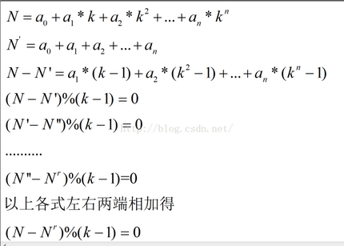

核心公式：
$$
\begin{align}N&>0(值域限制)\\N'&=N\%(k-1)\\root(N,k)&=root(N\%(k-1),k)\end{align}
$$
为了加快计算，快速幂过程要取模`k-1`，故不能使用STL。

```c++
def root(N, k):
    if N < k:
        return N
    else:
        return root( N%(k-1), k)
def power(a, n, k):
    ans = 1
    base = a
    while n > 0:
        if(n & 1):
            ans *= base
        base *= base
        ans %= (k - 1)
        base %= (k - 1)
        n >>= 1
    return k - 1 if ans == 0 else ans
    
while True:  
    try:  
        x,y,k = map(int, input().split())
        print(root(power(x%(k-1),y, k), k))
    except EOFError:
        break
```

### [球的半径和体积](https://www.nowcoder.com/practice/4b733a850c364c32b368555c8c2ec96b?tpId=60&tqId=29482&tPage=1&ru=%2Fkaoyan%2Fretest%2F1001&qru=%2Fta%2Ftsing-kaoyan%2Fquestion-ranking)（数学公式）

#### 题目描述

输入球的中心点和球上某一点的坐标，计算球的半径和体积

#### 输入描述:

```
球的中心点和球上某一点的坐标，以如下形式输入：x0 y0 z0 x1 y1 z1
```

#### 输出描述:

```
输入可能有多组，对于每组输入，输出球的半径和体积，并且结果保留三位小数

为避免精度问题，PI值请使用arccos(-1)。
```

示例1

#### 输入

```
0 0 0 1 1 1 
```

#### 输出

```
1.732 21.766
```

#### Code

```c++
#include<bits/stdc++.h>
using namespace std;
#define _OJ_ // 本地调试开关
#define MAXN 100005
#define INF  1000000007  // or INT_MAX  or 0x7fffffff
#define _for(i,a,b) for(int i =(a); i < (b); ++i) // 循环宏
#define _rep(i,a,b) for(int i =(a); i <= (b); ++i)
const double PI = acos(-1.0);


int main() {
    // freopen("OJ.in", "r", stdin);
    double x0,y0,z0,x1,y1,z1;
    while(cin >>x0>>y0>>z0>>x1>>y1>>z1){
        double r = sqrt((x1-x0)*(x1-x0) + (y1-y0)*(y1-y0) + (z1-z0)*(z1-z0));
        double V = 4.0/3.0*PI*r*r*r;
        printf("%.3f %.3f\n", r, V);
    }
        

    return 0;
}
```


## 图论


## [整数拆分](https://www.nowcoder.com/practice/376537f4609a49d296901db5139639ec?tpId=60&tqId=29480&tPage=1&ru=%2Fkaoyan%2Fretest%2F1001&qru=%2Fta%2Ftsing-kaoyan%2Fquestion-ranking)（DP）

#### 题目描述

一个整数总可以拆分为2的幂的和，例如： 7=1+2+4 7=1+2+2+2 7=1+1+1+4 7=1+1+1+2+2 7=1+1+1+1+1+2 7=1+1+1+1+1+1+1 总共有六种不同的拆分方式。 再比如：4可以拆分成：4 = 4，4 = 1 + 1 + 1 + 1，4 = 2 + 2，4=1+1+2。 用f(n)表示n的不同拆分的种数，例如f(7)=6. 要求编写程序，读入n(不超过1000000)，输出f(n)%1000000000。

#### 输入描述:

每组输入包括一个整数：N(1<=N<=1000000)。

#### 输出描述:

对于每组数据，输出f(n)%1000000000。

示例1

#### 输入

```
7
```

#### 输出

```
6
```

#### Code

需要推导递推公式。

记 $f(n)$ 为 $n$ 的划分数，我们有递推公式：
$$
f(2m + 1) = f(2m)\\
f(2m) = f(2m - 1) + f(m)\\
初始条件：f(1) = 1
$$


```c++

```

## [二叉树遍历](https://www.nowcoder.com/practice/4b91205483694f449f94c179883c1fef?tpId=60&tqId=29483&tPage=1&ru=%2Fkaoyan%2Fretest%2F1001&qru=%2Fta%2Ftsing-kaoyan%2Fquestion-ranking)（中序遍历）

#### 题目描述

编一个程序，读入用户输入的一串先序遍历字符串，根据此字符串建立一个二叉树（以指针方式存储）。 例如如下的先序遍历字符串： ABC##DE#G##F### 其中“#”表示的是空格，空格字符代表空树。建立起此二叉树以后，再对二叉树进行中序遍历，输出遍历结果。

#### 输入描述:

输入包括1行字符串，长度不超过100。

#### 输出描述:

可能有多组测试数据，对于每组数据，
输出将输入字符串建立二叉树后中序遍历的序列，每个字符后面都有一个空格。
每个输出结果占一行。

示例1

#### 输入

```
abc##de#g##f###
```

#### 输出

```
c b e g d f a 
```

#### Code

```c++

```

## [玛雅人的密码](https://www.nowcoder.com/practice/761fc1e2f03742c2aa929c19ba96dbb0?tpId=60&tqId=29484&tPage=1&ru=%2Fkaoyan%2Fretest%2F1001&qru=%2Fta%2Ftsing-kaoyan%2Fquestion-ranking)（BFS）

#### 题目描述

玛雅人有一种密码，如果字符串中出现连续的2012四个数字就能解开密码。给一个长度为N的字符串，（2=<N<=13）该字符串中只含有0,1,2三种数字，问这个字符串要移位几次才能解开密码，每次只能移动相邻的两个数字。例如02120经过一次移位，可以得到20120,01220,02210,02102，其中20120符合要求，因此输出为1.如果无论移位多少次都解不开密码，输出-1。

#### 输入描述:

输入包含多组测试数据，每组测试数据由两行组成。
第一行为一个整数N，代表字符串的长度（2<=N<=13）。
第二行为一个仅由0、1、2组成的，长度为N的字符串。

#### 输出描述:

对于每组测试数据，若可以解出密码，输出最少的移位次数；否则输出-1。

示例1

#### 输入

```
5
02120
```

#### 输出

```
1
```

#### Code

简单搜索问题。把每一个可能的串看成一个状态，则组成一个无向图。在该图上进行一个BFS即可。BFS恰好也满足最小移位的要求。

```c++

```

## [最小花费](https://www.nowcoder.com/practice/e6df3e3005e34e2598b9b565cfe797c9?tpId=60&tqId=29495&tPage=2&ru=%2Fkaoyan%2Fretest%2F1001&qru=%2Fta%2Ftsing-kaoyan%2Fquestion-ranking)（DP）

#### 题目描述

在某条线路上有N个火车站，有三种距离的路程，L1，L2，L3,对应的价格为C1,C2,C3.其对应关系如下: 距离s      票价 0<S<=L1     C1 L1<S<=L2     C2 L2<S<=L3     C3 输入保证0<L1<L2<L3<10^9,0<C1<C2<C3<10^9。 每两个站之间的距离不超过L3。 当乘客要移动的两个站的距离大于L3的时候，可以选择从中间一个站下车，然后买票再上车，所以乘客整个过程中至少会买两张票。 现在给你一个 L1，L2，L3，C1，C2,C3。然后是A B的值，其分别为乘客旅程的起始站和终点站。 然后输入N，N为该线路上的总的火车站数目，然后输入N-1个整数，分别代表从该线路上的第一个站，到第2个站，第3个站，……，第N个站的距离。 根据输入，输出乘客从A到B站的最小花费。

#### 输入描述:

以如下格式输入数据：
L1  L2  L3  C1  C2  C3
A  B
N
a[2]
a[3]
……
a[N]

#### 输出描述:

可能有多组测试数据，对于每一组数据，
根据输入，输出乘客从A到B站的最小花费。

示例1

#### 输入

```
1 2 3 1 2 3
1 2
2
2
```

#### 输出

```
2
```

#### Code

```c++

```

## [剩下的树](https://www.nowcoder.com/practice/f5787c69f5cf41499ba4706bc93700a2?tpId=60&tqId=29497&tPage=2&ru=%2Fkaoyan%2Fretest%2F1001&qru=%2Fta%2Ftsing-kaoyan%2Fquestion-ranking)（贪心）

#### 题目描述

  有一个长度为整数L(1<=L<=10000)的马路，可以想象成数轴上长度为L的一个线段，起点是坐标原点，在每个整数坐标点有一棵树，即在0,1,2，...，L共L+1个位置上有L+1棵树。   现在要移走一些树，移走的树的区间用一对数字表示，如 100 200表示移走从100到200之间（包括端点）所有的树。   可能有M(1<=M<=100)个区间，区间之间可能有重叠。现在要求移走所有区间的树之后剩下的树的个数。

#### 输入描述:

​    两个整数L(1<=L<=10000)和M(1<=M<=100)。
​    接下来有M组整数，每组有一对数字。

#### 输出描述:

​    可能有多组输入数据，对于每组输入数据，输出一个数，表示移走所有区间的树之后剩下的树的个数。

示例1

#### 输入

[复制](javascript:void(0);)

```
500 3
100 200
150 300
470 471
```

#### 输出

[复制](javascript:void(0);)

```
298
```

#### Code

```c++

```

