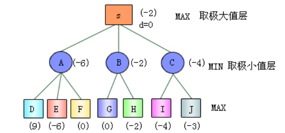
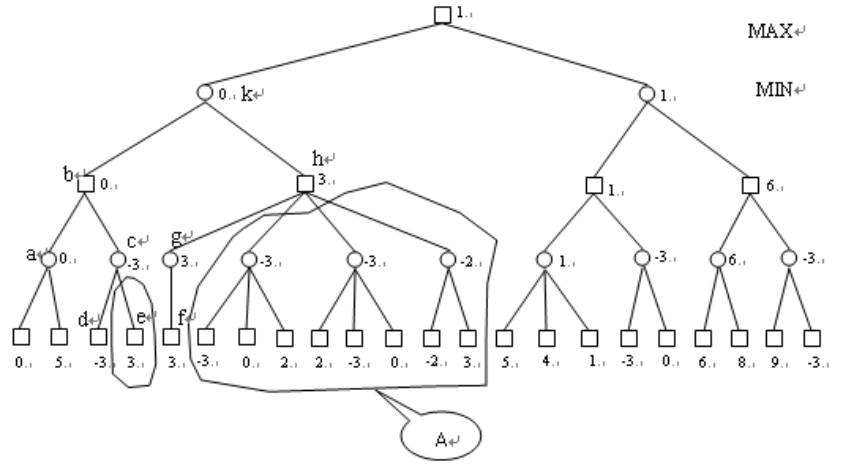
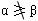
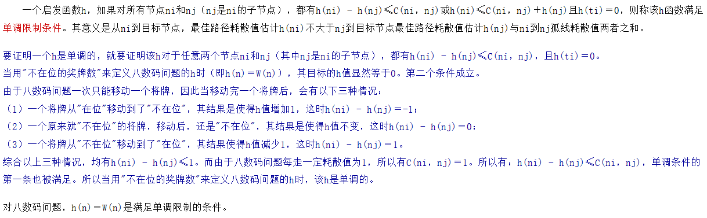
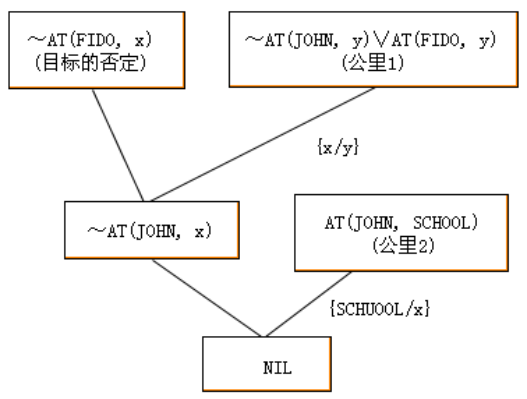
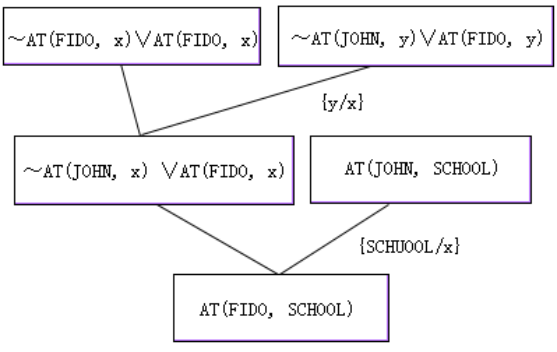
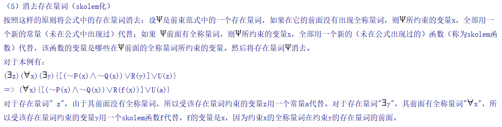
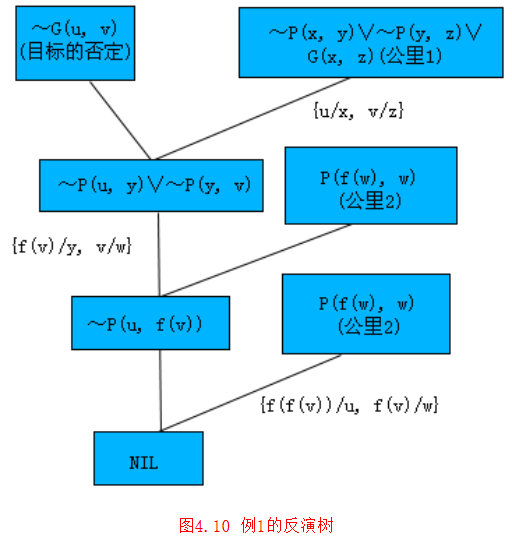
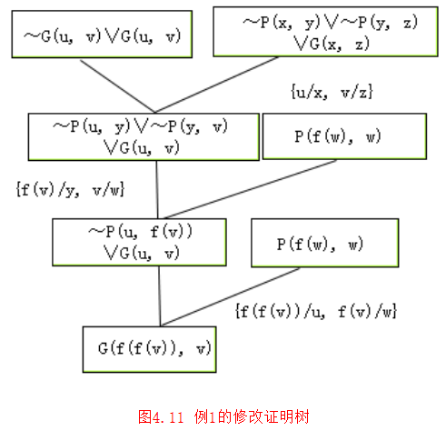
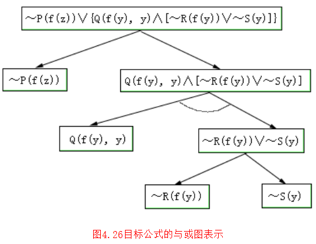

# 教材

林尧瑞，马少平，人工智能导论，清华大学出版社

## 参考书

- 马少平，朱小燕，人工智能，清华大学出版社
- Stuart Russell, Peter Norvig著，姜哲等译，人工智能 ，人民邮电出版社出版
- 陆汝钤，人工智能（上下），科学出版社
- Nils J. Nilsson，人工智能，机械工业出版社
- 蔡自兴，徐光佑，人工智能及其应用，清华大学出版社
- 史忠植，高级人工智能，科学出版社
- 罗杰•彭罗思，皇帝新脑，湖南科学技术出版社
- 休伯特•德雷福斯，计算机不能做什么，三联书店出版社

> 注：人工智能是指**人工智能导论**的内容，网上下载的清华大学网络课堂关于人工智能的有三个，分别是《人工智能导论》和《人工智能原理》以及《人工智能（研究生）》。考试主要内容都是人工智能导论里的。  

## 附加

[马少平老师科普讲座，计算机是如何实现智能的](https://www.bilibili.com/video/BV1HE411N7Xc) 基本讲了一下AI

MOOC：[人工智能](https://next.xuetangx.com/course/PKU08091000777/1075324)（PKU）。

# 真题

> 据说年年不换题。

## 机器学习算法

介绍一种机器学习算法。

> 逻辑回归。解决二分类问题。
>
> 逻辑回归使用`sigmoid`作为假设函数。使用交叉熵作为损失函数。通过优化损失函数来获得模型。
> $$
> Sigmoid\,Function:h_\theta' (x) ={\color{red}{g} }(z)={\frac{1}{1+e^{-z} } } \quad，其中z=\theta^Tx=h_\theta (x)
> $$
>
> $$
> Cost(h_\theta(x),y)=
> \begin{cases}
> -log(h_\theta(x)),&\mbox{if $y=1$}\\
> -log(1-h_\theta(x)),&\mbox{if $y=0$}
> \end{cases}
> $$
>
> $$
> \begin{split}
> Cost(h_\theta(x),y) &=-{\color{red}y}log(h_\theta(x))-({\color{red}{1-y} })log(1-h_\theta(x)) \\
> &= [\,log\,(g(X\theta))]^Ty+[\,log\,(1-g(X\theta))]^T(1-y)
> \end{split}
> $$
>
> 逻辑回归也可以通过多次二分类来解决多分类问题。

## 人工智能方法

1）描述一个你熟悉的人工智能方法，并简述特点。

2）下列两个问题是否适合用人工智能方法进行解决，如果适合请简单解释，不适合请给出理由。（人类是否灭亡和大气污染程度）

> 1）神经网络/深度学习。通过建立多层的神经元的网络，输入大量数据，设计损失函数，用前向传播+反向传播算法来不断训练神经元的权值，优化损失函数，从数据中学习到特征，从而解决某些特定问题。
>
> 2）
>
> - 人类是否灭亡：并不是一个可解的问题，而且无法找到任何训练样本
> - 大气污染程度：可以通过各种数据量化，清华大学有老师在研究这个

## 名词解释

专家系统，神经网络，模拟退火，遗传算法原理及其特点。（四选二）

> **专家系统**：所谓专家咨询系统就是一种**智能的计算机程序系统**，该系统**存储有某个专门领域中经事先总结，并按某种格式表示的专家知识**（构成知识库），以及拥有类似于专家解决实际问题的推理机制（组成推理系统）。系统能对输入信息进行处理，并运用知识进行推理，做出决策和判断，其解决问题的水平达到专家的水准，因此能起到专家的作用或成为专家的助手。目前专家系统主要采用**基于规则的演绎技术**，开发专家系统的关键问题是知识表示，应用和获取技术，困难在于许多领域中专家的知识往往是琐碎的，不精确的或不确定的，因此目前研究仍集中在这一核心课题。此外对专家系统开发工具的研制发展也很迅速，这对扩大专家系统应用范围，加快专家系统的开发过程，起到了积极的作用。
>
> **神经网络**：它从信息处理角度**对人脑神经元网络进行抽象**，建立某种简单模型，按不同的连接方式组成不同的网络。在工程与学术界也常直接简称为神经网络或类神经网络。神经网络是一种运算模型，由大量的节点（或称神经元）之间相互联接构成。每个节点代表一种特定的输出函数，称为激励函数（activation  function）。每两个节点间的连接都代表一个对于通过该连接信号的加权值，称之为权重，这相当于人工神经网络的记忆。网络的输出则依网络的连接方式，权重值和激励函数的不同而不同。而网络自身通常都是对自然界某种算法或者函数的逼近，也可能是对一种逻辑策略的表达。
>
> **模拟退火**：模拟退火算法从某一较高初温出发，伴随温度参数的不断下降,结合概率突跳特性在解空间中随机寻找目标函数的全局最优解，即**能概率性地跳出局部最优解并最终趋于全局最优**。模拟退火算法是一种通用的优化算法，理论上算法具有概率的全局优化性能。
>
> **遗传算法**：遗传算法（Genetic Algorithm, GA）是模拟达尔文生物进化论的自然选择和遗传学机理的生物进化过程的计算模型，是一种通过模拟自然进化过程搜索最优解的方法。其主要特点是直接对结构对象进行操作，不存在求导和函数连续性的限定；具有内在的隐并行性和更好的全局寻优能力；采用概率化的寻优方法，不需要确定的规则就能自动获取和指导优化的搜索空间，自适应地调整搜索方向。遗传算法**以一种群体中的所有个体为对象**，并利用随机化技术指导对一个被编码的参数空间进行高效搜索。其中，**选择、交叉和变异**构成了遗传算法的遗传操作；参数编码、初始群体的设定、适应度函数的设计、遗传操作设计、控制参数设定五个要素组成了遗传算法的核心内容。

## 产生式系统

产生式系统的三要素？

> - **综合数据库**（Global Database）：一个**数据集**，存放推理过程中的条件、中间结果、结论等。
> - **产生式规则**（Set of Rules）：系统的**知识库**；它采用`IF <前件> THEN <后件>`的形式，来表达求解问题所需要的知识。
> - **控制系统**（Control System）：**控制**系统的运行，它根据综合数据库中的当前数据，来选择合适的规则。推理引擎。
>
> 产生式系统的特点：**数据驱动**，**独立性**（易扩展）。

给1～9九个数字排一个序列，使得该序列的前n(n=1,...,9) 个数字组成的整数能被n整除。

　　(1)、讨论哪些知识可以帮助该问题的求解。

> 整除理论：判断一个数是否能被另一个数整除。`reason(n)`判断是否是合法解。
>
> 排列的生成：`next_permutation(n)`。

　　(2)、用产生式系统描述该问题。(给出综合数据库，规则集，上述 知识要在规则集中反映出来)

> 综合数据库：设计一个多元组。（n, flag）表示当前的序列，以及是否合法。
>
> 规则集：
>
> - `IF (n, false) and reason(n) THEN (n, true)`
> - `IF (n, false) and !reason(n) THEN (next_permutation(n), false)`
>
> 初始条件：`(123456789, false)`
>
> 终止条件：`(n, true)` n为任意值

## α-β剪枝

α-β剪枝的原理，即为什么可以α-β剪枝。

给出一个博弈树，按从左到右的顺序进行α-β剪枝搜索，标出何处发生剪枝、节点的倒推值和最佳走步。

> 极大极小搜索：（由下至上，逐层取MIN、MAX）
>
> 
>
> > 在极小极大搜索方法中，由于要先生成指定深度以内的所有节点，其节点数将随着搜索深度的增加承指数增长。这极大地限制了极小极大搜索方法的使用。能否在搜索深度不变的情况下，利用已有的搜索信息减少生成的节点数呢？
> >
> > 设某博弈问题如下图所示，应用极小极大方法进行搜索。假设搜索的顺序为从下到上，从左到右。当计算完a的值为0后，由于b是极大节点，马上就可以知道b的值大于等于0。接下来求c的值。由于c是极小节点，由d的值为-3，知道c的值小于等于-3。而a和c都是b的子节点，所以**即便不扩展节点e，也可以知道b的值一定为0了**。所以在这种情况下，没有生成节点e的必要。同样，在知道b的值为0后，由于k是极小节点，所以立即知道k的值要小于等于0。而通过节点f、g，知道h的值至少为3。这样即便不扩展A所包围的那些节点，也能知道k的值一定为0。所以A包围的那些节点也没有生成的必要，不管这些节点取值如何，都不影响k的值。如果在搜索的过程中，充分利用这些信息，不就可以少生成很多节点，从而提高搜索的空间利用率吗？α-β过程正是这样一种搜索方法。【**尽早修剪**】
> >
> > 
> >
> > 
>
> 使用α-β剪枝技术，当不满足剪枝条件（即）时。若β值比α值大不了多少或极相近，这时也可以进行剪枝，以便有条件把搜索集中到会带来更大效果的其他路径上，这就是中止对效益不大的一些子村的搜索，以提高搜索效率。
>         其他改善极小极大过程性能的基本方法有：
>         （1）不严格限制搜索的深度，当到达深度限制时，如出现博弈格局有可能发生较大变化时（如出现兑子格局），则应多搜索几层，使格局进入较稳定状态后再中止，这样可使倒推值计算的结果比较合理，避免考虑不充分产生的影响，这是等候状态平稳后中止搜索的方法。
>         （2）当算法给出所选的走步后，不马上停止搜索，而是在原先估计可能的路径上再往前搜索几步，再次检验会不会出现意外，这是一种增添辅助搜索的方法。         
>         （3）对某些博弈的开局阶段和残局阶段，往往总结有一些固定的对弈模式，因此可以利用这些知识编好走步表，以便在开局和结局时使用查表法。只是在进入中盘阶段后，再调用其他有效的搜索算法，来选择最优的走步。
>
> 练习：
>
> 

## A算法

某问题的状态空间图如图2所示，其中括号内标明的是各节点的h值，弧线边的数字是该弧线的耗散值，试用A算法求解从初始节点S到目标节点T的路径。要求给出搜索图，标各节点的f值，及各节点的扩展次序，并给出求得的解路径。

> 优先级搜索。
>
> 评价函数 f（n）＝g（n）＋h（n）（耗散函数 + 启发函数）。
>
> - 耗散函数：当前的沉没成本
> - 启发函数：预估到达目标的成本
>
> 每次优先选取 f(n)最小的节点路径。
>
> > 当 h(n)=0 时，A算法退化为动态规划。

## A*算法

A*算法求解8数码问题。

找出一个满足单调条件的h， 证明为何满足单调条件。

（给出了8数码问题的一个h函数（启发函数），求证单调，然后再用A*求出最优解，画图很麻烦。）

> A\*算法必须保证 `h(n) ≤ h*(n)`。
>
> 单调条件：状态之间的启发势能 <= 状态间的转移耗散量。
>
> > 很容易证明，满足单调条件的h，一定满足A*条件，但反过来不一定成立。
>
> 
>
> > 启发式搜索就是利用知识来引导搜索，达到减少搜索范围，降低问题复杂度的目的。一般来说，启发信息强，可以降低搜索的工作量，但可能导致找不到最优解；而启发信息弱，一般会导致搜索的工作量加大，极端情况下演变为盲目搜索，但有可能找到最优解。

## 图搜索

二、对状态空间图进行搜索，标出下述算法的扩展结点序列和求得的解路径。序列和解路径用字母串表示，如SABC。(见附图2。数值不准，仅作参考。)

　　1. 宽度优先搜索;

　　2. 深度优先搜索;

　　3. A算法。其中各节点旁标记的是该节点的h值，路径上的数字表示该路径的耗散值。

## 谓词归结法

谓词归结法证明，修改证明树，提取问题回答。（谓词的归结题，较繁，不仅要反演证明，还要用修改证明树求出一个结果。）

> 例：If Fido goes wherever John goes and if John is at school， where is Fido?
>         这个问题给出两个已知事实和一个询问，这个询问的答案应从事实出发演绎得到。先把问题用谓词逻辑公式表示：
>         前提公式集：（x）（AT（John，x）→AT（Fido，x））
>         AT（John，School）
>         目标公式：（x）AT（Fido，x）
>
> 
>
> 我们先要证明目标公式是前提公式集的逻辑推论，然后再找出一个x的例子，这样就回答了Fido在何处的询问。这里主要的关键是把询问表达为一个有存在量词约束的目标公式，这样就很容易用归结法给出证明，图4.8给出了该例的反演树。接着就是如何从反演树那里对所询问的问题提取一个回答。
>
> 一个简单的办法其步骤是：
>
> ​		（1）用一个重言式来取代目标公式的否定式这个子句，该重言式为
> ​        ~AT（Fido，x）∨AT（Fido，x）
> ​        （2）按反演树的构造进行归结，给出重言式替代目标否定式子句后的证明树，这时根子句不为空，称这个证明树为修改证明树，如图4.9所示。
> ​        （3）用根部的子句作为回答语句。（在隐去全称量词以后，用"，"号代替公式中的"∧"，并用"{"和"}"括起来，就得到了原合适公式的子句集。）
> ​        从图4.9看出根部有子句AT（Fido，School）就是一个正确的回答，这个回答与目标公式形式相同，它是目标公式中约束变量x用常量School替代的结果，即求得目标公式中x的一个例。 
>
> 
>
> > 从这个例子看出，回答的提取过程是把一棵归结反演树转化为根部带有回答语句的一棵修改证明树的过程。从证明树可以得出根部的语句是公理集（前提公式集）与一个重言式（由目标否定式构成）的逻辑推论，也就是扩大公理集的逻辑推论，因而修改证明树构造的本身就证明这种提取回答的办法是正确的。

> 回答中出现**Skolem函数**（量词前缀）。
>
> 
>
> 例1：已知：For all x and y，if x is the parent of y and y is the parent of z， then x is the grandparent of z. Everyone has a parent.
>         询问：Do there exist individuals x and y such that x is the grandparent of y?
>         表示成公式集后有
>         事实：（x）（y）（P（x，y）∧P（y，z））→G（x，z））
>         （y）（x）P（x，y）
>         目标公式：（x）（y）G（x，y）
>          用归结反演法很容易就给出目标公式的证明，其反演树如图4.10所示。图中母体子句中有横线标记的文字是归结时被合一的文字，子句P（f（w），w）中的Skolem函数f（w）可解释为w父亲的名字。图4.11是这个问题的修改证明树，根部的子句G（f（f（v）），v）是回答语句，形式与目标公式一致，其含义由公式（v）G（f（f（v）），v）表达，对于每一个v，及v的祖父，均是满足回答条件的那些个体的实例。       
>
> 
>
> 

### 前束范式

## 正向演绎系统

正向演绎系统中， 如何判断是否一致解

> > 归结方法的特点是简单，易于程序实现。其不足是效率低，不直观，人难于理解其"证明"过程。其原因是归结方法将所有的谓词公式均化简为子句，致使很多隐含在原来的谓词公式中的、对推理有利的信息得不到充分的利用。比如蕴涵关系P→Q，除了其逻辑含义外，还隐含了"由P推出Q"这样的信息。如果有效的利用这些信息，会使得推理进行的更加合理、自然。基于规则的演绎系统将类似于P→Q这样的蕴涵关系作为规则使用，直接用于推理。故这类方法又称为直接法。
>
> 对于谓词逻辑，除了像前面介绍的那样，要对事实和规则进行处理外，与命题逻辑最大的差别是在匹配时需要进行合一，而且还要检查同一个解图中的合一置换是否是一致的。所谓的一致置换，是指这些置换是没有矛盾的。一个具有一致置换的解图称为一致解图。非一致的解图是没有意义的。
> 对于目标表达式，用对偶形式进行Skolem化，即消去全称量词，对受全称量词约束的变量用Skolem函数或者常量代替，省略存在量词，所有变量默认为受存在量词约束，并进行变量换名，使得目标公式的主析取元之间具有不同的变量名。对于为什么用对偶形式对目标表达式进行变换，可以这样理解：在归结法中，是对目标表达式取否定后再进行变换，而在逆向系统中是直接对目标表达式进行变换，由于取否定后，存在量词变为全称量词，全称量词变为存在量词，所以用对偶形式直接对目标表达式进行Skolem化，与对目标的否定进行通常的Skolem化是一致的。
>
> **一个解图是否是一致的，需要看该解图所涉及的若干个置换组成的置换集是否存在矛盾**。当置换集没有矛盾存在时，称该置换集是一致的，也就是没有矛盾的，否则就是不一致的。只有当解图所涉及的置换集是一致的时，解图才是一致的。置换集一致的充分必要条件是该置换集存在合一复合。置换集的合一复合也是一个置换，表示的是置换集中所有置换"综合"以后的结果。
> 求一个置换集的合一复合，首先构造U1、U2两个表达式，其中U1由置换集中的所有被置换的变量组成，U2由与U1中的变量所对应的置换项组成。当U1、U2可以合一时，则所对应的置换集是一致的（一致置换），它们的mgu就是该置换集的合一复合。
> 合一复合是可结合、可交换的。这是一个很好的性质，说明在用基于规则的正向演绎方法求解问题时，与使用规则的次序无关。

## 逆向演绎系统

某问题由给定一些公式描述(一共有5，6个公式，都忘了，省略)：

　　求证：( (存在量词)x)H(x) 请用基于规则的逆向演绎系统求解( x)H(x)成立。要求给出一个求得的一致解图，并说明为什么它是一致的;给出目标的解答。

> 逆向演绎系统中，是从目标表达式出发，反方向使用规则（B规则）对目标表达式的与或图进行变换，最后得到含有事实节点的一致解图。整个推理过程的思路类同于正向系统，但具体的处理过程有其特点，本节主要介绍逆向系统的限制条件及处理方法。
>
> 逆向系统能处理任意形式的目标表达式，在把任意目标公式化简为与或形的表示时，要使用与正向系统中对事实表达式处理方法的对偶形式。即要用存在量词量化变量的Skolem函数来替代全称量词的变量，消去全称量词，省略掉存在量词，并进行变量换名使主析取元之间具有不同的变量名。对化简得到的与或形表达式，用与或图表示时，规定子表达式间的析取关系用1－连接符来连接，表示成或的关系，而子表达式间的合取关系则用k－连接符来连接，表示成与的关系。下面给出一个例子的化简结果及其与或图的表示。
>
> 例：目标公式：（ y）（ x）（P（x）→（Q（x， y）∧~（R（x）∧S（y））））
>         Skolem化后：~P（f（y））∨（Q（f（y）， y）∧（~R（f（y））∨~S（y）））
>         变量标准化：~P（f（z））∨（Q（f（y）， y）∧（~R（f（y））∨~S（y）））
>         这个目标的与或图表示如图4.26，其子句集可以从结束在端节点的解图集中读得：
>         ~P（f（z））
>         Q（f（y），y）∧~R（f（y））
>         Q（f（y），y）∧~S（y）
>         　　这里规定子句是文字的合取式，而这些子句的析取式是目标公式的子句形式（析取范式）。目标公式的与或图中，根节点的任一后裔都称为一个子目标节点，其中的表达式称为子目标。      
>
> 
>
> 无论是正向系统还是逆向系统，其目标都是从众多的解图中，找一个一致解图。在前面的介绍中，都是在寻找完所有解图之后，再判断解图的一致性。如果在寻找解图的过程中，就判断局部解图的一致性，对于不一致的部分进行修剪，显然会提高系统求解的效率。

