# 网研院（网络研究院）

> 此项目通常只接受计系高分调剂（含一次、二次调剂）。

## 调剂要求

### 2019

考生原报考专业统考科目为101思想政治理论、201英语一、301数学一，业务课考试科目须与网院相同或相近，总分≥322分；优先考虑原报考计系工学硕士的学生。 

## 复试情况

复试=笔试+机试+面试；

总成绩（1000）＝初试总分（500）＋复试笔试成绩（100）+复试机考成绩（100）＋复试面试成绩（100）×3；

其中，复试面试（满分100分）由专业面试（满分80分）和英语等综合能力面试（满分20分）组成。

### 笔试

笔试内容为“计算机网络”（开卷考试，需携带计算器，可以携带参考书等纸质材料，不允许携带电脑等电子设备）。 

# 深研院（深圳研究生院）

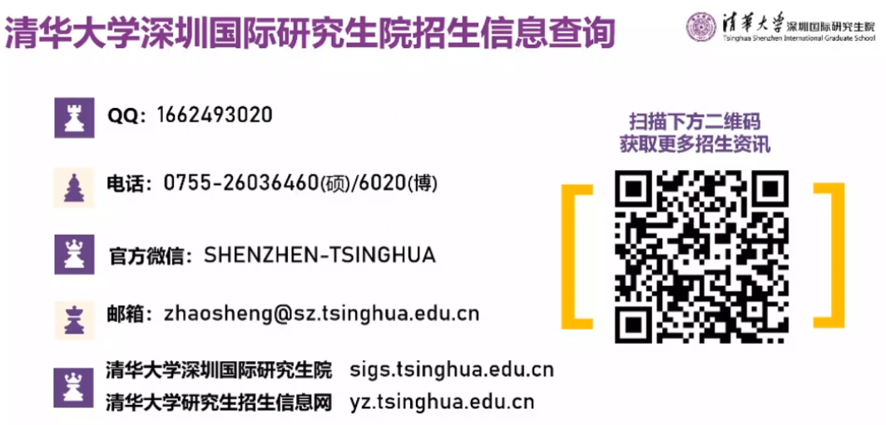

## 2021深研院招生宣讲会

[招生宣讲会录播地址](https://mp.weixin.qq.com/s/gJIOhPiHQ-h4GPdnhhNxWA)

> [清华大学深圳国际研究生院2021年线上招生宣讲会：计算机技术](https://www.bilibili.com/video/BV1ng4y1z7iq)
>
> [清华大学深圳国际研究生院2021年线上招生宣讲会：大数据工程](https://www.bilibili.com/video/BV1GK4y1k7Rr)
>
> [清华大学深圳国际研究生院2021年线上招生宣讲会：人工智能](https://www.bilibili.com/video/BV1F5411472b)
>
> [清华大学深圳国际研究生院2021年线上招生宣讲会：Open FIESTA： BIO³生命技术、互联网+创新设计(IID)](https://www.bilibili.com/video/BV1Mp4y1y7uy)
>
> [清华大学深圳国际研究生院2021年线上招生宣讲会：电子与通信工程](https://www.bilibili.com/video/BV13p4y1y7ge)
>
> [清华大学深圳国际研究生院2021年线上招生宣讲会：互动媒体设计与技术](https://www.bilibili.com/video/BV1if4y1S72r)
>
> [清华大学深圳国际研究生院2021年线上招生宣讲会：海洋技术与工程](https://www.bilibili.com/video/BV1LK4y1b7ji)
>
> 等等……

## 计算机技术（电子信息系）

> 此项目接受所有满足一定分数的学硕未过线的一次调剂。接受学硕未录取的二次调剂。

### 项目总览

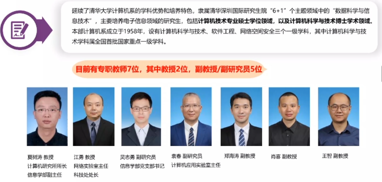

---

### 课题组介绍

#### 夏树涛

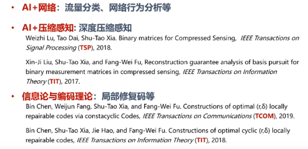

---

#### 江勇

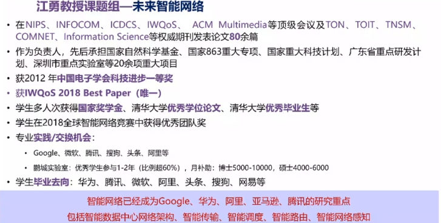

----

#### 袁春

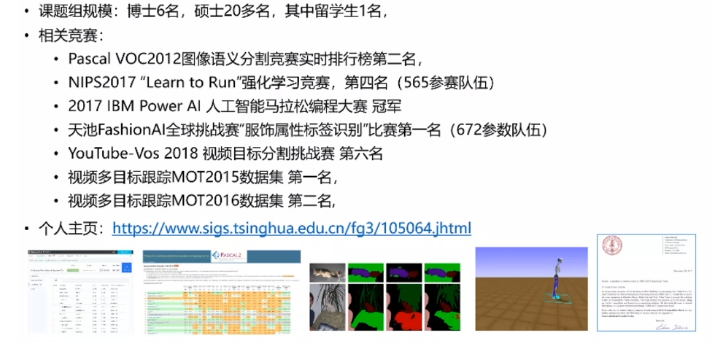

---

#### 吴志勇

---

#### 王智

---

#### 肖喜

---

#### 郑海涛

### 奖/助学金

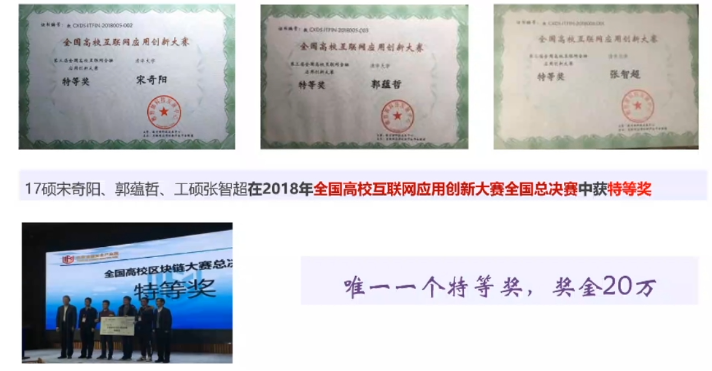

### 学生就业

#### 实践学习

#### 学术交流

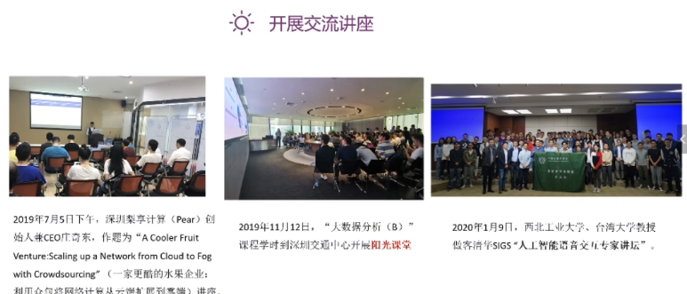

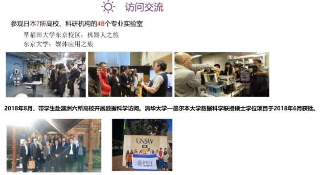

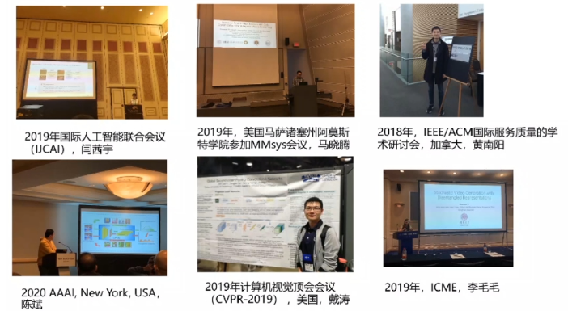

## 人工智能（电子信息系）

> 此项目异常火爆，无调剂名额。

### 研究生院介绍

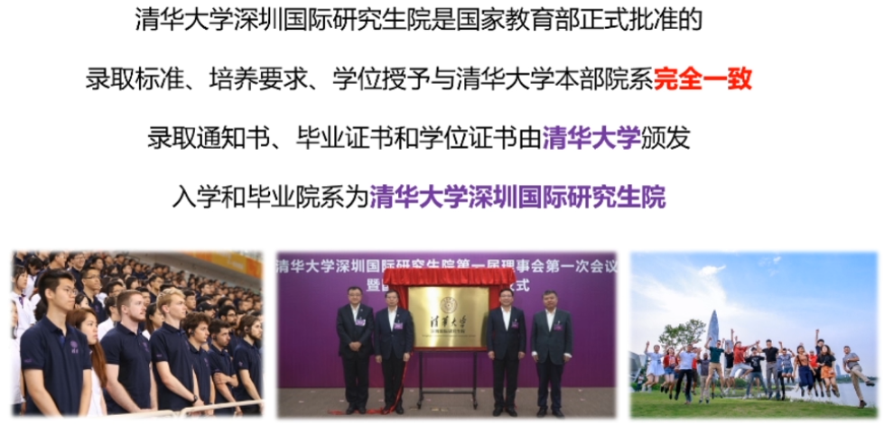

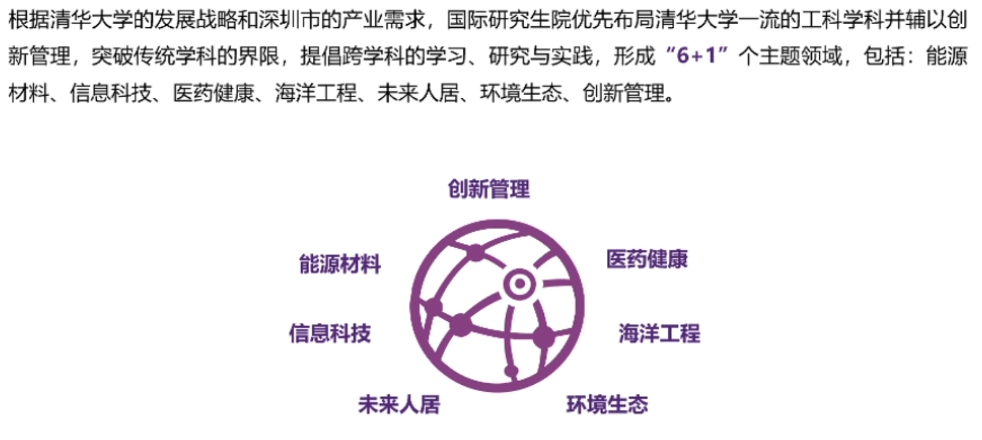

### 人工智能培养方案

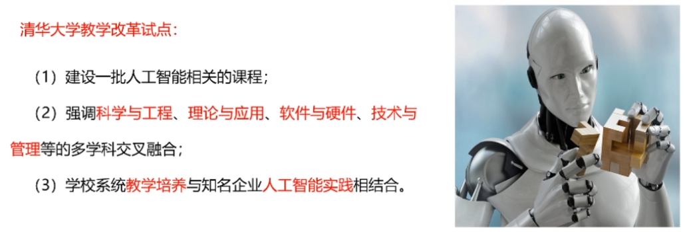

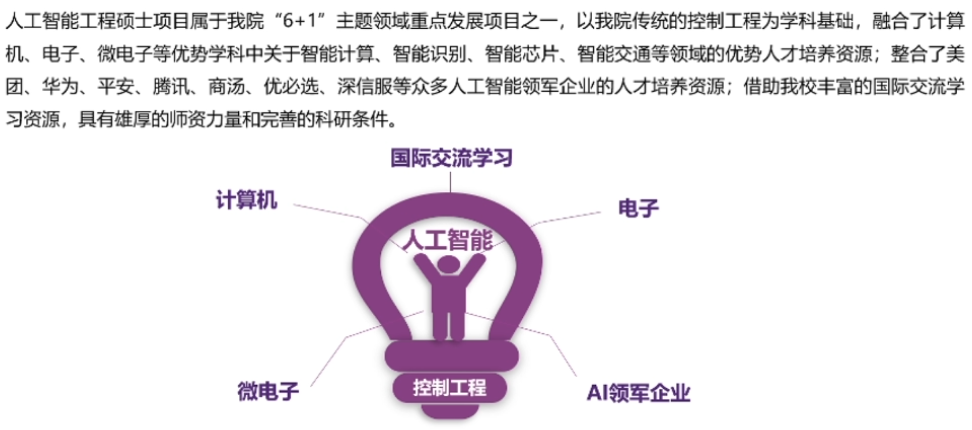

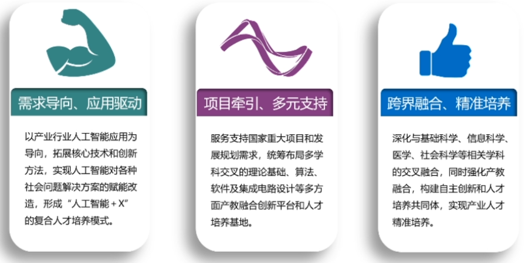

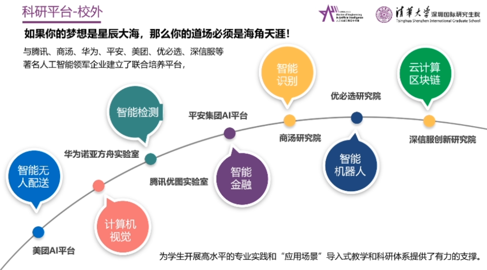

#### 培养路径

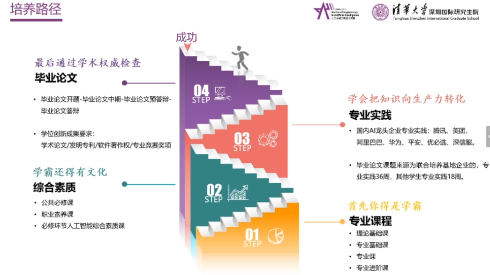

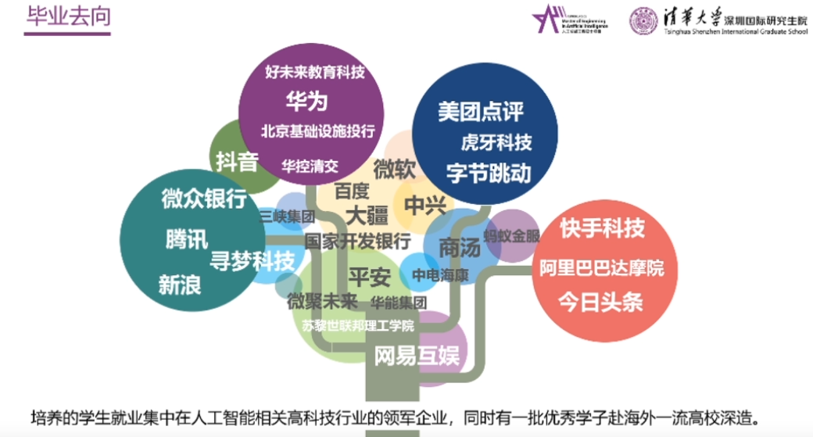

### 项目招生报考

### 项目招生咨询

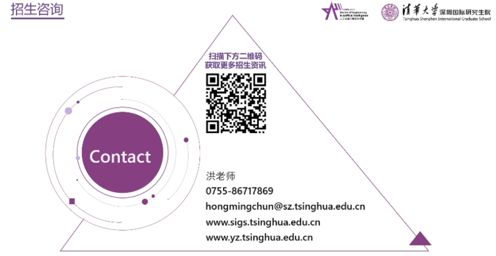

## 大数据工程（电子信息系）

> 此项目通常缺人，但一般不大量面向计系调剂。
>
> 

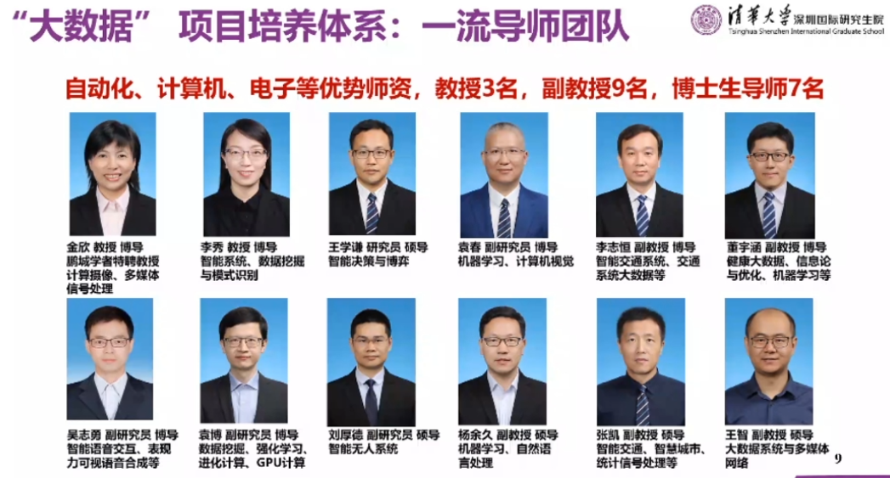

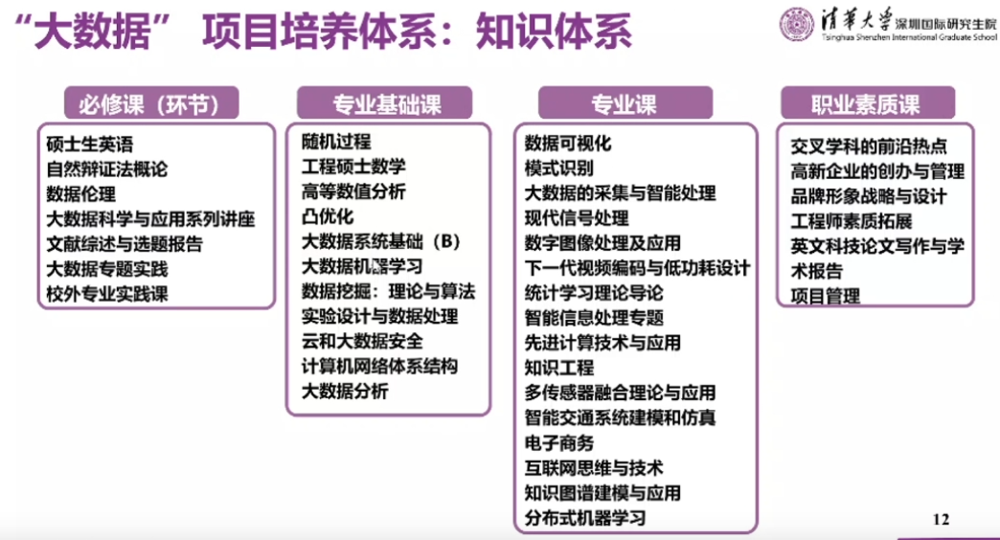

> 10%左右的同学可以深造。

## Open FIESTA： BIO³生命技术、互联网+创新设计(IID)

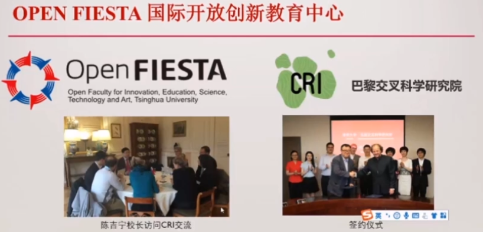

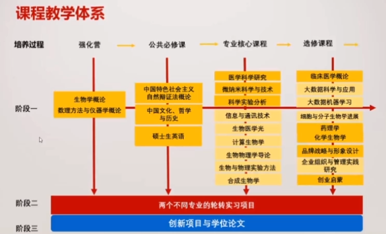

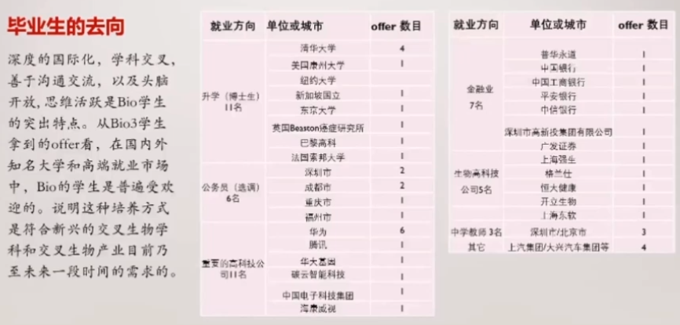

# TBSI（清华-伯克利学硕）

> 此项目通常缺人。需要六级分数。
>
> [2020清华伯克利招生宣讲](https://www.bilibili.com/video/BV1z54y1X7sg)
>
> [清华伯克利深圳学院宣传片](https://www.bilibili.com/video/BV1Wx411E7gJ)

## 调剂要求

原报考专业考试统考科目为101思想政治理论、201英语一、301数学一,总分在310分以上；英语成绩近5年取得TOEFL网考90分及以上 /IELTS7分及以上/传统GRE 1300分及以上/新GRE310分及以上/GMAT675分及以上/CET6 425分及以上/通过清华大学水平I英语考试/在以英语授课为主的国家获得学位。

> 2020需要六级500分。

## 复试情况

复试=笔试+面试；

总成绩（1000）＝初试总分（500）＋复试笔试成绩（100）＋复试面试成绩（100）×4。

### 笔试

参考初试，运筹学、随机过程、数据结构等相关基础知识。 

# 微电子（微电子与纳电子学系）

> 此项目复试会考察电路原理（调剂也需作答）。

# 软院（软件学院）

> 此项目很可能无调剂名额。

## 调剂要求

### 2019

 报考计算机科学与技术系工学、工程硕士生，未被该系录取，总分在310分以上，本科所学专业为信息类的考生。 

## 复试情况

复试=笔试+面试；

总成绩=初试成绩*50%+面试成绩*35%+综合笔试成绩*15%。

### 笔试

#### 官方参考书

(1) 编译原理：Compilers: Principles, Techniques andTools (2ed) Alfred V.  Aho,Monica S. Lam, Ravi Sethi,Jeffrey D.Ullma,Addison-Wesley,2006ISBN  0-32148-6811；

(2)数据库：《数据库系统概论》（第五版）王珊主编高教出版社。

#### 题型

2019年

「数据库」大题（1×50分）

「编译原理」判断题（10×1分），选择题（10×1分），填空题（10×1分），简答题（4×5分）

2018年

「数据库」选择题（10×1分），填空题（10空×1分），大题（1×30分）

「编译原理」判断题（10×1分），简答题（4×5分），解答题（2×10分）

> 软院的面试很公平，不歧视双非，但是不管是谁你不能“初试排名一般”、“项目经历没有”、“面试表现不好”这几条全占；某种程度上说，老师还比较人性化，比如对于跨考生，老师问的专业问题会少一些或者简单一些。 

# 基本知识（调剂）

## 两类调剂

> 假如生活欺骗了你，不要悲伤，不要心急！
>
> 忧郁的日子里须要镇静。
>
> 相信吧，快乐的日子将会来临！
>
> 心儿永远向往着未来，现在却常是忧郁。
>
> 一切都是瞬息，一切都将会过去。
>
> 而那过去了的，就会成为亲切的怀恋。

### 一次调剂

一次调剂指**未进入**原报考院系复试范围的考生申请调剂。

> 可以选择深研院多数缺少生源的院系，如计专、大数据工程、BIO3、TBSI等。

### 二次调剂

二次调剂指进入报考院系复试**未录取**的考生申请调剂。

> 一般是学硕被刷，可以选择专硕/网研。

---

---

---

祝愿前程似锦！

