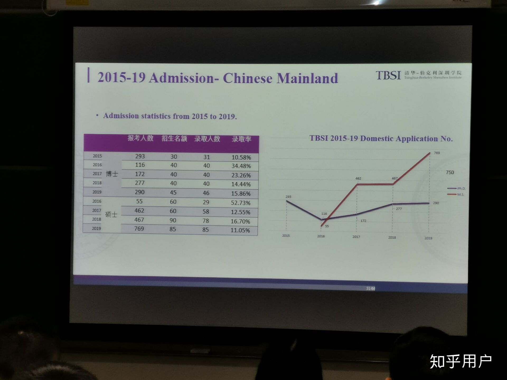
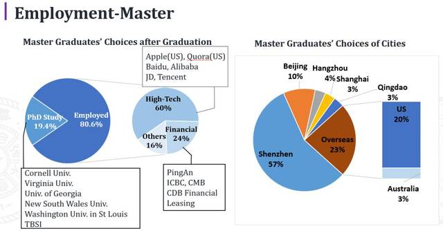

> 以下内容是考研群（Tsinghua IIIS,CS,MSE,INSC,TBSI，**418861856**）中上岸同学之贡献，欢迎希望报考/上岸TBSI的有心人参与以后的更新/维护/整理。在此一并谢过。
>
> > TBSI交流群：**238490203**。

[TOC]

# 声明

由于清华伯克利深圳学院（简称TBSI）的硕士2016年才开始招生且往年的录取人数非常之少，所以催生了本文。本文的结构行文参考了北大CS考研百问，同时也参考了知乎的一些问题的答案，在此对学长学姐表示感谢。

本文的行文目的是为2021考研学子提供清华伯克利必要的学院信息和考研信息。

本文均为学长学姐的个人经验及网上各种信息汇成，旨在造福有决心、有勇气、有毅力的学弟学妹们，普及TBSI专业的考研录取情况，主要为数据科学方向。本文属于2020年考研，具有时效性，未来情况未必和过去一样，属于考研群（以交流互助讨论解答问题为目的，无任何利益关系），且部分数据、说法可能存在偏差，与官方没有任何关系。本文仅供个人学习之用，==请勿用于任何商业用途==。 

**TBSI2020官方宣传片**: [官网](https://www.tbsi.edu.cn/)    [微信公众号](https://mp.weixin.qq.com/s/Pw8NVSklGgmnyslugjaDnw)

# 学院篇

清华-伯克利深圳学院由清华大学与美国伯克利加州大学于2014年9月7日签署合作协议共同创建，面向全球共同面临的重大科技问题和社会发展问题，联合高等学院、政府和企业界开展跨学科学术研究和人才培养。学院将探索“大学-政府-企业”三方合作的培养模式，整合高校、政府和产业界的资源，建立一个国际化的人才培养与研究平台。

学院初期围绕“环境科学与新能源技术”、“数据科学和信息技术”、“精准医学与公共健康”建立跨学科研究中心，进行博士研究生及硕士研究生招生培养，未来将根据发展需要，拓展建立其他跨学科研究方向。

2019年，清华深圳国际研究生院正式揭牌成立，作为清华大学国内唯一的异地办学机构，清华大学深圳国际研究生院是深圳市与清华大学市校合作进一步升级。清华大学深圳国际研究生院由清华大学与深圳市委市政府携手成立，在清华大学深圳研究生院和清华-伯克利深圳学院的基础上进一步拓展，面向全球延揽优秀教师和研究生，通过高层次的国际合作，高水平的人才培养，高质量的创新实践，建设国际一流研究生院，助力清华大学“双一流”建设，为深圳市、粤港澳大湾区建设和区域可持续发展增添创新动力。

清华大学与伯克利加州大学已在2016年5月10日签署清华-伯克利双硕士学位项目协议，该项目已于2016年秋季启动。符合两校入学要求的学生将有机 会通过2年半到3年时间的学习同时获得清华大学的工学硕士学位（目前开设了环境科学与新能源技术、数据科学和信息技术、精准医疗与公共健康三个专业）和伯克利加州大学的工程硕士学位（工程领导力）。

# 考研篇

## 2019

因为我是2020参加考研的，不清楚2019的复试流程以及录取方式，19年一志愿四名数据方向的学生全部上岸，且我认真2019年和2020年一个非常大的不同是：==2019年只需要按照方向来排名（如：数据数据方向），而2020年不仅仅分方向，且分中心。==在2019年TBSI真正体现他的保护一志愿初试成绩算法，数据方向前四名为一志愿考生。估计2020年，有一个复试成绩【不及格】选项。

|   方向    |        录取人数         |
| :-------: | :---------------------: |
| 物理-化学 |           13            |
| 数学-数据 | 13（一志愿4个全部上岸） |
| 生命科学  |            2            |

参考链接：[2019年硕士研究生拟录取名单](https://mp.weixin.qq.com/s/MgubN6w3TgTZpdvlSxVluQ)

## 2020

即使到2020年，TBSI考研在清华里依旧是一个备胎选择，不被大多数人所知道，打好信息战，才能在下次残酷的竞争之中脱颖而出。可能由于TBSI2021要建新楼，迎接110周年校庆，2020年进行了大幅扩招，我相信在2021年会继续扩招（仅为本人判断，不代表任何官方意见）。自2016年招硕士以来，==TBSI每年收调剂，每年复试线就是校线。==所以有了本文来介绍TBSI。但是，我相信关注过TBSI的同学有知道一年三个一志愿上线全部被刷，秉承宁缺毋滥的原则。所以，在清楚认知自己的实际情况之下，谨慎报考。

下图是今年统考名额与复试人数，具体录取人数和相关分数在本文撰写的时候尚未公布，请关注官网相关信息。

有以下几点需要注意：

- 复试人数包括调剂和一志愿，所有中心所有方向TBSI一志愿复试人数未达到统考名额。
- 分中心，分方向分别面试再进行录取，一共今年有6个面试场（包括海外一个面试场）。
- 2020年分中心录取，即使都是同一方向，二中心今年可能未刷一个人，而一中心刷了15个人。
- 初试过了就认真准备初试，一中心的数据方向最高分被刷，==复试才是清华最难的一步==。
- 照2020年情况来看，==TBSI依旧是价值洼地==。但是绝不是300大清，点击就送的价值洼地。
- 理性选择，谨慎报考，不要随波逐流。
- 特别提醒：英文至少不能成为你的弱点，==全英文授课==。

> 根据TBSI群中讨论进行的注释：（来自知乎上的一个回答？疑似保研相关）

> 以前的毕业生去向：

# FAQ

**Q1: TBSI和THU什么关系？如何报考？**

TBSI是THU和UCB下属共建的学院，也是THU和UCB唯一异地教学的学院（TBSI下属SIGS），具体介绍参考学院介绍以及官网。报考一切过程依照清华大学研究生招生网进行，请参考清华大学研究生报考流程。

**Q2: 学位证和毕业证和清华大学有什么区别？**

没有任何区别，唯一的不同是标注院系不同，暂时不确定会标注清华大学深圳国际研究生院还是清华伯克利深圳学院。这是每个学院都有的标注，例如：你毕业于五道口金融学院，那么院系标注就是五道口金融学院。

**Q3: TBSI的办学初衷和理念是怎样的？**

清华-伯克利深圳学院由清华大学与美国伯克利加州大学于2014年9月7日签署合作协议共同创建，面向全球共同面临的重大科技问题和社会发展问题，联合高等学院、政府和企业界开展跨学科学术研究和人才培养。学院将探索“大学-政府-企业”三方合作的培养模式，整合高校、政府和产业界的资源，建立一个国际化的人才培养与研究平台。

**Q4: TBSI和清华大学深圳国际研究生院什么关系？**

2019年三月，清华大学深圳国际研究生院 (SIGS) 正式揭牌，其中提到是和清华大学深圳研究院和TBSI共同成立。但是从2020年的招生录取以及复试过程，TBSI和SIGS依旧是分开的。

参考链接:  [清华大学深圳国际研究生院在深圳揭牌](https://yz.chsi.com.cn/kyzx/yxzc/201904/20190403/1779671280.html)

**Q5: 请介绍一下清华大学和加州伯克利大学的双硕士项目？**

在官网介绍中写到：

> 学生同时注册清华-伯克利深圳学院与伯克利加州大学工学院，获得双边认可学分要求，按规定完成基础课程、 专业课程、创新训练营（Capstone）、学术活动、文献综述与选题报告、年度研究进展报告、学位论文等环节 及相应学位学分，学位论文经导师（组）和评审专家评审后提交答辩。由清华-伯克利深圳学院学术指导委员会 审批答辩委员会成员名单，主持论文答辩。学生通过答辩并符合毕业和学位要求，获得中美双硕士学位：清华 大学硕士学位，伯克利加州大学工学院工程硕士学位。

参考链接：[硕士生教育](https://www.tbsi.edu.cn/index.php?s=/cms/20.html)

这个项目是UCB EECS下的唯一一个非学术学位Master of Engineering项目。硕士申请伯克利的硕士依然是走伯克利正规申请流程且需要自费，学费是5W刀，伯克利EECS 下只有一个M. Eng 硕士项目，这个项目应该是和伯克利商学院有合作，所以卖点加了个工程领导力。之前在某乎也看到一个做硬件的学长拿到了这个项目的录取，同时也拿到了小奖。官方介绍并没有说读了这个学院申请这个项目有多少的加分。但是你能大概率接触到UCB的教授资源拿一个强推，所以懂者自懂。至于参加了这个项目能不能留下来美国工作或者其他问题可以自行查询美国的永签要求，在这里不作过多回答了。

想了解UCB这个项目参考链接：[M.Eng. Student Guide](https://eecs.berkeley.edu/resources/grads/meng)

**Q6: 学费多少？**

按照清华大学正常学硕收费 8000人/年。

**Q7: TBSI的奖助问题是怎么的？**

TBSI 硕士 补助为 北京的补助1200+深圳的补助600+实验室的补助。

TBSI 博士 补助为 北京的补助2800+深圳的补助1000+实验室的补助，另外TBSI对博士设立了学院奖学金，分为5W（占20%）,3W（占60%）,1W三挡（20%），所有的博士都会获得这个奖，只是根据学术成果评定相应的奖励档次。

参考链接：[奖助学金](https://www.tbsi.edu.cn/index.php?s=/cms/index/jiangxuejin.html)

 **Q8: TBSI的PI（核心科学家）有哪些？**

TBSI的导师可分为四类，

（1）第一类是北京本部的导师，有的经常来深圳，有的把学生托管给深研院的老师，有的实验室组会貌似是和本部的一起开的；

（2）第二类是深研院的老师；

（3）第三类是学院自己招聘的导师，可以去官网去看，全是清一色海外名校的博士；

（4）第四类可能是伯克利的导师，因为国内导师名额有限，可能要挂靠在伯克利的导师名下，伯克利的导师应该不会管硕士生的；

选择一个大牛的导师或者一个热血的年轻导师是有不同的价值观念的。选择一个大牛的导师可能由小老板带着，但是资源的问题是不可比拟的，学术也是一个圈子。选择一个年轻的导师，可能你会在被push的路上越走越远。仁者见仁智者见智，不作过多阐述。

**Q9: TBSI如何确定导师？**

开学双选。

**Q10: 有哪些研究方向？**

TBSI下设三个中心，主要分为：物理化学方向，数据科学方向，生命科学方向。每个中心有不等的实验室，在这里不作具体详细介绍。

参考链接：[研究中心](https://www.tbsi.edu.cn/index.php?s=/cms/index/keyan.html)

**Q11:培养方案是怎样的？**

官网有详细介绍，请参考官网。

**Q12: 就业如何？企业认可吗？**

数据方向的就业基本上都是能叫的出名字的公司。

参考链接：[2019毕业生报告](https://mp.weixin.qq.com/s/5yVFY_lpslL3f4hEIcqf3Q)

**Q13: 为了以后的选调生，毕业可以转一级学科吗？**

取决于导师，有转成功的，转到导师所在的一级学科。没有非常确切的信息。

**Q14: 可以硕转博吗？**

可以，TBSI的硕士为学硕。

**Q15: 可以去北京培养吗？**

取决权在于导师，如果你导师在北京有项目且需要长期呆在北京，是需要去北京的。

**Q16: 全英文授课吗？**

是的。

**Q17: 我看到夏令营对报考生有英语要求和绩点要求？对一志愿考生有吗？调剂生呢？**

夏令营和考研统考不一样，统考对英语和绩点没有任何要求，具有报考资格，但是英语和绩点是复试的重要的参考对象。

对于调剂生而言，在2019年只要求过六级，2020要求六级过500，才有调剂资格，具体细节参考官网。其他语言：

① 托福（TOEFL）网络考试成绩在 90 分及以上； ② 雅思（IELTS）成绩在 7 分及以上； ③ 传统 GRE 考试成绩在 1300 分及以上或新 GRE 考试成绩在 310 分及以上； ④ GMAT 成绩在 675 分及以上； ⑤ 国家六级英语考试成绩在 500 分及以上；

**Q18: 我是双非跨考，怎么办，会被歧视吗？** 

不歧视。

其实对于歧视而讲，这是你的过往经历，不存在歧视一说，但是这是老师你评价的一个重要参考对象。最好的证明就是双非有上岸的，用能力说话。

**Q19: 这个数学数据的研究生和国内普通计算机研究生学的东西一样吗？**

大部分关注TBSI的都是他的数据track，在TBSI在非常强的教授和实验室。你想做前沿的DL, ML, TBSI也有非常多的机会。在知乎有介绍二中心实验室的老师信息，请自搜寻。但是TBSI建院的一个目标就是打破学术壁垒，学科交叉。这需要你把自己的视野再放大一点，问问自己你到底想做什么？什么是计算机技术和人工智能？我到底想做什么？我要不要去过更多人竞争的独木桥？我是不是一定要进入清华大学的贵系才能叫做我去学计算机了？包括如今的控制工程等其他学科都是和计算机技术离不开的，打好考研的信息战是你的一门必修课。

**Q20: 有没有复试资料可以参考？**

没有，每年考研情况科目由于特殊原因不尽相同。可能2021年又变了，但是==TBSI是会公布复试参考书目==。2020年数据方向考研科目为数据结构，参考书目是严奶奶的那一版。如果大部分人亡邓公的去看，又是怎样的场景？在这一点，TBSI已经为你降低难度了。但是几年看下来，数据结构这门课是不会怎么变的，是核心科目。余旷老师在知乎讲了一下复试问题，值得你报考之前好好读一下，同时也有2020年数据方向的初试回忆贴。

参考链接：[知乎：清华-伯克利深圳学院考研如何准备？ ](https://www.zhihu.com/question/341951107)

**Q21: TBSI调剂生和一志愿一起复试吗？**

是的，参考Q25

**Q22: 什么样的学生在复试的时候比较有优势？**

在我撰写本文的时候，SIGS官方微信公众号写了一篇文章，我非常认同。

参考链接： [什么样的学生在TBSI面试中更受青睐？](https://mp.weixin.qq.com/s/joTwzKQHEP9VZ1esPae2mQ)

**Q23: 专业课如何准备？**

每年初试的专业课不尽相同，参考官方信息以及相关科目备考经验贴。

**Q24: 导师信息？**

请参考官方网站有相关介绍，同时你也可以查询导师评价网，知乎，贴吧。但是，请具有一定的分辨能力。

**Q25: 复试流程是怎样的？**

2020年是以网络复试进行的。首先学生在审核会议室进行资格审查，然后就等待进入面试室了，面试时间20分钟，包括3 -5分钟英语自我介绍，剩下为专业课和基础知识问答，严格控制时间。

**Q26: 为什么每年都在改专业课？**

这个问题余旷老师的问答具有一定的参考性。

> 关于复试笔试，这个比统考更重要一些，但在我们track重要性也有限。这里我们TBSI，或者更确切的说，我们TBSI物理-化学track自有国情在此。根本原因在于我们现在搞交叉学科，物理-化学track其实是一个大杂烩，里面有做环境化学的，也有做光电器件的，需求很杂乱。最后决定考大学物理而不是大学化学其实也是大家扯皮均衡的结果，考题也不会很难。所以，我在这里替做环境的同事说句话，各位环境（还有化学）背景的学生，如果看到我们考大学物理请千万不要被吓到。考的没有其他考生好也不要灰心。因为again，真正重要的是面试，只要你在笔试中表现出了合理的智商，我们是会考虑你的专业背景的。
>
> 
>
> 作者：余旷
> 链接：https://www.zhihu.com/question/341951107/answer/800670281
> 来源：知乎
> 著作权归作者所有。商业转载请联系作者获得授权，非商业转载请注明出处。

**Q27:一中心的低碳实验室怎样？金融可以报考吗？**

孔老师人非常好，春风和煦的，目前实验室有一个研究助理，两个博士后，tbsi宣传交叉学科，欢迎各个学科的同学报考，仅供参考。

**Q28: 保护一志愿吗？**

保护一志愿的。

但是照2020的情况来看，==复试有不及格选项，直接淘汰==，所以初试过了就请忘掉初试认真准备。

调剂生初试成绩折合算法为：
$$
500-\frac{（500-初试成绩）*（500-学科门类复试分数线）}{500-考生所报考专业学术型硕士复试分数线}
$$
例如某调剂生考了380分，相关专业学硕线是360分，校线为300，那么他的初试折合分数就是：
$$
500-\frac{(500-380)*(500-300)}{500-360}=328.57
$$
**Q30: 到时候复试被刷可以校内调剂吗？**

时间上来讲基本上不可以。

因为往年包括今年都是在最后一批进行复试，这个时候其他学院的校内调剂基本上已经调剂完成了。

**Q31: 报录比如何？**

不了解，清华大学不公布报考人数。

**Q32: 录取办法是怎样的？**

- 总成绩计算办法 总成绩=初试成绩（若为调剂，则折算初试）+ 综合材料审核*1 + 复试面试成绩 * 4 

- 根据各面试小组的名额，依各组总成绩由高到低排序，遵循志愿，择优录取。

值得提起的是，今年是TBSI第一次把综合材料审核作为100分加入到总成绩的测算中，更加接近于国外大学入学的申请-审核制。

**Q32: 计算机方向有机试吗？**

没有。

**Q33: 请客观评价一下清华伯克利的考研难度？**

初试不难（相对比清华912和408难度），都是校线，复试看英语和专业能力。评价自己能力，合理选择。

**Q34: 网上说的TBSI学生放养是真的吗？**

不是当事人，真实性自己评价。由于双选制度，增加自己的核心竞争力才有可能跟上自己感兴趣的课题和导师。

**Q35: 学长/学姐，你对TBSI怎么看？**

TBSI还很年轻，所以固然存在一些问题。但是清华大学和加州伯克利大学在深圳市政府的支持下敢于尝试第一步。清华大学一直都是中国教育制度的探索者，从清华国际深圳研究生院，到清华大学新闻传播系不再招收本科生，都在尝试新的探索。TBSI的导师都是世界一流的导师。

我在写个人陈述的时候有这么一句话： Begin with TBSI, step into the world. 你有多少能力，我相信清华伯克利就能给你多大的舞台。

**Q36: 如何在本部和清华伯克利之间选择？**

这个选择不仅仅是北京和深圳的选择，同时也是专业方向，考研难度，导师，环境未来职业发展规划的选择。如果你认为本部更加适合你的未来发展，那你应该去本部。

**Q37: TBSI的学生的学籍在深圳还是北京？**

2019年是同清华本部统一管理，北京。

**Q38: 可以出去实习吗？**

没有统一规定，取决权在于导师和中心。

**Q39: 我看到淘宝上有相关专业课资料，我需要买吗？**

没必要，淘宝上有的，你都能找到。

**Q40: TBSI的官方系统需要填写吗，如果到时候需要修改怎么办呢？**

按照规定，官方系统是必须填写的，且有截止时间，除去重要的审核材料。内容有：个人简历（中英文），个人陈述（中英文），研究计划（中英文）。一般来说，没有过初试不会认真去斟酌这些东西，我当时是全部提交空白文档上去。当你初试过了的时候，招生办老师会重新开放给你，你需要重新提交文件。

注意：今年材料审核100分直接纳入总分，不可忽视材料部分的准备。

**Q41: 能不能讲一下TBSI的好处和优势？**

我相信在看完之前的所以的回答你会TBSI在学术方面已经有了一个非常直观的印象。那么我讲一讲其他三点：

- 如果有某个导师愿意要你，你想找哪个老师都是可以的，不存在复试前就确定导师的情况。

- 实习优势，深圳。

- 环境和生活。环境非常好，在大学城。2021，清华大学深圳国际研究生院一期（TBSI院区）为了迎接110年校庆，预计在2021正式投入使用。你看到了首页那栋建筑了，就是TBSI新院区，所以2021大概率还会继续扩招。

再看看他的规划设计的新寝室（左为单人间，右为双人间）：

# 时间线

1、写在最前，建议合理评估自身实力，在清华，初试只是门票，初试考的高没啥优势，评估自己除了初试课程以外，有什么亮点能吸引老师，尤其建议跨考+无相关项目的学生，谨慎报考，清华的名头不值得大家前仆后继（虽然我知道还是会有一大批大佬和铁头我不在乎这些）。下面正式开始。

2、如果你确定了报考TBSI，请时刻关注官网，说不定发的通知偷偷摸摸就找不到了。一定要避免闭门造车。大概在**八月**左右，TBSI会在官网上公布考纲，这一点在清华各院系里算是良心的。

3、同时，清华研招网会在**九月初**公布招收统考生的招生专业目录，**十月初到中旬**公布带人数的招生简章，TBSI的官网也基本上会同时出一个统考须知。值得注意的是，TBSI不仅需要在研招网上填报志愿，还需要在自己TBSI官网的招生目录上填报相关信息，包括基本信息和各种经历奖项，**简历（中英文），个人陈述（中英文），学习计划（中英文），成绩单，身份证**什么的。报名系统开放时间跟研招网报志愿时间同步。根据经验，这个时候不填报官网的系统也是可以的，复试前这个系统会重新开放，可以这个时候填写或更新。不过你也可以报名的时候填报，看你权衡选择。

4、研招网的填报不再赘述，应届生和往届生报名流程网上都有详细教程。记着**十一月**还有一个现场确认，各地政策不同，一定不能忘了。**十二月初**打印准考证，这玩意无论复试初试都是必须的，建议多打几份保存。不过初试成绩公布后会再次开放下载打印通道，不过没必要，建议十二月一次搞定。

5、按照正常来说，**二月初**会出成绩，大概**三月中下旬**会进行复试，第一天资格审查加笔试，第二天面试完当天晚上出录取结果。值得注意的是调剂生和一志愿考生是一起复试的。名义上分数计算是保护一志愿的，但我一开始也说了，初试在清华压根没用，建议忘掉初试，所以实际上，对一志愿考生的保护的话，大家可以自行理解。

6、录取之后的工作就是流程式的工作，跟着通知走就好，在此也不多言了。

7、关于找老师，据我所知，复试前找老师的意义目前来看不算很大，老师大部分都不会回，自己心里不要虚。毕竟导师选择是九月双选。复试拟录取后找老师也会有很多老师不会回，每个老师的招生名额也得九月才能知道。

8、最后说一句，建议能提早确定报考学校专业，确定了之后就别乱想了。临时改志愿然后成功的有，有不少，但是对于大部分来说，还是专一目标明确，可能性更大。同时，也希望大家能有信息搜索能力，这玩意别看对考试没用，但是事实上，考研是信息战，能更快找到更有用信息的同学，上岸的概率明显高于傻乎乎的同学。就是这样。

# 复试回忆

## 一中心+物化方向

背景： 双非一本，非应届，本科石油工程，跨专业；本科成绩排名5/60（不要问为啥没保研了，我们专业保4个😂），科研有一个省级大创，一个本科生优秀毕业论文。

复试：进入面试室后先是三分钟的自我介绍， 然后根据提交上去的成绩单，个人陈述，研究计划，简历进行提问。基本全程英文，听不懂的老师会说两遍，或中文解释，4-5位老师，戴着口罩，面前放着电脑。老师亲切，气氛较好。

老师1：简单介绍一下自己

我：balabalabala

老师1：好，我看你成绩单上概率论与数理统计分数挺高，那么用什么表示两个变量之间的相关性？

我：相关系数，协方差；

老师1：协方差如何表示？

我：EXY-EXEY；

老师1：OK（点头），你研究计划上写读研期间要在高水平期刊发2-3篇论文，为什么不是5-6篇，8-9篇，或者更多?（其他老师都笑了......)

我：（懵逼脸）我想先定个小目标，慢慢积累经验balabala

老师1，3, 4：你研究计划写研一要写1-2篇文献综述，为什么才发1-2篇？为什么发文献综述而不是发paper？写文献综述有什么好处？（老师们在笑）

我：......我想慢慢来，能发论文最好，先发文献综述练一练吧（不知所措脸）

老师2：你对实验室哪个方向比较感兴趣?

我：我对纳米能源材料在新能源方面的领域比较感兴趣；

老师1：为什么对纳米能源材料感兴趣？

我：因为它与很多很好的性质，有广阔的应用前景balabala

老师2：纳米能源材料在新能源领域有哪些应用？

我：锂离子电池，超级电容器等，因为有良好导热导电性，所以可以做锂离子电池负极材料balabalabala（这个问题提前准备过） 

老师1：我来问一个，为什么导电性好可以做电池负极材料？石墨烯比石墨的好处在哪？

我：（想了几秒）不好意思，这个我不太了解；

老师3：你对锂离子电池是了解还是感兴趣？

我：我只是比较感兴趣，但不是特别了解，希望研究生阶段能深入学习一下；

老师2：你读完研究生之后的计划是什么？

我：（我听成了读研计划了）balabalabala

老师2：不是，是毕业后的打算；

我：啊，不好意思，我毕业后如果科研顺利就继续读博，科研不顺利就工作

老师4：我看你本科是石油工程专业的，那雷诺数是什么？

我：不好意思，我只记得雷诺数可区分层流紊流，2300以下是层流；

老师4：（不太高兴脸）那你说一下他的量纲是什么？

我：（我记得好像是无量纲，但没敢说）不好意思，这个问题我真的忘了；

老师2：你从科研项目中学到了什么？

我：balabalabala（内心窃喜，这个题我会，很流利地说了出来）

秘书说还剩三分钟，切换成大屏幕，只有一个男老师（面善又可爱），又问了我几个问题；

老师：讲一下你的大创项目

我：balabalabala（提前准备过）

老师：纳米能源材料在我们日常生活中有哪些应用？

我：balabalabala（也不知道对不对，反正我就一直说）

20分钟到了，结束。

总之，研究计划好好写，可以把目标定的稍微高一点点；本科做过的项目一定好好准备，老师如果不是这个领域的会问的简单一些，如果是这个领域，会问的深入一些；对自己感兴趣的领域（个人陈述中写的）一定要深入了解，老师一定会问，问到你不会为止；本科分高的科目重要知识点复习一下~

## 一中心+数据方向

背景：985，应届，统计学专业（双一流A+学科），排名26/127。科研方面有两个国家级大创（Leader），一个挑战杯重点培育项目，获得国家级奖项7项，一作撰写论文8篇（本科都在搞科研了，学习一般），3份实习（只写了一份，不建议写多，而且老师也没问实习）。六级过500。

复试： 

自我介绍3分钟左右。因为科研项目比较丰富，老师主要问项目方面的内容。

（因为大多数问题我回答比较长，就不罗列我的回答啦，以下罗列老师的问题~）

Q：我看你的材料中你写过一篇最优疏散规划方面的论文，介绍一下项目，用了什么模型算法，创新点，你负责哪方面的工作。

（可能是因为我balabala讲得蛮细的，老师没有多问下去，就追问了以下一个问题)

Q：你为什么用元胞自动机模型，它有什么限制吗。

Q：你讲一讲基于Adaboost巴拉巴拉这个项目叭。

Q：你们这个项目用到的模型和算法是你们自己提出的吗

Q：Adaboost的训练步骤。

Q：你为什么用决策树作为子分类器，有尝试过别的分类器吗。

Q：你除了对XXX实验室感兴趣，对其他实验室感兴趣吗（自我介绍和个人陈述都提到我对XXX实验室感兴趣）。

A：我对工业工程与运筹学方向也非常感兴趣，运筹学运用领域特别广，可以在军事、管理巴拉巴拉领域给予一些决策指导。

Q：好啊，你说你对运筹感兴趣，那你举一个运筹学的具体例子叭。

Q：你学过DL吗？

A：没学过DL，我只学过ML，抱歉，如果有需要我之后会认真学习的。

（因为没学过，所以老师就没有问DL的知识啦）

Q：你本科成绩多少。（因为我简历上没写成绩）

Q：你本科排名多少。你们专业有多少人。

Q：你们学校统计学是在数学院下的还是别的院下的。

A：数学院下的。（emm，看老师表情还挺满意的，也许是因为双一流A+学科）

Q：讲一下你的研究生阶段计划，讲一下三年后你打算做什么。

【基本上每个问题老师问的不是很深，但我答得比较深入，所以基本都没有追问下去，时间最后是超了】

好像就这些问题了叭，可能有遗忘了一两个问题......我的面试经历还是非常友好and顺利的，之前和同考TBSI的小伙伴经常练习口语，全程英文问答比较轻松，老师也非常友善，第一个问我问题的是陈老师，老师人非常友善，一下子就不紧张了，于是就非常顺利地完成了面试~~~

## 一中心+数据方向

背景：双非，本科土木专业大跨 85/100。TOEFL 94，Kaggle 前0.5%，银。国创(Leader），发明一项，普刊一篇。CSC奖学金，暑期交换。手里有hkust和technion的MS offer，疫情原因全部quit了。在此感谢一下所有在复试过程中提供过帮助的人，特别感谢一下HKUST的郑博士在复试过程中提供的帮助。

复试： 

首先老师进来让我自我介绍，全程没有问我基础知识，都是追着我的项目问的，。另外一中心的老师可能做机器学习的不多，所以我主要做机器学习的项目没有深入问，只是问了很基础的内容。另外对着我的成绩单也一直在问，有0分。

陈：请自我介绍。

我：balabala

老师：介绍下你的第一比赛

我： balabala（kaggle数据竞赛）

陈：你用三个基础模型（Ridge, SVM, Lasso）三个模型有什么区别？ 

我：主要ridge和lasso他们的正则化不同，我只是用这三个基础模型跑一下数据，看哪个模型的效果比较好。【没有深入追问，最后用了lightGBM,做最后的优化，没问，老师对机器学习真的没有很多的深入】

肖：你了解神经网络吗？知道有什么优化算法？

我：我对神经网络只是初学的阶段，我知道的机器学习优化有：BGD/SGD/MBGD 神经网络的优化有：RMSprop/Momentum以及他们的组合Adam【没有深入追问】

老师：讲一下你的发明专利以及人群移动模型。

我：babababab.

老师：你这门课为啥零分？

我：当时有学校认可的国家级比赛奖状，可以抵消选修课的学分，我也忙着打比赛，选课也不能撤销，就零分了。【老师对成绩真的蛮看重的】

陈：是必修课吗？

我：不是。

陈：你对什么方向感兴趣？

我：我一直想去XXLAB。Balabala

陈：我们实验室没有这个方向你愿意来吗？

我：我当然愿意，陈老师您是我的偶像【认真脸，不吹笔】。我看了您的方向，大数据，智能交流，运筹决策，我都非常感兴趣。如果我学有余力，我在完成本实验室要求的任务之下，我会继续深入我感兴趣的方向，拓宽我专业知识的广度和深度。

陈：我看你概率论和统计学习过，概率论和统计学的区别是什么?

我：统计是用样本估计总体的某一个不可能知道的值（例如全世界的人的平均身高），概率是具体一个事件的概率。【乱说的，没准备过这个问题】

总的来说，在认真准备的前提之下，复试过程不要尬，不要不懂装懂，如果一个过程下来你感觉不那么尬，一般就没什么问题了。

## 二中心+数据方向

背景：某工科211，本科光电，大跨，85/100，做过几个成像项目，做过一个深度学习项目，本科比较混，托福90+

复试：自我介绍，不多说了，不到四分钟。主要在追着我的项目问，但项目细节没问，主要问了一些延伸的问题。

Q：先问了我有没有想去的实验室，有没有了解相关的工作。

A：blablabla 因人而异得答吧，建议还是先了解一些比较好，感觉问的概率很大。

Q：强化学习是什么样的，简单讲一下评价函数。

A：分为value-base和policy-base的blabla（项目有涉及到）。

Q：你做到迁移学习是data-base的还是knowledge-base的。

A：data-base的。（老师还花了两分钟给我讲什么是knowledge-base的）

Q：线代的基空间，正交向量，向量标准化。

A：blabla（唯一跟数学有关的部分，我答得稀烂）

Q：机器学习中正则化。

A：简单答了一下，没讲太多。

Q：监督学习，无监督学习，说几个无监督学习的例子。

A：pixelrnn/cnn，vae，gan。

Q：讲讲gan，分类是无监督还是有监督，聚类算法呢？

A：这部分我会。

Q：机器学习和深度学习的区别。为什么叫深度。

A：说了几点，感觉不全面，因为我直接学的深度学习，对机器学习的理解着实不深。

Q：问了我本科数字图像处理相关的。

A：讲了几个滤波器处理噪声，然后承认这一年没看过了，有点记不住太多了。

Q：追问：那你这一年在干嘛。

A：学习一些计算机相关课程比如数据结构，计算机体系结构。（吐血

Q：你排名应该能保研，为什么不保研。

A：想转方向，符合未来规划，就放弃了保研。

Q：为什么学习了计算机体系结构，以后想不想跟着做体系结构。

A：出于兴趣，愿意。

Q：在伯克利交换的时候干嘛了。

A：blabla。

Q：知不知道slam。

A：我听成sram了。。。讲了半天废话，老师说不是，我只好说不太熟悉。

反正就是，我本身比较混，但是可能因为我不紧张，临场反应还算可以，可能给老师留下的印象还行，就被老师捞了一手。大家一定要展现自己的优点，只要有老师看上，初试高一点或者低一点，根本没有区别的。大概就这样。

##  二中心+数据方向

背景：广东985，应届，数学与应用数学专业，85/100，六级不到500，美赛M奖，数学竞赛省级奖，没什么项目，一份实习

复试：

自我介绍3分钟内。老师主要针对自我介绍及个人陈述问编程、数学、机器学习、研究兴趣问题

Q：熟悉什么编程语言

Q：虚函数是什么

Q：知道哪些回归预测算法，机器学习算法如何选择？

Q：神经网络的反向传播是做什么的？具体数学原理？

Q：本科数学的哪些课程对学习机器学习和深度学习有帮助？

Q：学过泛函分析吗？

Q：你联系了哪个老师，他具体是做什么方向内容的

Q：知道PCA、特征值分解、奇异值分解？特征向量唯一吗？

还有一些问题没听清楚，老师就换了，可能我的自我介绍给自己挖的坑有点多，也没有什么项目可以问，老师问的比较散，还有对数学要求比较高，问算法时深入原理。

## 二中心+数据方向

背景：本科南京一211计算机专业，绩点中上，没考六级，只有一些算法竞赛奖，没什么牛逼项目。伪三战上岸。

一战考北大信科没好好准备后来放弃了，信工也不太想去，二战还是信科，压线一分进被刷，于是选择找工作。今年考研没有辞职，时间比较紧，好在初试和复试都比较轻松。在考tbsi大佬中算菜的。

复试：上来就是自我介绍，不过老师加了一句说说为啥要报名tbsi。

Q:问我想去哪个实验室，

A:我说想去物联网相关的因为我本科专业是物联网。

Q:毕业后计划是什么

A:如果我觉得我能在我的领域做出一些贡献，我就会读博，如果我能熟练应用各种算法，我就去工作。。

Q:物联网是什么，以及叫我举个例子。

A:XXX

Q:介绍SVM，如果数据不线性可分怎么办

A:XXX

Q:学过哪些数学课程，学过概率论吗（话说都不知道考研要考这个吗）。

A:学过。

Q:n个正态分布(0,1)加起来是什么

A：如果他们相互独立的话，服从(0,n)正态分布。

Q:问我为什么高斯分布又叫做正态分布

A:（emmmm懵逼了几秒，不知道为什么）我不知道，但是我能猜一下吗

Q:please

A:我猜是因为中心极限定理中任何分布的均值在样本充足之下都服从正态分布。

Q:??????

A:sorry i dont know whats your meaning..

Q:(换了个问题)??????

A:(emmmm还是不懂)sorry i dont know whats your meaning..

Q：图灵机!知道啥是图灵机吗

A：知道。。xxxxx

Q:可导的函数一定连续吗？

A:（他不说偏导，我默认一元了）一点连续

Q:存在不连续但是可导的函数吗？

A:(正在思考。。。）老师：时间到了，好啦收工了，拜拜

A：拜拜、、

总之，就问的一些线代、概率论、机器学习以及计算机的基础知识吧。关于项目的我也写了不少，都是工作中的，老师一个没问，应该是不感兴趣。中间有好几句都没听清，有的他会说慢点，有的直接跳过了。当时那边不知道是不是因为两个话筒互相干扰，噪声非常大，，有点搞了我一手心态。

## 二中心+数据方向

背景：长江中下游985，cs专业，在校期间纯混子无奖无论文。现在在上海某金融国企工作。

复试：

我之前简历写了很多本科做的项目，准备的时候也是想着老师会深入问项目用到的知识点。但老师其实很关注一些重要学科，比如信号与系统，虽然我拿了4.0但基本都忘光了，老师问了我时域频域转换和傅里叶变换两个问题，全没答出来，第一印象极差。。。之后还有一个老师问了我现在所在公司的一个东西，没接触过，又没答上来。。。后面问了一些机器学习和深度学习的知识，knn，kmeans，无监督和监督学习区别，svm概念和softmax回归，基本还能答得上来，后来问了数据降维，我一听，肯定用pca啊，刚准备把pca实现说下去，老师就问pca基础是什么，应该是svd，当时没答出来，但后面老师又深入问了，开始问奇异值分解，特征值分解的实现，老懵逼了，只能拿中文回答李永乐老师教的一些做题技巧什么的，反正这个方向深入问了挺久的，感觉老师对数学基础相当重视。

## 二中心+数据方向

背景：长江中上游某985土木专业工作后跨考，本科排名80/420，土木专业校内科研经历一项，数学竞赛省级奖一项，美模M水奖一个，英语六级刚过，大三考过一次托福90+，cs+ee领域paper三篇（一篇一区一篇二区，一篇EI，影响因子都一般），三个相关领域的科研实习经历。

复试：

​      参加interview之前的这一个阶段，我主要建议大家的还是一个心态的问题，其实在这个阶段你能提升的时间以及方式都不多了，interview考察的是你大学几年的不断积累以及综合素质，这一阶段去做一些临时抱佛脚的操作其实用处不大，在每天坚持练英语，复习专业课知识的同时，更多的是调整好自己的一个总体状态，过于紧张你会在真正interview的时候不敢说，怕说错，给老师留下内向，思维不活跃，抗压能力差的印象，这些缺点对科研工作者来说都是大忌，在给你面试的老师那里也是极大的扣分项，但也不要过于放松，过于放松会容易出现表达错误，高谈阔论，给老师一种不踏实，随意的印象，这些缺点对科研工作者来说同样是大忌以及扣分项。不骄不躁便是最好的应试状态（，所以你的状态真的非常非常重要。除了心态问题，还有一些临场的问题圆场问题，但我想说的是大家永远要记得，我们就算积累得再多，在这个领域也不可能有在这个专业摸爬滚打多年的教授们知识经验丰富，所以遇到不会或者没准备到的问题，千万不要慌！千万不要慌！这太正常了，关键在于我们在被问后，应该怎么处理，这里网上也有很多经验。我觉得最有效的方式还是在于大体原则要体现你虚心诚实，大方得体宠辱不惊，爱思考这三点。具体来说，虚心诚实就是指你不能不懂装懂这是interview中的大忌，你首先应该坦白告诉教授关于这个问题确实没有涉猎到这一块，并表示歉意。大方得体宠辱不惊便是在于，你的说话不能有气无力或者畏畏缩缩，老师其实也是通过问你一些比较刁钻的问题来考察你的临场抗压能力和反应状态，我们坦白诚实不假，但也不能被震慑住。最后一点最重要的体现你爱思考的品质，虽然你不知道这个问题，但是你可以利用你已有的知识对教授对你提出的这个问题进行你自己的剖析，并给出一定的看法或者解决方案，大胆说出来，即使错了也没关系，大部分教授都很友好，会慢慢引导你。以我自己举例，我在被提问时问到了关于machin learning logstic regression 中crossentrophy loss function（交叉熵损失函数）的数学推导，我便现场推导出来了，老师因此可能觉得我原理掌握得还不错，便紧接着问了我带有softmax处理单元的神经网络分类器是属于discrimination（判别模型）还是generate（生成模型)，由于我对这两个概念只是有一些印象所以不是很确定，因此我边主动像教授承认我这一块掌握得不是很深入，但我马上告诉教授说我虽然不确定但我大概知道这两种模型是怎么定义的，并且我说不管是以那种定义方式，在上述您提到的模型当中既有判别模型的部分又有生成模型的部分，因此以我的推导，不管从任意角度讲，这都应该是一个综合的模型，老师回应我了great，可以看出当时对我这一个回答的临场反应还觉得可以。

​      复试时候的question：（回忆不保证全，与文章相关的具体信息用某表示）

清华老师问的部分：

​      Q：介绍自己

​      A：如实回答

​      Q：为什么转专业，以及为什么本科毕业后选择去银行工作

​      A：主要还是围绕兴趣进行阐述，说了一下先工作是因为家里经济条件当时出了一些问题，需要我先去工作，然后去银行是因为银行的工作晚上有集中的时间可以让我在自己感兴趣的方面学习，而土木相关的工作做不到这一点，并且在银行中我可以做一些finance data相关的统计工作，也算是有所锻炼。

然后接下来主要是问项目

​      Q：你在项目中主要扮演的角色和负责的部分是什么

​      A：软件算法结构搭建

​      Q:   可以描述一下你在每个项目中搭建的结构吗

​      A：如实回答

​      Q：硬件部分也是你program的吗

​      A：不是，是我合作的硬件专业的同学进行program的，不过自己也开始在接触一些硬件语言，比如verilog HLS。

​      Q：你有参与硬件部分的工作吗（感觉TBSI这边很多老师都是EE出身，所以貌似很看重hardware部分）

​      A：参与了一些dock工作，具体电路的逻辑结构的实现，我也会时常和队友进行意见交换，尽量满足软硬双方的协同需求。

​      Q：叫我描述我其中一个项目中深度模型的逻辑电路实现

​      A：如实回答

​      Q：问我其中一个项目中的算法结构中，某一个单元的作用

​      A:   由于采集到的数据有noise，我们单独开了一个结构单元来提前对数据进行滤波

​      Q：你们用的什么方法

​      A：小波变换

​      Q:   阐述一下小波变换的数学原理

​      A： 如实回答

​      Q：硬件上如何实现？

​      A： 这一块的硬件实现我没有参与（比较困难），向老师表示抱歉

专业方面的部分：     

 Q：交叉熵损失函数，logistic regression 为什么是线性模型，训练算法，生成模型与判别模型

​      A：如实回答

伯克利老师问的部分：

​      Q：在你某一个项目中，我看你没有用传统的GD，解释一下你用的算法以及他的好处

​      A：解释了我新用的这个算法，从数学原理上进行了阐述，将其优点和老师问的其他两种算法进行了比较（这个问题答得比较久，大概说了5min吧，可能为了卡时间，伯克利的老师也没有再问其他的问题了，或者觉得我已经说得很全面了）

​      Q：在你某一篇文章的最后作者落款上面，你的单位写的是TBSI，这很危险（这个问题超级尴尬。。。。我把一审之前的稿子拿给他们了，当时我实习的实验室的老师和同学没有特别在意这个，讲道理没有录取，你的单位还是应该写你现在的实习实验室的单位）

​      A：开始圆场，老师你说这个问题确实很严重，我在二审之后的稿子中也发现了这个问题，然后给我们实验室负责最后这一块编辑的同学说了，我们最终的稿子是没有这样写的，单位还是我之前的单位，谢谢老师的指正提醒。（后面看来好像没什么大影响这个问题对整个面试过程）      

​      还有一些其他专业方面的问题，记不太清了，也是叫阐述了一些各种模型的结构以及算法之类的。非监督和监督学习模型都有涉及。这些专业课学过都能答上来。

​      这里建议大家有项目有文章的就着重准备你文章项目里的东西，如果没有就着重准备你的专业知识，每个人的情况不一样，我最后看大家各种各样的问题都有，老师肯定是优先问文章和项目。

# 备考建议

由于疫情原因，现在已经是五月底了。这里贡献一份==应届计算机类==考研规划，参考了北大考研百问，算是比较休闲的一套方案，从暑假开始，每日有效学习时间为 6-8 小时，前期短后期长。其中北京地区数一英一公共课的部分均可参考。 
跨考应届生需在暑假之前把数据结构学好；基础不好的应届生可以大三下开始。 关于各种老师的选择仁者见仁智者见智，笔者选择如下：

数学：

> 高数：汤老师基础、强化+李林强化。补充方浩技巧
>
> 线性代数：永乐大帝不解释
>
> 概率论：方浩（推荐）
>
> 660题（推荐）880题（1800这些根本我做不完）
>
> 李林6+4模拟，超越共创模拟

英语（半放弃状态）：

> 唐迟10年真题解析+真题
>
> 自己写的模板（8+16），笔者考过雅思，普通学生推荐见山学长模板

政治（10月开始）：

> 徐涛+无尽的刷题

专业课：

> 因为每年专业课都在变，所以得从通知出来才会正式确定。但是数据结构这一门课基本上不会跑，认真看严奶奶的每一道算法题，2020年考了矩阵变换和迷宫。基本是都是基础题，没有超纲题，笔者因为没有看这两道算法，也不知道到底丢了多少分。

在这个过程中，你可能经常听到谁谁已经刷完了什么，谁谁什么模拟卷140+==不要和别人比速度，沉下心，一步一个脚印==。

吾日三省吾身：

- 今天有没有学到了新的数学知识？
- 今天是否解决了前几天的困惑？
- 今天有没有对专业课的有了新的认知？

如果有，那就是进步。

# 学长学姐最后想给你说

除了你的父母，没有人会在乎你在这个过程中付出了多少努力和艰辛，他们在乎的只是你考上了还是没有考上。如果你选择了这条路，2021这一年必定更加难走，但是我们希望你能够一步一个脚印地来，期待明年在深圳与你相见。

引用考研名师某句话：

> 不要光有雄心壮志，这是远远不够的。真正遇到了困难，苦头能不能吃下去，才能决定你成功与否。而不是你的梦想是否远大，不是你的道德是否高尚。遇到难事了才能看出来你是不是真的能走下去。

那些看似不起波澜的日复一日，终究会在某天让你看到坚持的意义, 祝学弟学妹们一切顺利！

# 我想了解更多

请TBSI官方微信公众号：清华伯克利深圳学院 tbsi2014

任何未尽问题，欢迎联系邮箱：荔枝 5146386586@qq.com

