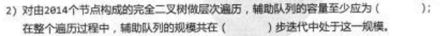
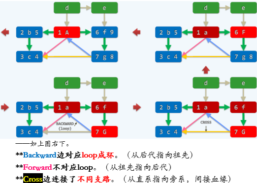
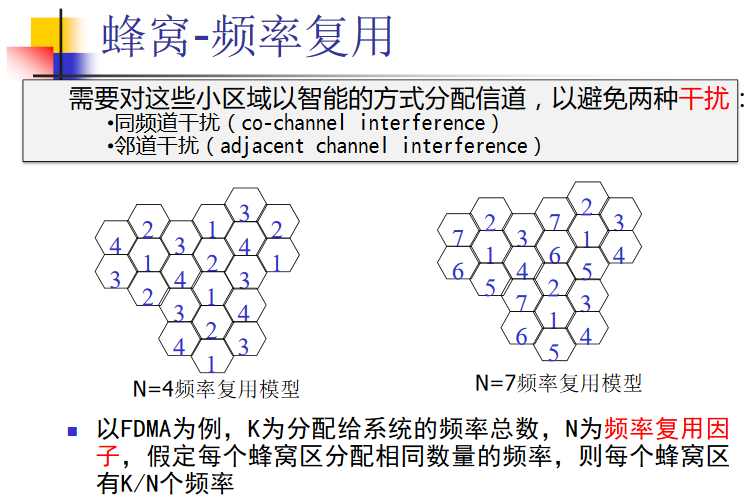
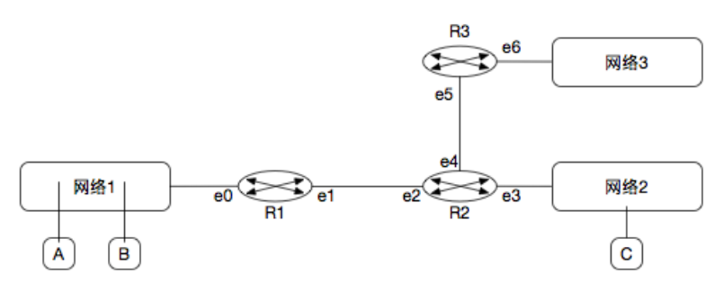
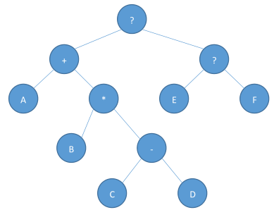

# References

[考研英语真题词汇的统计分析](https://github.com/YSMull/words-statistics)

[关于清华计算机专业基础综合（912）的复习](https://xuanxuanblingbling.github.io/life/study/2018/12/29/)

[2017年清华大学计算机科学与技术系考研小结](https://blog.csdn.net/chr1991/article/details/64971113)

[T大在线编程题汇总](https://www.nowcoder.com/kaoyan/retest/1001)

# 真题

## 2019



### 数据结构

#### 判断题

##### 复杂度

判断：$n^{logloglogn}=O(\lfloor logn\rfloor!)$

> 令$t=logn$，则
> $$
> \begin{split}
> n^{logloglogn}=\left[{\color{red}{ {(2^t)}^{loglogt} } } \gg2^t\right] \,\,\,&{\color{blue}{ ?} }\,\,\,\,\,
> \,\,\,\,\,\,\,O({\color{red}{ t!} })=O(\lfloor t\rfloor!)=O(\lfloor logn\rfloor!)\\
> 指数置换：{(2^{loglogt})}^{t}={(logt)}^t \,\,\,&{\color{blue}{ ?} }\,\,\,\,\,\,t!\\
> 取对数：\,\,\,\,\,\,\,tloglogt \,\,\,\,\,&{\color{blue}{?} }\,\,\,\,\,\,log(t!)=(0+log2+...+logt)\\
> 放缩：\,\,\,\,\,\,\,tloglogt \,\,\,\,\,&{\color{blue}{\ll} }\,\,\,0.5tlogt（凸函数放小为线性然后求和）\\
> \Longrightarrow\,\,\,\,\,\,\,tloglogt\,\,\,\,\,&{\color{blue}{\ll} }\,\,\,  0.5tlogt<log(t!)\\
> \Longrightarrow\,\,\,\,\,\,\,tloglogt\,\,\,\,\,&{\color{blue}{=} }\,\,\,  O(log(t!))
> \end{split}
> $$
> ~~QAQ~~Q.E.D，命题为**<font color=red>真</font>**。
>
> > 如果没有阶乘号的话，有：$\forall \epsilon>0, logn=O(n^{\epsilon})$。（细枝末节不影响复杂度）参见*习题解答-1-9*。
> >
> > 又有：$log1+log2+...+logn=log(n!)=\Theta(nlogn)\Longleftrightarrow n!=\Theta(n^n)$，参见*课件P52-对数级数*。
> >
> > - 由此可得到更简洁的证明方法：
> >
> > $$
> > \begin{split}
> > n^{logloglogn}=\left[{\color{red}{ {(2^t)}^{loglogt} } } \gg2^t\right] \,\,\,&{\color{blue}{ ?} }\,\,\,\,\,
> > \,\,\,\,\,\,\,O({\color{red}{ t!} })=O(\lfloor t\rfloor!)=O(\lfloor logn\rfloor!)\\
> > 指数置换：{(2^{loglogt})}^{t}={(logt)}^t \,\,\,&{\color{blue}{ ?} }\,\,\,\,\,\,t!\\
> > {(logt)}^t=O(t^t)&=O(t!)
> > \end{split}
> > $$
> >
> > **原题**：参见*具体数学-P410-热身题-9.2-b*（推荐练习一波）
> >
> > - 哪个函数增长得快：$n^{\ln\ln\ln n}还是(\ln n)!$？
> >   - 原题解析：$n^{\ln\ln\ln n}\ll (\ln n)!\ll n^{\ln\ln n}$.（~~就只有这么一点orz~~）

##### Huffman编码

判断：交换哈夫曼树的不同深度的节点，编码长度必然改变

> 特殊：考虑一个**所有节点的频率相同**的情况，那么任意交换节点编码长度不变。
>
> 因此问题转化为：***不同深度的节点是否频率一定不同？***
>
> 构造反例：（3个频率相同的节点）
>
> 
>
> Q.E.D，命题为**<font color=blue>假</font>**。

##### KMP算法

判断：即使不使⽤改进的 next 表，kmp 依然可以达到线性的时间复杂度

> 此为书上原话，P315页11.3.8节”继续改进“-第一段：*尽管以上KMP算法已可保证线性的运行时间，但在某些情况仍有进一步改进的余地。*11.3.7节则给出了线性复杂度的性能分析。
>
> Q.E.D，命题为**<font color=red>真</font>**。

##### Splay树

判断：对于不符合局部性原理的访问，splay 的分摊复杂度不是 $O(logn)$

> 对于规模为任意n的（**逐层**）伸展树，只要按关键码单调的次序，周期性地反复进行查找，则无论总的访问次数m>>n有多大，就分摊意义而言，每次访问都将需要o(n)时间。
>
> Q.E.D，命题为**<font color=red>真</font>**。
>
> > 参见*教材-8.1.2最坏情况-P204*（注意这个是逐层伸展才这样，**双层**策略（含羞草）则可以保证 $O(logn)$）
> >
> > 这里的局部性原理是指：刚被访问的数据（附近），极有可能很快被**再次**访问。

##### 二叉树重构

判断：对于⼆叉树，通过先序遍历和后序遍历不能确定其层次遍历

> 首先考虑问题：`先序+后序`是否唯一确定二叉树？（并不能）
>
> - 问题的证明可参考：[*MOOC-二叉树-重构-3*](https://www.xuetangx.com/courses/course-v1:TsinghuaX+30240184+sp/courseware/16d8402a24fd4429a8a7cc1c8401cb1f/b3fdcad4c3a84a8a861003eaa8b5965c/)
>   - (先序|后序)+中序
>   - **(先序+后序)&&真二叉树**
>
> 对于真二叉树，先序+后序对应唯一二叉树，显然成立。
>
> 对于非真二叉树：
>
> - 给定确定的先序和后序序列，需要考虑两个序列同时固定时，二叉树能发生怎么样的变化。
> - 只有孩子为1个的节点才可能发生变化。（单个孩子先序和后序遍历的结果一致）
>   - 左孩子$\longrightarrow$**<font color=purple>右孩子</font>**
>   - **<font color=purple>左孩子</font>**$\longleftarrow$右孩子
> - 因为**变化在同一层且不发生位置交换**，所以层次遍历也不变
>
> 
>
> Q.E.D，命题为**<font color=blue>假</font>**。先序+后序**能确定**层次遍历。
>
> **解法2**：（递归生成法）
>
> - 任意给定先序序列和后序序列（`V[root], L[left], R[right]`）
> - 先序：`VL****R****`；后序：`****L****RV`
>   - 有两个孩子？
>     - 局部等价于真二叉树
>     - 确定层次遍历`VLR********`
>     - 递归`L****`和`R****`
>   - 只有一个孩子？
>     - 退化为`VL****`和`****LV`（特判一下两个序列的第2个和倒数2个元素是否相同）
>     - 确定层次遍历`VL****`
>     - 递归`L****`
> - 因为可以递归生成唯一的层次遍历，显然就确定了层次遍历序列
>
> > [先序遍历和后序遍历为什么不能唯一地确定一棵树？](https://blog.csdn.net/GYQJN/article/details/52709912)

##### Catalan数

判断：对于叶节点为 2019 的真⼆叉树，其数量**⼩于** 2018 对括号所组成的合法表⽰式数量

> 叶节点为 2019 的真⼆叉树的个数 = $C_{2018}$。
>
> 2018 对括号所组成的合法表⽰式数量 =  $C_{2018}$。两者相等。
>
> Q.E.D，命题为**<font color=blue>假</font>**。
>
> > [**卡特兰数— 计数的映射方法的伟大胜利**| Math173](https://www.google.com/url?sa=t&rct=j&q=&esrc=s&source=web&cd=9&ved=2ahUKEwjWqJiesubgAhXwwosBHSnACLEQFjAIegQIBhAB&url=http%3A%2F%2Flanqi.org%2Finterests%2F10939%2F&usg=AOvVaw0FIR5VllhrOlM-_DNiqnfz)
> >
> > [【卡特兰数】有N对括号，输出所有合法的组合](https://blog.csdn.net/ffmpeg4976/article/details/42340379)
> >
> > [从《编程之美》买票找零问题说起，娓娓道来卡特兰数——兼爬坑指南](https://www.cnblogs.com/wuyuegb2312/p/3016878.html)

##### 层次遍历

判断：对于叶节点数量为 2018 的⼆叉树，层次遍历队列容量必然⼩于 2018

> 层次遍历队列的容量应该不小于最大的某一层的元素数。
>
> 2018的叶节点的二叉树，一层的元素数最大可以**等于**2018。（不能大于）
>
> 
>
> Q.E.D，命题为**<font color=blue>假</font>**。
>
> > 相似题目：*习题解答-5-18*
> >
> > - 设二叉树共含n个节点，则辅助队列的容量应该不低于n/2。
> >
> > 层次遍历的每一步都对应着一个二叉树（原二叉树的子二叉树）。
> > 给定二叉树，所有的[层次遍历子二叉树]中叶子节点的最大值就是队列最小容量。
> >
> > **任何遍历过程都对应着树的一种生长模式**。
>
> 注：本题在2014年期中试卷3-2上出现，稍微不同。
>
> 

##### *插入排序

判断：插⼊排序每次插⼊数据，即使不增加循环节，也不⾄减少

> 问的是循环节的个数。
>
> - 对于任意一个有序前缀，插入排序后循环节数目不变。（显然）
> - <font color=red>`总循环节数` = `元素归位数` + `非归位循环节数`</font>。
>
> 构造反例：`6 5 4 3 2 1`（逆序列）
>
> - 初始有3个循环节
>
> 
>
> Q.E.D，命题为**<font color=blue>假</font>**。
>
> > 相似题目：*习题解答-3-14*（**选择排序**循环节）
> >
> > 

##### 逆序对

判断：交换两个逆序对，必然会减少总逆序对数

> 认为题意是`交换构成逆序对的两个元素`。
>
> 首先给出引理：
>
> - 左端点降低，或右端点升高，逆序对总数一定不增。（这是显然的）
>
> 交换逆序对的过程可以等价转化为：（逆序对区间外的逆序是不受影响的，因此可以只分析内部区间）
>
> 
>
> 又注意到，在上述过程（两个`不增变换`）完成后，端点不再构成逆序对。
>
> - 因为不增，所以只要出现了下降，就一定会保持。
>
> 因此，交换逆序对后，总逆序对数至少减少1个。
>
> Q.E.D，命题为**<font color=red>真</font>**。

##### 基数排序

判断：如果基数排序底层采⽤不稳定的算法，那么得到的结果可能是不正确的

> 因为排序是按位**`多步`排序**，必须保证下一次的排序不影响上一次的排序结果。
>
> 如果底层不稳定，那么很可能导致之前排序的结果丢失。（每次只关注某一位）
>
> Q.E.D，命题为**<font color=red>真</font>**。
>
> > 参考：*算法导论-8-3-基数排序*

##### *函数调用栈

判断：函数的调⽤栈中如果有相同的函数，则他们必然紧邻

> 考虑循环调用：（显然不必紧邻）
>

```c++
int a(){ return b();}
int b(){ return a();}
int main(){ a();}
```

> Q.E.D，命题为**<font color=blue>假</font>**。
>
> > 参考：*教材-4.2.1-函数调用栈*

##### 堆

判断：如果插⼊的关键码独⽴均匀分布，堆的插⼊操作平均O(1)

> 认为题目问的是完全二叉堆。
>
> 由于完全二叉堆插入采用上滤操作，并且每一层的节点数是指数型的，因此若完全随机地插入，则只期望上升1层。
>
> Q.E.D，命题为**<font color=red>真</font>**。
>
> > 参考：*习题解答-10-6*

#### 简答题

##### 逆波兰表达式

逆波兰表达式的优点？既然中缀转换为逆波兰就需要可以计算出表达式值，那**逆波兰意义何在**？

> RPN的运算符优先级表述能力强，计算效率高。
>
> 意义如下：（因为转换表达式只需一次，而求值可能多次）
>
> 
>
> 参考：*教材-4.3.4-逆波兰表达式-P97*

##### DFS

DFS 中何时标记前向边？何时标记后向边？

> 前向边：从祖先指向后代。
>
> 后向边：从后代指向祖先。
>
> > RT所示。
>
> 

##### 败者树

相⽐锦标赛排序，败者树的优势是？

> 重赛过程中不必在左右子树之间来回访问内存，时间效率高。
>
> 参考：*PPT-P1181*

##### BBST

试举出红⿊树优于 AVL 树的场景，红⿊树相⽐ AVL 树的优势

> AVL树需要维护平衡因子，而红黑树仅需要对节点重染色。
>
> 在删除操作中，AVL树需要$O(logn)$次旋转，而红黑树的重染色分摊复杂度仅O(1)，并且拓扑结构的重构也只需O(1)。红黑树在持久性、历史版本的维护上具有优势。
>
> > 参考：*教材-8.3-红黑树-P227*，*PPT-P824、P861*

##### 散列表

相⽐开散列，闭散列的优势，试举例说明两点。

> 单独开辟一块**连续**空间，可充分利用系统缓存，提升访存效率。（局部性）
>
> 结构**简单**，算法易于实现，不易出错。
>
> > 参考：*PPT-P1034*，*教材-9.3.6-闭散列策略-P268*

##### 排序

相⽐选择排序，插⼊排序的优势，试举例说明两点。

> RT。就地、在线、输入敏感。
>
> 
>
> > 参考：*PPT-P275*

##### Dijkstra算法

对于稠密图，迪杰斯特拉应该使⽤多叉堆替换⼆叉堆，为什么？多叉堆分叉数 m 怎么确定？

> RT。
>
> -1561887177730.png)
>
> -1561886854814.png)
>
> > 参考：*PPT-P1185、P1187*

##### KMP算法

在何种情形下,KMP 优于蛮⼒算法，为什么？

> 单次匹配概率越大（字符集越小）的场合，KMP的优势越明显；否则与蛮力算法的性能相差无几。
>
> 参考：*PPT-P1262*

#### 算法题

##### 后序k遍历

返回后序遍历的第 K 个节点，时间复杂度不超过树 x 的深度，$Ο(depth(𝑥))$

```c++
struct BinNode{
    int size; //当前节点和孩⼦总数
    BinNode *lchild,*rchild;
};
BinNode *rank(BinNode* t, int k){
    //有效代码⾏数不超过 12 ⾏
    //不要尝试模拟后序遍历，时间复杂度会超时。
}
```

⼀，给出具体算法实现。

> 快速选取算法

```c++
BinNode *rank(BinNode* t, int k){
    if(t->size == k) return t;
    if(t->lchild->size < k)
        return rank(t->rchild, k - t->lchild->size);
    else
        return rank(t->lchild, k);
}
```

> 尾递归改写

```c++
BinNode *rank(BinNode* t, int k){
    while(t->size != k){
        if(t->lchild->size < k){
            t = t->rchild;
            k -= t->lchild->size;
        } else{
            t = t->lchild;
        }
    }
    return t;
}
```

⼆，解释你的算法。

> 参考快速选取算法。*教材12.2-选取与中位数*

三，分析时间复杂度和空间复杂度。

> 不变性：算法每步必定下降一层，递归深度不超过$Ο(depth(𝑥))$。
>
> 时间复杂度：$Ο(depth(𝑥))$。
>
> 空间复杂度：$Ο(depth(𝑥))$。（调用栈大小，迭代版则可以达到O(1)就地）
>
> > 迭代改写参考*习题解答-12-6* ~~（滑稽~~

### 操作系统（难）

#### 填空题

##### *stride调度算法

(1) stride调度算法中，进程分配时间和其优先级成反⽐，优先级越低进程上CPU运⾏的时间就会更长，⽤⼋位⽆符号数来表⽰进程A的运⾏时间有可能会溢出，但是当步长s [1] 127时，只要做⼩⼩的技巧就仍可以正确判断时间，然后又引⼊进程B，a为A的stride，b为B的stride，当sign(a-b) [2] 时说明A正在运⾏，此时a+s [3] 256，当sign(a+s-b) [4] 0时，轮到B运⾏。

> 源自ucore lab6。实验指导书P287。
>
> [1]：`>`（表示溢出），[2]：，[3]：，[4]：。

##### x86特权级

(2)CPL<=DPL[门]和CPL>=DPL[段]， [5] 表⽰请求时可以和门特权级相同， [6] 表⽰请求时应低于段的特权级。

> [5]：CPL<=DPL[门]，[6]：CPL>=DPL[段]。PPT上有。~~猜也能猜出来~~。

##### 进程

(3)⽗进程先退出，还未退出的⼦进程被称为 [7] 。⼦进程退出时，其⽗进程还没wait，此时⼦进程被称为 [8] 。

> 孤儿进程，僵尸进程。
>
> 
>
> >  https://www.cnblogs.com/Anker/p/3271773.html
>
> 似乎没有在课上提到。

##### 信号量

(4)

```
class Semaphore {
int sem;
WaitQueue q;
}
Semaphore::P() {
[9] ;
if ( [10] ) {
Add this thread t to q;
block(t);
}
}
Semaphore::V() {
[11] ;
if ( [12] ) {
Remove a thread t from q;
wakeup(t);
}
}
```

##### x86硬件

(5) x86-32CPU的硬件组成，CR3寄存器⽤于存储页⽬录表起始 [13] 。

##### 文件系统（硬链接、软链接）

(6)A是计数为1的⽂件，创建A的硬链接B，再创建A的软连接C，再创建B的硬链D，B计数 [14] , D计数 [15] 。

#### 判断题

##### *x86 页表细节

(1) x86开启了⼆级页表，则⼀级页表可以不在内存中。

##### *ucore 时钟中断

(2)ucore时钟中断为10ms，故不能完成 10ms以下的定时。

##### *中断向量表

(3)中断向量表中存放着中断门的优先级。

##### 死锁

(4)不安全状态就是死锁状态

> 错。MOOC上讲过。死锁是不安全的真子集。

##### *线程

(5)只有⼀个main函数的程序不能有多个线程

#### *UCORE（页表）


#### *内存分析（逻辑地址转换）

给了段内存的 dump，以及⼀些页表项的信息，分析 A、B 进程的逻辑地址转换

### 组成原理（一般）

#### 选择题

##### 磁盘

(1)下列哪⼀项没有容错能⼒
A. RAID0 B. RAID1 C. RAID5 D. RAID6

> OS里面讲过。RAID0只是增加了访问带宽，自然没有容错能力。

##### RAM

(2)下列关于静态存储器和动态存储器的描述正确的是
A.静态存储器使⽤触发器，需要定期刷新
B.静态存储器使⽤电容，不需要定期刷新
C.动态存储器使⽤触发器，不需要定期刷新
D.动态存储器使⽤电容，需要定期刷新

##### 虚拟内存

(3)下列哪个是对的
A．虚拟内存空间⽐实际的地址空间⼤
B．虚拟内存空间⽐实际的地址空间⼩
C．虚拟内存空间连续存放，实际内存⼀定连续存放
D．虚拟内存空间不连续存放，实际内存有可能连续存放

> D。注意是实际的**地址**空间。虚拟内存空间应该等于实际的地址空间。而虚拟存储只是在物理的非连续内存分配（段、页机制）的基础上增加调换功能。

##### 总线

(4)下⾯总线说法哪个正确（）
A.并⾏总线速度⼤于串⾏
B.异步总线速度⼤于同步
C.单总线速度⼤于双总线
D.以上说法均错误

> A。同步总线的特点有高速，单总线的特点是慢。见PPT。
>
> **可能是D**？之前408考试不是说还跟频率有关吗？并行不支持太高频。

##### MIPS流水

(5)MIPS 五级流⽔中，有哪个数据冲突（）
A.RAR B.RAWC.WARD.WAW

#### 判断题

##### C语言基础

(1) C语⾔中，int x>0 ,则x*x>0

##### CPU指标

(2) CPI越少的机器执⾏同⼀个程序的时间越短

##### 磁盘

(3) 对机械磁盘，读取顺序存储的⽂件⽐随机存储的⽂件快

##### 冯诺依曼

(4) 冯诺依曼是数据和指令混合存储的

##### MIPS流水线

(5) MIPS五级流⽔线设计中，使⽤充分设置功能单元的⽅法可以改善结构冲突

#### 填空题

##### 补码

(1) +1234的补码为[      ] (⽤⼗六进制，⼩端表⽰)

##### ？？？

(2) 27.625的IEEE754为[      ] (⼗六进制)

##### 数据冲突

(3) 解决数据冲突的三种⽅法[     ] [     ] [     ]

##### Cache

(4) cache的三种缺失为[ ][ ][     ]

#### 计算题 流水线时间计算（MIPS汇编）

MIPS 处理器内存延迟 10ns， ALU 延迟 6ns，寄存器 3ns，输⼊延迟 1ns，流⽔线寄存器以及多周期锁存器输出延迟为 2ns，要有计算过程，以下是指令(可能有个别字母不对)

```
addn vd rs rt
subu rd rs rt
ori rt rs rimm
lw rt rs imm
sw rt rs imm
beg rs rt imm
j target1.
```

1.按照单周期设计，指令内存与数据内存分开，计算指令延迟？
2.按照多周期设计，指令内存和数据内存在同⼀个内存模块，最长和最短的指令延迟分别是指哪条指令，分别计算对应的延迟
3.按照五级流⽔线设计，指令内存和数据内存在同⼀个内存模块，处理器频率最⾼能到多少

### 计算机网络

#### 选择题

(1) 电话⽹络和TCP⽹络的性质的⽐较，电话⽹应该是建⽴电路

##### *蜂窝移动网络 频率复用

(2) 蜂窝移动⽹络六边形，频率840HZ，则每个点可⽤最⼤频率

> 本题题意模糊。按照相邻不干扰的原则，可得最大必须分成3组：840/3=280Hz。
>
> > [蜂窝移动网络的课件](http://www.guob.org/course/MC_Chap31.pdf)
> >
> > 
> >
> > 图中可以看出：不同的模型，相同频段的站点距离不同。（最低N可以等于3，此时同频道干扰最大，频率复用率最高）
> >
> > [移动通信的蜂窝小区划分和频率复用](https://www.maixj.net/ict/fengwoxiaoquhuafen-pinlvfuyong-7456)

(3) ⼀个给了最⼩数据帧长度的以太⽹，给了信号传播速度，给了相距，问最⼤传输数据速度

(4) 计算⼀个计算分组时间，两个转发加两个传播

(5) 什么信道的利⽤率最低？相距离越远，传输速率越快

(6) 拥塞窗⼜为m时发⽣拥塞，发送⽅有⾜够多的数据要发，问平均速度

#### 简答题

##### URL

(1) 解释以下URL各部分的意义 `http://info.tsinghua. edu.cn:80/index.jsp`

##### DNS

(2) 如域名info.tsinghua. edu.cn对应的ip为166.111.4.98，解释为何会发⽣如下现象：

- ①访问`http://info.tsinghua. edu.cn/index.jsp` 正常，⽽访问`http://166.111.4.98/index.jsp` 异常

- ②访问`http://166.111.4.98/index.jsp` 正常，⽽访问`http://info.tsinghua. edu.cn/index.jsp` 异常

#### 子网划分



(1) 如图，⽹络1有100台主机，⽹络2有50台，⽹络3有20台，请将166.111.4.0/24划分给⽹络并写出路由器接⼜ip
(2) 简述AB通信时与AC通信时使⽤ARP协议的具体情况
(3) 当A发送报⽂给C时写出各个段上报⽂的源IP，⽬的IP，源MAC，⽬的MAC（⽤MAC-A,IP-A,MAC-e0等表⽰）

## 2018

### 数据结构

#### 判断题

##### 复杂度

判断：T(n)=a>0，无论常数 a 多大，时间复杂度为 T(N)=T(n/2)+O(1)的解总是 $O(logn)$

> 我怀疑原题是T(0)=a。
>
> Q.E.D，命题为**<font color=red>真</font>**。

##### CBA算法

判断：基于 CBA 的算法对所有大小为 n 的数组时间复杂度是$Ω(nlogn)$

> 命题为**<font color=red>真</font>**。
>
> > 参考：*PPT-P119-比较树*

##### 基数排序

判断：基数排序的底层排序算法一定是稳定的

> 19年判断题。如果不稳定，基数排序本身就不正确了。命题为**<font color=red>真</font>**。

##### 堆

判断：输入随机的情况下完全二叉堆的插入平均时间是常数

> 19年判断题。命题为**<font color=red>真</font>**。

##### Splay树

判断：伸展树插入操作的分摊时间复杂度 $O(logn)$

> splay的插入操作需要借助search接口。而serach接口的分摊复杂度（双层伸展）是 $O(logn)$。
>
> 命题为**<font color=red>真</font>**。

##### 散列表

判断：对长度为 m=4k+3 素数的散列表双平方探测一定能访问其全部元素

> 命题为**<font color=red>真</font>**。
>
> > 参考：*PPT-P1052-费马双平方定理*，*习题解答-9-17*

##### KMP算法

判断：没改进的 next 算法时间复杂度也是 $O(n)$

> 19年判断题。命题为**<font color=red>真</font>**。

##### Fib查找

判断：Fib 查找时以前后黄金分割点作为轴点的常系数相同

> 显然是不同的。因为左右的查找代价不同。
>
> 命题为**<font color=blue>假</font>**。

##### *PFC编码

判断：PFC(最优前缀编码)互换不同深度节点位置一定会破坏其性质

> 题目有问题，PFC（prefix-free code）是**前缀无歧义**编码。此时，交换节点不影响性质（一定**不**会破坏其性质）。
>
> 修改题目翻译后，命题为**<font color=blue>假</font>**。

##### 二分查找

判断：任何情况下折半查找都比顺序查找快

> 假设命中元素位于首位置。
>
> 命题为**<font color=blue>假</font>**。

#### 选择题

##### 就地算法

就地算法的空间复杂度是（）

> $O(1)$

##### *RPN

后缀表达式扣去一个符号来猜扣去的是什么，跟去年的类似

> 后缀表达式即逆波兰表达式。

##### *非法表达式

一个非法表达式，问强行求解的值是多少

##### B树

7 阶 B-树**根节点常驻内存**，则对规模为 2017 的 B-树最多需要几次访问？

> 7阶B树 = (4,7)-B树。（B树叶节点深度相同）
>
> 为求最大访问深度，假设总不命中，取最小分支，根节点可为2分支，故
> $$
> 2*4^{d}>2017 \Longrightarrow d>5
> $$
> 故最多需要5次访问。

##### 散列表

散列长为 2017，采用单平方探测，已经存入 1000 个元素，问此时最多有（？）个**懒惰删除**的桶单元。

- A.8 B.9 C.？ D.？

>  2017是素数。可访问元素数=1009。因此最多有**9个**懒惰删除的桶单元。

##### *BBST

分别按照递增和递减的顺序依次向平衡二叉树插入元素，则存在常数 k 使 n=2^k-1 是二者生成的平衡二叉树相等的（？）条件。

- A.充要条件 B.必要不充分条件 C.充分不必要条件 D.不充分不必要条件

> emm。

##### 左式堆

左式堆最右侧链长度为 k，则左式堆__含有__个元素。

- A.最少 2^k B.最少 2^k-1 C.最多 ** D.最多 **

> 最少$2^k-1$个内部节点。
>
> > 参考：*PPT-P1196*

##### *BM算法

gs[0]=1 的概率是

- A.1/m B.1/2^(m-1) C.1/2^m D.1/2^(m+1)

#### 算法题

##### 单峰向量

已知 A[0,n ), A[0~k)严格单调递增，A[k~n)严格单调递减，设计一个 O(logn)算法找出 k

1)伪代码描述算法
2)说明算法正确性
3)证明最坏情况下时间复杂度也是 O(logn)

> 二分即可，每次比较左右两侧。

##### 最大和区间

给定一个整数序列，求出连续子序列和的最大值
1)说明算法思路
2)伪代码描述算法
3)说明时间复杂度和空间复杂度
题注(大致意思)：蛮力算法就不要用啦，是 O(n^3),只有设计出 O(n)算法才有可能满分，O(n^2)酌情给分。

> RT。
>
> 

### 操作系统

### 组成原理

### 计算机网络

## 2017

### 数据结构

#### 判断题

##### 复杂度

判断：若 f(n)=时间复杂度 O(g(n)),也不一定有 f(n)=O(g(n-1)).

> 命题为**<font color=blue>假</font>**。

##### *散列表

判断：若散列表使用不超过其长度的素数，则存储关键不能保证其分布均匀。

> 假设这里的策略是除余算法。
>
> > 不太明白此题之含义。
> >
> > 参考：*教材-9.3.3-散列函数-除余法-P262*

##### *KMP算法

判断：在字符集各字符出现概率相同时，kmp 算法时间渐进程度接近蛮力算法。

> 字符集越大KMP越接近蛮力算法（或者匹配概率越小）。跟各字符的概率没有关系吧？
>
> 命题为**<font color=blue>假</font>**。

##### Huffman编码

判断：哈夫曼树距离深度更小的节点的权值可能小于深度更大的节点的权值。

> 不可能。但可能相等。
>
> 命题为**<font color=blue>假</font>**。

#### 选择题

##### Catalan数

五个互异节点构造的二叉树有多少种？

> $Catalan(5)=\cfrac{(2\times5)!}{5!\times (5+1)!}=42$。
>
> > 参考：*教材-7.3-平衡二叉树*，*习题解答-7-2*

##### 逆序数

对序列（64，63，...，2，1）进行直接插入排序比较次数最接近于（）
A.2800 B.2600 C.2400 D.2200 E.2000

> E。全逆序数=64*63/2=2016。

##### B树

搜索 7 阶 B 树的第 2016 个关键字，假设 B 树根节点在内存中，则共需启动几次 I/O.

> 4至5次。我觉得原题应该跟18年的B树差不多。

#### 算法题

##### BFS

请利用图的广度优先遍历找出图中的**最小环**，若不存在环则输出+oo,要求时间复杂度为 O(n*e)，空间复杂度为 O(n)，最小环即环中边数最少的环。
（1）请描述你的算法思想。
（2）请用伪代码写出算法。
（3）说明你的算法的时间复杂度和空间复杂度。

> 关注backward边。环的长度等于BFS节点的深度相减。

##### *后序遍历

若二叉树的数据结构如下

```c++
Struct binarytree｛
    Struct binarytree*parent；
    Struct binarytree*lc；
    Struct binarytree*tc；
    Struct binarytree*first（）；
｝
Struct realbinarytree｛
    Struct binarytree p；
    Struct binarytree*next（）；
｝
```

（1）若 first()函数是取二叉树后序遍历节点的第一个节点，请写出 first（）函数代码。
（2）若 next（）函数是取该节点的后序遍历的后继，请写出 next（）函数代码。
（3）在调用 first（）函数和 next（）函数对二叉树进行后序遍历时，证明遍历时间复杂度
为 o（n）。

> 1、2问不难。

### 操作系统

### 组成原理

### 计算机网络

## 2016

### 数据结构

#### 判断题

##### 地址运算

判断：指针 p 指向某一个逻辑地址，那么 p++就是访问下一个逻辑地址。

> 物理地址。命题为**<font color=blue>假</font>**。

##### *Dijkstra算法

权值都为正整数的图能否用迪佳斯特拉（算法名字有点忘了）构造出最短路径？

> 单源最短路。命题为**<font color=red>真</font>**。

#### 选择题

##### BST

二叉搜索树中最大的节点
A 仅有左孩子，没有右孩子
B 仅有右孩子，没有左孩子
C 既有左孩子，又有右孩子
D 没有左孩子，也没有右孩子

> 此题有问题。只能确定没有右孩子。

##### *栈混洗

一组输入MAMAMIAM入栈，要求出栈顺序也为MAMAMIAM。共有几种方案?

```
A.4     B.5    C.6    D.7
```

> ***以前的笔记***。
>
> 在群里遇见一个真题。
>
> > 一组输入MAMAMIAM入栈，要求出栈顺序也为MAMAMIAM。共有几种方案?
> >
> > ```
> > A.4     B.5    C.6    D.7
> > ```
>
> 解：共有11种方案。（**黑体**表示连续输出的）
>
> ```
> 可以将MAMAM**I**AM串**反向**处理为MA**I**MAMAM。	
> 
> 首先，<u>可以肯定的是</u>，*假如不进行分批次出栈，最后得到的结果是* MA**I**MAMAM。
> 
> 由于栈的特性，实际上，任何前缀子链都可以插入后面的串中。（即，先输出）
> 
> 而且，对于每一个**出栈单元**这样的交换均是独立的。
> 
> 因此，只需要**先划分，再计算排列数**就行了。
> 
> 易得，划分MA**I**MAMAM必须满足的条件：
> 
> 	①A-I-M必须分开；②必须至少有一个AM串；③排列后，**I**和某个AM串必须顺序相邻。
> ```
>
> - 如此，只有以下的划分：
>   - **M-A**-I-**M-A**-M-AM
>   - **M-A**-I-M-AM-AM
> - 考虑条件③：
>   - **M-A** - **M-A**-M-IAM
>   - **M-A**-M-AM-IAM （乘以2）
> - 考虑单元的交换：（同时考虑1-5位首尾的约束：必须是M）
>   - **M-A** - **M-A**-M-IAM
>     - **MA**-**MA**-M-IAM【1】
>     - **M-A**-**M-A**-M-IAM【4】
>   - **M-A**-M-AM-IAM 
>     - **MA**-M-AM-IAM 【1】
>     - **M-A**-M-AM-IAM 【2】
> - **因此共$1+4+2 \times(1+2)=11 $种**。
>
> *假如串是MAMAMIA*。可以同样处理。
>
> - 同理，反转为A**I**MAMAM。
> - 划分并考虑约束：
>   - **M-A-M-A-M**-IA【5】（可以从右侧开始，按单个M的提前分类讨论：1+2+2=5）
>   - A-M-**M-A-M**-IA【1】
>   - A-**M-A-M**-M-IA【1】
> - 共7种。（？？？？？）
>
> ------
>
> 算了。暂时放弃了。题真的看上去简单，做起来不知不觉就难了。
>
> 唉。
>
> ------
>
> 考研真题：http://www.cskaoyan.com/thread-594890-1-2.html
>
> ------
>
> 12.20补充：
>
> 学了邓老师的栈混洗。大概会了。
>
> 如下：（简化了一定程度，但仍然很繁琐）
>
> > MAMAMIAM编号为12345678（入栈）。
> >
> > 由于1号元素具有隔离作用，6号元素具有定位作用，故极容易指定为4种情况。
> >
> > - 1AMAM6AM
> > - MA1AM6AM
> > - MAMA16AM
> > - MAMAM6A1
> >
> > 此时，发现规律，A（247）、M（358）的自由元素均是3元组。
> >
> > - 1AMAM6AM
> >   - 分析A，共6种，724除去
> >   - 742（0），472（0），427（1），247（2），274（1）
> >   - 共4种
> > - MA**1**AM6AM
> >   - 由于1的限制，可以进一步**321**AM6AM
> >   - 共1种
> > - MAMA**1**6AM
> >   - 由于1的限制，可以进一步MAMA**1**6**78**
> >   - 3种
> > - MAMAM6A1
> >   - 由于6的限制，MAMA**8**6A1
> >     - 3A5A**8**6A1——3A57**8**6A1，2种
> >     - 5A3A**8**6A1——5A37**8**6A1，1种
> >   - 共3种
> > - **总计11种**，完毕
>
> 深夜。想到一个更加简洁的方法。
>
> > 入栈序列MAMAMIAM（12345678）。出栈序列假设为MAMAM**6**AM。
> >
> > 显然，M（1358），A（247）。很容易继续推出：（先确定极端值**8**）
> >
> > - MAMA**86A**M，**Ａ**只能是2或4
> >   - MAMA**8621**，
> >   - MAMA**8641**，MAMA**8643**
> > - MAMA**1678**，MAMA**3678**，MAMA**5678**
> > - 总共6种MAMA组合
> >   - MAMA**8621**，3**4**5**7**
> >   - MAMA**8641**，**2**35**7**
> >   - MAMA**8643，**1**2**5**7**
> >   - MAMA**1678**，**2**3**4**5
> >   - MAMA**3678**，1**24**5
> >   - MAMA**5678**，1**2**3**4**
> > - 2+1+1+3+1+3总计**11种**，但仍然比较麻烦

##### AVL树

在 AVL 树中，（）可能会发生两次旋转调整？
A 添加、删除节点操作
B 仅删除节点操作
C 仅添加节点操作
D 添加、删除节点都不

> A。教材上AVL树一节，双旋。

#### 算法题

##### 二叉树遍历

给出中序序列{D B A E C F}和层次序列{A B C D E F}能否唯一确定一颗二叉树？能给出步骤，不能的话请构造其中一棵

> 能。
>
> 对于任意一个
>
> - 中序：####…**M**####…
> - 层次：**M**########……
>
> 根据层次遍历可确定根节点在中序中的位置，则中序遍历分为左右两个子序列，从而可以递归地确定。
>
> - 中序：##…**L**##…  M  ##…**R**##…
> - 层次：M  **LR**######……
>
> 就本题而言，
>
> - D B   **<font color=red>A</font>**   E C F；**<font color=red>A</font>**   B C D E F
> - D **<font color=blue>B</font>**   **<font color=red>A</font>**   E **<font color=blue>C</font>** F；**<font color=red>A</font>**   **<font color=blue>B</font>** **<font color=blue>C</font>** D E F

##### Prim 算法

程序应该是 prim 算法，问是否能够构成最小生成树，如果能就证明，不能举出例子驳斥V 表示图的点集，U 表示已经确定路径的点集，初始时 U 为空，F 为已经确定的路径，初始也为空。先任意取一点 u 放入 U，然后在 V-U 中遍历 u 的邻接点，选权值最小的边 e 和点 v 放入 F和 U 中，具体算法就请翻书吧

> emmm

##### *重散列

散列表长为 13，采用双散列函数解决冲突：H(key) = key % 13 H’(key) = ( 7 * key % 10 ) + 1
输入顺序为 12 15 03 78 31 36（这几个数字一定有，尤其是最后一个是 36，其他记不太起来了，但是都可以通过两次三列找到合适的位置，除了 36 冲突后再散列的位置上仍然被 03 占据，所以这两个数字位置记得最清楚）
1) 构造散列表
2) 求平均成功查找长度

##### *二叉树重建

设计一个算法，把一个中序遍历 ABCD-*+EF??(后面三个符号忘记了不过不重要)构造成如下图所示的二叉树



a) 描述算法思想
b) 伪代码实现

> 这也不是中序遍历啊。。明明是RPN。。
>
> 就按照中缀表达式求值的方法类似地搞一搞，遇到运算时就合并二叉树，从而建树。

##### 子数组

求一个数组A中**连续相同**数字的和**等于s**的最长子数组长度，例如A={1,1,2,1,1,1,2,1}，s=3，
则所求子数组长度为 3，要求算法时间复杂度不超过 O(n)，空间复杂度不超过 O(1)
a) 描述算法思想
b) 伪代码实现
c) 计算程序的算法复杂度。

> 比较简单。
>
> 遇到新数字k重置，否则累加，若等于s了，则更新答案为s/k。

##### *二叉树遍历

给了一个算法，问访问节点的顺序，树的样子是一颗深度为 4 的二叉树。

```c++
Typedef struct binNode{
    char data;
    struct binNode *rc,*lc;//左子树由子树
} binNode;
twist(node x){
    if(!x) return;
    if(x->rc){
        twist(x->lc->rc);
        putchar(x->data);
        twist(忘了);
        putchar(忘了);
    }
    Else{
        Twist(忘了);
        Putchar(忘了);
    }
}
```


### 操作系统

### 组成原理

### 计算机网络

# 练习题

自己练`习题`，`考试题`。