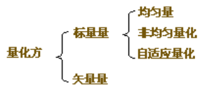

# 教材

《多媒体计算机技术基础及应用》，主编钟玉琢，清华大学出版社。

## 参考书

《 [多媒体技术基础及应用](http://read.pudn.com/downloads65/ebook/235081/Multimedia%20Technology%20Fundation%20and%20Application.pdf) 》

> 《【网络课堂】多媒体计算机技术基础及应用》
>
> [西工大-多媒体技术-课件](http://www.nwpu-aslp.org/lxie/pdf/01_Introduction_no%20CV.pdf)。

# 真题

因为每年真题类似，只摘取题目。复习时请参考网络课堂的内容。

## 多媒体技术的原理

简述多媒体技术的定义，特征，关键技术。举出5个以上你所知道的多媒体技术。

> **定义**：计算机综合处理多种媒体信息：文本、图形、图像、音频和视频，使多种信息建立逻辑连接，集成为一个系统并具有交互性。
>
> **特征**：**多样性**、**交互性**和**集成性**。
>
> **关键技术**：视频音频信号获取技术，多媒体数据压缩编码和解码技术，视频音频数据的实时处理和特技，视频音频数据的输出技术。
>
> 多媒体技术举例：多媒体数据库、可视电话、多媒体著作工具、多媒体视频会议系统、交互式电视技术、V-CD播放系统、多媒体通信、多媒体教学、个人信息通信中心。

## DPCM编码

写出音频差分编码(DPCM)的原理。
列举参数编码的两个国际标准，说明它们的编码参数和数据率（量化方法的分类？）。
某均匀量化器的输出为L阶，输出编码位数n位。则已知L的话，n的值是多少？已知n的话，L的值为多少？

> 音频差分编码（**DPCM**）：差值量化编码DPCM是利用样本与样本之间存在信息冗余度来进行编码的一种数据压缩技术。差值量化编码是根据过去的样本去估计下一个样本信号的幅度大小，这个值称为预测值，然后对实际信号值与预测值之间的差进行量化编码，从而就减少了表示每个样本信号的位数。它与脉冲编码调制(Pulse Code Modulation,简称PCM)不同的是，PCM直接对采样信号进行量化编码，而DPCM是**对实际信号值与预测值之差进行量化编码**，存储或传送的是差值而不是幅度绝对值，这样就降低了传送或存储的数据量。此外，它还能适应大范围变化的输入信号。
>
> > 最简单的波形编码是脉冲编码调制(Pulse Code Modulation，PCM)，它仅仅对输入信号进行采样和量化。
> >
> > **自适应PCM**：一种根据输入信号幅度大小来改变量化阶距大小的一种波形编码技术。这种自适应可以是瞬时自适应，即量化阶距的大小每隔几个样本就改变，也可以是音节自适应，即量化阶距的大小在较长时间周期里发生变化。
>
> **参数编码**的基本思想是从话音波形信号中提取生成话音的参数，使用这些参数通过话音生成模型重构出话音。
>
> 
>
> **量化方法的分类**：
>
> > 均匀量化，就是一种将信号连续幅度均匀分层的量化方法。非均匀量化的基本思想是，对输入信号进行量化时，大的输入信号采用大的量化间隔，小的输入信号采用小的量化间隔，这样就可以在满足精度要求的情况下使用较少的位数来表示。
>
> 均匀量化器公式为：$L=2^n$。例如采用16bit均匀量化时，信号的峰值将被分成 $2^{16}$ = 65535份。
>
> > 确定输出阶层数为L的量化器，则它的输出值的位数n=log2L（位）。 确定输出量化位数为n的量化器，则它的输出阶数L=2^n（位）。 

## Huffman编码

信息的量如何度量?离散信源的无损编码的理论极限(好像是这么写的)是什么？
已知某信源的四个符号的概率分别为：a1 - 0.5，a2 - 0.2412，a3 - 0.1702，a4 - 0.0886(数值记得不太准，也可能是（0.5, 0.25,0.125,0.125）)，求信源的Huffman编码，计算信源的熵以及编码的平均码长。

> > 以`0.5 0.25 0.125 0.125`为例：
>
> **Huffman编码**为：
>
> ```
> 0.5    1
> 0.25   01
> 0.125  000
> 0.125  001
> ```
>
> 信息熵公式：（$P(X_i)$为对应符号的概率）
> $$
> H(X)=-\sum_{i=1}^{n}P(X_i)\text{log}_2P(X_i)
> $$
> 则**信源的熵**为：$-(0.5log0.5+0.25log0.25+2\times 0.125log.125) = \cfrac{7}{4}$。
>
> **平均码长**为：$0.5\times 1+0.25\times 2 + 0.125\times 3 + 0.125\times 3=\cfrac{7}{4}$。

## JPEG压缩编码原理

简述JPEG压缩编码原理及实现过程。信息的损失发生在哪一步？解释离散余弦变换（DCT）的作用。

> JPEG编码原理：将YUV彩色图片分成8X8块，对每个8X8块进行DCT变换，得到DCT系数采用JPEG给定或自己选定的量化表进行量化，得到DC和AC系数，对AC系数进行Z字型扫描，对其进行行程编码和熵编码，这样就得到了JPEG压缩图像的数据。
>
> 
>
> 信息的损失：因为DCT变换后能量大部分集中在左上角，所以对其细一些。这样一量化，量化就是用DCT系数除以量化表。那么量化后高频部分会出现一些"0"，就实现了压缩，而且失真也就是在此发生的。
>
> 离散余弦变换（DCT）的作用：DCT变换是将数据域从时（空）域变换到频域。在频域平面上变换系数是二维频域变量u和v的函数。对应于u=0，v=0的系数，称做直流分量，即DC系数，其余63个系数称做AC系数，即交流分量。
>
> > 变换编码就是将图像光强矩阵(时域信号)变换到系数空间(频域信号)上进行处理的方法。**在空间上具有强相关的信号，反映在频域上是在某些特定的区域内能量常常被集中在一起**，或者是系数矩阵的分布具有某些规律。我们可以**利用这些规律在频域上减少量化比特数，达到压缩的目的**。图像经DCT变换以后，DCT系数之间的相关性就会变小。而且大部分能量集中在少数的系数上，因此，DCT变换在图像压缩中非常有用，是有损图像压缩国际标准JPEG的核心。

## 查全率和准确率

查全率和准确率，利用颜色直方图进行图像检索的原理，求两幅图像的颜色直方图，并求相似度。

> - Recall 查全率（**查到**了多少）
>   一次查询过程中，系统返回的查询结果中主观相似图像个数占图像库中所有主观相似图像个数的比例
> - Precision准确率（**查对**了多少）
>   一次查询过程中，系统返回的主观相似图像个数占所有返回图像个数的比例。正确的主观相似图像越多，查准率越高
>
> 一种常用的颜色特征是图像的颜色直方图。在颜色检索算法中，采用了互补颜色（opponent color）空间直方图来描述物体，并通过定义在直方图的相交（intersection）及反投影算法（backprojection       algorithm）来完成物体的识别（检索）和在图像中的定位。通过直方图相交算法，给定图像直方图后，颜色检索就变为在模型库中查找具有最大匹配度的图像。
>
> 一种方法：计算余弦相似度$\cfrac{\vec A\cdot\vec B}{|\vec A|\times|\vec B|}$。（夹角余弦取值范围为[-1,1]。夹角余弦越大表示两个向量的夹角越小，夹角余弦越小表示两向量的夹角越大。）
>
> 或者：欧氏距离度量。

## 内容检索

视频会议系统。基于内容检索的多媒体数据库由哪些部分组成？请描述基于内容检索的工作过程。

> ***基于内容检索的体系结构***：
>
> 
>
> 在体系结构上划分为两个子系统：特征抽取子系统和查询子系统。系统包括如下功能模块：
>
> 1. **目标标识**
>    为用户提供自动半自动识别静态图像、视频、镜头的代表帧，是用户感兴趣的内容或区域。视频序列图像动态目标，对目标进行特征抽取、查询，处理进行整体的或局部的内容检索，可采用全局特征或局部的特征。
> 2. **特征提取**
>    提取用户威兴趣的又适合于基于内容检索的特征。如颜色分布情况、颜色的组成情况、纹理结构、方向对称关系、轮廓形状大小。
> 3. **数据库**
>    多媒体数据库，声、文、图；特征库，预处理特征；知识库，知识表达。
> 4. **查询接口**
>    有三种输入方式：①交互输入方式，②模板选择输入方式，③用户提交特征样板输入方式。多媒体特征组合功能和查询结果浏览。
> 5. **检索引擎**
>    利用特征之间的距离函数来进行相似性检索。对于不同的特征用不同的相似性测度算法，检索引擎中系统有效的是相似性测度函数集。
> 6. **索引/过滤器**
>    通过索引和过滤达到快速搜索的目的。把全部的数据通过过滤器变成新的集合再用高维特征匹配来检索。 
>
> ***基于内容检索的处理过程***：
>
> 
>
> 1. **提交查询要求**
>    利用系统人机交互界面输入方式形成一个查主询条件。
> 2. **相似性匹配**
>    将查询特征与数据库中的特征按一定的匹配算法进行匹配。
> 3. **返回候选结果**
>    满足一定相似性的一组侯选结果按相似度大小排列返回给用户。 
> 4. **特征调整**
>    对系统返回的一组初始特征的查询结果，用户通过浏览选择满意的结果，或进行特征调整，形成新的查询，直到查询结果满意为止。           
>
> > 基于内容检索需要解决两类关键技术：
> >
> > - 多媒体特征提取和匹配；
> > - 相似检索技术。
