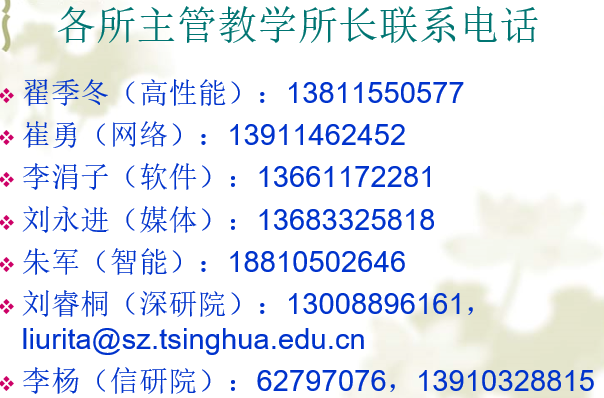

> [清华计算机系复试指南（下）](http://www.cskaoyan.com/thread-188152-1-1.html)
>
> [【我，无所畏】2016年清华大学研究生特等奖学金分享交流会](https://www.bilibili.com/video/BV1AW411a7Xw)
>
> [【敢，不平凡】2017年清华大学研究生特等奖学金分享交流会](https://www.bilibili.com/video/BV1DW411e7Pz)

# 计算机系各研究方向简介

| **研究方向** | **所属研究所**         | **部分研究内容**                                 |
| ------------ | ---------------------- | ------------------------------------------------ |
| 系统结构     | 网络所、高性能所       | 网络安全、计算机网络/ 网格与高性能计算、体系结构 |
| 软件与理论   | 软件与理论研究所       | 数据工程与知识工程、软件工程、计算机辅助设计     |
| 计算机应用   | 媒体所、人工智能实验室 | 视觉与媒体信息处理、人机交互/ 人工智能、智能控制 |

# 复试信息

## 复试时间

复试时间一般在3月中旬（3月15日前后），地点在校本部。

> 20年疫情拖至5月份。

## 资格审查

一般在当天上午8:30-11:30。

> 例：（伯克利2020）
>
> > 资格审查清单文件：
> > （1）准考证原件
> > （2）初试成绩单原件（原件在TBSI招办，请准备清华研招网的截图）
> > （3）有效身份证件原件
> > （4）毕业证书（应届生带学生证）原件
> > *如因疫情影响，目前无法提供原件，可先提供电子版，后续补交原件
> > （5）清华-伯克利深圳学院2020年硕士研究生报名表（登录系统申请完成后打印PDF）
> > （6）英语成绩证明原件
> > *如因疫情影响，目前无法提供原件，可先提供电子版，后续补交原件
> > （7）大学期间成绩单原件或档案中成绩单复印件（加盖档案单位红章）
> > *如因疫情影响，目前无法提供原件，可先提供院校官网截图等电子版佐证材料，后续补交原件
> > （8）个人自述 （不作为材料评审环节，个人自述等材料如非最终版也不会影响本次资格审查，望各位考生周知）
> > （9）支持申请的其他材料，如获奖证明、学术论文等原件（或电子版）
> > *以上文件将在资格审查时在镜头前展示。
> > *
> > 在入学前再次核验原件收取复印件，未进行资格审查或资格审查未通过的考生一律不予录取。
> > *由于疫情影响暂时无法提供原件者，清华-伯克利深圳学院后续安排补查原件。资格审查不合格者，不得参加复试，存疑者可根据实际情况采取其他方式核查。所有上交院系的材料，无论录取与否，一律不予退还。

## 机试（100）

一般在当天下午1:00-5:30。

## 笔试（100）

一般在当天晚上6:30-8:30。

笔试科目必须参加原报考方向的考试科目。

## 面试（300）

一般在第二天上午8:30进行学术面试，第三天上午8:30进行专业面试。

### 综合面试（20*3）

综合面试包括自我介绍（中英文皆可），中英文提问，针对简历提问，一篇计算机相关的英文文本现场口译。

### 专业面试（80*3）

专业面试包括ppt自述，然后老师提问。

# 2021深研院招生宣讲会

[招生宣讲会录播地址](https://mp.weixin.qq.com/s/gJIOhPiHQ-h4GPdnhhNxWA)

> [清华大学深圳国际研究生院2021年线上招生宣讲会：计算机技术](https://www.bilibili.com/video/BV1ng4y1z7iq)
>
> [清华大学深圳国际研究生院2021年线上招生宣讲会：大数据工程](https://www.bilibili.com/video/BV1GK4y1k7Rr)
>
> [清华大学深圳国际研究生院2021年线上招生宣讲会：人工智能](https://www.bilibili.com/video/BV1F5411472b)
>
> [清华大学深圳国际研究生院2021年线上招生宣讲会：Open FIESTA： BIO³生命技术、互联网+创新设计(IID)](https://www.bilibili.com/video/BV1Mp4y1y7uy)
>
> [清华大学深圳国际研究生院2021年线上招生宣讲会：电子与通信工程](https://www.bilibili.com/video/BV13p4y1y7ge)
>
> [清华大学深圳国际研究生院2021年线上招生宣讲会：互动媒体设计与技术](https://www.bilibili.com/video/BV1if4y1S72r)
>
> [清华大学深圳国际研究生院2021年线上招生宣讲会：海洋技术与工程](https://www.bilibili.com/video/BV1LK4y1b7ji)
>
> 等等……

# 2020 统招信息（144+43）

## 912（81+6）

| 专业               | 复试                                                         | 人数 |
| ------------------ | ------------------------------------------------------------ | ---- |
| 计算机科学与技术   | **计算机系统结构**,编译原理；**编译原理**,**数据库原理**；**人工智能**,**多媒体技术** | 14   |
| 网络空间安全       | **计算机网络**                                               | 10   |
| 计算机技术         | 计算机系统结构、**软件工程**（二选一）                       | 37   |
| 大数据工程         | 数学（高数线代概率），专业知识（**模式识别**、人工智能导论、**机器学习**） | 20   |
| 数据科学和信息技术 | [全球创新学院](http://gix.tsinghua.ed u.cn/zs1/index.htm)【专门报名，需要TOELF】 | (6)  |
## 914（10）

| 专业           | 复试                 | 人数 |
| -------------- | -------------------- | ---- |
| 软件工程       | 编译原理、数据库原理 | 2    |
| 软件工程(工程) | 编译原理、数据库原理 | 8    |

## 827（~~53~~(**68**)+15）

| 专业               | 复试                                                         | 人数                                  |
| ------------------ | ------------------------------------------------------------ | ------------------------------------- |
| 人工智能           | 数学（高数线代概率），专业知识（模式识别、人工智能导论、机器学习、**电路原理**、**信号与系统**） | ~~53~~(**68**) |
| 大数据工程（贵州） | 控制理论（经典控制及现代控制）、电子技术（模拟电子技术及数字电子技术）、信号与系统、计算机软件技术基础（C 语言、数据结构），四科中选一门。 | (15)                                  |

## 962（22-）

| 专业                       | 复试                                                         | 人数 |
| -------------------------- | ------------------------------------------------------------ | ---- |
| 数据科学交叉学科（伯克利） | **962**：数据科学等相关基础知识（运筹学、随机过程、数据结构？） 961：大学物理等相关基础知识（重点考察理科基础） | (22) |

---

2020，祝好！

-----

每年学硕面试线（非初试线）在**360**上下浮动。

> 基本分数在360~400。因此平均分数在**380**分（130+110+70+70）左右。

---

# 2019 招生信息

2019年招生名额如下：（**12**人）

2019年研究所状况如下：

各所教学所长联系电话：

