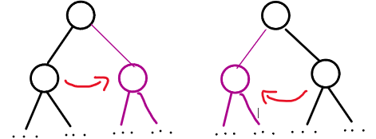
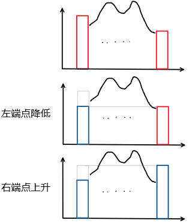

# References

[关于清华计算机专业基础综合（912）的复习](https://xuanxuanblingbling.github.io/life/study/2018/12/29/912/)

[2017年清华大学计算机科学与技术系考研小结](https://blog.csdn.net/chr1991/article/details/64971113)

[T大在线编程题汇总](https://www.nowcoder.com/kaoyan/retest/1001)

# 真题

## 2019

### 数据结构

#### 判断题

##### 复杂度

判断：$n^{logloglogn}=O(\lfloor logn\rfloor!)$

> 令$t=logn$，则
> $$
> \begin{split}
> n^{logloglogn}=\left[{\color{red}{ {(2^t)}^{loglogt} } } \gg2^t\right] \,\,\,&{\color{blue}{ ?} }\,\,\,\,\,
> \,\,\,\,\,\,\,O({\color{red}{ t!} })=O(\lfloor t\rfloor!)=O(\lfloor logn\rfloor!)\\
> 指数置换：{(2^{loglogt})}^{t}={(logt)}^t \,\,\,&{\color{blue}{ ?} }\,\,\,\,\,\,t!\\
> 取对数：\,\,\,\,\,\,\,tloglogt \,\,\,\,\,&{\color{blue}{?} }\,\,\,\,\,\,log(t!)=(0+log2+...+logt)\\
> 放缩：\,\,\,\,\,\,\,tloglogt \,\,\,\,\,&{\color{blue}{\ll} }\,\,\,0.5tlogt（凸函数放小为线性然后求和）\\
> \Longrightarrow\,\,\,\,\,\,\,tloglogt\,\,\,\,\,&{\color{blue}{\ll} }\,\,\,  0.5tlogt<log(t!)\\
> \Longrightarrow\,\,\,\,\,\,\,tloglogt\,\,\,\,\,&{\color{blue}{=} }\,\,\,  O(log(t!))
> \end{split}
> $$
> ~~QAQ~~Q.E.D，命题为**<font color=red>真</font>**。
>
> > 如果没有阶乘号的话，有：$\forall \epsilon>0, logn=O(n^{\epsilon})$。（细枝末节不影响复杂度）参见*习题解答-1-9*。
> >
> > 又有：$log1+log2+...+logn=log(n!)=\Theta(nlogn)\Longleftrightarrow n!=\Theta(n^n)$，参见*课件P52-对数级数*。
> >
> > - 由此可得到更简洁的证明方法：
> >
> > $$
> > \begin{split}
> > n^{logloglogn}=\left[{\color{red}{ {(2^t)}^{loglogt} } } \gg2^t\right] \,\,\,&{\color{blue}{ ?} }\,\,\,\,\,
> > \,\,\,\,\,\,\,O({\color{red}{ t!} })=O(\lfloor t\rfloor!)=O(\lfloor logn\rfloor!)\\
> > 指数置换：{(2^{loglogt})}^{t}={(logt)}^t \,\,\,&{\color{blue}{ ?} }\,\,\,\,\,\,t!\\
> > {(logt)}^t=O(t^t)&=O(t!)
> > \end{split}
> > $$
> >
> > **原题**：参见*具体数学-P410-热身题-9.2-b*（推荐练习一波）
> >
> > - 哪个函数增长得快：$n^{\ln\ln\ln n}还是(\ln n)!$？
> >   - 原题解析：$n^{\ln\ln\ln n}\ll (\ln n)!\ll n^{\ln\ln n}$.（~~就只有这么一点orz~~）

##### Huffman编码

判断：交换哈夫曼树的不同深度的节点，编码长度必然改变

> 特殊：考虑一个**所有节点的频率相同**的情况，那么任意交换节点编码长度不变。
>
> 因此问题转化为：***不同深度的节点是否频率一定不同？***
>
> 构造反例：（3个频率相同的节点）
>
> 
>
> Q.E.D，命题为**<font color=blue>假</font>**。

##### KMP算法

判断：即使不使⽤改进的 next 表，kmp 依然可以达到线性的时间复杂度

> Q.E.D，命题为**<font color=red>真</font>**。

##### *Splay树

判断：对于不符合局部性原理的访问，splay 的分摊复杂度不是 $O(logn)$

> 对于规模为任意n的（逐层）伸展树，只要按关键码单调的次序，周期性地反复进行查找，则无论总的访问次数m>>n有多大，就分摊意义而言，每次访问都将需要o(n)时间。
>
> Q.E.D，命题为**<font color=red>真</font>**。
>
> > 参见*教材-8.1.2最坏情况-P204*

##### 二叉树重构

判断：对于⼆叉树，通过先序遍历和后序遍历不能确定其层次遍历

> 首先考虑问题：`先序+后序`是否唯一确定二叉树？（并不能）
>
> - 问题的证明可参考：[*MOOC-二叉树-重构-3*](https://www.xuetangx.com/courses/course-v1:TsinghuaX+30240184+sp/courseware/16d8402a24fd4429a8a7cc1c8401cb1f/b3fdcad4c3a84a8a861003eaa8b5965c/)
>   - (先序|后序)+中序
>   - **(先序+后序)&&真二叉树**
>
> 对于真二叉树，先序+后序对应唯一二叉树，显然成立。
>
> 对于非真二叉树：
>
> - 给定确定的先序和后序序列，需要考虑两个序列同时固定时，二叉树能发生怎么样的变化。
> - 只有孩子为1个的节点才可能发生变化。（单个孩子先序和后序遍历的结果一致）
>   - 左孩子$\longrightarrow$**<font color=purple>右孩子</font>**
>   - **<font color=purple>左孩子</font>**$\longleftarrow$右孩子
> - 因为**变化在同一层且不发生位置交换**，所以层次遍历也不变
>
> 
>
> Q.E.D，命题为**<font color=blue>假</font>**。先序+后序**能确定**层次遍历。
>
> **解法2**：（递归生成法）
>
> - 任意给定先序序列和后序序列（`V[root], L[left], R[right]`）
> - 先序：`VL****R****`；后序：`****L****RV`
>   - 有两个孩子？
>     - 局部等价于真二叉树
>     - 确定层次遍历`VLR********`
>     - 递归`L****`和`R****`
>   - 只有一个孩子？
>     - 退化为`VL****`和`****LV`（特判一下两个序列的第2个和倒数2个元素是否相同）
>     - 确定层次遍历`VL****`
>     - 递归`L****`
> - 因为可以递归生成唯一的层次遍历，显然就确定了层次遍历序列
>
> > [先序遍历和后序遍历为什么不能唯一地确定一棵树？](https://blog.csdn.net/GYQJN/article/details/52709912)

##### Catalan数

判断：对于叶节点为 2019 的真⼆叉树，其数量**⼩于** 2018 对括号所组成的合法表⽰式数量

> 叶节点为 2019 的真⼆叉树的个数 = $C_{2018}$。
>
> 2018 对括号所组成的合法表⽰式数量 =  $C_{2018}$。两者相等。
>
> Q.E.D，命题为**<font color=blue>假</font>**。
>
> > [**卡特兰数— 计数的映射方法的伟大胜利**| Math173](https://www.google.com/url?sa=t&rct=j&q=&esrc=s&source=web&cd=9&ved=2ahUKEwjWqJiesubgAhXwwosBHSnACLEQFjAIegQIBhAB&url=http%3A%2F%2Flanqi.org%2Finterests%2F10939%2F&usg=AOvVaw0FIR5VllhrOlM-_DNiqnfz)
> >
> > [【卡特兰数】有N对括号，输出所有合法的组合](https://blog.csdn.net/ffmpeg4976/article/details/42340379)
> >
> > [从《编程之美》买票找零问题说起，娓娓道来卡特兰数——兼爬坑指南](https://www.cnblogs.com/wuyuegb2312/p/3016878.html)

##### 层次遍历

判断：对于叶节点数量为 2018 的⼆叉树，层次遍历队列容量必然⼩于 2018

> 层次遍历队列的容量应该不小于最大的某一层的元素数。
>
> 2018的叶节点的二叉树，一层的元素数最大可以**等于**2018。（不能大于）
>
> 
>
> Q.E.D，命题为**<font color=blue>假</font>**。
>
> > 相似题目：*习题解答-5-18*
> >
> > - 设二叉树共含n个节点，则辅助队列的容量应该不低于n/2。
> >
> > 层次遍历的每一步都对应着一个二叉树（原二叉树的子二叉树）。
> > 给定二叉树，所有的[层次遍历子二叉树]中叶子节点的最大值就是队列最小容量。
> >
> > **任何遍历过程都对应着树的一种生长模式**。

##### *插入排序

判断：插⼊排序每次插⼊数据，即使不增加循环节，也不⾄减少

> 问的是循环节的个数。
>
> - 对于任意一个有序前缀，插入排序后循环节数目不变。（显然）
> - <font color=red>`总循环节数` = `元素归位数` + `非归位循环节数`</font>。
>
> 构造反例：`6 5 4 3 2 1`（逆序列）
>
> - 初始有3个循环节
>
> 
>
> Q.E.D，命题为**<font color=blue>假</font>**。
>
> > 相似题目：*习题解答-3-14*（**选择排序**循环节）
> >
> > 

##### 逆序对

判断：交换两个逆序对，必然会减少总逆序对数

> 认为题意是`交换构成逆序对的两个元素`。
>
> 首先给出引理：
>
> - 左端点降低，或右端点升高，逆序对总数一定不增。（这是显然的）
>
> 交换逆序对的过程可以等价转化为：（逆序对区间外的逆序是不受影响的，因此可以只分析内部区间）
>
> 
>
> 又注意到，在上述过程（两个`不增变换`）完成后，端点不再构成逆序对。
>
> - 因为不增，所以只要出现了下降，就一定会保持。
>
> 因此，交换逆序对后，总逆序对数至少减少1个。
>
> Q.E.D，命题为**<font color=red>真</font>**。

##### 基数排序

判断：如果基数排序底层采⽤不稳定的算法，那么得到的结果可能是不正确的

> 因为排序是按位**`多步`排序**，必须保证下一次的排序不影响上一次的排序结果。
>
> 如果底层不稳定，那么很可能导致之前排序的结果丢失。（每次只关注某一位）
>
> Q.E.D，命题为**<font color=red>真</font>**。
>
> > 参考：*算法导论-8-3-基数排序*

##### *函数调用栈

判断：函数的调⽤栈中如果有相同的函数，则他们必然紧邻

> 考虑循环调用：（显然不必紧邻）
>

```c++
int a(){ return b();}
int b(){ return a();}
int main(){ a();}
```

> Q.E.D，命题为**<font color=blue>假</font>**。
>
> > 参考：*教材-4.2.1-函数调用栈*

##### 堆

判断：如果插⼊的关键码独⽴均匀分布，堆的插⼊操作平均O(1)

> Q.E.D，命题为**<font color=red>真</font>**。

#### 简答题

##### 逆波兰表达式

逆波兰表达式的优点？既然中缀转换为逆波兰就需要可以计算出表达式值，那逆波兰意义何在？

##### DFS

DFS 中何时标记前向边？何时标记后向边？

##### 败者树

相⽐锦标赛排序，败者树的优势是？

##### BBST

试举出红⿊树优于 AVL 树的场景，红⿊树相⽐ AVL 树的优势

##### 散列表

相⽐开散列，闭散列的优势，试举例说明两点。

##### 排序

相⽐选择排序，插⼊排序的优势，试举例说明两点。

##### Dijkstra算法

对于稠密图，迪杰斯特拉应该使⽤多叉堆替换⼆叉堆，为什么？多叉堆分叉数 m 怎么确定？

##### KMP算法

在何种情形下,KMP 优于蛮⼒算法，为什么？

#### 算法题

##### 后序k遍历

返回后序遍历的第 K 个节点，时间复杂度不超过树 x 的深度，$Ο(depth(𝑥))$

```c++
struct BinNode{
    int size; //当前节点和孩⼦总数
    BinNode *lchild,*rchild;
};
BinNode *rank(BinNode* t, int k){
    //有效代码⾏数不超过 12 ⾏
    //不要尝试模拟后序遍历，时间复杂度会超时。
}
```

⼀，给出具体算法实现。

⼆，解释你的算法。

三，分析时间复杂度和空间复杂度。


> [第4章第1节练习题5 二叉树查找第k个结点的值](https://blog.csdn.net/u013595419/article/details/51810602)（先序遍历）
>
> [编写递归算法，求对二叉树T先序遍历时 第k个访问的结点的值](http://blog.sina.com.cn/s/blog_a3fb1fe30102vwo9.html)

### 操作系统

### 组成原理

### 计算机网络

#### 选择题

(1) 电话⽹络和TCP⽹络的性质的⽐较，电话⽹应该是建⽴电路

(2) 蜂窝移动⽹络六边形，频率840HZ，则每个点可⽤最⼤频率

(3) ⼀个给了最⼩数据帧长度的以太⽹，给了信号传播速度，给了相距，问最⼤传输数据速度

(4) 计算⼀个计算分组时间，两个转发加两个传播

(5) 什么信道的利⽤率最低？相距离越远，传输速率越快

(6) 拥塞窗⼜为m时发⽣拥塞，发送⽅有⾜够多的数据要发，问平均速度

#### 简答题

(1) 解释以下URL各部分的意义 `http://info.tsinghua. edu.cn:80/index.jsp`

(2) 如域名info.tsinghua. edu.cn对应的ip为166.111.4.98，解释为何会发⽣如下现象：

- ①访问`http://info.tsinghua. edu.cn/index.jsp` 正常，⽽访问`http://166.111.4.98/index.jsp` 异常

- ②访问`http://166.111.4.98/index.jsp` 正常，⽽访问`http://info.tsinghua. edu.cn/index.jsp` 异常

#### 子网划分

## 2018

### 数据结构

#### 判断题

##### 复杂度

判断：T(n)=a，无论常数 a 多大，时间复杂度为 T(N)=T(n/2)+O(1)的解总是 $O(logn)$

##### CBA算法

判断：基于 CBA 的算法对所有大小为 n 的数组时间复杂度是$Ω(nlogn)$

##### 基数排序

判断：基数排序的底层排序算法一定是稳定的

##### 堆

判断：输入随机的情况下完全二叉堆的插入平均时间是常数

##### Splay树

判断：伸展树插入操作的分摊时间复杂度 $O(logn)$

##### 散列表

判断：对长度为 m=4k+3 素数的散列表双平方探测一定能访问其全部元素

##### KMP算法

判断：没改进的 next 算法时间复杂度也是 $O(n)$

##### Fib查找

判断：Fib 查找时以前后黄金分割点作为轴点的常系数相同

##### PFC编码

判断：PFC(最优前缀编码)互换不同深度节点位置一定会破坏其性质

##### 二分查找

判断：任何情况下折半查找都比顺序查找快

#### 选择题

##### 就地算法

就地算法的空间复杂度是

##### 后缀表达式

后缀表达式扣去一个符号来猜扣去的是什么，跟去年的类似

##### 非法表达式

一个非法表达式，问强行求解的值是多少

##### B树

7 阶 B-树根节点常驻内存，则对规模为 2017 的 B-树最多需要几次访问？

##### 散列表

散列长为 2017，采用单平方探测，已经存入 1000 个元素，问此时最多有（？）个懒惰删除的桶单元。

- A.8 B.9 C.？ D.？

##### BBST

分别按照递增和递减的顺序依次向平衡二叉树插入元素，则存在常数 k 使 n=2^k-1 是二者生成的平衡二叉树相等的（？）条件。

- A.充要条件 B.必要不充分条件 C.充分不必要条件 D.不充分不必要条件

##### 左式堆

左式堆最右侧链长度为 k，则左式堆__含有__个元素。

- A.最少 2^k B.最少 2^k-1 C.最多 ** D.最多 **

gs[0]=1 的概率是

- A.1/m B.1/2^(m-1) C.1/2^m D.1/2^(m+1)

#### 算法题

##### 单峰向量

已知 A[0,n ), A[0~k)严格单调递增，A[k~n)严格单调递减，设计一个 O(logn)算法找出 k

1)伪代码描述算法
2)说明算法正确性
3)证明最坏情况下时间复杂度也是 O(logn)

##### 最大和区间

给定一个整数序列，求出连续子序列和的最大值
1)说明算法思路
2)伪代码描述算法
3)说明时间复杂度和空间复杂度
题注(大致意思)：蛮力算法就不要用啦，是 O(n^3),只有设计出 O(n)算法才有可能满分，O(n^2)酌情给分。

### 操作系统

### 组成原理

### 计算机网络

## 2017

### 数据结构

#### 判断题

##### 复杂度

判断：若 f(n)=时间复杂度 O(g(n)),也不一定有 f(n)=O(g(n-1)).

##### 散列表

判断：若散列表使用不超过其长度的素数，则存储关键不能保证其分布均匀。

##### KMP算法

判断：在字符集各字符出现概率相同时，kmp 算法时间渐进程度接近蛮力算法。

##### Huffman编码

判断：哈夫曼树距离深度更小的节点的权值可能小于深度更大的节点的权值。

#### 算法题

### 操作系统

### 组成原理

### 计算机网络

## 2016

### 数据结构

#### 判断题

##### 地址运算

判断：指针 p 指向某一个逻辑地址，那么 p++就是访问下一个逻辑地址。

##### Dijkstra算法

权值都为正整数的图能否用迪佳斯特拉（算法名字有点忘了）构造出最短路径？

#### 选择题

#### 算法题

### 操作系统

### 组成原理

### 计算机网络

# 练习题

